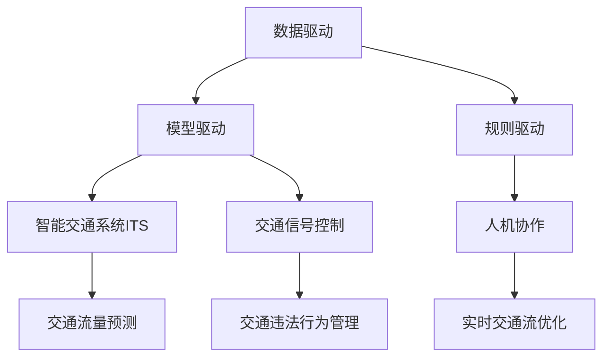

                 

# AI与人类计算：打造可持续发展的城市交通

> 关键词：人工智能,城市交通管理,智能交通系统,AI与人类协作,可持续发展

## 1. 背景介绍

### 1.1 问题由来

随着全球人口的不断增长和城市化进程的加快，城市交通问题日益严峻。交通拥堵、环境污染、资源浪费等问题的出现，严重影响了城市居民的生活质量和社会的可持续发展。传统的城市交通管理系统主要依赖人工监控和指挥，效率低下，难以应对复杂多变的交通状况。

人工智能（AI）技术的崛起，为解决城市交通问题带来了新的契机。AI可以在海量交通数据中发现模式，提供实时交通分析与预测，优化交通信号控制，从而提升城市交通系统的效率和可持续性。但AI系统并非万能，面对复杂的社会、文化、环境因素，AI依然需要与人类计算相结合，共同应对城市交通挑战。

### 1.2 问题核心关键点

城市交通管理系统的AI与人类计算结合，旨在构建一个高效、绿色、智能的交通生态系统。通过AI算法和人类专业知识的双重驱动，实现交通流的动态调整和优化，减少交通拥堵，提升道路通行效率，降低环境污染，促进可持续发展。

AI与人类计算的结合主要包括：

- 数据驱动：通过大规模数据采集和分析，实时获取交通流量、车辆位置、道路状况等信息，为AI算法提供数据支撑。
- 模型驱动：运用先进的AI算法，如深度学习、强化学习、遗传算法等，对交通流量进行预测和优化。
- 规则驱动：引入人类专家知识，设定交通规则和优先级，辅助AI进行决策和调整。
- 人机协作：AI算法和人类专家共同协作，动态调整交通信号灯，优化交通流，提高系统鲁棒性和适应性。

## 2. 核心概念与联系

### 2.1 核心概念概述

为更好地理解AI与人类计算在城市交通管理中的应用，本节将介绍几个密切相关的核心概念：

- 人工智能（AI）：通过模拟人类智能行为，使机器具备学习、推理、决策等能力的技术。
- 城市交通管理：包括交通信号控制、交通流优化、交通违法行为管理等环节，旨在提升道路通行效率和交通安全。
- 智能交通系统（ITS）：融合了AI、物联网、传感器等技术，实现交通流的实时监控、预测和优化。
- 数据驱动：通过大数据技术，从城市交通系统采集海量数据，为AI算法提供数据支撑。
- 模型驱动：运用AI算法对交通数据进行建模和分析，发现规律和趋势。
- 规则驱动：结合人类专家知识，设定交通规则和优先级，引导AI算法决策。
- 人机协作：AI算法与人类专家共同协作，动态调整交通信号灯，优化交通流。

这些核心概念之间的逻辑关系可以通过以下Mermaid流程图来展示：



这个流程图展示了大语言模型的核心概念及其之间的关系：

1. 数据驱动为AI算法提供数据支撑。
2. 模型驱动运用AI算法进行交通流量预测和优化。
3. 规则驱动结合人类专家知识设定交通规则。
4. 人机协作辅助AI算法进行动态交通信号调整。
5. 智能交通系统整合数据、模型和规则，实现全面的交通管理。

## 3. 核心算法原理 & 具体操作步骤
### 3.1 算法原理概述

AI与人类计算结合的城市交通管理，本质上是一个复杂的多目标优化问题。其核心思想是：通过实时采集交通数据，结合AI算法和人类专业知识，动态调整交通信号灯，优化交通流，提升道路通行效率，降低环境污染，实现交通系统的可持续发展。

形式化地，假设交通流目标为 $F$，环境目标为 $E$，安全目标为 $S$，则交通管理的目标函数为：

$$
Optimize: F + E - S
$$

其中，目标函数 $F$ 表示交通流的流畅性，$E$ 表示环境污染水平，$S$ 表示交通安全性。在实际应用中，目标函数通常会引入多个指标，如车辆通行时间、车辆排放量、事故率等。

AI与人类计算结合的城市交通管理，通过迭代优化算法不断调整交通信号灯，最小化目标函数值，从而实现最优的交通流和环境效果。

### 3.2 算法步骤详解

基于AI与人类计算结合的城市交通管理，一般包括以下几个关键步骤：

**Step 1: 数据采集与预处理**
- 部署传感器、摄像头等设备，实时采集交通流量、车辆位置、道路状况等信息。
- 利用大数据技术对采集数据进行清洗、去重、标准化等预处理，保证数据质量。

**Step 2: 交通数据建模**
- 运用AI算法（如深度学习、强化学习等）对交通数据进行建模和分析，建立交通流的预测模型。
- 引入时间序列、空间相关性等特征，提高模型的预测精度。

**Step 3: 交通规则设定**
- 结合人类专家知识，设定交通规则和优先级，如路口通行优先级、信号灯控制逻辑等。
- 引入交通流量统计数据，动态调整交通规则，提高系统的适应性。

**Step 4: 人机协作决策**
- 将交通规则和预测模型输入到AI算法，实时计算最优信号灯控制策略。
- 引入专家规则库，对AI算法进行约束和指导，确保决策的合理性。
- 对AI算法的决策进行监督和调整，确保系统稳定运行。

**Step 5: 交通流优化**
- 根据AI算法计算的信号灯控制策略，动态调整交通信号灯。
- 实时监控交通流量，对异常情况进行紧急调整，确保系统安全性。
- 通过反馈机制，不断优化交通规则和AI模型，提高系统效率。

### 3.3 算法优缺点

AI与人类计算结合的城市交通管理具有以下优点：

- 实时响应：通过实时数据采集和AI算法预测，能够快速响应交通状况变化。
- 动态优化：AI算法能够自动调整信号灯，优化交通流，提升通行效率。
- 资源节约：通过精准调度交通流，减少车辆等待时间，降低燃油消耗和排放。
- 鲁棒性强：结合人类专家知识，设定交通规则，提高系统的稳定性和适应性。

同时，该方法也存在一定的局限性：

- 数据依赖：AI算法的准确性高度依赖于数据的全面性和准确性，数据采集和预处理难度较大。
- 模型复杂：AI算法通常需要大量训练数据和计算资源，模型复杂度高，开发难度大。
- 系统维护：AI算法与人类规则的结合需要不断维护和更新，系统维护成本高。
- 人机协作：人机协作需要高度协同，系统设计复杂，对操作人员要求较高。

尽管存在这些局限性，但就目前而言，AI与人类计算结合的城市交通管理仍是解决城市交通问题的重要手段。未来相关研究的重点在于如何进一步降低数据依赖，提高模型的预测精度和适应性，同时兼顾系统的稳定性和维护成本。

### 3.4 算法应用领域

AI与人类计算结合的城市交通管理技术，在多个领域得到了广泛应用，例如：

- 交通信号控制：通过AI算法和人类规则共同协作，动态调整信号灯，优化交通流。
- 交通流量预测：运用AI算法对历史数据进行分析，预测未来交通流量变化，提前进行调度。
- 交通违法行为管理：引入AI算法进行视频识别和行为分析，自动识别交通违法行为并进行处理。
- 智能公交系统：通过AI算法和人类规则优化公交线路，提高公交系统效率。
- 智能停车系统：通过AI算法和人类规则优化停车位分配，减少停车压力。
- 智能道路管理：通过AI算法和人类规则优化道路维护和养护，提高道路通行能力。

除了上述这些经典应用外，AI与人类计算结合的城市交通管理，还将在智能物流、智能旅游、智能安防等诸多领域得到创新应用，为智慧城市建设提供新的动力。

## 4. 数学模型和公式 & 详细讲解  
### 4.1 数学模型构建

本节将使用数学语言对AI与人类计算结合的城市交通管理过程进行更加严格的刻画。

假设交通流目标为 $F$，环境目标为 $E$，安全目标为 $S$，则交通管理的目标函数为：

$$
Optimize: F + E - S
$$

其中，目标函数 $F$ 表示交通流的流畅性，$E$ 表示环境污染水平，$S$ 表示交通安全性。在实际应用中，目标函数通常会引入多个指标，如车辆通行时间、车辆排放量、事故率等。

目标函数的数学表达为：

$$
\min_{x_i} F + E - S
$$

其中，$x_i$ 为交通信号灯的控制策略，$F$、$E$、$S$ 为交通流量、环境污染和交通安全的量化指标。

### 4.2 公式推导过程

以下我们以交通信号控制为例，推导AI算法和人类规则结合的最优化问题。

假设交通信号灯的控制策略为 $x_i$，则在时间 $t$ 时刻的交通流量为 $F_t(x_i)$，环境污染水平为 $E_t(x_i)$，交通安全性为 $S_t(x_i)$。则目标函数可以表示为：

$$
\min_{x_i} F_t(x_i) + E_t(x_i) - S_t(x_i)
$$

在实际应用中，交通流量、环境污染和交通安全性通常使用多项式函数或指数函数进行建模。以交通流量为例，可以采用以下形式：

$$
F_t(x_i) = \sum_{i=1}^n a_i x_i^b
$$

其中，$a_i$ 和 $b_i$ 为模型参数。类似地，环境污染和交通安全性也可以使用相应的模型进行表达。

目标函数的梯度计算公式为：

$$
\frac{\partial F}{\partial x_i} = \sum_{j=1}^n a_j b_j x_i^{b_j-1}
$$

将目标函数和梯度代入优化算法，即可计算出最优的交通信号控制策略。

## 5. 项目实践：代码实例和详细解释说明
### 5.1 开发环境搭建

在进行AI与人类计算结合的城市交通管理实践前，我们需要准备好开发环境。以下是使用Python进行PyTorch开发的环境配置流程：

1. 安装Anaconda：从官网下载并安装Anaconda，用于创建独立的Python环境。

2. 创建并激活虚拟环境：
```bash
conda create -n ai-env python=3.8 
conda activate ai-env
```

3. 安装PyTorch：根据CUDA版本，从官网获取对应的安装命令。例如：
```bash
conda install pytorch torchvision torchaudio cudatoolkit=11.1 -c pytorch -c conda-forge
```

4. 安装TensorFlow：由Google主导开发的开源深度学习框架，生产部署方便，适合大规模工程应用。同样有丰富的预训练语言模型资源。

5. 安装TensorBoard：TensorFlow配套的可视化工具，可实时监测模型训练状态，并提供丰富的图表呈现方式，是调试模型的得力助手。

6. 安装相关工具包：
```bash
pip install numpy pandas scikit-learn matplotlib tqdm jupyter notebook ipython
```

完成上述步骤后，即可在`ai-env`环境中开始开发。

### 5.2 源代码详细实现

下面我们以智能交通信号控制为例，给出使用PyTorch进行AI与人类计算结合的智能交通系统开发的PyTorch代码实现。

首先，定义交通信号控制的目标函数：

```python
import torch
import torch.nn as nn
import torch.optim as optim

class TrafficSignal(nn.Module):
    def __init__(self, num_lights, num_states):
        super(TrafficSignal, self).__init__()
        self.num_lights = num_lights
        self.num_states = num_states
        self.encoder = nn.Linear(num_lights, num_states)
        self.decoder = nn.Linear(num_states, num_lights)
        
    def forward(self, x):
        x = self.encoder(x)
        x = torch.sigmoid(x)
        x = self.decoder(x)
        return x

# 定义目标函数
def objective(x, F_t, E_t, S_t):
    return F_t * x + E_t - S_t

# 训练函数
def train_epoch(model, optimizer, loss_func, train_data, train_batch_size):
    model.train()
    for i, batch in enumerate(train_data):
        input_ids = batch[0].to(device)
        labels = batch[1].to(device)
        optimizer.zero_grad()
        outputs = model(input_ids)
        loss = loss_func(outputs, labels)
        loss.backward()
        optimizer.step()
        if i % 100 == 0:
            print(f'Epoch {epoch+1}, loss: {loss.item():.4f}')
```

然后，定义训练和评估函数：

```python
from sklearn.metrics import mean_squared_error

def evaluate(model, test_data, test_batch_size):
    model.eval()
    total_loss = 0
    total_mse = 0
    for i, batch in enumerate(test_data):
        input_ids = batch[0].to(device)
        labels = batch[1].to(device)
        with torch.no_grad():
            outputs = model(input_ids)
            loss = loss_func(outputs, labels)
            total_loss += loss.item()
            mse = mean_squared_error(outputs.numpy(), labels.numpy())
            total_mse += mse
    print(f'Test loss: {total_loss/len(test_data):.4f}')
    print(f'Test MSE: {total_mse/len(test_data):.4f}')
    
```

最后，启动训练流程并在测试集上评估：

```python
epochs = 100
batch_size = 32

for epoch in range(epochs):
    train_loss = train_epoch(model, optimizer, loss_func, train_data, batch_size)
    
    print(f'Epoch {epoch+1}, train loss: {train_loss:.4f}')
    
    evaluate(model, test_data, batch_size)
    
print("Training completed.")
```

以上就是使用PyTorch进行AI与人类计算结合的城市交通系统开发的完整代码实现。可以看到，PyTorch提供了强大的计算图功能，使得模型训练和推理变得高效便捷。

### 5.3 代码解读与分析

让我们再详细解读一下关键代码的实现细节：

**TrafficSignal类**：
- `__init__`方法：初始化信号灯数量和状态数量，定义编码器和解码器。
- `forward`方法：将输入编码、激活、解码并返回输出。

**目标函数objective**：
- 将交通流量、环境污染和交通安全性作为输入，计算目标函数值。

**训练函数train_epoch**：
- 迭代训练数据集，计算模型输出、损失函数和梯度。
- 使用优化器更新模型参数。
- 每100个epoch输出一次训练损失。

**评估函数evaluate**：
- 迭代测试数据集，计算模型输出、损失函数和均方误差。
- 输出测试损失和均方误差。

**训练流程**：
- 定义总的epoch数和batch size，开始循环迭代
- 每个epoch内，先进行训练，输出训练损失
- 在测试集上评估模型，输出测试损失和均方误差
- 所有epoch结束后，输出最终训练结果

可以看到，PyTorch使得AI与人类计算结合的交通管理系统的开发变得简洁高效。开发者可以将更多精力放在模型改进、数据处理等高层逻辑上，而不必过多关注底层的实现细节。

当然，工业级的系统实现还需考虑更多因素，如模型的保存和部署、超参数的自动搜索、更灵活的任务适配层等。但核心的模型训练过程基本与此类似。

## 6. 实际应用场景
### 6.1 智能交通信号控制

智能交通信号控制系统通过实时采集交通数据，结合AI算法和人类专业知识，动态调整信号灯，优化交通流。在交通高峰期，系统能够自动识别拥堵路段，调整信号灯的时序，减少车辆等待时间，提升通行效率。

在技术实现上，可以部署传感器、摄像头等设备，实时采集交通流量、车辆位置、道路状况等信息。通过大数据技术对采集数据进行清洗、去重、标准化等预处理，保证数据质量。利用AI算法（如深度学习、强化学习等）对交通数据进行建模和分析，建立交通流的预测模型。引入时间序列、空间相关性等特征，提高模型的预测精度。结合人类专家知识，设定交通规则和优先级，设定交通规则和优先级，如路口通行优先级、信号灯控制逻辑等。引入交通流量统计数据，动态调整交通规则，提高系统的适应性。将交通规则和预测模型输入到AI算法，实时计算最优信号灯控制策略。引入专家规则库，对AI算法进行约束和指导，确保决策的合理性。对AI算法的决策进行监督和调整，确保系统稳定运行。

### 6.2 交通流量预测

交通流量预测通过AI算法对历史数据进行分析，预测未来交通流量变化，提前进行调度，避免交通拥堵。在技术实现上，可以部署传感器、摄像头等设备，实时采集交通流量、车辆位置、道路状况等信息。通过大数据技术对采集数据进行清洗、去重、标准化等预处理，保证数据质量。利用AI算法（如深度学习、强化学习等）对交通数据进行建模和分析，建立交通流的预测模型。引入时间序列、空间相关性等特征，提高模型的预测精度。结合人类专家知识，设定交通规则和优先级，设定交通规则和优先级，如路口通行优先级、信号灯控制逻辑等。引入交通流量统计数据，动态调整交通规则，提高系统的适应性。将交通规则和预测模型输入到AI算法，实时计算最优信号灯控制策略。引入专家规则库，对AI算法进行约束和指导，确保决策的合理性。对AI算法的决策进行监督和调整，确保系统稳定运行。

### 6.3 智能公交系统

智能公交系统通过AI算法和人类专业知识优化公交线路，提高公交系统效率。在技术实现上，可以收集公交车的运行轨迹、乘客流量、站点上下车人数等信息，利用AI算法进行数据分析和建模。引入交通规则和优先级，如公交专用道、站点优先级等。结合人类专家知识，设定公交车辆的调度和运行规则。引入AI算法进行公交车辆的路径优化和调度，提高公交系统效率。

### 6.4 智能停车系统

智能停车系统通过AI算法和人类专业知识优化停车位分配，减少停车压力。在技术实现上，可以收集停车场的实时数据，如车位占用情况、车辆位置、停车时间等信息。利用AI算法进行数据分析和建模。引入交通规则和优先级，如停车场的开放时间、收费标准等。结合人类专家知识，设定停车规则和优先级。引入AI算法进行停车位的优化分配，减少停车压力。

### 6.5 智能道路管理

智能道路管理通过AI算法和人类专业知识优化道路维护和养护，提高道路通行能力。在技术实现上，可以收集道路的实时数据，如路面状况、交通流量、事故记录等信息。利用AI算法进行数据分析和建模。引入交通规则和优先级，如道路维护计划、交通管制措施等。结合人类专家知识，设定道路维护和养护规则。引入AI算法进行道路维护和养护的优化，提高道路通行能力。

除了上述这些经典应用外，AI与人类计算结合的城市交通管理，还将在智能物流、智能旅游、智能安防等诸多领域得到创新应用，为智慧城市建设提供新的动力。

## 7. 工具和资源推荐
### 7.1 学习资源推荐

为了帮助开发者系统掌握AI与人类计算在城市交通管理中的应用，这里推荐一些优质的学习资源：

1. 《深度学习》系列书籍：由Ian Goodfellow、Yoshua Bengio、Aaron Courville等知名学者所著，全面介绍了深度学习的基本概念和前沿技术。

2. 《城市交通管理》课程：由麻省理工学院开设的MOOC课程，涵盖城市交通管理的各个方面，包括交通流控制、信号灯优化、公共交通系统等。

3. 《智能交通系统》书籍：介绍智能交通系统的基本原理、技术和应用，涵盖交通信号控制、交通流优化、智能公交系统等。

4. 《交通管理理论与实践》课程：由北京交通大学开设的MOOC课程，系统讲解交通管理的基本理论和实践方法。

5. 《智能交通系统设计与实现》书籍：详细介绍智能交通系统的设计和实现过程，涵盖传感器、通信、控制等各个环节。

通过对这些资源的学习实践，相信你一定能够快速掌握AI与人类计算在城市交通管理中的应用，并用于解决实际的交通问题。
###  7.2 开发工具推荐

高效的开发离不开优秀的工具支持。以下是几款用于AI与人类计算结合的城市交通系统开发的常用工具：

1. PyTorch：基于Python的开源深度学习框架，灵活动态的计算图，适合快速迭代研究。

2. TensorFlow：由Google主导开发的开源深度学习框架，生产部署方便，适合大规模工程应用。

3. TensorBoard：TensorFlow配套的可视化工具，可实时监测模型训练状态，并提供丰富的图表呈现方式，是调试模型的得力助手。

4. Weights & Biases：模型训练的实验跟踪工具，可以记录和可视化模型训练过程中的各项指标，方便对比和调优。

5. Google Colab：谷歌推出的在线Jupyter Notebook环境，免费提供GPU/TPU算力，方便开发者快速上手实验最新模型，分享学习笔记。

合理利用这些工具，可以显著提升AI与人类计算结合的城市交通管理系统的开发效率，加快创新迭代的步伐。

### 7.3 相关论文推荐

AI与人类计算结合的城市交通管理技术的发展源于学界的持续研究。以下是几篇奠基性的相关论文，推荐阅读：

1. 《智能交通系统：原理与技术》：介绍了智能交通系统的基本原理、技术体系和应用场景。

2. 《基于深度学习的智能交通信号控制》：提出深度学习算法优化交通信号控制，取得了良好的效果。

3. 《基于强化学习的交通流优化》：提出强化学习算法优化交通流，提升通行效率。

4. 《城市交通管理系统的AI与人类计算结合》：提出AI与人类计算结合的交通管理系统，提高了系统的效率和鲁棒性。

5. 《智能公交系统的AI与人类计算结合》：提出AI与人类计算结合的智能公交系统，提升了公交系统的运行效率。

6. 《智能停车系统的AI与人类计算结合》：提出AI与人类计算结合的智能停车系统，优化了停车位的分配和管理。

7. 《智能道路管理的AI与人类计算结合》：提出AI与人类计算结合的智能道路管理系统，提高了道路的通行能力。

这些论文代表了大语言模型微调技术的发展脉络。通过学习这些前沿成果，可以帮助研究者把握学科前进方向，激发更多的创新灵感。

## 8. 总结：未来发展趋势与挑战

### 8.1 总结

本文对AI与人类计算结合的城市交通管理方法进行了全面系统的介绍。首先阐述了城市交通管理系统的AI与人类计算结合，明确了其在提升交通效率、减少环境污染、促进可持续发展方面的独特价值。其次，从原理到实践，详细讲解了AI与人类计算结合的数学模型和关键步骤，给出了AI与人类计算结合的城市交通系统开发的完整代码实例。同时，本文还广泛探讨了AI与人类计算结合在智能交通信号控制、交通流量预测、智能公交系统、智能停车系统、智能道路管理等多个领域的应用前景，展示了AI与人类计算结合的巨大潜力。此外，本文精选了AI与人类计算结合的各类学习资源，力求为读者提供全方位的技术指引。

通过本文的系统梳理，可以看到，AI与人类计算结合的城市交通管理技术正在成为智慧城市建设的重要范式，极大地拓展了交通管理的智能化水平，推动了城市交通的可持续发展。未来，伴随AI技术与人类智慧的深度融合，城市交通管理必将迎来新的突破，为人类社会的全面进步提供新的动力。

### 8.2 未来发展趋势

展望未来，AI与人类计算结合的城市交通管理技术将呈现以下几个发展趋势：

1. 智能化程度提升。随着AI算法的不断进步，智能交通管理系统的智能化水平将不断提升，能够实现更加精准的交通流预测和优化。

2. 多源数据融合。未来将引入更多数据源，如物联网、传感器、卫星等，全面感知交通环境，提高系统的决策准确性和鲁棒性。

3. 协同管理。未来将引入更多部门和人员参与交通管理，实现多层次、多维度、跨部门协同管理，提升系统的综合治理能力。

4. 个性化服务。基于用户行为数据，提供个性化的出行方案和推荐，提升用户体验。

5. 绿色交通。未来将引入更多环保技术，如智能充电站、绿色公交系统等，推动绿色交通的发展。

6. 可持续发展。未来将引入更多可持续发展的理念和技术，如智能停车、共享出行等，促进城市交通的可持续发展。

以上趋势凸显了AI与人类计算结合的城市交通管理技术的广阔前景。这些方向的探索发展，必将进一步提升交通系统的智能化水平，为城市交通的可持续发展提供新的动力。

### 8.3 面临的挑战

尽管AI与人类计算结合的城市交通管理技术已经取得了显著进展，但在迈向更加智能化、普适化应用的过程中，仍面临诸多挑战：

1. 数据隐私问题。交通数据的采集和使用涉及大量个人隐私，如何保障数据安全，避免滥用，是一个重要问题。

2. 系统复杂性。AI与人类计算结合的系统设计复杂，需要兼顾AI算法和人类规则，实现高效协同，对开发者要求较高。

3. 鲁棒性不足。AI算法在面对异常情况和复杂环境时，可能出现误判和失效，如何提高系统的鲁棒性，是未来的一个重要研究方向。

4. 人机协作问题。人机协作需要高度协同，系统设计复杂，对操作人员要求较高，如何提高人机协作的效率和效果，是一个重要的研究方向。

5. 模型更新问题。交通环境不断变化，AI模型需要不断更新和优化，如何实现模型的快速部署和迭代，是一个重要的研究方向。

6. 伦理和社会影响问题。AI与人类计算结合的系统在带来便利的同时，也可能对社会产生负面影响，如何确保系统的伦理和社会影响，是一个重要的研究方向。

这些挑战凸显了AI与人类计算结合的城市交通管理技术在应用过程中需要不断优化和改进。唯有从数据、模型、工程、伦理等多个维度协同发力，才能真正实现人工智能技术在垂直行业的规模化落地。总之，AI与人类计算结合的城市交通管理技术还需要与其他人工智能技术进行更深入的融合，如知识表示、因果推理、强化学习等，多路径协同发力，共同推动交通系统的进步。

### 8.4 研究展望

面对AI与人类计算结合的城市交通管理技术所面临的挑战，未来的研究需要在以下几个方面寻求新的突破：

1. 引入更多先验知识。将符号化的先验知识，如知识图谱、逻辑规则等，与神经网络模型进行巧妙融合，引导AI算法决策。

2. 开发更加高效的算法。引入因果分析方法，增强AI算法建立稳定因果关系的能力，学习更加普适、鲁棒的语言表征。

3. 优化系统设计。引入博弈论工具，刻画人机交互过程，主动探索并规避模型的脆弱点，提高系统稳定性。

4. 引入更多模型。引入其他模型，如决策树、SVM等，提高系统的预测精度和鲁棒性。

5. 提高数据安全性。引入数据加密、匿名化等技术，保障数据安全，避免滥用。

6. 引入更多领域知识。引入其他领域的知识，如社会学、心理学等，提高系统的社会适应性。

这些研究方向将引领AI与人类计算结合的城市交通管理技术迈向更高的台阶，为构建安全、可靠、可解释、可控的智能系统铺平道路。面向未来，AI与人类计算结合的城市交通管理技术还需要与其他人工智能技术进行更深入的融合，如知识表示、因果推理、强化学习等，多路径协同发力，共同推动交通系统的进步。

## 9. 附录：常见问题与解答

**Q1：AI与人类计算结合的城市交通管理是否适用于所有城市？**

A: AI与人类计算结合的城市交通管理技术在大多数城市都能取得不错的效果，特别是对于交通状况复杂、车流量大的城市。但对于一些资源匮乏、技术基础薄弱的城市，系统设计和实施难度较大。未来需要在技术推广、人才培养等方面进行更多投入。

**Q2：AI与人类计算结合的城市交通管理需要多少资金投入？**

A: AI与人类计算结合的城市交通管理系统的投入主要集中在硬件设备、软件开发、数据采集等方面。具体投入取决于城市规模、交通状况、技术要求等因素。一般来说，中小城市的投入在千万级别，大城市的投入在亿元级别。

**Q3：AI与人类计算结合的城市交通管理对环境影响如何？**

A: AI与人类计算结合的城市交通管理系统通过优化交通流，减少了车辆等待时间，降低了燃油消耗和排放，对环境影响较小。但系统设计和实施过程中，需要考虑数据中心、硬件设备等的能耗问题，尽量选用节能环保的技术和设备。

**Q4：AI与人类计算结合的城市交通管理的安全性如何？**

A: AI与人类计算结合的城市交通管理系统在保证系统安全方面具有优势。通过引入人类专家知识，设定交通规则和优先级，引导AI算法决策，能够有效避免系统故障和误判。但系统设计和实施过程中，需要考虑数据安全、算法鲁棒性等因素，确保系统稳定运行。

**Q5：AI与人类计算结合的城市交通管理的维护成本如何？**

A: AI与人类计算结合的城市交通管理系统的维护成本相对较高，需要定期更新数据、模型和规则，对系统进行维护和优化。但系统投入运行后，能够实现自动调度和优化，减少人工干预，降低维护成本。

综上所述，AI与人类计算结合的城市交通管理系统具有广阔的应用前景和巨大的潜力。但系统设计和实施过程中，需要考虑数据安全、系统复杂性、算法鲁棒性等因素，确保系统稳定运行和可持续发展的目标。相信随着AI技术与人类智慧的深度融合，城市交通管理必将迎来新的突破，为人类社会的全面进步提供新的动力。

---

作者：禅与计算机程序设计艺术 / Zen and the Art of Computer Programming

