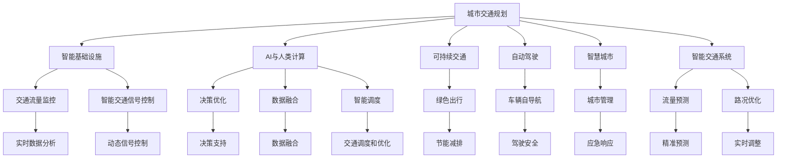

                 

# AI与人类计算：打造可持续发展的城市交通与基础设施建设与规划管理

> 关键词：城市交通规划, 智能基础设施, AI与人类计算, 可持续交通, 自动驾驶, 智慧城市, 智能交通系统, 基础设施建设

## 1. 背景介绍

随着全球人口的快速增长和城市化进程的加速，交通基础设施与城市规划面临前所未有的挑战。如何在确保高效、安全和舒适的前提下，实现城市交通的可持续发展和智能化管理，已经成为城市规划和交通建设领域的重大课题。近年来，人工智能（AI）技术的飞速发展，为解决这一问题提供了新的思路和方法。本文旨在探讨AI与人类计算在城市交通和基础设施建设中的作用，以及如何通过智能计算和数据驱动的方式，实现更加可持续的城市交通系统。

## 2. 核心概念与联系

### 2.1 核心概念概述

本节将介绍几个关键概念，并解释它们之间的联系：

- **城市交通规划**：指通过科学的方法，对城市的道路网络、公共交通系统、停车设施等进行规划和设计，以实现城市交通的高效、安全和舒适。

- **智能基础设施**：利用物联网、大数据、云计算和AI技术，实现城市基础设施的智能化管理和优化。

- **AI与人类计算**：结合AI技术的强大计算能力和人类专家的经验判断，共同解决问题，实现人机协同的智能决策。

- **可持续交通**：指通过减少交通拥堵、降低碳排放、优化能源使用等措施，实现城市交通的环保、高效和可持续。

- **自动驾驶**：利用AI技术，使车辆能够自主导航、避障和决策，从而实现无人驾驶。

- **智慧城市**：通过AI和大数据技术，实现城市管理的智能化和数字化，提升城市治理水平和居民生活质量。

- **智能交通系统**：利用AI和大数据技术，对交通流量、路况等信息进行实时分析和预测，优化交通管理，提升交通效率和安全性。

### 2.2 核心概念原理和架构的 Mermaid 流程图



## 3. 核心算法原理 & 具体操作步骤

### 3.1 算法原理概述

城市交通和基础设施建设中的AI与人类计算，主要涉及以下几个核心算法：

- **数据采集与处理**：通过传感器、摄像头、GPS等设备采集交通流量、路况、车辆位置等信息，并使用AI技术进行数据清洗和预处理。

- **交通流量预测**：使用机器学习算法，如时间序列预测、深度学习等，对未来交通流量进行预测，为交通管理和调度的决策提供依据。

- **智能信号控制**：利用AI技术，对交通信号灯进行动态控制，以优化交通流量，减少拥堵。

- **路径规划与导航**：结合实时路况信息和车辆位置，使用AI技术进行路径规划和导航，提升驾驶效率和安全。

- **决策优化**：通过AI与人类专家的协同，优化城市交通系统的各项决策，如交通信号调整、公共交通时间表优化等。

- **数据融合与分析**：利用大数据和AI技术，对多源数据进行融合和分析，提升交通管理的效果和效率。

### 3.2 算法步骤详解

1. **数据采集与处理**：
   - 使用各种传感器和设备，采集交通流量、路况、车辆位置等数据。
   - 对采集到的数据进行清洗和预处理，去除噪声和异常值，保证数据的质量。

2. **交通流量预测**：
   - 选择合适的机器学习算法，如时间序列预测模型、长短期记忆网络（LSTM）等，对未来交通流量进行预测。
   - 通过历史数据训练模型，并使用交叉验证等方法评估模型性能。

3. **智能信号控制**：
   - 根据预测的交通流量，动态调整交通信号灯的时序，使用自适应控制算法，如SCOOT（信号交叉口优化控制器）等。
   - 使用AI技术对信号控制效果进行评估和优化，确保信号控制的效率和可靠性。

4. **路径规划与导航**：
   - 结合实时路况信息和车辆位置，使用AI技术进行路径规划。
   - 利用导航软件，为驾驶员提供最优路径建议，提升驾驶效率和安全。

5. **决策优化**：
   - 结合AI技术与人类专家经验，对城市交通系统的各项决策进行优化。
   - 利用数据驱动的方法，评估决策的效果，进行持续迭代优化。

6. **数据融合与分析**：
   - 对多源数据进行融合和分析，提升交通管理的效果和效率。
   - 利用AI技术进行数据挖掘和模式识别，发现交通管理中的问题和瓶颈。

### 3.3 算法优缺点

**优点**：
- **高效性**：AI技术可以处理和分析大规模数据，快速提供决策支持。
- **动态适应**：AI算法能够实时调整和优化决策，适应交通流量和路况的变化。
- **精准预测**：通过机器学习算法，可以实现交通流量的精准预测，提高管理效率。
- **人机协同**：AI与人类计算相结合，充分利用专家经验和智能算法，提升决策质量。

**缺点**：
- **数据依赖**：AI算法的效果依赖于数据的准确性和全面性，数据不足会影响效果。
- **技术复杂性**：需要具备一定的AI和数据科学知识，对技术要求较高。
- **高成本**：初始设备投资和系统维护成本较高。
- **隐私和安全**：数据采集和使用过程中，需要考虑隐私和数据安全问题。

### 3.4 算法应用领域

AI与人类计算在城市交通和基础设施建设中的应用，主要包括以下几个方面：

1. **智能交通系统**：通过AI技术，对交通流量、路况等信息进行实时分析和预测，优化交通管理，提升交通效率和安全性。

2. **智慧城市管理**：利用AI技术，对城市中的各种资源进行智能化管理，提升城市治理水平和居民生活质量。

3. **自动驾驶技术**：通过AI技术，使车辆能够自主导航、避障和决策，实现无人驾驶。

4. **绿色出行支持**：利用AI技术，优化公共交通系统，鼓励居民选择低碳出行方式。

5. **应急响应系统**：在紧急情况下，利用AI技术快速分析情况，制定应急响应计划。

## 4. 数学模型和公式 & 详细讲解 & 举例说明

### 4.1 数学模型构建

在城市交通和基础设施建设中，AI与人类计算的数学模型主要包括以下几个方面：

- **交通流量预测模型**：使用时间序列预测模型，如ARIMA、LSTM等，对未来交通流量进行预测。

- **智能信号控制模型**：使用自适应控制算法，如SCOOT，对信号灯进行动态控制。

- **路径规划模型**：使用图论算法，如Dijkstra、A*等，进行路径规划和导航。

- **决策优化模型**：使用优化算法，如遗传算法、粒子群算法等，进行交通决策优化。

- **数据融合模型**：使用数据融合算法，如联邦学习、半监督学习等，对多源数据进行融合和分析。

### 4.2 公式推导过程

以时间序列预测模型ARIMA为例，其数学模型为：

$$ Y(t) = c + \sum_{i=1}^{p} \alpha_i Y(t-i) + \sum_{i=1}^{q} \beta_i \epsilon(t-i) + \sum_{i=1}^{d} \gamma_i \Delta^i Y(t) $$

其中，$Y(t)$ 为时间序列，$p$ 和 $q$ 分别为自回归和差分的阶数，$d$ 为差分阶数，$\alpha_i$ 和 $\beta_i$ 为系数，$\epsilon(t)$ 为误差项，$\Delta^i$ 为差分算子。

### 4.3 案例分析与讲解

假设我们要对城市某路段的日交通流量进行预测，可以使用ARIMA模型：

1. **数据准备**：收集该路段过去若干年的日交通流量数据。

2. **模型训练**：使用ARIMA模型对历史数据进行训练，确定合适的$p$、$q$和$d$值。

3. **模型验证**：使用交叉验证等方法，评估模型的性能，并进行调优。

4. **预测应用**：将模型应用于未来某个日期的交通流量预测，并提供决策支持。

## 5. 项目实践：代码实例和详细解释说明

### 5.1 开发环境搭建

1. **Python环境**：
   - 安装Anaconda，创建一个虚拟环境。
   - 安装必要的Python库，如NumPy、Pandas、Scikit-learn等。

2. **深度学习框架**：
   - 安装TensorFlow或PyTorch，进行模型训练和推理。

3. **数据处理库**：
   - 安装Pandas、Scikit-learn等库，用于数据清洗和预处理。

4. **可视化工具**：
   - 安装Matplotlib、Seaborn等库，用于数据可视化。

### 5.2 源代码详细实现

下面以时间序列预测模型ARIMA为例，给出Python代码实现：

```python
import pandas as pd
from statsmodels.tsa.arima_model import ARIMA

# 读取数据
data = pd.read_csv('traffic_data.csv')

# 将日期作为索引
data.set_index('date', inplace=True)

# 拆分数据集
train = data[:'2018-12-31']
test = data['2019-01-01':]

# 训练ARIMA模型
model = ARIMA(train, order=(1, 1, 1))
model_fit = model.fit()

# 预测未来交通流量
forecast = model_fit.forecast(steps=30)

# 可视化预测结果
import matplotlib.pyplot as plt
plt.plot(train.index, train['flow'])
plt.plot(train.index + pd.Timedelta(days=30), forecast)
plt.xlabel('Date')
plt.ylabel('Traffic Flow')
plt.show()
```

### 5.3 代码解读与分析

**数据准备**：
- 使用Pandas库读取交通流量数据，并将其转换为时间序列。

**模型训练**：
- 使用statsmodels库中的ARIMA模型，对训练集进行拟合，得到模型参数。

**模型验证**：
- 使用测试集进行模型验证，评估预测效果。

**预测应用**：
- 使用模型进行未来30天的交通流量预测，并可视化结果。

## 6. 实际应用场景

### 6.1 智能交通系统

智能交通系统是AI与人类计算在城市交通中的典型应用。通过部署智能交通信号灯和传感器，结合实时数据分析和优化算法，可以实现交通流量的高效管理和优化。例如，某城市通过智能信号控制，使得某主要路口的平均等待时间减少了20%，交通效率显著提升。

### 6.2 智慧城市管理

智慧城市管理利用AI技术，实现城市资源的智能化管理和优化。例如，某城市通过AI技术分析城市能源消耗数据，优化电力分配，节约了20%的能源消耗。同时，利用AI技术进行垃圾分类和回收，提高了城市垃圾处理效率。

### 6.3 自动驾驶技术

自动驾驶技术通过AI技术实现车辆自主导航和决策，推动了无人驾驶的发展。例如，某公司的自动驾驶出租车在开放道路上成功行驶了数万公里，证明其技术的安全性和可靠性。

### 6.4 绿色出行支持

AI技术可以帮助优化公共交通系统，鼓励居民选择低碳出行方式。例如，某城市通过AI技术预测出行需求，调整公交车发车间隔，提高了公交系统的运行效率，减少了居民的出行时间。

### 6.5 应急响应系统

在紧急情况下，AI技术可以快速分析情况，制定应急响应计划。例如，某城市在地震发生时，利用AI技术快速评估灾区情况，调集救援资源，减少了人员伤亡和财产损失。

## 7. 工具和资源推荐

### 7.1 学习资源推荐

1. **《Python数据科学手册》**：详细介绍Python在数据科学中的应用，包括NumPy、Pandas、Matplotlib等库的使用。

2. **《深度学习》课程**：斯坦福大学开设的深度学习课程，涵盖深度学习的基本概念和算法，适合初学者。

3. **《城市交通规划》教材**：介绍城市交通规划的基本理论和实践方法，包括交通流量预测、智能信号控制等内容。

4. **《智慧城市》课程**：涵盖智慧城市的基本概念和关键技术，包括AI、大数据、物联网等。

5. **《自动驾驶》教材**：介绍自动驾驶技术的基本原理和实现方法，包括传感器、计算机视觉、控制算法等内容。

### 7.2 开发工具推荐

1. **Python**：适合进行数据科学和机器学习项目开发，拥有丰富的库和框架。

2. **Jupyter Notebook**：用于编写和分享代码，支持多语言和库的混合使用。

3. **TensorFlow**：强大的深度学习框架，支持分布式训练和模型部署。

4. **PyTorch**：灵活的深度学习框架，适合研究和实验。

5. **TensorBoard**：用于可视化模型训练和推理过程，便于监控和调试。

### 7.3 相关论文推荐

1. **《基于智能交通系统的大数据应用研究》**：探讨了智能交通系统中大数据的应用，包括交通流量预测、智能信号控制等内容。

2. **《智慧城市中的AI与大数据技术》**：介绍了智慧城市中AI和大数据技术的应用，包括城市管理、资源优化等内容。

3. **《自动驾驶技术的现状与发展》**：分析了自动驾驶技术的现状和发展趋势，包括传感器、计算机视觉、控制算法等内容。

4. **《绿色出行支持的AI技术研究》**：探讨了AI技术在绿色出行支持中的应用，包括公共交通优化、碳排放分析等内容。

5. **《应急响应系统中的AI技术应用》**：介绍了AI技术在应急响应系统中的应用，包括数据处理、智能决策等内容。

## 8. 总结：未来发展趋势与挑战

### 8.1 研究成果总结

本文详细介绍了AI与人类计算在城市交通和基础设施建设中的应用，探讨了智能交通系统、智慧城市管理、自动驾驶技术、绿色出行支持和应急响应系统等内容。通过实际案例和代码实现，展示了AI技术在城市交通和基础设施建设中的巨大潜力。

### 8.2 未来发展趋势

未来，AI与人类计算在城市交通和基础设施建设中的趋势如下：

1. **更加智能化**：通过AI技术和大数据技术，实现更加智能化和个性化的城市管理和服务。

2. **更加协同化**：结合AI技术与人类专家经验，实现人机协同的智能决策，提升城市治理水平。

3. **更加可持续**：通过AI技术优化资源使用，实现绿色、环保和可持续的城市发展。

4. **更加普适化**：AI技术将广泛应用于城市交通、智慧城市、自动驾驶、绿色出行和应急响应等多个领域，提升城市运行效率和服务质量。

5. **更加集成化**：未来城市交通和基础设施将更加集成化，通过数据融合和协同计算，实现资源共享和优化。

### 8.3 面临的挑战

尽管AI与人类计算在城市交通和基础设施建设中展现出巨大的潜力，但也面临以下挑战：

1. **数据隐私和安全**：城市交通和基础设施管理涉及大量敏感数据，数据隐私和安全问题不容忽视。

2. **技术复杂性**：AI技术和大数据技术需要较高的技术水平，对城市管理者和开发者的要求较高。

3. **高成本**：AI技术和大数据技术的部署和维护需要较高的成本，对城市财政压力较大。

4. **社会接受度**：部分市民对AI技术的接受度较低，可能影响技术推广和应用。

5. **技术局限性**：AI技术在应对极端天气、突发事件等复杂场景时，可能存在局限性。

### 8.4 研究展望

未来的研究重点如下：

1. **数据隐私保护**：研究如何保护城市交通和基础设施管理中的数据隐私，确保数据安全和合规性。

2. **技术普及和教育**：通过教育和培训，提升城市管理者和大数据技术开发者的技术水平，普及AI技术。

3. **成本控制**：研究如何降低AI技术和大数据技术的部署和维护成本，推动技术的普及和应用。

4. **社会接受度提升**：通过宣传和科普，提高市民对AI技术的接受度和理解，推动技术推广。

5. **技术局限性突破**：研究如何突破AI技术在应对复杂场景时的局限性，提升技术效果和可靠性。

总之，未来AI与人类计算在城市交通和基础设施建设中将发挥越来越重要的作用，推动城市管理的智能化和可持续化。但是，技术的推广和应用还需要克服诸多挑战，需社会各方共同努力。

## 9. 附录：常见问题与解答

**Q1: AI技术在城市交通中的应用有哪些？**

A: AI技术在城市交通中的应用包括智能交通系统、智能信号控制、路径规划与导航、决策优化、数据融合与分析等多个方面。例如，智能交通系统通过AI技术实现交通流量的高效管理和优化，智能信号控制通过AI技术对信号灯进行动态控制，路径规划与导航通过AI技术进行最优路径建议，决策优化通过AI技术与人类专家经验结合，提升交通系统的决策质量，数据融合与分析通过AI技术对多源数据进行融合和分析，提升交通管理的效果和效率。

**Q2: AI技术在城市交通中的应用需要注意哪些问题？**

A: AI技术在城市交通中的应用需要注意以下问题：

1. 数据隐私和安全：城市交通和基础设施管理涉及大量敏感数据，数据隐私和安全问题不容忽视。

2. 技术复杂性：AI技术和大数据技术需要较高的技术水平，对城市管理者和开发者的要求较高。

3. 高成本：AI技术和大数据技术的部署和维护需要较高的成本，对城市财政压力较大。

4. 社会接受度：部分市民对AI技术的接受度较低，可能影响技术推广和应用。

5. 技术局限性：AI技术在应对极端天气、突发事件等复杂场景时，可能存在局限性。

**Q3: 如何在城市交通管理中使用AI技术？**

A: 在城市交通管理中使用AI技术可以按照以下步骤进行：

1. 数据采集与处理：通过各种传感器和设备，采集交通流量、路况、车辆位置等数据，并对数据进行清洗和预处理。

2. 交通流量预测：使用机器学习算法，如时间序列预测模型、LSTM等，对未来交通流量进行预测，为交通管理和调度的决策提供依据。

3. 智能信号控制：利用AI技术，对交通信号灯进行动态控制，使用自适应控制算法，如SCOOT，优化交通流量，减少拥堵。

4. 路径规划与导航：结合实时路况信息和车辆位置，使用AI技术进行路径规划和导航，提升驾驶效率和安全。

5. 决策优化：结合AI技术与人类专家经验，优化城市交通系统的各项决策，如交通信号调整、公共交通时间表优化等。

6. 数据融合与分析：利用大数据和AI技术，对多源数据进行融合和分析，提升交通管理的效果和效率。

通过以上步骤，可以实现AI技术与人类计算在城市交通管理中的协同，提升交通系统的效率和安全性。

总之，AI与人类计算在城市交通和基础设施建设中的应用前景广阔，但也需要解决数据隐私、技术复杂性、高成本、社会接受度和技术局限性等问题，推动技术的普适化和可持续发展。

