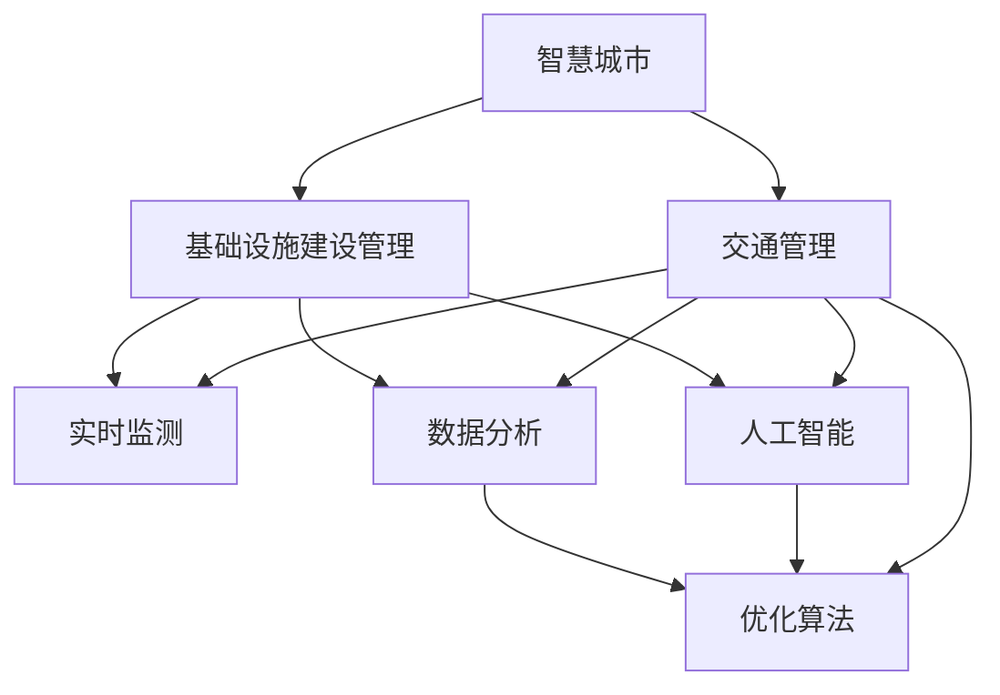

                 

# AI与人类计算：打造可持续发展的城市交通管理系统与基础设施建设管理

> 关键词：智慧城市,交通管理,基础设施,人工智能,计算模型,优化算法,实时监测,数据分析,城市规划

## 1. 背景介绍

### 1.1 问题由来

随着城镇化进程的加速和汽车保有量的持续增长，城市交通拥堵问题愈发严重，已经成为制约城市发展的重要瓶颈。如何在保持经济增长的同时，缓解城市交通压力，提升城市管理效率，是当前各国政府和研究者共同关注的重要课题。

与此同时，城市基础设施建设的管理也面临着严峻的挑战。如何科学规划、高效建设、维护和更新城市基础设施，以满足不断增长的城市需求，同样需要有效的管理和优化手段。

为了解决这些问题，国内外学者和政府机构积极探索智能化、数据化的解决方案，AI与人类计算的结合逐渐成为行业共识。通过AI技术，可以实现对交通状况的实时监测与预测，提升交通管理效率；通过数据驱动的管理方式，可以有效提升基础设施建设的质量和效率。

### 1.2 问题核心关键点

AI与人类计算在城市交通管理和基础设施建设中的应用，关键在于以下几个方面：

1. **数据采集与整合**：需要大规模、高精度的数据支持，如交通流量、气象数据、地籍信息、传感器数据等。
2. **模型构建与优化**：利用机器学习、深度学习等技术，构建交通管理与基础设施建设的优化模型。
3. **实时监控与预测**：通过实时数据流和预测算法，实现对交通状况和基础设施状态的动态监测和预测。
4. **决策支持与优化**：通过数据驱动的决策支持系统，辅助交通管理者和城市规划者做出最优决策。
5. **可扩展性与可持续性**：系统应具备良好的可扩展性，能够随着城市规模的扩大和需求的变化不断优化和升级。

本文将围绕这些问题，系统探讨AI与人类计算在城市交通管理系统与基础设施建设管理中的应用，介绍核心概念、技术原理、实际案例和未来展望。

## 2. 核心概念与联系

### 2.1 核心概念概述

在AI与人类计算的应用场景中，涉及多个核心概念和技术：

- **智慧城市（Smart City）**：以信息技术、智能技术为核心，融合城市管理、社会治理、公共服务等多个方面，实现城市运行的智能化和高效化。
- **交通管理（Traffic Management）**：通过对交通流量的实时监控、预测和优化，提升城市交通的通行效率，减少拥堵和事故。
- **基础设施建设管理（Infrastructure Management）**：通过数据驱动的规划和优化，提升基础设施的建设和维护效率，确保其高效、可靠运行。
- **人工智能（AI）**：通过机器学习、深度学习等技术，实现对复杂数据的高效处理和智能决策。
- **计算模型（Computational Model）**：构建数学或模拟模型，辅助城市管理和决策。
- **优化算法（Optimization Algorithm）**：如遗传算法、模拟退火等，用于求解复杂优化问题。
- **实时监测（Real-Time Monitoring）**：通过传感器、摄像头等技术，实现对交通状况和基础设施状态的实时监控。
- **数据分析（Data Analysis）**：利用数据挖掘、统计分析等方法，从海量的数据中提取有价值的信息。
- **城市规划（Urban Planning）**：根据城市发展需求，科学规划城市交通和基础设施布局。

这些概念通过合理融合，能够形成综合性的智慧城市管理方案，实现城市交通和基础设施的高效、智能、可持续发展。

### 2.2 核心概念原理和架构的 Mermaid 流程图



这个流程图展示了智慧城市管理中各核心概念之间的联系：

1. 智慧城市通过交通管理和基础设施建设管理两大领域的应用，提升城市运行的智能化水平。
2. 交通管理和基础设施建设管理都需要实时监测和数据分析，用于提供准确的信息支持。
3. 人工智能和优化算法是提升管理和决策效率的关键技术手段。

## 3. 核心算法原理 & 具体操作步骤

### 3.1 算法原理概述

AI与人类计算在城市交通管理和基础设施建设管理中的应用，主要包括以下几个方面：

- **交通流预测与优化**：利用机器学习算法，对历史交通数据进行建模，预测未来的交通流量和拥堵状况，并根据预测结果优化交通信号灯和路线规划。
- **基础设施状态监控与维护**：通过传感器等技术，实时监测基础设施（如道路、桥梁、地下管道等）的状态，利用数据分析和预测模型，及时发现问题并进行维护。
- **城市规划与决策支持**：基于数据分析和AI模型，辅助城市规划者进行交通网络规划、基础设施建设优化和资源配置决策。

这些应用的核心在于通过数据驱动的方式，实现对城市运行状况的动态监测和预测，提升决策的科学性和效率。

### 3.2 算法步骤详解

以下以交通流预测与优化为例，详细介绍AI与人类计算在城市交通管理中的应用步骤：

**Step 1: 数据收集与预处理**

- 收集城市道路的交通流量数据、交通信号灯数据、气象数据、车辆GPS轨迹等。
- 清洗数据，去除噪声和异常值，进行数据归一化处理。

**Step 2: 构建预测模型**

- 利用历史交通流量数据，构建时间序列预测模型，如ARIMA、LSTM等。
- 加入天气、节假日、大型活动等外部因素的影响，提高预测准确性。

**Step 3: 模型训练与评估**

- 将收集到的数据集分为训练集和验证集，使用训练集训练模型。
- 在验证集上评估模型性能，调整模型参数和预测窗口大小。

**Step 4: 实时预测与决策支持**

- 实时获取交通流量和天气数据，输入模型进行预测。
- 根据预测结果，优化交通信号灯和路线规划，缓解交通拥堵。

**Step 5: 反馈与迭代优化**

- 定期收集实际交通流量数据，与预测结果进行对比，更新模型参数。
- 不断优化模型，提高预测精度和决策支持效率。

### 3.3 算法优缺点

AI与人类计算在城市交通管理和基础设施建设管理中的应用，具有以下优点：

1. **实时性**：通过实时数据流和预测算法，实现对交通状况和基础设施状态的动态监测和预测，提升管理效率。
2. **准确性**：利用数据驱动的方式，通过机器学习和深度学习算法，提高预测和决策的准确性。
3. **可扩展性**：系统具备良好的可扩展性，能够随着城市规模的扩大和需求的变化不断优化和升级。

同时，也存在一些缺点：

1. **数据依赖**：需要大规模、高精度的数据支持，数据质量影响模型的预测效果。
2. **计算资源需求高**：机器学习和深度学习算法对计算资源的需求较高，需要高性能计算平台支撑。
3. **模型复杂性**：模型的构建和优化较为复杂，需要专业知识和经验。

### 3.4 算法应用领域

AI与人类计算在城市交通管理和基础设施建设管理中的应用，涵盖多个领域：

- **智能交通系统（ITS）**：通过实时监测和智能决策，实现交通信号灯、道路标识等智能设施的优化管理。
- **城市防灾减灾**：利用传感器和数据分析，实时监测自然灾害风险，辅助应急响应和资源配置。
- **公共安全管理**：通过监控和数据分析，提高城市公共安全管理水平，预防和应对各类安全事件。
- **城市能源管理**：利用数据分析和优化算法，实现城市能源的高效利用和管理。
- **城市环境监测**：通过传感器和数据分析，监测城市空气质量、水质等环境指标，辅助环境保护决策。

## 4. 数学模型和公式 & 详细讲解 & 举例说明

### 4.1 数学模型构建

在城市交通管理和基础设施建设管理中，常用的数学模型包括时间序列预测模型、图模型、优化模型等。

**时间序列预测模型**：如ARIMA（自回归积分滑动平均模型）、LSTM（长短期记忆网络）等，用于对历史交通流量数据进行建模，预测未来的流量和拥堵状况。

**图模型**：如Graph Neural Network（GNN），用于分析交通网络的结构和属性，优化交通路线规划。

**优化模型**：如遗传算法、模拟退火等，用于求解复杂优化问题，如基础设施的布局和维护。

### 4.2 公式推导过程

以时间序列预测模型ARIMA为例，推导其基本原理和公式。

时间序列预测模型的基本形式为：

$$
y_t = \phi(B)y_{t-1} + \theta(B) \epsilon_t + \eta_t
$$

其中，$y_t$ 为时间$t$的预测值，$\phi(B)$ 为自回归项，$\theta(B)$ 为差分项，$\epsilon_t$ 为随机误差项，$\eta_t$ 为季节性成分。

对于ARIMA模型，其自回归和差分项可以分解为：

$$
\phi(B) = \sum_{i=1}^p \phi_iB^i
$$

$$
\theta(B) = \sum_{i=1}^d \theta_iB^i
$$

其中，$B$ 为后移算子，$\phi_i$ 和$\theta_i$ 为模型的参数。

通过对历史交通流量数据进行平稳化处理和自相关分析，可以确定ARIMA模型的具体参数，进而进行预测。

### 4.3 案例分析与讲解

以下以智慧停车管理为例，介绍AI与人类计算在城市基础设施建设管理中的应用。

**案例背景**：智慧停车管理通过实时监测和数据分析，优化城市停车资源的分配和使用，减少交通拥堵和停车难问题。

**数据收集与预处理**：利用传感器和监控摄像头，收集停车场车位状态、车辆进出数据、停车费支付信息等。清洗数据，进行数据归一化处理。

**模型构建与训练**：构建基于LSTM的预测模型，利用历史数据训练模型，预测停车场车位状态和未来流量。

**实时预测与决策支持**：实时获取停车场数据和车辆进出信息，输入模型进行预测，优化停车位分配和使用。

**反馈与迭代优化**：定期收集实际数据，与预测结果进行对比，更新模型参数，不断优化预测精度和决策支持效率。

## 5. 项目实践：代码实例和详细解释说明

### 5.1 开发环境搭建

为了进行AI与人类计算的实践，需要搭建相应的开发环境：

- **Python环境**：安装Python 3.x版本，建议使用Anaconda管理环境。
- **数据采集工具**：使用Python的Pandas、NumPy等库，进行数据处理和分析。
- **机器学习框架**：安装Scikit-Learn、TensorFlow等机器学习框架，进行模型构建和训练。
- **可视化工具**：安装Matplotlib、Seaborn等库，进行数据可视化分析。

### 5.2 源代码详细实现

以下是基于Python和TensorFlow实现时间序列预测的示例代码：

```python
import tensorflow as tf
from tensorflow.keras.models import Sequential
from tensorflow.keras.layers import LSTM, Dense

# 数据预处理
def prepare_data(data):
    # 归一化处理
    data = (data - data.mean()) / data.std()
    return data

# 构建LSTM模型
def build_model(input_shape, output_shape):
    model = Sequential([
        LSTM(64, input_shape=input_shape, return_sequences=True),
        LSTM(32, return_sequences=True),
        Dense(output_shape)
    ])
    return model

# 模型训练与评估
def train_model(model, train_data, validation_data, epochs, batch_size):
    model.compile(loss='mse', optimizer='adam')
    model.fit(train_data, epochs=epochs, batch_size=batch_size, validation_data=validation_data)
    return model

# 实时预测与决策支持
def predict(model, data):
    prediction = model.predict(data)
    return prediction

# 数据收集与预处理
train_data = prepare_data(data)

# 模型构建与训练
model = build_model(input_shape=(1, 1), output_shape=1)
model = train_model(model, train_data, validation_data, epochs=10, batch_size=32)

# 实时预测与决策支持
real_time_data = prepare_data(real_time_data)
prediction = predict(model, real_time_data)
```

### 5.3 代码解读与分析

以上代码展示了使用TensorFlow和Keras库进行时间序列预测的基本流程：

- **数据预处理**：使用归一化处理，将数据缩放到[0, 1]范围内。
- **模型构建**：构建基于LSTM的预测模型，包含两个LSTM层和一个全连接层。
- **模型训练与评估**：使用均方误差损失函数和Adam优化器，在训练集上进行模型训练，并在验证集上评估模型性能。
- **实时预测与决策支持**：使用训练好的模型，对实时数据进行预测。

## 6. 实际应用场景

### 6.1 智能交通系统

在智能交通系统中，AI与人类计算的应用可以显著提升交通管理的效率和安全性。

**应用场景**：智能交通信号灯系统、智能公交调度、智能高速公路管理等。

**实际案例**：某市智能交通信号灯系统通过实时监测交通流量和车辆速度，动态调整信号灯时长，提升交叉口通行效率，减少交通拥堵和事故率。

### 6.2 城市防灾减灾

城市防灾减灾是智慧城市管理的重要组成部分，AI与人类计算的应用可以有效提升防灾减灾的效率和效果。

**应用场景**：灾害监测与预警、应急响应与调度等。

**实际案例**：某市智慧城市防灾减灾系统通过传感器和气象数据，实时监测自然灾害风险，辅助应急响应和资源配置，减少灾害造成的损失。

### 6.3 公共安全管理

公共安全管理是智慧城市的重要组成部分，AI与人类计算的应用可以提高公共安全管理的水平和效率。

**应用场景**：视频监控分析、紧急事件响应等。

**实际案例**：某市智慧公共安全管理系统通过视频监控和数据分析，实时识别异常行为，辅助警方快速响应，提高社会治安水平。

### 6.4 未来应用展望

未来，随着AI与人类计算技术的不断进步，其在城市交通管理和基础设施建设管理中的应用将更加广泛和深入：

1. **智能城市基础设施建设**：通过数据分析和优化算法，实现基础设施建设的优化规划和高效管理。
2. **智慧城市生态系统**：将交通管理、基础设施建设、公共安全管理等多个领域进行融合，构建智能化的城市生态系统。
3. **智能驾驶与自动驾驶**：通过AI技术，实现智能驾驶和自动驾驶，提升交通系统的安全性和效率。
4. **智能城市环境管理**：通过数据分析和优化算法，实现城市环境的高效管理和保护。

## 7. 工具和资源推荐

### 7.1 学习资源推荐

为了帮助开发者系统掌握AI与人类计算在城市交通管理和基础设施建设中的应用，推荐以下学习资源：

1. **《智慧城市管理与优化》系列课程**：提供关于智慧城市管理、智能交通系统、基础设施建设管理的全面课程，涵盖数据采集、数据分析、模型构建等多个方面。
2. **《机器学习实战》系列书籍**：详细介绍机器学习算法和实践应用，包括时间序列预测、优化算法等。
3. **《城市规划与智慧城市建设》系列论文**：涵盖城市交通网络规划、基础设施建设优化、公共安全管理等多个领域的最新研究成果。
4. **《智慧城市基础设施建设与管理》专题研讨**：提供行业专家和学者的交流平台，分享最新技术和应用经验。

### 7.2 开发工具推荐

以下是几款用于AI与人类计算实践的常用工具：

1. **TensorFlow**：基于Python的开源深度学习框架，适合大规模机器学习和深度学习项目。
2. **Keras**：基于TensorFlow的高级神经网络API，简化模型构建和训练过程。
3. **Jupyter Notebook**：交互式的数据分析和模型训练平台，支持Python代码的实时执行和展示。
4. **PyTorch**：基于Python的开源深度学习框架，灵活性和可扩展性较强。
5. **Matplotlib**：Python的可视化库，支持绘制复杂的数据可视化图表。

### 7.3 相关论文推荐

AI与人类计算在城市交通管理和基础设施建设管理中的应用，涉及多个交叉领域，推荐以下相关论文：

1. **《基于深度学习的城市交通流量预测》**：介绍深度学习模型在交通流量预测中的应用，提高预测精度。
2. **《城市基础设施建设管理中的优化算法》**：探讨遗传算法、模拟退火等优化算法在基础设施建设管理中的应用。
3. **《智慧城市防灾减灾的AI驱动方法》**：介绍AI技术在灾害监测和应急响应中的应用，提高防灾减灾效率。
4. **《智能城市交通管理中的数据驱动决策》**：探讨数据分析和机器学习在交通管理中的应用，提高决策的科学性和效率。

## 8. 总结：未来发展趋势与挑战

### 8.1 研究成果总结

本文详细介绍了AI与人类计算在城市交通管理和基础设施建设管理中的应用，涵盖数据采集与预处理、模型构建与优化、实时监测与预测等多个方面。通过系统的理论分析和实际案例展示，为相关领域的研究者和实践者提供了参考和借鉴。

### 8.2 未来发展趋势

未来，AI与人类计算在城市交通管理和基础设施建设管理中的应用将呈现以下几个发展趋势：

1. **数据驱动的决策支持**：通过大规模、高精度的数据支持，实现更加智能和高效的决策。
2. **智能化的基础设施建设**：通过数据分析和优化算法，提升基础设施建设的效率和质量。
3. **全域化的智慧城市管理**：将交通管理、公共安全管理、环境管理等多个领域进行融合，构建全域化的智慧城市生态系统。
4. **智能驾驶与自动驾驶**：通过AI技术，实现智能驾驶和自动驾驶，提升交通系统的安全性和效率。
5. **可扩展与可持续的智慧城市**：构建可扩展、可持续的智慧城市基础设施和管理体系，适应城市规模的变化和需求的变化。

### 8.3 面临的挑战

尽管AI与人类计算在城市交通管理和基础设施建设管理中的应用前景广阔，但仍面临诸多挑战：

1. **数据质量和隐私问题**：大规模、高精度的数据采集和处理需要保证数据质量，同时要保护用户隐私。
2. **模型复杂性**：复杂的模型需要高计算资源和专业技能，推广应用难度较大。
3. **跨领域融合难度**：交通管理、公共安全管理、环境管理等多个领域的数据和算法融合复杂，需要协调各方利益和需求。
4. **政策和技术标准**：需要制定合理的政策和技术标准，确保智慧城市管理和建设的规范化和标准化。
5. **伦理和安全问题**：AI技术的应用需要考虑伦理和安全问题，避免算法偏见和不公平。

### 8.4 研究展望

未来，需要在以下几个方面进行深入研究和探索：

1. **跨领域融合技术**：研究和开发跨领域融合技术，解决不同领域数据和算法的融合问题，构建全域化的智慧城市管理平台。
2. **智能基础设施**：研究和开发智能基础设施，提高基础设施的智能化水平和运营效率。
3. **隐私保护技术**：研究和开发隐私保护技术，确保大规模数据采集和处理的隐私安全。
4. **伦理和安全框架**：制定合理的伦理和安全框架，保障AI技术的应用安全性和公平性。
5. **可持续发展技术**：研究和开发可持续发展的智慧城市管理技术，实现城市的绿色发展和资源高效利用。

## 9. 附录：常见问题与解答

**Q1: 智能交通系统如何实现交通信号灯的动态调整？**

A: 智能交通系统通过实时监测交通流量和车辆速度，构建交通流预测模型，动态调整交通信号灯时长，实现交通流量的优化。具体实现方式包括：

1. 通过传感器和摄像头，实时采集交通流量和车辆速度数据。
2. 将数据输入到时间序列预测模型（如ARIMA、LSTM等）进行预测。
3. 根据预测结果，优化交通信号灯时长，缓解交通拥堵。
4. 定期更新模型参数，确保预测准确性。

**Q2: 城市防灾减灾系统中如何实现灾害监测与预警？**

A: 城市防灾减灾系统通过传感器和气象数据，实时监测自然灾害风险，实现灾害监测与预警。具体实现方式包括：

1. 部署各类传感器，实时采集地震、洪水、滑坡等自然灾害数据。
2. 利用数据分析和机器学习算法，构建灾害监测模型。
3. 根据模型预测结果，进行灾害预警和应急响应。
4. 定期更新模型参数，确保预测准确性。

**Q3: 智能驾驶与自动驾驶技术如何提升交通系统的安全性？**

A: 智能驾驶与自动驾驶技术通过AI技术，提升交通系统的安全性。具体实现方式包括：

1. 利用摄像头、激光雷达等传感器，实时采集道路和车辆数据。
2. 利用计算机视觉和深度学习算法，实现目标检测、语义分割等任务。
3. 通过决策规划算法，生成最优驾驶路径和速度。
4. 定期更新模型参数，确保安全性和准确性。

**Q4: 如何确保AI与人类计算应用中的数据隐私和安全？**

A: 在AI与人类计算应用中，确保数据隐私和安全是至关重要的。具体措施包括：

1. 数据匿名化处理：对用户数据进行去标识化处理，保护用户隐私。
2. 数据加密传输：在数据传输过程中，使用加密技术保护数据安全。
3. 访问控制机制：对数据访问进行严格控制，确保只有授权用户可以访问敏感数据。
4. 模型透明性：确保AI模型的透明性，提供可解释的决策依据。
5. 安全审计机制：定期进行安全审计，发现和修复潜在的安全漏洞。

**Q5: 如何在城市基础设施建设管理中提高效率和质量？**

A: 在城市基础设施建设管理中，通过数据分析和优化算法，可以提高效率和质量。具体措施包括：

1. 利用BIM（建筑信息模型）技术，实现基础设施的数字化建模和管理。
2. 通过数据分析，识别基础设施的薄弱环节和潜在风险。
3. 利用优化算法，制定最优的基础设施建设方案。
4. 定期评估基础设施的使用情况，进行维护和更新。

通过以上措施，可以实现城市基础设施的高效、智能、可持续管理，为城市发展和居民生活提供更好的保障。

---

作者：禅与计算机程序设计艺术 / Zen and the Art of Computer Programming

