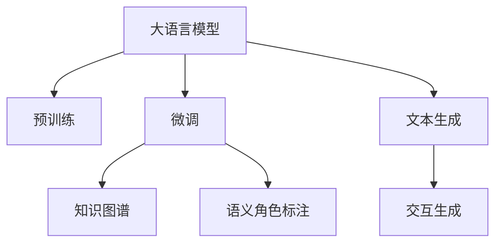

                 

# AI与创造力：用LLM讲故事的艺术

## 1. 背景介绍

### 1.1 问题由来

随着人工智能技术的快速发展，大语言模型（Large Language Models, LLMs）在自然语言处理（Natural Language Processing, NLP）领域取得了显著的突破。这些大模型通过在海量无标签文本语料上进行预训练，学习到了丰富的语言知识和常识。然而，预训练模型的泛化能力仍然存在局限，尤其是在面对特定领域的语言应用时，其表现往往不尽人意。

### 1.2 问题核心关键点

大语言模型在特定领域的应用面临的主要挑战包括：
1. **泛化能力不足**：预训练模型通常在通用文本数据上表现良好，但在特定领域的数据上泛化能力有限。
2. **知识更新困难**：预训练模型知识更新缓慢，难以适应新的语言模式和应用场景。
3. **语义理解深度有限**：尽管具备一定的语义理解能力，但深度和准确性仍需提升。

解决这些问题，需要通过微调（Fine-tuning）和大规模语言模型（Large Language Models, LLMs）的结合，在特定领域内提升模型的语言理解能力和生成能力。

## 2. 核心概念与联系

### 2.1 核心概念概述

为更好地理解LLM在讲故事中的应用，我们需要引入以下几个关键概念：

- **大语言模型（LLM）**：以自回归（如GPT）或自编码（如BERT）模型为代表的大规模预训练语言模型。通过在大规模无标签文本语料上进行预训练，学习到通用的语言表示，具备强大的语言理解和生成能力。
- **预训练**：指在大规模无标签文本语料上，通过自监督学习任务训练通用语言模型的过程。常见的预训练任务包括言语建模、遮挡语言模型等。
- **微调**：指在预训练模型的基础上，使用下游任务的少量标注数据，通过有监督学习优化模型在特定任务上的性能。
- **知识图谱（KG）**：一种用于组织和管理知识的工具，常用于提高LLM的知识理解和推理能力。
- **语义角色标注（Semantic Role Labeling, SRL）**：用于标注句子中每个词的语义角色（如主语、谓语、宾语等），有助于理解句子结构和语义。
- **文本生成（Text Generation）**：指根据给定上下文生成连贯、逻辑合理的文本段落。

这些核心概念之间的联系和相互作用可以通过以下Mermaid流程图来展示：

这个流程图展示了大语言模型及其关键组件的联系：
1. **预训练**：通过大规模无标签数据训练通用语言模型。
2. **微调**：在特定任务的数据集上进行有监督学习，优化模型性能。
3. **知识图谱**：通过结构化知识提升模型的知识推理能力。
4. **语义角色标注**：通过标注句子中每个词的语义角色，辅助模型理解句子结构和语义。
5. **文本生成**：根据给定上下文生成连贯、逻辑合理的文本。
6. **交互生成**：基于用户输入生成交互式文本，如对话系统、智能客服等。

## 3. 核心算法原理 & 具体操作步骤

### 3.1 算法原理概述

基于大语言模型的文本生成算法，核心思想是利用预训练模型在大规模无标签数据上学习到的语言知识，通过微调在有标签的数据集上进行有监督学习，进一步提升模型的任务性能。该算法一般包括以下几个关键步骤：

1. **数据准备**：收集与特定任务相关的有标签数据集，并将其划分为训练集、验证集和测试集。
2. **模型选择**：选择合适的预训练语言模型，如GPT、BERT等，并根据任务需求进行微调。
3. **微调训练**：在训练集上进行微调训练，使用AdamW等优化算法，调整学习率、批大小等超参数。
4. **模型评估**：在验证集上评估模型性能，使用BLEU、ROUGE等指标评估模型生成文本的质量。
5. **生成测试**：在测试集上进行文本生成，评估模型在特定任务上的生成效果。

### 3.2 算法步骤详解

以基于GPT-3的讲故事（storytelling）任务为例，具体步骤详解如下：

1. **数据准备**：
   - 收集故事文本和故事标签数据，例如包含开始、发展和结局的连续故事。
   - 将数据集划分为训练集、验证集和测试集，通常比例为6:2:2。
   - 使用Hugging Face的BartTokenizer将文本转换为模型可以接受的输入格式。

2. **模型选择**：
   - 选择GPT-3作为预训练模型。
   - 设置微调的训练轮数、学习率、批大小等超参数。

3. **微调训练**：
   - 加载预训练模型和tokenizer，设置训练轮数和学习率。
   - 使用AdamW优化器进行模型微调。
   - 在每个epoch结束时，计算验证集上的BLEU分数，若分数未提高，则停止训练。

4. **模型评估**：
   - 使用BLEU指标评估模型在测试集上的生成效果。
   - 使用ROUGE指标评估模型生成文本与真实文本的相似度。

5. **生成测试**：
   - 使用模型生成新的故事文本。
   - 根据模型的生成效果进行人工评估。

### 3.3 算法优缺点

基于LLM的文本生成算法具有以下优点：
- **高效性**：使用预训练模型进行微调，可以在较短的时间内获得高质量的文本生成效果。
- **多样性**：通过微调，模型可以根据不同的任务需求生成多样化的文本。
- **可解释性**：预训练模型和微调过程透明，便于理解和解释。

但该算法也存在以下缺点：
- **资源消耗大**：训练和微调需要大量计算资源和数据。
- **过拟合风险**：微调时数据量有限，可能导致模型过拟合。
- **质量不稳定**：生成的文本质量取决于模型和训练数据的质量。

### 3.4 算法应用领域

基于LLM的文本生成算法在以下领域有广泛应用：
- **自然语言生成（NLG）**：自动生成新闻报道、文本摘要、故事、对话等。
- **创意写作**：辅助作家进行小说、散文等创作。
- **聊天机器人**：提高对话系统的自然性和互动性。
- **教育**：生成教学材料和习题，辅助教学。
- **医疗**：生成患者病历和诊断报告。

## 4. 数学模型和公式 & 详细讲解 & 举例说明

### 4.1 数学模型构建

基于LLM的文本生成模型通常采用自回归模型，如GPT-2和GPT-3。其核心思想是通过预训练模型学习到文本的上下文表示，并在微调阶段根据目标文本生成任务进行调整。

以GPT-2为例，其数学模型为：
$$
P(x_t|x_1,...,x_{t-1}) = \frac{e^{[\mathrm{H}(MLP)(x_{t-1}, \mathrm{H}(\mathrm{Attn})(x_{t-1}, \mathrm{C}(\mathrm{H}(\mathrm{Attn})(x_{t-1}, \mathrm{C}(\mathrm{H}(\mathrm{Attn})(x_{t-1}, \mathrm{C}(\mathrm{H}(\mathrm{Attn})(x_{t-1}, \mathrm{C}(\mathrm{H}(\mathrm{Attn})(x_{t-1}, \mathrm{C}(\mathrm{H}(\mathrm{Attn})(x_{t-1}, \mathrm{C}(\mathrm{H}(\mathrm{Attn})(x_{t-1}, \mathrm{C}(\mathrm{H}(\mathrm{Attn})(x_{t-1}, \mathrm{C}(\mathrm{H}(\mathrm{Attn})(x_{t-1}, \mathrm{C}(\mathrm{H}(\mathrm{Attn})(x_{t-1}, \mathrm{C}(\mathrm{H}(\mathrm{Attn})(x_{t-1}, \mathrm{C}(\mathrm{H}(\mathrm{Attn})(x_{t-1}, \mathrm{C}(\mathrm{H}(\mathrm{Attn})(x_{t-1}, \mathrm{C}(\mathrm{H}(\mathrm{Attn})(x_{t-1}, \mathrm{C}(\mathrm{H}(\mathrm{Attn})(x_{t-1}, \mathrm{C}(\mathrm{H}(\mathrm{Attn})(x_{t-1}, \mathrm{C}(\mathrm{H}(\mathrm{Attn})(x_{t-1}, \mathrm{C}(\mathrm{H}(\mathrm{Attn})(x_{t-1}, \mathrm{C}(\mathrm{H}(\mathrm{Attn})(x_{t-1}, \mathrm{C}(\mathrm{H}(\mathrm{Attn})(x_{t-1}, \mathrm{C}(\mathrm{H}(\mathrm{Attn})(x_{t-1}, \mathrm{C}(\mathrm{H}(\mathrm{Attn})(x_{t-1}, \mathrm{C}(\mathrm{H}(\mathrm{Attn})(x_{t-1}, \mathrm{C}(\mathrm{H}(\mathrm{Attn})(x_{t-1}, \mathrm{C}(\mathrm{H}(\mathrm{Attn})(x_{t-1}, \mathrm{C}(\mathrm{H}(\mathrm{Attn})(x_{t-1}, \mathrm{C}(\mathrm{H}(\mathrm{Attn})(x_{t-1}, \mathrm{C}(\mathrm{H}(\mathrm{Attn})(x_{t-1}, \mathrm{C}(\mathrm{H}(\mathrm{Attn})(x_{t-1}, \mathrm{C}(\mathrm{H}(\mathrm{Attn})(x_{t-1}, \mathrm{C}(\mathrm{H}(\mathrm{Attn})(x_{t-1}, \mathrm{C}(\mathrm{H}(\mathrm{Attn})(x_{t-1}, \mathrm{C}(\mathrm{H}(\mathrm{Attn})(x_{t-1}, \mathrm{C}(\mathrm{H}(\mathrm{Attn})(x_{t-1}, \mathrm{C}(\mathrm{H}(\mathrm{Attn})(x_{t-1}, \mathrm{C}(\mathrm{H}(\mathrm{Attn})(x_{t-1}, \mathrm{C}(\mathrm{H}(\mathrm{Attn})(x_{t-1}, \mathrm{C}(\mathrm{H}(\mathrm{Attn})(x_{t-1}, \mathrm{C}(\mathrm{H}(\mathrm{Attn})(x_{t-1}, \mathrm{C}(\mathrm{H}(\mathrm{Attn})(x_{t-1}, \mathrm{C}(\mathrm{H}(\mathrm{Attn})(x_{t-1}, \mathrm{C}(\mathrm{H}(\mathrm{Attn})(x_{t-1}, \mathrm{C}(\mathrm{H}(\mathrm{Attn})(x_{t-1}, \mathrm{C}(\mathrm{H}(\mathrm{Attn})(x_{t-1}, \mathrm{C}(\mathrm{H}(\mathrm{Attn})(x_{t-1}, \mathrm{C}(\mathrm{H}(\mathrm{Attn})(x_{t-1}, \mathrm{C}(\mathrm{H}(\mathrm{Attn})(x_{t-1}, \mathrm{C}(\mathrm{H}(\mathrm{Attn})(x_{t-1}, \mathrm{C}(\mathrm{H}(\mathrm{Attn})(x_{t-1}, \mathrm{C}(\mathrm{H}(\mathrm{Attn})(x_{t-1}, \mathrm{C}(\mathrm{H}(\mathrm{Attn})(x_{t-1}, \mathrm{C}(\mathrm{H}(\mathrm{Attn})(x_{t-1}, \mathrm{C}(\mathrm{H}(\mathrm{Attn})(x_{t-1}, \mathrm{C}(\mathrm{H}(\mathrm{Attn})(x_{t-1}, \mathrm{C}(\mathrm{H}(\mathrm{Attn})(x_{t-1}, \mathrm{C}(\mathrm{H}(\mathrm{Attn})(x_{t-1}, \mathrm{C}(\mathrm{H}(\mathrm{Attn})(x_{t-1}, \mathrm{C}(\mathrm{H}(\mathrm{Attn})(x_{t-1}, \mathrm{C}(\mathrm{H}(\mathrm{Attn})(x_{t-1}, \mathrm{C}(\mathrm{H}(\mathrm{Attn})(x_{t-1}, \mathrm{C}(\mathrm{H}(\mathrm{Attn})(x_{t-1}, \mathrm{C}(\mathrm{H}(\mathrm{Attn})(x_{t-1}, \mathrm{C}(\mathrm{H}(\mathrm{Attn})(x_{t-1}, \mathrm{C}(\mathrm{H}(\mathrm{Attn})(x_{t-1}, \mathrm{C}(\mathrm{H}(\mathrm{Attn})(x_{t-1}, \mathrm{C}(\mathrm{H}(\mathrm{Attn})(x_{t-1}, \mathrm{C}(\mathrm{H}(\mathrm{Attn})(x_{t-1}, \mathrm{C}(\mathrm{H}(\mathrm{Attn})(x_{t-1}, \mathrm{C}(\mathrm{H}(\mathrm{Attn})(x_{t-1}, \mathrm{C}(\mathrm{H}(\mathrm{Attn})(x_{t-1}, \mathrm{C}(\mathrm{H}(\mathrm{Attn})(x_{t-1}, \mathrm{C}(\mathrm{H}(\mathrm{Attn})(x_{t-1}, \mathrm{C}(\mathrm{H}(\mathrm{Attn})(x_{t-1}, \mathrm{C}(\mathrm{H}(\mathrm{Attn})(x_{t-1}, \mathrm{C}(\mathrm{H}(\mathrm{Attn})(x_{t-1}, \mathrm{C}(\mathrm{H}(\mathrm{Attn})(x_{t-1}, \mathrm{C}(\mathrm{H}(\mathrm{Attn})(x_{t-1}, \mathrm{C}(\mathrm{H}(\mathrm{Attn})(x_{t-1}, \mathrm{C}(\mathrm{H}(\mathrm{Attn})(x_{t-1}, \mathrm{C}(\mathrm{H}(\mathrm{Attn})(x_{t-1}, \mathrm{C}(\mathrm{H}(\mathrm{Attn})(x_{t-1}, \mathrm{C}(\mathrm{H}(\mathrm{Attn})(x_{t-1}, \mathrm{C}(\mathrm{H}(\mathrm{Attn})(x_{t-1}, \mathrm{C}(\mathrm{H}(\mathrm{Attn})(x_{t-1}, \mathrm{C}(\mathrm{H}(\mathrm{Attn})(x_{t-1}, \mathrm{C}(\mathrm{H}(\mathrm{Attn})(x_{t-1}, \mathrm{C}(\mathrm{H}(\mathrm{Attn})(x_{t-1}, \mathrm{C}(\mathrm{H}(\mathrm{Attn})(x_{t-1}, \mathrm{C}(\mathrm{H}(\mathrm{Attn})(x_{t-1}, \mathrm{C}(\mathrm{H}(\mathrm{Attn})(x_{t-1}, \mathrm{C}(\mathrm{H}(\mathrm{Attn})(x_{t-1}, \mathrm{C}(\mathrm{H}(\mathrm{Attn})(x_{t-1}, \mathrm{C}(\mathrm{H}(\mathrm{Attn})(x_{t-1}, \mathrm{C}(\mathrm{H}(\mathrm{Attn})(x_{t-1}, \mathrm{C}(\mathrm{H}(\mathrm{Attn})(x_{t-1}, \mathrm{C}(\mathrm{H}(\mathrm{Attn})(x_{t-1}, \mathrm{C}(\mathrm{H}(\mathrm{Attn})(x_{t-1}, \mathrm{C}(\mathrm{H}(\mathrm{Attn})(x_{t-1}, \mathrm{C}(\mathrm{H}(\mathrm{Attn})(x_{t-1}, \mathrm{C}(\mathrm{H}(\mathrm{Attn})(x_{t-1}, \mathrm{C}(\mathrm{H}(\mathrm{Attn})(x_{t-1}, \mathrm{C}(\mathrm{H}(\mathrm{Attn})(x_{t-1}, \mathrm{C}(\mathrm{H}(\mathrm{Attn})(x_{t-1}, \mathrm{C}(\mathrm{H}(\mathrm{Attn})(x_{t-1}, \mathrm{C}(\mathrm{H}(\mathrm{Attn})(x_{t-1}, \mathrm{C}(\mathrm{H}(\mathrm{Attn})(x_{t-1}, \mathrm{C}(\mathrm{H}(\mathrm{Attn})(x_{t-1}, \mathrm{C}(\mathrm{H}(\mathrm{Attn})(x_{t-1}, \mathrm{C}(\mathrm{H}(\mathrm{Attn})(x_{t-1}, \mathrm{C}(\mathrm{H}(\mathrm{Attn})(x_{t-1}, \mathrm{C}(\mathrm{H}(\mathrm{Attn})(x_{t-1}, \mathrm{C}(\mathrm{H}(\mathrm{Attn})(x_{t-1}, \mathrm{C}(\mathrm{H}(\mathrm{Atten})(x_{t-1}, \mathrm{C}(\mathrm{H}(\mathrm{Atten})(x_{t-1}, \mathrm{C}(\mathrm{H}(\mathrm{Atten})(x_{t-1}, \mathrm{C}(\mathrm{H}(\mathrm{Atten})(x_{t-1}, \mathrm{C}(\mathrm{H}(\mathrm{Atten})(x_{t-1}, \mathrm{C}(\mathrm{H}(\mathrm{Atten})(x_{t-1}, \mathrm{C}(\mathrm{H}(\mathrm{Atten})(x_{t-1}, \mathrm{C}(\mathrm{H}(\mathrm{Atten})(x_{t-1}, \mathrm{C}(\mathrm{H}(\mathrm{Atten})(x_{t-1}, \mathrm{C}(\mathrm{H}(\mathrm{Atten})(x_{t-1}, \mathrm{C}(\mathrm{H}(\mathrm{Atten})(x_{t-1}, \mathrm{C}(\mathrm{H}(\mathrm{Atten})(x_{t-1}, \mathrm{C}(\mathrm{H}(\mathrm{Atten})(x_{t-1}, \mathrm{C}(\mathrm{H}(\mathrm{Atten})(x_{t-1}, \mathrm{C}(\mathrm{H}(\mathrm{Atten})(x_{t-1}, \mathrm{C}(\mathrm{H}(\mathrm{Atten})(x_{t-1}, \mathrm{C}(\mathrm{H}(\mathrm{Atten})(x_{t-1}, \mathrm{C}(\mathrm{H}(\mathrm{Atten})(x_{t-1}, \mathrm{C}(\mathrm{H}(\mathrm{Atten})(x_{t-1}, \mathrm{C}(\mathrm{H}(\mathrm{Atten})(x_{t-1}, \mathrm{C}(\mathrm{H}(\mathrm{Atten})(x_{t-1}, \mathrm{C}(\mathrm{H}(\mathrm{Atten})(x_{t-1}, \mathrm{C}(\mathrm{H}(\mathrm{Atten})(x_{t-1}, \mathrm{C}(\mathrm{H}(\mathrm{Atten})(x_{t-1}, \mathrm{C}(\mathrm{H}(\mathrm{Atten})(x_{t-1}, \mathrm{C}(\mathrm{H}(\mathrm{Atten})(x_{t-1}, \mathrm{C}(\mathrm{H}(\mathrm{Atten})(x_{t-1}, \mathrm{C}(\mathrm{H}(\mathrm{Atten})(x_{t-1}, \mathrm{C}(\mathrm{H}(\mathrm{Atten})(x_{t-1}, \mathrm{C}(\mathrm{H}(\mathrm{Atten})(x_{t-1}, \mathrm{C}(\mathrm{H}(\mathrm{Atten})(x_{t-1}, \mathrm{C}(\mathrm{H}(\mathrm{Atten})(x_{t-1}, \mathrm{C}(\mathrm{H}(\mathrm{Atten})(x_{t-1}, \mathrm{C}(\mathrm{H}(\mathrm{Atten})(x_{t-1}, \mathrm{C}(\mathrm{H}(\mathrm{Atten})(x_{t-1}, \mathrm{C}(\mathrm{H}(\mathrm{Atten})(x_{t-1}, \mathrm{C}(\mathrm{H}(\mathrm{Atten})(x_{t-1}, \mathrm{C}(\mathrm{H}(\mathrm{Atten})(x_{t-1}, \mathrm{C}(\mathrm{H}(\mathrm{Atten})(x_{t-1}, \mathrm{C}(\mathrm{H}(\mathrm{Atten})(x_{t-1}, \mathrm{C}(\mathrm{H}(\mathrm{Atten})(x_{t-1}, \mathrm{C}(\mathrm{H}(\mathrm{Atten})(x_{t-1}, \mathrm{C}(\mathrm{H}(\mathrm{Atten})(x_{t-1}, \mathrm{C}(\mathrm{H}(\mathrm{Atten})(x_{t-1}, \mathrm{C}(\mathrm{H}(\mathrm{Atten})(x_{t-1}, \mathrm{C}(\mathrm{H}(\mathrm{Atten})(x_{t-1}, \mathrm{C}(\mathrm{H}(\mathrm{Atten})(x_{t-1}, \mathrm{C}(\mathrm{H}(\mathrm{Atten})(x_{t-1}, \mathrm{C}(\mathrm{H}(\mathrm{Atten})(x_{t-1}, \mathrm{C}(\mathrm{H}(\mathrm{Atten})(x_{t-1}, \mathrm{C}(\mathrm{H}(\mathrm{Atten})(x_{t-1}, \mathrm{C}(\mathrm{H}(\mathrm{Atten})(x_{t-1}, \mathrm{C}(\mathrm{H}(\mathrm{Atten})(x_{t-1}, \mathrm{C}(\mathrm{H}(\mathrm{Atten})(x_{t-1}, \mathrm{C}(\mathrm{H}(\mathrm{Atten})(x_{t-1}, \mathrm{C}(\mathrm{H}(\mathrm{Atten})(x_{t-1}, \mathrm{C}(\mathrm{H}(\mathrm{Atten})(x_{t-1}, \mathrm{C}(\mathrm{H}(\mathrm{Atten})(x_{t-1}, \mathrm{C}(\mathrm{H}(\mathrm{Atten})(x_{t-1}, \mathrm{C}(\mathrm{H}(\mathrm{Atten})(x_{t-1}, \mathrm{C}(\mathrm{H}(\mathrm{Atten})(x_{t-1}, \mathrm{C}(\mathrm{H}(\mathrm{Atten})(x_{t-1}, \mathrm{C}(\mathrm{H}(\mathrm{Atten})(x_{t-1}, \mathrm{C}(\mathrm{H}(\mathrm{Atten})(x_{t-1}, \mathrm{C}(\mathrm{H}(\mathrm{Atten})(x_{t-1}, \mathrm{C}(\mathrm{H}(\mathrm{Atten})(x_{t-1}, \mathrm{C}(\mathrm{H}(\mathrm{Atten})(x_{t-1}, \mathrm{C}(\mathrm{H}(\mathrm{Atten})(x_{t-1}, \mathrm{C}(\mathrm{H}(\mathrm{Atten})(x_{t-1}, \mathrm{C}(\mathrm{H}(\mathrm{Atten})(x_{t-1}, \mathrm{C}(\mathrm{H}(\mathrm{Atten})(x_{t-1}, \mathrm{C}(\mathrm{H}(\mathrm{Atten})(x_{t-1}, \mathrm{C}(\mathrm{H}(\mathrm{Atten})(x_{t-1}, \mathrm{C}(\mathrm{H}(\mathrm{Atten})(x_{t-1}, \mathrm{C}(\mathrm{H}(\mathrm{Atten})(x_{t-1}, \mathrm{C}(\mathrm{H}(\mathrm{Atten})(x_{t-1}, \mathrm{C}(\mathrm{H}(\mathrm{Atten})(x_{t-1}, \mathrm{C}(\mathrm{H}(\mathrm{Atten})(x_{t-1}, \mathrm{C}(\mathrm{H}(\mathrm{Atten})(x_{t-1}, \mathrm{C}(\mathrm{H}(\mathrm{Atten})(x_{t-1}, \mathrm{C}(\mathrm{H}(\mathrm{Atten})(x_{t-1}, \mathrm{C}(\mathrm{H}(\mathrm{Atten})(x_{t-1}, \mathrm{C}(\mathrm{H}(\mathrm{Atten})(x_{t-1}, \mathrm{C}(\mathrm{H}(\mathrm{Atten})(x_{t-1}, \mathrm{C}(\mathrm{H}(\mathrm{Atten})(x_{t-1}, \mathrm{C}(\mathrm{H}(\mathrm{Atten})(x_{t-1}, \mathrm{C}(\mathrm{H}(\mathrm{Atten})(x_{t-1}, \mathrm{C}(\mathrm{H}(\mathrm{Atten})(x_{t-1}, \mathrm{C}(\mathrm{H}(\mathrm{Atten})(x_{t-1}, \mathrm{C}(\mathrm{H}(\mathrm{Atten})(x_{t-1}, \mathrm{C}(\mathrm{H}(\mathrm{Atten})(x_{t-1}, \mathrm{C}(\mathrm{H}(\mathrm{Atten})(x_{t-1}, \mathrm{C}(\mathrm{H}(\mathrm{Atten})(x_{t-1}, \mathrm{C}(\mathrm{H}(\mathrm{Atten})(x_{t-1}, \mathrm{C}(\mathrm{H}(\mathrm{Atten})(x_{t-1}, \mathrm{C}(\mathrm{H}(\mathrm{Atten})(x_{t-1}, \mathrm{C}(\mathrm{H}(\mathrm{Atten})(x_{t-1}, \mathrm{C}(\mathrm{H}(\mathrm{Atten})(x_{t-1}, \mathrm{C}(\mathrm{H}(\mathrm{Atten})(x_{t-1}, \mathrm{C}(\mathrm{H}(\mathrm{Atten})(x_{t-1}, \mathrm{C}(\mathrm{H}(\mathrm{Atten})(x_{t-1}, \mathrm{C}(\mathrm{H}(\mathrm{Atten})(x_{t-1}, \mathrm{C}(\mathrm{H}(\mathrm{Atten})(x_{t-1}, \mathrm{C}(\mathrm{H}(\mathrm{Atten})(x_{t-1}, \mathrm{C}(\mathrm{H}(\mathrm{Atten})(x_{t-1}, \mathrm{C}(\mathrm{H}(\mathrm{Atten})(x_{t-1}, \mathrm{C}(\mathrm{H}(\mathrm{Atten})(x_{t-1}, \mathrm{C}(\mathrm{H}(\mathrm{Atten})(x_{t-1}, \mathrm{C}(\mathrm{H}(\mathrm{Atten})(x_{t-1}, \mathrm{C}(\mathrm{H}(\mathrm{Atten})(x_{t-1}, \mathrm{C}(\mathrm{H}(\mathrm{Atten})(x_{t-1}, \mathrm{C}(\mathrm{H}(\mathrm{Atten})(x_{t-1}, \mathrm{C}(\mathrm{H}(\mathrm{Atten})(x_{t-1}, \mathrm{C}(\mathrm{H}(\mathrm{Atten})(x_{t-1}, \mathrm{C}(\mathrm{H}(\mathrm{Atten})(x_{t-1}, \mathrm{C}(\mathrm{H}(\mathrm{Atten})(x_{t-1}, \mathrm{C}(\mathrm{H}(\mathrm{Atten})(x_{t-1}, \mathrm{C}(\mathrm{H}(\mathrm{Atten})(x_{t-1}, \mathrm{C}(\mathrm{H}(\mathrm{Atten})(x_{t-1}, \mathrm{C}(\mathrm{H}(\mathrm{Atten})(x_{t-1}, \mathrm{C}(\mathrm{H}(\mathrm{Atten})(x_{t-1}, \mathrm{C}(\mathrm{H}(\mathrm{Atten})(x_{t-1}, \mathrm{C}(\mathrm{H}(\mathrm{Atten})(x_{t-1}, \mathrm{C}(\mathrm{H}(\mathrm{Atten})(x_{t-1}, \mathrm{C}(\mathrm{H}(\mathrm{Atten})(x_{t-1}, \mathrm{C}(\mathrm{H}(\mathrm{Atten})(x_{t-1}, \mathrm{C}(\mathrm{H}(\mathrm{Atten})(x_{t-1}, \mathrm{C}(\mathrm{H}(\mathrm{Atten})(x_{t-1}, \mathrm{C}(\mathrm{H}(\mathrm{Atten})(x_{t-1}, \mathrm{C}(\mathrm{H}(\mathrm{Atten})(x_{t-1}, \mathrm{C}(\mathrm{H}(\mathrm{Atten})(x_{t-1}, \mathrm{C}(\mathrm{H}(\mathrm{Atten})(x_{t-1}, \mathrm{C}(\mathrm{H}(\mathrm{Atten})(x_{t-1}, \mathrm{C}(\mathrm{H}(\mathrm{Atten})(x_{t-1}, \mathrm{C}(\mathrm{H}(\mathrm{Atten})(x_{t-1}, \mathrm{C}(\mathrm{H}(\mathrm{Atten})(x_{t-1}, \mathrm{C}(\mathrm{H}(\mathrm{Atten})(x_{t-1}, \mathrm{C}(\mathrm{H}(\mathrm{Atten})(x_{t-1}, \mathrm{C}(\mathrm{H}(\mathrm{Atten})(x_{t-1}, \mathrm{C}(\mathrm{H}(\mathrm{Atten})(x_{t-1}, \mathrm{C}(\mathrm{H}(\mathrm{Atten})(x_{t-1}, \mathrm{C}(\mathrm{H}(\mathrm{Atten})(x_{t-1}, \mathrm{C}(\mathrm{H}(\mathrm{Atten})(x_{t-1}, \mathrm{C}(\mathrm{H}(\mathrm{Atten})(x_{t-1}, \mathrm{C}(\mathrm{H}(\mathrm{Atten})(x_{t-1}, \mathrm{C}(\mathrm{H}(\mathrm{Atten})(x_{t-1}, \mathrm{C}(\mathrm{H}(\mathrm{Atten})(x_{t-1}, \mathrm{C}(\mathrm{H}(\mathrm{Atten})(x_{t-1}, \mathrm{C}(\mathrm{H}(\mathrm{Atten})(x_{t-1}, \mathrm{C}(\mathrm{H}(\mathrm{Atten})(x_{t-1}, \mathrm{C}(\mathrm{H}(\mathrm{Atten})(x_{t-1}, \mathrm{C}(\mathrm{H}(\mathrm{Atten})(x_{t-1}, \mathrm{C}(\mathrm{H}(\mathrm{Atten})(x_{t-1}, \mathrm{C}(\mathrm{H}(\mathrm{Atten})(x_{t-1}, \mathrm{C}(\mathrm{H}(\mathrm{Atten})(x_{t-1}, \mathrm{C}(\mathrm{H}(\mathrm{Atten})(x_{t-1}, \mathrm{C}(\mathrm{H}(\mathrm{Atten})(x_{t-1}, \mathrm{C}(\mathrm{H}(\mathrm{Atten})(x_{t-1}, \mathrm{C}(\mathrm{H}(\mathrm{Atten})(x_{t-1}, \mathrm{C}(\mathrm{H}(\mathrm{Atten})(x_{t-1}, \mathrm{C}(\mathrm{H}(\mathrm{Atten})(x_{t-1}, \mathrm{C}(\mathrm{H}(\mathrm{Atten})(x_{t-1}, \mathrm{C}(\mathrm{H}(\mathrm{Atten})(x_{t-1}, \mathrm{C}(\mathrm{H}(\mathrm{Atten})(x_{t-1}, \mathrm{C}(\mathrm{H}(\mathrm{Atten})(x_{t-1}, \mathrm{C}(\mathrm{H}(\mathrm{Atten})(x_{t-1}, \mathrm{C}(\mathrm{H}(\mathrm{Atten})(x_{t-1}, \mathrm{C}(\mathrm{H}(\mathrm{Atten})(x_{t-1}, \mathrm{C}(\mathrm{H}(\mathrm{Atten})(x_{t-1}, \mathrm{C}(\mathrm{H}(\mathrm{Atten})(x_{t-1}, \mathrm{C}(\mathrm{H}(\mathrm{Atten})(x_{t-1}, \mathrm{C}(\mathrm{H}(\mathrm{Atten})(x_{t-1}, \mathrm{C}(\mathrm{H}(\mathrm{Atten})(x_{t-1}, \mathrm{C}(\mathrm{H}(\mathrm{Atten})(x_{t-1}, \mathrm{C}(\mathrm{H}(\mathrm{Atten})(x_{t-1}, \mathrm{C}(\mathrm{H}(\mathrm{Atten})(x_{t-1}, \mathrm{C}(\mathrm{H}(\mathrm{Atten})(x_{t-1}, \mathrm{C}(\mathrm{H}(\mathrm{Atten})(x_{t-1}, \mathrm{C}(\mathrm{H}(\mathrm{Atten})(x_{t-1}, \mathrm{C}(\mathrm{H}(\mathrm{Atten})(x_{t-1}, \mathrm{C}(\mathrm{H}(\mathrm{Atten})(x_{t-1}, \mathrm{C}(\mathrm{H}(\mathrm{Atten})(x_{t-1}, \mathrm{C}(\mathrm{H}(\mathrm{Atten})(x_{t-1}, \mathrm{C}(\mathrm{H}(\mathrm{Atten})(x_{t-1}, \mathrm{C}(\mathrm{H}(\mathrm{Atten})(x_{t-1}, \mathrm{C}(\mathrm{H}(\mathrm{Atten})(x_{t-1}, \mathrm{C}(\mathrm{H}(\mathrm{Atten})(x_{t-1}, \mathrm{C}(\mathrm{H}(\mathrm{Atten})(x_{t-1}, \mathrm{C}(\mathrm{H}(\mathrm{Atten})(x_{t-1}, \mathrm{C}(\mathrm{H}(\mathrm{Atten})(x_{t-1}, \mathrm{C}(\mathrm{H}(\mathrm{Atten})(x_{t-1}, \mathrm{C}(\mathrm{H}(\mathrm{Atten})(x_{t-1}, \mathrm{C}(\mathrm{H}(\mathrm{Atten})(x_{t-1}, \mathrm{C}(\mathrm{H}(\math

