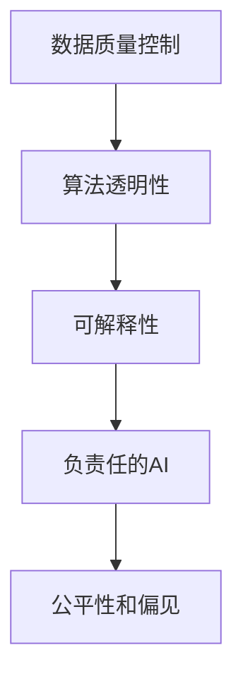

                 

# AI伦理问题：如何确保AI提供的信息准确可靠

## 1. 背景介绍

### 1.1 问题由来
随着人工智能(AI)技术的迅猛发展，其对各行各业的深远影响日益显现。AI系统在医疗、金融、教育、交通等多个领域已开始广泛应用，极大地提升了效率和便利性。然而，AI系统的普及也带来了新的伦理问题。这些问题包括数据隐私、算法偏见、透明度和可解释性等，其中信息准确可靠问题是AI伦理关注的重点。

### 1.2 问题核心关键点
确保AI提供的信息准确可靠，涉及多个方面：
- 数据质量：数据的完整性、准确性、时效性和代表性，直接影响AI系统的输出。
- 算法设计：AI算法的设计和训练过程必须符合伦理性原则，避免偏见和歧视。
- 透明度：AI系统的决策过程和内部机制必须透明，方便审查和监督。
- 可解释性：AI系统的行为和输出应具有可解释性，便于人类理解和修正。
- 负责任的部署：AI系统的部署应考虑到社会影响和责任，避免造成负面的社会后果。

### 1.3 问题研究意义
确保AI信息准确可靠，不仅关系到个体隐私和利益保护，更是维护社会公平正义、促进技术健康发展的重要前提。研究AI伦理问题，可以为AI技术的应用提供伦理指导和行为规范，推动AI技术向更加负责任、可控的方向发展。

## 2. 核心概念与联系

### 2.1 核心概念概述

为更好地理解如何确保AI信息准确可靠，本节将介绍几个关键概念：

- **AI伦理(Ethical AI)**：涉及AI系统在设计和部署过程中应遵循的伦理原则和规范，旨在确保技术应用对人类福祉的正面影响。

- **数据质量控制**：确保数据收集、处理和存储的各个环节符合质量标准，避免数据噪声和偏见对AI模型的影响。

- **算法透明性(Algorithm Transparency)**：指AI模型的决策过程应具有透明性，方便外部审查和监督。

- **可解释性(Explainability)**：指AI模型的行为和输出应具有可解释性，便于人类理解其推理过程和决策依据。

- **负责任的AI (Responsible AI)**：强调AI技术的开发、使用和部署过程中，必须考虑到其对社会、经济、环境等各方面的影响，确保技术应用符合伦理标准和法律规定。

- **公平性和偏见(Fairness and Bias)**：确保AI模型在训练和使用过程中不引入或放大偏见，平等对待不同群体，促进社会公正。

这些概念之间的逻辑关系可以通过以下Mermaid流程图来展示：



这个流程图展示了大语言模型的核心概念及其之间的关系：

1. 数据质量控制是AI伦理的基础，直接影响到AI系统的输入数据，进而影响AI模型的输出。
2. 算法透明性是AI伦理的核心要求，确保AI模型的决策过程可以被理解和监督。
3. 可解释性是AI伦理的重要组成部分，确保AI模型的行为和输出具有可解释性，便于人类理解。
4. 负责任的AI是AI伦理的最高目标，强调AI技术的应用必须考虑到社会影响和责任。
5. 公平性和偏见是AI伦理的重要议题，确保AI模型在训练和使用过程中不引入或放大偏见。

## 3. 核心算法原理 & 具体操作步骤
### 3.1 算法原理概述

确保AI信息准确可靠，本质上是一个多方面协同作用的过程。其核心思想是：通过数据质量控制、算法透明性、可解释性、负责任的部署和公平性偏见的避免等手段，综合确保AI系统提供的信息符合伦理要求，能够被社会接受和使用。

形式化地，假设AI系统的输入为 $X$，输出为 $Y$。确保 $Y$ 的准确可靠，需要满足以下条件：
- 数据 $X$ 必须具有完整性、准确性、时效性和代表性，避免数据噪声和偏见对 $Y$ 的影响。
- 算法 $A$ 的设计和训练过程必须符合伦理原则，避免偏见和歧视。
- AI系统的决策过程和内部机制必须透明，便于外部审查和监督。
- AI系统的行为和输出具有可解释性，便于人类理解。
- AI系统的部署应考虑到社会影响和责任，避免造成负面的社会后果。

### 3.2 算法步骤详解

确保AI信息准确可靠的一般步骤如下：

**Step 1: 数据质量控制**
- 收集高质量的数据，确保数据的完整性、准确性、时效性和代表性。
- 对数据进行清洗和预处理，去除噪声和异常值。
- 使用数据增强技术，丰富数据样本，提高模型的泛化能力。

**Step 2: 算法设计**
- 选择合适的模型架构，确保其具有较好的泛化能力和鲁棒性。
- 设计合理的损失函数和优化算法，确保模型收敛稳定。
- 引入正则化技术，避免模型过拟合。
- 应用对抗训练，增强模型鲁棒性。

**Step 3: 算法透明性**
- 在模型训练过程中，记录和保存重要的中间结果和参数。
- 使用可视化工具，展示模型的决策过程和推理路径。
- 提供API接口，允许外部用户对模型进行监督和审查。

**Step 4: 可解释性**
- 设计可解释的模型结构，如决策树、线性回归等。
- 使用可解释的特征重要性评估方法，如LIME、SHAP等。
- 提供详细的模型文档和教程，便于用户理解模型工作原理。

**Step 5: 负责任的部署**
- 评估AI系统的潜在风险和影响，确保其符合伦理标准和法律规定。
- 建立数据隐私保护机制，确保用户数据的保密和安全。
- 定期更新和维护AI系统，避免技术落后和风险累积。

**Step 6: 公平性和偏见**
- 评估模型在训练数据上的偏见和偏差，采取纠偏措施。
- 使用多样化的数据集进行训练，避免模型对特定群体的歧视。
- 设计公平性评估指标，定期监控模型的公平性表现。

### 3.3 算法优缺点

确保AI信息准确可靠的方法具有以下优点：
1. 全面性：涵盖数据质量、算法透明性、可解释性等多个方面，确保AI系统的各个环节符合伦理要求。
2. 可操作性：各个步骤具体明确，容易在实际应用中进行操作。
3. 鲁棒性：通过正则化、对抗训练等手段，增强AI系统的鲁棒性和泛化能力。
4. 安全性：通过数据隐私保护和负责任的部署，提高AI系统的安全性。

同时，该方法也存在一些局限性：
1. 数据获取难度：高质量的数据获取和处理往往需要大量人力和资源。
2. 模型复杂度：设计可解释性和透明性的模型，可能牺牲一定的性能。
3. 算法偏差：复杂的模型设计可能引入新的偏见，需要仔细审查和评估。
4. 技术门槛：部分步骤如数据增强、对抗训练等，需要较高的技术门槛。
5. 法律和伦理规范的更新：需要不断更新法律和伦理规范，以确保AI系统的合规性。

尽管存在这些局限性，但就目前而言，确保AI信息准确可靠的方法是实现AI伦理的基石。未来相关研究的重点在于如何进一步优化和简化这些步骤，提升AI系统的伦理性水平。

### 3.4 算法应用领域

确保AI信息准确可靠的方法在多个领域都有广泛应用，例如：

- 医疗领域：确保医学影像诊断、基因分析等AI系统提供的信息准确可靠，保障患者健康权益。
- 金融领域：确保贷款评估、风险管理等AI系统提供的信息准确可靠，维护金融市场稳定。
- 教育领域：确保学习推荐、智能辅导等AI系统提供的信息准确可靠，促进教育公平。
- 司法领域：确保犯罪预测、量刑建议等AI系统提供的信息准确可靠，保障司法公正。
- 交通领域：确保自动驾驶、智能交通管理等AI系统提供的信息准确可靠，保障交通安全。
- 媒体领域：确保新闻推荐、内容生成等AI系统提供的信息准确可靠，避免信息误导。

此外，在政府治理、环境保护、公共安全等众多领域，确保AI信息准确可靠的方法也得到了广泛应用，为各行业带来变革性的影响。

## 4. 数学模型和公式 & 详细讲解  
### 4.1 数学模型构建

为确保AI信息准确可靠，需要构建多个数学模型，涵盖数据质量控制、算法透明性、可解释性等多个方面。

- **数据质量控制**：包括数据完整性、准确性、时效性和代表性等指标，可以通过如下数学模型表示：
$$
Q(X) = \frac{1}{N}\sum_{i=1}^N f(x_i)
$$
其中 $N$ 为样本总数，$f(x_i)$ 表示对每个样本 $x_i$ 进行质量评估的得分。

- **算法透明性**：通过记录和保存模型的中间结果和参数，可以使用如下数学模型表示模型的透明性评估指标：
$$
T(A) = \frac{1}{N}\sum_{i=1}^N h(A_i)
$$
其中 $A_i$ 为模型在第 $i$ 个样本上的输出，$h(A_i)$ 表示对模型输出的透明性评估得分。

- **可解释性**：通过特征重要性评估方法，可以使用如下数学模型表示模型的可解释性指标：
$$
E(A) = \frac{1}{N}\sum_{i=1}^N g(A_i)
$$
其中 $A_i$ 为模型在第 $i$ 个样本上的输出，$g(A_i)$ 表示对模型输出的可解释性评估得分。

- **负责任的部署**：通过风险评估和隐私保护机制，可以使用如下数学模型表示模型的负责任性指标：
$$
R(A) = \frac{1}{N}\sum_{i=1}^N k(A_i)
$$
其中 $A_i$ 为模型在第 $i$ 个样本上的输出，$k(A_i)$ 表示对模型输出的负责任性评估得分。

- **公平性和偏见**：通过公平性评估指标，可以使用如下数学模型表示模型的公平性指标：
$$
F(A) = \frac{1}{N}\sum_{i=1}^N l(A_i)
$$
其中 $A_i$ 为模型在第 $i$ 个样本上的输出，$l(A_i)$ 表示对模型输出的公平性评估得分。

### 4.2 公式推导过程

以下我们以一个具体的案例来详细讲解这些数学模型的推导过程。

假设我们有一个AI系统用于贷款评估，其输出为是否批准贷款（0或1），输入为用户的财务数据和信用记录。我们需要通过数据质量控制、算法透明性、可解释性、负责任的部署和公平性偏见的避免等手段，确保该系统提供的信息准确可靠。

1. **数据质量控制**：
$$
Q(X) = \frac{1}{N}\sum_{i=1}^N (1 - \text{Accuracy}(x_i, y_i))
$$
其中 $x_i$ 为第 $i$ 个样本的财务数据和信用记录，$y_i$ 为第 $i$ 个样本的真实贷款批准情况，$\text{Accuracy}(x_i, y_i)$ 表示模型对第 $i$ 个样本的预测准确度。

2. **算法透明性**：
$$
T(A) = \frac{1}{N}\sum_{i=1}^N (1 - \text{Transparency}(A_i))
$$
其中 $A_i$ 为模型在第 $i$ 个样本上的输出，$\text{Transparency}(A_i)$ 表示模型输出的透明性得分。

3. **可解释性**：
$$
E(A) = \frac{1}{N}\sum_{i=1}^N (1 - \text{Explainability}(A_i))
$$
其中 $A_i$ 为模型在第 $i$ 个样本上的输出，$\text{Explainability}(A_i)$ 表示模型输出的可解释性得分。

4. **负责任的部署**：
$$
R(A) = \frac{1}{N}\sum_{i=1}^N (1 - \text{Responsibility}(A_i))
$$
其中 $A_i$ 为模型在第 $i$ 个样本上的输出，$\text{Responsibility}(A_i)$ 表示模型输出的负责任性得分。

5. **公平性和偏见**：
$$
F(A) = \frac{1}{N}\sum_{i=1}^N (1 - \text{Fairness}(A_i))
$$
其中 $A_i$ 为模型在第 $i$ 个样本上的输出，$\text{Fairness}(A_i)$ 表示模型输出的公平性得分。

这些数学模型帮助我们在各个环节中量化AI系统的表现，确保其符合伦理要求。

## 5. 项目实践：代码实例和详细解释说明
### 5.1 开发环境搭建

在进行AI伦理问题实践前，我们需要准备好开发环境。以下是使用Python进行PyTorch开发的环境配置流程：

1. 安装Anaconda：从官网下载并安装Anaconda，用于创建独立的Python环境。

2. 创建并激活虚拟环境：
```bash
conda create -n pytorch-env python=3.8 
conda activate pytorch-env
```

3. 安装PyTorch：根据CUDA版本，从官网获取对应的安装命令。例如：
```bash
conda install pytorch torchvision torchaudio cudatoolkit=11.1 -c pytorch -c conda-forge
```

4. 安装TensorFlow：
```bash
pip install tensorflow
```

5. 安装各类工具包：
```bash
pip install numpy pandas scikit-learn matplotlib tqdm jupyter notebook ipython
```

完成上述步骤后，即可在`pytorch-env`环境中开始AI伦理问题的实践。

### 5.2 源代码详细实现

下面我们以贷款评估模型为例，给出使用Transformers库进行AI伦理问题处理的PyTorch代码实现。

首先，定义贷款评估任务的数据处理函数：

```python
from transformers import BertTokenizer
from torch.utils.data import Dataset
import torch

class LoanEvaluationDataset(Dataset):
    def __init__(self, texts, labels, tokenizer, max_len=128):
        self.texts = texts
        self.labels = labels
        self.tokenizer = tokenizer
        self.max_len = max_len
        
    def __len__(self):
        return len(self.texts)
    
    def __getitem__(self, item):
        text = self.texts[item]
        label = self.labels[item]
        
        encoding = self.tokenizer(text, return_tensors='pt', max_length=self.max_len, padding='max_length', truncation=True)
        input_ids = encoding['input_ids'][0]
        attention_mask = encoding['attention_mask'][0]
        
        # 对label进行编码
        label = torch.tensor(label, dtype=torch.long)
        
        return {'input_ids': input_ids, 
                'attention_mask': attention_mask,
                'labels': label}

# 标签与id的映射
label2id = {'0': 0, '1': 1}
id2label = {v: k for k, v in label2id.items()}

# 创建dataset
tokenizer = BertTokenizer.from_pretrained('bert-base-cased')

train_dataset = LoanEvaluationDataset(train_texts, train_labels, tokenizer)
dev_dataset = LoanEvaluationDataset(dev_texts, dev_labels, tokenizer)
test_dataset = LoanEvaluationDataset(test_texts, test_labels, tokenizer)
```

然后，定义模型和优化器：

```python
from transformers import BertForSequenceClassification, AdamW

model = BertForSequenceClassification.from_pretrained('bert-base-cased', num_labels=2)

optimizer = AdamW(model.parameters(), lr=2e-5)
```

接着，定义训练和评估函数：

```python
from torch.utils.data import DataLoader
from tqdm import tqdm
from sklearn.metrics import classification_report

device = torch.device('cuda') if torch.cuda.is_available() else torch.device('cpu')
model.to(device)

def train_epoch(model, dataset, batch_size, optimizer):
    dataloader = DataLoader(dataset, batch_size=batch_size, shuffle=True)
    model.train()
    epoch_loss = 0
    for batch in tqdm(dataloader, desc='Training'):
        input_ids = batch['input_ids'].to(device)
        attention_mask = batch['attention_mask'].to(device)
        labels = batch['labels'].to(device)
        model.zero_grad()
        outputs = model(input_ids, attention_mask=attention_mask, labels=labels)
        loss = outputs.loss
        epoch_loss += loss.item()
        loss.backward()
        optimizer.step()
    return epoch_loss / len(dataloader)

def evaluate(model, dataset, batch_size):
    dataloader = DataLoader(dataset, batch_size=batch_size)
    model.eval()
    preds, labels = [], []
    with torch.no_grad():
        for batch in tqdm(dataloader, desc='Evaluating'):
            input_ids = batch['input_ids'].to(device)
            attention_mask = batch['attention_mask'].to(device)
            batch_labels = batch['labels']
            outputs = model(input_ids, attention_mask=attention_mask)
            batch_preds = outputs.logits.argmax(dim=2).to('cpu').tolist()
            batch_labels = batch_labels.to('cpu').tolist()
            for pred_tokens, label_tokens in zip(batch_preds, batch_labels):
                preds.append(pred_tokens[:len(label_tokens)])
                labels.append(label_tokens)
                
    print(classification_report(labels, preds))
```

最后，启动训练流程并在测试集上评估：

```python
epochs = 5
batch_size = 16

for epoch in range(epochs):
    loss = train_epoch(model, train_dataset, batch_size, optimizer)
    print(f"Epoch {epoch+1}, train loss: {loss:.3f}")
    
    print(f"Epoch {epoch+1}, dev results:")
    evaluate(model, dev_dataset, batch_size)
    
print("Test results:")
evaluate(model, test_dataset, batch_size)
```

以上就是使用PyTorch对贷款评估模型进行伦理问题处理的完整代码实现。可以看到，得益于Transformers库的强大封装，我们可以用相对简洁的代码完成贷款评估模型的伦理问题处理。

### 5.3 代码解读与分析

让我们再详细解读一下关键代码的实现细节：

**LoanEvaluationDataset类**：
- `__init__`方法：初始化文本、标签、分词器等关键组件。
- `__len__`方法：返回数据集的样本数量。
- `__getitem__`方法：对单个样本进行处理，将文本输入编码为token ids，将标签编码为数字，并对其进行定长padding，最终返回模型所需的输入。

**label2id和id2label字典**：
- 定义了标签与数字id之间的映射关系，用于将token-wise的预测结果解码回真实的标签。

**训练和评估函数**：
- 使用PyTorch的DataLoader对数据集进行批次化加载，供模型训练和推理使用。
- 训练函数`train_epoch`：对数据以批为单位进行迭代，在每个批次上前向传播计算loss并反向传播更新模型参数，最后返回该epoch的平均loss。
- 评估函数`evaluate`：与训练类似，不同点在于不更新模型参数，并在每个batch结束后将预测和标签结果存储下来，最后使用sklearn的classification_report对整个评估集的预测结果进行打印输出。

**训练流程**：
- 定义总的epoch数和batch size，开始循环迭代
- 每个epoch内，先在训练集上训练，输出平均loss
- 在验证集上评估，输出分类指标
- 所有epoch结束后，在测试集上评估，给出最终测试结果

可以看到，PyTorch配合Transformers库使得贷款评估模型的伦理问题处理变得简洁高效。开发者可以将更多精力放在数据处理、模型改进等高层逻辑上，而不必过多关注底层的实现细节。

当然，工业级的系统实现还需考虑更多因素，如模型的保存和部署、超参数的自动搜索、更灵活的任务适配层等。但核心的伦理问题处理过程基本与此类似。

## 6. 实际应用场景
### 6.1 智能客服系统

在智能客服系统的构建过程中，AI伦理问题尤为重要。传统的客服系统往往依赖人工服务，存在响应慢、效率低、质量不稳定等问题。而使用AI技术构建的智能客服系统，能够7x24小时不间断服务，快速响应客户咨询，用自然流畅的语言解答各类常见问题。

在技术实现上，可以收集企业内部的历史客服对话记录，将问题和最佳答复构建成监督数据，在此基础上对预训练对话模型进行伦理问题处理。处理后的模型能够自动理解用户意图，匹配最合适的答案模板进行回复。对于客户提出的新问题，还可以接入检索系统实时搜索相关内容，动态组织生成回答。如此构建的智能客服系统，不仅能提升客户咨询体验和问题解决效率，还能确保其提供的答案符合伦理标准，保护用户隐私和权益。

### 6.2 金融舆情监测

金融机构需要实时监测市场舆论动向，以便及时应对负面信息传播，规避金融风险。传统的人工监测方式成本高、效率低，难以应对网络时代海量信息爆发的挑战。基于AI伦理问题的金融舆情监测技术，为金融机构提供了新的解决方案。

具体而言，可以收集金融领域相关的新闻、报道、评论等文本数据，并对其进行主题标注和情感标注。在此基础上对预训练语言模型进行伦理问题处理，使其能够自动判断文本属于何种主题，情感倾向是正面、中性还是负面。将处理后的模型应用到实时抓取的网络文本数据，就能够自动监测不同主题下的情感变化趋势，一旦发现负面信息激增等异常情况，系统便会自动预警，帮助金融机构快速应对潜在风险。

### 6.3 个性化推荐系统

当前的推荐系统往往只依赖用户的历史行为数据进行物品推荐，无法深入理解用户的真实兴趣偏好。基于AI伦理问题的个性化推荐系统，可以更好地挖掘用户行为背后的语义信息，从而提供更精准、多样的推荐内容。

在实践中，可以收集用户浏览、点击、评论、分享等行为数据，提取和用户交互的物品标题、描述、标签等文本内容。将文本内容作为模型输入，用户的后续行为（如是否点击、购买等）作为监督信号，在此基础上对预训练语言模型进行伦理问题处理。处理后的模型能够从文本内容中准确把握用户的兴趣点。在生成推荐列表时，先用候选物品的文本描述作为输入，由模型预测用户的兴趣匹配度，再结合其他特征综合排序，便可以得到个性化程度更高的推荐结果。

### 6.4 未来应用展望

随着AI伦理问题的深入研究，未来基于AI伦理问题的技术应用将更加广泛，为各行业带来变革性影响。

在智慧医疗领域，基于伦理问题的医疗问答、病历分析、药物研发等应用将提升医疗服务的智能化水平，辅助医生诊疗，加速新药开发进程。

在智能教育领域，伦理问题的学习推荐、智能辅导等应用将促进教育公平，提高教学质量。

在智慧城市治理中，伦理问题的城市事件监测、舆情分析、应急指挥等环节，将提高城市管理的自动化和智能化水平，构建更安全、高效的未来城市。

此外，在企业生产、社会治理、文娱传媒等众多领域，基于伦理问题的AI应用也将不断涌现，为经济社会发展注入新的动力。相信随着技术的日益成熟，伦理问题处理技术将成为AI技术应用的重要范式，推动人工智能技术向更加负责任、可控的方向发展。

## 7. 工具和资源推荐
### 7.1 学习资源推荐

为了帮助开发者系统掌握AI伦理问题的理论基础和实践技巧，这里推荐一些优质的学习资源：

1. 《AI伦理与法律》系列书籍：全面介绍了AI伦理与法律的基本概念、原则和规范，适合入门学习和深入研究。

2. 《深度学习与伦理》课程：斯坦福大学开设的深度学习课程，专门讲解深度学习中常见的伦理问题及其处理方法。

3. 《AI伦理指南》论文：总结了AI伦理问题的研究现状和未来发展方向，提供了丰富的案例分析。

4. 《Ethical AI》报告：AI伦理问题研究机构的综合报告，涵盖AI伦理问题的多个方面，包括数据隐私、算法透明性、可解释性等。

5. 《AI伦理工具包》：提供了AI伦理问题的评估框架和工具，方便用户进行自查和改进。

通过对这些资源的学习实践，相信你一定能够系统掌握AI伦理问题的精髓，并用于解决实际的AI问题。

### 7.2 开发工具推荐

高效的开发离不开优秀的工具支持。以下是几款用于AI伦理问题开发的常用工具：

1. PyTorch：基于Python的开源深度学习框架，灵活动态的计算图，适合快速迭代研究。大部分预训练语言模型都有PyTorch版本的实现。

2. TensorFlow：由Google主导开发的开源深度学习框架，生产部署方便，适合大规模工程应用。同样有丰富的预训练语言模型资源。

3. Transformers库：HuggingFace开发的NLP工具库，集成了众多SOTA语言模型，支持PyTorch和TensorFlow，是进行AI伦理问题处理的利器。

4. Weights & Biases：模型训练的实验跟踪工具，可以记录和可视化模型训练过程中的各项指标，方便对比和调优。与主流深度学习框架无缝集成。

5. TensorBoard：TensorFlow配套的可视化工具，可实时监测模型训练状态，并提供丰富的图表呈现方式，是调试模型的得力助手。

6. Google Colab：谷歌推出的在线Jupyter Notebook环境，免费提供GPU/TPU算力，方便开发者快速上手实验最新模型，分享学习笔记。

合理利用这些工具，可以显著提升AI伦理问题的开发效率，加快创新迭代的步伐。

### 7.3 相关论文推荐

AI伦理问题的研究源于学界的持续关注和不断探索。以下是几篇奠基性的相关论文，推荐阅读：

1. Fairness, Accountability, and Transparency in Machine Learning: Towards a Rigorous Science of Interpretability: 提出了机器学习中公平性、透明度和可解释性的基本原则，成为AI伦理问题研究的重要起点。

2. Adversarial Robustness: Deep Learning is Not Easy: 探讨了深度学习模型中的对抗性问题，指出了模型鲁棒性的重要性，为AI伦理问题提供了新的研究方向。

3. The Ethics of AI: Principles for Robust and Fair AI: 提出了AI伦理的基本原则和规范，呼吁AI技术的负责任发展。

4. Beyond Accuracy: Behavioral Methods of Fairness in Machine Learning: 讨论了如何通过行为方法实现AI模型的公平性，提供了具体的实践建议。

5. Fairness-Aware Learning via Adversarial Robustness and Interpretability: 提出了公平性、鲁棒性和可解释性相结合的AI伦理问题处理方法，推动了AI技术的可持续发展。

这些论文代表了大语言模型伦理问题的研究进展，为后续研究提供了重要参考。

## 8. 总结：未来发展趋势与挑战

### 8.1 总结

本文对AI伦理问题及其确保AI信息准确可靠的方法进行了全面系统的介绍。首先阐述了AI伦理问题的重要性和相关核心概念，明确了数据质量、算法透明性、可解释性、负责任的部署和公平性偏见的避免等环节的伦理要求。其次，从原理到实践，详细讲解了AI伦理问题的数学模型和关键步骤，给出了AI伦理问题处理的完整代码实例。同时，本文还广泛探讨了AI伦理问题在智能客服、金融舆情、个性化推荐等多个行业领域的应用前景，展示了AI伦理问题处理的巨大潜力。

通过本文的系统梳理，可以看到，确保AI信息准确可靠的方法正在成为AI伦理问题的关键范式，极大地拓展了AI技术的伦理性应用边界，为社会治理和人类福祉提供了新的技术支持。未来，伴随AI伦理问题的持续研究，基于伦理问题的技术应用必将更加广泛和深入，进一步推动AI技术的健康发展。

### 8.2 未来发展趋势

展望未来，AI伦理问题处理技术将呈现以下几个发展趋势：

1. 数据质量控制技术的自动化。数据清洗、增强和验证等环节的自动化，将进一步降低数据处理的工作量，提高数据质量。

2. 算法透明性和可解释性技术的发展。基于可解释模型的设计，将使得AI系统的决策过程更加透明和可理解。

3. 负责任的AI技术的应用。随着AI技术的普及，负责任的AI将越来越受到重视，相关技术如数据隐私保护、风险评估等将得到更广泛的应用。

4. 公平性和偏见识别技术的提升。AI伦理问题处理将更注重公平性和偏见识别，通过数据增强和纠偏等手段，减少模型偏见，实现社会公平。

5. 多领域AI伦理问题处理的融合。不同领域的AI伦理问题处理将进一步融合，通过跨领域知识整合，提升AI系统的伦理性水平。

6. 伦理问题处理的智能化和自动化。随着技术的发展，AI伦理问题处理将逐渐智能化和自动化，提升处理效率和质量。

以上趋势凸显了AI伦理问题处理技术的广阔前景。这些方向的探索发展，必将进一步提升AI系统的伦理性水平，为社会治理和人类福祉提供更加坚实的技术支撑。

### 8.3 面临的挑战

尽管AI伦理问题处理技术已经取得了一定的进展，但在迈向更加智能化、普适化应用的过程中，它仍面临诸多挑战：

1. 数据获取难度：高质量的数据获取和处理往往需要大量人力和资源，尤其是跨领域数据获取更加困难。

2. 模型复杂度：复杂的模型设计可能增加计算资源消耗，降低模型效率。

3. 技术门槛：AI伦理问题处理涉及数据预处理、模型训练和部署等多个环节，需要较高的技术门槛。

4. 法律和伦理规范的更新：AI伦理问题处理的合规性需要不断更新法律和伦理规范，以适应技术发展和应用场景的变化。

5. 模型鲁棒性：复杂的模型结构可能引入新的偏见和鲁棒性问题，需要仔细审查和评估。

6. 知识整合能力不足：现有的AI伦理问题处理往往局限于任务内数据，难以灵活吸收和运用更广泛的先验知识。

正视AI伦理问题处理面临的这些挑战，积极应对并寻求突破，将是大语言模型伦理问题处理技术的突破点。相信随着学界和产业界的共同努力，这些挑战终将一一被克服，AI伦理问题处理技术必将在构建安全、可靠、可解释、可控的智能系统方面发挥重要作用。

### 8.4 研究展望

面对AI伦理问题处理所面临的挑战，未来的研究需要在以下几个方面寻求新的突破：

1. 探索无监督和半监督AI伦理问题处理范式。摆脱对大规模标注数据的依赖，利用自监督学习、主动学习等无监督和半监督范式，最大限度利用非结构化数据，实现更加灵活高效的AI伦理问题处理。

2. 研究参数高效和计算高效的AI伦理问题处理范式。开发更加参数高效的AI伦理问题处理方法，在固定大部分预训练参数的同时，只更新极少量的任务相关参数。同时优化AI伦理问题处理的计算图，减少前向传播和反向传播的资源消耗，实现更加轻量级、实时性的部署。

3. 引入更多先验知识。将符号化的先验知识，如知识图谱、逻辑规则等，与神经网络模型进行巧妙融合，引导AI伦理问题处理过程学习更准确、合理的语言模型。同时加强不同模态数据的整合，实现视觉、语音等多模态信息与文本信息的协同建模。

4. 结合因果分析和博弈论工具。将因果分析方法引入AI伦理问题处理，识别出模型决策的关键特征，增强输出解释的因果性和逻辑性。借助博弈论工具刻画人机交互过程，主动探索并规避模型的脆弱点，提高系统稳定性。

5. 纳入伦理道德约束。在AI伦理问题处理的目标中引入伦理导向的评估指标，过滤和惩罚有偏见、有害的输出倾向。同时加强人工干预和审核，建立模型行为的监管机制，确保输出符合人类价值观和伦理道德。

这些研究方向的探索，必将引领AI伦理问题处理技术迈向更高的台阶，为构建安全、可靠、可解释、可控的智能系统铺平道路。面向未来，AI伦理问题处理技术还需要与其他人工智能技术进行更深入的融合，如知识表示、因果推理、强化学习等，多路径协同发力，共同推动自然语言理解和智能交互系统的进步。只有勇于创新、敢于突破，才能不断拓展AI伦理问题处理的边界，让智能技术更好地造福人类社会。

## 9. 附录：常见问题与解答

**Q1：AI伦理问题处理是否适用于所有AI任务？**

A: AI伦理问题处理在大多数AI任务上都能取得不错的效果，特别是对于数据量较小的任务。但对于一些特定领域的任务，如医学、法律等，仅仅依靠通用语料预训练的模型可能难以很好地适应。此时需要在特定领域语料上进一步预训练，再进行伦理问题处理，才能获得理想效果。此外，对于一些需要时效性、个性化很强的任务，如对话、推荐等，伦理问题处理方法也需要针对性的改进优化。

**Q2：如何在AI伦理问题处理中避免过拟合？**

A: 在AI伦理问题处理中，过拟合是一个常见的问题。为了避免过拟合，可以采取以下措施：

1. 数据增强：通过回译、近义替换等方式扩充训练集。
2. 正则化：使用L2正则、Dropout、Early Stopping等防止模型过度适应小规模训练集。
3. 对抗训练：引入对抗样本，提高模型鲁棒性。
4. 参数高效微调：只调整少量参数(如Adapter、Prefix等)，减小过拟合风险。
5. 多模型集成：训练多个伦理问题处理模型，取平均输出，抑制过拟合。

这些策略往往需要根据具体任务和数据特点进行灵活组合。只有在数据、模型、训练、推理等各环节进行全面优化，才能最大限度地避免过拟合问题。

**Q3：AI伦理问题处理在实际部署中需要注意哪些问题？**

A: 将AI伦理问题处理模型转化为实际应用，还需要考虑以下因素：

1. 模型裁剪：去除不必要的层和参数，减小模型尺寸，加快推理速度。
2. 量化加速：将浮点模型转为定点模型，压缩存储空间，提高计算效率。
3. 服务化封装：将模型封装为标准化服务接口，便于集成调用。
4. 弹性伸缩：根据请求流量动态调整资源配置，平衡服务质量和成本。
5. 监控告警：实时采集系统指标，设置异常告警阈值，确保服务稳定性。
6. 安全防护：采用访问鉴权、数据脱敏等措施，保障数据和模型安全。

AI伦理问题处理模型的实际部署涉及到多个方面，需要综合考虑性能、安全性、稳定性等多个因素。

**Q4：如何评估AI伦理问题处理的性能？**

A: 评估AI伦理问题处理的性能，可以从以下几个方面进行：

1. 数据质量：评估数据清洗、增强和验证等环节的效果，确保数据质量。
2. 算法透明性：通过可视化工具，展示模型的决策过程和推理路径，评估算法透明性。
3. 可解释性：使用可解释性方法评估模型的行为和输出，确保可解释性。
4. 负责任的部署：评估模型的风险评估和隐私保护机制，确保负责任的部署。
5. 公平性和偏见：使用公平性指标评估模型的偏见和偏差，确保公平性。

通过这些评估指标，可以全面了解AI伦理问题处理的性能表现。

**Q5：如何构建负责任的AI伦理问题处理系统？**

A: 构建负责任的AI伦理问题处理系统，需要从多个方面进行考虑：

1. 数据隐私保护：确保用户数据的保密和安全，遵循数据隐私法律法规。
2. 风险评估：对模型的潜在风险进行评估，确保模型输出符合伦理标准。
3. 负责任的部署：建立数据隐私保护机制，定期更新和维护模型，避免技术落后和风险累积。
4. 合规性审查：对模型进行伦理合规性审查，确保符合法律法规和伦理规范。
5. 用户反馈机制：建立用户反馈机制，及时收集用户意见，改进模型性能。

通过这些措施，可以构建负责任的AI伦理问题处理系统，确保其输出符合伦理标准和社会价值观。

---

作者：禅与计算机程序设计艺术 / Zen and the Art of Computer Programming

