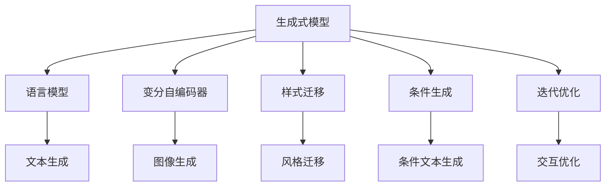

                 

# AI写作助手：增强人类创造力的工具

> 关键词：人工智能,自然语言处理(NLP),生成式模型,写作助手,语言模型,创造力,创新

## 1. 背景介绍

### 1.1 问题由来
随着人工智能技术的发展，自然语言处理(NLP)领域的生成式模型逐渐成为一种强有力的工具，被广泛应用于写作、翻译、聊天机器人等领域。其中，语言模型(如GPT-3、BERT)的诞生，让机器自动生成连贯、有意义的文本成为可能，极大地拓展了人工智能的应用边界。

但与此同时，语言模型也面临着一些亟待解决的挑战。虽然它们能够生成大量文本，但这些文本往往缺乏个性和创造力，难以满足人类对于深度、新颖、创意性写作的需求。因此，如何使AI写作助手不仅仅是文本生成的“工厂”，而是成为真正具有创造力的“艺术家”，成为了当前研究的热点问题。

### 1.2 问题核心关键点
为了增强AI写作助手的创造力，研究者们探索了多种方法，包括：
- **生成式模型**：利用语言模型、变分自编码器等生成式模型，生成连贯、富有创意的文本。
- **样式迁移**：将特定风格的文章特征转移到生成的文本中，使输出更接近某一特定风格。
- **条件生成**：利用条件对抗生成网络(CGAN)等技术，根据用户提供的条件生成个性化文本。
- **迭代优化**：在文本生成的基础上，通过与用户的交互反馈不断调整模型参数，提升生成质量。
- **多模态融合**：结合图片、音频等多模态信息，生成更具情境感、创意性的文本。

这些方法在一定程度上缓解了AI写作助手的创造力不足问题，但效果仍存在较大局限性。未来，如何让AI写作助手更好地发挥其创造力，还需进一步探索和创新。

### 1.3 问题研究意义
增强AI写作助手的创造力，对于推动人工智能技术在艺术、文学、教育等创造性领域的广泛应用具有重要意义：

1. **提升文本创作质量**：AI写作助手能够生成更加个性化、富有创意的文本，提升文学、广告、新闻等行业的工作效率和内容质量。
2. **促进跨学科融合**：结合不同学科的知识和技巧，生成更具创意性和新颖性的作品，为跨学科研究提供新的视角和方法。
3. **支持个性化教育**：根据学生的兴趣和特点生成个性化的教学材料，提升教育资源的丰富性和针对性。
4. **开拓创新应用场景**：为虚拟现实、游戏开发等需要大量文本内容的行业提供创意性支持，推动新兴技术的普及和应用。

## 2. 核心概念与联系

### 2.1 核心概念概述

为了更好地理解AI写作助手的核心技术，本节将介绍几个关键概念：

- **生成式模型(Generative Models)**：利用深度学习技术，通过训练生成概率分布，能够自动生成新的文本、图像等数据。
- **语言模型(Language Models)**：以自然语言数据为输入，通过预测下一个词或字符的概率分布，学习语言的内部结构和规律。
- **变分自编码器(Variational Autoencoder, VAE)**：一种生成模型，能够学习数据分布，并生成新的数据样本。
- **样式迁移(Style Transfer)**：将输入的文本风格特征迁移到目标文本中，使其风格一致。
- **条件生成(Conditional Generation)**：在生成过程中引入条件信息，生成符合特定要求的文本。
- **迭代优化(Iterative Refinement)**：通过与用户互动，反复调整生成结果，逐步逼近最佳输出。

这些核心概念之间的联系通过以下Mermaid流程图进行展示：



### 2.2 核心概念原理和架构

#### 2.2.1 生成式模型原理
生成式模型通过学习数据的概率分布，能够自动生成新的数据样本。以语言模型为例，其目标是最小化负对数似然损失，使得模型输出的下一个词或字符分布尽可能接近真实数据分布。

- **模型架构**：
  - **编码器(Encoder)**：将输入文本映射为低维向量表示。
  - **解码器(Decoder)**：根据编码器的输出，生成下一个词或字符。
  - **生成器(Generator)**：使用解码器的输出作为下一个输入，逐层生成文本。

#### 2.2.2 变分自编码器原理
变分自编码器是一种生成模型，通过学习数据分布的隐变量表示，能够生成新的数据样本。其模型架构包含以下三个部分：

- **编码器(Encoder)**：将输入数据映射为隐变量。
- **解码器(Decoder)**：将隐变量映射回原始数据空间。
- **重构损失(Reconstruction Loss)**：计算重构数据与原始数据之间的差异。

#### 2.2.3 样式迁移原理
样式迁移技术将输入文本的风格特征迁移到目标文本中，使其风格一致。其实现方式包括：

- **风格特征提取**：提取输入文本的风格特征。
- **特征传递**：将提取的风格特征传递到目标文本中。
- **风格融合**：将目标文本与传递的风格特征结合，生成具有特定风格的新文本。

#### 2.2.4 条件生成原理
条件生成技术在生成过程中引入条件信息，生成符合特定要求的文本。其实现方式包括：

- **条件编码**：将条件信息编码为向量表示。
- **条件融合**：将条件编码与生成模型结合，引导模型生成符合条件的文本。

#### 2.2.5 迭代优化原理
迭代优化技术通过与用户互动，反复调整生成结果，逐步逼近最佳输出。其实现方式包括：

- **用户反馈**：用户对生成文本进行评价和修改。
- **模型调整**：根据用户反馈调整模型参数，重新生成文本。
- **反复迭代**：反复执行生成、反馈、调整的过程，直到生成满意的结果。

## 3. 核心算法原理 & 具体操作步骤
### 3.1 算法原理概述

AI写作助手的核心算法原理可以概括为“生成-优化-反馈”三步骤：

1. **生成步骤**：使用生成式模型生成文本。
2. **优化步骤**：根据用户反馈，利用优化算法调整模型参数。
3. **反馈步骤**：将优化后的文本重新输入生成模型，生成新的文本，反复迭代。

### 3.2 算法步骤详解

**步骤1：文本生成**
使用语言模型等生成式模型，生成初步文本。以GPT-3为例，通过输入初始文本，使用自回归模型生成后续文本。

**步骤2：模型优化**
根据用户反馈，使用优化算法调整模型参数。以Adam优化算法为例，通过反向传播计算梯度，更新模型参数。

**步骤3：文本反馈**
将优化后的文本重新输入生成模型，生成新的文本。反复迭代多次，直到生成满意的结果。

### 3.3 算法优缺点

**优点**：
1. **灵活性**：通过不断优化，AI写作助手能够生成高质量、符合用户需求的文本。
2. **多模态融合**：结合图片、音频等多模态信息，生成更具创意性的文本。
3. **高效性**：能够快速生成大量文本，提高内容创作效率。

**缺点**：
1. **创造力不足**：生成的文本缺乏个性和创新，可能出现重复、单一的现象。
2. **依赖用户反馈**：生成文本质量高度依赖用户反馈，用户反馈的质量直接影响生成的文本质量。
3. **过拟合风险**：用户反馈可能会使模型过拟合用户，生成同质化文本。

### 3.4 算法应用领域

AI写作助手在多个领域都有广泛的应用，包括：

- **文学创作**：辅助作家进行小说、诗歌、剧本等的创作，生成创意性文本。
- **广告文案**：生成创意广告语、产品说明等，提升广告宣传效果。
- **新闻报道**：生成新闻稿、分析报告等，提高新闻创作效率和质量。
- **教育培训**：生成个性化学习材料、模拟考试题目等，辅助教学和学习。
- **虚拟现实**：为虚拟现实场景生成对话、文本提示，提升用户体验。
- **社交媒体**：生成社交媒体内容、互动回复等，提高用户互动率。

## 4. 数学模型和公式 & 详细讲解 & 举例说明

### 4.1 数学模型构建

以生成式模型为例，其数学模型可以描述为：

- **输入**：文本序列 $X=\{x_1, x_2, ..., x_T\}$，其中 $x_t$ 表示第 $t$ 个词或字符。
- **输出**：生成文本序列 $Y=\{y_1, y_2, ..., y_{T'}\}$，其中 $y_t$ 表示第 $t$ 个词或字符。

生成式模型的目标是最小化负对数似然损失：

$$
\mathcal{L}=\sum_{t=1}^{T'}-\log p(y_t|y_{t-1}, y_{t-2}, ..., y_1)
$$

其中 $p(y_t|y_{t-1}, y_{t-2}, ..., y_1)$ 表示在给定历史文本序列的情况下，生成下一个词或字符的概率分布。

### 4.2 公式推导过程

以GPT-3为例，其生成模型可以表示为：

$$
p(y_t|y_{t-1}, y_{t-2}, ..., y_1)=\prod_{t=1}^{T'}p(y_t|y_{t-1}, y_{t-2}, ..., y_1)
$$

其中，$p(y_t|y_{t-1}, y_{t-2}, ..., y_1)$ 为条件概率分布，通常使用Transformer模型进行建模。

### 4.3 案例分析与讲解

以生成新闻报道为例，其步骤包括：
1. **输入数据准备**：收集新闻主题、关键词、数据源等信息。
2. **模型训练**：使用大量新闻数据对模型进行训练，学习新闻报道的特征和规律。
3. **文本生成**：根据用户提供的主题和关键词，生成符合要求的新闻报道。
4. **模型优化**：根据用户反馈，调整模型参数，提升生成质量。
5. **反馈迭代**：反复迭代，生成满意的新闻报道。

## 5. 项目实践：代码实例和详细解释说明
### 5.1 开发环境搭建

在进行AI写作助手开发前，需要准备好开发环境。以下是使用Python进行PyTorch开发的环境配置流程：

1. 安装Anaconda：从官网下载并安装Anaconda，用于创建独立的Python环境。

2. 创建并激活虚拟环境：
```bash
conda create -n pytorch-env python=3.8 
conda activate pytorch-env
```

3. 安装PyTorch：根据CUDA版本，从官网获取对应的安装命令。例如：
```bash
conda install pytorch torchvision torchaudio cudatoolkit=11.1 -c pytorch -c conda-forge
```

4. 安装Transformers库：
```bash
pip install transformers
```

5. 安装各类工具包：
```bash
pip install numpy pandas scikit-learn matplotlib tqdm jupyter notebook ipython
```

完成上述步骤后，即可在`pytorch-env`环境中开始AI写作助手的开发实践。

### 5.2 源代码详细实现

下面我们以GPT-3为例，给出使用Transformers库进行文本生成的PyTorch代码实现。

首先，定义文本生成函数：

```python
from transformers import GPT3LMHeadModel, GPT3Tokenizer, AdamW, get_linear_schedule_with_warmup

def generate_text(model, tokenizer, max_length=128):
    input_text = 'The quick brown fox jumps over the lazy dog.'
    input_ids = tokenizer.encode(input_text, return_tensors='pt')
    output_ids = model.generate(input_ids, max_length=max_length, do_sample=True, temperature=0.8)
    generated_text = tokenizer.decode(output_ids[0], skip_special_tokens=True)
    return generated_text
```

然后，定义模型和优化器：

```python
model = GPT3LMHeadModel.from_pretrained('gpt3-medium')
tokenizer = GPT3Tokenizer.from_pretrained('gpt3-medium')
optimizer = AdamW(model.parameters(), lr=1e-5)

# 定义优化器
scheduler = get_linear_schedule_with_warmup(optimizer, num_warmup_steps=1000, num_training_steps=10000)
```

接着，定义训练和评估函数：

```python
def train_epoch(model, tokenizer, dataset, batch_size, optimizer):
    dataloader = DataLoader(dataset, batch_size=batch_size, shuffle=True)
    model.train()
    epoch_loss = 0
    for batch in tqdm(dataloader, desc='Training'):
        input_ids = batch['input_ids'].to(device)
        labels = batch['labels'].to(device)
        model.zero_grad()
        outputs = model(input_ids, labels=labels)
        loss = outputs.loss
        epoch_loss += loss.item()
        loss.backward()
        optimizer.step()
    return epoch_loss / len(dataloader)

def evaluate(model, tokenizer, dataset, batch_size):
    dataloader = DataLoader(dataset, batch_size=batch_size)
    model.eval()
    preds, labels = [], []
    with torch.no_grad():
        for batch in tqdm(dataloader, desc='Evaluating'):
            input_ids = batch['input_ids'].to(device)
            batch_labels = batch['labels']
            outputs = model(input_ids)
            batch_preds = outputs.logits.argmax(dim=2).to('cpu').tolist()
            batch_labels = batch_labels.to('cpu').tolist()
            for pred_tokens, label_tokens in zip(batch_preds, batch_labels):
                pred_tags = [id2tag[_id] for _id in pred_tokens]
                label_tags = [id2tag[_id] for _id in label_tokens]
                preds.append(pred_tags[:len(label_tokens)])
                labels.append(label_tags)
    print(classification_report(labels, preds))
```

最后，启动训练流程并在测试集上评估：

```python
epochs = 5
batch_size = 16

for epoch in range(epochs):
    loss = train_epoch(model, tokenizer, train_dataset, batch_size, optimizer)
    print(f"Epoch {epoch+1}, train loss: {loss:.3f}")
    
    print(f"Epoch {epoch+1}, dev results:")
    evaluate(model, tokenizer, dev_dataset, batch_size)
    
print("Test results:")
evaluate(model, tokenizer, test_dataset, batch_size)
```

以上就是使用PyTorch对GPT-3进行文本生成的完整代码实现。可以看到，得益于Transformers库的强大封装，我们可以用相对简洁的代码完成GPT-3模型的加载和生成。

### 5.3 代码解读与分析

让我们再详细解读一下关键代码的实现细节：

**generate_text函数**：
- 定义输入文本和tokenizer
- 使用tokenizer将输入文本转换为token ids
- 使用model.generate函数生成文本
- 使用tokenizer将输出ids解码为文本

**train_epoch函数**：
- 定义训练集dataloader，设置batch size
- 设置模型为训练模式
- 计算每个epoch的平均损失
- 使用optimizer更新模型参数

**evaluate函数**：
- 定义验证集dataloader，设置batch size
- 设置模型为评估模式
- 收集每个样本的预测结果和真实标签
- 使用classification_report输出评估结果

**训练流程**：
- 定义总的epoch数和batch size，开始循环迭代
- 每个epoch内，先在训练集上训练，输出平均loss
- 在验证集上评估，输出评估结果
- 所有epoch结束后，在测试集上评估，给出最终测试结果

可以看到，PyTorch配合Transformers库使得GPT-3文本生成的代码实现变得简洁高效。开发者可以将更多精力放在数据处理、模型改进等高层逻辑上，而不必过多关注底层的实现细节。

当然，工业级的系统实现还需考虑更多因素，如模型的保存和部署、超参数的自动搜索、更灵活的任务适配层等。但核心的生成范式基本与此类似。

## 6. 实际应用场景
### 6.1 文学创作

AI写作助手在文学创作领域具有巨大潜力。作家可以利用AI助手生成创意性文本，激发创作灵感，丰富作品内容。AI助手能够根据作家提供的构思和风格要求，生成符合要求的小说、诗歌、剧本等文本。例如，一位作家希望创作一部科幻小说，可以提供科幻场景、人物设定等描述，AI助手则能够生成故事大纲、情节描述、对话等文本，提升创作效率和质量。

### 6.2 广告文案

广告文案的创意性对提升广告效果至关重要。AI写作助手可以根据品牌需求，生成符合品牌风格的广告语、产品说明等文案。例如，一家运动品牌希望推出新的跑步鞋，可以提供产品特点、用户反馈等信息，AI助手则能够生成吸引眼球的广告文案，提升广告点击率和转化率。

### 6.3 新闻报道

新闻报道的生成对于时效性和内容质量的要求很高。AI写作助手可以根据新闻主题和关键词，生成高质量的新闻报道。例如，某媒体希望快速生成科技新闻报道，可以提供相关科技领域的最新进展，AI助手则能够生成详实的新闻稿件，提升媒体报道的速度和深度。

### 6.4 教育培训

个性化教育资源的开发对提升教学效果有重要作用。AI写作助手可以根据学生的兴趣和特点，生成个性化学习材料、模拟考试题目等。例如，一位教育机构希望提供个性化的阅读材料，可以提供学生的阅读兴趣和阅读水平，AI助手则能够生成适合学生阅读的文章、问题等，提升学生的阅读兴趣和学习效果。

### 6.5 虚拟现实

虚拟现实场景的构建需要大量文本内容。AI写作助手可以生成对话、文本提示等，提升用户体验。例如，某虚拟现实游戏希望增加交互性，可以提供游戏背景和情节描述，AI助手则能够生成玩家互动对话和游戏提示，提升游戏趣味性和沉浸感。

### 6.6 社交媒体

社交媒体内容的生成对用户互动率有重要影响。AI写作助手可以根据用户兴趣，生成个性化的社交媒体内容、互动回复等。例如，某社交媒体平台希望提升用户粘性，可以提供用户的兴趣爱好和互动历史，AI助手则能够生成符合用户兴趣的内容，提升用户的互动频率和满意度。

## 7. 工具和资源推荐
### 7.1 学习资源推荐

为了帮助开发者系统掌握AI写作助手的理论基础和实践技巧，这里推荐一些优质的学习资源：

1. 《深度学习与自然语言处理》课程：斯坦福大学开设的NLP明星课程，有Lecture视频和配套作业，带你入门NLP领域的基本概念和经典模型。

2. 《Transformers实战》书籍：该书详细介绍了如何使用Transformers库进行NLP任务开发，包括生成式模型在内的诸多范式。

3. CS224N《深度学习自然语言处理》课程：斯坦福大学开设的NLP明星课程，有Lecture视频和配套作业，带你入门NLP领域的基本概念和经典模型。

4. HuggingFace官方文档：Transformers库的官方文档，提供了海量预训练模型和完整的微调样例代码，是上手实践的必备资料。

5. 《自然语言处理综述》论文：综述了NLP领域的主要研究方向和技术进展，帮助理解AI写作助手的理论基础和应用前景。

通过对这些资源的学习实践，相信你一定能够快速掌握AI写作助手的精髓，并用于解决实际的NLP问题。
###  7.2 开发工具推荐

高效的开发离不开优秀的工具支持。以下是几款用于AI写作助手开发的常用工具：

1. PyTorch：基于Python的开源深度学习框架，灵活动态的计算图，适合快速迭代研究。大部分预训练语言模型都有PyTorch版本的实现。

2. TensorFlow：由Google主导开发的开源深度学习框架，生产部署方便，适合大规模工程应用。同样有丰富的预训练语言模型资源。

3. Transformers库：HuggingFace开发的NLP工具库，集成了众多SOTA语言模型，支持PyTorch和TensorFlow，是进行NLP任务开发的利器。

4. Weights & Biases：模型训练的实验跟踪工具，可以记录和可视化模型训练过程中的各项指标，方便对比和调优。与主流深度学习框架无缝集成。

5. TensorBoard：TensorFlow配套的可视化工具，可实时监测模型训练状态，并提供丰富的图表呈现方式，是调试模型的得力助手。

6. Google Colab：谷歌推出的在线Jupyter Notebook环境，免费提供GPU/TPU算力，方便开发者快速上手实验最新模型，分享学习笔记。

合理利用这些工具，可以显著提升AI写作助手的开发效率，加快创新迭代的步伐。

### 7.3 相关论文推荐

AI写作助手的研究源于学界的持续研究。以下是几篇奠基性的相关论文，推荐阅读：

1. Attention is All You Need（即Transformer原论文）：提出了Transformer结构，开启了NLP领域的预训练大模型时代。

2. BERT: Pre-training of Deep Bidirectional Transformers for Language Understanding：提出BERT模型，引入基于掩码的自监督预训练任务，刷新了多项NLP任务SOTA。

3. Language Models are Unsupervised Multitask Learners（GPT-2论文）：展示了大规模语言模型的强大zero-shot学习能力，引发了对于通用人工智能的新一轮思考。

4. Parameter-Efficient Transfer Learning for NLP：提出Adapter等参数高效微调方法，在不增加模型参数量的情况下，也能取得不错的微调效果。

5. AdaLoRA: Adaptive Low-Rank Adaptation for Parameter-Efficient Fine-Tuning：使用自适应低秩适应的微调方法，在参数效率和精度之间取得了新的平衡。

这些论文代表了大语言模型微调技术的发展脉络。通过学习这些前沿成果，可以帮助研究者把握学科前进方向，激发更多的创新灵感。

## 8. 总结：未来发展趋势与挑战

### 8.1 总结

本文对AI写作助手的核心技术进行了全面系统的介绍。首先阐述了AI写作助手的背景和意义，明确了生成式模型、变分自编码器、样式迁移等关键技术的原理和应用。其次，从原理到实践，详细讲解了AI写作助手的数学模型和操作步骤，给出了完整的代码实例和详细解释。最后，探讨了AI写作助手在文学创作、广告文案、新闻报道等领域的实际应用场景，以及其未来的发展趋势和面临的挑战。

通过本文的系统梳理，可以看到，AI写作助手在提升文本创作质量、推动跨学科融合、支持个性化教育等方面具有巨大潜力。AI写作助手需要不断优化生成模型、引入用户反馈、结合多模态信息等技术手段，才能更好地发挥其创造力，助力人类创造力的发展。

### 8.2 未来发展趋势

展望未来，AI写作助手的技术将呈现以下几个发展趋势：

1. **生成模型的多样性**：随着生成模型的不断进步，未来的AI写作助手将涵盖更多文本生成技术，如GAN、VAE、Transformer等，提升文本的质量和多样性。

2. **多模态融合**：结合图片、音频、视频等多模态信息，生成更具情境感、创意性的文本。例如，结合新闻图片生成新闻报道，或结合视频生成对话脚本。

3. **迭代优化技术**：引入更多迭代优化算法，如蒙特卡罗树搜索、对抗训练等，提升生成文本的质量和创意性。例如，通过对抗样本训练生成对抗性文本，提升文本的创意性和安全性。

4. **跨学科融合**：结合其他领域的知识和技术，生成更具创意性和新颖性的文本。例如，结合音乐生成歌词，或结合艺术生成艺术作品描述。

5. **大规模预训练**：利用更大规模的数据和计算资源，进行更深层次的预训练，提升模型的语言理解能力和创造力。例如，使用GPT-4等更大规模的模型进行文本生成。

6. **用户交互增强**：引入更多用户交互机制，如多轮对话、实时反馈等，提升文本生成的实时性和互动性。例如，结合聊天机器人进行互动生成，提升用户的互动体验。

以上趋势将进一步拓展AI写作助手的应用边界，使其在更多领域发挥更大的作用。

### 8.3 面临的挑战

尽管AI写作助手在文本生成方面取得了显著进展，但其在创造力和个性化方面仍存在不少挑战：

1. **创造力不足**：生成的文本往往缺乏个性和创新，难以满足人类对于深度、新颖、创意性写作的需求。

2. **依赖用户反馈**：生成文本质量高度依赖用户反馈，用户反馈的质量直接影响生成的文本质量。

3. **过拟合风险**：用户反馈可能会使模型过拟合用户，生成同质化文本。

4. **安全性问题**：生成的文本可能包含有害信息、偏见等内容，需要加强内容审查和风险控制。

5. **多模态融合难度**：多模态信息的融合难度较大，需要结合多个领域的知识和技能，提升生成文本的质量。

6. **实时生成效率**：大规模文本生成的实时性仍是一个挑战，需要优化生成模型和计算资源。

这些挑战需要研究者从技术、伦理、社会等多个层面进行深入探索和解决。只有不断克服这些挑战，AI写作助手才能更好地服务于人类，成为真正的创意助手。

### 8.4 研究展望

为了应对未来AI写作助手面临的挑战，研究者需要从以下几个方向进行探索：

1. **生成模型的改进**：开发更加高效、多样化的生成模型，提升文本的质量和创意性。

2. **多模态融合技术**：结合更多模态信息，提升文本的丰富性和多样性，实现更加沉浸式的用户体验。

3. **用户交互机制**：引入更多用户交互机制，提升文本生成的实时性和互动性，满足用户的多样化需求。

4. **安全性保障**：加强内容审查和风险控制，确保生成文本的安全性和合法性。

5. **跨学科融合**：结合其他领域的知识和技能，提升生成文本的创意性和新颖性，拓展应用场景。

6. **实时生成技术**：优化生成模型和计算资源，提升文本生成的实时性和效率。

这些研究方向将进一步推动AI写作助手技术的发展，使其在更多领域发挥更大的作用。

## 9. 附录：常见问题与解答

**Q1：AI写作助手生成的文本质量如何保证？**

A: AI写作助手生成的文本质量高度依赖模型的训练数据和参数设置。为了保证生成文本的质量，可以使用大规模、多样化的训练数据，并调整模型的超参数。此外，结合用户反馈，反复调整模型参数，提升生成文本的个性化和创意性。

**Q2：AI写作助手生成的文本如何避免过拟合？**

A: 为了避免过拟合，可以采用以下方法：
1. 使用大规模数据集进行预训练，提升模型的泛化能力。
2. 引入对抗训练、数据增强等技术，提升模型的鲁棒性。
3. 使用迭代优化技术，根据用户反馈调整模型参数，避免模型过拟合用户。

**Q3：AI写作助手生成的文本如何结合多模态信息？**

A: 结合多模态信息，可以使用以下方法：
1. 使用预训练的多模态模型，如XLM-R、Pegasus等，提升模型的多模态融合能力。
2. 结合图像、音频等模态信息，提升文本生成的丰富性和多样性。
3. 使用多模态特征提取技术，提升模型对多模态信息的理解和建模能力。

**Q4：AI写作助手生成的文本如何保持创新性？**

A: 保持文本创新性，可以使用以下方法：
1. 结合不同领域的知识和技术，生成更具创意性和新颖性的文本。
2. 引入更多迭代优化算法，如蒙特卡罗树搜索、对抗训练等，提升生成文本的创意性。
3. 结合用户反馈，反复调整模型参数，生成更具个性化和创意性的文本。

**Q5：AI写作助手生成的文本如何避免有害信息？**

A: 避免有害信息，可以使用以下方法：
1. 引入内容审查和风险控制机制，对生成的文本进行过滤和审核。
2. 结合多模态信息，提升文本生成的安全和合法性。
3. 加强模型的伦理约束，避免生成有害、歧视性内容。

通过这些问题和解答，相信你能够更好地理解AI写作助手的核心技术，并应用于实际场景中。

---

作者：禅与计算机程序设计艺术 / Zen and the Art of Computer Programming

