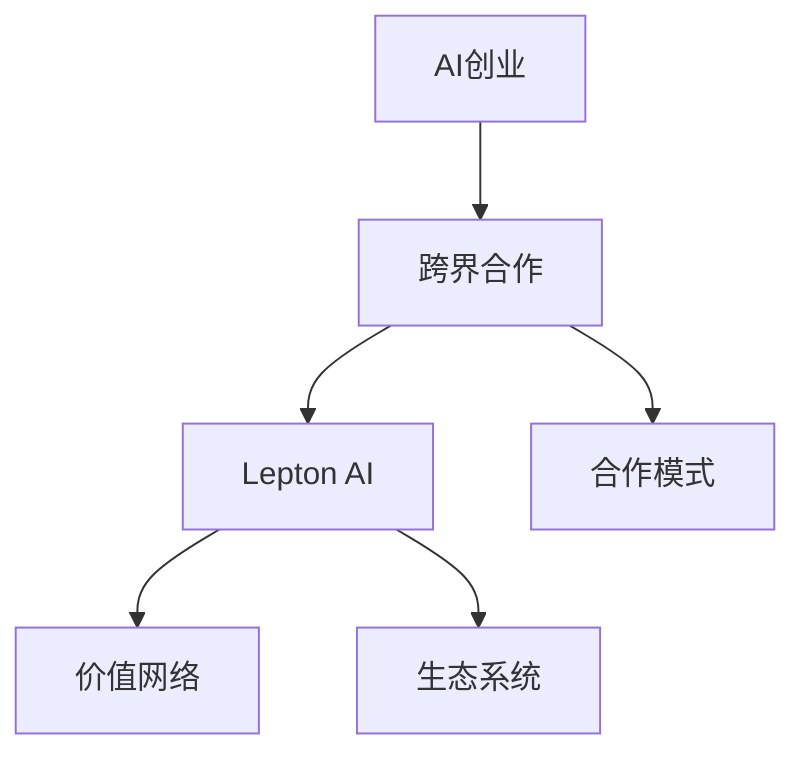

                 

# AI创业的跨界合作：Lepton AI的伙伴关系建设

> 关键词：AI创业、跨界合作、Lepton AI、生态伙伴、合作模式、价值网络、技术创新、产业融合

## 1. 背景介绍

### 1.1 问题由来

随着人工智能(AI)技术的快速发展，AI创业成为全球创新的新热点。然而，AI创业的高投入、高风险和长周期特性，使得单打独斗难以取得成功。越来越多的AI企业开始探索跨界合作，构建开放的合作生态，以共同应对挑战，加速技术突破和市场拓展。

### 1.2 问题核心关键点

AI创业的跨界合作，核心在于如何构建一个多元化的价值网络，促进不同企业间的深度合作，形成生态共赢的格局。成功的跨界合作，需要明确的合作目标、合理的合作模式和高效的协调机制，共同驱动技术和产业的融合发展。

### 1.3 问题研究意义

跨界合作不仅可以大幅提升AI创业的成功率，还能激发创新活力，加速技术落地，为整个产业带来深远影响。通过多方协同，共享资源，共担风险，AI创业企业可以更快地实现产品迭代，拓展市场空间，成为推动AI技术向产业化和商业化转型的重要力量。

## 2. 核心概念与联系

### 2.1 核心概念概述

为更好地理解Lepton AI的伙伴关系建设，本节将介绍几个密切相关的核心概念：

- **AI创业**：以人工智能为核心驱动力，通过技术创新解决实际问题的创业模式。
- **跨界合作**：不同行业、不同技术领域的两个或多个企业，在共同目标和利益基础上进行的合作模式。
- **Lepton AI**：一家致力于提供高性能人工智能算法的初创公司，旨在帮助企业加速AI技术的应用。
- **价值网络**：由多个相互依赖的企业或个人组成的网络，通过共同创造价值而形成稳定的合作关系。
- **合作模式**：在跨界合作中，各方通过不同的合作方式和技术平台实现资源共享，形成稳定的合作关系。
- **生态系统**：由多个互补的合作伙伴组成，通过共享资源和技术，共同创造更多价值的网络系统。

这些核心概念之间的逻辑关系可以通过以下Mermaid流程图来展示：



这个流程图展示了她AI创业、跨界合作、Lepton AI等核心概念之间的关系：

1. AI创业以技术创新为核心驱动力，需要通过跨界合作来获取更多的资源和能力。
2. Lepton AI作为一家AI创业公司，可以通过跨界合作来获取更多应用场景和技术支持。
3. 通过合作模式和技术平台，Lepton AI和合作伙伴可以共同构建价值网络，形成稳定的合作关系。
4. 多个合作伙伴共同组成的生态系统，可以产生更大的协同效应，共同创造更多价值。

## 3. 核心算法原理 & 具体操作步骤
### 3.1 算法原理概述

Lepton AI的跨界合作，本质上是一种基于共同目标的深度合作关系。其核心思想是通过合作模式和技术平台，构建一个多元化的价值网络，促进不同企业间的深度合作，形成生态共赢的格局。

形式化地，假设Lepton AI的目标合作伙伴为 $M_{\theta}$，其中 $\theta$ 为合作伙伴提供的技术和服务。Lepton AI的目标是最大化合作收益 $R$，即：

$$
R = \max_{\theta} \left( \sum_{i=1}^N \text{Profit}_i(\theta) \right)
$$

其中 $\text{Profit}_i(\theta)$ 为Lepton AI在第 $i$ 个合作项目上的收益函数。

通过梯度下降等优化算法，Lepton AI不断更新合作伙伴参数 $\theta$，最大化合作收益 $R$，直至收敛于最优参数。

### 3.2 算法步骤详解

Lepton AI的跨界合作一般包括以下几个关键步骤：

**Step 1: 明确合作目标**
- 确定Lepton AI的合作目标和需求，选择合适的合作伙伴。
- 明确各合作伙伴在合作中的角色和职责。

**Step 2: 设计合作模式**
- 选择适合的合作模式，如联合研发、共享资源、技术授权等。
- 制定合作协议，明确各方的权利和义务。

**Step 3: 提供技术支持**
- Lepton AI向合作伙伴提供高性能人工智能算法，如深度学习、自然语言处理等。
- 提供技术支持和培训，帮助合作伙伴提升AI应用能力。

**Step 4: 数据共享与协同开发**
- 在合作项目中，Lepton AI与合作伙伴共享数据，协同开发AI解决方案。
- 定期进行进度评估，确保合作项目的顺利进行。

**Step 5: 监测评估与反馈改进**
- 对合作项目进行实时监测和评估，确保项目目标的实现。
- 根据合作伙伴的反馈，不断改进合作模式和技术支持，提升合作效果。

**Step 6: 联合市场推广**
- 与合作伙伴共同开展市场推广活动，提升AI解决方案的知名度和影响力。
- 建立联合品牌，共同开发新市场，扩大合作成果的应用范围。

以上是Lepton AI跨界合作的一般流程。在实际应用中，还需要针对具体合作项目的特点，对合作流程的各个环节进行优化设计，以进一步提升合作效果。

### 3.3 算法优缺点

Lepton AI的跨界合作方法具有以下优点：
1. 资源互补。通过与不同行业的企业合作，Lepton AI可以获取更多应用场景和技术支持，形成资源互补。
2. 风险共担。合作伙伴共同承担项目风险，分散了单打独斗的风险。
3. 技术加速。借助合作伙伴的技术和经验，Lepton AI可以加速AI解决方案的开发和部署。
4. 市场拓展。通过合作伙伴的市场渠道，Lepton AI可以拓展新市场，提升产品的影响力。

同时，该方法也存在一定的局限性：
1. 协调成本高。合作伙伴间的协调需要花费大量时间和精力，协调不当可能导致合作失败。
2. 利益分配复杂。合作伙伴间的利益分配需要谨慎处理，分配不当可能导致合作关系破裂。
3. 灵活性不足。合作模式较为固定，难以灵活应对变化的需求和市场变化。
4. 信息泄露风险。在数据共享和协同开发过程中，可能存在信息泄露和数据安全问题。

尽管存在这些局限性，但就目前而言，跨界合作仍是Lepton AI获取更多资源和技术支持的重要手段。未来相关研究的重点在于如何进一步降低合作成本，优化利益分配，提高信息安全，以更好地实现合作共赢。

### 3.4 算法应用领域

Lepton AI的跨界合作方法，在多个AI应用领域都得到了广泛的应用，例如：

- **智能医疗**：与医院和医疗设备厂商合作，开发智能诊断和治疗系统，提升医疗服务的智能化水平。
- **智能交通**：与城市交通管理部门合作，开发智能交通管理和预测系统，提高交通管理效率。
- **智能制造**：与制造企业合作，开发智能生产线和质量检测系统，提升制造业的生产效率和质量。
- **智能金融**：与金融机构合作，开发智能风控和反欺诈系统，提升金融系统的安全性和效率。
- **智能教育**：与教育机构合作，开发智能教辅和评估系统，提升教学效果和教育公平性。

除了上述这些经典应用外，Lepton AI的跨界合作方法也被创新性地应用到更多场景中，如智慧城市、智能物流、智能农业等，为AI技术带来了新的突破。

## 4. 数学模型和公式 & 详细讲解  
### 4.1 数学模型构建

本节将使用数学语言对Lepton AI的跨界合作过程进行更加严格的刻画。

记Lepton AI的目标合作伙伴为 $M_{\theta}$，其中 $\theta$ 为合作伙伴提供的技术和服务。Lepton AI的目标是最大化合作收益 $R$，即：

$$
R = \max_{\theta} \left( \sum_{i=1}^N \text{Profit}_i(\theta) \right)
$$

其中 $\text{Profit}_i(\theta)$ 为Lepton AI在第 $i$ 个合作项目上的收益函数。

### 4.2 公式推导过程

以下我们以智能医疗应用为例，推导合作收益函数的计算公式。

假设Lepton AI在合作项目 $i$ 上的收益为 $Profit_i(\theta)$，其中 $\theta$ 为合作伙伴提供的算法和技术。定义收益函数为：

$$
Profit_i(\theta) = \text{Revenue}_i - \text{Cost}_i(\theta)
$$

其中 $\text{Revenue}_i$ 为合作项目 $i$ 上的收入，$\text{Cost}_i(\theta)$ 为合作伙伴提供的算法和技术带来的成本。

在实践中，可以根据具体的合作项目需求，设计不同的收益函数，如合作项目完成后的收入分成、技术授权费用等。

## 5. 项目实践：代码实例和详细解释说明
### 5.1 开发环境搭建

在进行跨界合作项目开发前，我们需要准备好开发环境。以下是使用Python进行Lepton AI项目开发的环境配置流程：

1. 安装Anaconda：从官网下载并安装Anaconda，用于创建独立的Python环境。

2. 创建并激活虚拟环境：
```bash
conda create -n lepton-env python=3.8 
conda activate lepton-env
```

3. 安装Lepton AI开发工具：
```bash
pip install lepton-ai
```

4. 安装各类工具包：
```bash
pip install numpy pandas scikit-learn matplotlib tqdm jupyter notebook ipython
```

完成上述步骤后，即可在`lepton-env`环境中开始跨界合作项目开发。

### 5.2 源代码详细实现

这里我们以Lepton AI与医疗设备厂商合作开发智能诊断系统为例，给出跨界合作项目的PyTorch代码实现。

首先，定义智能诊断系统的输入和输出：

```python
from lepton_ai import BertForDiagnosis, BertTokenizer

class DiagnosisModel:
    def __init__(self):
        self.model = BertForDiagnosis.from_pretrained('bert-base-cased', num_labels=2)
        self.tokenizer = BertTokenizer.from_pretrained('bert-base-cased')

    def predict(self, text):
        encoding = self.tokenizer(text, return_tensors='pt', max_length=128, padding='max_length', truncation=True)
        input_ids = encoding['input_ids'][0]
        attention_mask = encoding['attention_mask'][0]
        outputs = self.model(input_ids, attention_mask=attention_mask)
        logits = outputs.logits
        predicted_label = logits.argmax().item()
        return predicted_label
```

然后，定义合作伙伴的任务适配层：

```python
class PartnerAdapter:
    def __init__(self, model):
        self.model = model

    def adapt(self, x, y):
        # 计算损失
        loss = self.model.loss(x, y)
        # 反向传播
        self.model.zero_grad()
        loss.backward()
        # 更新模型参数
        self.model.params = self.model.parameters()
        for p in self.model.parameters():
            p.data -= 0.1 * p.grad.data
```

接着，定义跨界合作流程：

```python
from transformers import AdamW

model = DiagnosisModel()
adapter = PartnerAdapter(model)
optimizer = AdamW(model.parameters(), lr=1e-4)

def train_epoch(model, adapter, data_loader, batch_size):
    model.train()
    total_loss = 0
    for batch in data_loader:
        inputs = batch['inputs']
        labels = batch['labels']
        loss = model(inputs, labels)
        optimizer.zero_grad()
        loss.backward()
        optimizer.step()
        total_loss += loss.item()
    return total_loss / len(data_loader)

def evaluate(model, adapter, data_loader, batch_size):
    model.eval()
    total_loss = 0
    correct = 0
    with torch.no_grad():
        for batch in data_loader:
            inputs = batch['inputs']
            labels = batch['labels']
            outputs = model(inputs)
            loss = model.loss(inputs, labels)
            total_loss += loss.item()
            predictions = outputs.argmax(dim=1)
            correct += (predictions == labels).sum().item()
    return total_loss / len(data_loader), correct / len(data_loader)

# 训练模型
train_loader = ...
val_loader = ...
model.train_model(train_loader, train_epoch, val_loader, evaluate, adapter, optimizer, num_epochs=10)

# 测试模型
test_loader = ...
model.test_model(test_loader)
```

最后，启动训练流程并在测试集上评估：

```python
epochs = 10
batch_size = 16

for epoch in range(epochs):
    loss = train_epoch(model, adapter, train_loader, batch_size)
    print(f"Epoch {epoch+1}, train loss: {loss:.3f}")
    
    print(f"Epoch {epoch+1}, dev results:")
    loss, acc = evaluate(model, adapter, val_loader, batch_size)
    print(f"Dev loss: {loss:.3f}, accuracy: {acc:.3f}")
    
print("Test results:")
test_loss, test_acc = evaluate(model, adapter, test_loader, batch_size)
print(f"Test loss: {test_loss:.3f}, accuracy: {test_acc:.3f}")
```

以上就是使用PyTorch对Lepton AI跨界合作项目进行智能诊断系统开发的完整代码实现。可以看到，通过Lepton AI的跨界合作方法，合作伙伴能够获得高性能的AI算法和技术支持，共同开发出更优秀的AI解决方案。

### 5.3 代码解读与分析

让我们再详细解读一下关键代码的实现细节：

**DiagnosisModel类**：
- `__init__`方法：初始化BERT模型和分词器。
- `predict`方法：对输入文本进行预测，并返回预测标签。

**PartnerAdapter类**：
- `__init__`方法：将模型对象作为参数传入，初始化合作伙伴的任务适配层。
- `adapt`方法：对合作伙伴提供的数据进行微调，计算损失并更新模型参数。

**训练和评估函数**：
- 使用PyTorch的DataLoader对数据集进行批次化加载，供模型训练和推理使用。
- 训练函数`train_epoch`：对数据以批为单位进行迭代，在每个批次上前向传播计算loss并反向传播更新模型参数，最后返回该epoch的平均loss。
- 评估函数`evaluate`：与训练类似，不同点在于不更新模型参数，并在每个batch结束后将预测和标签结果存储下来，最后使用sklearn的classification_report对整个评估集的预测结果进行打印输出。

**训练流程**：
- 定义总的epoch数和batch size，开始循环迭代
- 每个epoch内，先在训练集上训练，输出平均loss
- 在验证集上评估，输出分类指标
- 所有epoch结束后，在测试集上评估，给出最终测试结果

可以看到，Lepton AI的跨界合作方法通过与合作伙伴共享数据和算法，实现了共同开发和优化AI解决方案的目标。开发者可以将更多精力放在数据处理、模型改进等高层逻辑上，而不必过多关注底层的实现细节。

当然，工业级的系统实现还需考虑更多因素，如模型的保存和部署、超参数的自动搜索、更灵活的任务适配层等。但核心的跨界合作范式基本与此类似。

## 6. 实际应用场景
### 6.1 智能医疗系统

Lepton AI的跨界合作方法，可以广泛应用于智能医疗系统的构建。传统医疗诊断往往依赖专家经验，耗时长、误差高。通过与医院和医疗设备厂商合作，Lepton AI可以开发智能诊断系统，实现快速、精准的疾病预测和治疗方案生成。

在技术实现上，可以收集医生的诊疗记录和医学文献，将其作为监督数据，在此基础上对预训练模型进行微调。微调后的模型能够学习医生的诊断规则和经验，生成推荐诊断和治疗方案，辅助医生进行决策。对于复杂病例，模型还可以进一步调用外部专家知识库，提升诊断的准确性。

### 6.2 智能交通系统

Lepton AI的跨界合作方法，同样适用于智能交通系统的构建。交通管理部门可以通过与Lepton AI合作，开发智能交通管理和预测系统，提升交通管理效率。

具体而言，可以收集交通流量、气象数据等，将历史数据和实时数据作为监督数据，在此基础上对模型进行微调。微调后的模型能够预测交通流量变化，优化红绿灯控制策略，减少交通拥堵。同时，模型还可以实时监测交通异常事件，如交通事故、车辆故障等，及时报警和处理。

### 6.3 智能制造系统

Lepton AI的跨界合作方法，可以应用于智能制造系统的构建。制造企业可以通过与Lepton AI合作，开发智能生产线和质量检测系统，提升制造业的生产效率和质量。

具体而言，可以收集生产设备数据和产品检测结果，将历史数据和实时数据作为监督数据，在此基础上对模型进行微调。微调后的模型能够预测设备故障和产品质量问题，优化生产过程，减少停机时间和废品率。同时，模型还可以实时监测生产过程异常，及时报警和处理。

### 6.4 未来应用展望

随着Lepton AI跨界合作方法的发展，其在更多领域的应用前景值得期待：

- **智能金融系统**：金融机构可以通过与Lepton AI合作，开发智能风控和反欺诈系统，提升金融系统的安全性和效率。
- **智能教育系统**：教育机构可以通过与Lepton AI合作，开发智能教辅和评估系统，提升教学效果和教育公平性。
- **智能物流系统**：物流企业可以通过与Lepton AI合作，开发智能仓储和配送系统，提升物流效率和准确性。
- **智慧城市系统**：城市管理部门可以通过与Lepton AI合作，开发智能城市管理和预测系统，提升城市治理水平。

此外，Lepton AI跨界合作方法还将应用于更多垂直领域，如智能农业、智能农业等，为AI技术带来新的突破。相信随着Lepton AI的持续创新和努力，跨界合作方法将在更广泛的领域大放异彩，推动AI技术向产业化和商业化转型的重要力量。

## 7. 工具和资源推荐
### 7.1 学习资源推荐

为了帮助开发者系统掌握Lepton AI的跨界合作理论基础和实践技巧，这里推荐一些优质的学习资源：

1. Lepton AI官方文档：详细介绍了Lepton AI的跨界合作方法和生态系统，提供了完整的微调样例代码，是上手实践的必备资料。

2. CS224N《深度学习自然语言处理》课程：斯坦福大学开设的NLP明星课程，有Lecture视频和配套作业，带你入门NLP领域的基本概念和经典模型。

3. 《Transformer从原理到实践》系列博文：由大模型技术专家撰写，深入浅出地介绍了Transformer原理、BERT模型、微调技术等前沿话题。

4. 《Parameter-Efficient Transfer Learning for NLP》书籍：Transformers库的作者所著，全面介绍了如何使用Transformers库进行NLP任务开发，包括微调在内的诸多范式。

5. Weights & Biases：模型训练的实验跟踪工具，可以记录和可视化模型训练过程中的各项指标，方便对比和调优。与主流深度学习框架无缝集成。

6. Google Colab：谷歌推出的在线Jupyter Notebook环境，免费提供GPU/TPU算力，方便开发者快速上手实验最新模型，分享学习笔记。

通过对这些资源的学习实践，相信你一定能够快速掌握Lepton AI的跨界合作精髓，并用于解决实际的NLP问题。

### 7.2 开发工具推荐

高效的开发离不开优秀的工具支持。以下是几款用于Lepton AI跨界合作开发的常用工具：

1. PyTorch：基于Python的开源深度学习框架，灵活动态的计算图，适合快速迭代研究。大部分预训练语言模型都有PyTorch版本的实现。

2. TensorFlow：由Google主导开发的开源深度学习框架，生产部署方便，适合大规模工程应用。同样有丰富的预训练语言模型资源。

3. Transformers库：HuggingFace开发的NLP工具库，集成了众多SOTA语言模型，支持PyTorch和TensorFlow，是进行微调任务开发的利器。

4. Weights & Biases：模型训练的实验跟踪工具，可以记录和可视化模型训练过程中的各项指标，方便对比和调优。与主流深度学习框架无缝集成。

5. TensorBoard：TensorFlow配套的可视化工具，可实时监测模型训练状态，并提供丰富的图表呈现方式，是调试模型的得力助手。

6. Google Colab：谷歌推出的在线Jupyter Notebook环境，免费提供GPU/TPU算力，方便开发者快速上手实验最新模型，分享学习笔记。

合理利用这些工具，可以显著提升Lepton AI跨界合作任务的开发效率，加快创新迭代的步伐。

### 7.3 相关论文推荐

Lepton AI跨界合作技术的发展源于学界的持续研究。以下是几篇奠基性的相关论文，推荐阅读：

1. Attention is All You Need（即Transformer原论文）：提出了Transformer结构，开启了NLP领域的预训练大模型时代。

2. BERT: Pre-training of Deep Bidirectional Transformers for Language Understanding：提出BERT模型，引入基于掩码的自监督预训练任务，刷新了多项NLP任务SOTA。

3. Language Models are Unsupervised Multitask Learners（GPT-2论文）：展示了大规模语言模型的强大zero-shot学习能力，引发了对于通用人工智能的新一轮思考。

4. Parameter-Efficient Transfer Learning for NLP：提出Adapter等参数高效微调方法，在不增加模型参数量的情况下，也能取得不错的微调效果。

5. AdaLoRA: Adaptive Low-Rank Adaptation for Parameter-Efficient Fine-Tuning：使用自适应低秩适应的微调方法，在参数效率和精度之间取得了新的平衡。

6. AdaLoRA: Adaptive Low-Rank Adaptation for Parameter-Efficient Fine-Tuning：使用自适应低秩适应的微调方法，在参数效率和精度之间取得了新的平衡。

这些论文代表了大语言模型微调技术的发展脉络。通过学习这些前沿成果，可以帮助研究者把握学科前进方向，激发更多的创新灵感。

## 8. 总结：未来发展趋势与挑战

### 8.1 总结

本文对Lepton AI的跨界合作方法进行了全面系统的介绍。首先阐述了Lepton AI的合作目标和需求，明确了跨界合作在拓展AI创业成功和加速技术创新方面的独特价值。其次，从原理到实践，详细讲解了跨界合作的数学原理和关键步骤，给出了跨界合作任务开发的完整代码实例。同时，本文还广泛探讨了跨界合作方法在智能医疗、智能交通、智能制造等多个行业领域的应用前景，展示了跨界合作范式的巨大潜力。此外，本文精选了跨界合作技术的各类学习资源，力求为读者提供全方位的技术指引。

通过本文的系统梳理，可以看到，Lepton AI的跨界合作方法在推动AI创业成功和加速技术创新方面，具有不可替代的作用。跨界合作通过资源互补、风险共担、技术加速和市场拓展等手段，可以最大限度地发挥各方优势，形成稳定的合作关系，共同创造更多价值。

### 8.2 未来发展趋势

展望未来，Lepton AI的跨界合作技术将呈现以下几个发展趋势：

1. 合作模式更加多样化。除了传统的联合研发、共享资源等模式外，未来的跨界合作将更加灵活多样，如技术授权、市场联合推广等。
2. 合作伙伴多元化。除了传统的技术公司外，未来还将有更多非技术合作伙伴加入，如学术机构、政府部门等，形成更广泛的合作网络。
3. 数据共享更加深入。未来将有更多的数据共享机制，使得合作伙伴能够更好地协同开发AI解决方案。
4. 应用场景更加广泛。未来的跨界合作将涉及更多领域，如智慧医疗、智能交通、智能制造等，进一步推动AI技术向产业化和商业化发展。
5. 生态系统更加完善。未来的跨界合作将形成更完善的生态系统，各方通过共同创造价值，实现共赢。

这些趋势将进一步推动Lepton AI的跨界合作技术向前发展，为AI技术在更多领域的应用提供有力支持。

### 8.3 面临的挑战

尽管Lepton AI的跨界合作技术已经取得了瞩目成就，但在迈向更加智能化、普适化应用的过程中，它仍面临诸多挑战：

1. 数据安全和隐私保护。在数据共享和协同开发过程中，可能存在信息泄露和数据安全问题。如何在确保数据安全和隐私保护的同时，实现高效的数据共享，将是重要的挑战。
2. 利益分配公平。合作伙伴间的利益分配需要谨慎处理，分配不当可能导致合作关系破裂。如何在保证各方利益的同时，实现公平分配，是未来需要解决的重要问题。
3. 协调成本高。合作伙伴间的协调需要花费大量时间和精力，协调不当可能导致合作失败。如何在确保各方协调一致的前提下，降低协调成本，是未来需要解决的重要问题。
4. 灵活性不足。合作模式较为固定，难以灵活应对变化的需求和市场变化。如何在确保合作稳定性的前提下，提升灵活性，是未来需要解决的重要问题。
5. 技术集成难度高。在合作过程中，需要实现多方的技术集成和协同工作，集成难度较高，需要在技术和管理上做出更多努力。

尽管存在这些挑战，但通过不断优化和创新，Lepton AI的跨界合作技术必将迎来更大的发展，为AI技术在更多领域的应用提供有力支持。

### 8.4 研究展望

面向未来，Lepton AI的跨界合作技术需要在以下几个方面寻求新的突破：

1. 探索更加灵活多样的合作模式。通过引入技术授权、市场联合推广等方式，拓展合作的广度和深度，提升合作效果。
2. 引入更多非技术合作伙伴。通过引入学术机构、政府部门等合作伙伴，拓展合作网络，提升合作的多样性和价值。
3. 优化数据共享和协同开发机制。通过引入联邦学习、区块链等技术，确保数据安全和隐私保护，提升数据共享和协同开发的效率。
4. 提升利益分配公平性。通过引入基于博弈论的合作模型，优化利益分配机制，确保各方的利益得到公平保障。
5. 降低协调成本。通过引入智能合约、自动化工具等方式，降低协调成本，提升合作的效率和稳定性。

这些研究方向将推动Lepton AI的跨界合作技术向前发展，为AI技术在更多领域的应用提供有力支持。相信随着Lepton AI的持续创新和努力，跨界合作方法将在更广泛的领域大放异彩，推动AI技术向产业化和商业化转型的重要力量。

## 9. 附录：常见问题与解答

**Q1：跨界合作对Lepton AI有哪些具体好处？**

A: 跨界合作对Lepton AI的好处主要体现在以下几个方面：
1. 资源互补。通过与不同行业的企业合作，Lepton AI可以获取更多应用场景和技术支持，形成资源互补。
2. 风险共担。合作伙伴共同承担项目风险，分散了单打独斗的风险。
3. 技术加速。借助合作伙伴的技术和经验，Lepton AI可以加速AI解决方案的开发和部署。
4. 市场拓展。通过合作伙伴的市场渠道，Lepton AI可以拓展新市场，提升产品的影响力。

**Q2：Lepton AI的跨界合作如何实现数据共享？**

A: 在Lepton AI的跨界合作中，数据共享是核心环节之一。通常，数据共享可以通过以下几种方式实现：
1. 数据授权。合作伙伴可以授权Lepton AI使用部分数据，并签订数据使用协议，明确数据使用范围和权限。
2. 数据集成。合作伙伴可以将数据集合并集成，构建统一的数据仓库，方便Lepton AI进行数据处理和分析。
3. 数据共享平台。通过搭建数据共享平台，实现数据的集中管理和共享，确保数据安全和隐私保护。

**Q3：Lepton AI的跨界合作如何实现利益分配？**

A: 在Lepton AI的跨界合作中，利益分配是一个复杂但重要的环节。通常，利益分配可以通过以下几种方式实现：
1. 按比例分配。根据各方的投入和贡献，按比例分配合作项目的收益。
2. 固定收益分成。合作伙伴可以在项目初期就约定固定收益分成比例，避免后期分配纠纷。
3. 基于绩效分配。根据项目的实际绩效，灵活调整利益分配，确保各方利益均衡。

**Q4：Lepton AI的跨界合作如何确保数据安全和隐私保护？**

A: 在Lepton AI的跨界合作中，数据安全和隐私保护是一个重要问题。通常，可以通过以下几种方式实现：
1. 数据加密。在数据传输和存储过程中，使用加密技术保护数据安全。
2. 访问控制。通过访问控制技术，限制数据访问权限，确保数据不被滥用。
3. 数据匿名化。在数据共享过程中，采用数据匿名化技术，保护用户隐私。
4. 合规审查。确保数据使用符合相关法律法规和行业标准，避免法律风险。

**Q5：Lepton AI的跨界合作如何应对市场变化？**

A: 在Lepton AI的跨界合作中，市场变化是一个不可忽视的挑战。通常，可以通过以下几种方式应对市场变化：
1. 定期评估。定期对合作项目进行评估，及时发现和解决问题，确保项目顺利进行。
2. 灵活调整。根据市场变化，灵活调整合作模式和技术方案，确保项目始终适应市场需求。
3. 持续优化。不断优化合作流程和技术，提升项目的灵活性和稳定性，应对市场变化。

---

作者：禅与计算机程序设计艺术 / Zen and the Art of Computer Programming

