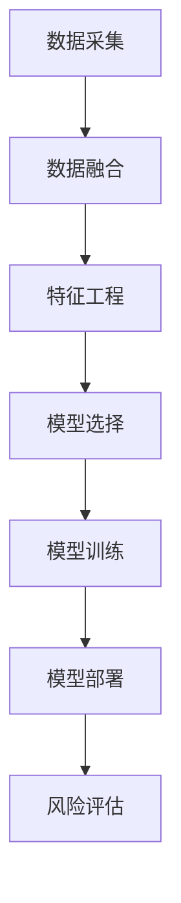

                 

## 1. 背景介绍

### 1.1 问题由来

金融行业，尤其是银行业，一直以来都是人工智能技术的重要应用场景之一。传统的金融服务往往依赖于规则驱动的决策模型，难以处理复杂多变的情况。随着大数据和机器学习技术的发展，越来越多的金融机构开始借助人工智能进行客户风险评估和信用评分等个性化服务。

在风险评估中，AI技术可以帮助金融机构更好地了解客户的财务状况、行为特征以及潜在的风险点。通过分析客户的金融交易记录、社交媒体行为、手机使用习惯等数据，AI可以构建精准的客户画像，预测客户的违约风险。这种基于数据的决策方式，相比传统的人工审核，能够大幅提升风险评估的效率和准确性。

### 1.2 问题核心关键点

金融风险评估的核心在于利用机器学习模型，对客户的各项指标进行量化分析，综合考虑客户的信用历史、收入水平、资产负债情况、行为特征等多维度数据，预测其违约概率。AI在金融风险评估中的应用，主要体现在以下几个方面：

1. **数据采集与整合**：收集和整合客户的各类数据，包括财务报表、交易记录、社交媒体等，构建全面、统一的客户数据档案。
2. **特征工程与模型选择**：基于收集到的数据，设计合适的特征，选择合适的机器学习模型进行训练和预测。
3. **模型训练与验证**：使用历史数据对模型进行训练，通过交叉验证等方法验证模型的泛化能力。
4. **模型部署与应用**：将训练好的模型部署到生产环境中，实时分析客户的风险水平，指导信贷决策和风险管理。

### 1.3 问题研究意义

AI在金融风险评估中的应用，对提升金融服务的个性化水平、提高风险管理的效率和精确度、增强客户满意度具有重要意义：

1. **提升决策效率**：AI可以在短时间内处理大量的数据，实时分析客户的风险水平，辅助决策者快速做出判断。
2. **提高预测准确性**：AI模型能够结合多个维度的数据，综合预测客户的违约概率，降低传统决策模型的误判率。
3. **增强风险管理**：通过AI对客户的持续监控和评估，可以及时发现风险信号，提前采取措施，降低潜在风险。
4. **优化客户体验**：AI技术可以自动生成个性化的风险评估报告，提供客户需要的信息，增强客户的信任和满意度。
5. **促进金融创新**：AI的应用可以推动金融服务的创新，如基于AI的智能投顾、智能信用评估等，为客户提供更加便捷、个性化的服务。

## 2. 核心概念与联系

### 2.1 核心概念概述

为更好地理解AI在金融风险评估中的应用，本节将介绍几个密切相关的核心概念：

- **AI风险评估**：使用机器学习和深度学习模型，对客户的各项指标进行量化分析，预测客户的违约概率。
- **数据融合**：将来自不同渠道、不同格式的客户数据整合在一起，形成全面、统一的客户画像。
- **特征工程**：选择、组合和优化特征，以提高模型的预测准确性。
- **模型训练**：使用历史数据对AI模型进行训练，优化模型的参数，使其具备泛化能力。
- **模型部署**：将训练好的模型部署到生产环境中，实时处理新数据，辅助信贷决策和风险管理。

这些核心概念之间的逻辑关系可以通过以下Mermaid流程图来展示：



这个流程图展示了AI在金融风险评估中的核心流程：

1. 收集并整合客户的各类数据。
2. 设计合适的特征，并选择适合的风险评估模型。
3. 使用历史数据对模型进行训练，调整参数。
4. 将训练好的模型部署到生产环境中，实时处理新数据。
5. 利用模型对客户的风险水平进行评估，辅助决策。

## 3. 核心算法原理 & 具体操作步骤

### 3.1 算法原理概述

AI在金融风险评估中的核心算法通常包括分类算法和回归算法。分类算法用于预测客户的违约状态（是或否），而回归算法用于预测客户的违约概率。这些算法通常基于大量的历史数据进行训练，通过特征工程和模型选择，构建出精准的风险评估模型。

具体来说，分类算法如逻辑回归、随机森林、支持向量机等，可以根据客户的历史数据，预测其是否会违约。回归算法如线性回归、决策树回归、神经网络回归等，可以预测客户的违约概率，即违约的可能性。

### 3.2 算法步骤详解

AI在金融风险评估中的操作步骤主要包括以下几个步骤：

**Step 1: 数据准备**

- **数据采集**：收集客户的各类数据，包括财务报表、交易记录、社交媒体行为等。
- **数据清洗**：对数据进行清洗，去除缺失值、异常值，确保数据质量。
- **数据标注**：对部分数据进行标注，用于训练模型的监督数据。

**Step 2: 特征工程**

- **特征选择**：根据领域知识和经验，选择对预测有用的特征。
- **特征组合**：将单个特征组合成复合特征，提高模型的预测能力。
- **特征归一化**：对特征进行归一化处理，防止数据间的量纲不一致。
- **特征编码**：将分类特征转换为数值特征，方便模型处理。

**Step 3: 模型选择与训练**

- **模型选择**：选择合适的分类或回归模型，如逻辑回归、决策树、随机森林、神经网络等。
- **模型训练**：使用历史数据对模型进行训练，调整模型的参数。
- **交叉验证**：通过交叉验证等方法，验证模型的泛化能力。

**Step 4: 模型评估**

- **评估指标**：选择合适的评估指标，如准确率、召回率、F1分数、AUC等。
- **模型调优**：根据评估结果，调整模型的参数和结构，优化模型性能。

**Step 5: 模型部署**

- **模型保存**：将训练好的模型保存为可部署的文件或库。
- **模型集成**：将模型集成到生产环境中，实时处理新数据。
- **持续学习**：定期更新模型，适应数据分布的变化。

### 3.3 算法优缺点

AI在金融风险评估中的应用，具有以下优点：

1. **高效性**：AI可以处理大量的数据，实时评估客户的风险水平，提高决策效率。
2. **准确性**：通过综合考虑多个维度的数据，AI能够提高风险评估的准确性，降低误判率。
3. **自动化**：AI能够自动进行特征工程、模型训练等复杂操作，减少人工干预。
4. **可解释性**：AI模型通常具有较好的可解释性，能够清晰地解释模型的决策过程。

同时，AI在金融风险评估中也存在一些缺点：

1. **数据依赖性**：AI模型依赖于高质量、全面性的数据，数据质量问题会影响模型的性能。
2. **模型复杂性**：复杂模型可能存在过拟合风险，需要进行仔细的调参和验证。
3. **算法偏见**：如果数据存在偏见，模型可能会继承这些偏见，产生歧视性输出。
4. **解释难题**：某些AI模型，如深度神经网络，其决策过程复杂，难以解释。

### 3.4 算法应用领域

AI在金融风险评估中的应用，已经广泛应用于银行、保险公司、投资公司等多个领域，涵盖信贷审批、信用评分、保险定价、风险管理等多个方面。具体应用场景包括：

- **信贷审批**：通过AI模型对客户的信用记录、收入水平等进行综合评估，辅助信贷决策。
- **信用评分**：利用AI模型对客户的各项指标进行量化分析，预测客户的违约概率，生成信用评分。
- **保险定价**：基于AI模型对客户的风险进行评估，制定个性化的保险定价策略。
- **风险管理**：通过AI模型对客户的风险进行实时监控和评估，及时发现风险信号，采取应对措施。
- **反欺诈检测**：利用AI模型对客户的异常行为进行检测，识别潜在的欺诈风险。

## 4. 数学模型和公式 & 详细讲解 & 举例说明

### 4.1 数学模型构建

AI在金融风险评估中，通常使用分类和回归模型。以逻辑回归为例，其数学模型可以表示为：

$$ y = \alpha_0 + \sum_{i=1}^n \alpha_i x_i + \epsilon $$

其中，$y$ 表示预测结果（是否违约），$x_i$ 表示特征，$\alpha_i$ 表示特征系数，$\epsilon$ 表示误差项。

### 4.2 公式推导过程

逻辑回归的推导过程主要基于最大似然估计和正则化。假设已知样本 $(x_i, y_i)$，其中 $y_i \in \{0,1\}$，表示客户是否违约，$x_i \in \mathbb{R}^n$ 表示特征向量。根据逻辑回归模型，预测结果 $y$ 可以表示为：

$$ \log \frac{P(Y=1|X=x)}{P(Y=0|X=x)} = \alpha_0 + \sum_{i=1}^n \alpha_i x_i $$

利用对数似然函数，可以推导出逻辑回归模型的损失函数为：

$$ \mathcal{L} = -\frac{1}{N} \sum_{i=1}^N [y_i \log p_i + (1-y_i) \log (1-p_i)] $$

其中，$p_i = \sigma(\alpha_0 + \sum_{i=1}^n \alpha_i x_i)$，$\sigma(\cdot)$ 表示sigmoid函数。

利用梯度下降等优化算法，求解最小化损失函数，得到逻辑回归模型的参数 $\alpha$。

### 4.3 案例分析与讲解

以一个简单的金融风险评估案例来说明逻辑回归模型的应用：

假设有一组客户的交易记录，包括每月消费金额、还款金额、欠款金额等。利用逻辑回归模型，可以预测客户是否会违约。首先，选择适合作为特征的变量，如每月消费金额、还款金额、欠款金额等。然后，将数据分为训练集和测试集，使用训练集对模型进行训练，得到预测结果。在测试集上，对模型的预测结果进行评估，计算准确率、召回率、F1分数等指标。

## 5. 项目实践：代码实例和详细解释说明

### 5.1 开发环境搭建

在进行金融风险评估项目开发前，我们需要准备好开发环境。以下是使用Python进行PyTorch开发的环境配置流程：

1. 安装Anaconda：从官网下载并安装Anaconda，用于创建独立的Python环境。

2. 创建并激活虚拟环境：
```bash
conda create -n fin-env python=3.8 
conda activate fin-env
```

3. 安装PyTorch：根据CUDA版本，从官网获取对应的安装命令。例如：
```bash
conda install pytorch torchvision torchaudio cudatoolkit=11.1 -c pytorch -c conda-forge
```

4. 安装Scikit-learn：
```bash
conda install scikit-learn
```

5. 安装Pandas、NumPy等工具包：
```bash
conda install pandas numpy
```

6. 安装其他依赖包：
```bash
pip install matplotlib seaborn jupyter notebook ipython
```

完成上述步骤后，即可在`fin-env`环境中开始项目实践。

### 5.2 源代码详细实现

下面以信用评分为例，给出使用PyTorch进行逻辑回归模型的代码实现。

首先，导入必要的库：

```python
import torch
import torch.nn as nn
import torch.optim as optim
from sklearn.model_selection import train_test_split
from sklearn.metrics import accuracy_score, recall_score, precision_score, f1_score
import pandas as pd
import numpy as np
```

然后，加载和预处理数据：

```python
data = pd.read_csv('credit_data.csv')
# 选择特征和目标变量
X = data[['monthly_income', 'loan_amount', 'loan_length', 'loan_purpose']]
y = data['default']
# 进行特征归一化
X = (X - X.mean()) / X.std()

# 将数据分为训练集和测试集
X_train, X_test, y_train, y_test = train_test_split(X, y, test_size=0.2, random_state=42)
X_train, X_val, y_train, y_val = train_test_split(X_train, y_train, test_size=0.2, random_state=42)
```

接着，定义逻辑回归模型：

```python
class LogisticRegression(nn.Module):
    def __init__(self, n_features):
        super(LogisticRegression, self).__init__()
        self.linear = nn.Linear(n_features, 1)
        self.sigmoid = nn.Sigmoid()
        
    def forward(self, x):
        x = self.linear(x)
        x = self.sigmoid(x)
        return x
```

然后，训练模型：

```python
model = LogisticRegression(n_features=X_train.shape[1])
criterion = nn.BCELoss()
optimizer = optim.SGD(model.parameters(), lr=0.01, momentum=0.9)

# 训练模型
n_epochs = 100
for epoch in range(n_epochs):
    optimizer.zero_grad()
    outputs = model(X_train)
    loss = criterion(outputs, y_train)
    loss.backward()
    optimizer.step()
    
    # 在验证集上评估模型性能
    if (epoch + 1) % 10 == 0:
        val_outputs = model(X_val)
        val_loss = criterion(val_outputs, y_val)
        val_predictions = torch.round(val_outputs)
        val_accuracy = accuracy_score(y_val, val_predictions)
        val_recall = recall_score(y_val, val_predictions)
        val_precision = precision_score(y_val, val_predictions)
        val_f1 = f1_score(y_val, val_predictions)
        print(f'Epoch {epoch+1}, Val Loss: {val_loss:.4f}, Val Accuracy: {val_accuracy:.4f}, Val Recall: {val_recall:.4f}, Val Precision: {val_precision:.4f}, Val F1 Score: {val_f1:.4f}')
```

最后，在测试集上评估模型：

```python
# 在测试集上评估模型性能
test_outputs = model(X_test)
test_predictions = torch.round(test_outputs)
test_accuracy = accuracy_score(y_test, test_predictions)
test_recall = recall_score(y_test, test_predictions)
test_precision = precision_score(y_test, test_predictions)
test_f1 = f1_score(y_test, test_predictions)
print(f'Test Accuracy: {test_accuracy:.4f}, Test Recall: {test_recall:.4f}, Test Precision: {test_precision:.4f}, Test F1 Score: {test_f1:.4f}')
```

以上就是使用PyTorch进行信用评分逻辑回归模型的完整代码实现。可以看到，利用PyTorch，我们可以方便地定义模型、训练模型，并在测试集上评估模型性能。

### 5.3 代码解读与分析

让我们再详细解读一下关键代码的实现细节：

**数据预处理**：
- `pd.read_csv`：从文件中读取数据。
- `X = data[['monthly_income', 'loan_amount', 'loan_length', 'loan_purpose']]`：选择适合作为特征的变量。
- `y = data['default']`：目标变量。
- `X = (X - X.mean()) / X.std()`：特征归一化，将特征值缩放到均值为0，标准差为1。

**模型定义**：
- `class LogisticRegression(nn.Module)`：定义逻辑回归模型。
- `self.linear = nn.Linear(n_features, 1)`：定义线性层，输出维度为1，表示二分类结果。
- `self.sigmoid = nn.Sigmoid()`：定义sigmoid层，将线性层的输出映射到[0,1]区间。

**模型训练**：
- `optimizer.zero_grad()`：清除梯度。
- `outputs = model(X_train)`：前向传播计算输出。
- `loss = criterion(outputs, y_train)`：计算损失。
- `loss.backward()`：反向传播计算梯度。
- `optimizer.step()`：更新模型参数。

**模型评估**：
- `val_outputs = model(X_val)`：在验证集上进行前向传播。
- `val_predictions = torch.round(val_outputs)`：将输出转换为二分类结果。
- `val_accuracy = accuracy_score(y_val, val_predictions)`：计算验证集上的准确率。
- `val_recall = recall_score(y_val, val_predictions)`：计算验证集上的召回率。
- `val_precision = precision_score(y_val, val_predictions)`：计算验证集上的精确率。
- `val_f1 = f1_score(y_val, val_predictions)`：计算验证集上的F1分数。

通过以上代码，我们展示了使用PyTorch进行金融风险评估的完整流程。在实际应用中，还需要根据具体任务和数据特点进行更多优化，如超参数调优、特征选择、模型融合等。

## 6. 实际应用场景

### 6.1 智能信贷审批

基于AI的智能信贷审批系统，可以快速、准确地评估客户的信用风险。通过收集客户的各类数据，如收入水平、资产负债情况、行为特征等，智能信贷审批系统可以实时生成信用评分，辅助决策者做出信贷决策。这种基于AI的审批方式，不仅提高了审批效率，还减少了人工审核的误差，提升了客户的满意度。

### 6.2 风险管理与预警

AI在风险管理中的应用，可以实时监控客户的风险水平，及时发现风险信号。通过分析客户的交易记录、行为特征等数据，AI模型可以预测客户的违约概率，生成风险报告。金融机构可以根据风险报告，采取相应的措施，如提高保证金要求、调整贷款额度等，从而降低潜在的风险。

### 6.3 个性化金融服务

基于AI的风险评估模型，可以构建个性化的金融服务。例如，保险公司可以根据客户的风险评估结果，制定个性化的保险定价策略，提供更加公平、透明的保费方案。同时，银行可以根据客户的信用评分，提供个性化的信贷产品，满足客户的不同需求。

### 6.4 未来应用展望

随着AI技术的发展，未来金融风险评估将更加智能化、自动化。可以预见，以下几个方面将会有显著的发展：

1. **实时评估**：利用流式数据处理技术，实时评估客户的风险水平，提高决策效率。
2. **多模态数据融合**：将客户的各类数据进行融合，综合评估风险，提高预测准确性。
3. **模型自适应**：利用在线学习技术，定期更新模型，适应数据分布的变化。
4. **深度学习应用**：利用深度神经网络等复杂模型，提升风险评估的准确性和鲁棒性。
5. **模型解释**：通过可解释性技术，提高模型的透明度，增强用户的信任和满意度。

这些技术的进步，将使AI在金融风险评估中发挥更大的作用，推动金融服务的创新和升级。

## 7. 工具和资源推荐

### 7.1 学习资源推荐

为了帮助开发者系统掌握AI在金融风险评估中的应用，这里推荐一些优质的学习资源：

1. 《Python机器学习》：Scikit-learn官方文档，介绍了机器学习算法和工具的使用，适合入门学习。
2. 《深度学习》：Ian Goodfellow的深度学习经典教材，系统讲解深度学习的基础和前沿。
3. 《机器学习实战》：Peter Harrington的实战指南，通过实际项目练习机器学习算法。
4. 《Python数据分析与可视化》：通过Python进行数据分析和可视化的入门教程。
5. Kaggle竞赛平台：通过参加机器学习竞赛，积累实践经验，提升技术水平。

通过对这些资源的学习实践，相信你一定能够快速掌握AI在金融风险评估中的应用，并用于解决实际的金融问题。

### 7.2 开发工具推荐

高效的开发离不开优秀的工具支持。以下是几款用于金融风险评估开发的常用工具：

1. PyTorch：基于Python的开源深度学习框架，灵活的计算图，适合快速迭代研究。
2. Scikit-learn：Python机器学习库，包含多种经典的机器学习算法。
3. Pandas：数据分析库，支持大规模数据的处理和分析。
4. TensorBoard：TensorFlow配套的可视化工具，实时监测模型训练状态，提供丰富的图表呈现方式。
5. Weights & Biases：模型训练的实验跟踪工具，记录和可视化模型训练过程中的各项指标。

合理利用这些工具，可以显著提升金融风险评估的开发效率，加快创新迭代的步伐。

### 7.3 相关论文推荐

金融风险评估是AI应用中的热门研究领域，以下是几篇奠基性的相关论文，推荐阅读：

1. "A Survey on Data Mining and Statistical Learning for Credit Risk Assessment"：综述了信用评分中的数据挖掘和统计学习方法。
2. "Credit Risk Assessment Using Data Mining and Statistical Learning"：介绍了数据挖掘和统计学习在信用风险评估中的应用。
3. "A Survey on AI for Credit Risk Management"：综述了AI在信用风险管理中的应用，包括预测模型、解释模型等。
4. "Credit Risk Modeling Using Machine Learning Techniques"：利用机器学习技术对信用风险进行建模和预测。
5. "Using AI to Predict Credit Risk"：利用AI模型对客户信用风险进行预测和评估。

这些论文代表了大数据和AI技术在金融风险评估中的应用进展，为进一步的研究提供了宝贵的参考。

## 8. 总结：未来发展趋势与挑战

### 8.1 总结

本文对AI在金融风险评估中的应用进行了全面系统的介绍。首先阐述了AI在金融风险评估中的研究背景和意义，明确了AI技术在风险评估中的独特价值。其次，从原理到实践，详细讲解了AI在金融风险评估中的数学模型和操作步骤，给出了具体代码实现。同时，本文还广泛探讨了AI在金融风险评估中的实际应用场景，展示了AI技术的广泛应用前景。

通过本文的系统梳理，可以看到，AI在金融风险评估中的应用，已经在诸多方面取得了显著成果。AI技术的深入应用，不仅提高了风险评估的效率和准确性，还推动了金融服务的创新和升级，具有重要的现实意义。

### 8.2 未来发展趋势

展望未来，AI在金融风险评估中将呈现以下几个发展趋势：

1. **实时评估**：利用流式数据处理技术，实时评估客户的风险水平，提高决策效率。
2. **多模态数据融合**：将客户的各类数据进行融合，综合评估风险，提高预测准确性。
3. **模型自适应**：利用在线学习技术，定期更新模型，适应数据分布的变化。
4. **深度学习应用**：利用深度神经网络等复杂模型，提升风险评估的准确性和鲁棒性。
5. **模型解释**：通过可解释性技术，提高模型的透明度，增强用户的信任和满意度。

这些趋势凸显了AI在金融风险评估中的巨大潜力。随着AI技术的不断进步，未来金融风险评估将更加智能化、自动化，推动金融服务的创新和升级。

### 8.3 面临的挑战

尽管AI在金融风险评估中取得了显著成果，但在迈向更加智能化、普适化应用的过程中，它仍面临着诸多挑战：

1. **数据隐私与安全**：客户数据的隐私和安全问题，是AI在金融领域应用的主要挑战之一。如何保护客户数据，防止数据泄露和滥用，是金融机构必须面对的问题。
2. **模型公平性**：AI模型可能存在偏见，对某些群体产生歧视性的输出。如何构建公平、公正的AI模型，是一个重要的研究方向。
3. **模型复杂性**：复杂模型可能存在过拟合风险，需要进行仔细的调参和验证。
4. **模型解释性**：某些AI模型，如深度神经网络，其决策过程复杂，难以解释。如何赋予AI模型更强的可解释性，将是亟待攻克的难题。
5. **模型鲁棒性**：AI模型面对域外数据时，泛化性能往往大打折扣。如何提高模型的鲁棒性，避免灾难性遗忘，还需要更多理论和实践的积累。

这些挑战需要在未来的研究中不断克服，才能使AI在金融风险评估中发挥更大的作用。

### 8.4 研究展望

面对AI在金融风险评估中面临的挑战，未来的研究需要在以下几个方面寻求新的突破：

1. **数据隐私保护**：利用差分隐私、联邦学习等技术，保护客户数据隐私。
2. **模型公平性**：引入公平性约束，构建公平、公正的AI模型。
3. **模型解释性**：利用可解释性技术，提高AI模型的透明度，增强用户信任。
4. **模型鲁棒性**：通过对抗训练、迁移学习等技术，提高模型的鲁棒性，避免灾难性遗忘。
5. **模型复杂性**：探索参数高效和计算高效的微调范式，在固定大部分预训练参数的同时，只更新极少量的任务相关参数。

这些研究方向的探索，将推动AI在金融风险评估中的创新和发展，为构建安全、可靠、可解释、可控的智能系统铺平道路。面向未来，AI在金融风险评估中的研究还需要与其他人工智能技术进行更深入的融合，如知识表示、因果推理、强化学习等，多路径协同发力，共同推动金融服务的创新和升级。

## 9. 附录：常见问题与解答

**Q1：AI在金融风险评估中，是否需要大量标注数据？**

A: AI在金融风险评估中，通常需要较少量的标注数据。通过特征工程和模型选择，AI可以从非标注数据中学习出有效的特征表示，结合小量的标注数据进行训练，获得较好的预测效果。此外，利用无监督学习和半监督学习的方法，可以在更少的标注数据下进行风险评估。

**Q2：AI模型是否存在过拟合的风险？**

A: AI模型可能会存在过拟合的风险，特别是在数据量较小的情况下。为了避免过拟合，可以采用正则化技术，如L2正则、Dropout等。此外，可以通过调整模型复杂度、增加训练数据等方法，缓解过拟合问题。

**Q3：如何保证AI模型的公平性？**

A: AI模型可能存在偏见，对某些群体产生歧视性的输出。为保证模型的公平性，可以引入公平性约束，如在模型训练中引入公平性指标，如AUC曲线下的公平区域等。此外，可以采用多样化的特征选择，避免对某些特征的过度依赖，从而减少偏见。

**Q4：AI模型是否需要持续更新？**

A: 是的，AI模型需要定期更新，以适应数据分布的变化。通过在线学习技术，模型可以持续从新数据中学习，更新模型参数，保持模型的时效性和准确性。

**Q5：AI模型在金融风险评估中的决策过程是否可解释？**

A: 大多数AI模型，如逻辑回归、决策树等，其决策过程较为简单，可以解释模型的预测结果。但对于深度神经网络等复杂模型，其决策过程较为复杂，难以解释。因此，在实际应用中，需要根据具体任务选择合适的模型，并利用可解释性技术提高模型的透明度。

---

作者：禅与计算机程序设计艺术 / Zen and the Art of Computer Programming

