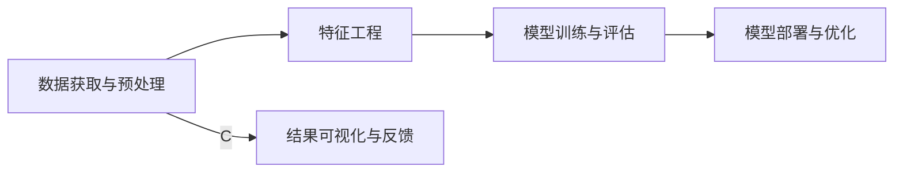

                 

# AI在人力资源管理中的应用：人才匹配

## 1. 背景介绍

在当今信息化、数字化迅速发展的时代，人力资源管理（HRM）已经成为企业竞争力的重要组成部分。传统的HRM往往依赖于人工处理和手动管理，效率低下、准确性不足。而AI技术，尤其是机器学习、深度学习和自然语言处理（NLP）等，已经逐步成为提升HRM效率、精准度、自动化水平的强大工具。其中，AI在人才匹配中的应用尤为引人注目。

### 1.1 问题由来

随着市场竞争日益激烈，企业对于人才的需求也更加多样化和个性化。然而，通过传统的人力资源筛选手段，如简历筛选、面试等，往往无法满足企业对人才精准匹配的期望。特别是对于高技术岗位，如工程师、研究员等，准确识别并匹配到合适的候选人变得尤为重要。

### 1.2 问题核心关键点

AI在人才匹配中的应用，主要涉及以下几个核心关键点：

- **数据获取与预处理**：获取高质量的应聘者数据，并进行清洗、标注、归一化等预处理工作。
- **特征工程**：从简历、履历等文本数据中提取有意义的特征，用于模型训练。
- **模型训练与评估**：使用机器学习算法对候选人数据进行训练，生成人才匹配模型，并使用相关指标评估模型效果。
- **模型部署与优化**：将训练好的模型部署到实际应用中，并根据反馈不断优化模型性能。

### 1.3 问题研究意义

AI在人才匹配中的应用，旨在通过智能化手段，提高人力资源筛选和匹配的效率和准确性，降低企业的招聘成本，提升人才招聘质量。它不仅能够帮助企业快速找到合适的候选人，还能降低由于信息不对称带来的风险，如虚假简历、低匹配度等问题。

## 2. 核心概念与联系

### 2.1 核心概念概述

AI在人才匹配中的核心概念主要包括以下几个方面：

- **机器学习（Machine Learning）**：基于数据训练的算法，能够从数据中自动学习规律，用于分类、回归、聚类等任务。
- **深度学习（Deep Learning）**：一种特殊的机器学习方法，使用多层次神经网络模型处理复杂数据。
- **自然语言处理（NLP）**：使计算机能够理解、处理人类语言的技术，如文本分类、信息抽取、情感分析等。
- **推荐系统（Recommender Systems）**：基于用户行为和偏好，推荐相关物品或内容的系统，广泛用于电商、内容、广告等领域。

这些核心概念在人才匹配中，通过数据处理、特征提取、模型训练、评估优化等步骤，共同完成对候选人数据的智能分析和匹配。

### 2.2 核心概念原理和架构的 Mermaid 流程图



这个流程图展示了人才匹配的整个流程：从数据获取到模型优化，各个步骤相互关联，形成一个完整的循环。

## 3. 核心算法原理 & 具体操作步骤
### 3.1 算法原理概述

AI在人才匹配中的算法原理，主要基于机器学习和深度学习模型。通过收集大量候选人的简历、履历等文本数据，提取其中的关键特征，然后通过训练模型生成候选人与职位匹配的评分。其中，最常用的模型包括支持向量机（SVM）、随机森林（Random Forest）、梯度提升树（GBDT）等。

### 3.2 算法步骤详解

AI在人才匹配中的算法步骤大致分为以下几个环节：

1. **数据获取与预处理**：收集候选人的简历、履历、工作经验等文本数据，并进行清洗、归一化、标注等预处理工作。
2. **特征工程**：从文本数据中提取有意义的特征，如技能、工作经历、教育背景、证书等，用于模型训练。
3. **模型训练与评估**：使用机器学习算法对候选人数据进行训练，生成人才匹配模型，并使用准确率、召回率、F1值等指标评估模型效果。
4. **模型部署与优化**：将训练好的模型部署到实际应用中，并根据反馈不断优化模型性能。

### 3.3 算法优缺点

AI在人才匹配中的应用，具有以下优点：

- **高效性**：自动化的筛选和匹配过程，能够大幅度提高招聘效率。
- **准确性**：机器学习算法能够从大量数据中学习规律，提供高质量的匹配结果。
- **可扩展性**：适用于各种规模的企业，无论是中小型还是大型企业，都可以使用。

同时，也存在一些缺点：

- **数据依赖性**：模型的效果依赖于数据的质量和多样性，数据偏差会影响匹配结果。
- **模型复杂性**：深度学习模型需要较大的计算资源和时间进行训练，且调试和优化难度较大。
- **可解释性不足**：AI模型的决策过程往往是"黑盒"的，难以解释其背后的逻辑。

### 3.4 算法应用领域

AI在人才匹配中的应用，已经在多个领域得到了广泛应用，例如：

- **招聘管理系统**：使用AI技术自动筛选和匹配候选人，提升招聘效率和效果。
- **猎头服务**：通过AI分析市场数据和候选人数据，精准推荐候选人给猎头。
- **员工推荐系统**：使用AI推荐系统推荐适合新职位的员工，促进内部流动和人才发展。

## 4. 数学模型和公式 & 详细讲解 & 举例说明
### 4.1 数学模型构建

AI在人才匹配中的数学模型，主要基于分类任务。假设简历数据集为 $D=\{(x_i, y_i)\}_{i=1}^N$，其中 $x_i$ 为候选人的简历，$y_i$ 为该简历与指定职位的匹配评分。

### 4.2 公式推导过程

以朴素贝叶斯分类器为例，其公式推导如下：

$$
P(y_i|x_i) = \frac{P(x_i|y_i)P(y_i)}{P(x_i)}
$$

其中，$P(x_i)$ 为简历数据的全局概率，$P(y_i)$ 为职位匹配评分的先验概率，$P(x_i|y_i)$ 为简历特征条件下的条件概率。

### 4.3 案例分析与讲解

假设我们有一个机器学习模型，用于预测候选人的技术栈与指定职位的匹配度。模型基于候选人的技术描述、项目经验、学历等特征，生成一个匹配评分。模型的训练数据集包含数千个候选人的简历和职位匹配评分。我们使用交叉验证等技术对模型进行评估，确定最佳超参数，最终部署到实际的人力资源管理系统中。

## 5. 项目实践：代码实例和详细解释说明
### 5.1 开发环境搭建

在进行AI人才匹配系统开发前，需要配置好开发环境。以下是使用Python和PyTorch进行开发的常用环境配置：

1. 安装Anaconda：从官网下载并安装Anaconda，用于创建独立的Python环境。
2. 创建并激活虚拟环境：
```bash
conda create -n pytorch-env python=3.8 
conda activate pytorch-env
```

3. 安装PyTorch：根据CUDA版本，从官网获取对应的安装命令。例如：
```bash
conda install pytorch torchvision torchaudio cudatoolkit=11.1 -c pytorch -c conda-forge
```

4. 安装TensorBoard：用于可视化模型训练过程中的指标，方便调试和监控。
5. 安装Pandas、NumPy、Matplotlib、Scikit-learn等工具包：
```bash
pip install pandas numpy matplotlib scikit-learn
```

### 5.2 源代码详细实现

以下是一个使用PyTorch进行简历文本分类模型的实现：

```python
import torch
import torch.nn as nn
import torch.optim as optim
from torchtext.datasets import IMDB
from torchtext.data import Field, BucketIterator
from sklearn.model_selection import train_test_split

TEXT = Field(tokenize='spacy', lower=True, pad_first=True)
LABEL = Field(sequential=False, use_vocab=False)

train_data, test_data = IMDB.splits(TEXT, LABEL)
train_data, valid_data = train_test_split(train_data, test_size=0.1, random_state=42)

TEXT.build_vocab(train_data, max_size=10000)
LABEL.build_vocab(train_data)

train_iterator, valid_iterator, test_iterator = BucketIterator.splits(
    (train_data, valid_data, test_data),
    batch_size=64,
    device='cuda')

class Net(nn.Module):
    def __init__(self):
        super().__init__()
        self.embedding = nn.Embedding(len(TEXT.vocab), 100)
        self.lstm = nn.LSTM(100, 100, bidirectional=True, dropout=0.5)
        self.fc = nn.Linear(200, 1)

    def forward(self, x):
        embedding = self.embedding(x)
        output, hidden = self.lstm(embedding)
        output = output.contiguous().view(output.size()[0] * output.size()[1], output.size()[2])
        predicted = self.fc(output)
        return predicted

model = Net().to('cuda')
criterion = nn.BCEWithLogitsLoss()
optimizer = optim.Adam(model.parameters(), lr=0.001)

def train(model, iterator, optimizer, criterion):
    model.train()
    total_loss = 0
    for batch in iterator:
        optimizer.zero_grad()
        predictions = model(batch.text).squeeze(1)
        loss = criterion(predictions, batch.label.float())
        loss.backward()
        optimizer.step()
        total_loss += loss.item()
    return total_loss / len(iterator)

def evaluate(model, iterator, criterion):
    model.eval()
    total_loss = 0
    total_correct = 0
    with torch.no_grad():
        for batch in iterator:
            predictions = model(batch.text).squeeze(1)
            loss = criterion(predictions, batch.label.float())
            total_loss += loss.item()
            total_correct += (predictions.round() == batch.label).float().sum().item()
    return total_loss / len(iterator), total_correct / len(iterator)
```

### 5.3 代码解读与分析

**Net类**：
- 定义了简历文本分类模型的结构。
- 包含嵌入层、双向LSTM、全连接层等组件。
- 在`forward`方法中，通过前向传播计算模型的预测输出。

**train函数**：
- 定义训练过程。
- 对每个批次数据进行前向传播和反向传播，更新模型参数。
- 返回该epoch的平均损失值。

**evaluate函数**：
- 定义评估过程。
- 对每个批次数据进行前向传播，计算损失值和分类准确率。
- 返回平均损失和准确率。

**模型训练与评估**：
- 在训练过程中，使用`train`函数进行模型训练，并记录平均损失。
- 在验证过程中，使用`evaluate`函数进行模型评估，并输出平均损失和准确率。

## 6. 实际应用场景
### 6.1 招聘管理系统

AI在招聘管理系统中的应用，可以有效提升招聘效率和准确性。传统招聘管理系统依赖于人工筛选简历，容易因主观因素造成偏见和误差。而AI人才匹配系统通过自动筛选和推荐，能够快速找到符合企业需求的高质量候选人。

在实际应用中，招聘管理系统可以与公司内部的人才库和招聘广告等数据进行集成，自动筛选出符合条件的候选人，并根据匹配评分推荐给招聘人员进行面试。系统还应具备反馈机制，收集招聘人员对推荐的反馈，不断优化模型的预测能力。

### 6.2 猎头服务

猎头服务是企业寻找高端人才的重要渠道。AI人才匹配系统可以通过分析市场数据和候选人数据，精准推荐候选人给猎头，提高猎头的工作效率和质量。

猎头服务系统可以与AI人才匹配系统进行集成，根据猎头的招聘需求，自动推荐符合条件的候选人。系统还可以基于历史推荐数据和候选人反馈，不断优化推荐算法，提升推荐的准确性和个性化。

### 6.3 员工推荐系统

员工推荐系统在企业内部人才流动和晋升方面具有重要应用价值。AI人才匹配系统可以基于员工的技能、项目经验、绩效等数据，推荐适合新职位的员工，促进内部流动和人才发展。

员工推荐系统可以集成到企业内部的HRM系统，根据员工的职业规划和发展需求，自动推荐合适的职位。系统还可以基于历史推荐数据和员工反馈，不断优化推荐模型，提升推荐的准确性和满意度。

## 7. 工具和资源推荐
### 7.1 学习资源推荐

为了帮助开发者系统掌握AI在人才匹配中的应用，这里推荐一些优质的学习资源：

1. 《机器学习实战》系列书籍：介绍机器学习和深度学习的基本概念和实际应用，适合初学者入门。
2. 《深度学习》课程（CS231n）：斯坦福大学开设的深度学习课程，涵盖深度学习的基础和高级技术，提供丰富的学习资源。
3. 《NLP with PyTorch》书籍：介绍如何使用PyTorch进行自然语言处理任务开发，包括文本分类、情感分析等。
4. Kaggle平台：数据科学和机器学习社区，提供丰富的竞赛和数据集，是学习和实践AI人才匹配的好地方。

通过对这些资源的学习实践，相信你一定能够快速掌握AI在人才匹配中的应用技巧，并用于解决实际的HRM问题。

### 7.2 开发工具推荐

高效的开发离不开优秀的工具支持。以下是几款用于AI人才匹配开发的常用工具：

1. PyTorch：基于Python的开源深度学习框架，灵活动态的计算图，适合快速迭代研究。
2. TensorFlow：由Google主导开发的开源深度学习框架，生产部署方便，适合大规模工程应用。
3. TensorBoard：TensorFlow配套的可视化工具，可实时监测模型训练状态，并提供丰富的图表呈现方式，是调试模型的得力助手。
4. Weights & Biases：模型训练的实验跟踪工具，可以记录和可视化模型训练过程中的各项指标，方便对比和调优。
5. HuggingFace Transformers库：提供丰富的预训练模型和模型训练API，方便进行AI人才匹配任务的开发。

合理利用这些工具，可以显著提升AI人才匹配任务的开发效率，加快创新迭代的步伐。

### 7.3 相关论文推荐

AI在人才匹配中的应用，源于学界的持续研究。以下是几篇奠基性的相关论文，推荐阅读：

1. "A Survey of Recurrent Neural Networks and Deep Learning in Human Resource Management"：综述了深度学习在人力资源管理中的应用，包括人才匹配、绩效评估等。
2. "HR Analytics: A Review and Research Agenda for Advancing the Role of Data Analytics in Human Resource Management"：介绍了AI在人力资源管理中的作用，并提出了未来的研究方向。
3. "An Empirical Study on Using Recommendation Systems for Recruiting Employees"：基于推荐系统的人才匹配研究，探索了推荐算法的实际应用效果。
4. "Towards an AI-Powered Personalized Career Planning Service"：探讨了AI在员工职业规划和发展中的应用，为员工推荐系统提供了新思路。

这些论文代表了大语言模型微调技术的发展脉络。通过学习这些前沿成果，可以帮助研究者把握学科前进方向，激发更多的创新灵感。

## 8. 总结：未来发展趋势与挑战
### 8.1 总结

本文对AI在人才匹配中的应用进行了全面系统的介绍。首先阐述了AI在人才匹配中的研究背景和意义，明确了AI技术在提升招聘效率、精准度、自动化水平方面的独特价值。其次，从原理到实践，详细讲解了AI在人才匹配中的数学模型和核心算法，给出了系统化的模型训练和评估方法。同时，本文还探讨了AI人才匹配系统在招聘管理系统、猎头服务、员工推荐系统等多个领域的应用，展示了AI技术在人力资源管理中的广阔前景。

通过本文的系统梳理，可以看到，AI在人才匹配中的应用，不仅能够帮助企业快速找到合适的候选人，还能降低招聘成本，提升人才招聘质量。未来，伴随AI技术的持续进步和应用场景的不断扩展，相信AI在人才匹配中的应用将会更加广泛和深入，为人力资源管理带来革命性的变化。

### 8.2 未来发展趋势

展望未来，AI在人才匹配中的应用将呈现以下几个发展趋势：

1. **自动化招聘流程**：随着AI技术的不断进步，自动化招聘流程将成为企业招聘的重要手段。AI系统能够自动筛选简历、进行面试、评估候选人，极大地提高招聘效率和质量。
2. **个性化推荐系统**：基于AI的人才匹配系统，能够根据候选人的技能、兴趣、经验等数据，推荐适合的职位和公司，提升候选人的求职体验和匹配成功率。
3. **跨领域人才匹配**：未来的AI人才匹配系统，将能够跨领域、跨行业进行人才匹配，满足企业多样化的人才需求。
4. **实时动态匹配**：基于实时数据和市场动态，AI人才匹配系统能够进行动态调整，匹配最合适的候选人，提升招聘效率和效果。
5. **集成协同应用**：未来的AI人才匹配系统，将与其他人力资源管理系统（如绩效评估、员工管理等）进行集成，形成完整的HRM解决方案。

这些趋势凸显了AI在人才匹配中的广阔前景，预示着AI技术将在人力资源管理中发挥越来越重要的作用。

### 8.3 面临的挑战

尽管AI在人才匹配中的应用已经取得了显著成效，但在迈向更加智能化、普适化应用的过程中，它仍面临着诸多挑战：

1. **数据隐私与安全**：候选人的简历和履历数据涉及个人隐私，如何保障数据安全，避免数据泄露和滥用，是一个重要问题。
2. **算法公平与透明**：AI模型在招聘过程中可能存在偏见，如何确保模型的公平性和透明度，避免歧视性招聘，需要更多的研究和实践。
3. **模型可解释性**：AI模型的决策过程往往是"黑盒"的，难以解释其背后的逻辑。如何在保证模型效果的同时，增强其可解释性，将是重要的研究方向。
4. **多语言支持**：AI人才匹配系统在面对不同语言和文化背景的候选人时，需要具备多语言支持的能力，以应对全球化的人才市场。
5. **高成本技术**：AI人才匹配系统的开发和维护需要大量的技术投入和资源支持，对于中小企业可能存在一定的成本压力。

这些挑战需要我们认真对待，积极寻求解决方案，才能进一步推动AI在人才匹配中的应用。

### 8.4 研究展望

面对AI在人才匹配中面临的挑战，未来的研究需要在以下几个方面寻求新的突破：

1. **数据隐私保护技术**：开发基于差分隐私等技术，保障候选人数据的安全性和隐私性。
2. **公平透明算法**：研究基于公平性、透明性的模型设计方法，确保招聘过程的公正和公平。
3. **可解释性增强**：开发可解释性的AI模型，增强模型的透明度和可解释性，提升用户信任和满意度。
4. **多语言支持技术**：开发基于多语言支持的AI人才匹配模型，满足全球化的人才需求。
5. **轻量级模型**：开发轻量级的AI人才匹配模型，降低技术门槛和成本压力。

这些研究方向将推动AI在人才匹配中的应用不断进步，为构建智能、公平、安全的招聘系统提供技术保障。面向未来，AI在人才匹配中的应用将会更加广泛和深入，为人类社会的发展注入新的动力。

## 9. 附录：常见问题与解答

**Q1：AI在人才匹配中的应用是否适用于所有类型的职位？**

A: AI在人才匹配中的应用，主要适用于需要标准化、量化评估的职位，如技术岗位、行政岗位等。对于需要主观评估的职位，如创意类职位，可能难以完全依赖AI进行匹配。

**Q2：AI人才匹配系统如何进行数据隐私保护？**

A: AI人才匹配系统在进行数据处理和模型训练时，应遵守相关法律法规，如《个人信息保护法》等。同时，采用差分隐私等技术，对候选人的数据进行匿名化处理，确保数据安全。

**Q3：AI人才匹配系统的推荐算法是否适用于所有企业？**

A: AI人才匹配系统的推荐算法，需要根据企业的具体情况进行调整和优化。不同企业的人才需求、文化和价值观不同，推荐算法应进行适应性设计。

**Q4：AI人才匹配系统如何进行多语言支持？**

A: 开发基于多语言支持的AI人才匹配模型，需要使用多语言数据进行训练，并使用多语言嵌入技术进行特征提取。同时，应对不同语言的文化背景进行适配，确保模型的普适性。

**Q5：AI人才匹配系统如何确保算法的公平性和透明性？**

A: 开发公平透明算法，应使用公平性指标对模型进行评估和监控，确保模型的公平性和透明性。同时，进行算法解释和可视化，增强模型的可解释性和透明度。

---

作者：禅与计算机程序设计艺术 / Zen and the Art of Computer Programming

