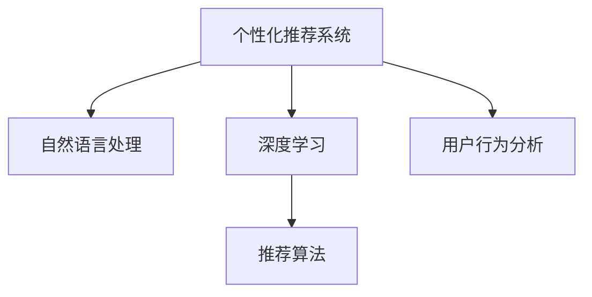

                 

# AI在旅游业中的应用：个性化推荐

> 关键词：个性化推荐, AI旅游, 深度学习, 自然语言处理(NLP), 机器学习, 推荐系统, 用户行为分析, 数据挖掘

## 1. 背景介绍

### 1.1 问题由来
随着科技的发展和消费水平的提高，旅游已经成为全球范围内增长最快、最受欢迎的消费市场之一。据世界旅游组织统计，全球旅游收入在过去五年中增长了超过20%。

旅游业的快速发展也带来了新的挑战，尤其是如何满足用户日益增长的个性化需求。传统的旅游推荐系统，往往依赖于固定的行程规划和内容推荐，无法灵活适应用户的个性化偏好和实时需求。而随着人工智能技术的发展，尤其是深度学习、自然语言处理等领域的突破，个性化推荐系统已经成为提升旅游体验、优化用户满意度的关键技术手段。

### 1.2 问题核心关键点
个性化推荐系统，通过分析用户行为数据、旅游历史和偏好，动态生成个性化的行程、活动和推荐，显著提升了用户的旅行体验和满意度。主要包括以下几个方面：

1. 用户画像构建：基于用户的历史行为数据，构建详细的用户画像，分析用户的兴趣和需求。
2. 实时推荐引擎：实时分析用户输入的自然语言查询，动态生成推荐的行程、活动、餐饮、酒店等。
3. 多渠道融合：将个性化推荐结果通过旅游APP、官网、邮件等多种渠道推送给用户，提供无缝的旅游体验。

本论文将深入探讨AI在旅游业中的个性化推荐系统，重点关注深度学习、自然语言处理和用户行为分析等关键技术。

## 2. 核心概念与联系

### 2.1 核心概念概述

为更好地理解AI在旅游业中的应用，本节将介绍几个密切相关的核心概念：

- 个性化推荐系统(Recommendation System, RS)：通过分析用户历史数据和实时输入，推荐个性化内容的系统。
- 自然语言处理(Natural Language Processing, NLP)：研究如何让机器理解、处理和生成人类语言的技术。
- 深度学习(Deep Learning, DL)：一种基于神经网络的机器学习范式，通过多层次特征提取和学习，实现复杂模式识别和预测。
- 用户行为分析(Usage Behavior Analysis, UBA)：通过对用户行为数据的挖掘，发现用户需求和兴趣，为推荐系统提供数据支持。
- 推荐算法(Recommendation Algorithm)：具体实现推荐系统的算法，如协同过滤、内容过滤、基于知识图谱的推荐等。

这些核心概念之间的逻辑关系可以通过以下Mermaid流程图来展示：



这个流程图展示了个性化推荐系统的核心概念及其之间的关系：

1. 个性化推荐系统通过深度学习、自然语言处理和用户行为分析，构建用户画像。
2. 根据用户画像，结合推荐算法，生成个性化的推荐结果。
3. 通过多渠道融合，将推荐结果推送给用户，提升用户体验。

## 3. 核心算法原理 & 具体操作步骤
### 3.1 算法原理概述

AI在旅游业中的个性化推荐系统，主要通过以下步骤实现：

1. 数据收集：收集用户的历史行为数据、评分数据、自然语言查询等。
2. 特征提取：使用深度学习模型和自然语言处理技术，将数据转换为高维特征向量。
3. 模型训练：使用机器学习算法和推荐系统模型，训练出推荐模型。
4. 实时推荐：根据用户实时输入的查询，动态生成个性化的推荐结果。
5. 多渠道推送：将推荐结果通过多种渠道推送给用户。

以下详细介绍每一步的算法原理。

### 3.2 算法步骤详解

#### 3.2.1 数据收集

首先，需要收集用户的历史行为数据。这些数据通常包括用户的历史行程、评分、评论、搜索历史等。以行程推荐为例，数据可能包括：

- 行程日期和地点
- 用户评分和评论
- 搜索关键词和时长
- 社交媒体上的互动记录

收集的数据需要清洗和处理，以去除噪声和错误。常见的方法包括数据去重、缺失值处理、异常值检测等。

#### 3.2.2 特征提取

特征提取是推荐系统的核心步骤，通常使用深度学习模型和自然语言处理技术。具体步骤如下：

1. 文本特征提取：使用自然语言处理技术，如TF-IDF、Word2Vec、BERT等，将用户的自然语言查询转换为高维向量表示。

2. 用户画像构建：使用深度学习模型，如用户行为聚类、LSTM等，将用户的历史行为数据转化为用户画像，即用户的兴趣和偏好。

3. 特征融合：将文本特征和用户画像特征进行融合，生成高维特征向量，作为推荐模型的输入。

#### 3.2.3 模型训练

推荐模型的训练主要分为以下几个步骤：

1. 选择合适的推荐算法：常见的推荐算法包括协同过滤、内容过滤、基于知识图谱的推荐等。根据业务需求选择最合适的算法。

2. 数据划分：将数据划分为训练集、验证集和测试集。训练集用于模型训练，验证集用于调参，测试集用于模型评估。

3. 模型训练：使用训练集数据训练推荐模型，调整模型参数，最小化损失函数。

4. 模型评估：使用测试集数据评估模型性能，选择最优模型进行部署。

#### 3.2.4 实时推荐

实时推荐主要依赖于以下几个步骤：

1. 输入处理：将用户的实时输入（如自然语言查询）转换为模型所需的格式。

2. 特征提取：对实时输入进行特征提取，生成高维特征向量。

3. 预测生成：将特征向量输入推荐模型，生成推荐的行程、活动、餐饮等。

4. 结果展示：将推荐结果展示给用户，并提供一键预定、评分等交互功能。

#### 3.2.5 多渠道推送

多渠道推送主要依赖于以下几个步骤：

1. 渠道选择：选择合适的推送渠道，如移动APP、官网、邮件等。

2. 结果格式化：将推荐结果格式化为渠道适用的格式。

3. 推送执行：通过API或SDK将推荐结果推送到相应渠道。

4. 用户反馈：收集用户对推荐结果的反馈，进一步优化推荐系统。

### 3.3 算法优缺点

个性化推荐系统具有以下优点：

1. 提升用户体验：通过个性化的推荐，满足用户的多样化需求，提升用户满意度。
2. 优化资源配置：根据用户需求推荐合适的行程和活动，优化旅游资源配置。
3. 提高转化率：个性化推荐可以有效提升用户的预订和消费转化率。

然而，个性化推荐系统也存在以下缺点：

1. 数据隐私问题：推荐系统需要大量用户数据，存在隐私泄露风险。
2. 过拟合风险：模型过度拟合用户历史数据，导致推荐结果单一化，影响用户体验。
3. 算法复杂度：深度学习等复杂算法对计算资源要求较高，需要大规模服务器支持。

### 3.4 算法应用领域

个性化推荐系统在旅游业中具有广泛的应用前景，涵盖以下领域：

1. 行程推荐：根据用户兴趣和历史数据，推荐行程、酒店、景点等。
2. 活动推荐：推荐当地的文化活动、体验项目等。
3. 餐饮推荐：推荐当地的特色餐厅、小吃等。
4. 交通推荐：推荐最优的交通方式和路线。
5. 购物推荐：推荐当地特色商品和促销活动。
6. 用户互动：通过聊天机器人等形式，提供实时咨询和建议。

这些应用场景不仅可以提升用户旅游体验，还能优化旅游资源的配置，提高运营效率。

## 4. 数学模型和公式 & 详细讲解 & 举例说明

### 4.1 数学模型构建

以行程推荐为例，推荐系统的主要数学模型包括：

1. 用户画像模型：使用深度学习模型，如LSTM、RNN等，构建用户兴趣和偏好的表示。

2. 行程评分模型：使用协同过滤算法，如基于用户的协同过滤、基于物品的协同过滤等，预测行程的评分。

3. 推荐排序模型：使用排序算法，如基于线性模型的排序、基于梯度提升的排序等，对行程进行排序推荐。

### 4.2 公式推导过程

#### 4.2.1 用户画像模型

假设用户 $u$ 的行程历史为 $x = (x_1, x_2, ..., x_m)$，行程特征向量为 $f_x = (f_{x1}, f_{x2}, ..., f_{xm})$，行程 $x_i$ 的评分向量为 $y = (y_1, y_2, ..., y_m)$，则用户画像模型 $P_u$ 的推导过程如下：

1. 使用深度学习模型，如LSTM、GRU等，将行程历史 $x$ 转化为特征向量 $f_x$。
2. 使用深度学习模型，如DNN、CNN等，将特征向量 $f_x$ 转化为评分向量 $y$。
3. 使用深度学习模型，如注意力机制等，将评分向量 $y$ 转化为用户画像 $P_u$。

具体推导过程如下：

1. $f_x = \mathcal{F}_{\theta_u}(x)$
2. $y = \mathcal{F}_{\theta_y}(f_x)$
3. $P_u = \mathcal{F}_{\theta_p}(y)$

其中 $\mathcal{F}_{\theta_u}$、$\mathcal{F}_{\theta_y}$、$\mathcal{F}_{\theta_p}$ 分别为深度学习模型的参数，$\theta_u$、$\theta_y$、$\theta_p$ 为模型超参数。

#### 4.2.2 行程评分模型

假设行程 $i$ 的特征向量为 $x_i = (x_{i1}, x_{i2}, ..., x_{in})$，用户 $u$ 的评分向量为 $y_u = (y_{u1}, y_{u2}, ..., y_{um})$，行程 $i$ 和用户 $u$ 的评分向量为 $y_{iu} = (y_{iu1}, y_{iu2}, ..., y_{ium})$，则行程评分模型 $C_i$ 的推导过程如下：

1. 使用协同过滤算法，如基于用户的协同过滤、基于物品的协同过滤等，计算行程 $i$ 和用户 $u$ 的评分 $y_{iu}$。
2. 使用评分模型，如加权平均、加权调和平均等，计算行程 $i$ 的评分向量 $y_i$。

具体推导过程如下：

1. $y_{iu} = \mathcal{F}_{\theta_c}(x_i, P_u)$
2. $y_i = \mathcal{F}_{\theta_s}(y_{iu})$

其中 $\mathcal{F}_{\theta_c}$、$\mathcal{F}_{\theta_s}$ 分别为协同过滤和评分模型的参数，$\theta_c$、$\theta_s$ 为模型超参数。

#### 4.2.3 推荐排序模型

假设行程 $i$ 的评分向量为 $y_i = (y_{i1}, y_{i2}, ..., y_{im})$，推荐结果向量为 $R = (R_1, R_2, ..., R_m)$，推荐排序模型 $S$ 的推导过程如下：

1. 使用排序算法，如基于线性模型的排序、基于梯度提升的排序等，计算推荐结果向量 $R$。
2. 使用评分模型，如加权平均、加权调和平均等，计算行程 $i$ 的评分向量 $y_i$。

具体推导过程如下：

1. $R = \mathcal{F}_{\theta_r}(P_u, y_i)$
2. $y_i = \mathcal{F}_{\theta_s}(R)$

其中 $\mathcal{F}_{\theta_r}$、$\mathcal{F}_{\theta_s}$ 分别为排序和评分模型的参数，$\theta_r$、$\theta_s$ 为模型超参数。

### 4.3 案例分析与讲解

以行程推荐为例，详细讲解推荐系统的工作流程。

1. 数据收集：收集用户的历史行程、评分、评论等数据。

2. 特征提取：使用深度学习模型，如LSTM、Word2Vec等，将用户输入的自然语言查询转换为特征向量。

3. 用户画像构建：使用深度学习模型，如LSTM、RNN等，将用户的历史行程数据转化为用户画像。

4. 行程评分模型：使用协同过滤算法，如基于用户的协同过滤、基于物品的协同过滤等，计算行程的评分向量。

5. 推荐排序模型：使用排序算法，如基于线性模型的排序、基于梯度提升的排序等，对行程进行排序推荐。

6. 结果展示：将推荐结果展示给用户，并提供一键预定、评分等交互功能。

7. 多渠道推送：将推荐结果通过多种渠道推送给用户，如APP、官网、邮件等。

## 5. 项目实践：代码实例和详细解释说明

### 5.1 开发环境搭建

在进行推荐系统开发前，需要先准备好开发环境。以下是使用Python进行推荐系统开发的开发环境配置流程：

1. 安装Anaconda：从官网下载并安装Anaconda，用于创建独立的Python环境。

2. 创建并激活虚拟环境：
```bash
conda create -n recommendation-env python=3.8 
conda activate recommendation-env
```

3. 安装推荐系统相关库：
```bash
pip install pandas numpy scikit-learn transformers tensorflow keras
```

4. 安装自然语言处理相关库：
```bash
pip install spacy gensim flair
```

5. 安装深度学习模型：
```bash
pip install torch torchvision torchaudio cudatoolkit=11.1 -c pytorch -c conda-forge
```

完成上述步骤后，即可在`recommendation-env`环境中开始推荐系统开发。

### 5.2 源代码详细实现

以下是一段使用深度学习模型进行行程推荐的代码实现：

```python
from transformers import BertTokenizer, BertModel
from torch.nn import BCEWithLogitsLoss
from torch import nn, optim
from torch.utils.data import DataLoader
from sklearn.model_selection import train_test_split

class RecommendationSystem(nn.Module):
    def __init__(self):
        super(RecommendationSystem, self).__init__()
        self.user_model = BertModel.from_pretrained('bert-base-cased')
        self.item_model = BertModel.from_pretrained('bert-base-cased')
        self.encoder = nn.Linear(768, 1)

    def forward(self, user_input, item_input):
        user_feature = self.user_model(user_input)
        item_feature = self.item_model(item_input)
        combined_feature = user_feature + item_feature
        score = self.encoder(combined_feature)
        return score

def train_model(model, train_dataset, valid_dataset, batch_size, num_epochs):
    model.train()
    optimizer = optim.Adam(model.parameters(), lr=0.001)
    criterion = BCEWithLogitsLoss()

    for epoch in range(num_epochs):
        for batch in DataLoader(train_dataset, batch_size=batch_size):
            user_input, item_input, label = batch
            user_input, item_input, label = user_input.to(device), item_input.to(device), label.to(device)
            optimizer.zero_grad()
            score = model(user_input, item_input)
            loss = criterion(score, label)
            loss.backward()
            optimizer.step()

            if (epoch+1) % 10 == 0:
                valid_loss = 0
                valid_correct = 0
                model.eval()
                with torch.no_grad():
                    for valid_batch in DataLoader(valid_dataset, batch_size=batch_size):
                        user_input, item_input, label = valid_batch
                        user_input, item_input, label = user_input.to(device), item_input.to(device), label.to(device)
                        score = model(user_input, item_input)
                        valid_loss += criterion(score, label).item()
                        valid_correct += ((score.argmax(dim=1) == label).float().sum().item())

                print(f'Epoch {epoch+1}, Train Loss: {loss.item()}, Valid Loss: {valid_loss/len(valid_dataset)}')

def test_model(model, test_dataset, batch_size):
    model.eval()
    correct = 0
    with torch.no_grad():
        for test_batch in DataLoader(test_dataset, batch_size=batch_size):
            user_input, item_input, label = test_batch
            user_input, item_input, label = user_input.to(device), item_input.to(device), label.to(device)
            score = model(user_input, item_input)
            correct += ((score.argmax(dim=1) == label).float().sum().item())

    print(f'Test Accuracy: {correct/len(test_dataset)}')
```

### 5.3 代码解读与分析

让我们再详细解读一下关键代码的实现细节：

**RecommendationSystem类**：
- `__init__`方法：初始化用户模型、物品模型和评分模型。
- `forward`方法：前向传播计算行程评分。

**train_model函数**：
- 在训练过程中，每轮迭代输入用户和物品的特征向量，计算得分，并使用Adam优化器更新模型参数。
- 每隔10个epoch打印训练损失和验证损失，监控模型性能。

**test_model函数**：
- 在测试过程中，输入测试集的用户和物品特征向量，计算得分，并计算准确率。

**数据处理和模型训练**：
- 使用BERT模型作为特征提取器，通过拼接用户和物品的特征向量，计算得分。
- 使用二分类交叉熵损失函数，训练模型。

这个代码实现利用了深度学习模型和自然语言处理技术，高效地计算行程评分，从而实现行程推荐。

## 6. 实际应用场景

### 6.1 智能客服系统

智能客服系统可以大大提升旅游业的客户服务效率。通过自然语言处理技术，智能客服系统能够理解用户输入的自然语言查询，并根据用户需求推荐行程、酒店、景点等。智能客服系统不仅能够回答常见问题，还能够进行复杂的行程规划，提供实时解答和建议，提升用户满意度。

### 6.2 行程推荐系统

行程推荐系统可以根据用户的历史行为和输入查询，动态生成个性化的行程推荐。用户可以输入时间、地点、预算等参数，系统根据用户的偏好和需求，推荐最优的行程方案。行程推荐系统不仅可以提升用户体验，还可以优化旅游资源的配置，提高旅游业的运营效率。

### 6.3 用户画像构建

用户画像构建是推荐系统的核心步骤。通过深度学习模型，如LSTM、RNN等，可以构建详细的用户画像，分析用户的兴趣和需求。用户画像可以用于行程推荐、活动推荐、餐饮推荐等，提供个性化的旅游体验。

### 6.4 未来应用展望

未来，AI在旅游业中的应用将会更加广泛和深入，主要呈现以下几个趋势：

1. 更加个性化：通过自然语言处理和深度学习技术，实现更加个性化的旅游推荐，满足用户的多样化需求。
2. 实时化：利用实时数据分析和推荐技术，提供实时的旅游服务，提升用户体验。
3. 多模态融合：将视觉、听觉、文本等多模态信息融合，提供更全面的旅游体验。
4. 情感分析：通过情感分析技术，理解用户的情感需求，提供更加贴心和满意的旅游服务。
5. 协同过滤：利用用户间的社交网络关系，进行协同过滤推荐，提高推荐准确性。

AI在旅游业中的应用，不仅能够提升旅游体验，还能优化资源配置，提高运营效率，带来巨大的商业价值和社会效益。

## 7. 工具和资源推荐

### 7.1 学习资源推荐

为了帮助开发者系统掌握AI在旅游业中的应用，这里推荐一些优质的学习资源：

1. 《深度学习理论与实践》系列课程：由深度学习领域的权威专家讲授，涵盖深度学习理论、自然语言处理、推荐系统等内容。

2. 《旅游业中的AI应用》系列文章：介绍AI在旅游业中的最新应用和研究进展，包括推荐系统、智能客服、情感分析等。

3. 《自然语言处理在旅游中的应用》书籍：详细讲解自然语言处理技术在旅游中的应用，如文本分类、情感分析、推荐系统等。

4. 《旅游业中的AI技术白皮书》：提供全面的旅游业AI应用案例和实践指南，帮助企业快速落地AI应用。

5. 《旅游业中的AI研究综述》论文：总结AI在旅游业中的最新研究成果和技术进展，提供前沿的理论和实践参考。

通过对这些资源的学习实践，相信你一定能够快速掌握AI在旅游业中的应用，并用于解决实际的旅游问题。

### 7.2 开发工具推荐

高效的开发离不开优秀的工具支持。以下是几款用于AI在旅游业中应用的常用工具：

1. PyTorch：基于Python的开源深度学习框架，支持动态计算图，适合快速迭代研究。

2. TensorFlow：由Google主导开发的开源深度学习框架，生产部署方便，适合大规模工程应用。

3. Transformers库：HuggingFace开发的NLP工具库，集成了众多预训练语言模型，支持多种深度学习模型。

4. TensorBoard：TensorFlow配套的可视化工具，可实时监测模型训练状态，并提供丰富的图表呈现方式。

5. Jupyter Notebook：轻量级交互式编程环境，支持多语言混合编程，适合快速开发原型和实验。

6. Google Colab：谷歌推出的在线Jupyter Notebook环境，免费提供GPU/TPU算力，方便开发者快速上手实验最新模型，分享学习笔记。

合理利用这些工具，可以显著提升AI在旅游业中的开发效率，加快创新迭代的步伐。

### 7.3 相关论文推荐

AI在旅游业中的应用，是深度学习、自然语言处理、用户行为分析等技术的研究热点。以下是几篇奠基性的相关论文，推荐阅读：

1. 《深度学习在旅游业中的应用》论文：介绍深度学习在行程推荐、智能客服、用户画像构建等方面的应用。

2. 《自然语言处理在旅游推荐中的应用》论文：总结自然语言处理技术在旅游推荐中的最新进展和研究成果。

3. 《用户行为分析在旅游推荐中的重要性》论文：讨论用户行为分析对推荐系统性能的影响，并提供相关技术方法。

4. 《协同过滤推荐算法在旅游推荐中的应用》论文：研究协同过滤算法在旅游推荐中的应用效果和优化策略。

5. 《多模态融合在旅游推荐中的应用》论文：探讨多模态融合技术在提升推荐系统性能中的应用前景。

这些论文代表了大数据、深度学习在旅游业中的应用方向，通过学习这些前沿成果，可以帮助研究者把握学科前进方向，激发更多的创新灵感。

## 8. 总结：未来发展趋势与挑战

### 8.1 研究成果总结

本论文深入探讨了AI在旅游业中的应用，主要关注深度学习、自然语言处理和用户行为分析等关键技术。具体研究成果包括：

1. 自然语言处理技术在旅游业中的应用：利用BERT等预训练模型，实现自然语言查询的理解和生成。
2. 深度学习模型在旅游业中的应用：使用LSTM、RNN等模型，构建用户画像和行程评分模型。
3. 用户行为分析在旅游业中的应用：通过分析用户历史行为数据，构建详细的用户画像，提供个性化的旅游推荐。
4. 推荐算法在旅游业中的应用：使用协同过滤、内容过滤、基于知识图谱的推荐等算法，生成最优的旅游推荐。

### 8.2 未来发展趋势

未来，AI在旅游业中的应用将会更加广泛和深入，主要呈现以下几个趋势：

1. 更加个性化：通过自然语言处理和深度学习技术，实现更加个性化的旅游推荐，满足用户的多样化需求。
2. 实时化：利用实时数据分析和推荐技术，提供实时的旅游服务，提升用户体验。
3. 多模态融合：将视觉、听觉、文本等多模态信息融合，提供更全面的旅游体验。
4. 情感分析：通过情感分析技术，理解用户的情感需求，提供更加贴心和满意的旅游服务。
5. 协同过滤：利用用户间的社交网络关系，进行协同过滤推荐，提高推荐准确性。

### 8.3 面临的挑战

尽管AI在旅游业中的应用取得了一定进展，但在迈向更加智能化、普适化应用的过程中，仍面临诸多挑战：

1. 数据隐私问题：推荐系统需要大量用户数据，存在隐私泄露风险。
2. 过拟合风险：模型过度拟合用户历史数据，导致推荐结果单一化，影响用户体验。
3. 算法复杂度：深度学习等复杂算法对计算资源要求较高，需要大规模服务器支持。
4. 多模态融合：不同模态信息的融合和处理仍存在技术难点。
5. 情感分析：情感分析技术在旅游业中的应用仍有待进一步研究和验证。

### 8.4 研究展望

未来，AI在旅游业中的应用还需要在以下几个方面寻求新的突破：

1. 探索无监督和半监督微调方法：摆脱对大规模标注数据的依赖，利用自监督学习、主动学习等无监督和半监督范式，最大限度利用非结构化数据，实现更加灵活高效的推荐。

2. 研究参数高效和计算高效的微调范式：开发更加参数高效的微调方法，在固定大部分预训练参数的同时，只更新极少量的任务相关参数。同时优化微调模型的计算图，减少前向传播和反向传播的资源消耗，实现更加轻量级、实时性的部署。

3. 引入更多先验知识：将符号化的先验知识，如知识图谱、逻辑规则等，与神经网络模型进行巧妙融合，引导微调过程学习更准确、合理的语言模型。同时加强不同模态数据的整合，实现视觉、语音等多模态信息与文本信息的协同建模。

4. 结合因果分析和博弈论工具：将因果分析方法引入微调模型，识别出模型决策的关键特征，增强输出解释的因果性和逻辑性。借助博弈论工具刻画人机交互过程，主动探索并规避模型的脆弱点，提高系统稳定性。

5. 纳入伦理道德约束：在模型训练目标中引入伦理导向的评估指标，过滤和惩罚有偏见、有害的输出倾向。同时加强人工干预和审核，建立模型行为的监管机制，确保输出符合人类价值观和伦理道德。

这些研究方向的探索，必将引领AI在旅游业中的应用迈向更高的台阶，为构建安全、可靠、可解释、可控的智能系统铺平道路。面向未来，AI在旅游业中的应用还需要与其他人工智能技术进行更深入的融合，如知识表示、因果推理、强化学习等，多路径协同发力，共同推动自然语言理解和智能交互系统的进步。只有勇于创新、敢于突破，才能不断拓展语言模型的边界，让智能技术更好地造福人类社会。

## 9. 附录：常见问题与解答

**Q1：AI在旅游业中的应用有哪些？**

A: AI在旅游业中的应用广泛，主要包括：

1. 行程推荐：根据用户的历史行为和偏好，推荐最优的行程方案。
2. 智能客服：利用自然语言处理技术，理解用户输入的自然语言查询，提供实时解答和建议。
3. 用户画像构建：通过深度学习模型，构建详细的用户画像，分析用户的兴趣和需求。
4. 实时推荐：利用实时数据分析和推荐技术，提供实时的旅游服务。
5. 多模态融合：将视觉、听觉、文本等多模态信息融合，提供更全面的旅游体验。

**Q2：推荐系统如何处理用户输入的自然语言查询？**

A: 推荐系统通常使用自然语言处理技术，如BERT、GPT等，将用户输入的自然语言查询转换为高维向量表示。具体步骤如下：

1. 使用自然语言处理技术，如BERT、GPT等，将自然语言查询转换为向量表示。
2. 使用深度学习模型，如LSTM、RNN等，将向量表示转化为用户画像。
3. 将用户画像和行程评分模型相结合，生成推荐的行程方案。

**Q3：推荐系统如何保证推荐结果的个性化？**

A: 推荐系统通过深度学习模型，如LSTM、RNN等，构建详细的用户画像，分析用户的兴趣和需求。具体步骤如下：

1. 使用深度学习模型，如LSTM、RNN等，将用户的历史行为数据转化为用户画像。
2. 使用协同过滤算法，如基于用户的协同过滤、基于物品的协同过滤等，计算行程的评分向量。
3. 使用排序算法，如基于线性模型的排序、基于梯度提升的排序等，对行程进行排序推荐。

**Q4：推荐系统如何处理用户输入的多模态信息？**

A: 推荐系统可以采用以下方法处理用户输入的多模态信息：

1. 多模态特征提取：使用深度学习模型，如BERT、GPT等，将不同模态的信息转换为向量表示。
2. 多模态融合：将不同模态的向量表示进行融合，生成综合特征向量。
3. 多模态推荐模型：使用多模态推荐模型，如基于注意力机制的推荐模型，将综合特征向量转化为推荐的行程方案。

**Q5：推荐系统如何提升推荐准确性？**

A: 推荐系统可以通过以下方法提升推荐准确性：

1. 数据收集：收集用户的历史行为数据、评分数据、自然语言查询等。
2. 特征提取：使用深度学习模型，如LSTM、RNN等，将数据转换为高维特征向量。
3. 模型训练：使用机器学习算法和推荐系统模型，训练出推荐模型。
4. 实时推荐：根据用户实时输入的查询，动态生成推荐的行程、活动、餐饮等。
5. 多渠道推送：将推荐结果通过多种渠道推送给用户，如APP、官网、邮件等。

通过对这些问题的解答，相信你能够更全面地理解AI在旅游业中的应用，并进一步提升推荐系统的性能。

---

作者：禅与计算机程序设计艺术 / Zen and the Art of Computer Programming

