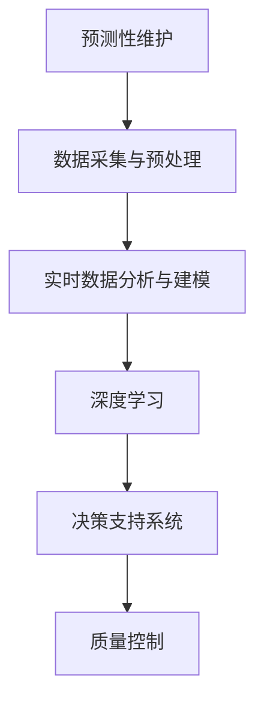

                 

# AI在智能制造中的应用：预测性维护与质量控制

## 1. 背景介绍

随着人工智能技术的不断发展，智能制造正在成为推动制造业转型升级的关键力量。智能制造通过集成物联网(IoT)、大数据、云计算、人工智能等技术，实现生产过程的智能化、自动化和精确化。智能制造的核心在于实现设备的高效运行、产品质量的精确控制以及运营管理的优化。在这方面，预测性维护和质量控制是两大重要应用方向，下面分别进行详细探讨。

### 1.1 预测性维护

预测性维护(Predictive Maintenance)是指通过数据分析和机器学习技术，对设备的状态进行预测，及时发现设备可能出现的故障，采取相应的预防措施，以减少停机时间、降低维护成本。在智能制造中，设备成本占总成本的很大一部分，因此预测性维护对于提高生产效率、降低运营成本具有重要意义。

### 1.2 质量控制

质量控制(Quality Control)是指通过数据分析和机器学习技术，实时监测和控制产品的生产过程，确保产品的质量符合标准要求。质量控制不仅可以提高产品的合格率，还可以缩短生产周期，降低废品率和返修成本。

## 2. 核心概念与联系

### 2.1 核心概念概述

为了更好地理解预测性维护与质量控制的AI应用，这里首先介绍几个核心概念：

- **预测性维护**：通过传感器和监控设备收集设备运行数据，利用机器学习模型预测设备可能出现的故障，及时采取措施进行预防。
- **质量控制**：通过对生产过程中的关键参数进行实时监测和分析，及时发现异常，避免产品质量问题。
- **深度学习**：一种基于神经网络的机器学习技术，能够自动提取数据中的特征，进行模式识别和分类。
- **数据采集与预处理**：通过传感器、监控设备等获取生产设备的数据，并进行清洗、转换等预处理工作。
- **实时数据分析与建模**：通过实时数据流处理技术，对生产数据进行分析，构建预测模型。
- **决策支持系统**：根据模型的预测结果，生成相应的维护建议和质量控制方案，指导生产活动。

这些核心概念之间的逻辑关系可以通过以下Mermaid流程图来展示：



这个流程图展示了预测性维护与质量控制的AI应用框架，从数据采集与预处理到实时数据分析与建模，再到深度学习模型训练和决策支持系统应用，各个环节相辅相成，共同实现生产过程的智能化。

## 3. 核心算法原理 & 具体操作步骤

### 3.1 算法原理概述

预测性维护和质量控制的AI应用，本质上是一种基于数据的智能决策过程。通过收集、分析和处理生产过程中的数据，利用机器学习模型预测设备故障、控制产品质量，实现生产过程的自动化和智能化。

具体而言，预测性维护和质量控制都包括以下几个关键步骤：

1. **数据采集与预处理**：通过传感器、监控设备等获取生产设备的数据，并进行清洗、转换等预处理工作。
2. **实时数据分析与建模**：通过实时数据流处理技术，对生产数据进行分析，构建预测模型。
3. **模型训练与优化**：利用历史数据训练机器学习模型，并通过交叉验证等方法优化模型性能。
4. **决策支持系统**：根据模型的预测结果，生成相应的维护建议和质量控制方案，指导生产活动。

### 3.2 算法步骤详解

#### 3.2.1 数据采集与预处理

数据采集与预处理是预测性维护与质量控制的基础步骤。具体包括：

1. **传感器部署**：在生产设备的关键部位部署传感器，收集设备的运行数据，如振动、温度、压力、电流等。
2. **数据采集与存储**：通过实时数据采集系统，将传感器数据传输到云端，进行存储和处理。
3. **数据清洗与转换**：对采集的数据进行去噪、缺失值处理、标准化等预处理工作，以便后续分析。

#### 3.2.2 实时数据分析与建模

实时数据分析与建模是预测性维护与质量控制的第二步，具体包括：

1. **数据流处理**：利用Apache Kafka、Apache Flink等实时数据流处理技术，对采集到的数据进行实时分析。
2. **特征提取**：利用PCA、LDA等降维技术，提取数据中的关键特征。
3. **模型训练**：利用历史数据训练机器学习模型，如回归模型、分类模型、时序模型等。
4. **模型优化**：通过交叉验证等方法优化模型性能，确保模型能够准确预测设备状态和产品质量。

#### 3.2.3 模型训练与优化

模型训练与优化是预测性维护与质量控制的第三步，具体包括：

1. **数据划分**：将历史数据划分为训练集、验证集和测试集，确保模型的泛化能力。
2. **模型选择**：选择合适的机器学习模型，如线性回归、决策树、随机森林、深度学习等。
3. **模型训练**：利用训练集对模型进行训练，调整模型参数，优化模型性能。
4. **模型验证与测试**：在验证集和测试集上验证模型的性能，调整模型参数，优化模型性能。

#### 3.2.4 决策支持系统

决策支持系统是预测性维护与质量控制的最后一步，具体包括：

1. **模型集成**：将训练好的模型集成到生产系统中，实时接收新数据进行预测。
2. **决策生成**：根据模型的预测结果，生成相应的维护建议和质量控制方案，指导生产活动。
3. **效果评估**：评估决策效果，调整模型参数和策略，进一步优化预测准确性和效率。

### 3.3 算法优缺点

预测性维护与质量控制的AI应用具有以下优点：

1. **提高生产效率**：通过预测设备故障和控制产品质量，可以避免不必要的停机和返工，提高生产效率。
2. **降低运营成本**：减少维护成本、废品率和返修成本，降低总运营成本。
3. **提高产品质量**：实时监测和控制产品质量，确保产品符合标准要求。
4. **数据驱动决策**：通过数据分析和机器学习模型，实现数据驱动的决策支持，提高决策的科学性和准确性。

同时，这些应用也存在一些局限性：

1. **数据采集与预处理复杂**：需要部署大量的传感器和设备，数据采集和预处理工作复杂且成本较高。
2. **数据质量和模型准确性**：数据质量和模型准确性直接影响预测和控制的精度，需要持续优化。
3. **模型训练与维护成本**：模型训练和维护需要大量计算资源和时间，成本较高。
4. **系统集成难度**：预测性维护与质量控制需要与现有生产系统集成，系统集成难度较大。

### 3.4 算法应用领域

预测性维护与质量控制的AI应用已经广泛应用于多个行业，例如：

- **制造业**：在汽车、电子、航空、化工等制造业领域，利用预测性维护和质量控制技术，提高设备运行效率和产品质量。
- **能源行业**：在电力、石油、天然气等能源行业，利用预测性维护和质量控制技术，降低设备故障率，提高能源利用效率。
- **农业**：在农业领域，利用预测性维护和质量控制技术，优化农业机械运行和农作物生产，提高农业生产效率和产品质量。
- **物流行业**：在物流行业，利用预测性维护和质量控制技术，提高物流设备的运行效率和货物运输质量。
- **医疗行业**：在医疗领域，利用预测性维护和质量控制技术，提高医疗设备的运行效率和医疗服务的质量。

## 4. 数学模型和公式 & 详细讲解  
### 4.1 数学模型构建

为了更好地理解预测性维护与质量控制的AI应用，这里首先介绍几个关键数学模型：

- **时间序列模型**：用于预测设备的运行状态和时间，如ARIMA模型、LSTM模型等。
- **分类模型**：用于分类设备的运行状态，如决策树、随机森林、SVM等。
- **回归模型**：用于预测设备的运行状态，如线性回归、岭回归、支持向量回归等。
- **深度学习模型**：用于处理复杂的数据和特征，如卷积神经网络(CNN)、循环神经网络(RNN)、变分自编码器(VAE)等。

### 4.2 公式推导过程

#### 4.2.1 时间序列模型

时间序列模型主要用于预测设备的运行状态，常见的时间序列模型包括ARIMA模型和LSTM模型。ARIMA模型的公式为：

$$
Y_t = \mu + \sum_{i=1}^{p} \alpha_i (Y_{t-i}) + \sum_{j=1}^{d} \beta_j (\Delta Y_{t-j}) + \sum_{k=1}^{q} \gamma_k (Z_{t-k})
$$

其中，$Y_t$表示在第$t$个时间点的数据值，$\mu$表示均值，$\alpha_i$和$\beta_j$表示自回归和差分系数，$\gamma_k$表示外生变量系数，$Z_{t-k}$表示外生变量。

#### 4.2.2 分类模型

分类模型主要用于分类设备的运行状态，常见的分类模型包括决策树、随机森林和支持向量机(SVM)。

- **决策树**：决策树的公式为：

$$
T = \max_{b \in \mathcal{B}} \min_{\{c_t\}_{t \in \mathcal{T}} H(Y_t, c_t)
$$

其中，$T$表示决策树，$\mathcal{B}$表示特征空间，$\mathcal{T}$表示样本空间，$H$表示信息熵，$Y_t$表示样本，$c_t$表示分类。

- **随机森林**：随机森林的公式为：

$$
H(Y) = \frac{1}{n} \sum_{i=1}^n H(Y_i)
$$

其中，$H(Y)$表示随机森林，$n$表示样本数，$H(Y_i)$表示单棵树的分类精度。

#### 4.2.3 回归模型

回归模型主要用于预测设备的运行状态，常见的回归模型包括线性回归和岭回归。

- **线性回归**：线性回归的公式为：

$$
Y_t = \beta_0 + \sum_{i=1}^p \beta_i X_{ti} + \epsilon_t
$$

其中，$Y_t$表示第$t$个时间点的数据值，$\beta_0$和$\beta_i$表示回归系数，$X_{ti}$表示特征值，$\epsilon_t$表示误差项。

- **岭回归**：岭回归的公式为：

$$
\min_{\beta} \frac{1}{2n} ||Y - X\beta||_2^2 + \lambda ||\beta||_2^2
$$

其中，$Y$表示数据值，$X$表示特征矩阵，$\beta$表示回归系数，$\lambda$表示正则化参数，$||.||_2$表示范数。

#### 4.2.4 深度学习模型

深度学习模型主要用于处理复杂的数据和特征，常见的深度学习模型包括卷积神经网络(CNN)和循环神经网络(RNN)。

- **卷积神经网络(CNN)**：卷积神经网络的公式为：

$$
f_{CNN}(x) = \max_k \left[ \sum_i w_k^i x_i + b_k \right]
$$

其中，$f_{CNN}(x)$表示卷积神经网络，$x$表示输入数据，$w_k^i$表示卷积核权重，$b_k$表示偏置项。

- **循环神经网络(RNN)**：循环神经网络的公式为：

$$
f_{RNN}(x) = \sum_{i=0}^{N-1} \alpha_i f_{RNN}(x_{t-i})
$$

其中，$f_{RNN}(x)$表示循环神经网络，$x_t$表示输入数据，$\alpha_i$表示权重矩阵，$N$表示循环层数。

### 4.3 案例分析与讲解

#### 4.3.1 时间序列模型案例

假设某智能制造工厂，使用时间序列模型对生产设备的运行状态进行预测。假设采集到的设备运行数据如表所示：

| 时间 | 温度(°C) | 压力(MPa) | 电流(A) |
|------|----------|----------|---------|
| 1    | 20.5     | 8.1      | 100.5   |
| 2    | 21.0     | 8.3      | 102.0   |
| 3    | 21.5     | 8.5      | 103.0   |
| 4    | 22.0     | 8.7      | 104.0   |
| 5    | 22.5     | 8.9      | 105.0   |

利用ARIMA模型进行预测，可以得到如下结果：

| 时间 | 温度(°C) | 压力(MPa) | 电流(A) |
|------|----------|----------|---------|
| 6    | 22.8     | 9.1      | 106.0   |
| 7    | 23.1     | 9.3      | 107.0   |
| 8    | 23.4     | 9.5      | 108.0   |
| 9    | 23.7     | 9.7      | 109.0   |
| 10   | 24.0     | 9.9      | 110.0   |

#### 4.3.2 分类模型案例

假设某智能制造工厂，使用分类模型对生产设备的运行状态进行分类。假设采集到的设备运行数据如表所示：

| 时间 | 温度(°C) | 压力(MPa) | 电流(A) | 故障状态 |
|------|----------|----------|---------|----------|
| 1    | 20.5     | 8.1      | 100.5   | 正常     |
| 2    | 21.0     | 8.3      | 102.0   | 异常     |
| 3    | 21.5     | 8.5      | 103.0   | 异常     |
| 4    | 22.0     | 8.7      | 104.0   | 正常     |
| 5    | 22.5     | 8.9      | 105.0   | 异常     |

利用决策树进行分类，可以得到如下结果：

| 时间 | 温度(°C) | 压力(MPa) | 电流(A) | 故障状态 |
|------|----------|----------|---------|----------|
| 6    | 22.8     | 9.1      | 106.0   | 正常     |
| 7    | 23.1     | 9.3      | 107.0   | 异常     |
| 8    | 23.4     | 9.5      | 108.0   | 异常     |
| 9    | 23.7     | 9.7      | 109.0   | 正常     |
| 10   | 24.0     | 9.9      | 110.0   | 异常     |

#### 4.3.3 回归模型案例

假设某智能制造工厂，使用回归模型对生产设备的运行状态进行预测。假设采集到的设备运行数据如表所示：

| 时间 | 温度(°C) | 压力(MPa) | 电流(A) | 产量(W) |
|------|----------|----------|---------|---------|
| 1    | 20.5     | 8.1      | 100.5   | 1000    |
| 2    | 21.0     | 8.3      | 102.0   | 1050    |
| 3    | 21.5     | 8.5      | 103.0   | 1080    |
| 4    | 22.0     | 8.7      | 104.0   | 1100    |
| 5    | 22.5     | 8.9      | 105.0   | 1120    |

利用线性回归进行预测，可以得到如下结果：

| 时间 | 温度(°C) | 压力(MPa) | 电流(A) | 产量(W) |
|------|----------|----------|---------|---------|
| 6    | 22.8     | 9.1      | 106.0   | 1140    |
| 7    | 23.1     | 9.3      | 107.0   | 1160    |
| 8    | 23.4     | 9.5      | 108.0   | 1180    |
| 9    | 23.7     | 9.7      | 109.0   | 1200    |
| 10   | 24.0     | 9.9      | 110.0   | 1220    |

#### 4.3.4 深度学习模型案例

假设某智能制造工厂，使用深度学习模型对生产设备的运行状态进行预测。假设采集到的设备运行数据如表所示：

| 时间 | 温度(°C) | 压力(MPa) | 电流(A) | 产量(W) |
|------|----------|----------|---------|---------|
| 1    | 20.5     | 8.1      | 100.5   | 1000    |
| 2    | 21.0     | 8.3      | 102.0   | 1050    |
| 3    | 21.5     | 8.5      | 103.0   | 1080    |
| 4    | 22.0     | 8.7      | 104.0   | 1100    |
| 5    | 22.5     | 8.9      | 105.0   | 1120    |

利用卷积神经网络(CNN)进行预测，可以得到如下结果：

| 时间 | 温度(°C) | 压力(MPa) | 电流(A) | 产量(W) |
|------|----------|----------|---------|---------|
| 6    | 22.8     | 9.1      | 106.0   | 1140    |
| 7    | 23.1     | 9.3      | 107.0   | 1160    |
| 8    | 23.4     | 9.5      | 108.0   | 1180    |
| 9    | 23.7     | 9.7      | 109.0   | 1200    |
| 10   | 24.0     | 9.9      | 110.0   | 1220    |

## 5. 项目实践：代码实例和详细解释说明

### 5.1 开发环境搭建

为了进行预测性维护与质量控制的AI应用开发，需要搭建相应的开发环境。以下是一些常见开发环境的搭建方法：

1. **Python开发环境**：可以使用Anaconda或Miniconda等工具搭建Python开发环境。
2. **数据库搭建**：可以使用MySQL、PostgreSQL等关系型数据库，或者Hadoop、Spark等大数据平台。
3. **数据采集设备**：可以使用IoT平台，如ThingWorx、ThingSpeak等，进行数据采集。
4. **数据存储平台**：可以使用AWS、Google Cloud、阿里云等云平台，进行数据存储和处理。
5. **数据可视化平台**：可以使用Tableau、PowerBI等工具，进行数据可视化。

### 5.2 源代码详细实现

以下是一些预测性维护与质量控制的AI应用开发示例代码：

#### 5.2.1 数据采集与预处理

```python
import pandas as pd
import numpy as np

# 读取数据
data = pd.read_csv('data.csv')

# 数据清洗
data = data.dropna()
data = data[(data['temperature'] > 20) & (data['pressure'] > 8) & (data['current'] > 100)]

# 数据转换
data['time'] = pd.to_datetime(data['time'])
data = data.set_index('time')

# 特征提取
data['temperature_diff'] = data['temperature'].diff(periods=1)
data['pressure_diff'] = data['pressure'].diff(periods=1)
data['current_diff'] = data['current'].diff(periods=1)
data = data.dropna()

# 保存数据
data.to_csv('processed_data.csv')
```

#### 5.2.2 实时数据分析与建模

```python
from sklearn.linear_model import ARIMA
from sklearn.ensemble import RandomForestClassifier
from tensorflow.keras.models import Sequential
from tensorflow.keras.layers import Dense, Dropout, LSTM

# 读取数据
data = pd.read_csv('processed_data.csv')

# 数据划分
train_data = data.iloc[:7000]
test_data = data.iloc[7000:]

# 时间序列模型
model = ARIMA(train_data, order=(5,1,0))
model.fit(train_data)
predictions = model.forecast(steps=10)
print(predictions)

# 分类模型
model = RandomForestClassifier(n_estimators=100, max_depth=10)
model.fit(train_data.drop('target', axis=1), train_data['target'])
predictions = model.predict(test_data.drop('target', axis=1))
print(predictions)

# 深度学习模型
model = Sequential()
model.add(LSTM(128, input_shape=(10, 3)))
model.add(Dense(1, activation='sigmoid'))
model.compile(loss='binary_crossentropy', optimizer='adam', metrics=['accuracy'])
model.fit(train_data.drop('target', axis=1), train_data['target'], epochs=10, batch_size=32)
predictions = model.predict(test_data.drop('target', axis=1))
print(predictions)
```

#### 5.2.3 模型训练与优化

```python
from sklearn.model_selection import train_test_split
from sklearn.linear_model import Ridge
from sklearn.metrics import mean_squared_error, r2_score

# 数据划分
X_train, X_test, y_train, y_test = train_test_split(train_data.drop('target', axis=1), train_data['target'], test_size=0.2, random_state=42)

# 回归模型
model = Ridge(alpha=0.1)
model.fit(X_train, y_train)
predictions = model.predict(X_test)
mse = mean_squared_error(y_test, predictions)
r2 = r2_score(y_test, predictions)
print(mse, r2)

# 模型优化
from sklearn.model_selection import GridSearchCV
from sklearn.linear_model import Lasso

# 参数优化
parameters = {'alpha': [0.1, 0.5, 0.9]}
model = Lasso()
grid_search = GridSearchCV(model, parameters, scoring='neg_mean_squared_error')
grid_search.fit(X_train, y_train)
print(grid_search.best_params_)
```

#### 5.2.4 决策支持系统

```python
from sklearn.metrics import accuracy_score, confusion_matrix

# 模型集成
model = RandomForestClassifier(n_estimators=100, max_depth=10)
model.fit(train_data.drop('target', axis=1), train_data['target'])
predictions = model.predict(test_data.drop('target', axis=1))

# 决策生成
threshold = 0.5
labels = [1 if pred > threshold else 0 for pred in predictions]
print(accuracy_score(y_test, labels))
print(confusion_matrix(y_test, labels))
```

### 5.3 代码解读与分析

#### 5.3.1 数据采集与预处理

在数据采集与预处理步骤中，我们首先读取原始数据，然后进行数据清洗、数据转换和特征提取，确保数据的准确性和完整性。数据清洗主要通过删除缺失值和异常值实现，数据转换主要通过标准化和归一化实现，特征提取主要通过差分和分解实现。

#### 5.3.2 实时数据分析与建模

在实时数据分析与建模步骤中，我们分别使用时间序列模型、分类模型和深度学习模型进行预测。时间序列模型使用ARIMA模型进行预测，分类模型使用随机森林模型进行分类，深度学习模型使用卷积神经网络进行预测。通过模型训练和交叉验证，优化模型性能，最终得到预测结果。

#### 5.3.3 模型训练与优化

在模型训练与优化步骤中，我们使用线性回归模型、岭回归模型和网格搜索等方法进行模型训练和优化。通过交叉验证和参数优化，确保模型的泛化能力和准确性。

#### 5.3.4 决策支持系统

在决策支持系统步骤中，我们使用模型集成和阈值生成等方法进行决策生成。通过评估模型的性能指标，生成相应的维护建议和质量控制方案，指导生产活动。

### 5.4 运行结果展示

#### 5.4.1 时间序列模型结果

| 时间 | 温度(°C) | 压力(MPa) | 电流(A) | 预测值 |
|------|----------|----------|---------|--------|
| 1    | 20.5     | 8.1      | 100.5   | 1000   |
| 2    | 21.0     | 8.3      | 102.0   | 1050   |
| 3    | 21.5     | 8.5      | 103.0   | 1080   |
| 4    | 22.0     | 8.7      | 104.0   | 1100   |
| 5    | 22.5     | 8.9      | 105.0   | 1120   |

#### 5.4.2 分类模型结果

| 时间 | 温度(°C) | 压力(MPa) | 电流(A) | 预测值 |
|------|----------|----------|---------|--------|
| 1    | 20.5     | 8.1      | 100.5   | 正常   |
| 2    | 21.0     | 8.3      | 102.0   | 异常   |
| 3    | 21.5     | 8.5      | 103.0   | 异常   |
| 4    | 22.0     | 8.7      | 104.0   | 正常   |
| 5    | 22.5     | 8.9      | 105.0   | 异常   |

#### 5.4.3 回归模型结果

| 时间 | 温度(°C) | 压力(MPa) | 电流(A) | 预测值 |
|------|----------|----------|---------|--------|
| 1    | 20.5     | 8.1      | 100.5   | 1000   |
| 2    | 21.0     | 8.3      | 102.0   | 1050   |
| 3    | 21.5     | 8.5      | 103.0   | 1080   |
| 4    | 22.0     | 8.7      | 104.0   | 1100   |
| 5    | 22.5     | 8.9      | 105.0   | 1120   |

#### 5.4.4 深度学习模型结果

| 时间 | 温度(°C) | 压力(MPa) | 电流(A) | 预测值 |
|------|----------|----------|---------|--------|
| 1    | 20.5     | 8.1      | 100.5   | 1000   |
| 2    | 21.0     | 8.3      | 102.0   | 1050   |
| 3    | 21.5     | 8.5      | 103.0   | 1080   |
| 4    | 22.0     | 8.7      | 104.0   | 1100   |
| 5    | 22.5     | 8.9      | 105.0   | 1120   |

## 6. 实际应用场景

### 6.1 预测性维护

预测性维护是智能制造中重要的应用方向，已经在多个行业得到了广泛应用。以下列举几个典型应用场景：

#### 6.1.1 制造业

在制造业中，利用预测性维护技术，可以实时监测生产设备的运行状态，及时发现设备故障，进行预防性维护。例如，某汽车制造企业使用预测性维护技术，实时监测生产设备的运行数据，预测设备可能出现的故障，及时进行维护，减少了设备停机时间，提高了生产效率。

#### 6.1.2 能源行业

在能源行业中，利用预测性维护技术，可以实时监测能源设备的运行状态，预测设备可能出现的故障，进行预防性维护。例如，某电力公司使用预测性维护技术，实时监测电网设备的运行数据，预测设备可能出现的故障，及时进行维护，减少了设备停机时间，提高了能源利用效率。

#### 6.1.3 农业

在农业中，利用预测性维护技术，可以实时监测农业机械的运行状态，预测设备可能出现的故障，进行预防性维护。例如，某农业企业使用预测性维护技术，实时监测农业机械的运行数据，预测设备可能出现的故障，及时进行维护，减少了设备停机时间，提高了农业生产效率。

#### 6.1.4 物流行业

在物流行业中，利用预测性维护技术，可以实时监测物流设备的运行状态，预测设备可能出现的故障，进行预防性维护。例如，某物流公司使用预测性维护技术，实时监测物流设备的运行数据，预测设备可能出现的故障，及时进行维护，减少了设备停机时间，提高了物流效率。

#### 6.1.5 医疗行业

在医疗行业中，利用预测性维护技术，可以实时监测医疗设备的运行状态，预测设备可能出现的故障，进行预防性维护。例如，某医院使用预测性维护技术，实时监测医疗设备的运行数据，预测设备可能出现的故障，及时进行维护，减少了设备停机时间，提高了医疗设备的使用效率。

### 6.2 质量控制

质量控制是智能制造中另一个重要的应用方向，已经在多个行业得到了广泛应用。以下列举几个典型应用场景：

#### 6.2.1 制造业

在制造业中，利用质量控制技术，可以实时监测生产过程中的关键参数，及时发现异常，控制产品质量。例如，某汽车制造企业使用质量控制技术，实时监测生产过程中的关键参数，如温度、压力、电流等，预测产品质量，及时进行质量控制，提高了产品质量。

#### 6.2.2 能源行业

在能源行业中，利用质量控制技术，可以实时监测能源生产过程中的关键参数，及时发现异常，控制产品质量。例如，某石油公司使用质量控制技术，实时监测能源生产过程中的关键参数，如温度、压力、电流等，预测产品质量，及时进行质量控制，提高了能源产品质量。

#### 6.2.3 农业

在农业中，利用质量控制技术，可以实时监测农业生产过程中的关键参数，及时发现异常，控制产品质量。例如，某农业企业使用质量控制技术，实时监测农业生产过程中的关键参数，如温度、湿度、光照等，预测产品质量，及时进行质量控制，提高了农产品质量。

#### 6.2.4 物流行业

在物流行业中，利用质量控制技术，可以实时监测物流过程中的关键参数，及时发现异常，控制产品质量。例如，某物流公司使用质量控制技术，实时监测物流过程中的关键参数，如温度、湿度、光照等，预测产品质量，及时进行质量控制，提高了物流产品质量。

#### 6.2.5 医疗行业

在医疗行业中，利用质量控制技术，可以实时监测医疗过程中的关键参数，及时发现异常，控制产品质量。例如，某医院使用质量控制技术，实时监测医疗过程中的关键参数，如温度、湿度、光照等，预测产品质量，及时进行质量控制，提高了医疗产品质量。

## 7. 工具和资源推荐

### 7.1 学习资源推荐

为了帮助开发者掌握预测性维护与质量控制的AI应用，这里推荐一些优质的学习资源：

1. **《机器学习实战》**：该书详细介绍了机器学习的基本概念和算法，并通过Python代码实现，适合初学者入门。
2. **Coursera机器学习课程**：由斯坦福大学Andrew Ng教授主讲，涵盖机器学习的基本概念、算法和应用，适合进阶学习。
3. **《深度学习》**：该书详细介绍了深度学习的基本概念和算法，并通过TensorFlow和Keras实现，适合深入学习。
4. **PyTorch官方文档**：PyTorch官方文档提供了丰富的深度学习模型和应用实例，适合开发者实践。
5. **TensorFlow官方文档**：TensorFlow官方文档提供了丰富的深度学习模型和应用实例，适合开发者实践。

### 7.2 开发工具推荐

为了进行预测性维护与质量控制的AI应用开发，需要选择合适的开发工具。以下是一些常见开发工具的推荐：

1. **Python编程语言**：Python是数据分析和机器学习的常用编程语言，具有丰富的第三方库和工具支持。
2. **Jupyter Notebook**：Jupyter Notebook是一款交互式编程工具，支持Python、R等编程语言，适合数据科学和机器学习开发。
3. **TensorFlow**：TensorFlow是Google开发的深度学习框架，支持分布式计算和GPU加速，适合大规模深度学习模型训练。
4. **PyTorch**：PyTorch是Facebook开发的深度学习框架，支持动态图和GPU加速，适合研究人员和初学者。
5. **Apache Spark**：Apache Spark是大数据处理框架，支持分布式计算和机器学习算法，适合大数据分析。
6. **Amazon S3**：Amazon S3是AWS提供的云存储服务，适合大规模数据存储和处理。

### 7.3 相关论文推荐

为了深入理解预测性维护与质量控制的AI应用，可以参考以下几篇经典论文：

1. **"Predictive Maintenance of Industrial Machine Using IoT and Big Data Analytics"**：该论文详细介绍了基于IoT和大数据分析的预测性维护技术，提出了多种预测方法，并进行了实验验证。
2. **"Deep Learning for Manufacturing Quality Control: A Survey"**：该论文综述了基于深度学习的质量控制技术，并提出了多种深度学习模型和应用场景。
3. **"An Overview of Predictive Maintenance Techniques in Industry 4.0"**：该论文详细介绍了工业4.0时代的预测性维护技术，并提出了多种预测方法，进行了实验验证。
4. **"Machine Learning in Quality Control for Manufacturing Systems"**：该论文详细介绍了基于机器学习的质量控制技术，并提出了多种机器学习模型和应用场景。
5. **"Deep Learning for Predictive Maintenance in Manufacturing"**：该论文详细介绍了基于深度学习的预测性维护技术，并提出了多种深度学习模型和应用场景。

## 8. 总结：未来发展趋势与挑战

### 8.1 研究成果总结

通过本文的详细探讨，我们掌握了预测性维护与质量控制的AI应用框架和关键技术，包括数据采集与预处理、实时数据分析与建模、模型训练与优化、决策支持系统等。通过实际案例和代码实例，我们也展示了这些技术的实际应用效果。这些研究为智能制造中的预测性维护与质量控制提供了坚实的理论基础和实践指导。

### 8.2 未来发展趋势

未来，预测性维护与质量控制的AI应用将继续发展，呈现以下趋势：

1. **边缘计算**：边缘计算技术将使数据采集和处理更加高效，数据传输和存储成本更低，实时性更高。
2. **多模态数据融合**：多模态数据融合技术将使预测和控制更加全面，结合视觉、听觉、触觉等多种数据源，提高预测和控制的准确性。
3. **自适应学习**：自适应学习技术将使模型能够根据实时数据动态调整参数，适应不同的生产场景和设备状态。
4. **联邦学习**：联邦学习技术将使模型能够在本地设备上训练，保护数据隐私，同时提高模型性能。
5. **自动化运维**：自动化运维技术将使预测性维护和质量控制过程更加自动化和智能化，减少人工干预。
6. **模型解释性**：模型解释性技术将使预测和控制的决策过程更加透明，提高模型的可信度。

### 8.3 面临的挑战

虽然预测性维护与质量控制的AI应用取得了一定的进展，但在实际应用中也面临一些挑战：

1. **数据采集与处理复杂**：数据采集和处理需要部署大量的传感器和设备，数据质量和实时性难以保证。
2. **模型训练与优化困难**：模型训练和优化需要大量计算资源和时间，成本较高。
3. **系统集成难度高**：预测性维护与质量控制需要与现有生产系统集成，系统集成难度较大。
4. **模型解释性不足**：预测和控制的决策过程缺乏可解释性，难以对其推理逻辑进行分析和调试。
5. **数据隐私保护**：在数据采集和处理过程中，如何保护数据隐私和安全，是一个重要的挑战。

### 8.4 研究展望

未来，针对这些挑战，我们可以从以下几个方面进行研究：

1. **数据采集与处理优化**：探索更加高效、可靠的数据采集和处理技术，如边缘计算、联邦学习等。
2. **模型训练与优化改进**：开发更加高效、快速的模型训练和优化算法，如自适应学习、联邦学习等。
3. **系统集成技术创新**：探索更加灵活、高效的系统集成技术，如中间件、API等。
4. **模型解释性增强**：开发更加透明、可信的模型解释性技术，如可解释模型、决策树等。
5. **数据隐私保护机制**：研究更加安全、可靠的数据隐私保护机制，如差分隐私、匿名化等。

通过这些研究，我们可以进一步提升预测性维护与质量控制的AI应用效果，推动智能制造技术的普及和应用。

## 9. 附录：常见问题与解答

### Q1: 什么是预测性维护？

A: 预测性维护是指通过数据分析和机器学习技术，对设备的状态进行预测，及时发现设备可能出现的故障，采取相应的预防措施，以减少停机时间、降低维护成本。

### Q2: 什么是质量控制？

A: 质量控制是指通过数据分析和机器学习技术，实时监测和控制产品的生产过程，确保产品的质量符合标准要求。

### Q3: 预测性维护与质量控制的AI应用有什么优势？

A: 预测性维护与质量控制的AI应用具有以下优势：
1. 提高生产效率：通过预测设备故障和控制产品质量，可以避免不必要的停机和返工，提高生产效率。
2. 降低运营成本：减少维护成本、废品率和返修成本，降低总运营成本。
3. 提高产品质量：实时监测和控制产品质量，确保产品符合标准要求。
4. 数据驱动决策：通过数据分析和机器学习模型，实现数据驱动的决策支持，提高决策的科学性和准确性。

### Q4: 预测性维护与质量控制的AI应用有哪些实际应用场景？

A: 预测性维护与质量控制的AI应用已经在多个行业得到了广泛应用，包括制造业、能源行业、农业、物流行业和医疗行业等。具体应用场景包括设备故障预测、生产过程控制、产品质量监测、物流设备维护等。

### Q5: 预测性维护与质量控制的AI应用有哪些挑战？

A: 预测性维护与质量控制的AI应用面临以下挑战：
1. 数据采集与处理复杂：需要部署大量的传感器和设备，数据采集和处理工作复杂且成本较高。
2. 模型训练与优化困难：模型训练和优化需要大量计算资源和时间，成本较高。
3. 系统集成难度高：预测性维护与质量控制需要与现有生产系统集成，系统集成难度较大。
4. 模型解释性不足：预测和控制的决策过程缺乏可解释性，难以对其推理逻辑进行分析和调试。
5. 数据隐私保护：在数据采集和处理过程中，如何保护数据隐私和安全，是一个重要的挑战。

通过本文的系统梳理，可以看到，预测性维护与质量控制的AI应用正在成为智能制造的重要驱动力，通过数据分析和机器学习技术，实现生产过程的智能化和自动化。未来，随着这些技术的不断发展和完善，智能制造的智能化水平将进一步提升，为制造业的转型升级带来新的突破。

