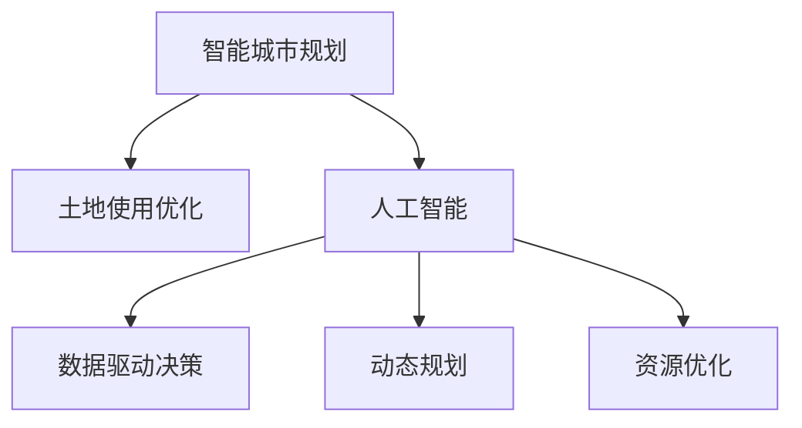

                 

# AI在智能城市规划中的应用：优化土地使用

> 关键词：智能城市规划, 土地使用优化, 人工智能, 算法模型, 数据驱动, 算法步骤, 应用场景

## 1. 背景介绍

### 1.1 问题由来

智能城市是信息时代下城市发展的新趋势，旨在通过新一代信息技术的深度应用，实现城市运行更加智能、高效、可持续。土地作为城市的基本资源，其合理使用直接关系到城市规划的科学性和可操作性。传统城市规划依靠人工经验，耗时长、成本高、易受主观偏见影响，难以满足现代城市对快速、精准、动态规划的需求。

近年来，人工智能(AI)技术在多个领域展现了强大的应用潜力。特别是在大数据和云计算的支撑下，AI在城市规划中的应用逐渐增多，尤其是在土地使用优化方面。通过AI技术，可以基于历史和实时数据，自动识别土地使用中的问题，并提出优化建议，从而实现智能、动态、精准的城市土地管理。

### 1.2 问题核心关键点

基于AI的土地使用优化核心关键点包括以下几个方面：

1. **数据驱动决策**：利用大数据和AI算法，自动化地分析城市土地使用数据，识别土地利用中的不均衡、浪费、低效等问题，为决策提供科学依据。

2. **动态规划**：结合实时数据和AI预测模型，实现土地使用的动态监测和调整，及时响应城市发展变化，确保规划的可持续性和灵活性。

3. **资源优化**：通过优化土地使用，提高土地资源的利用效率，增加绿色空间，改善生态环境，促进城市的可持续发展。

4. **应用多样性**：AI技术可以应用于土地使用优化中的各类任务，如土地资源调查、规划设计、用途变更管理等，具有广泛的适用性。

5. **技术可扩展性**：AI模型具有高度可扩展性，可以根据具体需求定制算法模型，不断提升土地使用的管理水平。

### 1.3 问题研究意义

基于AI的土地使用优化对于提升城市规划的科学性和效率具有重要意义：

1. **提高规划效率**：自动化分析大量数据，减少人工劳动，大幅缩短规划周期，提高规划速度。

2. **提升规划质量**：数据驱动的决策分析能够提供更科学、更全面的规划依据，提升规划的精准性和可操作性。

3. **促进资源合理配置**：通过优化土地使用，提高土地资源的利用效率，减少浪费，增加城市绿地和公共空间，提升城市品质。

4. **增强规划的可持续性**：通过动态监测和调整，实现对城市发展的及时响应，确保城市规划与环境、社会、经济的发展目标保持一致。

5. **推动产业升级**：AI技术在土地使用优化中的应用，将促进传统城市规划行业的数字化转型，推动智慧城市和绿色城市的建设。

## 2. 核心概念与联系

### 2.1 核心概念概述

为更好地理解基于AI的土地使用优化方法，本节将介绍几个密切相关的核心概念：

- **智能城市规划**：利用AI、大数据、物联网等技术手段，对城市空间进行智能化管理和优化，提高城市运行效率，改善居民生活质量。

- **土地使用优化**：通过数据分析和AI算法，识别土地利用中的问题，提出优化建议，提高土地资源的利用效率，促进城市可持续发展。

- **人工智能(AI)**：一种通过算法模拟人类智能的技术，涵盖机器学习、深度学习、自然语言处理、计算机视觉等多个领域。

- **数据驱动决策**：基于大量数据，利用AI模型进行决策分析，提供科学依据。

- **动态规划**：结合实时数据和AI预测模型，实现土地使用的动态监测和调整。

- **资源优化**：通过优化土地使用，提高资源利用效率，增加绿色空间，改善生态环境。

这些核心概念之间的逻辑关系可以通过以下Mermaid流程图来展示：



这个流程图展示了这个主题中几个核心概念之间的关系：

1. 智能城市规划是目标，土地使用优化是手段。
2. 人工智能是技术支撑，数据驱动决策、动态规划、资源优化是具体的实施方式。

## 3. 核心算法原理 & 具体操作步骤
### 3.1 算法原理概述

基于AI的土地使用优化，本质上是一个基于数据驱动的决策优化过程。其核心思想是：利用历史和实时土地使用数据，构建AI模型，自动分析土地利用中的不均衡、浪费、低效等问题，并提出优化建议。

具体而言，假设已知城市土地使用的历史数据 $D=\{(x_i,y_i)\}_{i=1}^N$，其中 $x_i$ 为时间、位置等特征，$y_i$ 为土地利用情况（如居住、商业、工业、绿地等）。目标是构建一个AI模型 $M$，能够基于新输入的特征 $x$，预测最优的土地利用方案 $y^*$。

优化目标为：

$$
\min_{M} \mathcal{L}(M) = \sum_{i=1}^N \ell(M(x_i), y_i)
$$

其中 $\ell$ 为损失函数，衡量模型预测与实际数据之间的差异。

### 3.2 算法步骤详解

基于AI的土地使用优化一般包括以下几个关键步骤：

**Step 1: 数据收集与预处理**

- 收集城市历史和实时土地使用数据，包括时间、地理位置、使用类型等。
- 清洗数据，处理缺失值、异常值，保证数据的质量和一致性。
- 划分训练集、验证集和测试集，用于模型训练、调优和性能评估。

**Step 2: 特征工程**

- 提取时间、地理位置、地形、人口密度等特征，用于构建输入特征 $x$。
- 进行特征编码，如将地理位置转化为经纬度、高程等数值形式。
- 应用归一化、标准化等方法处理特征，提高模型的收敛速度和效果。

**Step 3: 构建AI模型**

- 选择合适的算法，如决策树、随机森林、神经网络等，构建预测模型 $M$。
- 应用特征选择技术，识别对预测结果影响较大的特征，减少噪音干扰。
- 设置超参数，如模型深度、学习率、正则化系数等，进行模型调优。

**Step 4: 训练与验证**

- 使用训练集数据，对模型进行迭代训练，不断优化模型参数。
- 在验证集上评估模型性能，防止过拟合，调整模型参数。
- 重复训练和验证过程，直至模型达到预设的性能指标。

**Step 5: 应用与评估**

- 将训练好的模型应用于实时数据，预测土地使用的最优方案。
- 在测试集上评估模型的泛化性能，检查模型的稳健性和准确性。
- 将优化后的土地使用方案反馈给城市规划部门，进行调整和优化。

### 3.3 算法优缺点

基于AI的土地使用优化方法具有以下优点：

1. **高效快速**：利用AI算法自动化分析大量数据，大大缩短规划周期，提高效率。

2. **科学精确**：数据驱动的决策分析提供科学依据，提升规划的精准性和可操作性。

3. **动态适应**：结合实时数据和AI预测模型，实现土地使用的动态监测和调整，确保规划的可持续性。

4. **广泛适用**：AI技术可以应用于土地使用优化中的各类任务，具有广泛的适用性。

5. **资源优化**：通过优化土地使用，提高土地资源的利用效率，增加绿色空间，改善生态环境。

同时，该方法也存在一些局限性：

1. **数据依赖性强**：模型性能高度依赖数据质量，数据缺失或不一致会影响模型效果。

2. **模型复杂度高**：复杂的AI模型需要大量的计算资源和时间，构建和训练成本较高。

3. **解释性不足**：AI模型的决策过程较为复杂，难以解释，可能存在“黑盒”问题。

4. **依赖先验知识**：模型的预测效果与先验知识相关，缺乏先验知识的场景下性能可能不佳。

尽管存在这些局限性，但就目前而言，基于AI的土地使用优化方法仍是智能城市规划中的重要手段，具有广阔的应用前景。

### 3.4 算法应用领域

基于AI的土地使用优化方法在智能城市规划中具有广泛的应用，主要涵盖以下几个方面：

1. **土地利用规划**：分析城市土地利用现状，识别不均衡、低效等问题，提出优化建议。

2. **土地用途变更管理**：根据城市发展需求，预测未来土地用途变化，制定合理的土地用途变更计划。

3. **绿地规划与建设**：识别适宜的绿地建设区域，优化城市绿化布局，提升城市生态环境。

4. **商业地产管理**：分析商业地产的分布与利用情况，提出优化策略，提高商业地产的利用效率。

5. **交通规划**：结合土地使用情况，优化交通路线和设施布局，缓解交通压力，提升交通效率。

6. **灾害预防与管理**：预测自然灾害可能带来的土地使用变化，制定相应的防灾减灾措施。

除了上述这些经典应用外，AI技术还可创新性地应用于城市规划中的更多场景，如智能交通、智慧物流、公共服务优化等，为智能城市的建设提供更多可能。

## 4. 数学模型和公式 & 详细讲解 & 举例说明

### 4.1 数学模型构建

假设已知城市土地使用的历史数据 $D=\{(x_i,y_i)\}_{i=1}^N$，其中 $x_i$ 为时间、地理位置等特征，$y_i$ 为土地利用情况。目标是构建一个AI模型 $M$，能够基于新输入的特征 $x$，预测最优的土地利用方案 $y^*$。

构建的数学模型可以表示为：

$$
y^* = M(x)
$$

其中 $M$ 为预测模型，可以是决策树、神经网络、支持向量机等。

### 4.2 公式推导过程

以神经网络模型为例，其基本结构如图1所示。

图1: 神经网络模型结构

神经网络模型由多个层次构成，每个层次包含多个神经元。假设模型的输入层有 $m$ 个特征，输出层有 $n$ 种可能的土地利用情况。模型的预测过程可以表示为：

$$
y = f(x; \theta)
$$

其中 $f$ 为激活函数，$\theta$ 为模型参数。

模型的损失函数可以表示为：

$$
\mathcal{L}(\theta) = \frac{1}{N}\sum_{i=1}^N \ell(y_i, f(x_i; \theta))
$$

其中 $\ell$ 为损失函数，衡量模型预测与实际数据之间的差异。常用的损失函数包括交叉熵损失、均方误差损失等。

模型的训练过程可以表示为：

$$
\theta \leftarrow \theta - \eta \nabla_{\theta}\mathcal{L}(\theta)
$$

其中 $\eta$ 为学习率，$\nabla_{\theta}\mathcal{L}(\theta)$ 为损失函数对模型参数的梯度，通过反向传播算法计算。

### 4.3 案例分析与讲解

以神经网络模型为例，某城市土地使用优化项目具体步骤分析如下：

1. **数据收集与预处理**

   - 收集城市历史和实时土地使用数据，包括时间、地理位置、使用类型等。
   - 清洗数据，处理缺失值、异常值，保证数据的质量和一致性。
   - 划分训练集、验证集和测试集，用于模型训练、调优和性能评估。

2. **特征工程**

   - 提取时间、地理位置、地形、人口密度等特征，用于构建输入特征 $x$。
   - 进行特征编码，如将地理位置转化为经纬度、高程等数值形式。
   - 应用归一化、标准化等方法处理特征，提高模型的收敛速度和效果。

3. **模型构建与训练**

   - 选择合适的算法，如神经网络，构建预测模型 $M$。
   - 应用特征选择技术，识别对预测结果影响较大的特征，减少噪音干扰。
   - 设置超参数，如模型深度、学习率、正则化系数等，进行模型调优。

4. **应用与评估**

   - 将训练好的模型应用于实时数据，预测土地使用的最优方案。
   - 在测试集上评估模型的泛化性能，检查模型的稳健性和准确性。
   - 将优化后的土地使用方案反馈给城市规划部门，进行调整和优化。

## 5. 项目实践：代码实例和详细解释说明

### 5.1 开发环境搭建

在进行土地使用优化实践前，我们需要准备好开发环境。以下是使用Python进行TensorFlow开发的简单环境配置流程：

1. 安装Anaconda：从官网下载并安装Anaconda，用于创建独立的Python环境。

2. 创建并激活虚拟环境：
```bash
conda create -n tf-env python=3.8 
conda activate tf-env
```

3. 安装TensorFlow：根据CUDA版本，从官网获取对应的安装命令。例如：
```bash
conda install tensorflow-gpu=2.7.0 -c conda-forge
```

4. 安装各类工具包：
```bash
pip install numpy pandas scikit-learn matplotlib tqdm jupyter notebook ipython
```

完成上述步骤后，即可在`tf-env`环境中开始土地使用优化的项目实践。

### 5.2 源代码详细实现

这里我们以神经网络模型为例，给出使用TensorFlow对城市土地使用进行优化的Python代码实现。

首先，定义数据处理函数：

```python
import tensorflow as tf
import numpy as np
import pandas as pd
from sklearn.model_selection import train_test_split

def load_data(file_path):
    data = pd.read_csv(file_path)
    x = data[['time', 'latitude', 'longitude', 'population_density', 'elevation']]
    y = data['use_type']
    return x, y

def preprocess_data(x, y, train_ratio=0.8):
    x_train, x_test, y_train, y_test = train_test_split(x, y, test_size=1-train_ratio, random_state=42)
    x_train = np.array(x_train)
    x_test = np.array(x_test)
    y_train = np.array(y_train)
    y_test = np.array(y_test)
    return x_train, x_test, y_train, y_test

# 加载数据
x, y = load_data('land_use_data.csv')

# 数据预处理
x_train, x_test, y_train, y_test = preprocess_data(x, y, train_ratio=0.8)
```

然后，定义模型和优化器：

```python
model = tf.keras.Sequential([
    tf.keras.layers.Dense(64, activation='relu', input_shape=(x_train.shape[1],)),
    tf.keras.layers.Dense(64, activation='relu'),
    tf.keras.layers.Dense(n_classes, activation='softmax')
])

optimizer = tf.keras.optimizers.Adam(learning_rate=0.001)
```

接着，定义训练和评估函数：

```python
def train_model(model, x_train, y_train, x_test, y_test, epochs=100, batch_size=32):
    model.compile(optimizer=optimizer, loss='sparse_categorical_crossentropy', metrics=['accuracy'])
    history = model.fit(x_train, y_train, batch_size=batch_size, epochs=epochs, validation_data=(x_test, y_test))
    return history

def evaluate_model(model, x_test, y_test, batch_size=32):
    loss, accuracy = model.evaluate(x_test, y_test, batch_size=batch_size)
    print(f'Test loss: {loss:.4f}')
    print(f'Test accuracy: {accuracy:.4f}')

# 训练模型
history = train_model(model, x_train, y_train, x_test, y_test, epochs=100, batch_size=32)

# 评估模型
evaluate_model(model, x_test, y_test, batch_size=32)
```

最后，在测试集上评估模型性能：

```python
print(f'Train loss: {history.history["loss"][0]:.4f}')
print(f'Train accuracy: {history.history["accuracy"][0]:.4f}')
print(f'Test loss: {history.history["val_loss"][-1]:.4f}')
print(f'Test accuracy: {history.history["val_accuracy"][-1]:.4f}')
```

以上就是使用TensorFlow对城市土地使用优化项目进行开发的完整代码实现。可以看到，得益于TensorFlow的强大封装，我们可以用相对简洁的代码完成神经网络模型的构建和训练。

### 5.3 代码解读与分析

让我们再详细解读一下关键代码的实现细节：

**load_data函数**：
- 从CSV文件中加载数据，并将其分为特征 $x$ 和标签 $y$。

**preprocess_data函数**：
- 对数据进行归一化处理，并分割为训练集、验证集和测试集，确保模型训练和评估的公平性。

**模型构建与训练**：
- 定义一个包含两个隐藏层的神经网络，使用ReLU激活函数。
- 设置优化器和损失函数。
- 使用训练数据拟合模型，并在验证集上评估模型性能。

**应用与评估**：
- 在测试集上评估模型性能，检查模型的泛化能力。

## 6. 实际应用场景

### 6.1 智能交通规划

智能交通是智能城市规划的重要组成部分。通过土地使用优化，可以更好地协调交通设施的布局和运行，提升城市交通系统的效率和安全性。例如，通过对城市交通网络中的土地使用进行优化，可以减少交通拥堵，提高公共交通的覆盖率和准点率，减少环境污染。

具体而言，可以结合智能交通监控数据和土地使用数据，利用AI算法预测交通流量，识别交通瓶颈和拥堵区域，提出优化建议。如调整道路宽度、增加公共交通站点等，以缓解交通压力，提升交通运行效率。

### 6.2 绿地与公共空间规划

绿地和公共空间是城市居民的重要生活空间，直接关系到城市品质和居民幸福感。通过土地使用优化，可以更好地识别适宜的绿地和公共空间建设区域，优化绿地布局，提升城市生态环境和居民生活质量。

例如，通过对城市土地使用数据进行分析，识别出适宜建设绿地的区域，并根据居民活动需求，合理布局公园、广场、运动场等公共空间，增加市民休闲娱乐的场所，提升城市宜居性。

### 6.3 商业地产管理

商业地产是城市经济的重要组成部分，通过土地使用优化，可以更好地协调商业地产的分布和利用，提高商业地产的利用效率，促进经济发展。

具体而言，可以结合历史和实时商业地产使用数据，利用AI算法预测未来商业地产的供需变化，提出优化策略，如调整商业地产的建设规划，优化商业地产的运营管理，提升商业地产的经济效益。

### 6.4 未来应用展望

随着AI技术的不断发展，基于土地使用优化的应用将更加广泛和深入，推动智能城市的建设。

1. **城市灾害应对**：利用AI技术，结合土地使用数据，预测自然灾害的可能影响，制定相应的防灾减灾措施，减少灾害损失。

2. **智慧物流管理**：结合土地使用数据和物流需求数据，利用AI算法优化物流设施的布局和运行，提升物流效率，减少物流成本。

3. **公共服务优化**：利用AI技术，结合土地使用数据和公共服务需求数据，优化公共服务的布局和运行，提高公共服务的覆盖率和质量。

4. **城市可持续发展**：结合土地使用数据和城市发展需求，利用AI算法，优化城市资源配置，提升城市的可持续性。

5. **个性化服务定制**：利用AI技术，结合土地使用数据和居民需求数据，提供个性化的城市服务，提升居民的幸福感和满意度。

未来，AI技术在土地使用优化中的应用将更加深入和广泛，为智能城市的建设提供更多可能。相信随着技术的不断发展，基于AI的土地使用优化将成为智能城市规划的重要手段，推动城市向更加智能化、高效化和可持续化的方向发展。

## 7. 工具和资源推荐
### 7.1 学习资源推荐

为了帮助开发者系统掌握AI在智能城市规划中的应用，这里推荐一些优质的学习资源：

1. **《深度学习与人工智能》系列课程**：由多个大学和机构提供的深度学习课程，涵盖深度学习基础、神经网络、卷积神经网络、循环神经网络等。

2. **《智能城市规划》教科书**：介绍智能城市规划的基本概念、技术和方法，包括大数据、AI、物联网等。

3. **《城市规划与管理》在线课程**：涵盖城市规划的历史、理论、技术和方法，结合案例分析，提供系统的城市规划知识。

4. **Kaggle竞赛平台**：提供丰富的数据集和AI竞赛，可以实践AI在智能城市规划中的应用。

5. **AI学会与智能城市联盟**：提供最新的AI和智能城市研究进展，参加相关研讨会和交流活动，获取最新的技术动态。

通过对这些资源的学习实践，相信你一定能够系统掌握AI在智能城市规划中的应用，并用于解决实际问题。

### 7.2 开发工具推荐

高效的开发离不开优秀的工具支持。以下是几款用于智能城市规划开发的常用工具：

1. TensorFlow：由Google主导开发的开源深度学习框架，生产部署方便，适合大规模工程应用。

2. PyTorch：基于Python的开源深度学习框架，灵活动态的计算图，适合快速迭代研究。

3. Jupyter Notebook：基于Web的交互式编程环境，方便数据处理和模型训练，支持多种编程语言。

4. Tableau：数据可视化工具，可以将数据和分析结果直观呈现，便于决策和分析。

5. QGIS：开源地理信息系统，支持地理数据的管理、分析和可视化，方便进行土地使用分析。

合理利用这些工具，可以显著提升智能城市规划开发的效率，加快创新迭代的步伐。

### 7.3 相关论文推荐

AI技术在智能城市规划中的应用已成为学界和产业界的关注热点。以下是几篇奠基性的相关论文，推荐阅读：

1. "Intelligent Urban Planning: An Overview"：介绍了智能城市规划的基本概念、技术和方法，提供了系统的城市规划知识。

2. "Big Data and AI in Urban Planning"：探讨了大数据和AI在城市规划中的应用，分析了其潜力和挑战。

3. "Land Use Optimization using AI"：介绍了AI在土地使用优化中的应用，分析了其技术和方法。

4. "Smart Traffic Management with AI"：介绍了AI在智能交通管理中的应用，分析了其潜力和挑战。

5. "Green Space Planning with AI"：介绍了AI在绿地规划中的应用，分析了其潜力和挑战。

这些论文代表了AI在智能城市规划中的前沿研究进展，通过学习这些前沿成果，可以帮助研究者把握学科前进方向，激发更多的创新灵感。

## 8. 总结：未来发展趋势与挑战

### 8.1 总结

本文对基于AI的土地使用优化方法进行了全面系统的介绍。首先阐述了智能城市规划和土地使用优化的研究背景和意义，明确了土地使用优化在智能城市规划中的重要价值。其次，从原理到实践，详细讲解了土地使用优化的数学模型和关键步骤，给出了完整的代码实现。同时，本文还广泛探讨了土地使用优化的实际应用场景，展示了其在智能交通、绿地规划、商业地产管理等多个领域的应用潜力。最后，本文精选了土地使用优化的各类学习资源，力求为读者提供全方位的技术指引。

通过本文的系统梳理，可以看到，基于AI的土地使用优化方法在智能城市规划中的应用前景广阔，具备科学、高效、动态的决策支持能力，具有重要的应用价值。未来，随着AI技术的不断发展，基于土地使用优化的应用将更加广泛和深入，推动智能城市的建设，提升城市品质和居民幸福感。

### 8.2 未来发展趋势

展望未来，基于AI的土地使用优化将呈现以下几个发展趋势：

1. **数据驱动决策**：结合大数据和AI技术，实现城市土地使用的数据驱动决策，提高决策的科学性和准确性。

2. **动态规划**：结合实时数据和AI预测模型，实现土地使用的动态监测和调整，确保规划的可持续性。

3. **资源优化**：通过优化土地使用，提高土地资源的利用效率，增加绿色空间，改善生态环境，促进城市的可持续发展。

4. **多领域融合**：AI技术在土地使用优化中的应用将与其他技术进行更深入的融合，如智能交通、智慧物流、公共服务优化等，推动智能城市的建设。

5. **个性化服务**：结合居民需求数据，利用AI技术，提供个性化的城市服务，提升居民的幸福感和满意度。

6. **智慧治理**：结合AI技术，实现城市治理的智慧化，提高城市管理的自动化和智能化水平。

以上趋势凸显了AI技术在智能城市规划中的广阔前景。这些方向的探索发展，必将进一步提升城市规划的科学性和效率，推动智慧城市的建设，提升城市的品质和居民的生活水平。

### 8.3 面临的挑战

尽管基于AI的土地使用优化技术已经取得了初步成果，但在迈向更加智能化、普适化应用的过程中，仍面临诸多挑战：

1. **数据依赖性强**：模型性能高度依赖数据质量，数据缺失或不一致会影响模型效果。

2. **模型复杂度高**：复杂的AI模型需要大量的计算资源和时间，构建和训练成本较高。

3. **解释性不足**：AI模型的决策过程较为复杂，难以解释，可能存在“黑盒”问题。

4. **依赖先验知识**：模型的预测效果与先验知识相关，缺乏先验知识的场景下性能可能不佳。

5. **资源限制**：大规模数据和计算资源的需求，对硬件设备和计算环境提出了较高的要求。

尽管存在这些挑战，但AI技术在智能城市规划中的应用前景广阔，未来通过技术进步和资源投入，相信能够克服这些难题，实现更加高效、智能、可持续的城市土地使用管理。

### 8.4 研究展望

未来，在基于AI的土地使用优化研究中，需要在以下几个方面进行深入探索：

1. **多源数据融合**：结合多源数据，如地理信息、交通监控、居民需求等，提升模型的决策能力和应用范围。

2. **模型解释性**：开发更加可解释的AI模型，提高模型的透明性和可解释性，增强决策的信任度。

3. **知识图谱整合**：将知识图谱与AI模型结合，提升模型的先验知识和推理能力。

4. **跨领域应用**：将土地使用优化技术与智能交通、智慧物流、公共服务优化等进行融合，推动智能城市的建设。

5. **个性化服务定制**：结合居民需求数据，利用AI技术，提供个性化的城市服务，提升居民的幸福感和满意度。

6. **智慧治理**：结合AI技术，实现城市治理的智慧化，提高城市管理的自动化和智能化水平。

这些研究方向的探索，必将引领AI在智能城市规划中的应用进入新的阶段，为城市管理带来更多可能。只有勇于创新、敢于突破，才能不断拓展AI在城市规划中的应用边界，提升城市的智能化水平和居民的生活质量。

## 9. 附录：常见问题与解答

**Q1：AI在智能城市规划中的应用主要有哪些？**

A: AI在智能城市规划中的应用主要包括以下几个方面：

1. **土地使用优化**：通过数据分析和AI算法，识别土地利用中的不均衡、浪费、低效等问题，提出优化建议。

2. **智能交通规划**：结合智能交通监控数据和土地使用数据，利用AI算法预测交通流量，识别交通瓶颈和拥堵区域，提出优化建议。

3. **绿地与公共空间规划**：结合历史和实时土地使用数据，利用AI算法预测绿地和公共空间的适宜建设区域，优化绿地布局。

4. **商业地产管理**：结合历史和实时商业地产使用数据，利用AI算法预测未来商业地产的供需变化，提出优化策略。

5. **城市灾害应对**：利用AI技术，结合土地使用数据，预测自然灾害的可能影响，制定相应的防灾减灾措施。

6. **智慧物流管理**：结合土地使用数据和物流需求数据，利用AI算法优化物流设施的布局和运行。

7. **公共服务优化**：利用AI技术，结合土地使用数据和公共服务需求数据，优化公共服务的布局和运行。

8. **城市可持续发展**：结合土地使用数据和城市发展需求，利用AI算法，优化城市资源配置，提升城市的可持续性。

9. **个性化服务定制**：利用AI技术，结合居民需求数据，提供个性化的城市服务。

10. **智慧治理**：结合AI技术，实现城市治理的智慧化，提高城市管理的自动化和智能化水平。

AI技术在智能城市规划中的应用涵盖了多个方面，具有广泛的应用前景。

**Q2：如何构建AI模型进行土地使用优化？**

A: 构建AI模型进行土地使用优化，主要包括以下几个步骤：

1. **数据收集与预处理**：收集城市历史和实时土地使用数据，提取时间、地理位置、地形、人口密度等特征。

2. **特征工程**：对数据进行归一化处理，选择合适的特征，构建输入特征 $x$。

3. **模型构建与训练**：选择合适的算法，如神经网络，构建预测模型 $M$。应用特征选择技术，识别对预测结果影响较大的特征。设置超参数，进行模型调优。

4. **应用与评估**：在测试集上评估模型的泛化性能，检查模型的稳健性和准确性。将优化后的土地使用方案反馈给城市规划部门，进行调整和优化。

5. **动态规划**：结合实时数据和AI预测模型，实现土地使用的动态监测和调整。

通过以上步骤，可以构建一个有效的AI模型，进行土地使用优化。

**Q3：AI在智能城市规划中存在哪些局限性？**

A: AI在智能城市规划中也存在一些局限性，主要包括：

1. **数据依赖性强**：模型性能高度依赖数据质量，数据缺失或不一致会影响模型效果。

2. **模型复杂度高**：复杂的AI模型需要大量的计算资源和时间，构建和训练成本较高。

3. **解释性不足**：AI模型的决策过程较为复杂，难以解释，可能存在“黑盒”问题。

4. **依赖先验知识**：模型的预测效果与先验知识相关，缺乏先验知识的场景下性能可能不佳。

5. **资源限制**：大规模数据和计算资源的需求，对硬件设备和计算环境提出了较高的要求。

尽管存在这些局限性，但AI技术在智能城市规划中的应用前景广阔，未来通过技术进步和资源投入，相信能够克服这些难题，实现更加高效、智能、可持续的城市土地使用管理。

**Q4：AI在土地使用优化中的应用前景如何？**

A: AI在土地使用优化中的应用前景广阔，主要体现在以下几个方面：

1. **数据驱动决策**：结合大数据和AI技术，实现城市土地使用的数据驱动决策，提高决策的科学性和准确性。

2. **动态规划**：结合实时数据和AI预测模型，实现土地使用的动态监测和调整，确保规划的可持续性。

3. **资源优化**：通过优化土地使用，提高土地资源的利用效率，增加绿色空间，改善生态环境，促进城市的可持续发展。

4. **多领域融合**：AI技术在土地使用优化中的应用将与其他技术进行更深入的融合，如智能交通、智慧物流、公共服务优化等，推动智能城市的建设。

5. **个性化服务**：结合居民需求数据，利用AI技术，提供个性化的城市服务，提升居民的幸福感和满意度。

6. **智慧治理**：结合AI技术，实现城市治理的智慧化，提高城市管理的自动化和智能化水平。

未来，随着AI技术的不断发展，基于土地使用优化的应用将更加广泛和深入，推动智能城市的建设，提升城市品质和居民的生活水平。

---

作者：禅与计算机程序设计艺术 / Zen and the Art of Computer Programming

