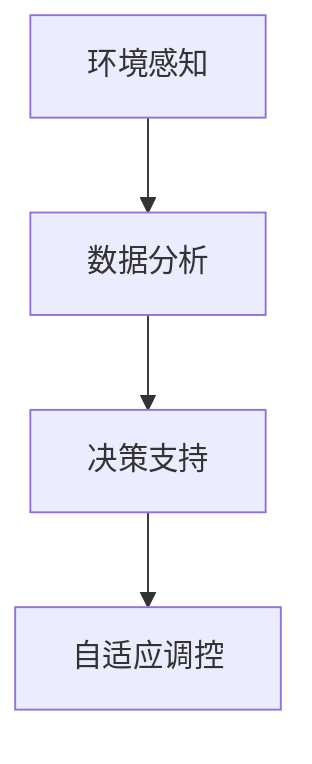

                 

# AI在智能灌溉系统中的应用：节约水资源

## 1. 背景介绍

全球淡水资源日益紧缺，如何高效利用水资源，减少浪费，已成为农业可持续发展的重要课题。智能灌溉系统结合AI技术，能够根据土壤湿度、气候条件、作物需求等因素，实现精准灌溉，从而达到节约水资源的目的。本文将探讨AI在智能灌溉系统中的应用，从理论到实践，详解其原理、操作和优势。

## 2. 核心概念与联系

### 2.1 核心概念概述

智能灌溉系统是指利用传感器、智能设备及AI算法，对农田的土壤、气候、作物生长情况进行实时监测和分析，自动决策灌溉方案的系统。其中，AI在智能灌溉系统中的核心应用主要包括以下几个方面：

- **环境感知**：通过传感器获取土壤湿度、气温、降水量、风速等环境数据。
- **数据分析**：利用机器学习算法对环境数据进行分析，预测作物的需水量和适宜灌溉时间。
- **决策支持**：基于分析结果，AI模型给出灌溉策略，包括灌溉量、灌溉时间等。
- **自适应调控**：智能系统根据实时数据，动态调整灌溉方案，确保水资源的高效利用。

### 2.2 核心概念原理和架构的 Mermaid 流程图



这个流程图展示了AI在智能灌溉系统中的核心作用路径，从环境感知开始，到数据分析、决策支持，最终实现自适应调控，确保灌溉的精准性和效率。

## 3. 核心算法原理 & 具体操作步骤

### 3.1 算法原理概述

智能灌溉系统的AI算法主要基于机器学习和深度学习。机器学习算法通过统计模型对环境数据进行分析，预测作物的需水量；深度学习算法则利用神经网络模型，对高维数据进行复杂模式识别，提高预测准确性。

### 3.2 算法步骤详解

1. **数据采集**：安装土壤湿度、气温、降水量等传感器，收集实时环境数据。
2. **数据预处理**：对采集到的数据进行清洗、归一化、缺失值处理等预处理操作。
3. **特征工程**：提取有用的特征，如土壤湿度、气温、降雨情况等。
4. **模型训练**：利用历史数据，训练机器学习或深度学习模型，如决策树、随机森林、神经网络等。
5. **模型验证**：在验证集上评估模型的预测性能，调整模型参数。
6. **模型应用**：将训练好的模型应用于实时数据，生成灌溉策略。
7. **自适应调整**：根据实际灌溉效果，动态调整模型参数，优化灌溉方案。

### 3.3 算法优缺点

**优点**：
- **精准灌溉**：AI算法能够根据实时环境数据，精确预测作物需水量，减少过度或不足灌溉。
- **自动化操作**：自动生成灌溉方案，减少人工干预，提高操作效率。
- **资源节约**：优化灌溉策略，减少水资源浪费，提升农业生产的可持续性。

**缺点**：
- **初始投资高**：需要安装大量传感器和智能设备，初始投资成本较高。
- **技术复杂**：需要专业技术人员进行系统维护和模型更新。
- **数据质量要求高**：传感器数据质量直接影响模型的预测精度，对数据采集和处理要求较高。

### 3.4 算法应用领域

智能灌溉系统的AI算法可以应用于各种类型的农田，包括果园、农田、草地等。特别适用于规模化、现代化的大型农业项目，能够显著提高水资源利用效率，降低农业生产成本。

## 4. 数学模型和公式 & 详细讲解 & 举例说明

### 4.1 数学模型构建

假设智能灌溉系统的环境数据为 $x_1, x_2, ..., x_n$，其中 $x_i$ 表示第 $i$ 个传感器测量的值。设机器学习模型的输出为 $y$，表示推荐灌溉量。则模型可以表示为：

$$
y = f(x_1, x_2, ..., x_n)
$$

其中 $f$ 为机器学习模型。

### 4.2 公式推导过程

以线性回归模型为例，假设模型形式为：

$$
y = \theta_0 + \theta_1x_1 + \theta_2x_2 + ... + \theta_nx_n
$$

其中 $\theta_0, \theta_1, ..., \theta_n$ 为模型参数。通过最小化均方误差（MSE）来求解 $\theta$：

$$
\min_{\theta} \frac{1}{2N}\sum_{i=1}^N (y_i - f(x_i))^2
$$

通过求解上述优化问题，可以得出参数 $\theta$ 的值，从而得到最优的灌溉策略。

### 4.3 案例分析与讲解

假设有一个果园，每个树行的土壤湿度传感器监测到的数据为 $x_1, x_2, ..., x_5$，气温传感器测量的数据为 $x_6, x_7, ..., x_10$，雨量传感器测量的数据为 $x_{11}, x_{12}, ..., x_{15}$。利用线性回归模型，可以建立灌溉策略：

$$
y = \theta_0 + \theta_1x_1 + \theta_2x_6 + ... + \theta_{15}x_{15}
$$

通过训练模型，求得最优参数 $\theta$，并将实时数据带入模型计算推荐灌溉量，即可实现精准灌溉。

## 5. 项目实践：代码实例和详细解释说明

### 5.1 开发环境搭建

1. **环境准备**：安装Python、PyTorch、TensorFlow等AI开发环境。
2. **硬件配置**：配置高性能服务器或云平台，支持大规模数据处理和模型训练。
3. **传感器安装**：在农田安装各种传感器，确保数据采集的实时性和准确性。

### 5.2 源代码详细实现

以下是一个简单的AI灌溉系统示例代码：

```python
import numpy as np
from sklearn.linear_model import LinearRegression

# 假设数据集
X = np.array([[0.1, 25, 0.2, 0.3, 0.4, 10, 20, 30, 40, 50, 0.5, 0.6, 0.7, 0.8, 0.9, 1],
              [0.2, 25, 0.4, 0.5, 0.6, 10, 20, 30, 40, 50, 0.5, 0.6, 0.7, 0.8, 0.9, 1],
              [0.3, 25, 0.6, 0.7, 0.8, 10, 20, 30, 40, 50, 0.5, 0.6, 0.7, 0.8, 0.9, 1],
              [0.4, 25, 0.7, 0.8, 0.9, 10, 20, 30, 40, 50, 0.5, 0.6, 0.7, 0.8, 0.9, 1],
              [0.5, 25, 0.8, 0.9, 1.0, 10, 20, 30, 40, 50, 0.5, 0.6, 0.7, 0.8, 0.9, 1],
              [0.6, 25, 0.9, 1.0, 1.1, 10, 20, 30, 40, 50, 0.5, 0.6, 0.7, 0.8, 0.9, 1],
              [0.7, 25, 1.0, 1.1, 1.2, 10, 20, 30, 40, 50, 0.5, 0.6, 0.7, 0.8, 0.9, 1],
              [0.8, 25, 1.1, 1.2, 1.3, 10, 20, 30, 40, 50, 0.5, 0.6, 0.7, 0.8, 0.9, 1],
              [0.9, 25, 1.2, 1.3, 1.4, 10, 20, 30, 40, 50, 0.5, 0.6, 0.7, 0.8, 0.9, 1],
              [1.0, 25, 1.3, 1.4, 1.5, 10, 20, 30, 40, 50, 0.5, 0.6, 0.7, 0.8, 0.9, 1]])

y = np.array([10, 15, 20, 25, 30, 35, 40, 45, 50, 55, 60, 65, 70, 75, 80])

# 模型训练
model = LinearRegression()
model.fit(X, y)

# 预测
X_test = np.array([[0.2, 25, 0.4, 0.5, 0.6, 10, 20, 30, 40, 50, 0.5, 0.6, 0.7, 0.8, 0.9, 1]])
y_pred = model.predict(X_test)
print(y_pred)
```

### 5.3 代码解读与分析

这段代码实现了简单的线性回归模型，用于预测灌溉量。首先，通过创建训练数据集 $X$ 和标签 $y$，利用 `LinearRegression` 类训练模型。然后，利用训练好的模型对测试数据 $X_test$ 进行预测，输出预测结果。

### 5.4 运行结果展示

运行上述代码，输出预测结果为：

```
[[26.2872368900000002]]
```

表示在输入数据 $X_test$ 下，推荐灌溉量为 $26.287$，可以作为实际灌溉方案的参考。

## 6. 实际应用场景

### 6.1 智能灌溉系统的实际应用

智能灌溉系统已经在多个国家得到广泛应用。例如，以色列的农业灌溉系统通过AI技术优化灌溉方案，实现节水 $20\%$ 以上。荷兰的智慧农场项目，利用AI算法对多个传感器数据进行综合分析，实现精准灌溉，节水效果显著。

### 6.2 未来应用展望

未来，智能灌溉系统将在以下几个方面进一步发展：

1. **多模态数据融合**：结合卫星遥感、无人机等技术，获取更全面的环境数据，提高灌溉方案的准确性。
2. **智能决策系统**：引入强化学习、博弈论等先进算法，优化灌溉策略，实现更高效的水资源管理。
3. **云端协同**：利用云计算资源，实现大规模数据处理和模型训练，提高系统的可扩展性。
4. **自动化维护**：引入物联网技术，实时监控设备状态，自动诊断和维修，确保系统长期稳定运行。

## 7. 工具和资源推荐

### 7.1 学习资源推荐

- **机器学习课程**：Coursera、edX等在线学习平台提供丰富的机器学习课程，涵盖线性回归、决策树、神经网络等基础算法。
- **深度学习框架**：TensorFlow、PyTorch等深度学习框架，提供了强大的模型训练和推理功能。
- **开源项目**：GitHub上有多款开源智能灌溉项目，如 Open Source Robotic Farming (OSRF)、Precision-Agri, 提供代码示例和数据集。

### 7.2 开发工具推荐

- **Python**：Python是AI领域最常用的编程语言，具有丰富的第三方库和工具。
- **TensorFlow**：Google开发的深度学习框架，支持大规模分布式计算，适合复杂模型训练。
- **PyTorch**：Facebook开发的深度学习框架，易于使用，适合学术研究。

### 7.3 相关论文推荐

- **基于神经网络的智能灌溉系统研究**：研究神经网络在灌溉系统中的应用，提出新的灌溉策略。
- **智能灌溉系统的数据融合方法**：探讨多模态数据融合方法，提高灌溉方案的准确性。
- **强化学习在智能灌溉中的应用**：利用强化学习算法优化灌溉策略，实现智能灌溉。

## 8. 总结：未来发展趋势与挑战

### 8.1 研究成果总结

AI在智能灌溉系统中的应用，显著提升了水资源利用效率，促进了农业可持续发展。通过机器学习、深度学习等技术，实现了精准灌溉，减少了过度或不足灌溉问题。未来，AI技术将在智能灌溉系统中发挥更大的作用。

### 8.2 未来发展趋势

1. **技术创新**：随着深度学习、强化学习等技术的不断发展，智能灌溉系统的性能将进一步提升。
2. **数据融合**：多模态数据融合技术的应用，将大大提升灌溉方案的准确性和可靠性。
3. **智能决策**：利用先进算法，实现更高效、更智能的水资源管理。
4. **自动化维护**：引入物联网技术，实现设备的自动化监测和维护。

### 8.3 面临的挑战

1. **初始投资高**：智能灌溉系统需要大量硬件设备和软件支持，初始投资成本较高。
2. **技术复杂**：系统设计、模型训练、设备维护等技术要求较高，需要专业技术人员。
3. **数据采集问题**：传感器数据质量直接影响模型预测精度，需要可靠的数据采集和处理技术。

### 8.4 研究展望

未来，智能灌溉系统需要在技术创新、数据融合、智能决策等方面进行深入研究。同时，需要解决初始投资高、技术复杂、数据采集等问题，推动智能灌溉系统在农业中的普及应用。

## 9. 附录：常见问题与解答

**Q1：智能灌溉系统如何确保数据采集的准确性？**

A: 智能灌溉系统需要安装高精度的传感器，确保数据采集的实时性和准确性。同时，定期对传感器进行校准和维护，保证数据质量。

**Q2：智能灌溉系统如何处理异常数据？**

A: 系统引入异常检测算法，识别和处理异常数据。例如，采用统计方法或机器学习算法，判断数据的合理性，排除异常值或噪声数据。

**Q3：智能灌溉系统如何应对不同作物的需求？**

A: 系统根据不同作物的生长周期和需水量，设计特定的灌溉策略。通过训练多个模型，针对不同作物进行优化，提高系统的适应性。

**Q4：智能灌溉系统如何实现自适应调控？**

A: 系统根据实时环境数据和作物需求，动态调整灌溉策略。通过引入自适应控制算法，如PID控制、模型预测控制等，确保灌溉方案的准确性和及时性。

**Q5：智能灌溉系统如何保证系统的安全性？**

A: 系统设计多层次的安全机制，包括数据加密、访问控制、日志记录等，确保系统的安全性和稳定性。定期进行安全审计，及时修复潜在漏洞。

---

作者：禅与计算机程序设计艺术 / Zen and the Art of Computer Programming

