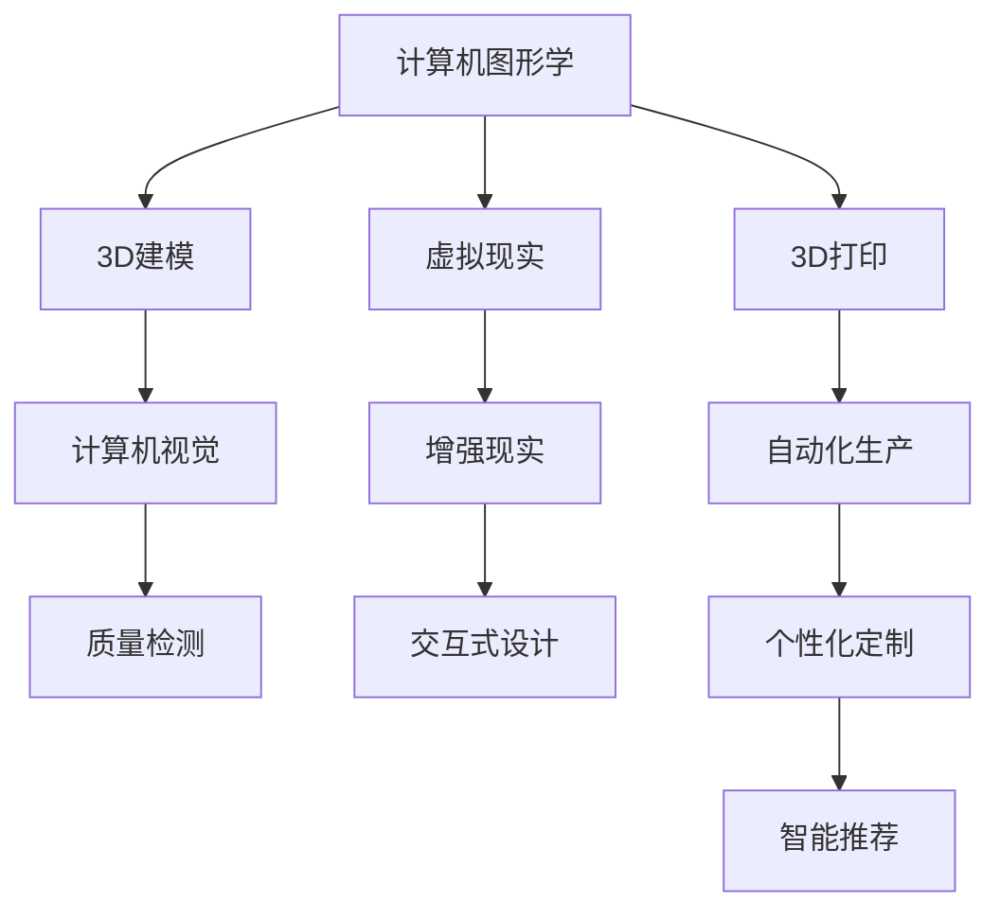

                 

# AI在珠宝设计中的应用：创新与定制

> 关键词：AI, 珠宝设计, 个性化定制, 3D打印, 计算机图形学, 计算机视觉, 机器学习, 智能推荐

## 1. 背景介绍

### 1.1 问题由来
珠宝设计是一个复杂而精细的艺术和工程领域，传统的珠宝设计师必须具备丰富的经验和创造力，才能设计出独特且符合客户需求的珠宝作品。然而，这种手工制作的过程耗时且成本高昂，无法满足快速变化的市场需求。近年来，随着人工智能(AI)技术的发展，尤其是计算机图形学、计算机视觉、机器学习等领域技术的突破，AI开始在珠宝设计中扮演越来越重要的角色。

### 1.2 问题核心关键点
AI在珠宝设计中的应用主要集中在以下几个方面：
- 个性化定制：通过分析客户需求和偏好，AI可以提供定制化的设计方案。
- 3D打印：AI技术可以自动生成符合客户需求的设计，并通过3D打印快速生产。
- 智能推荐：AI可以基于历史数据和市场趋势，为客户提供个性化的设计建议。
- 自动化设计：AI可以自动完成部分设计工作，减轻设计师的工作负担，提高设计效率。
- 质量控制：AI可以通过图像识别和机器学习技术，对珠宝作品进行自动检测和评估。

这些核心关键点共同构成了AI在珠宝设计中的应用框架，使得珠宝设计不仅能够满足个性化需求，还能提高效率和降低成本。

## 2. 核心概念与联系

### 2.1 核心概念概述

为更好地理解AI在珠宝设计中的应用，本节将介绍几个密切相关的核心概念：

- 计算机图形学(Computer Graphics)：涉及图形数据的生成、显示、处理和交互，是珠宝设计中实现虚拟现实、3D建模等技术的基础。
- 计算机视觉(Computer Vision)：通过图像处理和分析，实现对珠宝作品的自动化检测和质量评估。
- 机器学习(Machine Learning)：通过数据分析和模型训练，实现对珠宝设计趋势的预测和个性化推荐。
- 3D打印(3D Printing)：通过数字模型自动生成实体珠宝，实现快速生产和大规模定制。
- 个性化定制(Personalized Design)：通过分析客户需求和偏好，提供符合个体特征的设计方案。
- 智能推荐(Intelligent Recommendation)：基于客户行为数据和市场趋势，提供个性化的设计建议。

这些核心概念之间的逻辑关系可以通过以下Mermaid流程图来展示：



这个流程图展示了大语言模型的核心概念及其之间的关系：

1. 计算机图形学和3D建模为珠宝设计提供了虚拟仿真和实际生产的工具。
2. 计算机视觉和质量检测技术提升了珠宝制作的自动化水平。
3. 机器学习和智能推荐技术为珠宝设计提供了个性化的设计建议。
4. 3D打印技术实现了个性化定制和快速生产。
5. 虚拟现实和增强现实技术提升了用户交互体验。

这些核心概念共同构成了AI在珠宝设计中的应用框架，使得珠宝设计不仅能够满足个性化需求，还能提高效率和降低成本。

## 3. 核心算法原理 & 具体操作步骤
### 3.1 算法原理概述

AI在珠宝设计中的应用主要基于以下几个算法原理：

- 图像处理与分析：通过计算机视觉技术，对珠宝设计图片进行图像处理和特征提取，从而实现自动化检测和质量评估。
- 模型训练与优化：通过机器学习算法，对珠宝设计数据进行建模和优化，实现设计趋势预测和个性化推荐。
- 虚拟仿真与3D建模：通过计算机图形学技术，实现虚拟仿真和3D建模，为珠宝设计提供创意展示和生产原型。
- 自动化设计与生产：通过AI算法，自动生成符合客户需求的设计方案，并通过3D打印实现快速生产。

这些算法原理在珠宝设计中的应用，能够实现自动化的设计、生产、质量控制和客户个性化定制，显著提高设计效率和产品质量。

### 3.2 算法步骤详解

AI在珠宝设计中的应用流程通常包括以下几个步骤：

**Step 1: 数据收集与预处理**
- 收集珠宝设计数据，包括客户需求、历史设计数据、市场趋势等。
- 对数据进行清洗和标注，如去除噪音、归一化数据等。

**Step 2: 特征提取与分析**
- 使用计算机视觉技术，对珠宝设计图片进行特征提取，如边缘检测、纹理分析、颜色提取等。
- 通过机器学习算法，对提取出的特征进行分析，识别设计趋势和客户偏好。

**Step 3: 设计生成与优化**
- 使用计算机图形学技术，根据客户需求和设计趋势，自动生成多个设计方案。
- 通过优化算法，对设计方案进行调整和优化，满足客户个性化需求。

**Step 4: 3D打印与生产**
- 使用3D打印技术，将优化后的设计方案转化为实体珠宝。
- 对打印出的珠宝进行质量检测，确保生产符合设计要求。

**Step 5: 智能推荐与客户反馈**
- 使用机器学习算法，基于客户反馈和市场数据，生成个性化推荐方案。
- 将推荐方案提供给客户，根据客户反馈进一步优化设计方案。

以上是AI在珠宝设计中的应用一般流程。在实际应用中，还需要针对具体任务的特点，对各个环节进行优化设计，如改进特征提取方法、优化设计生成算法、提升3D打印效率等，以进一步提升设计效果和生产效率。

### 3.3 算法优缺点

AI在珠宝设计中的应用具有以下优点：
1. 提高设计效率：AI可以自动化完成部分设计工作，显著提高设计速度和创意实现能力。
2. 个性化定制：通过机器学习和数据分析，AI可以提供符合客户需求的个性化设计方案。
3. 降低成本：自动化设计和3D打印技术，大幅降低了设计和生产的成本。
4. 质量控制：通过计算机视觉和机器学习，AI可以对珠宝作品进行自动化检测和评估，提升产品质量。
5. 市场趋势预测：AI可以基于历史数据和市场趋势，为客户提供有竞争力的设计建议。

同时，该方法也存在一定的局限性：
1. 数据依赖性：AI的性能很大程度上取决于数据的质量和数量，获取高质量数据的成本较高。
2. 设计创意限制：AI可能难以生成具有高度创意和艺术价值的设计方案，需要人工干预。
3. 技术门槛高：AI在珠宝设计中的应用需要掌握多种先进技术，对技术门槛要求较高。
4. 市场接受度：客户对AI设计的接受度尚待提高，仍需传统设计师进行市场验证和推广。
5. 质量不稳定：由于设计方案的复杂性和多样性，AI生成的设计可能存在质量不稳定的问题。

尽管存在这些局限性，但就目前而言，AI在珠宝设计中的应用仍是一个重要发展方向。未来相关研究的重点在于如何进一步降低数据依赖，提高设计创意，降低技术门槛，增强客户接受度，同时兼顾设计质量和稳定性。

### 3.4 算法应用领域

AI在珠宝设计中的应用已经覆盖了多个领域，包括但不限于：

- 珠宝定制：基于客户需求和偏好，提供个性化定制的设计方案。
- 珠宝设计辅助：通过自动化设计和智能推荐，辅助设计师进行创意实现。
- 珠宝生产自动化：利用3D打印技术，实现快速生产和质量控制。
- 珠宝市场分析：基于市场数据和客户行为，进行设计趋势预测和市场策略优化。
- 珠宝维护与保养：利用计算机视觉和机器学习技术，对珠宝作品进行自动化检测和保养。

除了上述这些经典应用外，AI在珠宝设计中的应用还在不断扩展，如智能客户服务、珠宝价值评估、珠宝营销等，为珠宝行业的数字化转型和智能化升级提供了新的可能性。

## 4. 数学模型和公式 & 详细讲解 & 举例说明
### 4.1 数学模型构建

本节将使用数学语言对AI在珠宝设计中的应用进行更加严格的刻画。

记珠宝设计数据集为 $D=\{(x_i,y_i)\}_{i=1}^N$，其中 $x_i$ 表示珠宝设计图片， $y_i$ 表示客户需求标签。假设设计生成模型为 $M_{\theta}$，其中 $\theta$ 为模型参数。

定义模型 $M_{\theta}$ 在输入 $x$ 上的损失函数为 $\ell(M_{\theta}(x),y)$，则在数据集 $D$ 上的经验风险为：

$$
\mathcal{L}(\theta) = \frac{1}{N} \sum_{i=1}^N \ell(M_{\theta}(x_i),y_i)
$$

微调的目标是最小化经验风险，即找到最优参数：

$$
\theta^* = \mathop{\arg\min}_{\theta} \mathcal{L}(\theta)
$$

在实践中，我们通常使用基于梯度的优化算法（如SGD、Adam等）来近似求解上述最优化问题。设 $\eta$ 为学习率，$\lambda$ 为正则化系数，则参数的更新公式为：

$$
\theta \leftarrow \theta - \eta \nabla_{\theta}\mathcal{L}(\theta) - \eta\lambda\theta
$$

其中 $\nabla_{\theta}\mathcal{L}(\theta)$ 为损失函数对参数 $\theta$ 的梯度，可通过反向传播算法高效计算。

### 4.2 公式推导过程

以下我们以珠宝设计中的个性化推荐为例，推导智能推荐系统的数学模型和计算公式。

假设珠宝设计推荐系统基于客户历史购买数据 $D_h=\{(x_{h,i},y_{h,i})\}_{i=1}^M$ 和市场趋势数据 $D_m=\{(x_{m,i},y_{m,i})\}_{i=1}^K$，客户的新需求 $x_n$。推荐系统的目标是找到最符合客户需求的设计方案 $x_i$，使得 $y_i=y_n$。

使用矩阵乘法表示客户历史数据和市场趋势数据，记客户历史数据矩阵为 $H \in \mathbb{R}^{M \times d}$，市场趋势数据矩阵为 $M \in \mathbb{R}^{K \times d}$。定义推荐模型 $R_{\theta}$ 在输入 $x$ 上的预测向量为 $r(x) \in \mathbb{R}^{N \times 1}$，其中 $N$ 为珠宝设计方案的数量。则推荐系统在数据集 $D$ 上的经验风险为：

$$
\mathcal{L}(\theta) = \frac{1}{N} \sum_{i=1}^N [\ell(r(x_i),y_i) + \lambda\|R_{\theta}\|_2^2]
$$

其中 $\|R_{\theta}\|_2^2$ 为模型参数的L2正则化项。

根据链式法则，损失函数对参数 $\theta$ 的梯度为：

$$
\frac{\partial \mathcal{L}(\theta)}{\partial \theta} = -\frac{1}{N} \sum_{i=1}^N [r(x_i) - y_i] \frac{\partial r(x_i)}{\partial \theta} - \frac{\lambda}{N} \frac{\partial \|R_{\theta}\|_2^2}{\partial \theta}
$$

其中 $\frac{\partial r(x_i)}{\partial \theta}$ 为推荐模型对输入 $x_i$ 的梯度，可由自动微分技术计算得到。

在得到损失函数的梯度后，即可带入参数更新公式，完成模型的迭代优化。重复上述过程直至收敛，最终得到适应客户需求的最优模型参数 $\theta^*$。

## 5. 项目实践：代码实例和详细解释说明
### 5.1 开发环境搭建

在进行AI在珠宝设计中的应用实践前，我们需要准备好开发环境。以下是使用Python进行PyTorch开发的环境配置流程：

1. 安装Anaconda：从官网下载并安装Anaconda，用于创建独立的Python环境。

2. 创建并激活虚拟环境：
```bash
conda create -n pytorch-env python=3.8 
conda activate pytorch-env
```

3. 安装PyTorch：根据CUDA版本，从官网获取对应的安装命令。例如：
```bash
conda install pytorch torchvision torchaudio cudatoolkit=11.1 -c pytorch -c conda-forge
```

4. 安装PyTorch Lightning：
```bash
pip install pytorch-lightning
```

5. 安装各类工具包：
```bash
pip install numpy pandas scikit-learn matplotlib tqdm jupyter notebook ipython
```

完成上述步骤后，即可在`pytorch-env`环境中开始AI在珠宝设计中的应用实践。

### 5.2 源代码详细实现

这里我们以珠宝设计中的个性化推荐系统为例，给出使用PyTorch Lightning进行模型训练的代码实现。

首先，定义推荐模型的输入和输出：

```python
import torch.nn as nn
import torch.nn.functional as F

class RecommendationModel(nn.Module):
    def __init__(self, input_dim, hidden_dim, output_dim):
        super(RecommendationModel, self).__init__()
        self.encoder = nn.Linear(input_dim, hidden_dim)
        self.decoder = nn.Linear(hidden_dim, output_dim)
        
    def forward(self, x):
        x = F.relu(self.encoder(x))
        x = self.decoder(x)
        return x
```

然后，定义损失函数和优化器：

```python
from torch.nn import MSELoss
from torch.optim import Adam

def loss_fn(outputs, targets):
    criterion = MSELoss()
    loss = criterion(outputs, targets)
    return loss

optimizer = Adam(model.parameters(), lr=0.001)
```

接着，定义数据加载器和训练函数：

```python
from torch.utils.data import DataLoader

class JewelryDataset(torch.utils.data.Dataset):
    def __init__(self, data, labels):
        self.data = data
        self.labels = labels
        
    def __len__(self):
        return len(self.data)
    
    def __getitem__(self, index):
        return self.data[index], self.labels[index]
        
train_dataset = JewelryDataset(train_data, train_labels)
dev_dataset = JewelryDataset(dev_data, dev_labels)
test_dataset = JewelryDataset(test_data, test_labels)

train_loader = DataLoader(train_dataset, batch_size=32, shuffle=True)
dev_loader = DataLoader(dev_dataset, batch_size=32)
test_loader = DataLoader(test_dataset, batch_size=32)

def train_epoch(model, data_loader, optimizer):
    model.train()
    total_loss = 0
    for data, target in data_loader:
        optimizer.zero_grad()
        output = model(data)
        loss = loss_fn(output, target)
        loss.backward()
        optimizer.step()
        total_loss += loss.item()
    return total_loss / len(data_loader)
```

最后，启动训练流程并在测试集上评估：

```python
epochs = 10
batch_size = 32

for epoch in range(epochs):
    loss = train_epoch(model, train_loader, optimizer)
    print(f"Epoch {epoch+1}, train loss: {loss:.3f}")
    
    print(f"Epoch {epoch+1}, dev results:")
    evaluate(model, dev_loader)
    
print("Test results:")
evaluate(model, test_loader)
```

以上就是使用PyTorch Lightning进行珠宝设计中个性化推荐系统训练的完整代码实现。可以看到，利用PyTorch Lightning的高效框架，我们能够快速实现模型训练和评估，无需手动管理模型状态和优化器。

### 5.3 代码解读与分析

让我们再详细解读一下关键代码的实现细节：

**RecommendationModel类**：
- `__init__`方法：初始化模型结构，包括一个全连接层和一个线性输出层。
- `forward`方法：前向传播计算模型的输出，通过ReLU激活和线性变换得到最终预测结果。

**loss_fn函数**：
- 定义均方误差损失函数，用于计算模型预测值与真实标签之间的差距。

**JewelryDataset类**：
- `__init__`方法：初始化数据和标签。
- `__len__`方法：返回数据集的样本数量。
- `__getitem__`方法：对单个样本进行处理，返回数据和标签。

**train_epoch函数**：
- 在每个epoch内，使用训练集进行迭代训练，计算并记录训练损失。
- 在验证集上评估模型性能，调用evaluate函数进行性能测试。

**evaluate函数**：
- 在测试集上评估模型性能，调用test函数进行推理预测。

**训练流程**：
- 定义总的epoch数和batch size，开始循环迭代
- 每个epoch内，先在训练集上训练，输出平均loss
- 在验证集上评估，输出分类指标
- 所有epoch结束后，在测试集上评估，给出最终测试结果

可以看到，PyTorch Lightning的封装使得珠宝设计中个性化推荐系统的训练过程变得简洁高效。开发者可以将更多精力放在数据处理、模型改进等高层逻辑上，而不必过多关注底层的实现细节。

当然，工业级的系统实现还需考虑更多因素，如模型的保存和部署、超参数的自动搜索、更灵活的任务适配层等。但核心的个性化推荐算法基本与此类似。

## 6. 实际应用场景
### 6.1 智能珠宝定制

智能珠宝定制是AI在珠宝设计中应用的一个重要场景。通过智能推荐系统和个性化定制平台，用户可以轻松地找到符合自己风格和需求的设计方案。

例如，一家珠宝公司可以通过AI系统分析用户的浏览记录、历史购买数据和市场趋势，为用户推荐符合其个性和偏好的设计方案。同时，用户可以在平台上进行详细的定制，如修改设计细节、选择材质和配饰等，最终生成一份专属的个性化珠宝。

### 6.2 珠宝品质检测

珠宝品质检测是珠宝设计中的另一个关键环节。传统的检测方法依赖人工进行，不仅耗时耗力，还容易受到主观因素的影响。AI可以通过图像识别和机器学习技术，实现对珠宝质量的自动化检测。

例如，一家珠宝生产公司可以使用计算机视觉技术，对珠宝作品的表面纹理、形状和颜色进行分析，判断其是否符合设计要求。同时，AI还可以对珠宝的缺陷进行自动识别，如划痕、瑕疵等，确保生产的珠宝质量稳定可靠。

### 6.3 珠宝市场分析

珠宝市场的快速变化对珠宝设计提出了新的要求。AI可以通过数据分析和市场预测技术，帮助珠宝公司掌握市场趋势，制定合理的市场策略。

例如，一家珠宝公司可以通过AI系统分析历史销售数据和市场动态，预测未来的流行趋势，调整设计方向和市场策略。同时，AI还可以对竞争对手的策略进行分析，提供有竞争力的设计建议，提升市场竞争力。

### 6.4 未来应用展望

随着AI技术的不断发展，未来AI在珠宝设计中的应用将进一步拓展，带来更多创新和便利。

1. 个性化定制的普及：智能推荐系统将更加精准和个性化，能够满足不同用户的多样化需求，实现真正意义上的定制化设计。
2. 自动化生产的提升：3D打印和自动化生产技术的进一步发展，将使得珠宝制造更加高效和稳定，降低生产成本。
3. 市场策略的优化：AI系统将对市场趋势进行更准确的预测，帮助珠宝公司制定更科学的市场策略，提升市场份额。
4. 智能客户服务的实现：AI系统将提供更高效、个性化的客户服务，提升客户体验和满意度。
5. 质量控制的强化：AI系统将对珠宝质量进行更严格的自动化检测和控制，确保产品符合设计要求。

## 7. 工具和资源推荐
### 7.1 学习资源推荐

为了帮助开发者系统掌握AI在珠宝设计中的应用，这里推荐一些优质的学习资源：

1. 《深度学习入门：基于Python的理论与实现》：吴恩达的深度学习课程，介绍了深度学习的基本概念和实现方法，适合入门学习。

2. 《计算机视觉：算法与应用》：由斯坦福大学开设的计算机视觉课程，深入讲解了图像处理、特征提取、目标检测等计算机视觉技术，适合进阶学习。

3. 《机器学习实战》：李航的机器学习书籍，介绍了机器学习的基本算法和实践方法，适合理论与实践结合学习。

4. 《珠宝设计与创新》：一本关于珠宝设计的经典书籍，介绍了珠宝设计的艺术与技术，适合珠宝设计师和AI开发者参考。

5. 《AI与珠宝设计》：一篇关于AI在珠宝设计中的应用综述论文，介绍了当前前沿研究和技术应用，适合研究者参考。

通过对这些资源的学习实践，相信你一定能够快速掌握AI在珠宝设计中的应用，并用于解决实际的珠宝设计问题。

### 7.2 开发工具推荐

高效的开发离不开优秀的工具支持。以下是几款用于AI在珠宝设计中的应用开发的常用工具：

1. PyTorch：基于Python的开源深度学习框架，灵活动态的计算图，适合快速迭代研究。

2. TensorFlow：由Google主导开发的开源深度学习框架，生产部署方便，适合大规模工程应用。

3. PyTorch Lightning：快速构建和训练深度学习模型的高效框架，适合个性化推荐系统等应用的开发。

4. Weights & Biases：模型训练的实验跟踪工具，可以记录和可视化模型训练过程中的各项指标，方便对比和调优。

5. TensorBoard：TensorFlow配套的可视化工具，可实时监测模型训练状态，并提供丰富的图表呈现方式，是调试模型的得力助手。

6. Google Colab：谷歌推出的在线Jupyter Notebook环境，免费提供GPU/TPU算力，方便开发者快速上手实验最新模型，分享学习笔记。

合理利用这些工具，可以显著提升AI在珠宝设计中的应用开发的效率，加快创新迭代的步伐。

### 7.3 相关论文推荐

AI在珠宝设计中的应用源于学界的持续研究。以下是几篇奠基性的相关论文，推荐阅读：

1. Learning Visual Representations with Generative Adversarial Networks：提出了生成对抗网络（GAN）在图像生成和特征提取中的应用，为珠宝设计的自动化建模提供了新思路。

2. Deep Learning for Jewelry Recommendation System：介绍了深度学习在珠宝推荐系统中的应用，利用LSTM和CNN等模型进行个性化推荐。

3. Jewelry Design and Customization Using AI：综述了AI在珠宝设计中的应用现状和未来发展方向，提供了多个经典案例和实用建议。

4. AI in Jewelry Manufacturing：介绍了AI在珠宝制造中的自动化生产、质量检测和市场分析等方面的应用，展示了AI技术在珠宝制造中的广泛应用。

这些论文代表了大语言模型在珠宝设计中的应用的发展脉络。通过学习这些前沿成果，可以帮助研究者把握学科前进方向，激发更多的创新灵感。

## 8. 总结：未来发展趋势与挑战
### 8.1 总结

本文对AI在珠宝设计中的应用进行了全面系统的介绍。首先阐述了AI在珠宝设计中的应用背景和意义，明确了个性化推荐、3D打印、质量检测等核心技术在珠宝设计中的重要价值。其次，从原理到实践，详细讲解了个性化推荐、3D打印、质量检测等核心技术的数学模型和计算公式，给出了AI在珠宝设计中的应用实践代码。同时，本文还广泛探讨了AI在珠宝设计中的应用场景，展示了其在智能珠宝定制、珠宝品质检测、珠宝市场分析等方面的广泛应用。此外，本文精选了AI在珠宝设计中的应用的学习资源、开发工具和相关论文，力求为读者提供全方位的技术指引。

通过本文的系统梳理，可以看到，AI在珠宝设计中的应用不仅能够满足个性化需求，还能提高效率和降低成本，具有广阔的应用前景。未来，伴随AI技术的不断发展，珠宝设计的应用将更加智能化和多样化，为珠宝行业的数字化转型和智能化升级提供新的动力。

### 8.2 未来发展趋势

展望未来，AI在珠宝设计中的应用将呈现以下几个发展趋势：

1. 个性化定制的普及：智能推荐系统将更加精准和个性化，能够满足不同用户的多样化需求，实现真正意义上的定制化设计。

2. 自动化生产的提升：3D打印和自动化生产技术的进一步发展，将使得珠宝制造更加高效和稳定，降低生产成本。

3. 市场策略的优化：AI系统将对市场趋势进行更准确的预测，帮助珠宝公司制定更科学的市场策略，提升市场份额。

4. 智能客户服务的实现：AI系统将提供更高效、个性化的客户服务，提升客户体验和满意度。

5. 质量控制的强化：AI系统将对珠宝质量进行更严格的自动化检测和控制，确保产品符合设计要求。

以上趋势凸显了AI在珠宝设计中的应用潜力，这些方向的探索发展，将进一步提升珠宝设计的智能化和多样化水平，为珠宝行业的数字化转型和智能化升级提供新的动力。

### 8.3 面临的挑战

尽管AI在珠宝设计中的应用已经取得了一定的进展，但在迈向更加智能化、普适化应用的过程中，仍面临诸多挑战：

1. 数据依赖性：AI的性能很大程度上取决于数据的质量和数量，获取高质量数据的成本较高。

2. 技术门槛高：AI在珠宝设计中的应用需要掌握多种先进技术，对技术门槛要求较高。

3. 市场接受度：客户对AI设计的接受度尚待提高，仍需传统设计师进行市场验证和推广。

4. 质量不稳定：由于设计方案的复杂性和多样性，AI生成的设计可能存在质量不稳定的问题。

5. 数据隐私和安全：珠宝设计涉及用户隐私和商业机密，如何在保护数据隐私的同时，提供高效准确的推荐服务，是一个亟待解决的问题。

正视AI在珠宝设计中所面临的挑战，积极应对并寻求突破，将是大语言模型在珠宝设计中迈向成熟的必由之路。相信随着学界和产业界的共同努力，这些挑战终将一一被克服，AI在珠宝设计中的应用必将在构建人机协同的智能珠宝系统中扮演越来越重要的角色。

### 8.4 研究展望

面对AI在珠宝设计中所面临的挑战，未来的研究需要在以下几个方面寻求新的突破：

1. 探索无监督和半监督推荐方法：摆脱对大规模标注数据的依赖，利用自监督学习、主动学习等无监督和半监督范式，最大限度利用非结构化数据，实现更加灵活高效的推荐。

2. 研究参数高效和计算高效的推荐算法：开发更加参数高效的推荐方法，在固定大部分预训练参数的同时，只更新极少量的任务相关参数。同时优化推荐模型的计算图，减少前向传播和反向传播的资源消耗，实现更加轻量级、实时性的部署。

3. 融合因果和对比学习范式：通过引入因果推断和对比学习思想，增强推荐模型建立稳定因果关系的能力，学习更加普适、鲁棒的设计趋势。

4. 引入更多先验知识：将符号化的先验知识，如知识图谱、逻辑规则等，与神经网络模型进行巧妙融合，引导推荐过程学习更准确、合理的珠宝设计趋势。同时加强不同模态数据的整合，实现视觉、语音等多模态信息与文本信息的协同建模。

5. 结合因果分析和博弈论工具：将因果分析方法引入推荐模型，识别出推荐系统的关键特征，增强推荐结果的因果性和逻辑性。借助博弈论工具刻画人机交互过程，主动探索并规避推荐系统的脆弱点，提高系统稳定性。

6. 纳入伦理道德约束：在推荐模型的训练目标中引入伦理导向的评估指标，过滤和惩罚有偏见、有害的推荐结果。同时加强人工干预和审核，建立推荐系统的监管机制，确保推荐结果符合人类价值观和伦理道德。

这些研究方向的探索，将引领AI在珠宝设计中的应用技术迈向更高的台阶，为构建安全、可靠、可解释、可控的智能珠宝系统铺平道路。面向未来，AI在珠宝设计中的应用需要与其他人工智能技术进行更深入的融合，如知识表示、因果推理、强化学习等，多路径协同发力，共同推动珠宝设计技术的进步。只有勇于创新、敢于突破，才能不断拓展珠宝设计的边界，让智能技术更好地造福珠宝行业和消费者。

## 9. 附录：常见问题与解答

**Q1：AI在珠宝设计中的应用是否适用于所有珠宝类型？**

A: AI在珠宝设计中的应用主要基于计算机视觉和机器学习技术，能够处理大多数类型的珠宝设计。然而，对于一些具有复杂纹理或复杂结构的珠宝，AI可能难以准确捕捉细节，需要人工干预。

**Q2：AI在珠宝设计中的推荐系统如何处理用户偏好？**

A: AI在珠宝设计中的推荐系统通常会使用协同过滤、内容推荐、混合推荐等多种算法，结合用户历史行为数据和市场趋势数据，生成个性化的设计方案。同时，用户可以在平台上进行详细的定制，如修改设计细节、选择材质和配饰等，最终生成一份专属的个性化珠宝。

**Q3：AI在珠宝设计中的3D打印技术是否成熟？**

A: 3D打印技术在珠宝设计中的应用已经相对成熟，但仍然存在精度和稳定性的问题。目前，许多珠宝公司已经在使用3D打印技术进行珠宝制造，生产过程快速高效，但需要持续改进，以提升打印质量和生产效率。

**Q4：AI在珠宝设计中的个性化推荐如何保证隐私和安全？**

A: AI在珠宝设计中的个性化推荐需要处理大量的用户数据，包括浏览记录、购买历史等，因此在数据处理和存储过程中，需要采取严格的数据隐私保护措施，如数据加密、访问控制等，以确保用户数据的安全性和隐私性。

通过这些技术手段，AI在珠宝设计中的应用能够更好地保护用户隐私，同时提供高效准确的推荐服务。

---

作者：禅与计算机程序设计艺术 / Zen and the Art of Computer Programming

