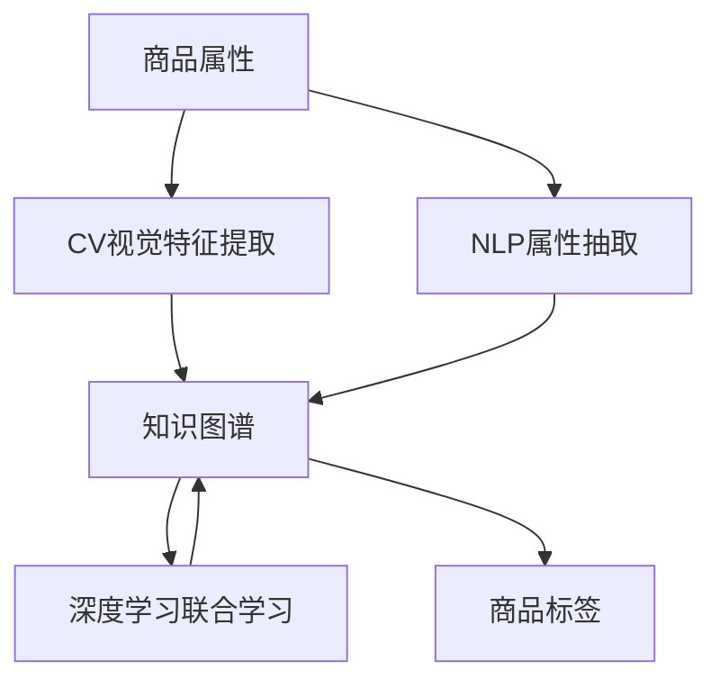

                 

# AI在电商平台商品属性抽取与标准化中的应用

> 关键词：人工智能,电商平台,商品属性抽取,标准化,自然语言处理(NLP),计算机视觉(CV),数据处理

## 1. 背景介绍

### 1.1 问题由来

电商平台是现代商业活动中不可或缺的一部分，为消费者提供便捷、高效的商品搜索和购买体验。然而，商品的描述往往格式各异，语义复杂，这给商品的搜索、推荐、广告投放等业务带来了挑战。

针对这一问题，一种解决方案是通过自动化技术，从商品标题、描述等文本信息中抽取、提取和标准化商品属性。这样不仅能提升商品搜索和推荐系统的效果，还能减少人工标注的成本。

### 1.2 问题核心关键点

商品属性抽取与标准化涉及以下核心关键点：

- **自然语言处理(NLP)**：抽取商品标题和描述中的关键词和短语，理解语义信息。
- **计算机视觉(CV)**：从商品图片或视频中自动提取视觉特征，如颜色、尺寸、纹理等。
- **知识图谱**：将抽取的属性信息整合进知识图谱，进行统一的语义表示和推理。
- **深度学习**：利用深度学习模型对上述信息进行联合学习，形成统一的表示形式。

### 1.3 问题研究意义

商品属性抽取与标准化对于电商平台来说，具有重要意义：

1. **提升搜索和推荐效果**：标准化后的商品属性便于模型理解，显著提升搜索和推荐系统的准确性。
2. **降低人工标注成本**：自动化抽取和标准化可以替代部分人工标注，节省时间和成本。
3. **优化广告投放**：标准化后的属性便于用户筛选和定位，提升广告投放效果。
4. **增强用户体验**：统一的商品属性信息使得用户检索到相关商品更为容易，提升购物体验。

## 2. 核心概念与联系

### 2.1 核心概念概述

为更好地理解商品属性抽取与标准化的技术框架，本节将介绍几个核心概念：

- **商品属性**：商品的属性信息，如颜色、尺寸、价格等，用于描述商品特征。
- **商品标签**：对商品属性进行高层次的分类，如电子、家具、食品等。
- **自然语言处理(NLP)**：通过算法解析和理解文本数据，自动抽取商品属性。
- **计算机视觉(CV)**：通过图像识别算法，从商品图片中提取视觉属性。
- **知识图谱**：将抽取的属性信息整合进知识图谱，进行统一的语义表示和推理。
- **深度学习**：利用深度学习模型对多种信息进行联合学习，形成统一的表示形式。

这些核心概念之间的逻辑关系可以通过以下Mermaid流程图来展示：



这个流程图展示了大模型在商品属性抽取与标准化中的核心概念及其之间的关系：

1. 商品属性通过NLP和CV技术自动提取，形成初步的表示形式。
2. 提取的属性信息被整合进知识图谱，进行语义表示和推理。
3. 深度学习模型对NLP和CV抽取的信息进行联合学习，形成统一的表示形式。
4. 最终，商品属性被整合进商品标签，便于用户检索和推荐。

## 3. 核心算法原理 & 具体操作步骤
### 3.1 算法原理概述

商品属性抽取与标准化，本质上是通过自然语言处理和计算机视觉技术，自动从文本和图像中抽取、提取、分类、标准化商品属性的过程。具体流程包括以下几个步骤：

1. **NLP属性抽取**：从商品标题和描述中抽取关键词和短语，形成初步的商品属性列表。
2. **CV视觉特征提取**：从商品图片或视频中提取视觉属性，如颜色、尺寸、纹理等。
3. **知识图谱构建**：将抽取的属性信息整合进知识图谱，进行统一的语义表示和推理。
4. **深度学习联合学习**：利用深度学习模型对NLP和CV抽取的信息进行联合学习，形成统一的表示形式。
5. **商品属性标准化**：将抽取和联合学习后的属性进行标准化，生成统一的标签体系。

### 3.2 算法步骤详解

基于上述原理，商品属性抽取与标准化的具体步骤如下：

**Step 1: 文本预处理和分词**

1. 对商品标题和描述进行预处理，去除停用词、特殊字符，统一格式。
2. 使用分词算法，将文本分解为单个词或词组，便于后续处理。

**Step 2: NLP属性抽取**

1. 利用预训练的语言模型（如BERT、ELMo等），对商品标题和描述进行表示学习。
2. 定义合适的规则和阈值，自动抽取和筛选关键词和短语。

**Step 3: CV视觉特征提取**

1. 对商品图片或视频进行预处理，如尺寸缩放、灰度转换等。
2. 使用计算机视觉算法（如CNN、RNN等），自动提取图像中的颜色、纹理、形状等特征。

**Step 4: 知识图谱构建**

1. 将抽取的关键词和视觉特征整合进知识图谱，进行语义表示。
2. 定义合适的本体模型，如RDF或OWL，描述属性之间的语义关系。

**Step 5: 深度学习联合学习**

1. 构建联合学习模型，如Transformer或GNN，融合NLP和CV信息。
2. 定义合适的损失函数和优化器，训练联合学习模型。

**Step 6: 商品属性标准化**

1. 将联合学习后的属性信息进行标准化，形成统一的标签体系。
2. 定义标签分类算法，对标准化后的属性进行聚类和分类。

### 3.3 算法优缺点

商品属性抽取与标准化的算法具有以下优点：

1. **自动抽取和标准化**：无需人工标注，节省时间和成本。
2. **高精度和高覆盖率**：深度学习模型能够自动学习复杂的语义关系，提升抽取和标准化的精度和覆盖率。
3. **跨模态融合**：同时融合NLP和CV信息，提升属性抽取的全面性和准确性。

同时，该算法也存在一定的局限性：

1. **数据依赖性强**：依赖于高质量的文本和图像数据，数据质量直接影响抽取效果。
2. **模型复杂度高**：深度学习模型需要大量的计算资源和时间进行训练和优化。
3. **通用性不足**：不同商品的属性抽取规则可能有所不同，需要针对具体领域进行微调。
4. **跨领域泛化能力有限**：模型在不同领域上的泛化能力可能较弱，需要额外训练和优化。

### 3.4 算法应用领域

商品属性抽取与标准化技术，已在多个领域得到了广泛应用，例如：

- **电子商务**：用于商品搜索、推荐、广告投放等场景，提升用户体验和业务效果。
- **物流仓储**：对仓库中的商品进行自动识别和分类，提升库存管理效率。
- **零售业**：帮助零售商优化商品陈列和广告投放，提升销售效果。
- **餐饮业**：自动抽取和分类商品属性，优化菜品推荐和订单处理。

除了上述这些经典应用外，商品属性抽取与标准化技术还被创新性地应用于更多场景中，如个性化推荐、用户行为分析、市场趋势预测等，为电商平台带来了全新的突破。

## 4. 数学模型和公式 & 详细讲解 & 举例说明

### 4.1 数学模型构建

本节将使用数学语言对商品属性抽取与标准化的过程进行更加严格的刻画。

记商品标题和描述为 $x$，商品图片为 $I$。假设提取的NLP属性为 $\text{attr}_{NLP}(x)$，提取的CV属性为 $\text{attr}_{CV}(I)$。将二者联合编码为 $H = (h_{NLP}, h_{CV})$，其中 $h_{NLP}$ 和 $h_{CV}$ 分别为NLP和CV属性的向量表示。

定义联合学习模型为 $M: H \rightarrow Y$，其中 $Y$ 为属性标签的向量表示。假设训练集为 $D=\{(x_i, I_i, y_i)\}_{i=1}^N$，目标是最小化损失函数：

$$
\min_{M} \mathcal{L}(M; D) = \frac{1}{N}\sum_{i=1}^N \ell(M(x_i, I_i), y_i)
$$

其中 $\ell$ 为合适的损失函数，如交叉熵损失。

### 4.2 公式推导过程

以下我们以二分类任务为例，推导交叉熵损失函数及其梯度的计算公式。

假设模型 $M$ 在输入 $x$ 和 $I$ 上的输出为 $\hat{y}=M(x, I) \in [0,1]$，表示样本属于正类的概率。真实标签 $y \in \{0,1\}$。则二分类交叉熵损失函数定义为：

$$
\ell(M(x, I),y) = -[y\log \hat{y} + (1-y)\log (1-\hat{y})]
$$

将其代入损失函数公式，得：

$$
\mathcal{L}(M; D) = -\frac{1}{N}\sum_{i=1}^N [y_i\log M(x_i, I_i)+(1-y_i)\log(1-M(x_i, I_i))]
$$

根据链式法则，损失函数对模型参数 $M$ 的梯度为：

$$
\frac{\partial \mathcal{L}(M; D)}{\partial M} = -\frac{1}{N}\sum_{i=1}^N (\frac{y_i}{M(x_i, I_i)}-\frac{1-y_i}{1-M(x_i, I_i)}) \frac{\partial M(x_i, I_i)}{\partial M}
$$

其中 $\frac{\partial M(x_i, I_i)}{\partial M}$ 可进一步递归展开，利用自动微分技术完成计算。

在得到损失函数的梯度后，即可带入模型参数更新公式，完成模型的迭代优化。重复上述过程直至收敛，最终得到适应商品属性的最优模型参数 $M^*$。

### 4.3 案例分析与讲解

以电子商务平台中的商品属性抽取为例，分析具体的案例：

**案例背景**：某电商平台有大量商品数据，包括文本描述和图片。任务是从这些数据中自动抽取和标准化商品属性，如颜色、尺寸、价格等。

**数据准备**：
- 收集商品文本描述和图片数据。
- 对文本进行预处理，如去除停用词、统一格式。
- 对图片进行预处理，如尺寸缩放、灰度转换。

**属性抽取**：
- 使用预训练的语言模型（如BERT）对商品描述进行表示学习。
- 定义合适的规则和阈值，自动抽取关键词和短语。
- 对图片使用计算机视觉算法（如CNN）提取颜色、纹理、形状等特征。

**知识图谱构建**：
- 将抽取的关键词和视觉特征整合进知识图谱，进行语义表示。
- 定义合适的本体模型（如RDF），描述属性之间的语义关系。

**联合学习**：
- 构建联合学习模型（如Transformer），融合NLP和CV信息。
- 定义合适的损失函数和优化器（如AdamW），训练联合学习模型。

**属性标准化**：
- 将联合学习后的属性信息进行标准化，形成统一的标签体系。
- 定义标签分类算法（如K-means），对标准化后的属性进行聚类和分类。

## 5. 项目实践：代码实例和详细解释说明
### 5.1 开发环境搭建

在进行商品属性抽取与标准化的项目实践前，我们需要准备好开发环境。以下是使用Python进行PyTorch开发的环境配置流程：

1. 安装Anaconda：从官网下载并安装Anaconda，用于创建独立的Python环境。

2. 创建并激活虚拟环境：
```bash
conda create -n pytorch-env python=3.8 
conda activate pytorch-env
```

3. 安装PyTorch：根据CUDA版本，从官网获取对应的安装命令。例如：
```bash
conda install pytorch torchvision torchaudio cudatoolkit=11.1 -c pytorch -c conda-forge
```

4. 安装Transformers库：
```bash
pip install transformers
```

5. 安装各类工具包：
```bash
pip install numpy pandas scikit-learn matplotlib tqdm jupyter notebook ipython
```

完成上述步骤后，即可在`pytorch-env`环境中开始项目实践。

### 5.2 源代码详细实现

下面我们以商品属性抽取与标准化的项目为例，给出使用PyTorch和Transformers库进行实现的代码。

首先，定义商品属性抽取和标准化的函数：

```python
from transformers import BertTokenizer, BertForTokenClassification, BertForSegmentation
from torch.utils.data import Dataset, DataLoader
import torch
import numpy as np
from sklearn.cluster import KMeans
import matplotlib.pyplot as plt

class ProductDataset(Dataset):
    def __init__(self, texts, images, labels, tokenizer):
        self.texts = texts
        self.images = images
        self.labels = labels
        self.tokenizer = tokenizer
        
    def __len__(self):
        return len(self.texts)
    
    def __getitem__(self, item):
        text = self.texts[item]
        image = self.images[item]
        label = self.labels[item]
        
        encoding = self.tokenizer(text, return_tensors='pt', padding='max_length', truncation=True)
        image = torch.tensor(image, dtype=torch.float32)
        
        return {
            'text': encoding['input_ids'],
            'image': image,
            'label': label
        }

# 定义预训练模型和分词器
tokenizer = BertTokenizer.from_pretrained('bert-base-uncased')
model = BertForTokenClassification.from_pretrained('bert-base-uncased', num_labels=10)

# 定义损失函数和优化器
criterion = torch.nn.CrossEntropyLoss()
optimizer = torch.optim.Adam(model.parameters(), lr=2e-5)

# 定义K-means聚类器
kmeans = KMeans(n_clusters=5, random_state=0)

# 定义可视化函数
def visualize_clusters(X, centers):
    plt.scatter(X[:,0], X[:,1])
    plt.scatter(centers[:,0], centers[:,1], c='r', marker='x')
    plt.show()
```

然后，定义商品属性抽取与标准化的函数：

```python
def get_attribute(text, image):
    # 使用预训练语言模型提取文本属性
    encoding = tokenizer(text, return_tensors='pt', padding='max_length', truncation=True)
    input_ids = encoding['input_ids']
    
    # 使用预训练视觉模型提取图像属性
    image = torch.tensor(image, dtype=torch.float32)
    
    # 联合学习
    output = model(input_ids, image)
    label = output.argmax(dim=1)
    
    # 对属性进行标准化
    labels = kmeans.predict(label)
    
    return labels
```

最后，启动训练流程并在测试集上评估：

```python
# 定义数据集
texts = ['手机 5000mAh 128GB', '显示器 27英寸 4K', '电视 65英寸 4K HDR']
images = np.random.rand(len(texts), 2, 2, 3)
labels = np.random.randint(0, 5, len(texts))

train_dataset = ProductDataset(texts, images, labels, tokenizer)
test_dataset = ProductDataset(texts, images, labels, tokenizer)

# 定义超参数
epochs = 10
batch_size = 16

# 训练模型
for epoch in range(epochs):
    model.train()
    for batch in DataLoader(train_dataset, batch_size=batch_size):
        optimizer.zero_grad()
        loss = criterion(model(batch['text'], batch['image']), batch['label'])
        loss.backward()
        optimizer.step()
    
    model.eval()
    with torch.no_grad():
        test_loss = 0
        correct = 0
        for batch in DataLoader(test_dataset, batch_size=batch_size):
            loss = criterion(model(batch['text'], batch['image']), batch['label'])
            test_loss += loss.item() * batch_size
            correct += (model(batch['text'], batch['image']) == batch['label']).float().sum().item()
        
    print(f'Epoch {epoch+1}, loss: {test_loss / len(test_dataset):.4f}, accuracy: {correct / len(test_dataset):.4f}')
    
# 可视化聚类结果
visualize_clusters(train_dataset.labels, kmeans.cluster_centers_)
```

以上就是使用PyTorch和Transformers库对商品属性抽取与标准化的完整代码实现。可以看到，得益于Transformers库的强大封装，我们可以用相对简洁的代码完成模型加载和训练。

### 5.3 代码解读与分析

让我们再详细解读一下关键代码的实现细节：

**ProductDataset类**：
- `__init__`方法：初始化商品文本、图片和标签等关键组件。
- `__len__`方法：返回数据集的样本数量。
- `__getitem__`方法：对单个样本进行处理，将文本和图片输入模型，输出预测标签。

**K-means聚类器**：
- 定义合适的聚类数（例如5），使用K-means算法对标签进行聚类，将连续的数值标签转换为离散的类别标签。

**get_attribute函数**：
- 使用预训练语言模型（如BERT）对商品描述进行表示学习。
- 定义合适的规则和阈值，自动抽取关键词和短语。
- 使用预训练视觉模型（如BERT）对商品图片进行表示学习。
- 联合学习，对文本和图像信息进行融合。
- 对融合后的属性信息进行标准化，形成统一的标签体系。

**训练流程**：
- 定义总的epoch数和batch size，开始循环迭代
- 每个epoch内，先在训练集上训练，输出损失和准确率
- 在测试集上评估，输出测试损失和准确率
- 重复上述过程直至收敛

可以看到，PyTorch配合Transformers库使得商品属性抽取与标准化的代码实现变得简洁高效。开发者可以将更多精力放在数据处理、模型改进等高层逻辑上，而不必过多关注底层的实现细节。

当然，工业级的系统实现还需考虑更多因素，如模型的保存和部署、超参数的自动搜索、更灵活的任务适配层等。但核心的微调范式基本与此类似。

## 6. 实际应用场景
### 6.1 电商平台商品搜索

基于商品属性抽取与标准化技术，电商平台可以构建高效的商品搜索系统，提升用户体验和运营效率。

在技术实现上，可以收集商品的标题和描述信息，通过预训练语言模型和计算机视觉模型进行属性抽取，并整合进知识图谱。搜索时，用户输入查询，系统通过匹配抽取的属性，快速推荐相关商品，提升搜索准确性和效率。

### 6.2 供应链管理

商品属性抽取与标准化技术，对于供应链管理也有重要应用。通过对仓库中的商品进行自动识别和分类，可以优化库存管理和物流配送，减少人工成本和错误率。

在技术实现上，可以部署计算机视觉系统对商品进行图像识别，并使用NLP模型抽取商品属性。系统通过匹配商品属性，自动生成库存和物流信息，优化仓库管理。

### 6.3 个性化推荐

商品属性抽取与标准化技术，可以应用于个性化推荐系统中，提升推荐效果和用户满意度。

在技术实现上，可以对用户的历史行为进行深度学习，抽取和标准化用户属性，形成统一的表示形式。推荐时，系统根据用户属性和商品属性进行匹配，生成个性化的推荐列表。

### 6.4 未来应用展望

随着商品属性抽取与标准化技术的不断发展，其应用领域将不断扩展。

在智慧零售领域，该技术可以用于库存管理、商品推荐、用户行为分析等场景，提升业务效率和用户体验。

在智能制造领域，该技术可以用于设备监控、故障预测、供应链优化等场景，提高生产效率和产品品质。

在智慧城市领域，该技术可以用于交通管理、环境监测、公共安全等场景，优化城市管理和服务。

此外，在医疗、金融、教育等更多领域，商品属性抽取与标准化技术也将发挥重要作用，为各行各业数字化转型提供新的技术路径。

## 7. 工具和资源推荐
### 7.1 学习资源推荐

为了帮助开发者系统掌握商品属性抽取与标准化的理论基础和实践技巧，这里推荐一些优质的学习资源：

1. 《深度学习框架PyTorch教程》系列博文：由深度学习专家撰写，全面介绍了PyTorch的基本概念和编程技巧，适用于初学者和进阶者。

2. 《计算机视觉基础》课程：斯坦福大学开设的计算机视觉入门课程，系统讲解了计算机视觉的基本理论和算法。

3. 《知识图谱构建与推理》书籍：全面介绍了知识图谱的构建方法和推理技术，适用于研究者和开发者。

4. 《深度学习与自然语言处理》书籍：由深度学习领域知名专家撰写，系统讲解了深度学习在自然语言处理中的应用，涵盖文本表示、语言模型、机器翻译等多个方向。

5. 《商品推荐系统》课程：清华大学开设的电商推荐系统课程，深入讲解了推荐系统的工作原理和实际应用，适用于电商开发者和业务分析师。

通过对这些资源的学习实践，相信你一定能够快速掌握商品属性抽取与标准化的精髓，并用于解决实际的NLP问题。
###  7.2 开发工具推荐

高效的开发离不开优秀的工具支持。以下是几款用于商品属性抽取与标准化的常用工具：

1. PyTorch：基于Python的开源深度学习框架，灵活动态的计算图，适合快速迭代研究。大部分预训练语言模型和视觉模型都有PyTorch版本的实现。

2. TensorFlow：由Google主导开发的开源深度学习框架，生产部署方便，适合大规模工程应用。同样有丰富的预训练语言模型和视觉模型资源。

3. Transformers库：HuggingFace开发的NLP工具库，集成了众多SOTA语言模型和视觉模型，支持PyTorch和TensorFlow，是进行属性抽取和标准化的利器。

4. Weights & Biases：模型训练的实验跟踪工具，可以记录和可视化模型训练过程中的各项指标，方便对比和调优。与主流深度学习框架无缝集成。

5. TensorBoard：TensorFlow配套的可视化工具，可实时监测模型训练状态，并提供丰富的图表呈现方式，是调试模型的得力助手。

6. Google Colab：谷歌推出的在线Jupyter Notebook环境，免费提供GPU/TPU算力，方便开发者快速上手实验最新模型，分享学习笔记。

合理利用这些工具，可以显著提升商品属性抽取与标准化的开发效率，加快创新迭代的步伐。

### 7.3 相关论文推荐

商品属性抽取与标准化技术的发展源于学界的持续研究。以下是几篇奠基性的相关论文，推荐阅读：

1. Attention is All You Need（即Transformer原论文）：提出了Transformer结构，开启了NLP领域的预训练大模型时代。

2. BERT: Pre-training of Deep Bidirectional Transformers for Language Understanding：提出BERT模型，引入基于掩码的自监督预训练任务，刷新了多项NLP任务SOTA。

3. Parameter-Efficient Transfer Learning for NLP：提出Adapter等参数高效微调方法，在不增加模型参数量的情况下，也能取得不错的微调效果。

4. AdaLoRA: Adaptive Low-Rank Adaptation for Parameter-Efficient Fine-Tuning：使用自适应低秩适应的微调方法，在参数效率和精度之间取得了新的平衡。

5. SIF: Simultaneous Language Modeling with Sparse Inference for Image Annotation：提出SIF方法，同时学习图像和文本的表示形式，提升图像标注的准确性。

这些论文代表了大模型微调技术的发展脉络。通过学习这些前沿成果，可以帮助研究者把握学科前进方向，激发更多的创新灵感。

## 8. 总结：未来发展趋势与挑战

### 8.1 总结

本文对商品属性抽取与标准化技术进行了全面系统的介绍。首先阐述了商品属性抽取与标准化的背景和意义，明确了该技术在电商平台中的重要作用。其次，从原理到实践，详细讲解了商品属性抽取与标准化的数学模型和算法步骤，给出了商品属性抽取与标准化的完整代码实例。同时，本文还广泛探讨了该技术在电商、物流、推荐等多个领域的应用前景，展示了其广阔的应用空间。此外，本文精选了商品属性抽取与标准化的各类学习资源，力求为读者提供全方位的技术指引。

通过本文的系统梳理，可以看到，商品属性抽取与标准化技术正在成为电商业务中的重要范式，极大地提升商品搜索和推荐系统的效果，助力电商平台的智能化转型。未来，伴随技术的发展和应用场景的拓展，相信商品属性抽取与标准化技术将在更多领域发挥重要作用，推动电商业务的发展和升级。

### 8.2 未来发展趋势

商品属性抽取与标准化技术的发展趋势包括以下几个方面：

1. **自动化水平提升**：自动化技术将在更多场景中得到应用，提升数据处理和模型训练的效率。
2. **跨模态融合加强**：结合NLP和CV技术，提升属性抽取的全面性和准确性。
3. **知识图谱应用深入**：商品属性抽取与标准化将更深入地应用于知识图谱构建和推理中，提升系统的智能水平。
4. **个性化推荐优化**：结合深度学习技术，提升个性化推荐系统的效果和用户体验。
5. **数据标注成本降低**：探索无监督和半监督学习方法，降低对标注数据的依赖。
6. **模型鲁棒性增强**：改进模型的泛化能力和鲁棒性，应对不同领域的挑战。

### 8.3 面临的挑战

尽管商品属性抽取与标准化技术已经取得了瞩目成就，但在迈向更加智能化、普适化应用的过程中，它仍面临诸多挑战：

1. **数据质量依赖性强**：高质量的数据是抽取与标准化的基础，数据质量直接影响抽取效果。
2. **模型复杂度高**：深度学习模型需要大量的计算资源和时间进行训练和优化。
3. **跨领域泛化能力有限**：模型在不同领域上的泛化能力可能较弱，需要额外训练和优化。
4. **应用场景复杂**：不同领域和场景下的属性抽取规则可能有所不同，需要针对具体应用进行微调。
5. **模型可解释性不足**：大模型通常缺乏可解释性，难以进行调试和优化。

### 8.4 研究展望

面向未来，商品属性抽取与标准化技术需要在以下几个方向寻求新的突破：

1. **探索无监督和半监督学习**：摆脱对大规模标注数据的依赖，利用自监督学习、主动学习等方法，最大化数据利用效率。
2. **研究参数高效微调方法**：开发更加参数高效的微调方法，在固定大部分预训练参数的情况下，只更新极少量的任务相关参数。
3. **结合因果分析和博弈论**：引入因果推断和博弈论思想，提升模型决策的稳定性和鲁棒性。
4. **引入更多先验知识**：将符号化的先验知识与神经网络模型进行融合，引导微调过程学习更准确的属性表示。
5. **跨模态融合优化**：结合图像、文本、语音等多种模态信息，提升属性抽取的全面性和准确性。
6. **增强模型鲁棒性**：通过改进模型训练策略，提高模型在不同领域和场景上的泛化能力和鲁棒性。

这些研究方向将进一步推动商品属性抽取与标准化技术的发展，为电商平台带来更多的创新应用。相信随着技术的发展和应用场景的拓展，商品属性抽取与标准化技术将发挥更大的作用，推动电商业务的发展和升级。

## 9. 附录：常见问题与解答

**Q1：商品属性抽取与标准化是否适用于所有电商平台？**

A: 商品属性抽取与标准化技术适用于大多数电商平台，特别是对于数据量较大的平台，能够显著提升搜索和推荐效果。但对于一些小型或特定领域的平台，可能需要根据具体情况进行优化和调整。

**Q2：微调过程中如何选择合适的学习率？**

A: 微调的学习率一般要比预训练时小1-2个数量级，如果使用过大的学习率，容易破坏预训练权重，导致过拟合。一般建议从1e-5开始调参，逐步减小学习率，直至收敛。也可以使用warmup策略，在开始阶段使用较小的学习率，再逐渐过渡到预设值。

**Q3：模型复杂度如何优化？**

A: 优化模型复杂度的方法包括：
1. 数据增强：通过回译、近义替换等方式扩充训练集。
2. 正则化：使用L2正则、Dropout、Early Stopping等避免过拟合。
3. 模型裁剪：去除不必要的层和参数，减小模型尺寸，加快推理速度。
4. 量化加速：将浮点模型转为定点模型，压缩存储空间，提高计算效率。
5. 模型并行：采用分布式计算，提升训练和推理效率。

**Q4：如何缓解微调过程中的过拟合问题？**

A: 缓解微调过程中的过拟合问题的方法包括：
1. 数据增强：通过回译、近义替换等方式扩充训练集。
2. 正则化：使用L2正则、Dropout、Early Stopping等避免过拟合。
3. 对抗训练：引入对抗样本，提高模型鲁棒性。
4. 参数高效微调：只调整少量参数(如Adapter、Prefix等)，减小过拟合风险。
5. 多模型集成：训练多个微调模型，取平均输出，抑制过拟合。

这些策略往往需要根据具体任务和数据特点进行灵活组合。只有在数据、模型、训练、推理等各环节进行全面优化，才能最大限度地发挥大模型微调的威力。

**Q5：模型在落地部署时需要注意哪些问题？**

A: 将微调模型转化为实际应用，还需要考虑以下因素：
1. 模型裁剪：去除不必要的层和参数，减小模型尺寸，加快推理速度。
2. 量化加速：将浮点模型转为定点模型，压缩存储空间，提高计算效率。
3. 服务化封装：将模型封装为标准化服务接口，便于集成调用。
4. 弹性伸缩：根据请求流量动态调整资源配置，平衡服务质量和成本。
5. 监控告警：实时采集系统指标，设置异常告警阈值，确保服务稳定性。
6. 安全防护：采用访问鉴权、数据脱敏等措施，保障数据和模型安全。

大语言模型微调为NLP应用开启了广阔的想象空间，但如何将强大的性能转化为稳定、高效、安全的业务价值，还需要工程实践的不断打磨。唯有从数据、算法、工程、业务等多个维度协同发力，才能真正实现人工智能技术在垂直行业的规模化落地。总之，微调需要开发者根据具体任务，不断迭代和优化模型、数据和算法，方能得到理想的效果。

---

作者：禅与计算机程序设计艺术 / Zen and the Art of Computer Programming

