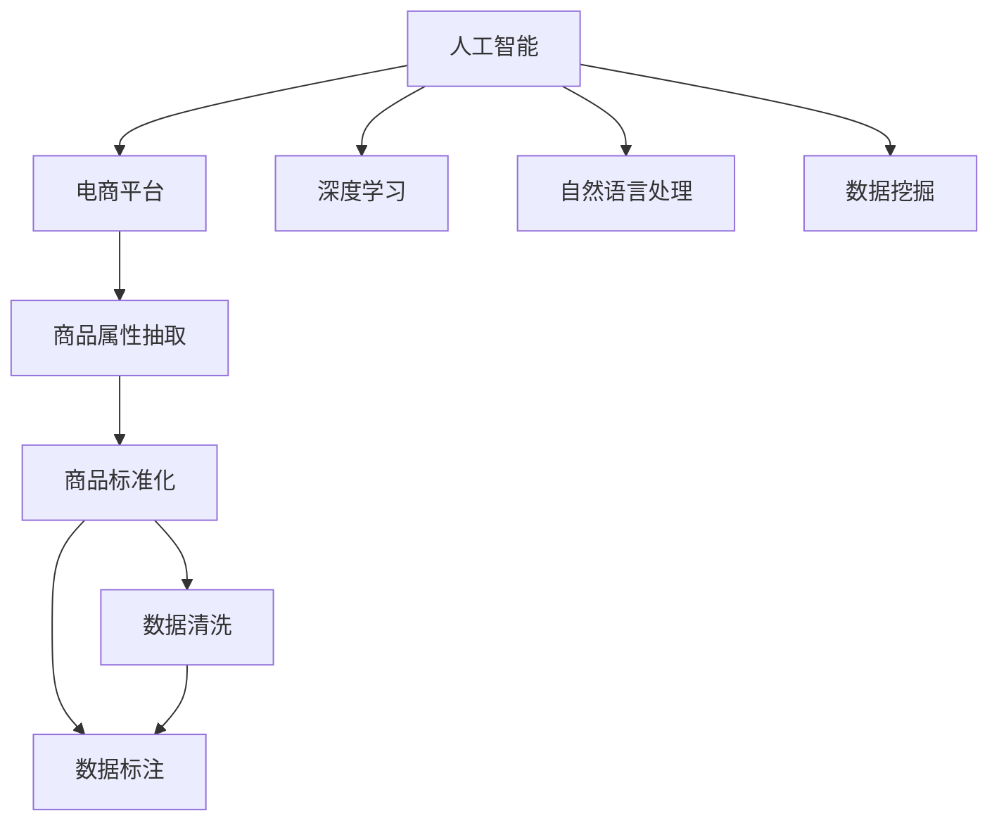

                 

# AI在电商平台商品属性抽取与标准化中的应用

> 关键词：人工智能, 电商平台, 商品属性抽取, 标准化, 数据挖掘, 自然语言处理, 深度学习, 深度学习架构, 数据清洗, 数据标注, 训练集, 测试集, 机器学习, 神经网络

## 1. 背景介绍

### 1.1 问题由来
在电商领域，商品属性的准确抽取和标准化对于提高搜索、推荐和广告等业务的效率和精准性具有重要意义。然而，传统的商品属性抽取方法依赖于人工标注，不仅耗时耗力，还容易产生主观偏差。而通过人工智能技术，尤其是深度学习和自然语言处理(NLP)技术，可以大幅提升商品属性抽取的自动化和标准化水平，从而提升电商平台的运营效率和用户体验。

近年来，随着深度学习模型的快速发展，基于神经网络的商品属性抽取和标准化方法已经成为了学术界和工业界的关注焦点。本文将深入探讨AI技术在电商平台商品属性抽取与标准化中的应用，详细讲解其实现原理和操作步骤，并结合实际案例进行分析和演示。

## 2. 核心概念与联系

### 2.1 核心概念概述

为更好地理解AI在电商平台商品属性抽取与标准化中的应用，本节将介绍几个密切相关的核心概念：

- **人工智能（Artificial Intelligence, AI）**：利用算法和模型对现实世界数据进行处理和分析，以实现智能化的决策和行为。
- **电商平台（E-commerce Platform）**：以互联网为平台，基于第三方支付和物流服务，实现商品销售的电子化平台。
- **商品属性抽取（Product Attribute Extraction）**：从商品描述或信息中自动抽取关键属性，如尺寸、颜色、价格等。
- **商品标准化（Product Standardization）**：将抽取出的商品属性进行规范化处理，确保同一商品的描述在电商平台中具有一致性。
- **深度学习（Deep Learning）**：一种基于多层神经网络的机器学习技术，通过学习大量数据中的复杂模式，实现自动化的特征提取和分类任务。
- **自然语言处理（Natural Language Processing, NLP）**：研究计算机如何理解和生成自然语言的技术，主要应用于文本处理和语义分析。
- **数据挖掘（Data Mining）**：从大量数据中发现和提取有价值的信息和知识，常用于商业智能和决策支持。

这些核心概念之间的逻辑关系可以通过以下Mermaid流程图来展示：



这个流程图展示了AI技术在电商平台商品属性抽取与标准化中的应用逻辑：

1. 人工智能作为整个流程的核心技术，基于深度学习、自然语言处理等子技术实现对商品属性和标准的抽取与处理。
2. 深度学习用于提取商品属性，通过构建多层神经网络，从商品描述中学习特征并进行分类。
3. 自然语言处理用于文本预处理，包括分词、去除停用词、词性标注等步骤，提高模型的理解和表达能力。
4. 数据挖掘用于数据探索，通过挖掘大量商品数据中的规律和模式，提升模型的泛化能力。
5. 商品属性抽取的结果需要通过数据清洗和标注进行进一步处理，确保属性信息的准确性和一致性。
6. 最终，商品属性通过标准化处理，实现跨平台的数据兼容性和系统整合。

这些概念共同构成了AI在电商平台商品属性抽取与标准化中的应用框架，使其能够实现高效、精准的自动化处理。

## 3. 核心算法原理 & 具体操作步骤
### 3.1 算法原理概述

基于AI的商品属性抽取和标准化方法，本质上是一个深度学习模型在特定任务上的训练过程。其核心思想是：利用深度学习模型从商品描述中自动学习并抽取属性信息，并对这些信息进行标准化处理，以便于电商平台的系统整合和信息共享。

形式化地，假设商品描述为 $X$，其属性标注为 $Y$。商品属性抽取的目标是找到函数 $f$，使得 $f(X) = Y$，即模型能够将输入的商品描述映射为正确的属性标注。

通过深度学习模型对大量标注数据进行训练，可以学习到准确的映射函数 $f$。而商品标准化则是在属性抽取的基础上，对模型输出的属性信息进行进一步处理，确保不同来源的商品描述在平台中具有一致性。

### 3.2 算法步骤详解

基于AI的商品属性抽取和标准化方法一般包括以下几个关键步骤：

**Step 1: 数据预处理**

1. **数据收集**：从电商平台的商品描述、评论、评分等文本数据中，收集所有商品的属性信息。确保数据集的覆盖面广且包含大量标注样本。

2. **数据清洗**：去除噪音数据、拼写错误、语法错误等，确保数据集的质量和一致性。

3. **数据标注**：对每个商品描述进行属性标注，标注形式可以是属性-值对，如“尺寸：45cm”。标注工作可以由人工完成，也可以借助半监督学习等方法自动标注。

4. **数据集划分**：将标注数据集划分为训练集和测试集，通常训练集占80%，测试集占20%。

**Step 2: 模型构建**

1. **选择模型**：根据任务特点和数据集大小，选择适合的深度学习模型，如卷积神经网络（CNN）、循环神经网络（RNN）或Transformer等。

2. **设计输入输出**：设计模型的输入为商品描述文本，输出为对应的属性标注序列。例如，对于“尺寸：45cm”，输入文本为“商品描述”，输出序列为[“尺寸”, “45cm”]。

3. **模型训练**：使用训练集数据对模型进行训练，调整模型参数以最小化损失函数。损失函数通常为交叉熵损失，衡量模型预测与真实标注之间的差异。

**Step 3: 模型评估**

1. **性能评估**：在测试集上评估模型的性能，计算准确率、召回率、F1分数等指标，判断模型是否达到预期效果。

2. **超参数调优**：根据模型评估结果，调整超参数如学习率、批大小、训练轮数等，进一步提升模型性能。

3. **模型验证**：在验证集上测试模型，避免模型过拟合训练集。

**Step 4: 属性标准化**

1. **标准化处理**：对模型输出的属性信息进行标准化处理，去除冗余、无意义的信息，确保属性值的规范性和一致性。

2. **构建标准化字典**：将标准化后的属性信息构建字典，存储常用属性及其值，以便于后续商品描述的标准化处理。

3. **系统集成**：将标准化后的属性信息集成到电商平台中，实现商品描述的标准化展示。

### 3.3 算法优缺点

基于AI的商品属性抽取和标准化方法具有以下优点：

1. **自动化高效**：利用深度学习模型自动从商品描述中抽取属性信息，减少了人工标注的工作量和主观偏差。

2. **精确度高**：通过大量标注数据训练的深度学习模型，具有较高的属性抽取精确度和泛化能力。

3. **适应性强**：可以处理不同商品描述的多样性，适应不同的电商平台和产品类别。

4. **实时性良好**：一旦模型训练完成，即可实时处理新的商品描述，快速生成标准化属性信息。

但同时，该方法也存在以下局限性：

1. **数据标注成本高**：高质量标注数据集的构建和维护需要大量时间和人力，成本较高。

2. **模型复杂度大**：深度学习模型结构复杂，训练和推理成本较高，需要较强的硬件支持和计算资源。

3. **泛化能力有限**：模型在特定领域或语境下的泛化能力可能不足，需要针对不同应用场景进行优化。

4. **依赖标注质量**：模型性能高度依赖标注数据的质量，标注错误或偏差可能导致模型输出不准确。

5. **数据隐私问题**：商品描述中可能包含敏感信息，如何保护用户隐私和数据安全是一个重要的伦理问题。

### 3.4 算法应用领域

基于AI的商品属性抽取和标准化方法在电商领域已经得到了广泛的应用，具体包括：

- **商品搜索**：通过抽取商品属性信息，提高商品搜索的精准性和召回率。
- **商品推荐**：根据商品属性，进行个性化推荐，提升用户购物体验。
- **广告投放**：对商品属性进行分析，优化广告投放策略，提高广告点击率和转化率。
- **库存管理**：通过属性标准化，实现商品信息的统一管理和库存动态更新。
- **客户服务**：自动化抽取和标准化商品属性，提升客户查询和售后服务的效率。

除了电商领域，基于AI的商品属性抽取和标准化技术还可以应用于零售、物流、制造等行业，提升全供应链的运营效率和数据一致性。

## 4. 数学模型和公式 & 详细讲解  
### 4.1 数学模型构建

本节将使用数学语言对基于AI的商品属性抽取和标准化过程进行更加严格的刻画。

记商品描述为 $X$，属性标注为 $Y$。假设模型为 $f_{\theta}$，其中 $\theta$ 为模型参数。目标是最小化损失函数 $\mathcal{L}$：

$$
\mathcal{L}(f_{\theta}, X, Y) = \frac{1}{N}\sum_{i=1}^N \ell(f_{\theta}(X_i), Y_i)
$$

其中 $\ell$ 为损失函数，通常为交叉熵损失：

$$
\ell(f_{\theta}(X_i), Y_i) = -\sum_{j=1}^M y_{ij}\log(f_{\theta}(X_i))_j
$$

$M$ 为属性数量，$y_{ij}$ 为第 $i$ 个样本的第 $j$ 个属性的标注值。模型输出的概率分布为：

$$
f_{\theta}(X) = \text{softmax}(\text{MLP}(\text{Embedding}(X)))
$$

其中 MLP 为多层感知机，$\text{Embedding}$ 为词嵌入层，将商品描述转换为高维向量，$\text{softmax}$ 函数用于将高维向量转换为概率分布。

### 4.2 公式推导过程

以CNN模型为例，推导商品属性抽取的数学模型。

假设商品描述 $X$ 被表示为词序列，即 $X = \{x_1, x_2, \ldots, x_n\}$。CNN模型由多个卷积层和池化层组成，模型输出的特征图 $F$ 可表示为：

$$
F = \{\text{Conv}(X), \text{Pool}(\text{Conv}(X)), \ldots, \text{Conv}(F_{k-1}), \text{Pool}(\text{Conv}(F_{k-1}))\}
$$

其中 $F_k$ 表示第 $k$ 层的特征图，$\text{Conv}$ 表示卷积操作，$\text{Pool}$ 表示池化操作。模型最终输出的概率分布 $P$ 为：

$$
P = \text{softmax}(\text{MLP}(F_K))
$$

其中 $MLP$ 为多层感知机，$F_K$ 为最后一层的特征图。

### 4.3 案例分析与讲解

假设电商平台的商品描述数据集如下：

|商品ID|商品描述|属性1|属性2|
|:---:|:---:|:---:|:---:|
|1|黑色男款运动鞋尺码42|颜色：黑色|尺码：42|
|2|红色女款针织衫尺码L|颜色：红色|尺码：L|
|3|蓝色男士手表尺寸44mm|颜色：蓝色|尺寸：44mm|

利用上述CNN模型，进行商品属性抽取的过程如下：

1. **模型训练**：首先，将商品描述数据集中的属性标注信息作为标签，构建训练集。将商品描述输入到CNN模型中，经过卷积层和池化层的提取和特征融合，得到特征图 $F$。通过多层感知机将特征图转换为概率分布 $P$，并使用交叉熵损失函数计算损失 $\mathcal{L}$。

2. **模型评估**：在测试集上，对模型进行性能评估，计算准确率、召回率和F1分数等指标，判断模型性能。

3. **模型验证**：在验证集上测试模型，避免模型过拟合训练集。

4. **属性标准化**：对模型输出的属性信息进行标准化处理，去除冗余、无意义的信息，确保属性值的规范性和一致性。

5. **系统集成**：将标准化后的属性信息集成到电商平台中，实现商品描述的标准化展示。

## 5. 项目实践：代码实例和详细解释说明
### 5.1 开发环境搭建

在进行项目实践前，我们需要准备好开发环境。以下是使用Python进行TensorFlow开发的环境配置流程：

1. 安装Anaconda：从官网下载并安装Anaconda，用于创建独立的Python环境。

2. 创建并激活虚拟环境：
```bash
conda create -n tf-env python=3.7 
conda activate tf-env
```

3. 安装TensorFlow：根据CUDA版本，从官网获取对应的安装命令。例如：
```bash
conda install tensorflow -c pytorch -c conda-forge
```

4. 安装Pandas、NumPy等工具包：
```bash
pip install pandas numpy scikit-learn matplotlib tensorflow-text
```

完成上述步骤后，即可在`tf-env`环境中开始项目实践。

### 5.2 源代码详细实现

这里我们以商品属性抽取的CNN模型为例，给出使用TensorFlow进行商品属性抽取的代码实现。

首先，定义CNN模型的超参数：

```python
import tensorflow as tf
from tensorflow.keras import layers

# 超参数设置
input_dim = 10000  # 输入维度，即词典大小
output_dim = 1000  # 输出维度，即属性数量
embedding_dim = 100  # 词嵌入维度
filter_sizes = [3, 4, 5]  # 卷积核大小
num_filters = 128  # 卷积核数量
dropout_rate = 0.5  # dropout比例
```

然后，定义CNN模型：

```python
# 构建CNN模型
model = tf.keras.Sequential()
model.add(layers.Embedding(input_dim, embedding_dim, input_length=input_length))
for filter_size in filter_sizes:
    model.add(layers.Conv1D(num_filters, filter_size, activation='relu'))
    model.add(layers.GlobalMaxPooling1D())
    model.add(layers.Dense(256, activation='relu'))
    model.add(layers.Dropout(dropout_rate))
model.add(layers.Dense(output_dim, activation='softmax'))

# 编译模型
model.compile(optimizer='adam', loss='categorical_crossentropy', metrics=['accuracy'])
```

接着，定义数据预处理函数：

```python
# 数据预处理
def preprocess_text(text):
    # 分词
    tokens = tokenizer.texts_to_sequences(text)
    # 填充
    padded_tokens = tf.keras.preprocessing.sequence.pad_sequences(tokens, maxlen=max_len, padding='post')
    # 编码
    encoded_tokens = tf.keras.preprocessing.sequence.one_hot(padded_tokens, num_words)
    return encoded_tokens
```

最后，定义训练和评估函数：

```python
# 训练函数
def train_model(model, train_data, validation_data, epochs):
    model.fit(train_data, train_labels, epochs=epochs, validation_data=(validation_data, validation_labels))
    return model

# 评估函数
def evaluate_model(model, test_data, test_labels):
    loss, accuracy = model.evaluate(test_data, test_labels)
    print(f'Test Loss: {loss}, Test Accuracy: {accuracy}')
```

完成上述代码后，即可在`tf-env`环境中开始模型训练和评估。

### 5.3 代码解读与分析

让我们再详细解读一下关键代码的实现细节：

**模型构建**：
- `Sequential` 模型：定义了多个层次的神经网络结构。
- `Embedding` 层：将商品描述转换为词嵌入向量。
- `Conv1D` 层：使用卷积核对词嵌入进行卷积操作，提取特征。
- `GlobalMaxPooling1D` 层：对卷积层的特征图进行全局池化，减少维度。
- `Dense` 层：全连接层，用于提取高级特征。
- `Dropout` 层：防止过拟合，随机丢弃部分神经元。
- `softmax` 函数：将输出转换为概率分布。

**数据预处理**：
- `tokenizer.texts_to_sequences` 方法：将文本转换为单词序列。
- `tf.keras.preprocessing.sequence.pad_sequences` 方法：对序列进行填充，保证每个样本的长度一致。
- `tf.keras.preprocessing.sequence.one_hot` 方法：将单词序列转换为独热编码，用于训练模型。

**训练和评估**：
- `model.fit` 方法：对模型进行训练，并指定训练集和验证集。
- `model.evaluate` 方法：在测试集上评估模型性能。

**训练流程**：
- 定义总轮数，开始循环迭代
- 每个epoch内，在训练集上训练，并在验证集上评估性能
- 所有epoch结束后，在测试集上评估，给出最终测试结果

可以看到，TensorFlow框架下，商品属性抽取的代码实现简洁高效，易于理解和调试。开发者可以根据具体任务需求，灵活调整模型结构和超参数，快速迭代实验结果。

当然，工业级的系统实现还需考虑更多因素，如模型的保存和部署、超参数的自动搜索、更灵活的任务适配层等。但核心的商品属性抽取方法基本与此类似。

## 6. 实际应用场景
### 6.1 商品搜索

基于商品属性抽取和标准化的AI技术，可以实现高效的商品搜索功能。用户可以通过输入关键词或描述，系统自动解析出商品的属性信息，并在搜索结果中优先展示符合条件的产品。例如，输入“运动鞋尺码42”，系统能够自动识别并展示所有尺寸为42的运动鞋，提升用户购物体验。

### 6.2 商品推荐

在商品推荐场景中，通过抽取商品属性，可以生成更加精准的用户画像，提升推荐系统的个性化推荐能力。例如，对于经常购买大码衣服的用户，系统可以自动标注其偏好属性，并推荐相关大码商品，提高转化率。

### 6.3 广告投放

在广告投放场景中，通过属性标准化，可以将商品信息转换为统一的标准格式，便于广告投放系统的精准投放。例如，通过标准化颜色、尺码等属性，系统能够更加精准地匹配用户的兴趣点，提高广告点击率和转化率。

### 6.4 库存管理

通过属性标准化，电商平台可以实现商品信息的统一管理和动态更新。例如，新入库的商品描述信息，经过属性抽取和标准化处理后，自动更新到库存系统中，实现实时库存管理。

### 6.5 客户服务

基于商品属性抽取和标准化的AI技术，可以自动解析用户查询，提升客户服务效率。例如，用户询问“这款运动鞋尺码是多少”，系统能够自动抽取属性信息，并提供尺码、颜色等相关信息，满足用户需求。

### 6.6 未来应用展望

随着AI技术的发展，基于商品属性抽取和标准化的应用将更加广泛，涵盖更多电商和零售场景。

在智慧零售领域，AI技术可以进一步优化供应链管理，提升库存周转率，降低运营成本。例如，通过分析用户购买行为，预测商品需求，实现智能补货和库存优化。

在智慧物流领域，AI技术可以提升物流配送的精准性和效率。例如，通过商品属性信息，系统能够自动化生成物流标签，实现智能分拣和配送。

在智慧制造领域，AI技术可以提升生产过程的智能化水平。例如，通过分析商品属性信息，优化生产流程，提高生产效率和产品质量。

未来，随着技术进步和数据积累，基于商品属性抽取和标准化的AI技术将变得更加成熟，广泛应用于全供应链的智能化管理，为电商和零售行业带来新的变革。

## 7. 工具和资源推荐
### 7.1 学习资源推荐

为了帮助开发者系统掌握AI在电商平台商品属性抽取与标准化中的应用，这里推荐一些优质的学习资源：

1. TensorFlow官方文档：提供详细的API文档和实例教程，帮助开发者快速上手TensorFlow框架。

2. Kaggle竞赛平台：提供大量公开的商品数据集和算法竞赛，帮助开发者进行数据探索和算法迭代。

3. Coursera《深度学习专项课程》：由深度学习领域的专家开设，涵盖深度学习基础和应用，适合初学者和进阶开发者。

4. Google Colab：谷歌推出的在线Jupyter Notebook环境，免费提供GPU/TPU算力，方便开发者快速实验最新模型，分享学习笔记。

5. PyTorch官方文档：提供详细的API文档和实例教程，帮助开发者快速上手PyTorch框架。

通过对这些资源的学习实践，相信你一定能够快速掌握AI在电商平台商品属性抽取与标准化中的应用，并用于解决实际的NLP问题。

### 7.2 开发工具推荐

高效的开发离不开优秀的工具支持。以下是几款用于商品属性抽取开发的常用工具：

1. TensorFlow：由Google主导开发的深度学习框架，生产部署方便，适合大规模工程应用。提供丰富的预训练模型和深度学习库。

2. PyTorch：由Facebook主导开发的深度学习框架，灵活高效，适合研究性开发。提供丰富的深度学习库和自然语言处理工具。

3. HuggingFace Transformers库：自然语言处理领域的领先库，集成了多个预训练语言模型，支持多种深度学习框架。

4. Google Colab：谷歌推出的在线Jupyter Notebook环境，免费提供GPU/TPU算力，方便开发者快速实验最新模型。

5. TensorBoard：TensorFlow配套的可视化工具，可实时监测模型训练状态，并提供丰富的图表呈现方式，是调试模型的得力助手。

合理利用这些工具，可以显著提升商品属性抽取任务的开发效率，加快创新迭代的步伐。

### 7.3 相关论文推荐

AI技术在电商平台商品属性抽取与标准化中的应用源于学界的持续研究。以下是几篇奠基性的相关论文，推荐阅读：

1. Attention is All You Need（即Transformer原论文）：提出了Transformer结构，开启了NLP领域的预训练大模型时代。

2. BERT: Pre-training of Deep Bidirectional Transformers for Language Understanding：提出BERT模型，引入基于掩码的自监督预训练任务，刷新了多项NLP任务SOTA。

3. Deep Learning for Natural Language Processing：深度学习领域的经典教材，涵盖深度学习基本原理和NLP应用。

4. Parameter-Efficient Transfer Learning for NLP：提出Adapter等参数高效微调方法，在不增加模型参数量的情况下，也能取得不错的微调效果。

5. Hierarchical Attention Networks for Document Classification：提出层次化注意力网络，提升文档分类的准确率。

这些论文代表了大语言模型微调技术的发展脉络。通过学习这些前沿成果，可以帮助研究者把握学科前进方向，激发更多的创新灵感。

## 8. 总结：未来发展趋势与挑战
### 8.1 总结

本文对AI在电商平台商品属性抽取与标准化中的应用进行了全面系统的介绍。首先阐述了AI技术在电商领域的应用背景和意义，明确了商品属性抽取和标准化的重要性和挑战。其次，从原理到实践，详细讲解了商品属性抽取的深度学习模型构建和训练过程，给出了代码实例和详细解释说明。同时，本文还广泛探讨了商品属性抽取在电商领域的实际应用场景，展示了AI技术的广阔前景。

通过本文的系统梳理，可以看到，基于AI的商品属性抽取和标准化方法在电商领域具有广泛的应用价值和实际意义，能够显著提升电商平台的运营效率和用户体验。未来，随着AI技术的发展和应用场景的扩展，商品属性抽取和标准化技术还将迎来更多的突破和创新。

### 8.2 未来发展趋势

展望未来，AI在电商平台商品属性抽取与标准化技术将呈现以下几个发展趋势：

1. **深度学习模型优化**：未来将开发更加高效、轻量级的深度学习模型，如MobileNet、EfficientNet等，进一步提升商品属性抽取的实时性和准确性。

2. **多模态信息融合**：结合图像、视频等多模态数据，提升商品属性抽取的准确性和泛化能力。例如，通过图像特征提取，进一步提高商品描述和属性抽取的准确度。

3. **跨领域迁移学习**：基于迁移学习的思路，将商品属性抽取技术应用于不同领域和场景，如医疗、金融等，提升通用性。

4. **模型解释性和可解释性**：引入可解释性技术，如LIME、SHAP等，提升模型的透明性和可信度，确保用户对AI决策的理解和信任。

5. **分布式计算**：利用分布式计算框架，如TensorFlow、PyTorch等，提升模型训练和推理的效率，适应大规模数据和实时任务的需求。

6. **自监督学习**：结合自监督学习的思想，利用未标注数据提升模型性能，降低标注成本。

以上趋势凸显了AI在电商平台商品属性抽取与标准化技术的前景广阔，为电商平台的智能化管理提供了新的思路和技术路径。

### 8.3 面临的挑战

尽管AI在电商平台商品属性抽取与标准化技术已经取得了瞩目成就，但在迈向更加智能化、普适化应用的过程中，它仍面临着诸多挑战：

1. **标注成本瓶颈**：高质量标注数据集的构建和维护需要大量时间和人力，成本较高。如何进一步降低标注成本，利用未标注数据提升模型性能，是一个重要的研究方向。

2. **模型泛化能力**：模型在特定领域或语境下的泛化能力可能不足，需要针对不同应用场景进行优化。如何在保持高精度的同时，提升模型的泛化能力，仍需深入研究。

3. **计算资源消耗**：深度学习模型结构复杂，训练和推理成本较高，需要较强的硬件支持和计算资源。如何降低模型复杂度，提升计算效率，是一个重要的优化方向。

4. **数据隐私问题**：商品描述中可能包含敏感信息，如何保护用户隐私和数据安全是一个重要的伦理问题。如何在确保数据隐私的前提下，提升模型性能，是一个亟待解决的问题。

5. **用户理解与接受度**：用户对AI技术的使用存在一定的疑虑，如何提升AI决策的可解释性和透明性，增强用户信任，是一个重要的研究方向。

6. **系统集成与协作**：AI技术需要与电商平台的业务系统进行深度集成，如何确保数据的一致性和系统的高可用性，是一个重要的工程挑战。

以上挑战需要AI研究者从技术、伦理和业务多个层面进行综合考量，逐步克服。

### 8.4 研究展望

面向未来，AI在电商平台商品属性抽取与标准化技术的研究还需要在以下几个方面寻求新的突破：

1. **知识图谱结合**：将知识图谱技术与深度学习模型结合，提升商品属性抽取和标准化的准确性和泛化能力。例如，利用知识图谱中的语义信息，提升商品描述的理解和属性抽取。

2. **因果推理**：引入因果推理模型，提升模型决策的透明性和可解释性。例如，通过因果图模型，分析商品描述和属性之间的关系，提升模型泛化能力。

3. **强化学习**：结合强化学习技术，优化商品属性抽取的超参数调优过程，提升模型性能。例如，通过强化学习算法，自动调整深度学习模型的超参数，优化训练过程。

4. **生成对抗网络**：引入生成对抗网络（GAN）技术，生成更加多样化的商品描述和属性信息，提升模型的泛化能力。例如，通过GAN生成模拟数据，提升模型的鲁棒性和泛化能力。

5. **自动化标注**：结合半监督学习和主动学习技术，自动标注商品描述中的属性信息，降低标注成本。例如，利用半监督学习算法，利用少量标注数据，自动标注更多的商品描述。

6. **跨领域迁移**：将商品属性抽取技术应用于其他领域和场景，如医疗、金融等，提升通用性。例如，利用跨领域迁移学习，将商品属性抽取技术应用于金融领域的风险评估和情感分析。

这些研究方向将引领AI在电商平台商品属性抽取与标准化技术迈向更高的台阶，为电商平台的智能化管理提供新的思路和技术路径。

## 9. 附录：常见问题与解答

**Q1：商品属性抽取的深度学习模型应该如何选择？**

A: 商品属性抽取的深度学习模型应该根据任务特点和数据集大小进行选择。常见的模型包括卷积神经网络（CNN）、循环神经网络（RNN）和Transformer等。对于文本较长的商品描述，可以使用RNN或Transformer模型；对于文本较短的商品描述，可以使用CNN模型。此外，还可以结合多种模型的优势，构建混合模型，提升模型性能。

**Q2：商品属性抽取的损失函数应该如何选择？**

A: 商品属性抽取的损失函数通常为交叉熵损失，衡量模型预测与真实标注之间的差异。具体选择应该根据任务特点和数据集情况进行调整。例如，对于分类任务，可以使用交叉熵损失；对于回归任务，可以使用均方误差损失。此外，还可以引入其他损失函数，如Focal Loss、Hinge Loss等，提升模型性能。

**Q3：商品属性抽取的模型如何处理稀疏属性？**

A: 商品属性抽取的模型可以处理稀疏属性，即属性值只有部分有标注。对于稀疏属性，可以将其表示为独热编码，即每个属性值对应一个独热向量，向量中只有一个元素为1，其余元素为0。模型在训练过程中，会自动学习如何处理稀疏属性，从而实现准确的属性抽取。

**Q4：商品属性抽取的模型如何进行超参数调优？**

A: 商品属性抽取的模型可以通过网格搜索、随机搜索、贝叶斯优化等方法进行超参数调优。超参数包括学习率、批大小、迭代轮数、激活函数等。调优过程中，可以构建验证集，对不同超参数组合进行评估，选择最优参数组合进行训练。此外，还可以利用自动化调参工具，如Hyperopt、Bayesian Optimization等，提升超参数调优的效率和效果。

**Q5：商品属性抽取的模型如何进行迁移学习？**

A: 商品属性抽取的模型可以进行迁移学习，即将预训练模型应用于新的任务上。预训练模型可以从大规模无标签数据中学习到通用的语言表示，提升模型在新任务上的泛化能力。具体来说，可以在预训练模型上微调商品属性抽取任务，提升模型在新任务上的性能。此外，还可以结合半监督学习、多任务学习等方法，提升模型的迁移能力。

这些研究方向将引领AI在电商平台商品属性抽取与标准化技术迈向更高的台阶，为电商平台的智能化管理提供新的思路和技术路径。

---

作者：禅与计算机程序设计艺术 / Zen and the Art of Computer Programming

