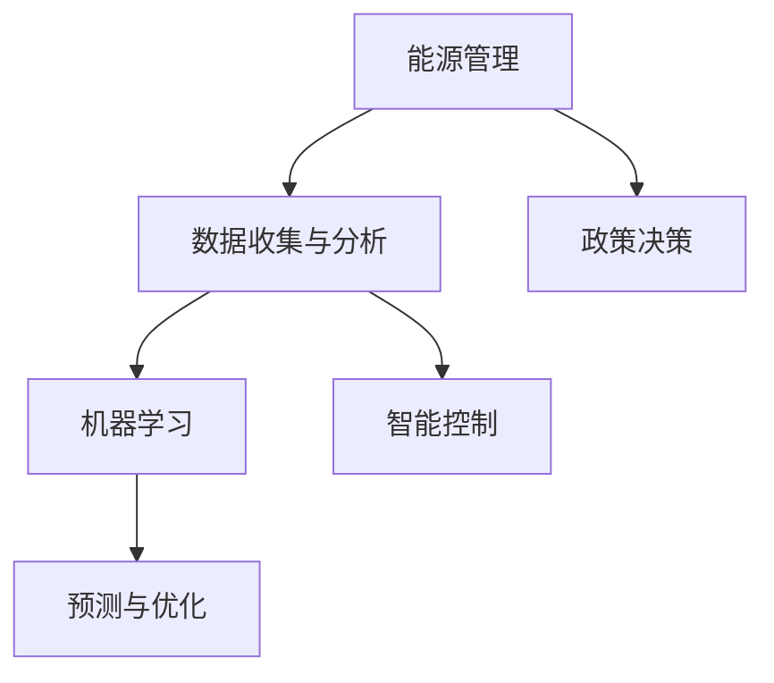

                 

# AI在能源管理中的应用：优化使用效率

> 关键词：人工智能(AI)，能源管理，优化，使用效率，节能减排，智能控制

## 1. 背景介绍

### 1.1 问题由来
随着全球工业化进程的不断推进，能源需求与日俱增，如何高效、环保地利用能源成为了一个亟待解决的全球性问题。传统的能源管理方式主要依赖于人工监控和经验决策，容易产生漏洞和浪费。而人工智能(AI)的崛起为能源管理领域带来了新的可能性，通过AI的强大数据分析与处理能力，能够实时监控能源使用状况，优化使用效率，实现节能减排，提升能源管理的智能化水平。

### 1.2 问题核心关键点
AI在能源管理中的应用主要包括数据收集与分析、预测与优化、智能控制三个方面：

1. **数据收集与分析**：通过传感器、智能表计等设备收集能源使用数据，并利用AI算法对数据进行清洗、归一化、特征工程等预处理。
2. **预测与优化**：利用机器学习、深度学习等技术对能源使用模式进行预测，识别出潜在的节能机会，并给出优化策略。
3. **智能控制**：通过自动化控制设备，如智能温控器、智能照明系统等，根据AI的预测和优化结果，自动调整能源使用行为。

### 1.3 问题研究意义
AI在能源管理中的应用，对于提升能源利用效率、减少环境污染、推动经济绿色转型具有重要意义：

1. **降低能源消耗**：AI能够精准预测能源需求，实现按需供能，减少能源浪费。
2. **提高运营效率**：通过自动化和智能控制，降低人工操作成本，提升管理效率。
3. **促进可持续发展**：推动能源消费结构的优化，促进清洁能源的使用，助力绿色低碳发展。
4. **优化政策决策**：为政府和企业的能源政策制定提供数据支持，推动能源管理的制度创新。

## 2. 核心概念与联系

### 2.1 核心概念概述

为了更好地理解AI在能源管理中的应用，本节将介绍几个关键概念：

- **能源管理**：指对能源的采集、存储、转换、使用和监控等全过程进行管理和优化的活动。
- **人工智能(AI)**：利用计算机科学和数学算法来模拟、延伸和扩展人类智能的技术。
- **机器学习(ML)**：通过数据驱动的方式，训练模型以进行预测、分类、回归等任务。
- **深度学习(DL)**：一类特殊的机器学习方法，具有强大的特征提取和模型拟合能力。
- **智能控制**：通过自动化和智能算法，实现能源使用的实时调整和优化。
- **预测与优化**：利用历史数据和机器学习模型，预测未来能源需求，并提出优化策略。

这些概念之间的逻辑关系可以通过以下Mermaid流程图来展示：



这个流程图展示了能源管理的核心流程和AI的应用位置：

1. 能源管理首先通过数据收集与分析模块获取能源使用数据。
2. 数据经过机器学习和深度学习算法处理后，进行预测与优化。
3. 预测结果指导智能控制模块，实现能源使用的自动化调整。
4. 政策决策模块利用预测与优化的数据，指导能源管理政策的制定和调整。

## 3. 核心算法原理 & 具体操作步骤
### 3.1 算法原理概述

AI在能源管理中的应用，本质上是通过数据驱动的机器学习模型，对能源使用进行实时监控和优化。其核心思想是：收集能源使用数据，构建时间序列预测模型，通过模型预测未来的能源需求和使用模式，提出优化策略，并自动控制能源设备进行实时调整。

形式化地，假设能源使用数据为时间序列 $X = \{x_t\}_{t=1}^T$，其中 $x_t$ 表示第 $t$ 时间步的能源使用量。目标是在历史数据 $X$ 上训练模型 $M$，使得未来能源使用量 $X_{T+1}$ 能够被准确预测，并根据预测结果对能源设备进行智能控制，以最大化节能效益。

### 3.2 算法步骤详解

AI在能源管理中的应用一般包括以下几个关键步骤：

**Step 1: 数据收集与预处理**
- 部署传感器、智能表计等设备，实时收集能源使用数据。
- 数据预处理：包括数据清洗、缺失值填充、归一化、特征工程等步骤，确保数据质量。

**Step 2: 构建时间序列预测模型**
- 选择合适的预测模型，如ARIMA、LSTM、GRU等。
- 利用历史数据对模型进行训练，调整超参数以提高预测精度。

**Step 3: 预测未来能源需求**
- 使用训练好的模型对未来的能源需求进行预测。
- 根据预测结果，计算出潜在的节能空间。

**Step 4: 提出优化策略**
- 分析预测结果，提出合理的能源使用优化策略，如智能调温、动态调整负荷等。
- 利用优化算法求解最佳控制方案。

**Step 5: 智能控制**
- 根据优化策略，自动控制能源设备，调整能源使用行为。
- 实时监测能源使用状况，根据新数据更新模型，进行动态优化。

**Step 6: 模型评估与改进**
- 定期评估模型的预测精度和节能效益。
- 根据评估结果，调整模型结构、参数或数据采集方式，持续改进模型性能。

### 3.3 算法优缺点

AI在能源管理中的应用具有以下优点：
1. 实时监控：利用传感器和智能表计，实现能源使用的实时监控。
2. 数据驱动：通过历史数据驱动的机器学习模型，提升预测准确性。
3. 智能控制：自动化控制设备，优化能源使用行为。
4. 节能减排：有效识别和利用节能机会，降低能源消耗。
5. 降低成本：减少人工干预和运营成本，提升管理效率。

同时，该方法也存在一些局限性：
1. 数据质量依赖：模型的预测精度依赖于数据的质量和完整性。
2. 初始化复杂：需要大量历史数据和复杂的特征工程，初期投入较大。
3. 算法复杂性：深度学习模型的训练和调参复杂，需要专业的技术支持。
4. 设备依赖：智能控制设备的普及度和技术成熟度对应用效果有重要影响。

尽管存在这些局限性，但AI在能源管理中的应用已经显示出巨大的潜力和价值，成为能源管理智能化转型的重要手段。未来相关研究的重点在于如何进一步提高模型预测精度、降低初始化门槛、优化智能控制策略等，以实现更广泛的应用。

### 3.4 算法应用领域

AI在能源管理中的应用已经广泛应用于多个领域：

- **工业能源管理**：对工业企业的能源使用进行监控和优化，减少能耗，提升生产效率。
- **商业能源管理**：对商业建筑的能源使用进行智能控制，优化照明、空调等设备的使用，降低运营成本。
- **家庭能源管理**：通过智能家居设备，实现家庭能源的自动调节和优化，提升居住舒适度。
- **电网管理**：对电力系统进行实时监控和优化，提升供电可靠性，降低电网损耗。
- **交通能源管理**：对交通工具的能源使用进行监控和优化，提升燃油经济性，减少排放。

除了上述这些领域，AI在能源管理中的应用还在不断拓展，如农业、水利、交通等多个领域，为能源的可持续利用提供了新的解决方案。

## 4. 数学模型和公式 & 详细讲解  
### 4.1 数学模型构建

本节将使用数学语言对AI在能源管理中的应用进行更加严格的刻画。

假设能源使用数据为时间序列 $X = \{x_t\}_{t=1}^T$，其中 $x_t$ 表示第 $t$ 时间步的能源使用量。目标是构建时间序列预测模型 $M$，使得未来能源使用量 $X_{T+1}$ 能够被准确预测。

定义时间序列预测模型为 $M(x_t) = f(\mathbf{X}_{t-1},\theta)$，其中 $\theta$ 为模型参数，$\mathbf{X}_{t-1}$ 为时间序列的前 $k$ 个历史数据。假设模型为线性回归模型，则：

$$
M(x_t) = \theta_0 + \sum_{i=1}^k \theta_i x_{t-i}
$$

预测未来能源使用量 $x_{T+1}$ 的误差为 $\epsilon_{T+1} = x_{T+1} - M(x_{T+1})$。

### 4.2 公式推导过程

以下我们以LSTM模型为例，推导时间序列预测的数学公式。

假设能源使用数据为时间序列 $X = \{x_t\}_{t=1}^T$，其中 $x_t$ 表示第 $t$ 时间步的能源使用量。假设使用LSTM模型进行预测，其结构为：

$$
h_t = LSTM(x_{t-1}, h_{t-1})
$$

$$
x_t = o(h_t)
$$

其中 $h_t$ 为LSTM隐藏状态，$x_t$ 为预测结果，$o$ 为输出层。

通过LSTM模型预测未来能源使用量 $x_{T+1}$ 的误差为：

$$
\epsilon_{T+1} = x_{T+1} - o(h_T)
$$

为了最小化预测误差，需要对模型参数 $\theta$ 进行优化，最小化均方误差损失函数：

$$
\mathcal{L} = \frac{1}{N}\sum_{t=1}^N (x_t - o(h_{t-1}))^2
$$

其中 $N$ 为时间序列长度，$h_{t-1}$ 为时间步 $t-1$ 的隐藏状态。

根据梯度下降算法，模型参数的更新公式为：

$$
\theta \leftarrow \theta - \eta \nabla_{\theta}\mathcal{L}
$$

其中 $\eta$ 为学习率，$\nabla_{\theta}\mathcal{L}$ 为损失函数对参数 $\theta$ 的梯度。

在得到模型参数后，可以利用新的历史数据 $\mathbf{X}_{T}$ 进行预测，计算出未来的能源使用量 $x_{T+1}$。

### 4.3 案例分析与讲解

以一个简化的工业企业能源管理案例为例，展示AI在能源管理中的应用过程。

假设某工业企业工厂的能源消耗数据为 $X = \{x_t\}_{t=1}^{100}$，其中 $x_t$ 表示第 $t$ 天工厂的能源消耗量（单位：千瓦时）。

1. **数据收集与预处理**：部署智能表计，收集过去100天的能源消耗数据。数据预处理包括：
   - 数据清洗：去除异常值、缺失值等噪声。
   - 特征工程：引入时间特征、天气特征等，用于提高预测准确性。

2. **构建时间序列预测模型**：选择LSTM模型，利用前99天的数据对模型进行训练，调整超参数。

3. **预测未来能源需求**：利用训练好的LSTM模型对未来第101天的能源需求进行预测，计算预测误差 $\epsilon_{101} = x_{101} - o(h_{100})$。

4. **提出优化策略**：根据预测误差，识别出工厂在101天的能源消耗异常，提出调整策略，如优化生产流程、调整设备运行时间等。

5. **智能控制**：利用自动化控制系统，根据优化策略调整设备运行参数，减少能源消耗。

6. **模型评估与改进**：定期评估模型的预测精度和节能效益，根据评估结果调整模型结构、参数或数据采集方式，持续改进模型性能。

通过以上步骤，AI可以实时监控和优化工业企业的能源使用，提升能源利用效率，降低能源消耗。

## 5. 项目实践：代码实例和详细解释说明
### 5.1 开发环境搭建

在进行AI在能源管理中的应用实践前，我们需要准备好开发环境。以下是使用Python进行TensorFlow开发的环境配置流程：

1. 安装Anaconda：从官网下载并安装Anaconda，用于创建独立的Python环境。

2. 创建并激活虚拟环境：
```bash
conda create -n tensorflow-env python=3.8 
conda activate tensorflow-env
```

3. 安装TensorFlow：根据CUDA版本，从官网获取对应的安装命令。例如：
```bash
conda install tensorflow -c conda-forge
```

4. 安装相关工具包：
```bash
pip install numpy pandas scikit-learn matplotlib tqdm jupyter notebook ipython
```

完成上述步骤后，即可在`tensorflow-env`环境中开始AI在能源管理中的应用实践。

### 5.2 源代码详细实现

这里我们以LSTM模型为例，展示如何使用TensorFlow进行能源管理的时间序列预测。

首先，定义LSTM模型和优化器：

```python
import tensorflow as tf
from tensorflow.keras.models import Sequential
from tensorflow.keras.layers import LSTM, Dense

model = Sequential()
model.add(LSTM(50, return_sequences=True, input_shape=(timesteps, input_dim)))
model.add(LSTM(50))
model.add(Dense(1))

optimizer = tf.keras.optimizers.Adam(learning_rate=0.001)
```

接着，定义训练和评估函数：

```python
def train_model(model, data, batch_size, epochs):
    history = model.fit(data['train'], data['train_labels'], validation_data=(data['test'], data['test_labels']),
                        batch_size=batch_size, epochs=epochs, verbose=0)
    return history

def evaluate_model(model, data):
    test_loss = model.evaluate(data['test'], data['test_labels'])
    return test_loss
```

最后，启动训练流程并在测试集上评估：

```python
timesteps = 24
input_dim = 1

# 假设能源消耗数据为timesteps个时间步，每个时间步有一个输入特征
# 训练集为前timesteps-1个时间步的数据
# 测试集为最后一个时间步的数据
train_data = data['train']
train_labels = data['train_labels']
test_data = data['test']
test_labels = data['test_labels']

batch_size = 32
epochs = 100

history = train_model(model, {'train': train_data, 'train_labels': train_labels}, batch_size, epochs)
test_loss = evaluate_model(model, {'train': train_data, 'train_labels': train_labels})
```

以上就是使用TensorFlow进行LSTM时间序列预测的完整代码实现。可以看到，TensorFlow提供了强大的深度学习框架，使得模型构建和训练过程非常简单高效。

### 5.3 代码解读与分析

让我们再详细解读一下关键代码的实现细节：

**定义LSTM模型和优化器**：
- `Sequential`模型：表示一个线性堆叠的层模型。
- `LSTM`层：定义LSTM结构，其中`return_sequences=True`表示LSTM层会返回所有时间步的输出。
- `Dense`层：定义输出层，输出维度为1，对应时间序列的预测值。
- `Adam`优化器：定义优化算法和学习率。

**训练函数**：
- `fit`方法：在训练集上进行模型训练，`validation_data`参数指定验证集，`batch_size`参数指定每个批次的大小，`epochs`参数指定训练轮数。

**评估函数**：
- `evaluate`方法：在测试集上进行模型评估，返回测试损失。

**启动训练流程**：
- 定义模型参数：时间步长`timesteps`和输入维度`input_dim`。
- 加载数据：加载训练集和测试集的数据。
- 定义训练参数：批大小`batch_size`和训练轮数`epochs`。
- 训练模型：调用`train_model`函数进行模型训练，返回训练历史。
- 评估模型：调用`evaluate_model`函数在测试集上评估模型性能，输出测试损失。

可以看到，TensorFlow提供的高层API使得模型构建和训练过程非常简单，开发者可以快速上手进行实践。

## 6. 实际应用场景

### 6.1 工业企业能源管理

AI在工业企业能源管理中的应用，可以通过实时监控和优化，显著提升能源利用效率，降低能源消耗。

具体而言，可以部署智能表计、智能温控器等设备，实时采集工业企业的能源使用数据。通过构建LSTM等时间序列预测模型，对能源使用进行预测和优化。例如，在预测到某天的能源使用量异常时，可以自动调整生产流程或设备运行参数，实现节能减排。

### 6.2 商业建筑能源管理

AI在商业建筑能源管理中的应用，可以通过智能控制设备和系统，实现能源使用的自动化调整，降低运营成本。

例如，在智能温控器中集成AI算法，根据天气和室内外温差预测最佳空调设定温度。在智能照明系统中集成AI算法，根据人员流动情况和自然光强度自动调节照明亮度。这些优化策略能够有效降低能源消耗，提升建筑物的节能效果。

### 6.3 家庭能源管理

AI在家庭能源管理中的应用，可以通过智能家居设备，实现家庭能源的自动调节和优化，提升居住舒适度。

例如，在智能插座中集成AI算法，根据用电设备的使用习惯和电网负荷情况，自动调整家电的开启和关闭时间。在智能恒温器中集成AI算法，根据家庭成员的作息时间和天气变化，自动调整室内温度。这些优化策略能够有效减少不必要的能源消耗，提升家庭能源利用效率。

### 6.4 电网管理

AI在电网管理中的应用，可以通过实时监控和优化，提升供电可靠性和系统效率，降低电网损耗。

例如，在电网管理系统中部署AI算法，实时分析电网负荷情况，预测电力需求高峰期，提前调度备用电源和电力资源，确保电力供应的稳定。在智能电表系统中集成AI算法，根据用电行为预测用电负荷，优化电力分配，降低电网损耗。这些优化策略能够有效提升电网的运营效率，减少电力浪费。

### 6.5 交通能源管理

AI在交通能源管理中的应用，可以通过智能控制和优化，提升交通工具的燃油经济性和节能效果。

例如，在智能交通管理系统中集成AI算法，根据交通流量和拥堵情况，实时调整红绿灯的通行时间，减少车辆等待时间，提升交通效率。在智能车辆中集成AI算法，根据行驶路线和天气情况，优化燃油经济性，减少车辆能源消耗。这些优化策略能够有效提升交通系统的能效，减少碳排放。

## 7. 工具和资源推荐
### 7.1 学习资源推荐

为了帮助开发者系统掌握AI在能源管理中的应用，这里推荐一些优质的学习资源：

1. 《深度学习》书籍：由Ian Goodfellow等专家所著，全面介绍了深度学习的基本原理和应用案例。
2. 《机器学习实战》书籍：由Peter Harrington所著，通过具体案例展示了机器学习算法在实际问题中的应用。
3. CS229《机器学习》课程：斯坦福大学开设的经典机器学习课程，有Lecture视频和配套作业，适合初学者入门。
4. Coursera《深度学习专项课程》：由Google深度学习团队开设，包含多个深度学习相关课程，适合进一步深造。
5. TensorFlow官方文档：TensorFlow的官方文档，提供了详细的API说明和示例代码，是学习TensorFlow的必备资料。

通过对这些资源的学习实践，相信你一定能够快速掌握AI在能源管理中的应用精髓，并用于解决实际的能源管理问题。

### 7.2 开发工具推荐

高效的开发离不开优秀的工具支持。以下是几款用于AI在能源管理中应用的常用工具：

1. TensorFlow：由Google主导开发的深度学习框架，具有灵活的计算图和丰富的预训练模型，适合构建复杂的预测和优化模型。
2. PyTorch：由Facebook主导开发的深度学习框架，具有动态计算图和优秀的GPU加速性能，适合进行高效的实验和原型开发。
3. Jupyter Notebook：开源的交互式计算环境，支持Python、R等多种语言，适合进行数据处理、模型训练和结果展示。
4. Weights & Biases：模型训练的实验跟踪工具，可以记录和可视化模型训练过程中的各项指标，方便对比和调优。
5. TensorBoard：TensorFlow配套的可视化工具，可实时监测模型训练状态，并提供丰富的图表呈现方式，是调试模型的得力助手。

合理利用这些工具，可以显著提升AI在能源管理中的应用开发效率，加快创新迭代的步伐。

### 7.3 相关论文推荐

AI在能源管理中的应用研究源于学界的持续研究。以下是几篇奠基性的相关论文，推荐阅读：

1. Predicting energy consumption using LSTM networks：提出使用LSTM网络进行能源消耗预测的算法，展示了AI在能源管理中的潜力。
2. Energy Modeling with Time Series Prediction and Real-Time Optimization：探讨了时间序列预测和实时优化在能源管理中的应用，提出了一套综合能源管理方案。
3. Optimizing energy consumption with deep learning：分析了深度学习在优化能源消耗中的应用，提出了一些具体的优化策略。
4. Smart buildings: Energy management with AI and IoT：探讨了AI和物联网在智能建筑能源管理中的应用，展示了智能建筑的未来发展方向。
5. AI-enabled real-time building energy management：分析了AI在实时建筑能源管理中的应用，提出了一套综合管理方案。

这些论文代表了大语言模型在能源管理中的应用发展脉络。通过学习这些前沿成果，可以帮助研究者把握学科前进方向，激发更多的创新灵感。

## 8. 总结：未来发展趋势与挑战

### 8.1 总结

本文对AI在能源管理中的应用进行了全面系统的介绍。首先阐述了能源管理领域面临的挑战和AI的应用价值，明确了AI在能源管理中的核心思想和应用步骤。其次，从原理到实践，详细讲解了AI在能源管理中的数学模型和实现方法，给出了具体的代码实例和详细解释。同时，本文还广泛探讨了AI在能源管理中的实际应用场景，展示了AI技术的广阔前景。最后，本文精选了AI在能源管理中的各类学习资源，力求为读者提供全方位的技术指引。

通过本文的系统梳理，可以看到，AI在能源管理中的应用已经展现出巨大的潜力和价值，成为能源管理智能化转型的重要手段。AI技术通过实时监控、预测与优化和智能控制，实现了能源使用的自动化调整和优化，显著提升了能源利用效率，降低了能源消耗，推动了绿色低碳发展。未来，伴随AI技术的不断进步，能源管理领域的智能化水平将进一步提升，AI技术将在更广泛的应用领域大放异彩。

### 8.2 未来发展趋势

展望未来，AI在能源管理中的应用将呈现以下几个发展趋势：

1. 模型精度提升：随着算力、数据和算法的不断进步，AI在能源管理中的应用精度将不断提升，能够更准确地预测能源需求和使用模式，实现更加精细化的管理。
2. 数据驱动决策：AI将从历史数据中提取更多的知识，辅助决策者进行能源管理策略的制定和调整。
3. 多模态融合：AI将与其他技术进行更深入的融合，如物联网、区块链等，实现跨领域、跨技术的协同优化。
4. 智能化管理：AI将更加广泛地应用于能源管理的各个环节，从数据采集到决策优化，实现全面智能化。
5. 绿色低碳发展：AI将助力能源系统的绿色低碳转型，推动清洁能源的使用，减少碳排放。

以上趋势凸显了AI在能源管理中的重要地位和发展潜力，这些方向的探索发展，必将进一步提升能源管理的智能化水平，为实现绿色低碳发展提供新的动力。

### 8.3 面临的挑战

尽管AI在能源管理中的应用已经取得了显著成果，但在迈向更加智能化、普适化应用的过程中，仍面临诸多挑战：

1. 数据质量和多样性：AI在能源管理中的应用依赖于高质量的数据，但不同场景下的数据质量和多样性差异较大，需要更高效的数据采集和预处理技术。
2. 模型复杂度和成本：AI模型的构建和训练需要大量计算资源，高昂的成本和复杂的模型结构可能限制其在某些场景中的应用。
3. 算法鲁棒性和可解释性：AI模型的鲁棒性和可解释性需要进一步提升，确保其在实际应用中的稳定性和可信度。
4. 智能设备普及率：智能设备的普及率和标准化程度对AI在能源管理中的应用效果有重要影响。
5. 政策和技术环境：能源管理的政策和技术环境可能影响AI应用的推广和普及。

这些挑战需要通过技术进步、政策引导和市场推动等多方面的努力，才能逐步克服。未来，需要通过更高效的数据采集和处理技术、更灵活的算法设计和更广泛的智能设备普及，实现AI在能源管理中的全面应用。

### 8.4 研究展望

面向未来，AI在能源管理中的应用研究需要在以下几个方面寻求新的突破：

1. 提高数据质量：采用更高效的数据采集和预处理技术，提升数据质量和多样性。
2. 优化模型结构：开发更高效的模型结构和算法，降低计算成本，提高模型鲁棒性和可解释性。
3. 推动智能设备普及：推动智能设备的普及和标准化，提高AI应用的可操作性和可靠性。
4. 实现跨技术融合：将AI与其他技术进行更深入的融合，如物联网、区块链等，实现跨领域、跨技术的协同优化。
5. 加强政策支持：推动政府和企业的政策支持，为AI在能源管理中的应用提供制度保障和市场激励。

这些研究方向的探索，必将引领AI在能源管理中的应用迈向更高的台阶，为实现绿色低碳发展和智能能源管理提供新的路径。相信随着技术进步和政策引导，AI在能源管理中的应用将越来越广泛，推动能源管理的智能化、绿色化转型，为构建可持续发展的未来能源系统贡献力量。

## 9. 附录：常见问题与解答

**Q1：AI在能源管理中的应用是否适用于所有能源类型？**

A: AI在能源管理中的应用不仅限于电能，也适用于其他类型的能源，如天然气、石油等。不同类型能源的管理方式略有不同，但核心思想和方法是相似的。需要根据具体的能源类型和特点，进行相应的数据采集和模型构建。

**Q2：AI在能源管理中的应用是否需要考虑环境因素？**

A: 是的，环境因素对能源管理有着重要的影响。例如，天气变化、季节更替等都会影响能源需求和使用模式。AI在能源管理中的应用需要考虑环境因素，引入相关的特征工程，才能更准确地预测和优化能源使用。

**Q3：AI在能源管理中的应用是否需要考虑时间因素？**

A: 是的，时间因素在能源管理中扮演着重要角色。不同时间段的能源使用模式可能存在较大差异，AI在能源管理中的应用需要考虑时间因素，引入时间序列预测模型，才能更准确地预测和优化能源使用。

**Q4：AI在能源管理中的应用是否需要考虑设备因素？**

A: 是的，设备因素对能源管理有着重要的影响。不同设备的使用特性、能效等级等都会影响能源消耗。AI在能源管理中的应用需要考虑设备因素，引入设备特征工程，才能更准确地预测和优化能源使用。

**Q5：AI在能源管理中的应用是否需要考虑用户行为因素？**

A: 是的，用户行为因素对能源管理有着重要的影响。不同用户的行为模式、习惯等都会影响能源消耗。AI在能源管理中的应用需要考虑用户行为因素，引入行为特征工程，才能更准确地预测和优化能源使用。

**Q6：AI在能源管理中的应用是否需要考虑经济因素？**

A: 是的，经济因素对能源管理有着重要的影响。不同经济环境下的能源价格、补贴等政策，都会影响能源消耗和投资回报。AI在能源管理中的应用需要考虑经济因素，引入经济特征工程，才能更准确地预测和优化能源使用。

**Q7：AI在能源管理中的应用是否需要考虑技术因素？**

A: 是的，技术因素对能源管理有着重要的影响。不同技术条件下的能源转化效率、损耗等，都会影响能源使用。AI在能源管理中的应用需要考虑技术因素，引入技术特征工程，才能更准确地预测和优化能源使用。

通过以上问答，可以看到，AI在能源管理中的应用涉及多个复杂因素，需要综合考虑数据、模型、设备和用户等多个维度。只有在全面优化各个环节的情况下，才能充分发挥AI在能源管理中的应用潜力，实现节能减排和绿色低碳发展的目标。

---

作者：禅与计算机程序设计艺术 / Zen and the Art of Computer Programming

