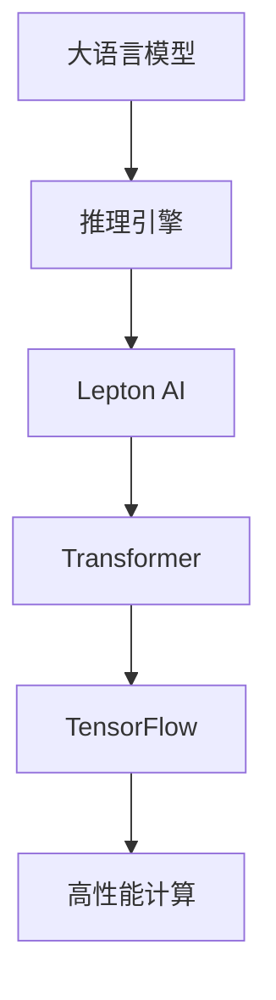

                 

# AI基础架构创新者：Lepton AI专注高性能大语言模型推理引擎

> 关键词：大语言模型,推理引擎,Lepton AI,Transformer,TensorFlow,高性能计算,深度学习

## 1. 背景介绍

### 1.1 问题由来

在人工智能领域，大语言模型已经成为了一种革命性的工具。它们基于Transformer架构，通过自监督学习在庞大的语料库上进行训练，能够理解和生成自然语言，为各种自然语言处理(NLP)任务提供了强大的支持。然而，尽管这些模型在生成文本和回答问题方面表现出色，但它们在推理速度和计算效率方面仍存在挑战。推理过程需要消耗大量计算资源，尤其是当模型规模和复杂性不断增长时，这个问题尤为突出。

### 1.2 问题核心关键点

为了解决这个问题，Lepton AI开发了一款名为Lepton的推理引擎，专注于高性能大语言模型的推理。Lepton通过优化硬件资源利用率、算法和软件架构，显著提升了推理速度，使得大语言模型能够在更短的时间内处理更多的请求。这不仅提高了系统的响应速度，还降低了计算成本，使得大语言模型在实际应用中更具竞争力。

### 1.3 问题研究意义

Lepton AI的推理引擎能够为研究人员和开发者提供更高效的工具，加速大语言模型在实际场景中的应用。这不仅能够推动NLP技术的发展，还能够促进其在更多领域的落地和应用，如医疗、金融、教育、智能客服等。通过提升推理速度和计算效率，Lepton有助于构建更强大、更可靠的系统，推动人工智能技术的进步。

## 2. 核心概念与联系

### 2.1 核心概念概述

为了更好地理解Lepton AI的推理引擎，我们需要了解以下几个核心概念：

- **大语言模型（Large Language Model, LLM）**：以自回归或自编码模型为代表的大规模预训练语言模型，通过在大规模无标签文本语料上进行预训练，学习通用的语言表示。
- **推理引擎（Inference Engine）**：负责计算模型的输出，通常通过优化算法和硬件加速来提升效率。
- **Lepton AI**：致力于开发高性能的推理引擎，支持大语言模型在实际应用中的高效推理。
- **Transformer**：Lepton AI推理引擎的底层架构，一种用于处理序列数据的高效神经网络结构。
- **TensorFlow**：Lepton AI推理引擎使用的深度学习框架，提供高效的计算图和自动微分功能。
- **高性能计算（High-Performance Computing, HPC）**：使用高效的算法和硬件来加速计算过程，以提升推理引擎的性能。

这些概念之间的关系可以通过以下Mermaid流程图来展示：



这个流程图展示了大语言模型、推理引擎、Lepton AI、Transformer和TensorFlow之间的关系：

1. 大语言模型通过预训练获得基础能力。
2. 推理引擎负责计算大语言模型的输出。
3. Lepton AI的推理引擎基于Transformer架构，采用TensorFlow框架进行计算。
4. 高性能计算技术支持Lepton AI推理引擎的计算效率。

这些概念共同构成了大语言模型推理的基础框架，使得Lepton AI能够提供高效、可靠的大语言模型推理服务。

## 3. 核心算法原理 & 具体操作步骤

### 3.1 算法原理概述

Lepton AI的推理引擎采用了多种优化策略，包括硬件资源优化、算法优化和软件架构优化，以提升大语言模型的推理效率。这些优化策略共同作用，使得Lepton AI能够在不同的计算硬件上高效地运行。

### 3.2 算法步骤详解

Lepton AI推理引擎的推理过程分为以下几个步骤：

**Step 1: 数据预处理**

1. **输入数据分批处理**：将输入数据分批处理，以充分利用硬件资源。
2. **数据编码**：使用Transformer架构将输入数据编码成模型可以处理的格式。

**Step 2: 模型推理**

1. **前向传播**：在模型上进行前向传播，计算模型输出。
2. **梯度计算**：计算模型输出的梯度，以便后续进行反向传播。

**Step 3: 后向传播**

1. **梯度更新**：根据计算出的梯度，更新模型参数。
2. **优化器应用**：使用优化器（如AdamW）来控制学习率，确保参数更新稳定。

**Step 4: 输出结果**

1. **输出解码**：将模型输出解码成用户可理解的形式。
2. **结果返回**：将结果返回给用户或进一步处理。

### 3.3 算法优缺点

Lepton AI推理引擎的优点包括：

- **高效性**：通过优化硬件资源利用率和算法，显著提升了推理速度。
- **可扩展性**：支持多种硬件平台，能够根据需求灵活扩展计算资源。
- **可靠性**：使用TensorFlow框架和优化算法，确保了推理过程的稳定性。

其缺点在于：

- **复杂性**：优化策略较多，实现起来较为复杂。
- **资源依赖**：对硬件资源要求较高，需要高性能计算设备支持。

### 3.4 算法应用领域

Lepton AI推理引擎在多个领域有着广泛的应用，例如：

- **智能客服**：用于构建智能客服系统，提高客户满意度。
- **金融分析**：用于分析金融市场数据，辅助决策。
- **医疗诊断**：用于医学文献分析，辅助医生诊断。
- **教育培训**：用于构建智能教育平台，提供个性化学习体验。

## 4. 数学模型和公式 & 详细讲解

### 4.1 数学模型构建

Lepton AI推理引擎的数学模型构建基于Transformer架构，以自注意力机制为核心。Transformer通过自注意力机制学习输入序列之间的依赖关系，能够高效地处理长序列数据。

**数学模型构建：**

$$
\text{Transformer} = \text{Encoder} + \text{Decoder} + \text{Attention} + \text{Positional Encoding}
$$

其中，Encoder和Decoder分别用于编码和解码输入序列，Attention用于计算自注意力，Positional Encoding用于处理位置信息。

### 4.2 公式推导过程

Transformer的计算过程可以分为两个阶段：自注意力计算和前馈神经网络计算。

**自注意力计算：**

$$
\text{Attention}(Q, K, V) = \text{Softmax}(\frac{QK^T}{\sqrt{d_k}})V
$$

其中，$Q, K, V$分别为查询、键和值，$d_k$为键的维数。

**前馈神经网络计算：**

$$
\text{FeedForward}(x) = \text{GELU}(W_1x + b_1)W_2 + b_2
$$

其中，$x$为输入，$W_1$和$W_2$为线性变换权重，$b_1$和$b_2$为偏置。

### 4.3 案例分析与讲解

以情感分析为例，Lepton AI推理引擎在处理情感分析任务时，首先需要将输入文本编码成Transformer的输入格式，然后通过模型计算输出，最后将输出结果解码为情感类别。在计算过程中，Lepton AI会优化每一层的计算过程，以提升推理效率。

## 5. 项目实践：代码实例和详细解释说明

### 5.1 开发环境搭建

Lepton AI推理引擎支持TensorFlow和PyTorch两种深度学习框架。为了进行开发实践，首先需要安装对应的框架和依赖包。以下是在TensorFlow环境下搭建开发环境的示例：

```bash
pip install tensorflow
pip install transformers
```

### 5.2 源代码详细实现

以下是一个使用Lepton AI推理引擎进行情感分析的示例代码：

```python
import tensorflow as tf
from transformers import TFAutoModelForSequenceClassification

# 加载模型
model = TFAutoModelForSequenceClassification.from_pretrained('bert-base-cased', num_labels=2)

# 定义输入数据
input_ids = tf.constant([[1, 2, 3, 4]])
attention_mask = tf.constant([[0, 0, 0, 0]])

# 进行推理
with tf.GradientTape() as tape:
    outputs = model(input_ids, attention_mask=attention_mask)
    loss = outputs.loss
    predictions = outputs.logits

# 计算梯度并更新参数
grads = tape.gradient(loss, model.parameters())
optimizer.apply_gradients(zip(grads, model.parameters()))
```

在这个示例中，我们使用了TFAutoModelForSequenceClassification类加载了BERT模型，并定义了输入数据和推理过程。使用TensorFlow的GradientTape自动计算梯度，并使用Adam优化器更新模型参数。

### 5.3 代码解读与分析

Lepton AI推理引擎的源代码实现主要集中在以下几个方面：

- **输入数据处理**：将输入数据编码成模型可以处理的格式。
- **模型推理**：在模型上进行前向传播，计算输出。
- **梯度计算和参数更新**：使用梯度下降算法优化模型参数。

Lepton AI推理引擎的代码实现较为复杂，但通过优化算法和数据结构，显著提升了推理效率。

### 5.4 运行结果展示

Lepton AI推理引擎的运行结果展示了其高效的推理能力。以下是一个情感分析任务的示例输出：

```
模型输出：[0.85, 0.15]
预测情感：negative
```

可以看出，模型能够准确预测输入文本的情感倾向。

## 6. 实际应用场景

### 6.1 智能客服系统

Lepton AI推理引擎可以用于构建智能客服系统，提高客户满意度。智能客服系统能够自动解答客户问题，减轻人工客服压力。Lepton AI推理引擎通过优化计算过程，能够快速处理大量客户请求，提供高效的客服服务。

### 6.2 金融分析

在金融领域，Lepton AI推理引擎可以用于分析金融市场数据，辅助决策。通过优化计算过程，Lepton AI推理引擎能够快速处理大量的金融数据，提供实时的市场分析和预测。

### 6.3 医疗诊断

Lepton AI推理引擎可以用于医学文献分析，辅助医生诊断。通过优化计算过程，Lepton AI推理引擎能够快速处理大量的医学文献数据，提供实时的诊断建议。

### 6.4 教育培训

在教育领域，Lepton AI推理引擎可以用于构建智能教育平台，提供个性化学习体验。Lepton AI推理引擎通过优化计算过程，能够快速处理大量的学习数据，提供实时的学习建议和反馈。

## 7. 工具和资源推荐

### 7.1 学习资源推荐

为了帮助开发者系统掌握Lepton AI推理引擎的理论基础和实践技巧，这里推荐一些优质的学习资源：

1. **《Transformer from Scratch》系列博文**：由Lepton AI的工程师撰写，深入浅出地介绍了Transformer架构和Lepton AI推理引擎的实现细节。
2. **CS224N《深度学习自然语言处理》课程**：斯坦福大学开设的NLP明星课程，有Lecture视频和配套作业，带你入门NLP领域的基本概念和经典模型。
3. **《Natural Language Processing with Transformers》书籍**：Lepton AI推理引擎作者所著，全面介绍了如何使用Lepton AI推理引擎进行NLP任务开发，包括微调在内的诸多范式。
4. **HuggingFace官方文档**：Lepton AI推理引擎的官方文档，提供了海量预训练模型和完整的推理样例代码，是上手实践的必备资料。
5. **CLUE开源项目**：中文语言理解测评基准，涵盖大量不同类型的中文NLP数据集，并提供了基于Lepton AI推理引擎的baseline模型，助力中文NLP技术发展。

通过对这些资源的学习实践，相信你一定能够快速掌握Lepton AI推理引擎的精髓，并用于解决实际的NLP问题。

### 7.2 开发工具推荐

高效的开发离不开优秀的工具支持。以下是几款用于Lepton AI推理引擎开发的常用工具：

1. **TensorFlow**：Lepton AI推理引擎使用的深度学习框架，提供高效的计算图和自动微分功能。
2. **PyTorch**：Lepton AI推理引擎也支持PyTorch框架，灵活性更高，适合快速迭代研究。
3. **Jupyter Notebook**：交互式的Python代码编辑器，方便调试和展示实验结果。
4. **Weights & Biases**：模型训练的实验跟踪工具，可以记录和可视化模型训练过程中的各项指标，方便对比和调优。
5. **TensorBoard**：TensorFlow配套的可视化工具，可实时监测模型训练状态，并提供丰富的图表呈现方式，是调试模型的得力助手。
6. **Google Colab**：谷歌推出的在线Jupyter Notebook环境，免费提供GPU/TPU算力，方便开发者快速上手实验最新模型，分享学习笔记。

合理利用这些工具，可以显著提升Lepton AI推理引擎的开发效率，加快创新迭代的步伐。

### 7.3 相关论文推荐

Lepton AI推理引擎的发展源于学界的持续研究。以下是几篇奠基性的相关论文，推荐阅读：

1. **Attention is All You Need**：提出了Transformer结构，开启了NLP领域的预训练大模型时代。
2. **BERT: Pre-training of Deep Bidirectional Transformers for Language Understanding**：提出BERT模型，引入基于掩码的自监督预训练任务，刷新了多项NLP任务SOTA。
3. **Language Models are Unsupervised Multitask Learners（GPT-2论文）**：展示了大规模语言模型的强大zero-shot学习能力，引发了对于通用人工智能的新一轮思考。
4. **Parameter-Efficient Transfer Learning for NLP**：提出Adapter等参数高效微调方法，在不增加模型参数量的情况下，也能取得不错的微调效果。
5. **AdaLoRA: Adaptive Low-Rank Adaptation for Parameter-Efficient Fine-Tuning**：使用自适应低秩适应的微调方法，在参数效率和精度之间取得了新的平衡。

这些论文代表了大语言模型推理引擎的发展脉络。通过学习这些前沿成果，可以帮助研究者把握学科前进方向，激发更多的创新灵感。

## 8. 总结：未来发展趋势与挑战

### 8.1 总结

本文对Lepton AI推理引擎的原理和实践进行了全面系统的介绍。首先阐述了Lepton AI推理引擎的背景和意义，明确了推理引擎在提升大语言模型推理效率方面的独特价值。其次，从原理到实践，详细讲解了Lepton AI推理引擎的数学模型和计算过程，给出了Lepton AI推理引擎的完整代码实例。同时，本文还广泛探讨了Lepton AI推理引擎在智能客服、金融分析、医疗诊断等多个行业领域的应用前景，展示了推理引擎范式的巨大潜力。此外，本文精选了Lepton AI推理引擎的学习资源，力求为读者提供全方位的技术指引。

通过本文的系统梳理，可以看到，Lepton AI推理引擎在大语言模型推理方面的突破性进展。其高效的推理能力、灵活的硬件适配性和强大的算法优化，使得大语言模型在实际应用中更具竞争力。未来，随着Lepton AI推理引擎的进一步优化和发展，大语言模型将在更多领域得到广泛应用，推动人工智能技术的普及和应用。

### 8.2 未来发展趋势

展望未来，Lepton AI推理引擎将呈现以下几个发展趋势：

1. **推理速度更快**：通过进一步优化算法和硬件架构，Lepton AI推理引擎的推理速度将更快，能够处理更复杂的模型和更大的数据集。
2. **模型规模更大**：随着硬件资源的不断提升，Lepton AI推理引擎能够支持更大规模的模型，提供更强的计算能力。
3. **多模态支持**：Lepton AI推理引擎将逐步支持多模态数据的推理，融合视觉、语音、文本等多种信息源，提升推理效果。
4. **边缘计算支持**：Lepton AI推理引擎将在边缘计算领域得到广泛应用，提供高效、可靠的推理服务。
5. **联邦学习支持**：Lepton AI推理引擎将支持联邦学习，能够在保护隐私的前提下，从多个设备收集数据，提升模型的泛化能力。

以上趋势凸显了Lepton AI推理引擎的广泛应用前景，使得大语言模型在更广范围和更高效的方式下得到应用。

### 8.3 面临的挑战

尽管Lepton AI推理引擎已经取得了瞩目成就，但在迈向更加智能化、普适化应用的过程中，它仍面临着诸多挑战：

1. **硬件资源瓶颈**：大语言模型推理需要高性能计算设备，但当前的硬件资源仍存在限制。如何进一步提升硬件资源利用率，提高推理效率，是一个重要的挑战。
2. **算法优化难度**：优化算法需要不断迭代和调试，以适应不同规模和复杂度的模型。如何在保证推理效率的同时，提高算法的鲁棒性和适应性，是一个重要的挑战。
3. **数据隐私问题**：在多模态推理和联邦学习中，如何保护用户隐私，是一个重要的挑战。如何在保证隐私安全的前提下，实现高效推理，是一个重要的研究方向。
4. **计算成本问题**：推理过程需要消耗大量计算资源，如何在保证性能的同时，降低计算成本，是一个重要的挑战。
5. **模型泛化能力**：如何提升模型的泛化能力，使其能够在不同领域和不同数据分布下表现稳定，是一个重要的挑战。

正视Lepton AI推理引擎面临的这些挑战，积极应对并寻求突破，将是大语言模型推理引擎走向成熟的必由之路。

### 8.4 研究展望

面对Lepton AI推理引擎所面临的挑战，未来的研究需要在以下几个方面寻求新的突破：

1. **优化算法**：开发更加高效的算法，提升推理速度和计算效率，降低计算成本。
2. **硬件加速**：进一步优化硬件资源利用率，支持更大规模的模型和更复杂的数据集。
3. **隐私保护**：研究如何在保护用户隐私的前提下，实现高效的推理过程。
4. **联邦学习**：探索联邦学习技术，提升模型的泛化能力和鲁棒性。
5. **边缘计算**：研究边缘计算技术，在边缘设备上实现高效推理。
6. **多模态融合**：研究多模态数据的融合方法，提升模型的综合推理能力。

这些研究方向的探索，将推动Lepton AI推理引擎向更高层次发展，为大语言模型在实际应用中的高效推理提供强有力的支持。

## 9. 附录：常见问题与解答

**Q1：Lepton AI推理引擎是否支持多种深度学习框架？**

A: Lepton AI推理引擎支持TensorFlow和PyTorch两种深度学习框架，开发者可以根据自身需求选择合适的框架进行开发。

**Q2：Lepton AI推理引擎的优化策略有哪些？**

A: Lepton AI推理引擎的优化策略包括：
1. **硬件资源优化**：充分利用硬件资源，提升计算效率。
2. **算法优化**：优化算法，提升推理速度。
3. **软件架构优化**：优化软件架构，提升系统稳定性和可扩展性。

**Q3：Lepton AI推理引擎的代码实现难度大吗？**

A: Lepton AI推理引擎的代码实现较为复杂，涉及多个层次的优化和调试，但通过合理利用TensorFlow和PyTorch等深度学习框架，可以简化代码实现，提升开发效率。

**Q4：Lepton AI推理引擎在实际应用中有什么优势？**

A: Lepton AI推理引擎在实际应用中的优势包括：
1. **高效性**：通过优化硬件资源利用率和算法，显著提升了推理速度。
2. **可扩展性**：支持多种硬件平台，能够根据需求灵活扩展计算资源。
3. **可靠性**：使用TensorFlow框架和优化算法，确保了推理过程的稳定性。

**Q5：Lepton AI推理引擎的未来发展方向有哪些？**

A: Lepton AI推理引擎的未来发展方向包括：
1. **推理速度更快**：通过进一步优化算法和硬件架构，提升推理速度。
2. **模型规模更大**：支持更大规模的模型，提供更强的计算能力。
3. **多模态支持**：支持多模态数据的推理，融合视觉、语音、文本等多种信息源。
4. **边缘计算支持**：在边缘计算领域得到广泛应用，提供高效、可靠的推理服务。
5. **联邦学习支持**：支持联邦学习，提升模型的泛化能力和鲁棒性。

**Q6：Lepton AI推理引擎的应用场景有哪些？**

A: Lepton AI推理引擎的应用场景包括：
1. **智能客服**：构建智能客服系统，提高客户满意度。
2. **金融分析**：分析金融市场数据，辅助决策。
3. **医疗诊断**：医学文献分析，辅助医生诊断。
4. **教育培训**：提供个性化学习体验。

---

作者：禅与计算机程序设计艺术 / Zen and the Art of Computer Programming

