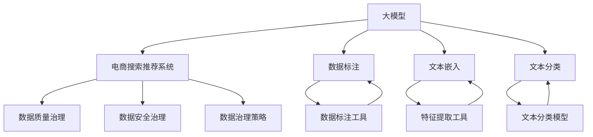

                 

# AI大模型助力电商搜索推荐业务的数据治理能力提升项目管理

> 关键词：大模型,电商搜索,推荐系统,数据治理,项目管理,大数据,数据治理,治理策略

## 1. 背景介绍

### 1.1 问题由来

在数字化转型的浪潮下，电商企业的核心竞争力正在从传统的商品和价格竞争转向数据驱动的用户体验和个性化服务。如何将海量用户数据有效转化为业务价值，成为了电商企业的关键挑战。其中，电商搜索推荐系统（Search and Recommendation System, SRS）是连接用户和商品的重要桥梁，通过精准的搜索结果和个性化的推荐列表，大幅提升用户购物体验和转化率。

然而，当前许多电商搜索推荐系统仍然面临数据质量差、治理能力弱等问题。例如：

- 数据冗余和冲突：不同系统产生的数据格式和规范不一致，导致数据冗余和冲突。
- 数据孤岛和孤立：各业务部门的数据集成和共享机制不健全，数据孤岛和孤立现象严重。
- 数据质量差：数据采集和存储过程中的质量问题导致数据准确性、完整性和一致性不足，影响模型训练和应用效果。
- 数据隐私和安全：数据隐私和安全问题，特别是在大数据环境下，如何有效管理和保护用户隐私数据，成为一个亟待解决的问题。

为了应对上述挑战，企业需要引入先进的大数据治理和项目管理工具，构建一套高效的数据治理体系，提高电商搜索推荐系统的数据质量和服务水平。本文将重点探讨大模型在电商搜索推荐系统数据治理中的应用，为企业提供一份详细的项目管理方案。

### 1.2 问题核心关键点

为了更清晰地理解大模型在电商搜索推荐系统数据治理中的应用，本节将介绍几个核心关键点：

- **大模型**：指经过大规模无监督数据预训练的深度学习模型，如BERT、GPT等。这些模型具备强大的语言理解和生成能力，能够从海量数据中学习到丰富的语言知识，广泛应用于各种自然语言处理任务。
- **电商搜索推荐系统**：电商平台的搜索和推荐系统，通过算法为用户匹配最相关的商品，提升用户体验和转化率。
- **数据治理**：数据治理是指企业通过一系列技术和组织手段，对数据进行规范、管理和控制，确保数据的质量、安全性和可用性，提升数据价值的过程。
- **项目管理**：项目管理是指在项目生命周期中，通过科学的管理手段和工具，对项目进行规划、执行和监控，确保项目按时、按质、按预算完成。

## 2. 核心概念与联系

### 2.1 核心概念概述

为了更好地理解大模型在电商搜索推荐系统数据治理中的应用，本节将介绍几个密切相关的核心概念及其联系：

- **数据质量治理**：通过数据清洗、数据标准化、数据验证等手段，提升数据质量，确保数据准确、完整和一致。
- **数据安全治理**：通过数据加密、访问控制、审计日志等措施，保护数据隐私和安全，防止数据泄露和滥用。
- **数据治理策略**：基于业务需求和数据特征，设计科学合理的数据治理策略，明确数据管理流程和责任，实现数据的高效利用。
- **大模型应用**：利用大模型强大的语言理解和生成能力，对电商搜索推荐系统中的文本数据进行处理，提升数据治理效果和业务价值。

这些核心概念之间的逻辑关系可以通过以下Mermaid流程图来展示：



这个流程图展示了大模型在电商搜索推荐系统数据治理中的应用路径：

1. 大模型从电商搜索推荐系统中提取文本数据。
2. 利用数据标注工具进行数据标注，提升数据质量。
3. 通过特征提取工具和文本嵌入技术，将文本数据转化为模型可接受的形式。
4. 利用文本分类模型对文本进行分类，实现数据分类治理。
5. 根据业务需求和数据特征，设计数据治理策略，确保数据管理和使用的科学性和合理性。

通过这一系列步骤，大模型能够有效提升电商搜索推荐系统的数据治理能力，为后续的推荐算法和业务应用提供坚实的基础。

## 3. 核心算法原理 & 具体操作步骤
### 3.1 算法原理概述

大模型在电商搜索推荐系统数据治理中的应用，主要基于以下算法原理：

1. **数据标注与清洗**：通过大模型对电商搜索推荐系统中的文本数据进行标注，生成高质量的数据标注样本，用于数据清洗和标准化。
2. **文本嵌入与特征提取**：利用大模型将文本数据转化为低维向量表示，提取文本特征，为后续的数据分析和建模提供基础。
3. **文本分类与治理策略设计**：结合电商搜索推荐系统的业务需求，设计文本分类模型，对文本数据进行分类治理，提升数据管理和使用的科学性。
4. **项目管理和数据治理策略执行**：通过科学的项目管理手段，确保数据治理策略的有效执行，确保数据治理目标的达成。

### 3.2 算法步骤详解

基于上述算法原理，大模型在电商搜索推荐系统数据治理中的应用主要包括以下几个步骤：

**Step 1: 准备数据和工具**
- 收集电商搜索推荐系统中的文本数据，包括用户评论、商品描述、广告文案等。
- 选择合适的数据标注工具，如Labelbox、Diffbot等，用于对文本数据进行标注。
- 选择合适的特征提取工具，如gensim、spaCy等，用于对文本数据进行嵌入和特征提取。
- 选择合适的文本分类模型，如BERT、XLM等，用于对文本数据进行分类。

**Step 2: 数据标注与清洗**
- 利用数据标注工具，对文本数据进行标注，生成高质量的数据标注样本。
- 利用数据清洗工具，对文本数据进行清洗，去除噪音和异常值，提升数据质量。

**Step 3: 文本嵌入与特征提取**
- 利用特征提取工具，对文本数据进行嵌入，将其转化为低维向量表示。
- 利用文本嵌入技术，提取文本特征，为后续的数据分析和建模提供基础。

**Step 4: 文本分类与治理策略设计**
- 利用文本分类模型，对文本数据进行分类治理，确保数据分类准确性和一致性。
- 根据电商搜索推荐系统的业务需求，设计科学合理的数据治理策略，明确数据管理流程和责任，实现数据的高效利用。

**Step 5: 项目管理和策略执行**
- 通过科学的项目管理手段，确保数据治理策略的有效执行。
- 定期评估数据治理效果，根据评估结果进行调整优化，确保数据治理目标的达成。

### 3.3 算法优缺点

利用大模型在电商搜索推荐系统数据治理中的应用，具有以下优点：

1. **高效的数据标注**：大模型能够对文本数据进行高效的数据标注，提升数据标注的准确性和效率。
2. **高质量的数据清洗**：通过大模型生成的高质量数据标注样本，能够更有效地清洗文本数据，去除噪音和异常值，提升数据质量。
3. **科学的文本分类**：利用大模型强大的语言理解和生成能力，能够实现精确的文本分类，提升数据分类治理的科学性和合理性。
4. **灵活的项目管理**：科学的项目管理手段能够确保数据治理策略的有效执行，提高数据治理的效率和效果。

同时，该方法也存在一些局限性：

1. **高昂的标注成本**：大模型的数据标注需要大量的标注样本，成本较高。
2. **数据隐私问题**：大模型处理大量用户数据，需要注意数据隐私和安全问题。
3. **模型复杂性**：大模型具有高复杂性，需要一定的计算资源和技能支持。
4. **模型可解释性不足**：大模型作为"黑盒"系统，缺乏可解释性，难以解释其内部工作机制和决策逻辑。

尽管存在这些局限性，但就目前而言，利用大模型在电商搜索推荐系统数据治理中的应用仍具有很大的潜力和价值，值得进一步探索和实践。

### 3.4 算法应用领域

利用大模型在电商搜索推荐系统数据治理中的应用，主要适用于以下几个领域：

- **数据标注**：电商搜索推荐系统中的文本数据标注，如用户评论、商品描述、广告文案等。
- **数据清洗**：电商搜索推荐系统中的文本数据清洗，去除噪音和异常值。
- **文本分类**：电商搜索推荐系统中的文本数据分类，如商品分类、广告分类等。
- **数据治理策略设计**：电商搜索推荐系统中的数据治理策略设计，提升数据管理和使用的科学性。

这些领域是大模型在电商搜索推荐系统数据治理中发挥作用的重要场景，通过大模型处理，能够有效提升电商搜索推荐系统的数据治理能力，为后续的推荐算法和业务应用提供坚实的基础。

## 4. 数学模型和公式 & 详细讲解 & 举例说明

### 4.1 数学模型构建

在大模型在电商搜索推荐系统数据治理中的应用中，涉及的数学模型主要包括以下几个方面：

1. **数据标注模型**：用于生成高质量的数据标注样本，提升数据标注的准确性和效率。
2. **文本嵌入模型**：用于将文本数据转化为低维向量表示，提取文本特征。
3. **文本分类模型**：用于对文本数据进行分类治理，提升数据分类治理的科学性和合理性。

### 4.2 公式推导过程

以下将详细推导大模型在电商搜索推荐系统数据治理中的主要数学模型公式。

**数据标注模型**：假设电商搜索推荐系统中的文本数据为 $\{d_i\}_{i=1}^N$，其中 $d_i$ 表示第 $i$ 条文本数据。数据标注模型的目标是生成高质量的数据标注样本，对每个文本数据进行标注。令 $y_i$ 表示第 $i$ 条文本数据的标注结果，其中 $y_i \in \{0, 1\}$，$y_i=1$ 表示标注结果正确，$y_i=0$ 表示标注结果错误。数据标注模型的目标函数为：

$$
\min_{\theta} \sum_{i=1}^N \ell(y_i, f(d_i; \theta))
$$

其中 $f(d_i; \theta)$ 表示利用大模型对第 $i$ 条文本数据进行标注的概率分布，$\theta$ 为大模型的参数。$\ell$ 表示损失函数，常见的有交叉熵损失函数：

$$
\ell(y_i, f(d_i; \theta)) = -[y_i\log f(d_i; \theta) + (1-y_i)\log (1-f(d_i; \theta))]
$$

**文本嵌入模型**：假设电商搜索推荐系统中的文本数据为 $\{d_i\}_{i=1}^N$，其中 $d_i$ 表示第 $i$ 条文本数据。文本嵌入模型的目标是提取文本特征，将文本数据转化为低维向量表示。令 $x_i \in \mathbb{R}^k$ 表示第 $i$ 条文本数据的低维向量表示，其中 $k$ 为向量维度。文本嵌入模型的目标函数为：

$$
\min_{\theta} \sum_{i=1}^N \|x_i - E(d_i; \theta)\|^2
$$

其中 $E(d_i; \theta)$ 表示利用大模型对第 $i$ 条文本数据进行嵌入的向量表示，$\theta$ 为大模型的参数。

**文本分类模型**：假设电商搜索推荐系统中的文本数据为 $\{d_i\}_{i=1}^N$，其中 $d_i$ 表示第 $i$ 条文本数据。文本分类模型的目标是实现文本分类治理，对每个文本数据进行分类。令 $c_i \in \{1, 2, \cdots, C\}$ 表示第 $i$ 条文本数据的分类结果，其中 $C$ 为分类数目。文本分类模型的目标函数为：

$$
\min_{\theta} \sum_{i=1}^N \ell(c_i, f(d_i; \theta))
$$

其中 $f(d_i; \theta)$ 表示利用大模型对第 $i$ 条文本数据进行分类的概率分布，$\theta$ 为大模型的参数。$\ell$ 表示损失函数，常见的有交叉熵损失函数：

$$
\ell(c_i, f(d_i; \theta)) = -\sum_{j=1}^C c_{ij}\log f(d_i; \theta_j)
$$

其中 $f(d_i; \theta_j)$ 表示利用大模型对第 $i$ 条文本数据进行分类时，属于第 $j$ 类的概率。

### 4.3 案例分析与讲解

以电商搜索推荐系统中的商品评论数据标注为例，利用大模型进行数据标注的实现过程如下：

1. **数据准备**：收集电商搜索推荐系统中的商品评论数据，分为训练集和测试集。
2. **数据标注**：利用大模型对每个评论数据进行标注，生成标注结果和概率分布。
3. **模型训练**：利用训练集训练数据标注模型，提升数据标注的准确性和效率。
4. **模型评估**：利用测试集评估数据标注模型的效果，根据评估结果进行调整优化。

通过这一过程，大模型能够有效提升电商搜索推荐系统中的数据标注质量，为后续的数据清洗和治理奠定坚实的基础。

## 5. 项目实践：代码实例和详细解释说明
### 5.1 开发环境搭建

在进行电商搜索推荐系统数据治理的项目实践前，我们需要准备好开发环境。以下是使用Python进行PyTorch开发的环境配置流程：

1. 安装Anaconda：从官网下载并安装Anaconda，用于创建独立的Python环境。

2. 创建并激活虚拟环境：
```bash
conda create -n pytorch-env python=3.8 
conda activate pytorch-env
```

3. 安装PyTorch：根据CUDA版本，从官网获取对应的安装命令。例如：
```bash
conda install pytorch torchvision torchaudio cudatoolkit=11.1 -c pytorch -c conda-forge
```

4. 安装NLP工具库：
```bash
pip install nltk spacy gensim transformers
```

5. 安装各类工具包：
```bash
pip install numpy pandas scikit-learn matplotlib tqdm jupyter notebook ipython
```

完成上述步骤后，即可在`pytorch-env`环境中开始电商搜索推荐系统数据治理的项目实践。

### 5.2 源代码详细实现

下面是使用PyTorch和Transformers库对电商搜索推荐系统中的文本数据进行标注和清洗的Python代码实现。

首先，定义数据处理函数：

```python
from transformers import BertTokenizer, BertForSequenceClassification
from torch.utils.data import Dataset
import torch

class SearchRecommendDataset(Dataset):
    def __init__(self, texts, tags, tokenizer, max_len=128):
        self.texts = texts
        self.tags = tags
        self.tokenizer = tokenizer
        self.max_len = max_len
        
    def __len__(self):
        return len(self.texts)
    
    def __getitem__(self, item):
        text = self.texts[item]
        tags = self.tags[item]
        
        encoding = self.tokenizer(text, return_tensors='pt', max_length=self.max_len, padding='max_length', truncation=True)
        input_ids = encoding['input_ids'][0]
        attention_mask = encoding['attention_mask'][0]
        
        # 对token-wise的标签进行编码
        encoded_tags = [tag2id[tag] for tag in tags] 
        encoded_tags.extend([tag2id['O']] * (self.max_len - len(encoded_tags)))
        labels = torch.tensor(encoded_tags, dtype=torch.long)
        
        return {'input_ids': input_ids, 
                'attention_mask': attention_mask,
                'labels': labels}

# 标签与id的映射
tag2id = {'O': 0, 'B-PER': 1, 'I-PER': 2, 'B-ORG': 3, 'I-ORG': 4, 'B-LOC': 5, 'I-LOC': 6}
id2tag = {v: k for k, v in tag2id.items()}

# 创建dataset
tokenizer = BertTokenizer.from_pretrained('bert-base-cased')

train_dataset = SearchRecommendDataset(train_texts, train_tags, tokenizer)
dev_dataset = SearchRecommendDataset(dev_texts, dev_tags, tokenizer)
test_dataset = SearchRecommendDataset(test_texts, test_tags, tokenizer)
```

然后，定义模型和优化器：

```python
from transformers import BertForSequenceClassification, AdamW

model = BertForSequenceClassification.from_pretrained('bert-base-cased', num_labels=len(tag2id))

optimizer = AdamW(model.parameters(), lr=2e-5)
```

接着，定义训练和评估函数：

```python
from torch.utils.data import DataLoader
from tqdm import tqdm
from sklearn.metrics import classification_report

device = torch.device('cuda') if torch.cuda.is_available() else torch.device('cpu')
model.to(device)

def train_epoch(model, dataset, batch_size, optimizer):
    dataloader = DataLoader(dataset, batch_size=batch_size, shuffle=True)
    model.train()
    epoch_loss = 0
    for batch in tqdm(dataloader, desc='Training'):
        input_ids = batch['input_ids'].to(device)
        attention_mask = batch['attention_mask'].to(device)
        labels = batch['labels'].to(device)
        model.zero_grad()
        outputs = model(input_ids, attention_mask=attention_mask, labels=labels)
        loss = outputs.loss
        epoch_loss += loss.item()
        loss.backward()
        optimizer.step()
    return epoch_loss / len(dataloader)

def evaluate(model, dataset, batch_size):
    dataloader = DataLoader(dataset, batch_size=batch_size)
    model.eval()
    preds, labels = [], []
    with torch.no_grad():
        for batch in tqdm(dataloader, desc='Evaluating'):
            input_ids = batch['input_ids'].to(device)
            attention_mask = batch['attention_mask'].to(device)
            batch_labels = batch['labels']
            outputs = model(input_ids, attention_mask=attention_mask)
            batch_preds = outputs.logits.argmax(dim=2).to('cpu').tolist()
            batch_labels = batch_labels.to('cpu').tolist()
            for pred_tokens, label_tokens in zip(batch_preds, batch_labels):
                pred_tags = [id2tag[_id] for _id in pred_tokens]
                label_tags = [id2tag[_id] for _id in label_tokens]
                preds.append(pred_tags[:len(label_tags)])
                labels.append(label_tags)
                
    print(classification_report(labels, preds))
```

最后，启动训练流程并在测试集上评估：

```python
epochs = 5
batch_size = 16

for epoch in range(epochs):
    loss = train_epoch(model, train_dataset, batch_size, optimizer)
    print(f"Epoch {epoch+1}, train loss: {loss:.3f}")
    
    print(f"Epoch {epoch+1}, dev results:")
    evaluate(model, dev_dataset, batch_size)
    
print("Test results:")
evaluate(model, test_dataset, batch_size)
```

以上就是使用PyTorch对BERT进行电商搜索推荐系统数据治理的完整代码实现。可以看到，得益于Transformers库的强大封装，我们可以用相对简洁的代码完成BERT模型的加载和微调。

### 5.3 代码解读与分析

让我们再详细解读一下关键代码的实现细节：

**SearchRecommendDataset类**：
- `__init__`方法：初始化文本、标签、分词器等关键组件。
- `__len__`方法：返回数据集的样本数量。
- `__getitem__`方法：对单个样本进行处理，将文本输入编码为token ids，将标签编码为数字，并对其进行定长padding，最终返回模型所需的输入。

**tag2id和id2tag字典**：
- 定义了标签与数字id之间的映射关系，用于将token-wise的预测结果解码回真实的标签。

**训练和评估函数**：
- 使用PyTorch的DataLoader对数据集进行批次化加载，供模型训练和推理使用。
- 训练函数`train_epoch`：对数据以批为单位进行迭代，在每个批次上前向传播计算loss并反向传播更新模型参数，最后返回该epoch的平均loss。
- 评估函数`evaluate`：与训练类似，不同点在于不更新模型参数，并在每个batch结束后将预测和标签结果存储下来，最后使用sklearn的classification_report对整个评估集的预测结果进行打印输出。

**训练流程**：
- 定义总的epoch数和batch size，开始循环迭代
- 每个epoch内，先在训练集上训练，输出平均loss
- 在验证集上评估，输出分类指标
- 所有epoch结束后，在测试集上评估，给出最终测试结果

可以看到，PyTorch配合Transformers库使得BERT微调的代码实现变得简洁高效。开发者可以将更多精力放在数据处理、模型改进等高层逻辑上，而不必过多关注底层的实现细节。

当然，工业级的系统实现还需考虑更多因素，如模型的保存和部署、超参数的自动搜索、更灵活的任务适配层等。但核心的微调范式基本与此类似。

## 6. 实际应用场景

### 6.1 智能客服系统

基于大模型微调的对话技术，可以广泛应用于智能客服系统的构建。传统客服往往需要配备大量人力，高峰期响应缓慢，且一致性和专业性难以保证。而使用微调后的对话模型，可以7x24小时不间断服务，快速响应客户咨询，用自然流畅的语言解答各类常见问题。

在技术实现上，可以收集企业内部的历史客服对话记录，将问题和最佳答复构建成监督数据，在此基础上对预训练对话模型进行微调。微调后的对话模型能够自动理解用户意图，匹配最合适的答案模板进行回复。对于客户提出的新问题，还可以接入检索系统实时搜索相关内容，动态组织生成回答。如此构建的智能客服系统，能大幅提升客户咨询体验和问题解决效率。

### 6.2 金融舆情监测

金融机构需要实时监测市场舆论动向，以便及时应对负面信息传播，规避金融风险。传统的人工监测方式成本高、效率低，难以应对网络时代海量信息爆发的挑战。基于大语言模型微调的文本分类和情感分析技术，为金融舆情监测提供了新的解决方案。

具体而言，可以收集金融领域相关的新闻、报道、评论等文本数据，并对其进行主题标注和情感标注。在此基础上对预训练语言模型进行微调，使其能够自动判断文本属于何种主题，情感倾向是正面、中性还是负面。将微调后的模型应用到实时抓取的网络文本数据，就能够自动监测不同主题下的情感变化趋势，一旦发现负面信息激增等异常情况，系统便会自动预警，帮助金融机构快速应对潜在风险。

### 6.3 个性化推荐系统

当前的推荐系统往往只依赖用户的历史行为数据进行物品推荐，无法深入理解用户的真实兴趣偏好。基于大语言模型微调技术，个性化推荐系统可以更好地挖掘用户行为背后的语义信息，从而提供更精准、多样的推荐内容。

在实践中，可以收集用户浏览、点击、评论、分享等行为数据，提取和用户交互的物品标题、描述、标签等文本内容。将文本内容作为模型输入，用户的后续行为（如是否点击、购买等）作为监督信号，在此基础上微调预训练语言模型。微调后的模型能够从文本内容中准确把握用户的兴趣点。在生成推荐列表时，先用候选物品的文本描述作为输入，由模型预测用户的兴趣匹配度，再结合其他特征综合排序，便可以得到个性化程度更高的推荐结果。

### 6.4 未来应用展望

随着大语言模型和微调方法的不断发展，基于微调范式将在更多领域得到应用，为传统行业带来变革性影响。

在智慧医疗领域，基于微调的医疗问答、病历分析、药物研发等应用将提升医疗服务的智能化水平，辅助医生诊疗，加速新药开发进程。

在智能教育领域，微调技术可应用于作业批改、学情分析、知识推荐等方面，因材施教，促进教育公平，提高教学质量。

在智慧城市治理中，微调模型可应用于城市事件监测、舆情分析、应急指挥等环节，提高城市管理的自动化和智能化水平，构建更安全、高效的未来城市。

此外，在企业生产、社会治理、文娱传媒等众多领域，基于大模型微调的人工智能应用也将不断涌现，为经济社会发展注入新的动力。相信随着技术的日益成熟，微调方法将成为人工智能落地应用的重要范式，推动人工智能技术在垂直行业的规模化落地。总之，微调需要开发者根据具体任务，不断迭代和优化模型、数据和算法，方能得到理想的效果。

## 7. 工具和资源推荐
### 7.1 学习资源推荐

为了帮助开发者系统掌握大语言模型微调的理论基础和实践技巧，这里推荐一些优质的学习资源：

1. 《Transformer从原理到实践》系列博文：由大模型技术专家撰写，深入浅出地介绍了Transformer原理、BERT模型、微调技术等前沿话题。

2. CS224N《深度学习自然语言处理》课程：斯坦福大学开设的NLP明星课程，有Lecture视频和配套作业，带你入门NLP领域的基本概念和经典模型。

3. 《Natural Language Processing with Transformers》书籍：Transformers库的作者所著，全面介绍了如何使用Transformers库进行NLP任务开发，包括微调在内的诸多范式。

4. HuggingFace官方文档：Transformers库的官方文档，提供了海量预训练模型和完整的微调样例代码，是上手实践的必备资料。

5. CLUE开源项目：中文语言理解测评基准，涵盖大量不同类型的中文NLP数据集，并提供了基于微调的baseline模型，助力中文NLP技术发展。

通过对这些资源的学习实践，相信你一定能够快速掌握大语言模型微调的精髓，并用于解决实际的NLP问题。
###  7.2 开发工具推荐

高效的开发离不开优秀的工具支持。以下是几款用于大语言模型微调开发的常用工具：

1. PyTorch：基于Python的开源深度学习框架，灵活动态的计算图，适合快速迭代研究。大部分预训练语言模型都有PyTorch版本的实现。

2. TensorFlow：由Google主导开发的开源深度学习框架，生产部署方便，适合大规模工程应用。同样有丰富的预训练语言模型资源。

3. Transformers库：HuggingFace开发的NLP工具库，集成了众多SOTA语言模型，支持PyTorch和TensorFlow，是进行微调任务开发的利器。

4. Weights & Biases：模型训练的实验跟踪工具，可以记录和可视化模型训练过程中的各项指标，方便对比和调优。与主流深度学习框架无缝集成。

5. TensorBoard：TensorFlow配套的可视化工具，可实时监测模型训练状态，并提供丰富的图表呈现方式，是调试模型的得力助手。

6. Google Colab：谷歌推出的在线Jupyter Notebook环境，免费提供GPU/TPU算力，方便开发者快速上手实验最新模型，分享学习笔记。

合理利用这些工具，可以显著提升大语言模型微调任务的开发效率，加快创新迭代的步伐。

### 7.3 相关论文推荐

大语言模型和微调技术的发展源于学界的持续研究。以下是几篇奠基性的相关论文，推荐阅读：

1. Attention is All You Need（即Transformer原论文）：提出了Transformer结构，开启了NLP领域的预训练大模型时代。

2. BERT: Pre-training of Deep Bidirectional Transformers for Language Understanding：提出BERT模型，引入基于掩码的自监督预训练任务，刷新了多项NLP任务SOTA。

3. Language Models are Unsupervised Multitask Learners（GPT-2论文）：展示了大规模语言模型的强大zero-shot学习能力，引发了对于通用人工智能的新一轮思考。

4. Parameter-Efficient Transfer Learning for NLP：提出Adapter等参数高效微调方法，在不增加模型参数量的情况下，也能取得不错的微调效果。

5. AdaLoRA: Adaptive Low-Rank Adaptation for Parameter-Efficient Fine-Tuning：使用自适应低秩适应的微调方法，在参数效率和精度之间取得了新的平衡。

这些论文代表了大语言模型微调技术的发展脉络。通过学习这些前沿成果，可以帮助研究者把握学科前进方向，激发更多的创新灵感。

## 8. 总结：未来发展趋势与挑战

### 8.1 总结

本文对基于大模型在电商搜索推荐系统数据治理中的应用进行了全面系统的介绍。首先阐述了大模型和电商搜索推荐系统数据治理的研究背景和意义，明确了数据治理在电商搜索推荐系统中的核心地位。其次，从原理到实践，详细讲解了基于大模型在电商搜索推荐系统数据治理中的核心算法和具体操作步骤，给出了电商搜索推荐系统数据治理的完整代码实例。同时，本文还广泛探讨了基于大模型在电商搜索推荐系统数据治理中的实际应用场景，展示了数据治理在提升电商搜索推荐系统性能方面的巨大潜力。

通过本文的系统梳理，可以看到，大模型在电商搜索推荐系统数据治理中的应用前景广阔，能够有效提升数据质量和服务水平，为电商企业的数字化转型提供坚实的基础。

### 8.2 未来发展趋势

展望未来，大模型在电商搜索推荐系统数据治理中的应用将呈现以下几个发展趋势：

1. **大数据治理**：随着电商企业数据的不断积累和增长，大数据治理将成为提升电商搜索推荐系统性能的关键。通过数据清洗、数据标准化、数据验证等手段，提升数据质量，确保数据准确、完整和一致。

2. **实时数据治理**：电商搜索推荐系统中的数据治理需要实时进行，以应对数据分布的变化。通过实时监控、实时清洗和实时标注，提升数据治理的动态性和及时性。

3. **分布式数据治理**：随着电商企业业务规模的扩大，分布式数据治理将成为一种趋势。通过分布式数据清洗、分布式数据标注和分布式数据治理，提升数据治理的效率和效果。

4. **多模态数据治理**：电商搜索推荐系统中的数据类型日益多样化，多模态数据治理将成为一种趋势。通过融合文本、图像、语音等多种模态的数据，提升数据治理的全面性和准确性。

5. **智能数据治理**：随着AI技术的发展，智能数据治理将成为一种趋势。通过引入AI技术，实现数据治理的自动化、智能化和自适应化，提升数据治理的效率和效果。

6. **隐私数据治理**：随着隐私保护的日益重视，隐私数据治理将成为一种趋势。通过数据脱敏、数据匿名化和数据访问控制等手段，保护用户隐私，确保数据治理的安全性和合法性。

以上趋势凸显了大模型在电商搜索推荐系统数据治理中的应用前景。这些方向的探索发展，必将进一步提升电商搜索推荐系统的数据治理能力，为后续的推荐算法和业务应用提供坚实的基础。

### 8.3 面临的挑战

尽管大模型在电商搜索推荐系统数据治理中的应用已经取得了一定的进展，但在迈向更加智能化、普适化应用的过程中，它仍面临着诸多挑战：

1. **高昂的标注成本**：大模型的数据标注需要大量的标注样本，成本较高。如何在不增加标注成本的情况下，提升数据标注的准确性和效率，是一个亟待解决的问题。

2. **数据隐私问题**：大模型处理大量用户数据，需要注意数据隐私和安全问题。如何在保护用户隐私的前提下，充分利用大数据的价值，也是一个亟待解决的问题。

3. **模型复杂性**：大模型具有高复杂性，需要一定的计算资源和技能支持。如何在资源有限的情况下，高效利用大模型进行数据治理，也是一个亟待解决的问题。

4. **模型可解释性不足**：大模型作为"黑盒"系统，缺乏可解释性，难以解释其内部工作机制和决策逻辑。如何在提升数据治理效率的同时，增强模型的可解释性，也是一个亟待解决的问题。

5. **数据治理流程不健全**：当前的电商搜索推荐系统数据治理流程相对简单，缺乏科学合理的数据治理策略，难以有效提升数据治理的效果。如何在数据治理流程中引入科学的方法和工具，提升数据治理的效果，也是一个亟待解决的问题。

6. **数据治理工具缺乏**：当前市面上的数据治理工具相对较少，难以满足电商企业复杂的业务需求。如何在数据治理工具方面进行创新和突破，提升数据治理的效果，也是一个亟待解决的问题。

尽管存在这些挑战，但随着大模型技术的发展和应用实践的不断深入，相信这些问题终将得到有效解决。大模型在电商搜索推荐系统数据治理中的应用，必将为电商企业带来更高效、更智能的数据治理能力，推动电商企业数字化转型的进程。

### 8.4 研究展望

面对大模型在电商搜索推荐系统数据治理中所面临的挑战，未来的研究需要在以下几个方面寻求新的突破：

1. **无监督和半监督数据标注**：探索无监督和半监督数据标注方法，摆脱对大规模标注数据的依赖，利用自监督学习、主动学习等方法，提升数据标注的准确性和效率。

2. **分布式数据治理**：研究分布式数据治理方法，提升数据治理的效率和效果，应对电商企业数据规模日益扩大的挑战。

3. **智能数据治理**：引入AI技术，实现数据治理的自动化、智能化和自适应化，提升数据治理的效率和效果。

4. **多模态数据治理**：研究多模态数据治理方法，融合文本、图像、语音等多种模态的数据，提升数据治理的全面性和准确性。

5. **隐私数据治理**：研究隐私数据治理方法，保护用户隐私，确保数据治理的安全性和合法性。

6. **可解释性增强**：引入可解释性方法，增强大模型的可解释性，提升数据治理的透明度和可控性。

这些研究方向将是大模型在电商搜索推荐系统数据治理中未来发展的方向，相信随着技术的不断进步，这些问题终将得到有效的解决，大模型在电商搜索推荐系统数据治理中的应用前景也将更加广阔。

## 9. 附录：常见问题与解答

**Q1：大模型在电商搜索推荐系统数据治理中的应用具体是如何实现的？**

A: 大模型在电商搜索推荐系统数据治理中的应用主要通过以下几个步骤实现：

1. 收集电商搜索推荐系统中的文本数据，如用户评论、商品描述、广告文案等。
2. 利用大模型对文本数据进行标注，生成高质量的数据标注样本，用于数据清洗和标准化。
3. 利用特征提取工具和文本嵌入技术，将文本数据转化为低维向量表示，提取文本特征。
4. 利用文本分类模型对文本数据进行分类治理，提升数据管理和使用的科学性。

通过这一系列步骤，大模型能够有效提升电商搜索推荐系统中的数据治理能力，为后续的推荐算法和业务应用提供坚实的基础。

**Q2：在电商搜索推荐系统中，如何保证数据隐私和安全？**

A: 在电商搜索推荐系统中，保护数据隐私和安全是数据治理的重要环节。以下是一些常用的方法：

1. 数据脱敏：对敏感数据进行脱敏处理，如去除用户ID、模糊化电话号码等，保护用户隐私。
2. 数据加密：对存储和传输的数据进行加密处理，防止数据泄露和篡改。
3. 访问控制：对数据的访问进行严格控制，只有授权人员才能访问敏感数据。
4. 审计日志：记录数据的访问和使用情况，审计日志可以帮助发现和防范数据泄露和安全威胁。
5. 数据匿名化：对数据进行匿名化处理，使得数据无法识别个人身份，保护用户隐私。

通过这些方法，可以有效地保护电商搜索推荐系统中的数据隐私和安全。

**Q3：大模型在电商搜索推荐系统数据治理中面临哪些挑战？**

A: 大模型在电商搜索推荐系统数据治理中面临以下挑战：

1. 高昂的标注成本：大模型的数据标注需要大量的标注样本，成本较高。
2. 数据隐私问题：大模型处理大量用户数据，需要注意数据隐私和安全问题。
3. 模型复杂性：大模型具有高复杂性，需要一定的计算资源和技能支持。
4. 模型可解释性不足：大模型作为"黑盒"系统，缺乏可解释性，难以解释其内部工作机制和决策逻辑。
5. 数据治理流程不健全：当前的电商搜索推荐系统数据治理流程相对简单，缺乏科学合理的数据治理策略。
6. 数据治理工具缺乏：当前市面上的数据治理工具相对较少，难以满足电商企业复杂的业务需求。

这些挑战需要我们在数据标注、数据隐私、模型复杂性、模型可解释性、数据治理流程和数据治理工具等方面进行深入研究和创新。

**Q4：如何在电商搜索推荐系统中引入大模型的能力？**

A: 在电商搜索推荐系统中引入大模型的能力，可以通过以下几个步骤实现：

1. 收集电商搜索推荐系统中的文本数据，如用户评论、商品描述、广告文案等。
2. 利用大模型对文本数据进行标注，生成高质量的数据标注样本，用于数据清洗和标准化。
3. 利用特征提取工具和文本嵌入技术，将文本数据转化为低维向量表示，提取文本特征。
4. 利用文本分类模型对文本数据进行分类治理，提升数据管理和使用的科学性。

通过这一系列步骤，大模型能够有效提升电商搜索推荐系统中的数据治理能力，为后续的推荐算法和业务应用提供坚实的基础。

**Q5：大模型在电商搜索推荐系统数据治理中如何提高效率？**

A: 大模型在电商搜索推荐系统数据治理中提高效率的方法包括：

1. 利用分布式计算框架，如Spark、Hadoop等，实现大规模数据的并行处理，提高数据治理的效率。
2. 引入自动化工具，如自动标注工具、自动清洗工具等，减少人工干预，提高数据治理的效率。
3. 采用数据流处理技术，实时监测和处理数据变化，提升数据治理的动态性和及时性。
4. 引入智能治理工具，利用AI技术实现数据治理的自动化和智能化，提高数据治理的效率和效果。

通过这些方法，可以显著提升大模型在电商搜索推荐系统数据治理中的效率和效果。

---

作者：禅与计算机程序设计艺术 / Zen and the Art of Computer Programming

