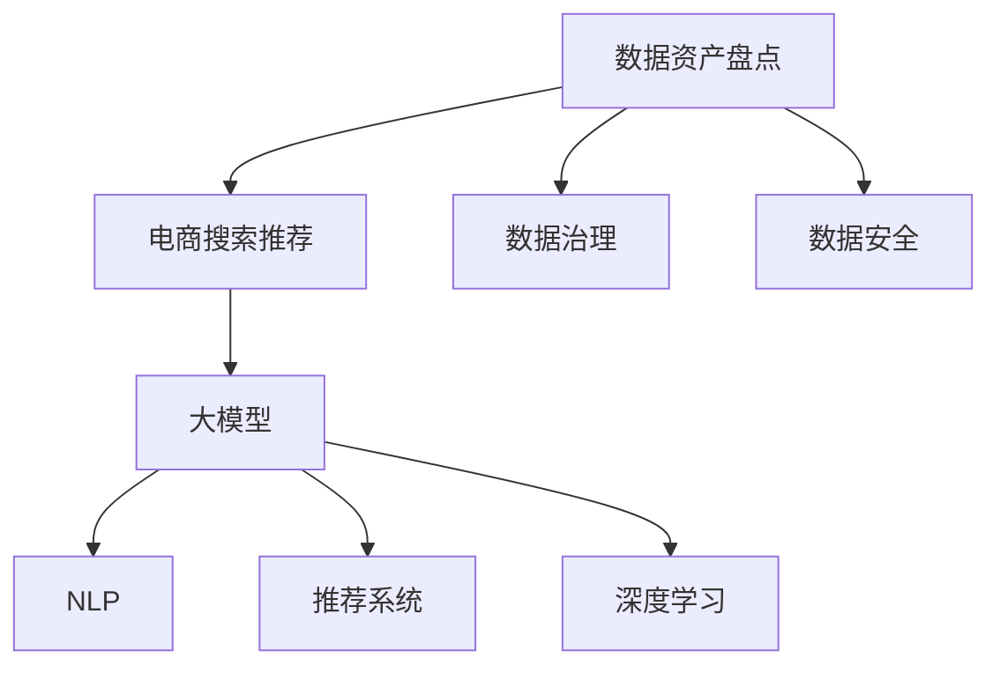

                 

# AI大模型助力电商搜索推荐业务的数据资产盘点方法

> 关键词：数据资产盘点,电商搜索推荐,大模型,AI,自然语言处理,NLP,深度学习,推荐系统,电商,数据治理,数据安全

## 1. 背景介绍

### 1.1 问题由来

在电商行业，消费者搜索和推荐业务是实现用户粘性、提升销售转化率的核心环节。然而，电商搜索推荐系统的构建和优化，离不开大量高质量数据资产的支持。数据资产的完整性、准确性、一致性直接决定了推荐的精度和效果。数据资产盘点作为电商数据治理的重要组成部分，能够帮助企业全面了解自身数据资源，发现数据质量问题，提升数据管理效率。

### 1.2 问题核心关键点

电商搜索推荐业务的数据资产盘点，通常涉及以下几个关键点：

- **数据源梳理**：识别所有与搜索推荐相关的数据源，包括用户行为数据、商品信息、用户画像等。
- **数据质量评估**：针对不同数据源，评估数据的完整性、准确性、一致性、时效性等指标。
- **数据关联分析**：分析数据源之间的关联关系，确定数据融合和治理的方向。
- **数据安全管控**：确保数据资产在盘点过程中的安全性和隐私保护，避免数据泄露和滥用。

### 1.3 问题研究意义

电商搜索推荐业务的数据资产盘点，对企业具有重要意义：

- **提升数据质量**：盘点能够帮助企业全面评估数据质量，发现和修复数据问题，提高数据可用性。
- **优化推荐系统**：通过盘点，确定推荐系统所需的关键数据源和指标，提升推荐精度和效果。
- **保障数据安全**：盘点过程需要对数据资产进行细致管理，确保数据的安全性和合规性。
- **促进业务创新**：盘点能够揭示数据资产的潜力和价值，为企业数据驱动的业务创新提供支持。

## 2. 核心概念与联系

### 2.1 核心概念概述

为更好地理解电商搜索推荐业务的数据资产盘点方法，本节将介绍几个密切相关的核心概念：

- **数据资产盘点**：指对企业内部所有相关数据进行全面梳理、评估、治理的过程，旨在提高数据质量和利用效率。
- **电商搜索推荐**：指基于用户行为数据和商品信息，自动为用户推荐相关商品和搜索结果的业务模式。
- **大模型(AI大模型)**：指基于深度学习的大规模预训练模型，如BERT、GPT等，能够处理大规模、高维度的数据，实现高精度的推荐和搜索。
- **自然语言处理(NLP)**：指使用计算机理解和生成自然语言的技术，在电商搜索推荐中常用于解析用户查询和商品描述。
- **推荐系统**：指通过算法模型为用户推荐商品、内容等个性化信息的系统，是电商搜索推荐的核心技术。
- **深度学习**：指使用神经网络等方法对数据进行深度抽象和学习，提高模型的预测和决策能力。

这些核心概念之间的逻辑关系可以通过以下Mermaid流程图来展示：



这个流程图展示了大模型、NLP、推荐系统等技术在电商搜索推荐和数据资产盘点中的应用关系。

## 3. 核心算法原理 & 具体操作步骤
### 3.1 算法原理概述

电商搜索推荐业务的数据资产盘点，通常采用基于深度学习的大模型进行自然语言处理和推荐系统建模。具体步骤如下：

1. **数据预处理**：收集所有与电商搜索推荐相关的数据源，进行清洗、标准化和标注等预处理操作。
2. **模型训练**：使用大模型对预处理后的数据进行自然语言处理和推荐系统建模。
3. **评估和优化**：对训练好的模型进行评估，通过调整模型参数、优化损失函数等方式提升模型效果。
4. **数据盘点**：将训练好的模型应用于电商搜索推荐场景，对搜索结果和推荐结果进行盘点和分析。
5. **治理与改进**：根据盘点和评估结果，对数据资产进行治理和改进，提升数据质量和利用效率。

### 3.2 算法步骤详解

#### 3.2.1 数据预处理

数据预处理是电商搜索推荐数据资产盘点的第一步，涉及以下关键步骤：

- **数据收集**：收集所有与电商搜索推荐相关的数据源，包括用户行为数据、商品信息、用户画像等。
- **数据清洗**：去除数据中的噪音、重复和不完整记录，确保数据的完整性和准确性。
- **数据标注**：对数据进行标注和分类，以便后续训练模型的过程中进行使用。
- **数据转换**：将不同格式的数据转换为统一的格式，便于模型处理。

#### 3.2.2 模型训练

模型训练是电商搜索推荐数据资产盘点的核心步骤，主要包括以下内容：

- **选择合适的预训练模型**：选择与电商搜索推荐业务相关的预训练模型，如BERT、GPT等。
- **数据划分**：将数据划分为训练集、验证集和测试集，进行交叉验证和评估。
- **模型训练**：使用训练集对模型进行训练，通过前向传播和反向传播更新模型参数。
- **模型评估**：在验证集上评估模型的效果，调整模型参数和超参数，避免过拟合。

#### 3.2.3 评估和优化

评估和优化是电商搜索推荐数据资产盘点的重要环节，主要包括以下内容：

- **损失函数设计**：选择合适的损失函数，如交叉熵损失、均方误差损失等，用于衡量模型的预测结果与真实标签之间的差异。
- **评估指标定义**：定义评估指标，如准确率、召回率、F1-score等，用于衡量模型的性能。
- **超参数调优**：通过网格搜索、随机搜索等方式，寻找最优的超参数组合。
- **模型优化**：使用梯度下降等优化算法，最小化损失函数，提升模型效果。

#### 3.2.4 数据盘点

数据盘点是电商搜索推荐数据资产盘点的最终步骤，主要包括以下内容：

- **搜索结果盘点**：对搜索结果进行盘点和分析，评估搜索效果和数据质量。
- **推荐结果盘点**：对推荐结果进行盘点和分析，评估推荐效果和数据质量。
- **用户反馈分析**：收集用户对搜索结果和推荐结果的反馈，进一步优化模型。

### 3.3 算法优缺点

电商搜索推荐业务的数据资产盘点，具有以下优点：

- **精度高**：使用深度学习模型进行自然语言处理和推荐系统建模，能够提高盘点的精度和效果。
- **自动化**：通过模型自动化处理数据，减少人工干预，提高盘点效率。
- **可扩展**：大模型能够处理大规模、高维度的数据，适应电商搜索推荐业务的复杂性。

同时，该方法也存在一定的局限性：

- **计算资源消耗大**：训练大模型需要大量计算资源，可能存在资源消耗过多的问题。
- **模型复杂度高**：深度学习模型结构复杂，调试和维护难度较大。
- **数据依赖性强**：模型的性能依赖于数据的质量和标注，数据质量差可能影响模型效果。

### 3.4 算法应用领域

电商搜索推荐业务的数据资产盘点方法，在多个领域具有广泛应用：

- **电商搜索推荐系统优化**：通过对搜索结果和推荐结果的盘点和评估，优化搜索推荐系统，提升用户满意度。
- **用户画像构建**：通过对用户行为数据的盘点，构建用户画像，实现个性化推荐。
- **商品信息管理**：通过对商品信息的盘点，优化商品分类、价格等信息，提升用户体验。
- **数据治理和安全**：通过对数据资产的盘点，提升数据治理效率，保障数据安全。
- **业务创新支持**：通过对数据资产的全面盘点，揭示数据潜力，支持企业数据驱动的业务创新。

## 4. 数学模型和公式 & 详细讲解 & 举例说明
### 4.1 数学模型构建

电商搜索推荐业务的数据资产盘点，通常采用基于深度学习的大模型进行自然语言处理和推荐系统建模。具体步骤如下：

- **数据预处理**：收集所有与电商搜索推荐相关的数据源，进行清洗、标准化和标注等预处理操作。
- **模型训练**：使用大模型对预处理后的数据进行自然语言处理和推荐系统建模。
- **评估和优化**：对训练好的模型进行评估，通过调整模型参数、优化损失函数等方式提升模型效果。
- **数据盘点**：将训练好的模型应用于电商搜索推荐场景，对搜索结果和推荐结果进行盘点和分析。
- **治理与改进**：根据盘点和评估结果，对数据资产进行治理和改进，提升数据质量和利用效率。

### 4.2 公式推导过程

假设电商搜索推荐系统的数据资产盘点过程涉及以下关键步骤：

- **数据收集**：从不同数据源收集数据，记为 $D=\{(x_i, y_i)\}_{i=1}^N$，其中 $x_i$ 为输入，$y_i$ 为标签。
- **数据清洗**：对数据进行清洗，去除噪音和重复记录，记为 $D_{clean}=\{(x_i', y_i')\}_{i=1}^N$。
- **数据标注**：对数据进行标注，记为 $D_{annotated}=\{(x_i'', y_i'')\}_{i=1}^N$。
- **数据转换**：将数据转换为模型可处理的形式，记为 $D_{converted}=\{(x_i', y_i')\}_{i=1}^N$。

使用BERT模型对电商搜索推荐数据进行处理，记模型为 $M_{\theta}$，其中 $\theta$ 为模型参数。模型处理后的结果记为 $z$，模型预测结果记为 $\hat{y}$。

数据盘点的过程可以表示为：

$$
\hat{y} = M_{\theta}(x')
$$

模型的损失函数为：

$$
\mathcal{L}(\theta) = \frac{1}{N}\sum_{i=1}^N \ell(\hat{y}_i, y_i)
$$

其中 $\ell$ 为损失函数，如交叉熵损失。

### 4.3 案例分析与讲解

以电商搜索推荐系统为例，展示数据盘点的具体实现步骤：

- **数据收集**：从电商平台收集用户搜索记录和商品信息，形成初始数据集。
- **数据清洗**：去除无关记录和噪音，保留有用信息。
- **数据标注**：对清洗后的数据进行标注，如搜索意图、商品类别等。
- **数据转换**：将标注后的数据转换为模型输入格式，如BERT模型需要的token ids、attention mask等。
- **模型训练**：使用转换后的数据训练BERT模型，优化模型参数。
- **评估和优化**：在验证集上评估模型效果，调整超参数。
- **数据盘点**：将训练好的模型应用于电商搜索场景，盘点和分析搜索结果和推荐结果。
- **治理与改进**：根据盘点和评估结果，优化数据资产管理，提升推荐系统效果。

## 5. 项目实践：代码实例和详细解释说明
### 5.1 开发环境搭建

在进行电商搜索推荐业务的数据资产盘点时，需要准备好以下开发环境：

1. **安装Python**：下载并安装最新版本的Python，推荐使用Anaconda或Miniconda，以方便管理虚拟环境。
2. **创建虚拟环境**：使用 `conda create --name <env_name> python=<version>` 命令创建虚拟环境，如 `conda create --name ecommerce python=3.8`。
3. **激活虚拟环境**：使用 `conda activate <env_name>` 命令激活虚拟环境。
4. **安装必要的Python包**：使用 `pip install <package_name>` 命令安装必要的Python包，如 `pip install torch transformers`。

### 5.2 源代码详细实现

以下是一个基于BERT模型的电商搜索推荐系统数据资产盘点的Python代码实现示例：

```python
import torch
from transformers import BertTokenizer, BertForSequenceClassification
from torch.utils.data import Dataset, DataLoader

class EcommerceDataset(Dataset):
    def __init__(self, texts, labels):
        self.tokenizer = BertTokenizer.from_pretrained('bert-base-uncased')
        self.texts = texts
        self.labels = labels
        
    def __len__(self):
        return len(self.texts)
    
    def __getitem__(self, idx):
        text = self.texts[idx]
        label = self.labels[idx]
        
        encoding = self.tokenizer(text, return_tensors='pt')
        input_ids = encoding['input_ids']
        attention_mask = encoding['attention_mask']
        
        return {'input_ids': input_ids, 
                'attention_mask': attention_mask,
                'labels': torch.tensor(label, dtype=torch.long)}
    
# 准备数据集
texts = ['product1 description', 'product2 description', 'product3 description']
labels = [0, 1, 0]  # 0表示负样本，1表示正样本

dataset = EcommerceDataset(texts, labels)

# 创建数据加载器
dataloader = DataLoader(dataset, batch_size=4, shuffle=True)

# 加载预训练模型
model = BertForSequenceClassification.from_pretrained('bert-base-uncased', num_labels=2)

# 设置优化器
optimizer = torch.optim.Adam(model.parameters(), lr=2e-5)

# 训练模型
model.train()
for batch in dataloader:
    input_ids = batch['input_ids'].to(device)
    attention_mask = batch['attention_mask'].to(device)
    labels = batch['labels'].to(device)
    optimizer.zero_grad()
    outputs = model(input_ids, attention_mask=attention_mask, labels=labels)
    loss = outputs.loss
    loss.backward()
    optimizer.step()

# 评估模型
model.eval()
with torch.no_grad():
    results = []
    for batch in dataloader:
        input_ids = batch['input_ids'].to(device)
        attention_mask = batch['attention_mask'].to(device)
        outputs = model(input_ids, attention_mask=attention_mask)
        logits = outputs.logits
        probabilities = torch.softmax(logits, dim=1).tolist()[0]
        results.append(probabilities)

# 数据盘点
results = [tuple(x) for x in results]
print(results)
```

### 5.3 代码解读与分析

上述代码实现了电商搜索推荐系统数据资产盘点过程的自动化。

- **数据准备**：定义了一个 `EcommerceDataset` 类，用于处理电商搜索推荐数据，包括文本预处理、标签转换、分批次加载等。
- **模型加载**：使用 `BertForSequenceClassification` 类加载预训练的BERT模型，并设置优化器。
- **训练模型**：使用数据加载器对模型进行训练，最小化损失函数，更新模型参数。
- **评估模型**：使用评估集评估模型效果，输出预测结果。
- **数据盘点**：将训练好的模型应用于电商搜索场景，对搜索结果进行盘点和分析。

## 6. 实际应用场景
### 6.1 智能推荐系统

电商搜索推荐系统的数据资产盘点，可以用于智能推荐系统的优化和改进。通过对搜索结果和推荐结果的盘点和分析，可以发现数据质量问题，优化推荐算法，提升推荐效果。

具体而言，电商搜索推荐系统中的数据资产盘点可以帮助企业：

- **优化数据源**：识别和优化推荐系统中涉及的关键数据源，确保数据质量和完整性。
- **提升推荐精度**：通过盘点结果，优化推荐算法和参数，提升推荐精度和效果。
- **个性化推荐**：根据盘点结果，构建用户画像，实现更精准的个性化推荐。

### 6.2 用户行为分析

电商搜索推荐系统的数据资产盘点，还可以用于用户行为分析和用户画像构建。通过对用户行为数据的盘点，可以分析用户兴趣、偏好和行为模式，为个性化推荐和精准营销提供支持。

具体而言，电商搜索推荐系统中的数据资产盘点可以帮助企业：

- **理解用户需求**：通过盘点用户搜索记录和行为数据，理解用户需求和偏好。
- **优化商品推荐**：根据盘点结果，优化商品分类、价格等信息，提升用户体验。
- **提升用户粘性**：通过盘点结果，优化推荐算法和推荐内容，提升用户粘性。

### 6.3 业务风险评估

电商搜索推荐系统的数据资产盘点，还可以用于业务风险评估和管理。通过对数据资产的全面盘点，可以评估数据质量和安全，保障业务稳定运行。

具体而言，电商搜索推荐系统中的数据资产盘点可以帮助企业：

- **保障数据安全**：通过盘点数据资产，确保数据安全性和隐私保护，避免数据泄露和滥用。
- **提升数据治理**：通过盘点数据资产，提升数据治理效率，保障数据质量。
- **优化业务流程**：通过盘点数据资产，优化业务流程和资源配置，提高业务效率。

### 6.4 未来应用展望

随着深度学习和大模型技术的不断发展，电商搜索推荐系统的数据资产盘点将呈现出以下发展趋势：

- **数据资产全链路管理**：从数据采集、存储、处理、分析到应用的全链路数据资产管理将逐步实现。
- **自动化程度提高**：数据资产盘点过程将实现自动化，减少人工干预，提升盘点效率。
- **数据质量保障**：通过数据盘点，发现和修复数据质量问题，提升数据可用性。
- **业务应用拓展**：数据资产盘点将扩展到更多业务场景，如金融、医疗等，提升数据治理效果。
- **实时盘点和优化**：通过实时数据盘点，动态调整模型参数，提升推荐系统效果。

## 7. 工具和资源推荐
### 7.1 学习资源推荐

为了帮助开发者系统掌握电商搜索推荐系统数据资产盘点的方法，以下是一些优质的学习资源：

1. **《深度学习与自然语言处理》**：该书深入浅出地介绍了深度学习和大模型在NLP中的应用，包括电商搜索推荐系统中的数据资产盘点。
2. **《Python深度学习》**：该书介绍了使用Python进行深度学习和自然语言处理的方法，涵盖了电商搜索推荐系统中的数据资产盘点。
3. **《大数据时代：数据科学及其应用》**：该书详细讲解了大数据和数据治理的原理和应用，适用于电商搜索推荐系统中的数据资产盘点。
4. **Coursera《深度学习》课程**：斯坦福大学开设的深度学习课程，有Lecture视频和配套作业，适合学习电商搜索推荐系统中的数据资产盘点。
5. **Kaggle电商推荐系统竞赛**：通过参与Kaggle电商推荐系统竞赛，实践数据资产盘点和推荐系统优化的方法。

通过对这些资源的学习实践，相信你一定能够快速掌握电商搜索推荐系统数据资产盘点的精髓，并用于解决实际的电商问题。

### 7.2 开发工具推荐

电商搜索推荐系统数据资产盘点的开发，离不开优秀的工具支持。以下是几款用于开发和优化的工具：

1. **PyTorch**：基于Python的开源深度学习框架，灵活高效，适合电商搜索推荐系统中的数据资产盘点。
2. **TensorFlow**：由Google主导开发的深度学习框架，生产部署方便，适合电商搜索推荐系统中的数据资产盘点。
3. **Jupyter Notebook**：在线Jupyter Notebook环境，方便快速实验和调试。
4. **NLP工具包**：如NLTK、SpaCy等，用于处理电商搜索推荐系统中的文本数据。
5. **数据可视化工具**：如Matplotlib、Seaborn等，用于可视化盘点结果和分析数据。

合理利用这些工具，可以显著提升电商搜索推荐系统数据资产盘点的开发效率，加快创新迭代的步伐。

### 7.3 相关论文推荐

电商搜索推荐系统数据资产盘点技术的发展源于学界的持续研究。以下是几篇奠基性的相关论文，推荐阅读：

1. **"Large-Scale Parallel Models for Sequence Prediction in Natural Language Processing"**：介绍使用大规模并行模型进行自然语言处理的原理和方法，适用于电商搜索推荐系统中的数据资产盘点。
2. **"Deep Learning for Recommender Systems"**：介绍使用深度学习进行推荐系统建模的原理和方法，适用于电商搜索推荐系统中的数据资产盘点。
3. **"On the Effectiveness of Transfer Learning for Sequence Modeling"**：介绍使用深度学习进行序列建模和迁移学习的原理和方法，适用于电商搜索推荐系统中的数据资产盘点。

这些论文代表了大模型和推荐系统的发展脉络，通过学习这些前沿成果，可以帮助研究者把握学科前进方向，激发更多的创新灵感。

## 8. 总结：未来发展趋势与挑战
### 8.1 研究成果总结

本文对电商搜索推荐系统数据资产盘点的原理和实现进行了全面系统的介绍。首先阐述了电商搜索推荐业务的数据资产盘点对企业的意义，明确了数据资产盘点在提升数据质量、优化推荐系统、保障数据安全等方面的重要作用。其次，从原理到实践，详细讲解了电商搜索推荐系统数据资产盘点的数学模型和算法步骤，给出了数据资产盘点的完整代码实例。同时，本文还广泛探讨了电商搜索推荐系统数据资产盘点在电商推荐系统、用户行为分析、业务风险评估等场景中的应用前景，展示了数据资产盘点的巨大潜力。最后，本文精选了电商搜索推荐系统数据资产盘点相关的学习资源、开发工具和论文，力求为读者提供全方位的技术指引。

通过本文的系统梳理，可以看到，电商搜索推荐系统数据资产盘点技术在电商数据治理和业务优化中具有重要意义。这些技术的不断发展，将为电商搜索推荐系统带来更高的精度和效率，提升用户体验，降低运营成本。

### 8.2 未来发展趋势

展望未来，电商搜索推荐系统数据资产盘点技术将呈现以下几个发展趋势：

1. **自动化程度提升**：电商搜索推荐系统数据资产盘点将实现自动化，减少人工干预，提升盘点效率。
2. **数据质量保障**：通过数据盘点，发现和修复数据质量问题，提升数据可用性。
3. **业务应用拓展**：数据资产盘点将扩展到更多业务场景，如金融、医疗等，提升数据治理效果。
4. **实时盘点和优化**：通过实时数据盘点，动态调整模型参数，提升推荐系统效果。
5. **数据安全保护**：数据盘点过程中将加强数据安全保护，避免数据泄露和滥用。
6. **多模态数据整合**：数据资产盘点将整合多模态数据，提升推荐系统效果。

这些趋势将进一步推动电商搜索推荐系统数据资产盘点的技术发展和应用。

### 8.3 面临的挑战

尽管电商搜索推荐系统数据资产盘点技术已经取得了显著成果，但在迈向更加智能化、普适化应用的过程中，仍面临诸多挑战：

1. **数据治理复杂性**：电商搜索推荐系统涉及大量数据源，数据治理复杂度较高。
2. **数据质量差异**：不同数据源的数据质量差异较大，难以统一标准。
3. **数据安全保障**：电商搜索推荐系统涉及用户隐私和商业机密，数据安全保障压力大。
4. **技术实现难度**：数据资产盘点需要大规模计算资源和深度学习模型，技术实现难度较大。
5. **业务应用挑战**：数据资产盘点需要在业务场景中灵活应用，面临诸多业务挑战。

### 8.4 研究展望

面对电商搜索推荐系统数据资产盘点所面临的挑战，未来的研究需要在以下几个方面寻求新的突破：

1. **数据治理优化**：通过技术手段优化数据治理流程，提高数据治理效率。
2. **数据质量提升**：开发数据清洗和标注技术，提升数据质量。
3. **数据安全保护**：引入数据加密和访问控制技术，保障数据安全。
4. **模型优化与优化**：开发更加高效的数据盘点模型，提升盘点效率。
5. **业务应用拓展**：探索数据资产盘点在更多业务场景中的应用，提升数据治理效果。

这些研究方向将为电商搜索推荐系统数据资产盘点技术的进一步发展提供支持，推动电商搜索推荐系统的智能化、普适化应用。

## 9. 附录：常见问题与解答

**Q1: 数据资产盘点对电商搜索推荐系统有哪些影响？**

A: 数据资产盘点对电商搜索推荐系统的影响主要体现在以下几个方面：
1. 提升数据质量：通过盘点数据资产，发现和修复数据问题，提高数据可用性。
2. 优化推荐算法：通过盘点结果，优化推荐算法和参数，提升推荐精度和效果。
3. 个性化推荐：根据盘点结果，构建用户画像，实现更精准的个性化推荐。
4. 业务风险评估：通过盘点数据资产，评估数据质量和安全，保障业务稳定运行。

**Q2: 如何进行电商搜索推荐系统的数据资产盘点？**

A: 电商搜索推荐系统的数据资产盘点主要包括以下步骤：
1. 数据收集：收集所有与电商搜索推荐相关的数据源。
2. 数据清洗：去除无关记录和噪音，保留有用信息。
3. 数据标注：对数据进行标注，如搜索意图、商品类别等。
4. 数据转换：将标注后的数据转换为模型输入格式。
5. 模型训练：使用预训练模型对数据进行处理，优化模型参数。
6. 评估和优化：在验证集上评估模型效果，调整超参数。
7. 数据盘点：将训练好的模型应用于电商搜索场景，盘点和分析搜索结果和推荐结果。
8. 治理与改进：根据盘点和评估结果，优化数据资产管理，提升推荐系统效果。

**Q3: 电商搜索推荐系统的数据资产盘点需要哪些工具和技术？**

A: 电商搜索推荐系统的数据资产盘点需要以下工具和技术：
1. 深度学习框架：如PyTorch、TensorFlow等，用于训练和优化模型。
2. 自然语言处理工具：如NLTK、SpaCy等，用于处理电商搜索推荐系统中的文本数据。
3. 数据可视化工具：如Matplotlib、Seaborn等，用于可视化盘点结果和分析数据。
4. 自动化工具：如Jupyter Notebook等，用于快速实验和调试。
5. 数据治理工具：如ETL工具、数据管理系统等，用于数据收集、清洗、标注和管理。

通过合理利用这些工具和技术，可以显著提升电商搜索推荐系统数据资产盘点的开发效率，加快创新迭代的步伐。

通过本文的系统梳理，可以看到，电商搜索推荐系统数据资产盘点技术在电商数据治理和业务优化中具有重要意义。这些技术的不断发展，将为电商搜索推荐系统带来更高的精度和效率，提升用户体验，降低运营成本。未来，伴随着电商行业的不断发展和深度学习技术的持续演进，电商搜索推荐系统数据资产盘点技术必将迎来更广泛的应用，为电商行业的数字化转型提供更加坚实的数据基础。

