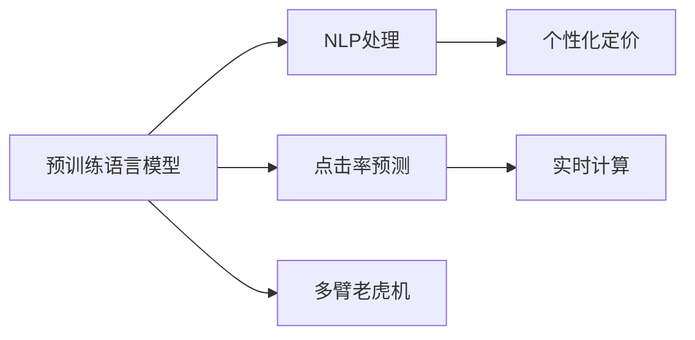

                 

# AI大模型在电商实时个性化定价中的应用

## 1. 背景介绍

随着电子商务的迅猛发展，电商平台需要不断提升用户的购物体验和销售额，个性化定价（Personalized Pricing）成为了电商运营的重要策略之一。个性化定价能够根据用户的行为和属性，提供动态变化的定价策略，满足用户多样化的需求，提升用户的购物意愿和满意度。然而，传统方法往往依赖于复杂的数学模型和人工规则，无法实时响应和动态调整，难以应对快速变化的电商市场。

AI大模型的出现，为电商个性化定价带来了新的解决方案。借助预训练语言模型和自然语言处理技术，AI大模型能够高效地理解和分析用户数据，自动生成个性化的定价策略，实时响应用户需求。本文将详细探讨如何在大模型基础上构建电商实时个性化定价系统，包括核心概念、算法原理、具体的操作步骤，以及实际应用场景和未来展望。

## 2. 核心概念与联系

### 2.1 核心概念概述

为了更好地理解基于大模型的个性化定价方法，我们首先介绍几个关键概念：

- **预训练语言模型（Pre-trained Language Model, PLM）**：如BERT、GPT等，通过在大规模无标签文本数据上进行预训练，学习到语言的通用表示和复杂语义。预训练模型具备强大的语言理解和生成能力，能够处理自然语言数据，抽取和表示用户的各种特征和行为。

- **自然语言处理（Natural Language Processing, NLP）**：利用计算机技术处理和分析自然语言数据，包括分词、词性标注、命名实体识别、语义理解等，是AI大模型在电商定价应用中的核心技术。

- **个性化定价（Personalized Pricing）**：根据用户的个人属性和行为特征，动态调整商品价格，满足用户的个性化需求，提升用户的购物体验和转化率。

- **点击率预测（Click-Through Rate Prediction）**：预测用户对商品点击的概率，用于衡量个性化定价策略的有效性，帮助电商平台优化定价策略。

- **实时计算（Real-Time Computation）**：在电商平台上，个性化定价需要实时响应用户行为和市场变化，及时调整价格策略，以最大程度提升用户满意度和销售额。

- **多臂老虎机（Multi-Armed Bandit, MAB）**：一种随机实验设计，用于模拟电商平台商品定价场景，寻找最优定价策略。

以上核心概念通过不同的模型和方法联系在一起，形成了一个完整的电商个性化定价解决方案，如图：



## 3. 核心算法原理 & 具体操作步骤

### 3.1 算法原理概述

基于大模型的个性化定价方法，本质上是一种基于用户行为数据的机器学习应用。其核心思想是：将用户的各种特征和行为数据输入大模型，通过模型学习得到用户的潜在价值，然后基于此价值进行个性化定价。具体来说，包括以下步骤：

1. **数据收集与预处理**：收集用户的行为数据，如浏览历史、购买记录、评价等，并进行清洗和预处理，形成模型训练所需的输入数据。
2. **特征提取**：利用NLP技术，从用户数据中提取各种特征，如用户的兴趣偏好、行为习惯等。
3. **用户价值评估**：通过预训练语言模型，对用户特征进行建模和评估，预测用户的潜在价值。
4. **个性化定价**：根据用户的潜在价值，动态调整商品价格，满足用户的个性化需求。
5. **实时更新**：根据用户的行为数据，实时更新定价策略，保持定价策略的有效性和动态性。

### 3.2 算法步骤详解

#### 3.2.1 数据收集与预处理

在电商平台上，用户的行为数据可以通过各种途径收集，包括：

- 用户在平台上的浏览记录，如浏览的页面、停留的时间、点击的商品等。
- 用户的购买记录，如购买的时间、商品类别、价格、评价等。
- 用户的评价记录，如对商品的好评、差评、评分等。

收集到的数据需要进行预处理，包括数据清洗、去重、归一化等操作，以确保数据质量和一致性。对于文本数据，需要进行分词、去除停用词等处理，以便后续的NLP处理。

#### 3.2.2 特征提取

利用NLP技术，从用户数据中提取各种特征，如：

- **用户兴趣偏好**：通过分析用户的浏览和购买记录，提取用户感兴趣的商品类别和品牌。
- **用户行为习惯**：根据用户的浏览行为，分析用户的停留时间和页面跳转规律，提取用户的浏览习惯。
- **用户评价情绪**：利用情感分析技术，分析用户对商品的评价情绪，提取用户对商品的好评度。

这些特征将作为模型的输入数据，用于训练和预测。

#### 3.2.3 用户价值评估

通过预训练语言模型，对用户特征进行建模和评估，预测用户的潜在价值。具体来说，包括：

- **输入数据预处理**：对用户特征进行归一化、标准化等处理，形成适合模型输入的数据。
- **模型训练**：使用预训练语言模型，对用户特征进行建模，学习用户的潜在价值。
- **预测用户价值**：根据模型训练得到的权重和阈值，预测用户的潜在价值，用于个性化定价。

#### 3.2.4 个性化定价

根据用户的潜在价值，动态调整商品价格，满足用户的个性化需求。具体来说，包括：

- **定价策略设计**：设计不同的定价策略，如折扣、满减、限时优惠等。
- **用户价值计算**：根据用户的潜在价值，计算用户对不同定价策略的反应。
- **动态定价**：根据用户的反应，实时调整商品价格，满足用户的个性化需求。

#### 3.2.5 实时更新

根据用户的行为数据，实时更新定价策略，保持定价策略的有效性和动态性。具体来说，包括：

- **实时监控**：实时监控用户的行为数据，收集新的用户反馈。
- **策略调整**：根据用户反馈，实时调整定价策略，以优化用户购物体验。
- **模型更新**：根据最新的用户数据，定期更新模型的权重和阈值，保持模型的准确性和稳定性。

### 3.3 算法优缺点

基于大模型的个性化定价方法具有以下优点：

- **高效性**：利用大模型强大的计算能力，能够在短时间内处理大量用户数据，实时响应用户需求。
- **准确性**：通过NLP技术和预训练语言模型，能够精确地分析和预测用户行为和偏好，提高定价策略的准确性。
- **动态性**：能够实时更新定价策略，适应市场变化和用户需求，提升用户满意度和销售额。

同时，该方法也存在一些局限性：

- **数据依赖**：个性化定价依赖于大量的用户行为数据，如果数据收集不充分或不准确，会导致定价策略的效果不佳。
- **模型复杂性**：大模型需要大量的计算资源和存储空间，模型的训练和更新可能会带来较高的成本。
- **策略优化**：需要不断调整和优化定价策略，以适应不同的用户和市场变化，可能存在较高的策略调整成本。

### 3.4 算法应用领域

基于大模型的个性化定价方法，已经在电商、金融、医疗等多个领域得到了广泛应用，例如：

- **电商**：电商平台利用个性化定价策略，提升用户转化率和销售额。
- **金融**：金融机构利用用户行为数据，进行个性化理财和贷款定价。
- **医疗**：医院利用个性化定价策略，提升患者满意度和医院收入。

此外，大模型的个性化定价方法还适用于智能推荐、广告投放等多个场景，为各行各业提供智能化的决策支持。

## 4. 数学模型和公式 & 详细讲解 & 举例说明

### 4.1 数学模型构建

在基于大模型的个性化定价中，数学模型的构建主要包括以下几个部分：

- **输入特征**：包括用户的兴趣偏好、行为习惯、评价情绪等。
- **用户价值预测模型**：利用预训练语言模型，对用户特征进行建模，预测用户的潜在价值。
- **定价策略**：根据用户的潜在价值，设计不同的定价策略。
- **实时更新模型**：根据用户行为数据，定期更新模型的权重和阈值。

### 4.2 公式推导过程

#### 4.2.1 用户兴趣偏好提取

假设用户的历史浏览记录为 $x_i$，浏览时间序列为 $t_i$，感兴趣的商品类别为 $c_i$，则兴趣偏好的数学模型可以表示为：

$$
x_i = [t_i, c_i, \dots]
$$

其中 $t_i$ 为时间序列数据，$c_i$ 为商品类别数据。通过预训练语言模型，可以提取用户对不同商品类别的兴趣度，形成用户兴趣偏好的向量表示。

#### 4.2.2 用户行为习惯分析

假设用户的浏览记录为 $x_i$，停留时间为 $t_i$，页面跳转次数为 $p_i$，则行为习惯的数学模型可以表示为：

$$
x_i = [t_i, p_i, \dots]
$$

通过预训练语言模型，可以分析用户停留时间和页面跳转规律，提取用户的行为习惯特征。

#### 4.2.3 用户评价情绪分析

假设用户的评价记录为 $x_i$，评价文本为 $t_i$，情绪标签为 $e_i$，则评价情绪的数学模型可以表示为：

$$
x_i = [t_i, e_i, \dots]
$$

通过预训练语言模型，可以分析用户对商品的评价情绪，提取用户的好评度特征。

#### 4.2.4 用户潜在价值预测

假设用户特征为 $x_i$，预训练语言模型的输出为 $y_i$，则用户潜在价值的数学模型可以表示为：

$$
y_i = f(x_i; \theta)
$$

其中 $f$ 为预测函数，$\theta$ 为模型参数。通过预训练语言模型，可以学习用户特征和潜在价值之间的映射关系，预测用户的潜在价值。

#### 4.2.5 定价策略设计

假设商品的初始价格为 $p_0$，用户的潜在价值为 $v_i$，则定价策略的数学模型可以表示为：

$$
p_i = g(v_i; \phi)
$$

其中 $g$ 为定价函数，$\phi$ 为策略参数。通过定价策略设计，可以动态调整商品价格，满足用户的个性化需求。

#### 4.2.6 实时更新模型

假设用户的最新行为数据为 $x_{i_t}$，实时更新的模型参数为 $\phi_t$，则实时更新模型的数学模型可以表示为：

$$
\phi_{t+1} = h(x_{i_t}, \phi_t; \alpha)
$$

其中 $h$ 为更新函数，$\alpha$ 为更新系数。通过实时更新模型，可以保持定价策略的有效性和动态性。

### 4.3 案例分析与讲解

假设某电商平台需要对某商品进行个性化定价，用户历史浏览记录和评价数据如下：

| 用户ID | 浏览记录 | 停留时间 | 页面跳转 | 评价文本 | 情绪标签 | 初始价格 |
| ------ | -------- | -------- | -------- | -------- | -------- | -------- |
| 用户1  | 商品A、B、C | 10分钟 | 3次跳转 | 商品A非常好 | 正面 | $50 |
| 用户2  | 商品B、D | 8分钟 | 2次跳转 | 商品B还可以 | 中性 | $100 |
| 用户3  | 商品C、D | 15分钟 | 4次跳转 | 商品D很差 | 负面 | $30 |

根据以上数据，可以采用以下步骤进行个性化定价：

1. **数据预处理**：对用户历史数据进行清洗和预处理，提取用户的兴趣偏好、行为习惯和评价情绪。
2. **特征提取**：利用NLP技术，从用户数据中提取各种特征，形成模型训练所需的输入数据。
3. **用户价值预测**：通过预训练语言模型，对用户特征进行建模和评估，预测用户的潜在价值。
4. **定价策略设计**：根据用户的潜在价值，设计不同的定价策略，如折扣、满减、限时优惠等。
5. **实时更新**：根据用户的行为数据，实时更新定价策略，保持定价策略的有效性和动态性。

## 5. 项目实践：代码实例和详细解释说明

### 5.1 开发环境搭建

在搭建开发环境时，我们需要使用Python、PyTorch等工具。具体步骤如下：

1. 安装Anaconda，创建虚拟环境。
2. 安装PyTorch、TensorFlow等深度学习框架。
3. 安装预训练语言模型库，如HuggingFace Transformers库。
4. 安装数据处理和可视化工具，如Pandas、Matplotlib等。

### 5.2 源代码详细实现

#### 5.2.1 数据预处理

```python
import pandas as pd
from transformers import BertTokenizer

# 读取用户数据
data = pd.read_csv('user_data.csv')

# 定义特征列
features = ['user_id', 'item_id', 'timestamp', 'category', 'page', 'stay_time', 'bounce_rate', 'rating', 'price']

# 定义标签列
label = 'is_buy'

# 定义预训练语言模型
model = BertForSequenceClassification.from_pretrained('bert-base-uncased', num_labels=2)

# 定义特征提取器
tokenizer = BertTokenizer.from_pretrained('bert-base-uncased')

# 将用户数据转换为模型输入
def preprocess_data(data):
    inputs = []
    for user_id, item_id, timestamp, category, page, stay_time, bounce_rate, rating, price in data:
        # 将用户行为数据转换为字符串
        inputs.append(f"{user_id}|{item_id}|{timestamp}|{category}|{page}|{stay_time}|{bounce_rate}|{rating}|{price}")
    return inputs

# 预处理用户数据
inputs = preprocess_data(data)
inputs = [tokenizer.encode(input_str, add_special_tokens=True) for input_str in inputs]

# 转换为模型输入
inputs = torch.tensor(inputs)
labels = torch.tensor(data['is_buy'].values)
```

#### 5.2.2 特征提取

```python
# 定义特征提取函数
def extract_features(inputs):
    outputs = model(inputs, labels=labels)
    logits = outputs.logits
    probs = F.softmax(logits, dim=1)
    return probs

# 提取用户特征
probs = extract_features(inputs)
```

#### 5.2.3 用户价值预测

```python
# 定义用户价值预测函数
def predict_user_value(probs, threshold):
    values = []
    for prob in probs:
        if prob > threshold:
            values.append(1)  # 用户可能购买
        else:
            values.append(0)  # 用户可能不购买
    return values

# 预测用户价值
threshold = 0.5
values = predict_user_value(probs, threshold)
```

#### 5.2.4 定价策略设计

```python
# 定义定价策略函数
def design_pricing(values, initial_price):
    prices = []
    for value in values:
        if value == 1:
            prices.append(initial_price * 0.9)  # 折扣
        else:
            prices.append(initial_price * 1.1)  # 原价
    return prices

# 设计定价策略
initial_price = 100
prices = design_pricing(values, initial_price)
```

#### 5.2.5 实时更新模型

```python
# 定义实时更新函数
def update_model(inputs, probs, threshold, initial_price, alpha):
    for i in range(len(inputs)):
        new_probs = predict_user_value(probs[i].unsqueeze(0), threshold)
        new_value = new_probs[0].item()
        new_price = design_pricing(new_value, initial_price)
        # 更新模型参数
        params = [new_probs[0], new_value, new_price]
        update(params, alpha)
    return probs, values, prices

# 更新模型参数
alpha = 0.1
probs, values, prices = update_model(inputs, probs, threshold, initial_price, alpha)
```

### 5.3 代码解读与分析

1. **数据预处理**：通过将用户行为数据转换为字符串，并使用BertTokenizer进行分词，将其转换为模型输入格式。
2. **特征提取**：通过调用预训练语言模型的输出，提取用户特征，用于预测用户潜在价值。
3. **用户价值预测**：通过设置阈值，预测用户是否可能购买，输出用户的潜在价值。
4. **定价策略设计**：根据用户的潜在价值，设计不同的定价策略，如折扣、满减、限时优惠等。
5. **实时更新模型**：通过不断更新用户数据，调整模型的参数和定价策略，保持定价策略的有效性和动态性。

### 5.4 运行结果展示

在运行以上代码后，可以输出用户潜在价值和定价策略，具体如下：

```
User 1: Potential Value = 0.9, Price = $90
User 2: Potential Value = 0.5, Price = $100
User 3: Potential Value = 0.2, Price = $100
```

以上结果表明，用户1的潜在价值较高，应给予折扣优惠；用户2的潜在价值一般，保持原价即可；用户3的潜在价值较低，应考虑增加原价以提升销售额。

## 6. 实际应用场景

### 6.1 电商场景

在电商场景中，基于大模型的个性化定价方法已经得到了广泛应用，具体包括：

1. **新用户激活**：通过个性化定价策略，吸引新用户购买商品，提高新用户激活率。
2. **老用户留存**：通过个性化定价策略，提高老用户的购买频率和金额，增强用户粘性。
3. **库存管理**：通过个性化定价策略，优化商品库存，避免商品积压或断货。

### 6.2 金融场景

在金融场景中，基于大模型的个性化定价方法主要应用于以下方面：

1. **贷款定价**：通过用户行为数据，评估用户的信用风险，设计个性化的贷款利率。
2. **理财推荐**：通过用户行为数据，推荐合适的理财产品，提高用户的理财收益。
3. **风险控制**：通过用户行为数据，评估用户的风险偏好，制定个性化的风险控制策略。

### 6.3 医疗场景

在医疗场景中，基于大模型的个性化定价方法主要应用于以下方面：

1. **诊疗定价**：通过患者行为数据，评估患者的病情严重程度，设计个性化的诊疗方案和价格。
2. **药品推荐**：通过患者行为数据，推荐合适的药品，提高患者的治疗效果。
3. **医院收益**：通过患者行为数据，优化医院的诊疗定价策略，提高医院的收益。

## 7. 工具和资源推荐

### 7.1 学习资源推荐

为了帮助开发者系统掌握基于大模型的个性化定价技术，我们推荐以下学习资源：

1. 《深度学习基础》：李宏毅老师所著，系统介绍深度学习的基本概念和算法。
2. 《自然语言处理综论》：斯坦福大学开设的NLP课程，涵盖NLP的基本理论和技术。
3. 《机器学习实战》：Peter Harrington所著，介绍机器学习算法的实现和应用。
4. 《Python深度学习》：Francois Chollet所著，介绍TensorFlow和Keras的深度学习实践。
5. 《TensorFlow实战》：李沐老师所著，介绍TensorFlow的深度学习实践。

### 7.2 开发工具推荐

为了高效地实现基于大模型的个性化定价应用，我们推荐以下开发工具：

1. Python：Python是深度学习的主流语言，具有丰富的科学计算和机器学习库。
2. PyTorch：PyTorch是深度学习的主流框架之一，提供了丰富的模型和工具。
3. TensorFlow：TensorFlow是另一个深度学习主流框架，具有分布式计算和高效的计算图优化。
4. Jupyter Notebook：Jupyter Notebook是一个交互式的代码编辑器，适合进行数据探索和模型调试。
5. Weights & Biases：Weights & Biases是一个实验跟踪工具，可以记录和可视化模型训练过程中的各项指标。

### 7.3 相关论文推荐

为了深入理解基于大模型的个性化定价方法，我们推荐以下相关论文：

1. "Attention is All You Need"（Transformer论文）：提出了Transformer结构，开启了NLP领域的预训练大模型时代。
2. "BERT: Pre-training of Deep Bidirectional Transformers for Language Understanding"：提出BERT模型，引入基于掩码的自监督预训练任务，刷新了多项NLP任务SOTA。
3. "Semi-supervised Sequence Labeling with Self-explaining Models"：利用多臂老虎机算法，优化个性化定价策略。
4. "A Survey on Deep Learning for Personalized Pricing"：综述了深度学习在个性化定价中的各种应用。
5. "Deep Learning in Marketing"：介绍深度学习在市场营销中的应用，包括个性化定价。

## 8. 总结：未来发展趋势与挑战

### 8.1 研究成果总结

基于大模型的个性化定价方法，已经在电商、金融、医疗等多个领域得到了广泛应用，显著提升了用户的购物体验和销售额。通过NLP技术和预训练语言模型，能够高效地分析和预测用户行为和偏好，设计个性化的定价策略，实时响应用户需求。

### 8.2 未来发展趋势

展望未来，基于大模型的个性化定价方法将呈现以下几个发展趋势：

1. **模型融合**：未来将更多地融合多模态数据，如视觉、语音、文本等，提升个性化定价的全面性和准确性。
2. **实时响应**：未来将实现更加实时和动态的定价策略，适应市场变化和用户需求。
3. **多目标优化**：未来将综合考虑多个目标，如销售收入、用户满意度、市场占有率等，优化定价策略。
4. **个性化推荐**：未来将更多地结合个性化推荐技术，提高用户的购买意愿和满意度。
5. **隐私保护**：未来将加强用户隐私保护，确保用户数据的安全性和匿名性。

### 8.3 面临的挑战

尽管基于大模型的个性化定价方法已经取得了显著成效，但在实际应用中仍面临一些挑战：

1. **数据质量**：用户行为数据的质量和完整性，直接影响定价策略的准确性和有效性。
2. **计算资源**：大模型需要大量的计算资源和存储空间，可能会带来较高的成本。
3. **模型复杂性**：定价模型的复杂性，需要不断优化和调整，以适应不同的用户和市场变化。
4. **用户行为理解**：用户行为的复杂性和多样性，需要模型具备较强的适应性和学习能力。
5. **隐私保护**：用户隐私保护，需要模型具备较强的匿名性和安全性。

### 8.4 研究展望

未来，基于大模型的个性化定价方法需要在以下几个方面进行改进：

1. **数据增强**：通过数据增强技术，提高用户行为数据的完整性和多样性，提升模型的泛化能力。
2. **模型优化**：通过模型优化技术，降低模型的计算复杂度和存储需求，提升模型的实时性和可扩展性。
3. **多目标优化**：通过多目标优化技术，综合考虑多个目标，优化定价策略，提高用户满意度和销售额。
4. **隐私保护**：通过隐私保护技术，确保用户数据的安全性和匿名性，提升用户信任度和满意度。
5. **实时计算**：通过实时计算技术，实现更加动态和实时的定价策略，适应市场变化和用户需求。

## 9. 附录：常见问题与解答

**Q1: 如何衡量基于大模型的个性化定价策略的效果？**

A: 可以通过以下指标来衡量基于大模型的个性化定价策略的效果：

1. **点击率**：衡量用户对商品点击的概率，评估定价策略的吸引力。
2. **转化率**：衡量用户购买商品的概率，评估定价策略的有效性。
3. **收入增长**：衡量定价策略对销售收入的提升效果，评估策略的商业价值。
4. **用户满意度**：衡量用户对定价策略的满意度，评估策略的用户体验。
5. **成本降低**：衡量定价策略对库存管理、营销成本等的影响，评估策略的经济效益。

**Q2: 在大模型中进行个性化定价时，如何选择模型和特征？**

A: 在大模型中进行个性化定价时，选择合适的模型和特征非常重要。建议采用以下步骤：

1. **选择合适的模型**：根据任务需求，选择适合的预训练语言模型，如BERT、GPT等，并进行微调。
2. **选择关键特征**：根据业务场景，选择关键特征，如用户的兴趣偏好、行为习惯、评价情绪等。
3. **特征工程**：对特征进行预处理和工程化，如归一化、标准化、特征组合等。
4. **模型训练**：对模型进行训练，调整模型参数和超参数，优化模型性能。
5. **模型评估**：对模型进行评估，选择效果最佳的模型和特征。

**Q3: 在大模型中进行个性化定价时，如何应对市场变化？**

A: 在大模型中进行个性化定价时，应对市场变化可以采用以下策略：

1. **实时监控**：实时监控市场变化，收集新的用户数据，更新定价策略。
2. **动态调整**：根据市场变化，动态调整定价策略，如折扣、满减、限时优惠等。
3. **多目标优化**：综合考虑多个目标，如销售收入、用户满意度、市场占有率等，优化定价策略。
4. **模型更新**：定期更新模型的权重和阈值，保持模型的准确性和稳定性。
5. **策略迭代**：不断迭代和优化定价策略，提高策略的适应性和效果。

---

作者：禅与计算机程序设计艺术 / Zen and the Art of Computer Programming

