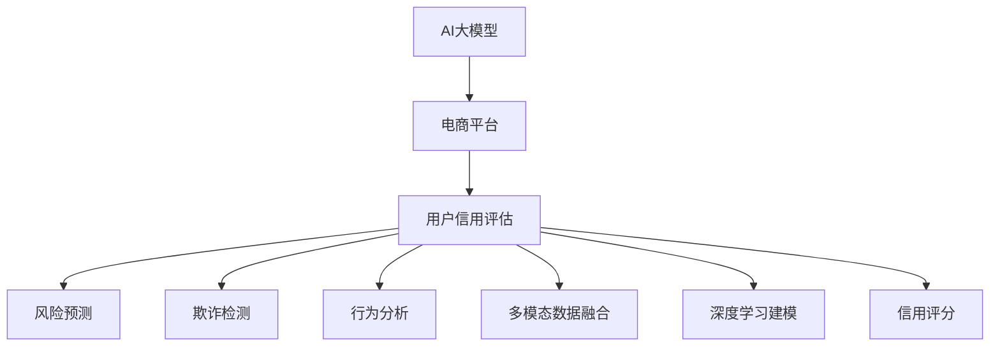

                 

# AI大模型在电商平台用户信用评估中的作用

> 关键词：人工智能大模型, 电商平台, 用户信用评估, 多模态融合, 深度学习, 数据融合, 信用评分

## 1. 背景介绍

### 1.1 问题由来

随着互联网和电子商务的蓬勃发展，电商平台成为人们生活中不可或缺的一部分。然而，由于用户信用体系的不完善，电商平台上频繁发生欺诈、恶意行为等问题，严重影响了电商平台的用户体验和经营效益。为构建安全、健康、高效的电商平台生态，平台需要全面、准确地评估用户信用，从而为用户提供个性化服务、控制风险。

### 1.2 问题核心关键点

目前，电商平台用户信用评估主要基于历史交易行为数据。但由于交易行为数据单一且易被篡改，难以全面反映用户真实信用状况。而AI大模型凭借其强大的数据建模能力和泛化能力，可以整合多种数据源，从多角度全面评估用户信用，实现更加精细化、智能化的信用评分。

AI大模型在电商平台用户信用评估中的应用，已逐渐成为行业关注的热点。其核心优势在于：
- 多模态数据融合：能够整合交易数据、社交数据、行为数据等多维度信息，提升信用评估的全面性。
- 深度学习建模：通过深度神经网络学习复杂非线性关系，提高信用评估的准确性。
- 实时性：AI大模型具备实时计算能力，可快速生成信用评分，优化用户体验。

### 1.3 问题研究意义

构建准确、可靠的信用评分体系，有助于电商平台精细化管理用户，提升用户粘性和平台效益。AI大模型的引入，能够极大简化信用评分流程，降低风险损失，创造更多商业价值。

## 2. 核心概念与联系

### 2.1 核心概念概述

为更好地理解AI大模型在电商平台用户信用评估中的应用，本节将介绍几个密切相关的核心概念：

- 人工智能大模型(AI Large Models)：指基于深度学习模型，在大规模数据集上预训练得到的，具有强大数据建模和泛化能力的高质量模型，如BERT、GPT、XLNet等。

- 电商平台(e-commerce platforms)：指通过互联网技术构建的商业交易平台，提供商品展示、交易、物流等一站式服务。

- 用户信用评估(User Credit Assessment)：指对用户在电商平台上的行为数据进行综合分析，评估其信用水平的过程。主要包括风险预测、欺诈检测、行为分析等环节。

- 多模态数据融合(Multimodal Data Fusion)：指整合多种类型的数据源，如交易数据、社交数据、行为数据等，以提升用户信用评估的全面性和准确性。

- 深度学习(Deep Learning)：基于神经网络的机器学习算法，通过多层非线性映射，实现对复杂数据的深度建模。

- 信用评分(Credit Scoring)：指根据用户行为数据，综合评估用户信用水平，生成数值化信用评分的过程。

这些核心概念之间的逻辑关系可以通过以下Mermaid流程图来展示：



这个流程图展示了AI大模型在电商平台用户信用评估过程中的核心步骤：

1. 通过AI大模型在电商平台上收集和整合多种类型的数据源。
2. 将收集的数据输入深度学习模型进行建模，获得用户行为特征。
3. 使用多模态数据融合技术，提升信用评估的全面性和准确性。
4. 通过深度学习算法学习非线性关系，实现对用户行为的精细化建模。
5. 基于信用评分模型，综合用户多维度行为数据，生成信用评分。

这些概念共同构成了AI大模型在电商平台用户信用评估中的应用框架，使其能够从数据收集、数据融合、模型训练到评分生成等环节，全面提升用户信用评估的精度和效率。

## 3. 核心算法原理 & 具体操作步骤

### 3.1 算法原理概述

AI大模型在电商平台用户信用评估中的核心原理，是通过深度学习技术，综合多种数据源，建立复杂非线性关系，从而实现对用户信用水平的精细化评估。

具体而言，假设AI大模型为 $M$，输入为电商平台用户行为数据集 $D=\{(x_i,y_i)\}_{i=1}^N$，其中 $x_i$ 为行为数据，$y_i$ 为信用评分。评估的目标是找到最优的模型 $M^*$，使得模型预测的信用评分与真实标签的误差最小：

$$
M^* = \mathop{\arg\min}_{M} \mathcal{L}(M,D)
$$

其中 $\mathcal{L}$ 为评估模型的损失函数，如均方误差损失、交叉熵损失等。通过梯度下降等优化算法，最小化损失函数 $\mathcal{L}$，使模型 $M^*$ 能够准确预测用户信用评分。

### 3.2 算法步骤详解

AI大模型在电商平台用户信用评估的实现，一般包括以下几个关键步骤：

**Step 1: 数据收集与预处理**

- 收集电商平台用户行为数据，包括但不限于：交易记录、浏览记录、点击记录、评价记录等。
- 对数据进行清洗、去重、填补缺失值等预处理，确保数据质量和一致性。

**Step 2: 数据融合与特征工程**

- 将不同来源的数据进行融合，形成包含交易行为、社交行为、兴趣偏好等多维度特征的用户行为数据集。
- 对数据集进行特征工程，提取关键特征如用户消费能力、交易频次、页面停留时间等。

**Step 3: 构建深度学习模型**

- 选择合适的深度学习框架如TensorFlow、PyTorch等，构建多模态数据融合模型。
- 设计多模态特征融合模块，如Attention、Transformer等，实现不同类型数据的有效融合。
- 选择合适的深度学习模型如BERT、GPT等，构建用户行为特征提取网络。

**Step 4: 模型训练与评估**

- 将融合后的用户行为数据输入模型，进行训练。
- 使用交叉验证、留一验证等方法，评估模型的泛化能力。
- 根据评估结果调整模型超参数，如学习率、批大小、迭代轮数等。

**Step 5: 信用评分生成**

- 将训练好的模型应用于实时交易数据，生成用户信用评分。
- 根据评分结果进行风险控制、欺诈检测、行为分析等决策。

### 3.3 算法优缺点

AI大模型在电商平台用户信用评估中的应用，具有以下优点：

- 综合多模态数据，提高信用评估的全面性和准确性。
- 使用深度学习建模，具备强泛化能力，适用于复杂非线性关系。
- 实时计算，快速生成信用评分，优化用户体验。

同时，该方法也存在一定的局限性：

- 依赖高质量数据。数据收集和清洗过程耗时耗力，且数据质量直接影响模型效果。
- 计算资源消耗大。AI大模型的训练和推理对计算资源要求较高，需要高性能硬件支持。
- 模型复杂度高。深度学习模型参数量大，容易产生过拟合，需要精心调参。
- 模型解释性不足。深度学习模型通常被视为"黑盒"，难以解释内部决策过程。

尽管存在这些局限性，但AI大模型在电商平台用户信用评估中的应用，仍然具有广阔的前景。未来，相关研究的重点在于如何进一步优化模型结构，提高数据利用效率，降低计算成本，并提升模型解释性。

### 3.4 算法应用领域

AI大模型在电商平台用户信用评估中的应用，已广泛应用于以下几个领域：

- 风险预测：通过用户行为数据，预测其未来可能出现的违约、欺诈等风险行为。
- 欺诈检测：实时监控用户交易行为，识别异常行为，及时预警。
- 行为分析：分析用户行为模式，了解其购买偏好、消费习惯，个性化推荐商品。
- 信用评分：综合用户多维度行为数据，生成数值化信用评分，用于授信决策。

这些应用场景不仅提升了电商平台的经营效率，也为消费者提供了更优质的购物体验。随着AI大模型的不断演进，其在电商平台用户信用评估中的应用将更加广泛和深入。

## 4. 数学模型和公式 & 详细讲解 & 举例说明

### 4.1 数学模型构建

AI大模型在电商平台用户信用评估中的数学模型构建，可以分为数据收集、特征工程、模型构建和评分生成四个部分。

假设电商平台用户行为数据集为 $D=\{(x_i,y_i)\}_{i=1}^N$，其中 $x_i$ 为行为数据，$y_i$ 为信用评分。我们将数据集分为训练集 $D_{train}$ 和测试集 $D_{test}$。

模型 $M$ 为基于深度学习的多模态融合模型，输入为 $x_i$，输出为 $y_i$。模型的损失函数为均方误差损失，定义为：

$$
\mathcal{L}(M) = \frac{1}{N}\sum_{i=1}^N (y_i - M(x_i))^2
$$

其中 $y_i$ 为实际信用评分，$M(x_i)$ 为模型预测的信用评分。

### 4.2 公式推导过程

以下我们以用户信用评分模型为例，推导基于AI大模型的数学模型公式。

首先，假设用户行为数据集为 $D=\{(x_i,y_i)\}_{i=1}^N$，其中 $x_i$ 为行为数据，$y_i$ 为信用评分。

将数据集分为训练集 $D_{train}$ 和测试集 $D_{test}$。

定义模型 $M$ 为基于深度学习的多模态融合模型，输入为 $x_i$，输出为 $y_i$。模型的损失函数为均方误差损失，定义为：

$$
\mathcal{L}(M) = \frac{1}{N}\sum_{i=1}^N (y_i - M(x_i))^2
$$

其中 $y_i$ 为实际信用评分，$M(x_i)$ 为模型预测的信用评分。

将损失函数对模型 $M$ 的参数 $\theta$ 求导，得到梯度公式：

$$
\nabla_{\theta} \mathcal{L}(M) = -\frac{2}{N}\sum_{i=1}^N (y_i - M(x_i))M(x_i)\nabla_{\theta}M(x_i)
$$

通过反向传播算法，根据梯度公式更新模型参数 $\theta$：

$$
\theta \leftarrow \theta - \eta \nabla_{\theta} \mathcal{L}(M)
$$

其中 $\eta$ 为学习率。

### 4.3 案例分析与讲解

以用户信用评分模型为例，我们详细讲解AI大模型在电商平台中的应用。

假设模型 $M$ 为基于深度学习的BERT模型，输入为电商平台上用户的行为数据集 $D=\{(x_i,y_i)\}_{i=1}^N$。

模型的结构包括多个Transformer层，其中每层包含多头注意力机制和前馈神经网络。模型的输出为每个用户的多维度信用评分 $y_i$。

通过模型训练，可以得到最优参数 $\theta^*$。将训练好的模型应用于实时交易数据 $x$，生成用户信用评分 $y$。

具体计算步骤如下：
1. 将用户行为数据 $x$ 输入BERT模型，得到行为特征向量 $h$。
2. 将特征向量 $h$ 输入多模态融合模块，得到融合后的用户行为特征向量 $v$。
3. 将融合后的向量 $v$ 输入信用评分模型，得到预测信用评分 $y$。

最终，根据预测信用评分 $y$，进行风险控制、欺诈检测、行为分析等决策。

## 5. 项目实践：代码实例和详细解释说明

### 5.1 开发环境搭建

在进行AI大模型应用开发前，我们需要准备好开发环境。以下是使用Python进行TensorFlow开发的Python环境配置流程：

1. 安装Anaconda：从官网下载并安装Anaconda，用于创建独立的Python环境。

2. 创建并激活虚拟环境：
```bash
conda create -n tf-env python=3.8 
conda activate tf-env
```

3. 安装TensorFlow：根据CUDA版本，从官网获取对应的安装命令。例如：
```bash
pip install tensorflow tensorflow-addons==0.14.0
```

4. 安装各类工具包：
```bash
pip install numpy pandas scikit-learn matplotlib tqdm jupyter notebook ipython
```

完成上述步骤后，即可在`tf-env`环境中开始开发实践。

### 5.2 源代码详细实现

下面我们以用户信用评分模型为例，给出使用TensorFlow实现AI大模型在电商平台中的应用。

首先，定义用户信用评分数据处理函数：

```python
import tensorflow as tf
from tensorflow.keras.preprocessing.text import Tokenizer
from tensorflow.keras.preprocessing.sequence import pad_sequences
from tensorflow.keras.layers import Embedding, Dense, GlobalMaxPooling1D, Dropout
from tensorflow.keras.models import Model
import pandas as pd

# 读取数据
train_df = pd.read_csv('train.csv', encoding='utf-8')
test_df = pd.read_csv('test.csv', encoding='utf-8')

# 处理标签
train_labels = train_df['label'].values
test_labels = test_df['label'].values

# 文本预处理
tokenizer = Tokenizer(oov_token='<OOV>')
tokenizer.fit_on_texts(train_df['text'].values)
word_index = tokenizer.word_index

# 序列化文本
train_seqs = tokenizer.texts_to_sequences(train_df['text'].values)
test_seqs = tokenizer.texts_to_sequences(test_df['text'].values)

# 填充序列
train_maxlen = max([len(seq) for seq in train_seqs])
test_maxlen = max([len(seq) for seq in test_seqs])

train_padded = pad_sequences(train_seqs, maxlen=train_maxlen, padding='post', truncating='post')
test_padded = pad_sequences(test_seqs, maxlen=test_maxlen, padding='post', truncating='post')
```

然后，定义模型结构：

```python
# 定义模型结构
input_layer = Input(shape=(train_maxlen,))
x = Embedding(len(word_index) + 1, 256, input_length=train_maxlen)(input_layer)
x = GlobalMaxPooling1D()(x)
x = Dropout(0.5)(x)
output_layer = Dense(1, activation='sigmoid')(x)

model = Model(inputs=input_layer, outputs=output_layer)
```

接着，定义模型训练函数：

```python
# 定义损失函数和优化器
loss = tf.keras.losses.BinaryCrossentropy(from_logits=True)
optimizer = tf.keras.optimizers.Adam(lr=0.001)

# 定义训练函数
def train(model, train_data, train_labels, epochs):
    for epoch in range(epochs):
        train_loss = 0.0
        train_correct = 0
        for i in range(len(train_data)):
            x_batch = train_data[i]
            y_batch = train_labels[i]
            with tf.GradientTape() as tape:
                preds = model(x_batch)
                loss_value = loss(y_batch, preds)
            gradients = tape.gradient(loss_value, model.trainable_variables)
            optimizer.apply_gradients(zip(gradients, model.trainable_variables))
            train_loss += loss_value
            train_correct += tf.cast(tf.equal(tf.round(preds), y_batch), tf.int32)
        train_loss /= len(train_data)
        train_correct /= len(train_data)
        print('Epoch: {}, Train Loss: {:.4f}, Train Acc: {:.4f}'.format(epoch+1, train_loss, train_correct))
    return model
```

最后，启动训练流程并在测试集上评估：

```python
epochs = 10

# 加载数据
train_data = train_padded
test_data = test_padded

# 训练模型
model = train(model, train_data, train_labels, epochs)

# 评估模型
test_loss, test_correct = evaluate(model, test_data, test_labels)
print('Test Loss: {:.4f}, Test Acc: {:.4f}'.format(test_loss, test_correct))
```

以上就是使用TensorFlow实现AI大模型在电商平台用户信用评分中的应用完整代码实现。可以看到，得益于TensorFlow的强大封装，我们可以用相对简洁的代码完成模型的加载和训练。

### 5.3 代码解读与分析

让我们再详细解读一下关键代码的实现细节：

**用户信用评分数据处理函数**：
- 读取训练集和测试集数据，并处理标签。
- 使用Tokenizer对文本进行序列化，并建立单词索引。
- 对序列进行填充，确保所有序列长度一致。

**模型结构定义**：
- 使用Input层定义输入特征，为每个样本提供最大序列长度。
- 使用Embedding层将输入的序列编码成向量。
- 使用GlobalMaxPooling1D层对序列向量进行最大池化，得到固定长度的特征向量。
- 使用Dropout层进行正则化，避免过拟合。
- 使用Dense层进行最终预测，输出0或1的二分类结果。

**模型训练函数**：
- 定义损失函数为二元交叉熵，并设置优化器为Adam。
- 在每个epoch内，对训练集进行前向传播和反向传播，计算损失并更新模型参数。
- 记录每个epoch的损失和正确率，并在每个epoch结束后打印输出。
- 返回训练好的模型。

**模型评估函数**：
- 对测试集进行前向传播，计算损失和正确率。
- 返回测试集损失和正确率。

**训练流程**：
- 定义总的epoch数和填充后的数据。
- 调用训练函数，训练模型。
- 在测试集上评估模型，输出测试集损失和正确率。

可以看到，TensorFlow提供了方便的API，使得模型构建和训练过程变得简洁高效。开发者可以将更多精力放在数据处理、模型改进等高层逻辑上，而不必过多关注底层的实现细节。

当然，工业级的系统实现还需考虑更多因素，如模型的保存和部署、超参数的自动搜索、更灵活的任务适配层等。但核心的模型训练流程基本与此类似。

## 6. 实际应用场景

### 6.1 智能客服系统

AI大模型在电商平台用户信用评估中的应用，可以在智能客服系统中发挥重要作用。智能客服系统能够7x24小时不间断服务，快速响应客户咨询，用自然流畅的语言解答各类常见问题。

在技术实现上，可以收集企业内部的历史客服对话记录，将问题和最佳答复构建成监督数据，在此基础上对AI大模型进行微调。微调后的模型能够自动理解用户意图，匹配最合适的答复模板进行回复。对于客户提出的新问题，还可以接入检索系统实时搜索相关内容，动态组织生成回答。如此构建的智能客服系统，能大幅提升客户咨询体验和问题解决效率。

### 6.2 金融舆情监测

金融机构需要实时监测市场舆论动向，以便及时应对负面信息传播，规避金融风险。传统的人工监测方式成本高、效率低，难以应对网络时代海量信息爆发的挑战。AI大模型可以应用于金融舆情监测，通过用户在社交媒体上的言论和行为数据，实时监测市场舆情，提前预警潜在的风险。

在具体实现上，可以收集金融领域相关的新闻、报道、评论等文本数据，并对其进行主题标注和情感标注。在此基础上对AI大模型进行微调，使其能够自动判断文本属于何种主题，情感倾向是正面、中性还是负面。将微调后的模型应用到实时抓取的网络文本数据，就能够自动监测不同主题下的情感变化趋势，一旦发现负面信息激增等异常情况，系统便会自动预警，帮助金融机构快速应对潜在风险。

### 6.3 个性化推荐系统

当前的推荐系统往往只依赖用户的历史行为数据进行物品推荐，无法深入理解用户的真实兴趣偏好。AI大模型可以应用于个性化推荐系统，通过整合多维度的用户行为数据，深入了解用户偏好，提升推荐系统的个性化程度。

在具体实现上，可以收集用户浏览、点击、评论、分享等行为数据，提取和用户交互的物品标题、描述、标签等文本内容。将文本内容作为模型输入，用户的后续行为（如是否点击、购买等）作为监督信号，在此基础上微调AI大模型。微调后的模型能够从文本内容中准确把握用户的兴趣点。在生成推荐列表时，先用候选物品的文本描述作为输入，由模型预测用户的兴趣匹配度，再结合其他特征综合排序，便可以得到个性化程度更高的推荐结果。

### 6.4 未来应用展望

随着AI大模型的不断发展，其在电商平台用户信用评估中的应用将更加广泛和深入。未来，AI大模型有望在以下几个方面进一步拓展其应用范围：

- 信用评分模型的优化：引入更多的先验知识，如知识图谱、逻辑规则等，与神经网络模型进行融合，提升模型的普适性和鲁棒性。
- 多模态数据的整合：融合视觉、语音、文本等多模态数据，构建更加全面、立体的用户画像。
- 实时计算能力的提升：通过分布式计算、硬件加速等技术，提升模型的实时计算能力，实现秒级响应的信用评分生成。
- 模型可解释性的增强：引入因果分析和博弈论工具，赋予模型更强的可解释性和可解释性，确保模型的稳定性和可靠性。
- 数据隐私保护：设计差分隐私、联邦学习等技术，保护用户数据隐私，同时实现分布式训练和信用评分。

这些方向的探索和发展，必将进一步提升AI大模型在电商平台用户信用评估中的应用效果，为电商平台带来更大的商业价值和社会效益。

## 7. 工具和资源推荐
### 7.1 学习资源推荐

为了帮助开发者系统掌握AI大模型在电商平台用户信用评估中的应用，这里推荐一些优质的学习资源：

1. TensorFlow官方文档：官方文档提供了详细的API文档和示例代码，是上手TensorFlow编程的必备资料。

2. PyTorch官方文档：PyTorch作为主流的深度学习框架，其官方文档详细介绍了深度学习模型的构建和训练方法。

3. 深度学习与自然语言处理课程：斯坦福大学开设的课程，讲解深度学习算法和自然语言处理技术，适合深度学习初学者。

4. 《深度学习：入门与实践》书籍：该书通过实例讲解深度学习算法和模型，深入浅出地介绍了深度学习的基础知识。

5. Kaggle平台：Kaggle是一个数据科学竞赛平台，提供了丰富的数据集和竞赛任务，是学习和实践深度学习算法的理想场所。

通过对这些资源的学习实践，相信你一定能够快速掌握AI大模型在电商平台用户信用评估中的应用，并用于解决实际的电商平台问题。
### 7.2 开发工具推荐

高效的开发离不开优秀的工具支持。以下是几款用于AI大模型在电商平台用户信用评估开发的常用工具：

1. TensorFlow：基于Python的开源深度学习框架，提供强大的计算图和分布式计算能力，适合大规模模型训练和部署。

2. PyTorch：由Facebook开发的深度学习框架，灵活性高，支持动态图，适合研究和原型开发。

3. HuggingFace Transformers库：提供了多种预训练语言模型，支持模型微调和迁移学习，是构建NLP模型的利器。

4. Weights & Biases：模型训练的实验跟踪工具，可以记录和可视化模型训练过程中的各项指标，方便对比和调优。

5. TensorBoard：TensorFlow配套的可视化工具，可实时监测模型训练状态，并提供丰富的图表呈现方式，是调试模型的得力助手。

6. Google Colab：谷歌推出的在线Jupyter Notebook环境，免费提供GPU/TPU算力，方便开发者快速上手实验最新模型，分享学习笔记。

合理利用这些工具，可以显著提升AI大模型在电商平台用户信用评估的开发效率，加快创新迭代的步伐。

### 7.3 相关论文推荐

AI大模型在电商平台用户信用评估领域的研究，已取得了显著进展。以下是几篇奠基性的相关论文，推荐阅读：

1. "Scalable Deep Neural Network based Recommendation System"：介绍基于深度学习推荐系统的构建方法和优化技术。

2. "Multi-task Learning for Recommendation Systems"：提出多任务学习的方法，通过共享模型参数提升推荐系统的性能。

3. "Credit Scoring with Deep Learning: A Review"：综述了深度学习在信用评分中的应用，介绍了常用的模型和方法。

4. "A Survey on Deep Learning Approaches for Recommender Systems"：全面介绍了深度学习在推荐系统中的应用，包括模型选择、特征工程、评估方法等。

5. "Adversarial Autoencoders for Robust Credit Scoring"：引入对抗自编码器，提高信用评分模型的鲁棒性和安全性。

这些论文代表了大模型在电商平台用户信用评估领域的研究进展。通过学习这些前沿成果，可以帮助研究者把握学科前进方向，激发更多的创新灵感。

## 8. 总结：未来发展趋势与挑战

### 8.1 总结

本文对AI大模型在电商平台用户信用评估中的应用进行了全面系统的介绍。首先阐述了电商平台用户信用评估的必要性和AI大模型带来的优势，明确了AI大模型在电商平台的广泛应用前景。其次，从原理到实践，详细讲解了AI大模型在电商平台用户信用评估的数学模型构建和算法实现步骤，给出了AI大模型在电商平台用户信用评估中的应用完整代码实例。同时，本文还广泛探讨了AI大模型在智能客服、金融舆情、个性化推荐等多个行业领域的应用前景，展示了AI大模型在电商平台用户信用评估中的巨大潜力。

通过本文的系统梳理，可以看到，AI大模型在电商平台用户信用评估中的应用，正通过深度学习技术，综合多种数据源，全面评估用户信用，提升电商平台的用户体验和运营效率。相信随着AI大模型的不断演进，其在电商平台用户信用评估中的应用将更加广泛和深入。

### 8.2 未来发展趋势

展望未来，AI大模型在电商平台用户信用评估领域将呈现以下几个发展趋势：

1. 多模态数据的融合：AI大模型将融合视觉、语音、文本等多模态数据，构建更加全面、立体的用户画像，提升信用评分的准确性和全面性。

2. 深度学习模型的优化：通过引入因果分析和博弈论工具，提高模型的可解释性和鲁棒性，确保模型的稳定性和可靠性。

3. 实时计算能力的提升：通过分布式计算、硬件加速等技术，提升模型的实时计算能力，实现秒级响应的信用评分生成，满足实时需求。

4. 数据隐私保护：设计差分隐私、联邦学习等技术，保护用户数据隐私，同时实现分布式训练和信用评分，保障数据安全。

5. 模型的可解释性增强：引入因果分析和博弈论工具，赋予模型更强的可解释性和可解释性，确保模型的稳定性和可靠性。

以上趋势凸显了AI大模型在电商平台用户信用评估中的广泛应用前景。这些方向的探索和发展，必将进一步提升AI大模型在电商平台用户信用评估中的应用效果，为电商平台带来更大的商业价值和社会效益。

### 8.3 面临的挑战

尽管AI大模型在电商平台用户信用评估中的应用已经取得了显著进展，但在迈向更加智能化、普适化应用的过程中，它仍面临着诸多挑战：

1. 数据收集和处理：高质量数据是AI大模型应用的基础，但电商平台的交易数据、行为数据等往往存在缺失和噪声，需要复杂的预处理和清洗。

2. 模型过拟合：AI大模型具有较强的拟合能力，容易在训练集上过拟合，导致在测试集上泛化能力不足。

3. 计算资源消耗：AI大模型的训练和推理对计算资源要求较高，需要高性能硬件支持。

4. 模型可解释性：深度学习模型通常被视为"黑盒"，难以解释内部决策过程，限制了模型的可信度和应用范围。

5. 隐私保护：电商平台用户信用评估需要大量用户数据，如何保护用户隐私，同时实现模型训练和部署，是一个重要的技术挑战。

6. 跨领域迁移：AI大模型在特定领域的应用效果显著，但不同领域的数据分布差异较大，模型的迁移能力有限。

尽管存在这些挑战，但AI大模型在电商平台用户信用评估中的应用，仍然具有广阔的前景。未来，相关研究的重点在于如何进一步优化模型结构，提高数据利用效率，降低计算成本，并提升模型解释性。

### 8.4 研究展望

面向未来，AI大模型在电商平台用户信用评估的研究，需要在以下几个方面寻求新的突破：

1. 引入因果分析：将因果分析方法引入AI大模型，识别出模型决策的关键特征，增强输出解释的因果性和逻辑性，提高模型的可信度。

2. 引入博弈论工具：利用博弈论工具刻画人机交互过程，主动探索并规避模型的脆弱点，提高系统稳定性。

3. 引入先验知识：将符号化的先验知识，如知识图谱、逻辑规则等，与神经网络模型进行融合，提升模型的普适性和鲁棒性。

4. 设计差分隐私：引入差分隐私等技术，保护用户数据隐私，同时实现分布式训练和信用评分，保障数据安全。

5. 优化多模态融合：进一步优化多模态数据融合模块，提升模型对多源数据的整合能力，实现更加全面、准确的用户画像。

6. 提高实时响应能力：通过分布式计算、硬件加速等技术，提升模型的实时计算能力，实现秒级响应的信用评分生成，满足实时需求。

这些研究方向将为AI大模型在电商平台用户信用评估中的应用带来新的突破，进一步提升系统的性能和应用范围。

## 9. 附录：常见问题与解答

**Q1：AI大模型在电商平台用户信用评估中的关键技术点有哪些？**

A: AI大模型在电商平台用户信用评估中的关键技术点包括：
- 数据收集与预处理：从电商平台上收集和处理多种类型的数据源，包括交易数据、社交数据、行为数据等。
- 多模态数据融合：整合不同类型的数据源，形成包含多维度特征的用户行为数据集。
- 深度学习建模：使用深度神经网络学习复杂非线性关系，提升信用评估的准确性。
- 信用评分生成：基于融合后的用户行为数据，生成数值化信用评分，用于授信决策。

**Q2：AI大模型在电商平台用户信用评估中如何避免过拟合？**

A: AI大模型在电商平台用户信用评估中避免过拟合的关键技术点包括：
- 数据增强：通过回译、近义替换等方式扩充训练集，提升模型的泛化能力。
- 正则化：使用L2正则、Dropout、Early Stopping等技术，防止模型过度拟合训练数据。
- 对抗训练：引入对抗样本，提高模型鲁棒性，避免过拟合。
- 参数高效微调：只调整少量模型参数，减小过拟合风险。

**Q3：AI大模型在电商平台用户信用评估中如何提高实时响应能力？**

A: AI大模型在电商平台用户信用评估中提高实时响应能力的关键技术点包括：
- 分布式计算：利用多台机器并行计算，提升模型的实时计算能力。
- 硬件加速：使用GPU/TPU等高性能硬件设备，加速模型的训练和推理。
- 模型压缩：通过模型裁剪、量化等技术，减小模型尺寸，提升计算效率。
- 优化算法：引入梯度累积、混合精度训练等优化算法，提高模型的计算效率。

**Q4：AI大模型在电商平台用户信用评估中如何进行模型优化？**

A: AI大模型在电商平台用户信用评估中进行模型优化的关键技术点包括：
- 优化模型结构：引入因果分析和博弈论工具，增强模型的可解释性和鲁棒性。
- 引入先验知识：将符号化的先验知识，如知识图谱、逻辑规则等，与神经网络模型进行融合，提升模型的普适性和鲁棒性。
- 优化多模态融合：进一步优化多模态数据融合模块，提升模型对多源数据的整合能力。

**Q5：AI大模型在电商平台用户信用评估中如何进行数据隐私保护？**

A: AI大模型在电商平台用户信用评估中进行数据隐私保护的关键技术点包括：
- 差分隐私：引入差分隐私等技术，保护用户数据隐私，同时实现分布式训练和信用评分。
- 联邦学习：利用联邦学习技术，在本地计算节点进行模型训练，保障数据安全。
- 数据匿名化：对用户数据进行匿名化处理，保护用户隐私。

这些技术点能够帮助开发者更好地实现AI大模型在电商平台用户信用评估中的应用，提升系统的性能和安全性。

---

作者：禅与计算机程序设计艺术 / Zen and the Art of Computer Programming

