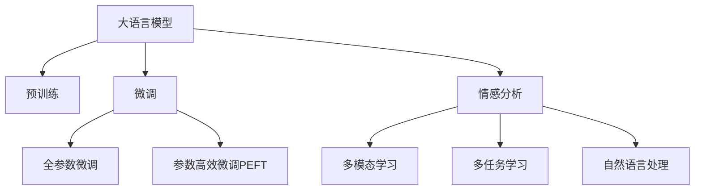

                 

# AI大模型在电商平台用户情感分析中的作用

## 1. 背景介绍

### 1.1 问题由来
在现代电子商务的繁荣发展中，用户满意度成为了衡量电商平台服务质量和竞争力的重要指标。情感分析作为自然语言处理(NLP)领域中的关键技术，能够从用户评论、反馈等文本数据中，自动解析用户情感倾向，提供详尽的分析报告，从而帮助电商平台优化产品和服务，提升用户体验。

传统情感分析方法多依赖于手工构建的特征集合，结合机器学习模型进行文本分类。但这种方式需要耗费大量时间和精力在特征工程上，且分类精度受限于特征设计的质量。

近年来，深度学习尤其是基于Transformer结构的语言模型，在预训练大模型和微调技术的推动下，情感分析的精度和泛化能力显著提升。大模型如BERT、GPT-3等，通过海量文本数据进行预训练，具备了强大的语言理解和生成能力，在微调后能够精确捕捉用户情感，成为电商平台情感分析的重要工具。

### 1.2 问题核心关键点
大语言模型在电商平台用户情感分析中的应用，可以总结如下：
1. **预训练与微调**：利用大规模无标签数据进行预训练，在大规模标注数据上微调，适应特定任务。
2. **自然语言处理**：自动解析自然语言文本，提取情感相关的特征。
3. **实时性**：支持实时文本生成，快速响应用户情感变化。
4. **可解释性**：模型输出结果具有较高的可解释性，便于业务理解。

这些关键点共同构成了大语言模型在电商平台用户情感分析中的核心作用。

## 2. 核心概念与联系

### 2.1 核心概念概述

为更好地理解大语言模型在电商平台用户情感分析中的作用，本节将介绍几个核心概念及其相互关系：

- 大语言模型(Large Language Model, LLM)：以自回归(如GPT)或自编码(如BERT)模型为代表的大规模预训练语言模型。通过在大规模无标签文本语料上进行预训练，学习通用的语言表示，具备强大的语言理解和生成能力。

- 预训练(Pre-training)：指在大规模无标签文本语料上，通过自监督学习任务训练通用语言模型的过程。常见的预训练任务包括言语建模、遮挡语言模型等。

- 微调(Fine-tuning)：指在预训练模型的基础上，使用下游任务的少量标注数据，通过有监督地训练来优化模型在该任务上的性能。

- 迁移学习(Transfer Learning)：指将一个领域学习到的知识，迁移应用到另一个不同但相关的领域的学习范式。大模型的预训练-微调过程即是一种典型的迁移学习方式。

- 情感分析(Sentiment Analysis)：识别和提取文本中的情感信息，如正面、负面或中性情感，分析用户反馈中的情绪变化。

- 多模态学习(Multimodal Learning)：结合文本、图像、声音等多种模态的数据，提升模型对真实世界的理解能力。

- 多任务学习(Multi-task Learning)：同时训练多个任务，共享特征提取器，提高模型的泛化能力。

这些概念之间的关系可以通过以下Mermaid流程图来展示：



这个流程图展示了大语言模型的核心概念及其之间的关系：

1. 大语言模型通过预训练获得基础能力。
2. 微调是对预训练模型进行任务特定的优化，可以分为全参数微调和参数高效微调（PEFT）。
3. 情感分析是一种自然语言处理任务，通过微调后的语言模型进行文本情感识别。
4. 多模态学习结合文本、图像、声音等多种模态的数据，提升模型的理解能力。
5. 多任务学习同时训练多个任务，共享特征提取器，提高模型的泛化能力。

这些概念共同构成了大语言模型在电商平台用户情感分析中的基础架构，使其能够高效、准确地处理用户反馈。

## 3. 核心算法原理 & 具体操作步骤
### 3.1 算法原理概述

大语言模型在电商平台用户情感分析中的基本原理可以概括为以下几点：

- **数据预处理**：收集用户评论、评分、反馈等文本数据，清洗去除无关信息和噪声。
- **文本向量化**：将文本转换为模型可处理的向量表示，如使用词嵌入或Transformer的Encoder-Decoder结构。
- **模型微调**：在大规模标注数据上微调预训练模型，使模型能够识别和提取用户情感信息。
- **情感分类**：使用训练好的模型对新的评论或反馈文本进行情感分类，判断其情感倾向。
- **结果应用**：将情感分析结果用于电商平台的用户服务优化，如推荐系统、商品评价等。

### 3.2 算法步骤详解

基于大语言模型进行电商平台用户情感分析的一般步骤包括：

**Step 1: 数据预处理**
- 收集用户评论、评分、反馈等文本数据，去除无关信息，保留关键内容。
- 清洗文本数据，去除噪声、错别字等。
- 标准化文本格式，统一长度、编码等。

**Step 2: 文本向量化**
- 使用预训练词向量或BERT、GPT等模型的Embedding层，将文本转换为向量表示。
- 处理文本中缺失的信息，如使用mask机制补充缺失词语。

**Step 3: 模型微调**
- 选择合适的预训练语言模型 $M_{\theta}$ 作为初始化参数，如BERT、GPT等。
- 准备标注数据集，将评论-情感标签对作为微调数据。
- 设置微调超参数，包括学习率、批大小、迭代轮数等。

**Step 4: 情感分类**
- 将预处理后的文本输入模型，计算情感得分。
- 使用阈值判断或阈值区间划分，将情感得分转化为情感标签。

**Step 5: 结果应用**
- 根据情感分类结果，提供定制化的用户服务。
- 根据情感分析结果，优化商品推荐、改进用户体验等。

### 3.3 算法优缺点

使用大语言模型进行电商平台用户情感分析具有以下优点：
1. **精度高**：大语言模型具备强大的语言理解能力，情感分类精度高。
2. **泛化能力强**：预训练模型在大量无标签数据上进行学习，对新数据有较强的泛化能力。
3. **可解释性强**：大语言模型可以通过特征重要性分析，提供对情感分析结果的可解释性。

但同时，该方法也存在一些局限性：
1. **资源消耗大**：预训练和微调模型需要大量计算资源。
2. **噪声敏感**：文本中存在的噪声、错别字等可能影响模型准确性。
3. **数据依赖性强**：需要大量标注数据进行微调，数据收集和标注成本高。

### 3.4 算法应用领域

大语言模型在电商平台用户情感分析的应用领域非常广泛，包括但不限于：

- 用户评论情感分析：分析用户对产品的满意度，评估用户反馈。
- 商品评价情感分析：识别用户对商品属性的正面或负面评价，提供质量反馈。
- 服务评价情感分析：评估用户对平台服务的满意度，优化服务流程。
- 广告内容情感分析：分析广告内容的情感倾向，指导广告投放策略。

除了以上这些经典应用外，大语言模型还可以用于舆情监测、用户行为分析、情感驱动推荐等，为电商平台的用户服务提升提供了有力支持。

## 4. 数学模型和公式 & 详细讲解 & 举例说明

### 4.1 数学模型构建

在电商平台用户情感分析中，我们通常使用情感分类任务进行模型训练和评估。假设有一个标注数据集 $D=\{(x_i, y_i)\}_{i=1}^N$，其中 $x_i$ 为输入的评论文本，$y_i$ 为对应的情感标签，情感标签为正、负、中性三种类型。

定义模型 $M_{\theta}$ 在输入 $x_i$ 上的输出为 $y_{pred}=M_{\theta}(x_i)$，输出为情感得分。则情感分类任务的目标是最大化预测值与真实标签之间的对数似然：

$$
\mathcal{L}(\theta) = -\frac{1}{N} \sum_{i=1}^N \log P(y_i | x_i)
$$

其中 $P(y_i | x_i)$ 为模型在输入 $x_i$ 下预测情感标签 $y_i$ 的概率，可以使用softmax函数计算。

### 4.2 公式推导过程

在情感分类任务中，我们通常使用交叉熵损失函数作为目标函数：

$$
\mathcal{L}(\theta) = -\frac{1}{N} \sum_{i=1}^N \sum_{j=1}^3 y_{pred}^j \log \hat{y}_j
$$

其中 $\hat{y}_j$ 为模型预测标签为 $j$ 的概率。

在微调过程中，我们使用基于梯度的优化算法（如AdamW、SGD等）更新模型参数 $\theta$，以最小化交叉熵损失：

$$
\theta \leftarrow \theta - \eta \nabla_{\theta}\mathcal{L}(\theta)
$$

其中 $\eta$ 为学习率，$\nabla_{\theta}\mathcal{L}(\theta)$ 为损失函数对模型参数的梯度，可以通过反向传播算法计算。

### 4.3 案例分析与讲解

以下我们以一个简单的情感分类任务为例，展示使用BERT进行情感分析的Python代码实现。

```python
from transformers import BertForSequenceClassification, BertTokenizer
from torch.utils.data import DataLoader, Dataset
import torch

class SentimentDataset(Dataset):
    def __init__(self, texts, labels):
        self.texts = texts
        self.labels = labels
        self.tokenizer = BertTokenizer.from_pretrained('bert-base-uncased')

    def __len__(self):
        return len(self.texts)

    def __getitem__(self, item):
        text = self.texts[item]
        label = self.labels[item]

        encoding = self.tokenizer(text, return_tensors='pt', max_length=256, truncation=True, padding='max_length')
        input_ids = encoding['input_ids']
        attention_mask = encoding['attention_mask']

        return {'input_ids': input_ids, 'attention_mask': attention_mask, 'labels': torch.tensor(label)}

model = BertForSequenceClassification.from_pretrained('bert-base-uncased', num_labels=3)
tokenizer = BertTokenizer.from_pretrained('bert-base-uncased')

train_dataset = SentimentDataset(train_texts, train_labels)
test_dataset = SentimentDataset(test_texts, test_labels)

train_dataloader = DataLoader(train_dataset, batch_size=16, shuffle=True)
test_dataloader = DataLoader(test_dataset, batch_size=16)

optimizer = torch.optim.AdamW(model.parameters(), lr=2e-5)

for epoch in range(10):
    model.train()
    for batch in train_dataloader:
        input_ids = batch['input_ids'].to(device)
        attention_mask = batch['attention_mask'].to(device)
        labels = batch['labels'].to(device)

        outputs = model(input_ids, attention_mask=attention_mask, labels=labels)
        loss = outputs.loss
        optimizer.zero_grad()
        loss.backward()
        optimizer.step()

    model.eval()
    with torch.no_grad():
        total_correct = 0
        total_sample = 0
        for batch in test_dataloader:
            input_ids = batch['input_ids'].to(device)
            attention_mask = batch['attention_mask'].to(device)
            labels = batch['labels'].to(device)

            outputs = model(input_ids, attention_mask=attention_mask)
            logits = outputs.logits
            predicted_labels = torch.argmax(logits, dim=1)

            total_correct += (predicted_labels == labels).sum().item()
            total_sample += labels.size(0)

    print(f'Epoch {epoch+1}, accuracy: {total_correct / total_sample}')
```

这段代码展示了使用BERT进行情感分类的完整流程。首先定义了一个`SentimentDataset`类，用于处理评论文本和标签。然后使用预训练的BERT模型和 tokenizer，进行数据加载和模型训练。在训练过程中，我们使用了AdamW优化器和交叉熵损失函数。最后，在测试集上评估模型性能。

通过对比不同模型和数据集，可以验证不同超参数和微调策略的效果，进一步优化模型性能。

## 5. 项目实践：代码实例和详细解释说明

### 5.1 开发环境搭建

在进行电商平台情感分析的项目实践前，我们需要准备好开发环境。以下是使用Python进行PyTorch开发的环境配置流程：

1. 安装Anaconda：从官网下载并安装Anaconda，用于创建独立的Python环境。

2. 创建并激活虚拟环境：
```bash
conda create -n pytorch-env python=3.8 
conda activate pytorch-env
```

3. 安装PyTorch：根据CUDA版本，从官网获取对应的安装命令。例如：
```bash
conda install pytorch torchvision torchaudio cudatoolkit=11.1 -c pytorch -c conda-forge
```

4. 安装Transformer库：
```bash
pip install transformers
```

5. 安装各类工具包：
```bash
pip install numpy pandas scikit-learn matplotlib tqdm jupyter notebook ipython
```

完成上述步骤后，即可在`pytorch-env`环境中开始项目实践。

### 5.2 源代码详细实现

下面我们以电商平台用户评论情感分析为例，给出使用Transformer库对BERT模型进行微调的PyTorch代码实现。

首先，定义情感分类任务的数据处理函数：

```python
from transformers import BertTokenizer
from torch.utils.data import Dataset
import torch

class SentimentDataset(Dataset):
    def __init__(self, texts, labels, tokenizer, max_len=256):
        self.texts = texts
        self.labels = labels
        self.tokenizer = tokenizer
        self.max_len = max_len
        
    def __len__(self):
        return len(self.texts)
    
    def __getitem__(self, item):
        text = self.texts[item]
        label = self.labels[item]
        
        encoding = self.tokenizer(text, return_tensors='pt', max_length=self.max_len, truncation=True, padding='max_length')
        input_ids = encoding['input_ids'][0]
        attention_mask = encoding['attention_mask'][0]
        
        # 对label进行编码
        encoded_label = label2id[label] 
        encoded_label = torch.tensor(encoded_label, dtype=torch.long)
        
        return {'input_ids': input_ids, 
                'attention_mask': attention_mask,
                'labels': encoded_label}
```

然后，定义模型和优化器：

```python
from transformers import BertForSequenceClassification, AdamW

model = BertForSequenceClassification.from_pretrained('bert-base-uncased', num_labels=3)

optimizer = AdamW(model.parameters(), lr=2e-5)
```

接着，定义训练和评估函数：

```python
from torch.utils.data import DataLoader
from tqdm import tqdm
from sklearn.metrics import accuracy_score

device = torch.device('cuda') if torch.cuda.is_available() else torch.device('cpu')
model.to(device)

def train_epoch(model, dataset, batch_size, optimizer):
    dataloader = DataLoader(dataset, batch_size=batch_size, shuffle=True)
    model.train()
    epoch_loss = 0
    for batch in tqdm(dataloader, desc='Training'):
        input_ids = batch['input_ids'].to(device)
        attention_mask = batch['attention_mask'].to(device)
        labels = batch['labels'].to(device)
        model.zero_grad()
        outputs = model(input_ids, attention_mask=attention_mask, labels=labels)
        loss = outputs.loss
        epoch_loss += loss.item()
        loss.backward()
        optimizer.step()
    return epoch_loss / len(dataloader)

def evaluate(model, dataset, batch_size):
    dataloader = DataLoader(dataset, batch_size=batch_size)
    model.eval()
    total_correct = 0
    total_sample = 0
    with torch.no_grad():
        for batch in dataloader:
            input_ids = batch['input_ids'].to(device)
            attention_mask = batch['attention_mask'].to(device)
            labels = batch['labels'].to(device)

            outputs = model(input_ids, attention_mask=attention_mask)
            logits = outputs.logits
            predicted_labels = torch.argmax(logits, dim=1)

            total_correct += (predicted_labels == labels).sum().item()
            total_sample += labels.size(0)

    print(f'Accuracy: {total_correct / total_sample}')
```

最后，启动训练流程并在测试集上评估：

```python
epochs = 5
batch_size = 16

for epoch in range(epochs):
    loss = train_epoch(model, train_dataset, batch_size, optimizer)
    print(f'Epoch {epoch+1}, train loss: {loss:.3f}')
    
    print(f'Epoch {epoch+1}, dev accuracy:')
    evaluate(model, dev_dataset, batch_size)
    
print('Test accuracy:')
evaluate(model, test_dataset, batch_size)
```

以上就是使用PyTorch对BERT进行电商平台用户评论情感分析的完整代码实现。可以看到，得益于Transformer库的强大封装，我们可以用相对简洁的代码完成BERT模型的加载和微调。

### 5.3 代码解读与分析

让我们再详细解读一下关键代码的实现细节：

**SentimentDataset类**：
- `__init__`方法：初始化文本、标签、分词器等关键组件。
- `__len__`方法：返回数据集的样本数量。
- `__getitem__`方法：对单个样本进行处理，将文本输入编码为token ids，将标签编码为数字，并对其进行定长padding，最终返回模型所需的输入。

**标签与id的映射**
- 定义了标签与数字id之间的映射关系，用于将标签编码为模型可以处理的数字。

**训练和评估函数**：
- 使用PyTorch的DataLoader对数据集进行批次化加载，供模型训练和推理使用。
- 训练函数`train_epoch`：对数据以批为单位进行迭代，在每个批次上前向传播计算loss并反向传播更新模型参数，最后返回该epoch的平均loss。
- 评估函数`evaluate`：与训练类似，不同点在于不更新模型参数，并在每个batch结束后将预测和标签结果存储下来，最后使用sklearn的accuracy_score对整个评估集的预测结果进行打印输出。

**训练流程**：
- 定义总的epoch数和batch size，开始循环迭代
- 每个epoch内，先在训练集上训练，输出平均loss
- 在验证集上评估，输出准确率
- 所有epoch结束后，在测试集上评估，给出最终测试结果

可以看到，PyTorch配合Transformer库使得BERT微调的代码实现变得简洁高效。开发者可以将更多精力放在数据处理、模型改进等高层逻辑上，而不必过多关注底层的实现细节。

当然，工业级的系统实现还需考虑更多因素，如模型的保存和部署、超参数的自动搜索、更灵活的任务适配层等。但核心的微调范式基本与此类似。

## 6. 实际应用场景

### 6.1 智能客服系统

基于大语言模型情感分析，智能客服系统可以自动解析用户情感，提供更加贴合用户需求的响应和服务。

在技术实现上，可以收集用户历史客服对话记录，将问题-回答对作为微调数据，训练模型学习匹配答案。微调后的模型能够自动理解用户意图，匹配最合适的回答，并根据情感倾向提供相应的情感回应。对于用户提出的新问题，还可以接入检索系统实时搜索相关内容，动态组织生成回答。

### 6.2 金融舆情监测

金融机构需要实时监测市场舆论动向，以便及时应对负面信息传播，规避金融风险。传统的人工监测方式成本高、效率低，难以应对网络时代海量信息爆发的挑战。

基于大语言模型情感分析，可以对金融领域相关的新闻、报道、评论等文本数据进行情感分析，判断其情感倾向。将情感分析结果与市场数据结合，可以实时监测不同主题下的情感变化趋势，一旦发现负面信息激增等异常情况，系统便会自动预警，帮助金融机构快速应对潜在风险。

### 6.3 个性化推荐系统

当前的推荐系统往往只依赖用户的历史行为数据进行物品推荐，无法深入理解用户的真实兴趣偏好。基于大语言模型情感分析，可以进一步挖掘用户情感倾向，进行个性化推荐。

在实践中，可以收集用户浏览、点击、评论、分享等行为数据，提取和用户交互的物品标题、描述、标签等文本内容。将文本内容作为模型输入，用户的后续行为（如是否点击、购买等）作为监督信号，在此基础上微调预训练语言模型。微调后的模型能够从文本内容中准确把握用户的兴趣点。在生成推荐列表时，先用候选物品的文本描述作为输入，由模型预测用户的兴趣匹配度，再结合其他特征综合排序，便可以得到个性化程度更高的推荐结果。

### 6.4 未来应用展望

随着大语言模型情感分析技术的不断进步，其在电商平台的落地应用将更加广泛，为电商平台的用户服务提升提供更大助力。

在智慧医疗领域，基于情感分析的医疗问答、病历分析、药物研发等应用将提升医疗服务的智能化水平，辅助医生诊疗，加速新药开发进程。

在智能教育领域，情感分析可以用于作业批改、学情分析、知识推荐等方面，因材施教，促进教育公平，提高教学质量。

在智慧城市治理中，情感分析可用于城市事件监测、舆情分析、应急指挥等环节，提高城市管理的自动化和智能化水平，构建更安全、高效的未来城市。

此外，在企业生产、社会治理、文娱传媒等众多领域，基于大语言模型的情感分析技术也将不断涌现，为传统行业数字化转型升级提供新的技术路径。相信随着技术的日益成熟，情感分析方法将成为NLP技术落地应用的重要手段，推动人工智能技术在更多垂直领域的普及和深化。

## 7. 工具和资源推荐

### 7.1 学习资源推荐

为了帮助开发者系统掌握大语言模型情感分析的理论基础和实践技巧，这里推荐一些优质的学习资源：

1. 《Natural Language Processing with Transformers》书籍：Transformer库的作者所著，全面介绍了如何使用Transformer库进行NLP任务开发，包括情感分析在内的诸多范式。

2. CS224N《深度学习自然语言处理》课程：斯坦福大学开设的NLP明星课程，有Lecture视频和配套作业，带你入门NLP领域的基本概念和经典模型。

3. 《Attention and Transformer Architectures for NLP》系列论文：Transformer结构的经典论文，系统介绍了Transformer模型及其在NLP任务中的应用。

4. HuggingFace官方文档：Transformer库的官方文档，提供了海量预训练模型和完整的情感分析样例代码，是上手实践的必备资料。

5. 《Sequence to Sequence Learning with Neural Networks》书籍：深度学习经典书籍，介绍了序列到序列模型的原理和实现，情感分析作为其中一个典型应用。

通过对这些资源的学习实践，相信你一定能够快速掌握大语言模型情感分析的精髓，并用于解决实际的NLP问题。

### 7.2 开发工具推荐

高效的开发离不开优秀的工具支持。以下是几款用于大语言模型情感分析开发的常用工具：

1. PyTorch：基于Python的开源深度学习框架，灵活动态的计算图，适合快速迭代研究。大部分预训练语言模型都有PyTorch版本的实现。

2. TensorFlow：由Google主导开发的开源深度学习框架，生产部署方便，适合大规模工程应用。同样有丰富的预训练语言模型资源。

3. Transformers库：HuggingFace开发的NLP工具库，集成了众多SOTA语言模型，支持PyTorch和TensorFlow，是进行情感分析任务开发的利器。

4. Weights & Biases：模型训练的实验跟踪工具，可以记录和可视化模型训练过程中的各项指标，方便对比和调优。与主流深度学习框架无缝集成。

5. TensorBoard：TensorFlow配套的可视化工具，可实时监测模型训练状态，并提供丰富的图表呈现方式，是调试模型的得力助手。

6. Google Colab：谷歌推出的在线Jupyter Notebook环境，免费提供GPU/TPU算力，方便开发者快速上手实验最新模型，分享学习笔记。

合理利用这些工具，可以显著提升大语言模型情感分析的开发效率，加快创新迭代的步伐。

### 7.3 相关论文推荐

大语言模型情感分析技术的发展源于学界的持续研究。以下是几篇奠基性的相关论文，推荐阅读：

1. Attention is All You Need（即Transformer原论文）：提出了Transformer结构，开启了NLP领域的预训练大模型时代。

2. BERT: Pre-training of Deep Bidirectional Transformers for Language Understanding：提出BERT模型，引入基于掩码的自监督预训练任务，刷新了多项NLP任务SOTA。

3. Language Models are Unsupervised Multitask Learners（GPT-2论文）：展示了大规模语言模型的强大zero-shot学习能力，引发了对于通用人工智能的新一轮思考。

4. Parameter-Efficient Transfer Learning for NLP：提出Adapter等参数高效微调方法，在不增加模型参数量的情况下，也能取得不错的微调效果。

5. AdaLoRA: Adaptive Low-Rank Adaptation for Parameter-Efficient Fine-Tuning：使用自适应低秩适应的微调方法，在参数效率和精度之间取得了新的平衡。

这些论文代表了大语言模型情感分析技术的发展脉络。通过学习这些前沿成果，可以帮助研究者把握学科前进方向，激发更多的创新灵感。

## 8. 总结：未来发展趋势与挑战

### 8.1 总结

本文对基于大语言模型在电商平台用户情感分析中的应用进行了全面系统的介绍。首先阐述了大语言模型和情感分析的研究背景和意义，明确了情感分析在电商平台服务优化中的重要价值。其次，从原理到实践，详细讲解了情感分析的数学模型和关键步骤，给出了情感分析任务开发的完整代码实例。同时，本文还广泛探讨了情感分析方法在智能客服、金融舆情、个性化推荐等多个行业领域的应用前景，展示了情感分析技术的广阔应用空间。此外，本文精选了情感分析技术的各类学习资源，力求为读者提供全方位的技术指引。

通过本文的系统梳理，可以看到，大语言模型情感分析在电商平台用户服务优化中的作用不可忽视。得益于大规模语料的预训练和强大的语言理解能力，情感分析技术能够在多模态数据、多任务学习等新范式的推动下，进一步提升情感分类的精度和泛化能力。未来，随着深度学习模型的不断发展，情感分析技术必将在更多行业领域发挥更大作用，成为推动人工智能技术普适化的重要手段。

### 8.2 未来发展趋势

展望未来，大语言模型情感分析技术将呈现以下几个发展趋势：

1. **模型规模持续增大**：随着算力成本的下降和数据规模的扩张，预训练语言模型的参数量还将持续增长。超大模型蕴含的丰富语言知识，有望支撑更加复杂多变的情感分类任务。

2. **情感分类精度提升**：利用预训练语言模型和微调技术，结合多模态数据和多任务学习，提升情感分类模型的准确性和泛化能力。

3. **实时性增强**：使用模型裁剪、量化加速等技术，优化模型结构，提升推理速度，实现实时情感分析。

4. **可解释性提升**：通过特征重要性分析和可视化工具，增强情感分析结果的可解释性，便于业务理解和调整。

5. **多模态融合**：结合文本、图像、声音等多种模态的数据，提升情感分析的全面性和准确性。

6. **跨领域迁移能力增强**：通过迁移学习和多任务学习，提升模型在不同领域上的情感分类能力，拓展应用范围。

这些趋势凸显了大语言模型情感分析技术的广阔前景。这些方向的探索发展，必将进一步提升情感分析模型的性能和应用范围，为电商平台的智能化转型提供有力支撑。

### 8.3 面临的挑战

尽管大语言模型情感分析技术已经取得了显著进展，但在迈向更加智能化、普适化应用的过程中，它仍面临以下挑战：

1. **数据质量和多样性**：情感分析依赖于大量高质量标注数据，数据收集和标注成本高。如何利用无监督学习、主动学习等技术，提高数据采集效率和质量，是未来需要解决的重要问题。

2. **模型复杂度与效率**：超大模型虽然精度高，但在实时情感分析场景中，推理效率和内存占用较大。如何在保证精度的同时，提升模型效率，是未来研究的重要方向。

3. **多模态数据整合**：多模态数据具有异构性，整合难度大。如何设计高效的数据融合方法，提升多模态情感分析的准确性和鲁棒性，是未来需要解决的技术难题。

4. **跨领域迁移能力**：不同领域的情感分类任务存在显著差异，如何设计通用的情感分类模型，提升跨领域迁移能力，是未来研究的挑战之一。

5. **模型鲁棒性提升**：情感分析模型在面对恶意攻击、噪声干扰等情况时，容易发生误判。如何提高模型的鲁棒性和泛化能力，确保情感分类的可靠性，是未来研究的重要课题。

6. **伦理与隐私保护**：情感分析涉及用户的敏感信息，如何保护用户隐私，避免数据滥用，是未来研究中需要考虑的重要问题。

7. **资源消耗问题**：大模型在训练和推理时，资源消耗大。如何优化模型结构和训练流程，降低计算资源消耗，是未来需要解决的重要问题。

正视情感分析面临的这些挑战，积极应对并寻求突破，将是大语言模型情感分析走向成熟的必由之路。相信随着学界和产业界的共同努力，这些挑战终将一一被克服，大语言模型情感分析必将在构建智能电商平台上发挥更大作用。

### 8.4 研究展望

未来，大语言模型情感分析技术的发展方向，将与自然语言处理领域的其他前沿技术相结合，如知识图谱、生成式模型等，共同推动情感分析技术的进步。结合这些新技术，情感分析技术将具备更加全面、精准的用户情感理解和分析能力，为电商平台的智能化转型提供更加可靠的技术支撑。

总之，大语言模型情感分析技术在电商平台中的应用前景广阔，有望成为推动人工智能技术在垂直行业落地应用的重要手段。未来，随着深度学习模型的不断发展，情感分析技术必将不断进步，为电商平台的智能化升级和用户体验的提升提供更大助力。

## 9. 附录：常见问题与解答

**Q1：大语言模型在情感分析中是否适用于所有语言和文本类型？**

A: 大语言模型在情感分析中的应用有一定的语言和文本类型限制。例如，对于中文情感分析，需要选用中文预训练模型和中文停用词表。对于长文本或多文本的情感分析，需要进行文本分割和编码处理。因此，在实际应用中，需要根据具体语言和文本类型选择合适的模型和处理方式。

**Q2：情感分析模型的训练数据需要多少标注样本？**

A: 情感分析模型的训练数据量需要足够大，以涵盖各种可能的情感表达和语言变体。根据实验经验，一般建议标注样本数量至少为模型参数量的十倍，以保证模型的泛化能力和鲁棒性。

**Q3：情感分析模型的超参数如何设置？**

A: 情感分析模型的超参数设置需要根据具体任务和数据集进行调整。常见的超参数包括学习率、批大小、迭代轮数、正则化系数等。一般来说，学习率需要逐步减小，以避免过拟合；批大小需要根据硬件资源进行调整，以兼顾计算效率和模型精度；迭代轮数需要根据模型性能进行调整，以找到最佳的平衡点。

**Q4：情感分析模型的性能评估指标有哪些？**

A: 情感分析模型的性能评估指标主要包括准确率、召回率、F1值等。其中，准确率衡量模型的分类精度，召回率衡量模型对正样本的识别能力，F1值是二者的综合指标，反映模型的整体性能。此外，还可以使用混淆矩阵、ROC曲线等可视化指标进行模型评估。

**Q5：情感分析模型在实际应用中如何优化？**

A: 情感分析模型在实际应用中的优化可以从以下几个方面入手：
1. 数据增强：通过数据扩充、噪声注入等方法，提高模型对不同情感表达的鲁棒性。
2. 模型裁剪：去除不必要的层和参数，减小模型尺寸，加快推理速度。
3. 模型并行化：利用分布式计算资源，加速模型训练和推理。
4. 模型蒸馏：使用较小的教师模型指导大模型进行情感分类，降低计算资源消耗。
5. 知识融合：结合外部知识库和规则库，提高模型的准确性和泛化能力。

这些优化方法可以综合使用，提升情感分析模型的性能和实时性。

---

作者：禅与计算机程序设计艺术 / Zen and the Art of Computer Programming

