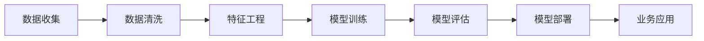

                 

# AI大模型在电商平台需求预测中的应用

> 关键词：大语言模型,需求预测,电商平台,销售预测,深度学习,机器学习,强化学习,特征工程,优化算法

## 1. 背景介绍

### 1.1 问题由来
电商平台的竞争日趋激烈，传统的销售预测方法已难以满足快速响应市场需求、精细化运营管理的需要。基于大模型的需求预测技术，凭借其强大的数据建模和推理能力，能够大幅提升销售预测的精度和时效性，推动电商平台的智能化转型。

### 1.2 问题核心关键点
需求预测的本质在于根据历史数据和当前环境，预测未来某个时间点的需求量。大模型通过学习大量历史数据和上下文信息，能够捕捉数据的非线性关系和长期依赖，从而提升预测的准确性和可靠性。

### 1.3 问题研究意义
需求预测在电商平台中有着广泛的应用价值：

1. 库存管理：通过精确预测库存水平，避免供需不匹配，减少资金占用和存货损失。
2. 营销策略：预测热门商品和促销时机，精准制定个性化营销策略，提高转化率。
3. 价格优化：动态调整商品价格，平衡库存和销量，实现最大收益。
4. 资源调配：优化物流配送和仓库布局，提高运营效率。
5. 风险控制：预警市场波动和需求异常，及时调整经营策略，降低运营风险。

## 2. 核心概念与联系

### 2.1 核心概念概述

需求预测与大语言模型之间具有紧密的联系，主要体现在以下几个方面：

- **大语言模型**：以自回归(如GPT)或自编码(如BERT)模型为代表的大规模预训练语言模型。通过在大规模无标签文本语料上进行预训练，学习通用的语言知识和表示。

- **需求预测**：根据历史数据和当前环境，预测未来某个时间点的需求量，广泛应用于电商、制造、物流等行业。

- **深度学习**：基于神经网络等方法，通过数据驱动的学习，从数据中提取抽象特征，实现高维非线性建模。

- **机器学习**：通过监督学习、无监督学习、半监督学习等方法，让机器自动从数据中学习规律，进行分类、预测等任务。

- **强化学习**：通过智能体与环境的交互，不断优化决策策略，优化预测模型的参数。

- **特征工程**：选择、构造和处理数据特征，为模型提供更好的输入数据，提升预测准确性。

- **优化算法**：用于最小化损失函数，优化模型参数，提高预测精度。

这些概念共同构成了需求预测的完整框架，通过深度学习、机器学习、强化学习和大模型的协同工作，提升需求预测的性能。

### 2.2 核心概念原理和架构的 Mermaid 流程图(Mermaid 流程节点中不要有括号、逗号等特殊字符)



这个流程图展示了需求预测的主要流程：

1. **数据收集**：从电商平台的交易、库存、物流等数据源中收集历史数据。
2. **数据清洗**：对原始数据进行去重、缺失值处理、异常值检测等清洗工作。
3. **特征工程**：选择、构造和处理数据特征，为模型提供更好的输入数据。
4. **模型训练**：使用深度学习、机器学习或强化学习等方法训练预测模型。
5. **模型评估**：使用历史数据和测试数据对训练好的模型进行评估，检验预测性能。
6. **模型部署**：将训练好的模型集成到电商平台中，进行实时预测。
7. **业务应用**：将预测结果应用于库存管理、营销策略、价格优化等实际业务中，提升运营效率。

## 3. 核心算法原理 & 具体操作步骤

### 3.1 算法原理概述

需求预测的本质是通过历史数据预测未来的需求量，是一种典型的监督学习任务。大模型通过预训练获得丰富的语言知识和表示能力，能够捕捉数据中的非线性关系和长期依赖，从而提升预测准确性。

形式化地，假设历史数据为 $D=\{(x_i,y_i)\}_{i=1}^N$，其中 $x_i$ 为时间序列特征，$y_i$ 为实际需求量。预测模型 $M_{\theta}$ 的目标是找到最优参数 $\theta$，使得预测误差最小化：

$$
\theta^* = \mathop{\arg\min}_{\theta} \mathcal{L}(M_{\theta},D)
$$

其中 $\mathcal{L}$ 为损失函数，通常使用均方误差或交叉熵等。通过梯度下降等优化算法，不断更新模型参数 $\theta$，最小化损失函数 $\mathcal{L}$，得到最优预测模型 $M_{\theta^*}$。

### 3.2 算法步骤详解

大模型在电商平台需求预测中的具体应用步骤如下：

**Step 1: 数据收集和预处理**

- 从电商平台的交易、库存、物流等系统收集历史数据。
- 清洗数据，包括去重、缺失值处理、异常值检测等。
- 划分训练集、验证集和测试集，通常使用时间序列的时间滑动划分方式。

**Step 2: 特征工程**

- 选择有预测意义的特征，如商品类别、价格、促销活动、季节性等。
- 构造时间序列特征，如移动平均、季节性分解、时间差分等。
- 处理缺失值，可以使用插值法、均值填补等方法。
- 特征缩放，如标准化、归一化等，使得数据在0-1范围内。

**Step 3: 模型选择与训练**

- 选择适合的需求预测模型，如线性回归、ARIMA、LSTM、Transformer等。
- 使用大模型进行特征提取，如BERT、GPT等。
- 设计合适的损失函数，如均方误差、交叉熵等。
- 设置训练超参数，如学习率、批大小、迭代轮数等。

**Step 4: 模型评估与优化**

- 在验证集上评估模型预测性能，使用MAE、RMSE等指标。
- 根据评估结果调整模型参数，优化损失函数。
- 使用正则化技术，如L2正则、Dropout等，防止过拟合。

**Step 5: 模型部署与业务应用**

- 将训练好的模型集成到电商平台的业务系统中，进行实时预测。
- 在预测过程中，考虑业务规则和上下文信息，如促销活动、节假日等。
- 将预测结果用于库存管理、营销策略、价格优化等业务场景。
- 持续收集新数据，定期重新训练和微调模型，适应数据分布的变化。

### 3.3 算法优缺点

基于大模型的需求预测方法具有以下优点：

- 数据利用率高：大模型能够学习到丰富的特征表示，利用率高于传统方法。
- 预测精度高：能够捕捉数据的非线性关系和长期依赖，提升预测准确性。
- 鲁棒性强：大模型的预训练能力使得其对数据噪声和异常值具有较强鲁棒性。

同时，该方法也存在以下局限性：

- 模型复杂度高：大模型参数量大，训练和推理速度较慢。
- 数据需求大：需要大量的历史数据进行预训练和微调。
- 解释性不足：大模型的决策过程难以解释，难以调试和优化。

尽管存在这些局限性，但就目前而言，基于大模型的需求预测方法仍是大数据时代的主流范式。未来相关研究的重点在于如何进一步降低数据需求，提高模型解释性，同时兼顾精度和效率。

### 3.4 算法应用领域

大模型在电商平台需求预测中的应用非常广泛，主要包括以下几个方面：

- **库存管理**：预测商品在未来时间的库存水平，避免供需不匹配，减少资金占用和存货损失。
- **销售预测**：预测商品在未来时间的销量，制定合理的采购和促销策略。
- **价格优化**：根据需求预测结果动态调整商品价格，平衡库存和销量，实现最大收益。
- **资源调配**：优化物流配送和仓库布局，提高运营效率。
- **风险控制**：预警市场波动和需求异常，及时调整经营策略，降低运营风险。

此外，大模型还可以用于需求驱动的产品开发、市场趋势分析、客户需求挖掘等多个领域，为电商平台提供全方位的智能化服务。

## 4. 数学模型和公式 & 详细讲解 & 举例说明

### 4.1 数学模型构建

假设需求预测任务为回归问题，即预测商品在未来的需求量。记训练数据集为 $D=\{(x_i,y_i)\}_{i=1}^N$，其中 $x_i$ 为时间序列特征，$y_i$ 为实际需求量。预测模型 $M_{\theta}$ 的目标是最小化预测误差，即：

$$
\theta^* = \mathop{\arg\min}_{\theta} \frac{1}{N}\sum_{i=1}^N (y_i - M_{\theta}(x_i))^2
$$

其中 $M_{\theta}(x_i)$ 为模型对输入 $x_i$ 的预测输出。

### 4.2 公式推导过程

以线性回归模型为例，推导预测误差的最小化公式。假设模型为线性形式 $M_{\theta}(x) = \theta_0 + \theta_1 x_1 + \theta_2 x_2 + \cdots + \theta_n x_n$，则预测误差平方和为：

$$
L(\theta) = \frac{1}{N} \sum_{i=1}^N (y_i - \theta_0 - \theta_1 x_{i1} - \theta_2 x_{i2} - \cdots - \theta_n x_{in})^2
$$

求偏导数，得到：

$$
\frac{\partial L(\theta)}{\partial \theta_k} = -\frac{2}{N} \sum_{i=1}^N (y_i - \theta_0 - \theta_1 x_{i1} - \theta_2 x_{i2} - \cdots - \theta_n x_{in}) x_{ik}
$$

最小化损失函数，得到：

$$
\theta_k = \frac{1}{N} \sum_{i=1}^N (y_i - \theta_0 - \theta_1 x_{i1} - \theta_2 x_{i2} - \cdots - \theta_n x_{in}) x_{ik}
$$

其中 $k = 0,1,\cdots,n$。

通过求解上述最小二乘问题，得到最优的模型参数 $\theta$，用于预测未来的需求量。

### 4.3 案例分析与讲解

假设某电商平台预测某商品的未来日销量 $y_i$，使用线性回归模型进行预测。特征 $x_i$ 包括商品类别、价格、促销活动、季节性等，记为 $x_i = [c_i, p_i, a_i, s_i]$，其中 $c_i$ 为商品类别，$p_i$ 为价格，$a_i$ 为促销活动，$s_i$ 为季节性。

根据历史数据，构建训练集 $D=\{(x_i,y_i)\}_{i=1}^{1000}$，其中 $x_i$ 和 $y_i$ 分别为实际商品类别、价格、促销活动、季节性等和实际日销量。

使用大模型进行特征提取，得到 $x_i$ 对应的表示向量 $z_i = M_{\theta}(x_i)$。选择适当的特征 $z_i$，如商品类别、价格、促销活动等，构建线性回归模型：

$$
\hat{y_i} = \theta_0 + \theta_1 z_{i1} + \theta_2 z_{i2} + \cdots + \theta_n z_{in}
$$

其中 $z_{ik}$ 为第 $k$ 个特征 $z_i$ 在模型中的权重。使用均方误差作为损失函数，得到：

$$
L(\theta) = \frac{1}{N} \sum_{i=1}^N (y_i - \hat{y_i})^2
$$

使用梯度下降等优化算法最小化损失函数，得到最优的模型参数 $\theta$。将训练好的模型应用于未来时间点的需求预测，即：

$$
\hat{y_i} = M_{\theta}(x_i)
$$

其中 $x_i$ 为未来时间点的特征，$M_{\theta}(x_i)$ 为模型对未来需求量的预测输出。

## 5. 项目实践：代码实例和详细解释说明

### 5.1 开发环境搭建

在进行需求预测项目开发前，我们需要准备好开发环境。以下是使用Python进行TensorFlow开发的环境配置流程：

1. 安装Anaconda：从官网下载并安装Anaconda，用于创建独立的Python环境。

2. 创建并激活虚拟环境：
```bash
conda create -n tf-env python=3.8 
conda activate tf-env
```

3. 安装TensorFlow：根据CUDA版本，从官网获取对应的安装命令。例如：
```bash
conda install tensorflow -c conda-forge -c pytorch
```

4. 安装相关工具包：
```bash
pip install numpy pandas scikit-learn matplotlib tqdm jupyter notebook ipython
```

完成上述步骤后，即可在`tf-env`环境中开始需求预测实践。

### 5.2 源代码详细实现

下面以线性回归模型为例，给出使用TensorFlow进行电商需求预测的Python代码实现。

```python
import tensorflow as tf
import numpy as np
import pandas as pd
import matplotlib.pyplot as plt

# 读取数据集
data = pd.read_csv('sales_data.csv', index_col='date', parse_dates=True)

# 划分训练集和测试集
train_size = int(len(data) * 0.8)
train_data = data[:train_size]
test_data = data[train_size:]

# 特征选择
features = ['category', 'price', 'promotion']
train_X = train_data[features].copy()
train_y = train_data['sales'].copy()

# 标准化处理
mean = train_X.mean()
std = train_X.std()
train_X = (train_X - mean) / std
test_X = (test_X - mean) / std

# 构建模型
model = tf.keras.Sequential([
    tf.keras.layers.Dense(64, activation='relu', input_shape=(len(features),)),
    tf.keras.layers.Dense(1)
])

# 编译模型
model.compile(optimizer='adam', loss='mse', metrics=['mae'])

# 训练模型
model.fit(train_X, train_y, epochs=100, batch_size=32, validation_split=0.2)

# 预测测试集
test_y_pred = model.predict(test_X)
test_y_pred = (test_y_pred * std) + mean

# 评估模型性能
mae = tf.keras.metrics.mean_absolute_error(test_y, test_y_pred)
rmse = tf.keras.metrics.root_mean_squared_error(test_y, test_y_pred)

# 可视化结果
plt.plot(train_y.values, label='Train')
plt.plot(test_y.values, label='Test')
plt.plot(test_y_pred, label='Predict')
plt.legend()
plt.show()
```

以上代码实现了基于TensorFlow的线性回归模型，对电商平台的日销量进行预测。模型通过训练集学习到特征和销量之间的关系，然后应用到测试集进行预测。通过MAE和RMSE等指标评估模型性能，并进行可视化展示。

### 5.3 代码解读与分析

让我们再详细解读一下关键代码的实现细节：

**数据预处理**

- 读取CSV格式的数据集，并按日期进行索引。
- 划分训练集和测试集，通常使用80/20的比例。
- 特征选择，包括商品类别、价格、促销活动等。
- 对特征进行标准化处理，使用均值和标准差进行归一化。

**模型构建**

- 使用Keras构建线性回归模型，包括一个隐层和一个输出层。
- 隐层使用ReLU激活函数，输出层使用线性激活函数。
- 编译模型，使用Adam优化器和均方误差损失函数。

**模型训练**

- 使用fit函数训练模型，指定训练轮数和批次大小。
- 使用验证集评估模型性能，调整超参数。

**模型评估**

- 使用测试集进行模型预测，并计算MAE和RMSE等指标评估模型性能。
- 使用Matplotlib进行可视化，展示真实销量和预测销量的对比。

可以看到，使用TensorFlow进行需求预测的代码实现相对简洁高效。Keras封装了深度学习模型的构建和训练流程，大大简化了代码编写。

当然，实际应用中还需要考虑更多因素，如模型调优、数据增强、超参数搜索等。但核心的需求预测逻辑与上述示例类似。

## 6. 实际应用场景

### 6.1 智能库存管理

电商平台通过需求预测模型，可以精准预测商品未来的需求量，从而实现智能库存管理。具体而言：

- 根据历史销售数据和季节性特征，预测未来不同时间段的商品销量。
- 根据预测结果，提前调整库存水平，避免供需不匹配，减少资金占用和存货损失。
- 使用实时更新的需求预测结果，优化库存调度和补货策略。

### 6.2 个性化营销策略

电商平台可以根据需求预测结果，制定个性化营销策略，提升销售转化率。具体而言：

- 分析预测结果中的热门商品和促销时机，制定有针对性的营销策略。
- 实时调整商品定价和促销活动，动态优化促销资源配置。
- 结合用户行为数据，进行精准的用户推荐，提升用户体验和满意度。

### 6.3 动态价格优化

电商平台根据需求预测结果，动态调整商品价格，实现收益最大化。具体而言：

- 根据预测的销量，调整商品定价，优化库存和销量。
- 实时监控市场变化和竞争对手策略，动态调整价格策略。
- 结合用户行为数据，进行个性化定价，提升用户体验和购买率。

### 6.4 未来应用展望

随着深度学习和大模型的不断演进，基于大模型的需求预测技术将在更多场景中得到应用，为电商平台的智能化转型提供新的动力。

未来，需求预测模型将与智能客服、产品推荐、风险控制等多个环节进行更紧密的集成，推动电商平台的数字化升级。同时，大模型将更多地应用于供应链管理、物流配送等领域，优化全链条运营效率。

## 7. 工具和资源推荐

### 7.1 学习资源推荐

为了帮助开发者系统掌握需求预测的理论基础和实践技巧，这里推荐一些优质的学习资源：

1. 《深度学习》系列书籍：由多位机器学习专家合著，全面介绍了深度学习的基础知识和经典算法，适合入门和进阶学习。
2. CS231n《深度学习计算机视觉》课程：斯坦福大学开设的计算机视觉课程，涵盖深度学习在图像、视频、语音等领域的应用。
3. Coursera《机器学习》课程：由斯坦福大学教授Andrew Ng主讲，系统讲解机器学习的基本原理和实践技巧。
4. Kaggle竞赛平台：提供大量数据集和挑战赛，实践机器学习和深度学习算法。
5. Google AI Blog：谷歌AI团队定期发布的最新研究成果和实践经验，涵盖自然语言处理、计算机视觉等多个领域。

通过对这些资源的学习实践，相信你一定能够快速掌握需求预测的精髓，并用于解决实际的电商平台问题。

### 7.2 开发工具推荐

高效的开发离不开优秀的工具支持。以下是几款用于需求预测开发的常用工具：

1. TensorFlow：由谷歌主导开发的开源深度学习框架，生产部署方便，适合大规模工程应用。

2. Keras：谷歌开源的深度学习框架，提供了高层API，简化模型构建和训练流程。

3. PyTorch：Facebook开源的深度学习框架，灵活高效，适合科研和创新研究。

4. Jupyter Notebook：免费的交互式编程环境，支持Python、R等语言，适合数据分析和模型开发。

5. TensorBoard：TensorFlow配套的可视化工具，可实时监测模型训练状态，提供丰富的图表呈现方式。

6. Weights & Biases：模型训练的实验跟踪工具，可以记录和可视化模型训练过程中的各项指标，方便对比和调优。

合理利用这些工具，可以显著提升需求预测任务的开发效率，加快创新迭代的步伐。

### 7.3 相关论文推荐

需求预测与大语言模型技术的发展源于学界的持续研究。以下是几篇奠基性的相关论文，推荐阅读：

1. R. S. Sutton and A. G. Barto, Reinforcement Learning: An Introduction, 1998.
2. I. Goodfellow et al., Deep Learning, 2016.
3. C. M. Bishop, Pattern Recognition and Machine Learning, 2006.
4. L. Breiman, Bagging Predictors, 1996.
5. G. Hinton et al., Deep Architectures for Speech Recognition, 2010.

这些论文代表了大模型在需求预测中的应用研究进展，将为深入理解大模型的需求预测能力提供理论支持。

## 8. 总结：未来发展趋势与挑战

### 8.1 总结

本文对基于大模型的电商平台需求预测方法进行了全面系统的介绍。首先阐述了需求预测与大语言模型之间的联系，明确了大模型在电商平台需求预测中的重要价值。其次，从原理到实践，详细讲解了大模型在需求预测中的数学模型和具体操作步骤，给出了完整的需求预测代码实现。同时，本文还探讨了需求预测在大模型下的实际应用场景，展示了其在智能库存管理、个性化营销策略、动态价格优化等方面的广泛应用。

通过本文的系统梳理，可以看到，基于大模型的需求预测方法在电商平台中具有巨大的应用潜力。未来，伴随着深度学习和大模型的不断进步，需求预测将变得更加智能化、自动化，为电商平台带来更高的运营效率和用户体验。

### 8.2 未来发展趋势

展望未来，需求预测技术将呈现以下几个发展趋势：

1. **模型复杂度提升**：随着算力成本的下降和数据规模的扩张，需求预测模型的复杂度将进一步提升，能够学习到更复杂、更丰富的特征表示。

2. **跨领域融合**：需求预测将与其他技术进行更多跨领域的融合，如自然语言处理、计算机视觉、强化学习等，构建更全面、更智能的预测系统。

3. **实时化处理**：需求预测将越来越多地应用于实时场景，如智能客服、智能推荐等，实现即时的需求预测和响应。

4. **多模态融合**：需求预测将更多地融合多模态数据，如文本、图像、语音等，提升预测精度和泛化能力。

5. **自动化调参**：需求预测模型的调参将变得更加自动化，通过自动搜索最优超参数组合，提升模型性能。

6. **联邦学习**：需求预测将采用联邦学习等分布式学习技术，保护用户隐私，提升模型泛化能力。

以上趋势凸显了需求预测技术的广阔前景。这些方向的探索发展，必将进一步提升需求预测的性能和应用范围，为电商平台带来更高的运营效率和用户体验。

### 8.3 面临的挑战

尽管需求预测技术在电商领域取得了显著成效，但在迈向更加智能化、自动化应用的过程中，仍面临诸多挑战：

1. **数据质量问题**：电商平台的交易数据往往存在噪声、缺失等质量问题，如何提高数据质量，保证数据的一致性和准确性，是需求预测中的关键难题。

2. **数据隐私问题**：电商平台需要保护用户隐私，避免数据泄露和滥用，如何在隐私保护的前提下进行数据分析和模型训练，是一大挑战。

3. **模型鲁棒性不足**：当前的需求预测模型对数据噪声和异常值具有较强鲁棒性，但在小样本、长尾数据场景中，预测精度可能下降。

4. **计算资源消耗大**：大模型的训练和推理需要消耗大量的计算资源，如何在保证精度的情况下，降低计算复杂度，是实际应用中的重要挑战。

5. **模型解释性不足**：需求预测模型的决策过程难以解释，难以调试和优化，如何在保证性能的同时，提升模型的可解释性，是一大挑战。

6. **系统集成复杂**：需求预测模型的集成和部署需要考虑多个系统间的兼容性和稳定性，如何在保证稳定性的前提下，实现高效率的模型部署，是一大挑战。

正视需求预测面临的这些挑战，积极应对并寻求突破，将是大模型在电商领域不断进化的关键。相信随着学界和产业界的共同努力，这些挑战终将一一被克服，需求预测技术必将在构建智能电商平台上发挥越来越重要的作用。

### 8.4 研究展望

面对需求预测面临的诸多挑战，未来的研究需要在以下几个方面寻求新的突破：

1. **数据预处理技术**：探索新的数据清洗和增强方法，提升数据质量和一致性。

2. **多模态融合技术**：研究如何将文本、图像、语音等多模态数据融合，提升预测精度和泛化能力。

3. **自动化调参技术**：开发自动化的超参数搜索算法，优化模型性能。

4. **分布式学习技术**：探索联邦学习等分布式学习技术，保护用户隐私，提升模型泛化能力。

5. **解释性增强技术**：研究如何提升模型的可解释性和可解释性，增强模型的透明度和可信度。

6. **实时化处理技术**：研究如何实现实时的需求预测，提升预测精度和响应速度。

这些研究方向将引领需求预测技术迈向更高的台阶，为构建智能电商平台提供坚实的技术保障。未来，需求预测技术必将与电商平台的各个环节深度融合，推动电商平台的数字化、智能化升级，实现更高的运营效率和用户体验。

## 9. 附录：常见问题与解答

**Q1：电商平台的数据预处理需要注意哪些方面？**

A: 电商平台的交易数据往往存在噪声、缺失等质量问题，数据预处理需要注意以下方面：

1. 数据清洗：包括去重、缺失值处理、异常值检测等。
2. 数据增强：通过回译、近义替换等方式扩充训练集。
3. 数据标准化：如标准化、归一化等，使得数据在0-1范围内。
4. 数据平衡：处理数据不平衡问题，避免模型对少数类别的预测偏差。
5. 特征选择：选择有预测意义的特征，如商品类别、价格、促销活动等。

**Q2：电商平台的特征工程包括哪些内容？**

A: 电商平台的特征工程主要包括以下内容：

1. 时间特征处理：如移动平均、季节性分解、时间差分等。
2. 商品特征处理：如商品类别、价格、促销活动等。
3. 上下文特征处理：如节假日、季节性、促销活动等。
4. 交叉特征处理：如商品类别与促销活动的交叉特征。
5. 用户特征处理：如用户购买历史、行为数据等。

**Q3：电商平台的需求预测模型如何选择？**

A: 电商平台的预测模型选择应根据具体场景和数据特点进行选择：

1. 线性回归：适用于简单线性关系的数据。
2. 非线性模型：如多项式回归、决策树等，适用于非线性关系的数据。
3. 深度学习模型：如LSTM、RNN等，适用于时间序列数据。
4. 集成模型：如Bagging、Boosting等，提升预测精度和鲁棒性。
5. 迁移学习：在相似任务上预训练模型，再进行微调，提升预测效果。

**Q4：电商平台的实时需求预测如何实现？**

A: 电商平台的实时需求预测可以通过以下步骤实现：

1. 数据实时采集：从电商平台系统实时采集订单、库存等数据。
2. 数据实时预处理：对实时数据进行清洗、标准化等处理。
3. 模型实时推理：将预处理后的数据输入模型进行实时推理。
4. 预测结果实时更新：将实时预测结果更新到电商系统，进行实时库存管理、营销策略等操作。

**Q5：电商平台的预测结果如何应用于实际业务？**

A: 电商平台的预测结果可以通过以下方式应用于实际业务：

1. 库存管理：根据预测结果调整库存水平，避免供需不匹配，减少资金占用和存货损失。
2. 个性化营销：根据预测结果制定个性化营销策略，提升销售转化率。
3. 动态定价：根据预测结果动态调整商品价格，平衡库存和销量，实现最大收益。
4. 资源调配：根据预测结果优化物流配送和仓库布局，提高运营效率。
5. 风险控制：根据预测结果预警市场波动和需求异常，及时调整经营策略，降低运营风险。

通过以上方式，电商平台可以充分利用预测结果，提升运营效率和用户体验。

---

作者：禅与计算机程序设计艺术 / Zen and the Art of Computer Programming

