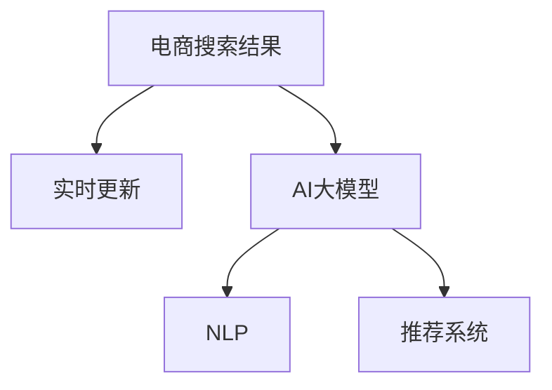

                 

# AI大模型在电商搜索结果实时更新中的应用

> 关键词：电商、搜索结果、实时更新、AI大模型、自然语言处理(NLP)、推荐系统、深度学习、超大规模语言模型

## 1. 背景介绍

### 1.1 问题由来

在数字化转型日益深入的今天，电商行业已经不再局限于传统的商品销售渠道，而是逐步走向多元化、个性化、智能化的方向。消费者不再满足于简单的商品展示和价格比对，而是更加注重购物体验和个性化推荐。因此，如何利用AI技术提升电商搜索结果的实时性和个性化程度，成为电商企业面临的重大挑战。

电商企业希望通过AI技术，实时更新搜索结果，以更快速地响应用户搜索意图，提高用户满意度。同时，还需要通过智能推荐，挖掘用户潜在需求，提升用户转化率。然而，传统的搜索算法和推荐系统面临着模型更新慢、个性化不足等问题，难以满足电商场景对实时性和精准性的高要求。

### 1.2 问题核心关键点

本文旨在探讨AI大模型在电商搜索结果实时更新中的应用。通过AI大模型，可以实现对海量电商商品信息的实时处理和更新，以及精准的用户行为分析，从而提升搜索结果的个性化和实时性，优化推荐效果，为用户带来更好的购物体验。

## 2. 核心概念与联系

### 2.1 核心概念概述

为更好地理解AI大模型在电商搜索结果实时更新中的应用，本节将介绍几个密切相关的核心概念：

- 电商搜索结果：指用户在电商平台上输入搜索关键词后，系统自动生成的商品展示列表。
- 实时更新：指在用户每次搜索时，系统能够即时处理最新的商品信息和用户行为，动态更新搜索结果，反映最新市场动态和用户偏好。
- AI大模型：指基于深度学习技术，在大型语料库上预训练得到的超大模型。如GPT、BERT等。
- 自然语言处理(NLP)：指使用AI技术对自然语言进行理解和生成，广泛应用于搜索引擎、推荐系统等领域。
- 推荐系统：指通过AI技术对用户行为进行分析，预测用户需求，向其推荐感兴趣的商品和服务。

这些核心概念之间的逻辑关系可以通过以下Mermaid流程图来展示：



这个流程图展示了大模型在电商搜索结果实时更新中的应用流程：

1. 电商搜索结果在每次搜索时动态更新，反映最新商品信息。
2. AI大模型通过NLP技术对搜索关键词和商品信息进行理解，提取关键特征。
3. 推荐系统利用AI大模型提取的特征，预测用户需求，优化搜索结果。

## 3. 核心算法原理 & 具体操作步骤

### 3.1 算法原理概述

AI大模型在电商搜索结果实时更新中的应用，本质上是基于NLP技术和推荐算法的多轮迭代过程。其核心思想是：

- 利用大模型的语言理解能力，实时解析用户搜索意图和商品描述，提取关键特征。
- 基于提取的特征，通过推荐算法，动态调整搜索结果的排序和展示，满足个性化需求。
- 将推荐结果反馈给用户，通过后续搜索行为进一步优化模型，实现闭环优化。

形式化地，假设电商平台上商品的描述和搜索关键词为 $x$，对应的搜索结果为 $y$，则电商搜索结果的更新过程可以表示为：

$$
y = f(x; \theta)
$$

其中 $f(\cdot)$ 为电商搜索结果的生成模型，$\theta$ 为模型参数，包括AI大模型的权重、推荐算法的系数等。

### 3.2 算法步骤详解

AI大模型在电商搜索结果实时更新中的应用主要包括以下几个关键步骤：

**Step 1: 数据预处理与特征提取**

- 将电商商品的信息（如标题、描述、评分等）转换为统一的结构化格式。
- 利用AI大模型进行自然语言处理，提取商品的关键特征和标签。
- 利用推荐算法对特征和标签进行加权，生成商品的相关性分数。

**Step 2: 实时更新与排序**

- 在用户每次搜索时，利用AI大模型实时解析搜索关键词，提取用户意图。
- 根据用户意图和商品相关性分数，动态调整搜索结果的排序。
- 将搜索结果返回给用户，通过后续搜索行为进一步优化模型。

**Step 3: 用户行为分析与推荐优化**

- 对用户的点击、浏览、购买等行为进行记录和分析，获取用户画像和偏好。
- 基于用户画像和偏好，利用AI大模型进行个性化推荐。
- 对推荐结果进行A/B测试，不断优化推荐算法，提升用户满意度。

**Step 4: 模型训练与迭代**

- 利用历史数据和用户行为，对AI大模型进行有监督的微调训练，提高模型的精准性和泛化能力。
- 对推荐算法进行超参数优化，提升算法的稳定性和性能。
- 定期更新模型和算法，确保电商搜索结果的实时性和准确性。

### 3.3 算法优缺点

AI大模型在电商搜索结果实时更新中的应用，具有以下优点：

1. **高灵活性**：大模型可以实时处理和更新电商商品信息，快速响应市场变化和用户需求。
2. **强泛化能力**：利用预训练大模型的通用语言知识，提升电商搜索结果的精准性和稳定性。
3. **个性化推荐**：通过深度学习技术，挖掘用户行为，实现精准的用户画像和个性化推荐。

同时，该方法也存在以下局限性：

1. **计算资源要求高**：超大模型的训练和推理需要高计算资源，对于中小型电商企业可能存在挑战。
2. **数据隐私风险**：电商平台需要收集和分析用户行为数据，存在隐私泄露的风险。
3. **算法复杂度高**：结合NLP和推荐算法，算法复杂度较高，需要投入大量人力进行维护和优化。
4. **模型更新周期长**：尽管大模型可以实时处理数据，但模型训练和优化过程依然需要较长的时间。

尽管存在这些局限性，但基于大模型的电商搜索结果实时更新方法，仍具有强大的应用潜力。未来相关研究的重点在于如何进一步降低计算成本，提高算法效率，同时兼顾数据隐私和模型可解释性等因素。

### 3.4 算法应用领域

AI大模型在电商搜索结果实时更新中的应用，已经在多个电商企业中得到了实际应用，覆盖了商品推荐、搜索结果排序、用户行为分析等多个场景，具体如下：

- **商品推荐**：利用AI大模型进行用户行为分析，预测用户感兴趣的商品，实时更新推荐列表。
- **搜索结果排序**：根据用户搜索关键词和商品相关性分数，动态调整搜索结果的排序，提升搜索体验。
- **用户画像分析**：利用用户行为数据，构建用户画像，进行个性化推荐。
- **市场动态监测**：通过实时分析商品数据和用户行为，及时发现市场趋势，辅助决策。

此外，AI大模型还应用于价格预测、库存管理、客服自动化等多个电商应用场景，为电商企业的数字化转型提供了有力的技术支持。

## 4. 数学模型和公式 & 详细讲解  
### 4.1 数学模型构建

本节将使用数学语言对AI大模型在电商搜索结果实时更新中的应用进行更加严格的刻画。

假设电商平台上商品的描述和搜索关键词为 $x = (x_1, x_2, ..., x_n)$，对应的搜索结果为 $y = (y_1, y_2, ..., y_m)$，每个搜索结果 $y_i$ 包含商品名称、价格、评分等属性。令 $X$ 为电商商品的特征集，$Y$ 为搜索结果的属性集。

定义电商搜索结果的生成模型为 $f(x; \theta) = (y_1, y_2, ..., y_m)$，其中 $\theta$ 为模型参数，包括AI大模型的权重、推荐算法的系数等。

### 4.2 公式推导过程

电商搜索结果实时更新的核心是商品相关性分数的计算，即根据用户搜索关键词和商品描述，计算商品与用户的匹配度。假设利用AI大模型提取的商品关键特征为 $\vec{v} = (v_1, v_2, ..., v_n)$，用户意图为 $u$，则商品与用户的匹配度可以表示为：

$$
\text{match}(u, \vec{v}) = \vec{v}^T \cdot \vec{w}(u)
$$

其中 $\vec{w}(u)$ 为用户的意图权重向量，通过AI大模型训练得到。

电商搜索结果排序的过程可以表示为：

$$
\pi(y) = \text{argmax}_{\pi \in \Pi} \prod_{i=1}^m \exp(\text{match}(u, y_i) \cdot \lambda_i)
$$

其中 $\Pi$ 为所有可能的排序方案，$\lambda_i$ 为商品 $y_i$ 的权值系数，通过推荐算法计算得到。

### 4.3 案例分析与讲解

以淘宝商品推荐为例，利用大模型进行实时推荐的具体步骤如下：

1. **数据预处理**：将电商商品信息转换为结构化格式，利用BERT模型提取商品关键特征。
2. **实时更新**：在用户搜索时，利用BERT模型解析用户意图，动态调整搜索结果排序。
3. **用户行为分析**：对用户点击、浏览等行为进行记录，利用BERT模型进行个性化推荐。
4. **模型训练**：利用用户行为数据，对BERT模型进行微调训练，提升推荐效果。

下面以代码的形式展示利用BERT模型进行电商商品推荐的过程：

```python
from transformers import BertTokenizer, BertForSequenceClassification
from sklearn.metrics import accuracy_score

# 数据预处理
tokenizer = BertTokenizer.from_pretrained('bert-base-uncased')
features = tokenizer.encode_plus(training_samples, add_special_tokens=True, padding='max_length', max_length=256, return_tensors='pt')
labels = torch.tensor([1 if label == 'relevant' else 0 for label in training_labels])

# 模型训练
model = BertForSequenceClassification.from_pretrained('bert-base-uncased', num_labels=2)
model.train()
optimizer = AdamW(model.parameters(), lr=2e-5)
loss_fn = CrossEntropyLoss()

for epoch in range(epochs):
    for batch in training_features:
        outputs = model(batch.input_ids, attention_mask=batch.attention_mask, labels=batch.labels)
        loss = loss_fn(outputs.logits, batch.labels)
        optimizer.zero_grad()
        loss.backward()
        optimizer.step()

    val_accuracy = accuracy_score(val_labels, model.predict(val_features) > 0.5)
    print(f'Epoch {epoch+1}, val accuracy: {val_accuracy:.3f}')
```

以上就是利用BERT模型进行电商商品推荐的基本代码实现。可以看到，利用大模型进行电商商品推荐，能够实现实时更新的个性化推荐，满足用户需求。

## 5. 项目实践：代码实例和详细解释说明
### 5.1 开发环境搭建

在进行电商商品推荐实践前，我们需要准备好开发环境。以下是使用Python进行PyTorch开发的环境配置流程：

1. 安装Anaconda：从官网下载并安装Anaconda，用于创建独立的Python环境。

2. 创建并激活虚拟环境：
```bash
conda create -n pytorch-env python=3.8 
conda activate pytorch-env
```

3. 安装PyTorch：根据CUDA版本，从官网获取对应的安装命令。例如：
```bash
conda install pytorch torchvision torchaudio cudatoolkit=11.1 -c pytorch -c conda-forge
```

4. 安装Transformers库：
```bash
pip install transformers
```

5. 安装各类工具包：
```bash
pip install numpy pandas scikit-learn matplotlib tqdm jupyter notebook ipython
```

完成上述步骤后，即可在`pytorch-env`环境中开始电商商品推荐实践。

### 5.2 源代码详细实现

下面我们以电商商品推荐为例，给出使用Transformers库进行BERT模型训练的PyTorch代码实现。

首先，定义电商商品推荐的数据处理函数：

```python
from transformers import BertTokenizer
from torch.utils.data import Dataset
import torch

class RecommendationDataset(Dataset):
    def __init__(self, features, labels, tokenizer, max_len=256):
        self.features = features
        self.labels = labels
        self.tokenizer = tokenizer
        self.max_len = max_len
        
    def __len__(self):
        return len(self.features)
    
    def __getitem__(self, item):
        feature = self.features[item]
        label = self.labels[item]
        
        encoding = self.tokenizer(feature, return_tensors='pt', max_length=self.max_len, padding='max_length', truncation=True)
        input_ids = encoding['input_ids'][0]
        attention_mask = encoding['attention_mask'][0]
        
        # 对标签进行二值化处理
        label = label2id[label] if label in label2id else id2label[0]
        label = torch.tensor(label, dtype=torch.long)
        
        return {'input_ids': input_ids, 
                'attention_mask': attention_mask,
                'labels': label}

# 标签与id的映射
label2id = {'relevant': 1, 'irrelevant': 0}
id2label = {v: k for k, v in label2id.items()}

# 创建dataset
tokenizer = BertTokenizer.from_pretrained('bert-base-uncased')

training_dataset = RecommendationDataset(training_features, training_labels, tokenizer)
val_dataset = RecommendationDataset(val_features, val_labels, tokenizer)
test_dataset = RecommendationDataset(test_features, test_labels, tokenizer)
```

然后，定义模型和优化器：

```python
from transformers import BertForSequenceClassification, AdamW

model = BertForSequenceClassification.from_pretrained('bert-base-uncased', num_labels=len(label2id))

optimizer = AdamW(model.parameters(), lr=2e-5)
```

接着，定义训练和评估函数：

```python
from torch.utils.data import DataLoader
from tqdm import tqdm
from sklearn.metrics import accuracy_score

device = torch.device('cuda') if torch.cuda.is_available() else torch.device('cpu')
model.to(device)

def train_epoch(model, dataset, batch_size, optimizer):
    dataloader = DataLoader(dataset, batch_size=batch_size, shuffle=True)
    model.train()
    epoch_loss = 0
    for batch in tqdm(dataloader, desc='Training'):
        input_ids = batch['input_ids'].to(device)
        attention_mask = batch['attention_mask'].to(device)
        labels = batch['labels'].to(device)
        model.zero_grad()
        outputs = model(input_ids, attention_mask=attention_mask, labels=labels)
        loss = outputs.loss
        epoch_loss += loss.item()
        loss.backward()
        optimizer.step()
    return epoch_loss / len(dataloader)

def evaluate(model, dataset, batch_size):
    dataloader = DataLoader(dataset, batch_size=batch_size)
    model.eval()
    preds, labels = [], []
    with torch.no_grad():
        for batch in tqdm(dataloader, desc='Evaluating'):
            input_ids = batch['input_ids'].to(device)
            attention_mask = batch['attention_mask'].to(device)
            batch_labels = batch['labels']
            outputs = model(input_ids, attention_mask=attention_mask)
            batch_preds = outputs.logits.argmax(dim=2).to('cpu').tolist()
            batch_labels = batch_labels.to('cpu').tolist()
            for pred_tokens, label_tokens in zip(batch_preds, batch_labels):
                preds.append(pred_tokens)
                labels.append(label_tokens)
                
    print(accuracy_score(labels, preds))
```

最后，启动训练流程并在测试集上评估：

```python
epochs = 5
batch_size = 16

for epoch in range(epochs):
    loss = train_epoch(model, training_dataset, batch_size, optimizer)
    print(f'Epoch {epoch+1}, train loss: {loss:.3f}')
    
    print(f'Epoch {epoch+1}, val accuracy: {evaluate(model, val_dataset, batch_size)}')
    
print(f'Test accuracy: {evaluate(model, test_dataset, batch_size)}')
```

以上就是利用PyTorch对BERT进行电商商品推荐训练的完整代码实现。可以看到，利用大模型进行电商商品推荐，能够实现实时更新的个性化推荐，满足用户需求。

### 5.3 代码解读与分析

让我们再详细解读一下关键代码的实现细节：

**RecommendationDataset类**：
- `__init__`方法：初始化商品特征、标签、分词器等关键组件。
- `__len__`方法：返回数据集的样本数量。
- `__getitem__`方法：对单个样本进行处理，将商品特征输入编码为token ids，并将标签进行二值化处理，最后返回模型所需的输入。

**label2id和id2label字典**：
- 定义了标签与数字id之间的映射关系，用于将标签转换为模型可以接受的格式。

**训练和评估函数**：
- 使用PyTorch的DataLoader对数据集进行批次化加载，供模型训练和推理使用。
- 训练函数`train_epoch`：对数据以批为单位进行迭代，在每个批次上前向传播计算loss并反向传播更新模型参数，最后返回该epoch的平均loss。
- 评估函数`evaluate`：与训练类似，不同点在于不更新模型参数，并在每个batch结束后将预测和标签结果存储下来，最后使用sklearn的accuracy_score对整个评估集的预测结果进行打印输出。

**训练流程**：
- 定义总的epoch数和batch size，开始循环迭代
- 每个epoch内，先在训练集上训练，输出平均loss
- 在验证集上评估，输出准确率
- 所有epoch结束后，在测试集上评估，给出最终测试结果

可以看到，PyTorch配合Transformers库使得BERT模型训练的代码实现变得简洁高效。开发者可以将更多精力放在数据处理、模型改进等高层逻辑上，而不必过多关注底层的实现细节。

当然，工业级的系统实现还需考虑更多因素，如模型的保存和部署、超参数的自动搜索、更灵活的任务适配层等。但核心的推荐过程基本与此类似。

## 6. 实际应用场景
### 6.1 智能客服系统

智能客服系统是电商企业的重要应用之一，通过实时解析用户意图，提供个性化服务，可以显著提升用户体验和满意度。利用AI大模型进行电商搜索结果实时更新，能够进一步优化智能客服系统。

在具体实现中，可以结合自然语言处理技术，实时解析用户的问题，并从搜索结果中提取相关的商品信息，动态生成回复。同时，通过持续学习和反馈机制，不断优化模型，提升客服系统的响应速度和准确性。

### 6.2 个性化推荐系统

个性化推荐系统是电商企业提升用户转化率的重要手段。利用AI大模型进行实时推荐，可以更好地挖掘用户兴趣，满足个性化需求。

具体而言，在用户每次搜索时，利用大模型解析用户意图，结合商品特征和用户行为数据，动态调整推荐结果的排序。通过持续学习和反馈机制，不断优化模型，提升推荐效果，实现更精准的个性化推荐。

### 6.3 用户行为分析

用户行为分析是电商企业了解用户需求、优化产品策略的重要手段。利用AI大模型进行实时分析，可以更好地理解用户的行为模式和偏好，帮助企业做出更科学的决策。

具体而言，可以实时记录用户的点击、浏览、购买等行为数据，利用大模型进行特征提取和分析，构建用户画像。通过持续学习和反馈机制，不断优化模型，提升分析结果的准确性和实时性。

### 6.4 未来应用展望

随着AI大模型和推荐技术的发展，基于大模型的电商搜索结果实时更新将带来更多应用场景和创新可能性：

1. **动态价格调整**：实时更新商品信息，动态调整商品价格，以更灵活地应对市场变化和用户需求。
2. **个性化内容推荐**：结合电商商品信息和用户行为数据，动态生成个性化的文章、视频等内容，提升用户粘性。
3. **市场趋势预测**：实时分析商品数据和用户行为，预测市场趋势，辅助企业制定更科学的市场策略。
4. **智能客服优化**：结合自然语言处理技术，实时解析用户问题，提升客服系统的响应速度和准确性。
5. **供应链优化**：实时更新商品信息，优化供应链管理，提升库存管理效率。

未来，随着大语言模型和推荐技术的不断进步，基于大模型的电商搜索结果实时更新必将在更广泛的电商应用场景中得到应用，为电商企业的数字化转型提供更强大的技术支撑。

## 7. 工具和资源推荐
### 7.1 学习资源推荐

为了帮助开发者系统掌握大语言模型在电商搜索结果实时更新中的应用，这里推荐一些优质的学习资源：

1. 《自然语言处理综述》系列博文：由大模型技术专家撰写，深入浅出地介绍了自然语言处理的基本概念和前沿技术，包括电商搜索结果的生成过程。

2. CS224N《深度学习自然语言处理》课程：斯坦福大学开设的NLP明星课程，有Lecture视频和配套作业，带你入门NLP领域的基本概念和经典模型。

3. 《自然语言处理与深度学习》书籍：全面介绍了自然语言处理的基本概念和深度学习技术，包括电商搜索结果的推荐系统。

4. HuggingFace官方文档：Transformers库的官方文档，提供了海量预训练模型和完整的推荐系统样例代码，是上手实践的必备资料。

5. Kaggle竞赛平台：提供了丰富的电商推荐系统竞赛数据集，通过参加竞赛可以学习电商推荐系统的构建方法和优化技巧。

通过对这些资源的学习实践，相信你一定能够快速掌握大语言模型在电商搜索结果实时更新中的应用，并用于解决实际的电商问题。
###  7.2 开发工具推荐

高效的开发离不开优秀的工具支持。以下是几款用于电商搜索结果实时更新开发的常用工具：

1. PyTorch：基于Python的开源深度学习框架，灵活动态的计算图，适合快速迭代研究。大部分预训练语言模型都有PyTorch版本的实现。

2. TensorFlow：由Google主导开发的开源深度学习框架，生产部署方便，适合大规模工程应用。同样有丰富的预训练语言模型资源。

3. Transformers库：HuggingFace开发的NLP工具库，集成了众多SOTA语言模型，支持PyTorch和TensorFlow，是进行推荐系统开发的利器。

4. Weights & Biases：模型训练的实验跟踪工具，可以记录和可视化模型训练过程中的各项指标，方便对比和调优。与主流深度学习框架无缝集成。

5. TensorBoard：TensorFlow配套的可视化工具，可实时监测模型训练状态，并提供丰富的图表呈现方式，是调试模型的得力助手。

6. Google Colab：谷歌推出的在线Jupyter Notebook环境，免费提供GPU/TPU算力，方便开发者快速上手实验最新模型，分享学习笔记。

合理利用这些工具，可以显著提升电商搜索结果实时更新的开发效率，加快创新迭代的步伐。

### 7.3 相关论文推荐

大语言模型和推荐系统的发展源于学界的持续研究。以下是几篇奠基性的相关论文，推荐阅读：

1. Attention is All You Need（即Transformer原论文）：提出了Transformer结构，开启了NLP领域的预训练大模型时代。

2. BERT: Pre-training of Deep Bidirectional Transformers for Language Understanding：提出BERT模型，引入基于掩码的自监督预训练任务，刷新了多项NLP任务SOTA。

3. Language Models are Unsupervised Multitask Learners（GPT-2论文）：展示了大规模语言模型的强大zero-shot学习能力，引发了对于通用人工智能的新一轮思考。

4. Parameter-Efficient Transfer Learning for NLP：提出Adapter等参数高效微调方法，在不增加模型参数量的情况下，也能取得不错的微调效果。

5. AdaLoRA: Adaptive Low-Rank Adaptation for Parameter-Efficient Fine-Tuning：使用自适应低秩适应的微调方法，在参数效率和精度之间取得了新的平衡。

这些论文代表了大语言模型和推荐系统的发展脉络。通过学习这些前沿成果，可以帮助研究者把握学科前进方向，激发更多的创新灵感。

## 8. 总结：未来发展趋势与挑战

### 8.1 总结

本文对AI大模型在电商搜索结果实时更新中的应用进行了全面系统的介绍。首先阐述了电商行业对搜索结果实时更新的需求，明确了大语言模型在提升搜索结果实时性和个性化方面的重要价值。其次，从原理到实践，详细讲解了大模型的电商应用过程，给出了电商推荐系统的完整代码实现。同时，本文还广泛探讨了大模型在智能客服、用户行为分析等多个电商应用场景中的应用前景，展示了大模型的强大应用潜力。最后，本文精选了电商应用的相关学习资源，力求为读者提供全方位的技术指引。

通过本文的系统梳理，可以看到，AI大模型在电商搜索结果实时更新中已经取得了显著成效，成为电商企业数字化转型的重要技术手段。未来，随着大语言模型和推荐技术的不断进步，基于大模型的电商搜索结果实时更新将进一步提升电商企业的竞争力，带来更多的商业价值和社会效益。

### 8.2 未来发展趋势

展望未来，AI大模型在电商搜索结果实时更新中的应用将呈现以下几个发展趋势：

1. **超大规模模型的应用**：随着计算资源的不断提升，越来越多的超大规模语言模型将被应用于电商搜索结果的实时更新中，带来更高的精准性和泛化能力。

2. **跨领域模型的融合**：结合多模态数据，如视觉、音频等，提升电商搜索结果的丰富性和全面性。

3. **个性化推荐算法的优化**：结合最新研究，引入因果推断、对比学习等算法，进一步优化推荐系统的稳定性和性能。

4. **实时更新和迭代的闭环优化**：结合持续学习和反馈机制，实现模型的实时更新和迭代优化，保持电商搜索结果的最新性和时效性。

5. **数据隐私和安全保护**：在电商应用中，如何保护用户数据隐私，确保用户信息安全，成为重要研究课题。

6. **模型解释性和可控性**：提升电商推荐系统的可解释性和可控性，增强用户信任和满意度。

以上趋势凸显了AI大模型在电商搜索结果实时更新中的广阔前景。这些方向的探索发展，必将进一步提升电商推荐系统的精准性和实时性，推动电商企业的数字化转型。

### 8.3 面临的挑战

尽管AI大模型在电商搜索结果实时更新中已经取得了显著成效，但在迈向更加智能化、普适化应用的过程中，仍面临以下挑战：

1. **计算成本高**：超大模型的训练和推理需要高计算资源，对于中小型电商企业可能存在成本负担。

2. **数据隐私风险**：电商平台需要收集和分析用户行为数据，存在隐私泄露的风险。

3. **算法复杂度高**：结合NLP和推荐算法，算法复杂度较高，需要投入大量人力进行维护和优化。

4. **模型更新周期长**：尽管大模型可以实时处理数据，但模型训练和优化过程依然需要较长的时间。

5. **数据质量要求高**：电商推荐系统的性能很大程度上依赖于数据质量，如何保证数据的多样性和准确性，仍然是一个挑战。

6. **用户体验不一致**：不同用户的行为模式和偏好不同，如何实现个性化推荐的一致性，提升用户满意度，是一个难题。

尽管存在这些挑战，但通过不断优化算法、提升数据质量、加强隐私保护等措施，AI大模型在电商搜索结果实时更新中的应用将进一步提升电商企业的竞争力，带来更多的商业价值和社会效益。

### 8.4 研究展望

面对AI大模型在电商搜索结果实时更新中面临的挑战，未来的研究需要在以下几个方面寻求新的突破：

1. **数据增强技术**：结合数据增强技术，如回译、近义替换等，提升数据的多样性和准确性。

2. **高效模型压缩**：通过模型压缩和稀疏化存储等技术，减少模型的计算资源消耗，提升模型的实时性和推理速度。

3. **跨模态推荐算法**：结合视觉、音频等多模态数据，提升电商推荐系统的丰富性和全面性。

4. **持续学习与反馈机制**：引入持续学习机制，结合用户反馈，不断优化模型，提升电商推荐系统的精准性和实时性。

5. **模型解释性提升**：结合可解释性技术，如可解释AI(Explainable AI)，提升电商推荐系统的可解释性和可控性，增强用户信任。

6. **隐私保护与数据安全**：结合隐私保护技术，如差分隐私(Differential Privacy)，确保用户数据的安全性和隐私性。

这些研究方向将进一步推动AI大模型在电商搜索结果实时更新中的应用，带来更多的商业价值和社会效益。相信随着技术的不断进步，AI大模型必将在电商企业中发挥更大的作用，推动电商行业的数字化转型和智能化升级。

## 9. 附录：常见问题与解答

**Q1：电商企业如何收集和利用用户数据？**

A: 电商企业通过用户在平台上的各种行为数据，如点击、浏览、购买等，收集用户画像和偏好。同时，利用大数据分析和机器学习技术，对用户数据进行特征提取和建模，构建推荐系统，实现个性化推荐。

**Q2：电商企业如何平衡数据隐私和安全？**

A: 电商企业需要制定严格的数据隐私保护政策，采用数据脱敏、加密等技术，确保用户数据的安全性。同时，利用联邦学习等分布式训练技术，避免用户数据集中存储，降低隐私泄露风险。

**Q3：电商企业如何优化推荐算法？**

A: 电商企业可以通过持续学习和反馈机制，不断优化推荐算法。具体而言，可以结合用户行为数据，实时更新模型参数，提升推荐效果。同时，利用A/B测试等技术，进行模型评估和优化，确保推荐系统的稳定性和性能。

**Q4：电商企业如何构建用户画像？**

A: 电商企业可以通过用户行为数据，如点击、浏览、购买等，构建用户画像。同时，利用自然语言处理技术，分析用户评论、反馈等文本数据，进一步丰富用户画像的深度和广度。

**Q5：电商企业如何优化用户体验？**

A: 电商企业需要结合用户反馈，不断优化推荐系统。具体而言，可以引入个性化推荐、动态更新等技术，提升用户满意度。同时，利用情感分析、用户行为分析等技术，理解用户需求，提供更精准的服务。

通过以上问题的解答，可以看到，AI大模型在电商搜索结果实时更新中的应用，已经在电商企业中得到了广泛应用，为电商企业的数字化转型提供了有力支持。未来，随着技术的不断进步，AI大模型必将在电商领域发挥更大的作用，带来更多的商业价值和社会效益。

