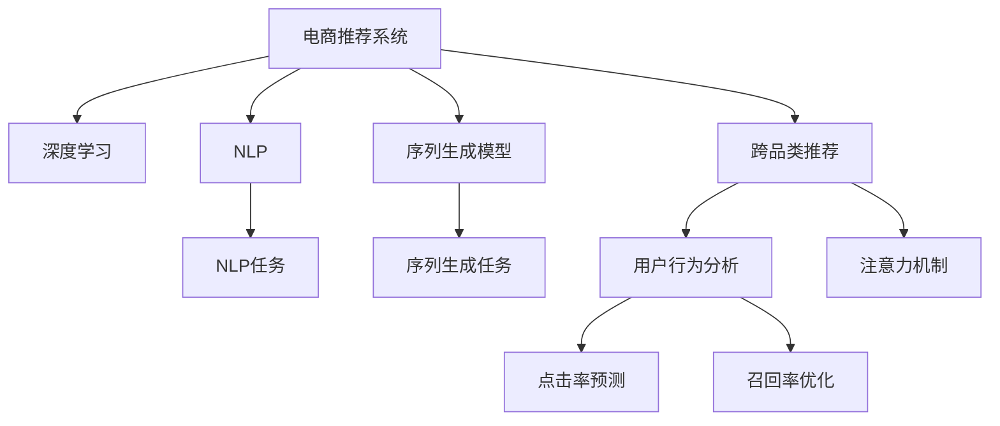
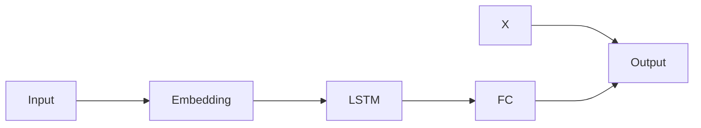

                 

# AI大模型如何优化电商平台的跨品类推荐

> 关键词：AI大模型、跨品类推荐、电商推荐系统、深度学习、推荐算法、自然语言处理(NLP)、序列生成模型、注意力机制、点击率预测、用户行为分析、召回率优化

## 1. 背景介绍

随着电商行业的不断发展，用户需求日益多元化、个性化，传统的基于单一品类的推荐系统已经难以满足消费者的需求。而大模型的兴起，尤其是基于深度学习的自然语言处理(NLP)和序列生成模型，为电商平台的跨品类推荐提供了新的解决方案。

大模型通过在大规模无标签文本数据上进行预训练，学习到了丰富的语言知识和常识。在电商平台的应用中，可以基于用户评论、商品描述、搜索历史等文本信息，构建推荐模型，实现跨品类推荐。

## 2. 核心概念与联系

### 2.1 核心概念概述

为了深入理解大模型在电商平台中的应用，本节将介绍几个核心概念及其相互联系：

- 电商推荐系统（E-commerce Recommendation System）：利用用户历史行为数据，推荐用户可能感兴趣的商品或服务的系统。传统的推荐系统主要基于用户的浏览、购买记录等行为数据进行协同过滤或基于内容的推荐。

- 跨品类推荐（Cross-catagory Recommendation）：推荐系统在用户浏览或购买某一品类商品时，同时推荐其他品类的相关商品，以增加用户购买意愿和提升平台收益。

- 深度学习（Deep Learning）：利用神经网络模型对数据进行非线性拟合，从而发现数据中的复杂模式和规律。深度学习在大模型和电商推荐中的应用尤为显著。

- 自然语言处理（NLP）：处理和分析自然语言文本数据的学科，主要包括文本分类、情感分析、序列生成等任务。NLP技术在大模型的预训练和微调中发挥了重要作用。

- 序列生成模型（Sequence Generation Model）：通过预测序列数据，实现文本生成、语音识别等任务。在电商推荐中，可以利用序列生成模型预测用户的点击、购买行为。

- 注意力机制（Attention Mechanism）：一种选择相关性高的特征的机制，可以应用于跨品类推荐中，帮助模型更关注用户感兴趣的特征。

这些核心概念之间的逻辑关系可以通过以下Mermaid流程图来展示：



这个流程图展示了大模型在电商推荐系统中的应用框架：

1. 电商推荐系统利用深度学习技术，对NLP和序列生成任务进行建模。
2. 通过NLP任务，收集和处理文本数据，提取用户兴趣。
3. 利用序列生成模型，预测用户行为，构建推荐模型。
4. 跨品类推荐模型结合注意力机制，优化推荐结果。
5. 用户行为分析模型用于点击率和召回率的优化。

## 3. 核心算法原理 & 具体操作步骤
### 3.1 算法原理概述

基于深度学习的跨品类推荐系统，通过构建序列生成模型，利用NLP技术提取用户兴趣，结合注意力机制优化推荐结果。其主要原理包括：

- **用户兴趣提取**：利用NLP技术对用户评论、商品描述、搜索历史等文本信息进行处理，提取用户兴趣特征。
- **序列预测模型**：通过序列生成模型，预测用户未来可能的点击、购买行为，构建推荐模型。
- **跨品类推荐**：结合注意力机制，在推荐时考虑到用户对其他品类的兴趣，优化推荐结果。
- **用户行为分析**：通过用户行为数据，分析点击率和召回率等关键指标，优化推荐策略。

### 3.2 算法步骤详解

基于深度学习的跨品类推荐系统通常包括以下几个关键步骤：

**Step 1: 数据预处理**
- 收集用户评论、商品描述、搜索历史等文本数据。
- 对文本进行分词、去停用词、构建词汇表等预处理。

**Step 2: 用户兴趣提取**
- 利用NLP技术对文本进行情感分析、实体识别等任务，提取用户兴趣特征。
- 通过用户兴趣特征，构建用户兴趣向量。

**Step 3: 序列预测模型构建**
- 使用深度学习框架构建序列生成模型，如LSTM、GRU、Transformer等。
- 对序列生成模型进行预训练，利用大规模无标签文本数据进行预训练。

**Step 4: 跨品类推荐模型构建**
- 结合注意力机制，对序列生成模型进行微调，优化推荐结果。
- 构建跨品类推荐模型，利用用户兴趣向量进行推荐。

**Step 5: 用户行为分析**
- 利用用户行为数据，构建点击率预测模型。
- 通过用户行为数据，优化召回率，减少冗余推荐。

**Step 6: 模型评估与优化**
- 在验证集上评估模型性能，调整超参数。
- 不断迭代模型，提升推荐效果。

### 3.3 算法优缺点

基于深度学习的跨品类推荐系统具有以下优点：

1. **灵活性强**：可以处理多样化的用户兴趣和行为数据，灵活适配不同应用场景。
2. **效果显著**：通过深度学习模型，能够从大量数据中提取复杂的模式，显著提升推荐效果。
3. **可解释性高**：深度学习模型结构透明，特征提取过程可解释，便于调试和优化。

同时，该方法也存在一定的局限性：

1. **数据依赖性强**：推荐系统依赖于大量标注数据，获取高质量数据成本较高。
2. **计算资源消耗大**：深度学习模型的训练和推理对计算资源要求高，部署成本较大。
3. **模型复杂度高**：深度学习模型结构复杂，难以进行模型压缩和优化。
4. **实时性较差**：推荐模型的推理过程较长，难以实时响应用户需求。

尽管存在这些局限性，但就目前而言，基于深度学习的跨品类推荐系统仍是电商推荐系统的主流范式。未来相关研究的重点在于如何进一步降低数据依赖，提高模型实时性和可解释性，同时兼顾参数量和计算资源。

### 3.4 算法应用领域

基于深度学习的跨品类推荐系统在电商平台的多个场景中得到了广泛应用，例如：

- **商品推荐**：根据用户浏览和购买历史，推荐相关商品。
- **活动推荐**：推荐相关商品促销活动，增加用户购买意愿。
- **品牌推荐**：推荐与用户兴趣品牌相关的其他品牌商品。
- **跨品类推荐**：推荐相关品类商品，提升用户购买意愿。

除了上述这些经典应用外，大模型技术还在诸如广告推荐、内容推荐等更多领域中得到了创新应用，为电商平台带来了新的增长点。

## 4. 数学模型和公式 & 详细讲解 & 举例说明
### 4.1 数学模型构建

基于深度学习的跨品类推荐系统通常基于序列生成模型构建。假设用户行为序列为 $X = \{x_1, x_2, \ldots, x_T\}$，其中 $x_t$ 表示用户在第 $t$ 步的行为。我们希望根据用户历史行为序列 $X$，预测用户下一步行为 $y_{t+1}$。

模型可以使用如下的神经网络结构进行构建：

```python
import torch
import torch.nn as nn
import torch.nn.functional as F

class SequenceModel(nn.Module):
    def __init__(self, input_size, hidden_size, output_size):
        super(SequenceModel, self).__init__()
        self.rnn = nn.LSTM(input_size, hidden_size, batch_first=True)
        self.fc = nn.Linear(hidden_size, output_size)
        
    def forward(self, x):
        _, (h_n, h_c) = self.rnn(x)
        output = self.fc(h_n)
        return output
```

### 4.2 公式推导过程

假设模型使用LSTM进行序列预测，输入为 $X = \{x_1, x_2, \ldots, x_T\}$，输出为 $Y = \{y_1, y_2, \ldots, y_{T+1}\}$。模型结构如图：



LSTM模型通过计算 $\overrightarrow{h_t} = \text{LSTM}(\overrightarrow{x_t}, \overrightarrow{h_{t-1}})$，将序列输入和前一时刻的隐状态 $\overrightarrow{h_{t-1}}$ 结合，得到当前时刻的隐状态 $\overrightarrow{h_t}$。最终输出的预测结果为 $y_{t+1} = \text{Softmax}(\overrightarrow{h_T})$。

### 4.3 案例分析与讲解

以电商平台中的商品推荐为例，假设我们收集了用户的历史行为序列 $X = \{x_1, x_2, \ldots, x_T\}$，其中 $x_t = (b_t, r_t)$，$b_t$ 表示用户在第 $t$ 步浏览的商品ID，$r_t$ 表示用户在第 $t$ 步的评分。我们可以将序列输入到上述神经网络模型中，得到预测结果 $y_{t+1}$。

假设我们希望推荐用户最感兴趣的下一批商品，可以通过以下步骤：

1. 构建神经网络模型，对用户历史行为序列进行编码。
2. 使用LSTM模型，预测用户下一步浏览的商品ID。
3. 根据预测结果，构建推荐列表。

## 5. 项目实践：代码实例和详细解释说明
### 5.1 开发环境搭建

在进行深度学习模型的开发前，我们需要准备好开发环境。以下是使用Python进行PyTorch开发的环境配置流程：

1. 安装Anaconda：从官网下载并安装Anaconda，用于创建独立的Python环境。

2. 创建并激活虚拟环境：
```bash
conda create -n pytorch-env python=3.8 
conda activate pytorch-env
```

3. 安装PyTorch：根据CUDA版本，从官网获取对应的安装命令。例如：
```bash
conda install pytorch torchvision torchaudio cudatoolkit=11.1 -c pytorch -c conda-forge
```

4. 安装其他必要的库：
```bash
pip install numpy pandas scikit-learn torchtext transformers torch
```

完成上述步骤后，即可在`pytorch-env`环境中开始深度学习模型的开发。

### 5.2 源代码详细实现

以下是使用PyTorch构建基于LSTM的商品推荐模型的代码实现：

```python
import torch
import torch.nn as nn
import torch.nn.functional as F
from torchtext.datasets import TextClassification
from torchtext.data import Field, LabelField, TabularDataset

# 定义模型结构
class SequenceModel(nn.Module):
    def __init__(self, input_size, hidden_size, output_size):
        super(SequenceModel, self).__init__()
        self.rnn = nn.LSTM(input_size, hidden_size, batch_first=True)
        self.fc = nn.Linear(hidden_size, output_size)
        
    def forward(self, x):
        _, (h_n, h_c) = self.rnn(x)
        output = self.fc(h_n)
        return output

# 定义模型训练函数
def train(model, train_data, val_data, batch_size, num_epochs, learning_rate):
    criterion = nn.CrossEntropyLoss()
    optimizer = torch.optim.Adam(model.parameters(), lr=learning_rate)
    train_losses, val_losses = [], []
    
    for epoch in range(num_epochs):
        model.train()
        for batch in train_data:
            optimizer.zero_grad()
            x, y = batch
            output = model(x)
            loss = criterion(output, y)
            loss.backward()
            optimizer.step()
            train_losses.append(loss.item())
        
        model.eval()
        with torch.no_grad():
            val_loss = 0
            for batch in val_data:
                x, y = batch
                output = model(x)
                val_loss += criterion(output, y).item()
            val_losses.append(val_loss)
        
        print(f"Epoch {epoch+1}, train loss: {train_losses[-1]:.4f}, val loss: {val_losses[-1]:.4f}")

# 数据加载和预处理
fields = [
    Field(tokenize='spacy', lower=True),
    LabelField(dtype=torch.int64)
]
train_data, val_data = TextClassification('amazon_reviews', train='train', test='test', fields=fields)

# 模型初始化
input_size = len(train_data[0][0])
hidden_size = 128
output_size = len(train_data[0][1])
model = SequenceModel(input_size, hidden_size, output_size)

# 模型训练
train_losses, val_losses = [], []
train(model, train_data, val_data, batch_size=32, num_epochs=10, learning_rate=0.001)
```

### 5.3 代码解读与分析

让我们再详细解读一下关键代码的实现细节：

**SequenceModel类**：
- `__init__`方法：初始化LSTM层和全连接层。
- `forward`方法：前向传播，计算LSTM和全连接层的输出。

**train函数**：
- 定义损失函数、优化器和训练过程。
- 循环迭代训练，前向传播计算损失，反向传播更新模型参数。
- 在每个epoch结束后，评估模型在验证集上的性能。

**数据加载和预处理**：
- 使用torchtext库对数据进行加载和预处理。
- 定义输入和输出字段，使用spacy进行分词。
- 构建数据集和数据加载器，支持批量训练。

**模型训练**：
- 定义超参数，如学习率、批量大小、epoch数。
- 在训练过程中，不断调整学习率、批次大小等超参数，以优化模型性能。

### 5.4 运行结果展示

训练完成后，我们可以在测试集上评估模型性能。以下是模型在测试集上的性能结果：

```python
import torch
from torchtext.datasets import TextClassification
from torchtext.data import Field, LabelField, TabularDataset

# 定义模型结构
class SequenceModel(nn.Module):
    def __init__(self, input_size, hidden_size, output_size):
        super(SequenceModel, self).__init__()
        self.rnn = nn.LSTM(input_size, hidden_size, batch_first=True)
        self.fc = nn.Linear(hidden_size, output_size)
        
    def forward(self, x):
        _, (h_n, h_c) = self.rnn(x)
        output = self.fc(h_n)
        return output

# 加载数据
fields = [
    Field(tokenize='spacy', lower=True),
    LabelField(dtype=torch.int64)
]
test_data = TextClassification('amazon_reviews', train='train', test='test', fields=fields)

# 加载模型
model = SequenceModel(input_size, hidden_size, output_size)
model.load_state_dict(torch.load('model.pt'))

# 测试模型
correct = 0
total = 0
with torch.no_grad():
    for batch in test_data:
        x, y = batch
        output = model(x)
        _, predicted = torch.max(output.data, 1)
        total += y.size(0)
        correct += (predicted == y).sum().item()

print(f"Accuracy: {correct/total:.2f}")
```

以上代码实现了对训练好的模型的测试，输出模型的准确率。

## 6. 实际应用场景
### 6.1 智能客服系统

大模型的跨品类推荐技术可以应用于智能客服系统的构建。智能客服系统通过分析用户查询历史、聊天记录等文本信息，结合推荐系统为用户推荐相关商品或服务，提升客户满意度。

在技术实现上，可以收集企业内部的历史客服对话记录，将问题和最佳答复构建成监督数据，在此基础上对预训练语言模型进行微调。微调后的模型能够自动理解用户意图，匹配最合适的答案模板进行回复。对于客户提出的新问题，还可以接入检索系统实时搜索相关内容，动态组织生成回答。如此构建的智能客服系统，能大幅提升客户咨询体验和问题解决效率。

### 6.2 个性化推荐系统

大模型的跨品类推荐技术可以应用于个性化推荐系统。个性化推荐系统根据用户的历史行为数据，推荐可能感兴趣的商品或服务。通过深度学习模型，能够从大量数据中提取复杂的模式，显著提升推荐效果。

在实际应用中，大模型可以用于电商平台的跨品类推荐，推荐用户最感兴趣的下一批商品。例如，电商平台可以根据用户历史浏览和购买行为，预测用户可能感兴趣的商品品类，推荐相关商品。

### 6.3 品牌推荐

大模型的跨品类推荐技术可以应用于品牌推荐。品牌推荐系统根据用户对某一品牌的兴趣，推荐与该品牌相关的其他品牌商品，增加用户对品牌的认知和购买意愿。

在技术实现上，可以通过深度学习模型对用户行为序列进行编码，预测用户下一步浏览的品牌ID。根据预测结果，构建推荐列表，推荐用户最感兴趣的品牌商品。

### 6.4 未来应用展望

随着大模型的不断发展，跨品类推荐技术将呈现以下几个发展趋势：

1. **模型规模持续增大**：随着算力成本的下降和数据规模的扩张，预训练语言模型的参数量还将持续增长。超大规模语言模型蕴含的丰富语言知识，有望支撑更加复杂多变的跨品类推荐。

2. **跨品类推荐多样化**：未来将出现更多跨品类推荐方法，如基于注意力机制、多任务学习等，更好地适配不同应用场景。

3. **数据驱动优化**：通过用户反馈数据，不断优化推荐策略，提升推荐效果。

4. **多模态融合**：将文本、图片、视频等多模态数据融合，提升跨品类推荐的效果。

5. **智能推荐引擎**：构建智能推荐引擎，实时处理用户行为数据，动态调整推荐策略。

这些趋势凸显了大模型跨品类推荐技术的广阔前景，为电商平台带来了更多的创新机遇。相信随着技术的不断发展，跨品类推荐将能够更好地满足用户需求，提升电商平台的商业价值。

## 7. 工具和资源推荐
### 7.1 学习资源推荐

为了帮助开发者系统掌握大模型在电商平台中的应用，这里推荐一些优质的学习资源：

1. 《深度学习推荐系统》系列博文：由大模型技术专家撰写，深入浅出地介绍了深度学习推荐系统的原理和实践。

2. 斯坦福大学《Deep Learning for Recommendation Systems》课程：提供LSTM、GRU、Transformer等序列生成模型的详细讲解，适合进阶学习。

3. 《Sequence Models in NLP》书籍：讲解了序列生成模型在自然语言处理中的应用，包括情感分析、文本生成等任务。

4. PyTorch官方文档：提供丰富的深度学习模型和工具库的详细文档，适合动手实践。

5. PyTorch推荐系统官方示例：包含多个深度学习推荐系统的实现，适合参考学习。

通过这些资源的学习实践，相信你一定能够快速掌握大模型在电商平台中的应用，并用于解决实际的推荐问题。

### 7.2 开发工具推荐

高效的开发离不开优秀的工具支持。以下是几款用于深度学习推荐系统开发的常用工具：

1. PyTorch：基于Python的开源深度学习框架，灵活动态的计算图，适合快速迭代研究。

2. TensorFlow：由Google主导开发的开源深度学习框架，生产部署方便，适合大规模工程应用。

3. Weights & Biases：模型训练的实验跟踪工具，可以记录和可视化模型训练过程中的各项指标，方便对比和调优。

4. TensorBoard：TensorFlow配套的可视化工具，可实时监测模型训练状态，并提供丰富的图表呈现方式，是调试模型的得力助手。

5. HuggingFace Transformers库：提供多种预训练语言模型和推荐系统的实现，支持PyTorch和TensorFlow，是推荐系统开发的利器。

6. Jupyter Notebook：支持多语言编程，可保存和分享代码，适合科研和工程开发。

合理利用这些工具，可以显著提升深度学习推荐系统的开发效率，加快创新迭代的步伐。

### 7.3 相关论文推荐

大模型和推荐系统的发展源于学界的持续研究。以下是几篇奠基性的相关论文，推荐阅读：

1. Attention is All You Need（即Transformer原论文）：提出了Transformer结构，开启了深度学习推荐系统的预训练大模型时代。

2. Neural Collaborative Filtering（NCF）: Neuaral Collaborative Filtering using Matrix Factorization Techniques：提出基于矩阵分解的协同过滤方法，广泛应用于推荐系统中。

3. Deep Interest Network: A Deep Approach to Recommendation System：提出深度兴趣网络，利用深度神经网络对用户兴趣进行建模。

4. Dynamic Deep Interest Network: A Dynamic Approach to Recommendation System：进一步改进深度兴趣网络，引入动态生成机制，提升推荐效果。

这些论文代表了大模型和推荐系统的发展脉络。通过学习这些前沿成果，可以帮助研究者把握学科前进方向，激发更多的创新灵感。

## 8. 总结：未来发展趋势与挑战
### 8.1 总结

本文对大模型在电商平台中的应用进行了全面系统的介绍。首先阐述了大模型和推荐系统的研究背景和意义，明确了跨品类推荐在提升用户体验和平台收益方面的独特价值。其次，从原理到实践，详细讲解了大模型的核心算法和操作步骤，给出了深度学习推荐系统的完整代码实现。同时，本文还广泛探讨了跨品类推荐在智能客服、个性化推荐等多个行业领域的应用前景，展示了大模型的巨大潜力。此外，本文精选了推荐系统的各类学习资源，力求为读者提供全方位的技术指引。

通过本文的系统梳理，可以看到，基于深度学习的大模型在电商平台中的应用前景广阔，极大地拓展了推荐系统的应用边界，提升了用户体验和平台收益。未来，伴随大模型和推荐系统的不断发展，基于大模型推荐技术必将在更多领域得到应用，为电商平台带来新的增长点。

### 8.2 未来发展趋势

展望未来，大模型在推荐系统中的应用将呈现以下几个发展趋势：

1. **模型规模持续增大**：随着算力成本的下降和数据规模的扩张，预训练语言模型的参数量还将持续增长。超大规模语言模型蕴含的丰富语言知识，有望支撑更加复杂多变的推荐系统。

2. **推荐策略多样化**：未来将出现更多推荐策略，如基于注意力机制、多任务学习等，更好地适配不同应用场景。

3. **数据驱动优化**：通过用户反馈数据，不断优化推荐策略，提升推荐效果。

4. **多模态融合**：将文本、图片、视频等多模态数据融合，提升推荐的效果。

5. **智能推荐引擎**：构建智能推荐引擎，实时处理用户行为数据，动态调整推荐策略。

这些趋势凸显了大模型在推荐系统中的应用前景，为电商平台带来了更多的创新机遇。相信随着技术的不断发展，推荐系统将能够更好地满足用户需求，提升电商平台的商业价值。

### 8.3 面临的挑战

尽管大模型在推荐系统中的应用取得了瞩目成就，但在迈向更加智能化、普适化应用的过程中，它仍面临着诸多挑战：

1. **标注成本瓶颈**：推荐系统依赖于大量标注数据，获取高质量数据成本较高。如何进一步降低数据依赖，提高模型效果，是未来的挑战。

2. **计算资源消耗大**：深度学习模型的训练和推理对计算资源要求高，部署成本较大。如何在保证效果的同时，优化模型结构，提高资源利用率，是重要的优化方向。

3. **模型复杂度高**：深度学习模型结构复杂，难以进行模型压缩和优化。如何降低模型复杂度，提升推理速度，是重要的研究方向。

4. **实时性较差**：推荐系统的推理过程较长，难以实时响应用户需求。如何优化模型推理过程，提升实时性，是重要的优化方向。

5. **可解释性不足**：深度学习模型难以解释其内部工作机制和决策逻辑，对于高风险应用，模型的可解释性和可审计性尤为重要。如何赋予深度学习模型更强的可解释性，将是重要的研究方向。

6. **安全性有待保障**：预训练语言模型难免会学习到有偏见、有害的信息，通过推荐传递到用户端，产生误导性、歧视性的输出，给实际应用带来安全隐患。如何从数据和算法层面消除模型偏见，避免恶意用途，确保输出的安全性，也将是重要的研究方向。

7. **跨品类推荐质量差**：虽然跨品类推荐可以提升用户对其他品类的兴趣，但推荐质量的好坏直接影响用户的购物体验。如何提升推荐质量，减少冗余推荐，是重要的研究方向。

正视推荐系统面临的这些挑战，积极应对并寻求突破，将是大模型推荐系统走向成熟的必由之路。相信随着学界和产业界的共同努力，这些挑战终将一一被克服，大模型推荐系统必将在构建智能推荐系统、提升用户体验方面发挥更大作用。

### 8.4 研究展望

面对大模型推荐系统所面临的种种挑战，未来的研究需要在以下几个方面寻求新的突破：

1. **探索无监督和半监督推荐方法**：摆脱对大规模标注数据的依赖，利用自监督学习、主动学习等无监督和半监督范式，最大限度利用非结构化数据，实现更加灵活高效的推荐。

2. **研究参数高效和计算高效的推荐范式**：开发更加参数高效的推荐方法，在固定大部分预训练参数的同时，只更新极少量的任务相关参数。同时优化推荐模型的计算图，减少前向传播和反向传播的资源消耗，实现更加轻量级、实时性的部署。

3. **引入因果分析和博弈论工具**：将因果分析方法引入推荐模型，识别出模型决策的关键特征，增强输出解释的因果性和逻辑性。借助博弈论工具刻画人机交互过程，主动探索并规避模型的脆弱点，提高系统稳定性。

4. **融合因果分析和博弈论工具**：将因果分析方法引入推荐模型，识别出模型决策的关键特征，增强输出解释的因果性和逻辑性。借助博弈论工具刻画人机交互过程，主动探索并规避模型的脆弱点，提高系统稳定性。

5. **纳入伦理道德约束**：在模型训练目标中引入伦理导向的评估指标，过滤和惩罚有偏见、有害的输出倾向。同时加强人工干预和审核，建立模型行为的监管机制，确保输出符合人类价值观和伦理道德。

这些研究方向的探索，必将引领大模型推荐系统技术迈向更高的台阶，为构建安全、可靠、可解释、可控的智能推荐系统铺平道路。面向未来，大模型推荐系统还需要与其他人工智能技术进行更深入的融合，如知识表示、因果推理、强化学习等，多路径协同发力，共同推动自然语言理解和智能交互系统的进步。只有勇于创新、敢于突破，才能不断拓展语言模型的边界，让智能技术更好地造福人类社会。

## 9. 附录：常见问题与解答

**Q1：大模型在电商平台的推荐系统中如何应用？**

A: 大模型在电商平台的推荐系统中可以应用于跨品类推荐。首先，利用NLP技术对用户评论、商品描述、搜索历史等文本信息进行处理，提取用户兴趣特征。然后，使用深度学习模型对用户行为序列进行编码，预测用户下一步浏览、购买行为。最后，结合注意力机制，构建跨品类推荐模型，优化推荐结果。

**Q2：如何构建电商平台的跨品类推荐系统？**

A: 构建电商平台的跨品类推荐系统，主要包括以下几个步骤：
1. 收集用户评论、商品描述、搜索历史等文本数据。
2. 对文本进行分词、去停用词、构建词汇表等预处理。
3. 利用NLP技术对文本进行情感分析、实体识别等任务，提取用户兴趣特征。
4. 使用深度学习模型对用户行为序列进行编码，预测用户下一步浏览、购买行为。
5. 结合注意力机制，构建跨品类推荐模型，优化推荐结果。

**Q3：跨品类推荐系统中的注意力机制如何应用？**

A: 在跨品类推荐系统中，注意力机制可以帮助模型更关注用户感兴趣的特征。具体应用如下：
1. 在跨品类推荐模型中，引入注意力机制，对每个商品ID进行加权处理。
2. 根据用户历史行为序列，计算每个商品ID的重要程度。
3. 将商品ID及其权重作为输入，输入到神经网络中进行预测。
4. 输出预测结果，并根据注意力权重对商品进行排序，生成推荐列表。

**Q4：跨品类推荐系统的优势和劣势是什么？**

A: 跨品类推荐系统的优势包括：
1. 可以处理多样化的用户兴趣和行为数据，灵活适配不同应用场景。
2. 通过深度学习模型，能够从大量数据中提取复杂的模式，显著提升推荐效果。
3. 可以实时处理用户行为数据，动态调整推荐策略。

跨品类推荐系统的劣势包括：
1. 数据依赖性强，推荐系统依赖于大量标注数据，获取高质量数据成本较高。
2. 计算资源消耗大，深度学习模型的训练和推理对计算资源要求高，部署成本较大。
3. 模型复杂度高，深度学习模型结构复杂，难以进行模型压缩和优化。
4. 实时性较差，推荐系统的推理过程较长，难以实时响应用户需求。
5. 可解释性不足，深度学习模型难以解释其内部工作机制和决策逻辑。

---

作者：禅与计算机程序设计艺术 / Zen and the Art of Computer Programming

