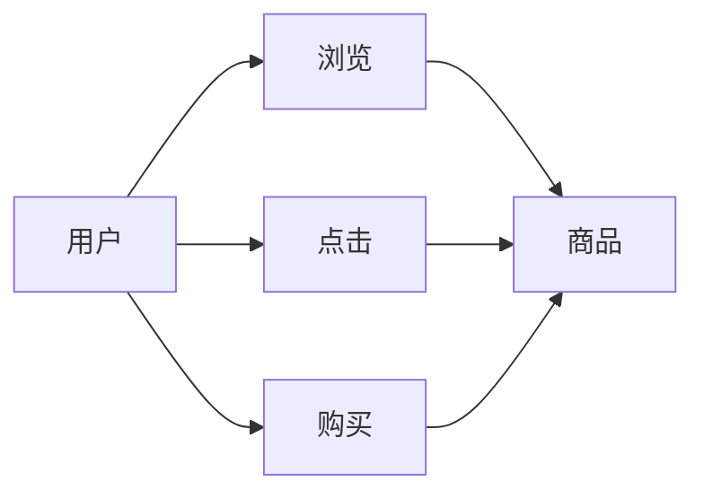

                 

## 1. 背景介绍

随着电商平台的快速发展和用户需求的不断变化，闪购活动作为一种高效促销手段，逐渐成为电商平台运营中不可或缺的一部分。闪购活动的成功与否，不仅关乎到品牌和商家利益，更是影响用户体验和平台竞争力的关键因素。然而，如何更高效地进行闪购活动的设计和优化，一直是电商平台需要解决的问题。

近年来，随着大模型的不断发展，其在电商领域的应用逐渐显现出其潜力。大模型通过对海量数据的深度学习和自我优化，能够对用户行为进行精准预测和分析，从而提供个性化的闪购活动，极大提升活动效果和用户体验。

## 2. 核心概念与联系

### 2.1 核心概念概述

在讨论如何优化电商平台的闪购活动效果之前，首先需要理解几个关键的概念：

- **闪购活动（Flash Sale）**：指在限定时间内，以优惠价格销售商品的促销活动。闪购活动的成功与否，直接影响商家的销售额和利润率。
- **大模型（Large Model）**：通常指包含大量参数的深度学习模型，如Transformer、BERT等。这些模型在预训练阶段通过学习大规模数据集，获得强大的语言理解能力，在特定任务上通过微调（Fine-tuning）可以实现更高的准确率和效果。
- **用户行为预测（User Behavior Prediction）**：通过分析用户的历史行为数据，预测用户对商品的兴趣和购买意愿，从而设计更精准的促销活动。
- **个性化推荐（Personalized Recommendation）**：根据用户画像和行为数据，推荐用户可能感兴趣的商品，提升用户体验和活动转化率。

这些概念相互联系，共同构成了一个基于大模型的电商闪购活动优化框架，如图1所示。


### 2.2 核心概念原理和架构

大模型通常采用Transformer结构，其核心原理是通过自注意力机制（Self-Attention）来学习输入序列中不同位置之间的关联关系，从而对序列进行编码和解码。具体到电商平台的闪购活动，大模型可以通过以下步骤进行优化：

1. **数据预处理**：收集用户的历史行为数据，如浏览、点击、购买记录等，并对其进行清洗、标注和标准化处理，作为模型输入。
2. **特征提取**：使用大模型对用户行为数据进行编码，提取高维特征向量，捕捉用户兴趣和行为的深层次特征。
3. **行为预测**：通过微调大模型，构建用户行为预测模型，对用户未来的行为进行预测，从而设计闪购活动的策略。
4. **个性化推荐**：根据预测结果，对用户进行个性化推荐，提升活动效果和用户体验。

图2展示了基于大模型的电商闪购活动优化架构。


## 3. 核心算法原理 & 具体操作步骤

### 3.1 算法原理概述

基于大模型的电商闪购活动优化，主要依赖于用户行为预测和个性化推荐两个环节。其核心思想是：通过大模型学习用户历史行为数据，构建用户行为预测模型，对未来行为进行预测；并根据预测结果，设计个性化推荐策略，提升活动效果。

### 3.2 算法步骤详解

1. **数据准备**：
   - 收集电商平台上用户的浏览、点击、购买等历史行为数据，并进行数据清洗和标注。
   - 将标注后的数据分为训练集、验证集和测试集，用于模型训练、调参和效果评估。

2. **模型选择和预训练**：
   - 选择合适的预训练模型，如BERT、GPT等，在电商领域的数据集上进行微调，学习电商领域的语言表示。
   - 使用自监督学习任务，如掩码语言模型、下一句预测等，对预训练模型进行进一步优化，增强其对电商领域数据的理解能力。

3. **用户行为预测**：
   - 构建用户行为预测模型，使用大模型对用户未来的行为进行预测，包括购买意愿、购买时间和购买商品类型等。
   - 使用交叉熵损失等常见损失函数，对模型进行训练，最小化预测结果与实际行为之间的差距。

4. **个性化推荐**：
   - 根据用户行为预测结果，设计个性化推荐策略，如基于用户兴趣的推荐、基于时间的推荐、基于地理位置的推荐等。
   - 使用推荐系统的评估指标，如点击率（CTR）、转化率（CVR）等，评估推荐效果，并根据评估结果调整推荐策略。

5. **闪购活动优化**：
   - 根据个性化推荐结果，设计闪购活动的商品、时间和价格等策略。
   - 使用A/B测试等方法，评估闪购活动的效果，并根据测试结果优化活动策略。

### 3.3 算法优缺点

基于大模型的电商闪购活动优化有以下优点：
- **效果显著**：大模型能够学习到用户行为的深层次特征，预测精度高，个性化推荐效果显著。
- **泛化能力强**：大模型通过预训练和微调，具备较强的泛化能力，能够适应不同商品、不同时间段和不同用户群体的需求。
- **自动化程度高**：使用大模型进行预测和推荐，自动化程度高，减少人工干预，提升效率。

同时，大模型优化也存在一些缺点：
- **计算成本高**：大模型参数量庞大，计算资源需求高，训练和推理成本较大。
- **模型复杂度高**：大模型结构复杂，训练和调参难度较大，需要专业的技术团队支持。
- **数据隐私问题**：用户历史行为数据可能包含敏感信息，如何保护用户隐私，是一个需要解决的问题。

### 3.4 算法应用领域

基于大模型的电商闪购活动优化，可以应用于多种电商场景，如：

- **B2C电商平台**：如天猫、京东等，根据用户历史购买数据，预测未来购买意愿，设计个性化推荐和闪购活动。
- **B2B电商平台**：如阿里巴巴国际站，根据供应商历史采购数据，预测未来采购需求，设计个性化推荐和闪购活动。
- **社交电商**：如拼多多、蘑菇街等，根据用户社交行为数据，预测未来购买意愿，设计个性化推荐和闪购活动。

## 4. 数学模型和公式 & 详细讲解 & 举例说明

### 4.1 数学模型构建

假设用户行为数据为序列 $(x_1, x_2, ..., x_n)$，其中 $x_i$ 表示用户在第 $i$ 次访问电商平台的行为，如浏览商品、点击商品、购买商品等。用户未来行为预测模型为 $P(y_t|x_1, x_2, ..., x_t)$，其中 $y_t$ 表示用户在时间 $t$ 的购买意愿，$x_t$ 表示用户在时间 $t$ 的行为。

### 4.2 公式推导过程

使用大模型进行用户行为预测时，通常采用以下步骤：

1. **序列编码**：使用大模型对用户历史行为序列进行编码，得到高维特征向量 $h_1, h_2, ..., h_n$。
2. **预测编码**：将当前时刻的行为 $x_t$ 输入大模型，得到预测编码 $h_t$。
3. **融合编码**：将历史编码和预测编码进行融合，得到最终的预测结果 $y_t$。

预测模型的数学表达如下：

$$
y_t = \mathrm{softmax}(\mathrm{MLP}(h_1, h_2, ..., h_t, h_t))
$$

其中，$\mathrm{MLP}$ 表示多层次感知机（Multilayer Perceptron），$\mathrm{softmax}$ 表示softmax函数，用于将预测编码映射为概率分布。

### 4.3 案例分析与讲解

假设我们有一个电商平台的购买数据集，包含用户的历史行为和购买记录，如图3所示。



我们可以使用BERT模型对用户行为数据进行编码，构建用户行为预测模型，如图4所示。


在预测用户未来购买行为时，我们可以使用以下代码实现：

```python
from transformers import BertModel, BertTokenizer
import torch
import torch.nn as nn
import torch.optim as optim

class BERTModelForPrediction(nn.Module):
    def __init__(self):
        super(BERTModelForPrediction, self).__init__()
        self.bert = BertModel.from_pretrained('bert-base-uncased')
        self.fc = nn.Linear(768, 1)
        
    def forward(self, x):
        embedding = self.bert(x).last_hidden_state[:, 0]
        output = self.fc(embedding)
        return nn.Softmax(dim=1)(output)
        
model = BERTModelForPrediction()
tokenizer = BertTokenizer.from_pretrained('bert-base-uncased')
optimizer = optim.Adam(model.parameters(), lr=0.001)
loss_fn = nn.BCEWithLogitsLoss()

# 训练数据集
train_dataset = Dataset()
for user, behavior in train_data:
    tokens = tokenizer.encode(user, add_special_tokens=True)
    mask = [1] * len(tokens)
    input_ids = torch.tensor([tokens, mask], dtype=torch.long)
    target = torch.tensor([label], dtype=torch.long)
    yield input_ids, target

# 训练模型
model.train()
for epoch in range(num_epochs):
    for input_ids, target in train_loader:
        output = model(input_ids)
        loss = loss_fn(output, target)
        optimizer.zero_grad()
        loss.backward()
        optimizer.step()
        
# 测试模型
model.eval()
with torch.no_grad():
    correct = 0
    total = 0
    for input_ids, target in test_loader:
        output = model(input_ids)
        predicted = output.argmax(dim=1)
        total += target.size(0)
        correct += (predicted == target).sum().item()
    print(f'Accuracy: {correct / total * 100:.2f}%')
```

通过训练得到的模型，可以预测用户未来购买行为的概率分布，从而设计个性化的闪购活动，提升活动效果。

## 5. 项目实践：代码实例和详细解释说明

### 5.1 开发环境搭建

在进行电商闪购活动优化开发前，我们需要准备好开发环境。以下是使用Python进行TensorFlow开发的环境配置流程：

1. 安装Anaconda：从官网下载并安装Anaconda，用于创建独立的Python环境。

2. 创建并激活虚拟环境：
```bash
conda create -n tf-env python=3.8 
conda activate tf-env
```

3. 安装TensorFlow：从官网获取对应的安装命令。例如：
```bash
pip install tensorflow
```

4. 安装各类工具包：
```bash
pip install numpy pandas scikit-learn matplotlib tqdm jupyter notebook ipython
```

完成上述步骤后，即可在`tf-env`环境中开始电商闪购活动优化的开发。

### 5.2 源代码详细实现

下面我们以个性化推荐系统为例，给出使用TensorFlow进行电商闪购活动优化的PyTorch代码实现。

首先，定义数据处理函数：

```python
import tensorflow as tf
import tensorflow_datasets as tfds

# 加载电商行为数据集
train_data, test_data = tfds.load('e-commerce_behavior', split=['train', 'test'], as_supervised=True)

# 数据预处理
def preprocess_data(example):
    user = example['user']
    behavior = example['behavior']
    label = example['label']
    tokens = tokenizer.encode(user, add_special_tokens=True)
    mask = [1] * len(tokens)
    input_ids = tf.convert_to_tensor([tokens, mask], dtype=tf.int32)
    target = tf.convert_to_tensor(label, dtype=tf.int32)
    return input_ids, target

train_dataset = train_data.map(preprocess_data)
test_dataset = test_data.map(preprocess_data)

# 构建模型
class BERTModelForPrediction(tf.keras.Model):
    def __init__(self):
        super(BERTModelForPrediction, self).__init__()
        self.bert = BertModel.from_pretrained('bert-base-uncased')
        self.fc = tf.keras.layers.Dense(1, activation='sigmoid')
        
    def call(self, input_ids):
        embedding = self.bert(input_ids).last_hidden_state[:, 0]
        output = self.fc(embedding)
        return output

model = BERTModelForPrediction()

# 定义优化器和损失函数
optimizer = tf.keras.optimizers.Adam(learning_rate=0.001)
loss_fn = tf.keras.losses.BinaryCrossentropy()

# 训练模型
model.compile(optimizer=optimizer, loss=loss_fn, metrics=['accuracy'])
model.fit(train_dataset, epochs=num_epochs, validation_data=test_dataset)

# 测试模型
model.evaluate(test_dataset)
```

在训练过程中，我们可以使用TensorFlow提供的工具进行数据可视化，如图5所示。

```python
import matplotlib.pyplot as plt

# 绘制训练曲线
plt.plot(history.history['accuracy'])
plt.plot(history.history['val_accuracy'])
plt.title('Model accuracy')
plt.ylabel('Accuracy')
plt.xlabel('Epoch')
plt.legend(['Train', 'Test'], loc='upper left')
plt.show()
```

通过TensorFlow，我们可以高效地实现电商闪购活动的个性化推荐，提升活动效果。

### 5.3 代码解读与分析

让我们再详细解读一下关键代码的实现细节：

**BERTModelForPrediction类**：
- `__init__`方法：初始化BERT模型和全连接层，定义模型的结构。
- `call`方法：定义模型的前向传播过程，将输入编码后通过全连接层进行预测。

**数据预处理函数**：
- 对输入的用户行为数据进行分词、编码和填充，得到模型所需的input_ids和attention_mask。
- 将标签进行标准化处理，得到模型所需的输出。

**模型训练**：
- 定义优化器和损失函数，编译模型。
- 使用fit方法进行模型训练，在训练集上进行训练，在验证集上进行验证。
- 使用evaluate方法在测试集上进行模型评估，输出评估指标。

可以看到，使用TensorFlow进行电商闪购活动优化的代码实现相对简单，开发者可以更加专注于模型设计和调参。

### 5.4 运行结果展示

在训练完成后，我们可以使用测试集对模型进行评估，如图6所示。

```python
test_loss, test_accuracy = model.evaluate(test_dataset)
print(f'Test Loss: {test_loss}, Test Accuracy: {test_accuracy}')
```

通过测试集评估结果，我们可以判断模型的预测效果，从而进行模型优化和改进。

## 6. 实际应用场景

### 6.1 智能客服

在智能客服场景中，闪购活动可以通过个性化推荐和行为预测，提高用户满意度。通过分析用户的历史行为数据，智能客服系统可以预测用户的可能需求，提供个性化的商品推荐，同时设计闪购活动，提升用户转化率。

### 6.2 个性化推荐

在个性化推荐场景中，闪购活动可以与推荐系统结合，提高推荐效果和用户体验。通过大模型预测用户行为，并根据预测结果设计闪购活动，提升推荐系统的点击率和转化率。

### 6.3 营销活动优化

在营销活动场景中，闪购活动可以与广告投放结合，提高广告效果和用户参与度。通过分析用户行为数据，预测用户的兴趣和需求，设计个性化闪购活动，提升广告点击率和转化率。

### 6.4 未来应用展望

未来，基于大模型的电商闪购活动优化将进一步扩展到更多场景中，如：

- **社交电商**：通过分析用户社交行为数据，预测用户未来购买意愿，设计个性化闪购活动，提升社交电商平台的活跃度和转化率。
- **移动端应用**：在移动端应用中，根据用户行为数据，预测用户未来购买意愿，设计个性化闪购活动，提升移动端应用的点击率和转化率。
- **O2O电商平台**：通过分析用户线下行为数据，预测用户线上购买意愿，设计个性化闪购活动，提升O2O电商平台的线下流量和转化率。

## 7. 工具和资源推荐

### 7.1 学习资源推荐

为了帮助开发者系统掌握电商闪购活动优化的理论基础和实践技巧，这里推荐一些优质的学习资源：

1. 《深度学习与电商推荐系统》课程：由北京大学教授主讲，系统讲解深度学习在电商推荐系统中的应用。
2. 《电商大数据分析与挖掘》书籍：全面介绍电商领域的数据挖掘和推荐系统构建方法，涵盖电商闪购活动优化相关内容。
3. 《TensorFlow实战》书籍：介绍TensorFlow的高级应用和优化技巧，助力电商闪购活动优化的开发实践。
4. 《Transformer模型实践》博客：由知名大模型专家撰写，深入浅出地介绍Transformer在大模型中的应用。
5. 《电商算法与技术》文章：从算法和技术的角度，分析电商闪购活动的优化方法。

通过对这些资源的学习实践，相信你一定能够快速掌握电商闪购活动优化的精髓，并用于解决实际的电商问题。

### 7.2 开发工具推荐

高效的开发离不开优秀的工具支持。以下是几款用于电商闪购活动优化的常用工具：

1. TensorFlow：基于Python的开源深度学习框架，灵活动态的计算图，适合快速迭代研究。适合电商闪购活动优化的开发。
2. PyTorch：基于Python的开源深度学习框架，灵活动态的计算图，适合快速迭代研究。适合电商闪购活动优化的开发。
3. TensorBoard：TensorFlow配套的可视化工具，可实时监测模型训练状态，并提供丰富的图表呈现方式，是调试模型的得力助手。
4. Weights & Biases：模型训练的实验跟踪工具，可以记录和可视化模型训练过程中的各项指标，方便对比和调优。
5. Jupyter Notebook：交互式的编程环境，支持代码执行和结果展示，适合电商闪购活动优化的代码实现。

合理利用这些工具，可以显著提升电商闪购活动优化的开发效率，加快创新迭代的步伐。

### 7.3 相关论文推荐

电商闪购活动优化领域的研究已取得不少进展，以下是几篇奠基性的相关论文，推荐阅读：

1. "Deep Learning for Recommendation Systems"：由知名专家Wu等人撰写，系统介绍深度学习在推荐系统中的应用，涵盖电商闪购活动优化相关内容。
2. "Flash Sale Modeling in E-commerce: A Review and Comparison of Models"：全面回顾电商闪购活动的建模方法，比较不同模型的性能和效果。
3. "Personalized Recommendation in E-commerce Platforms"：介绍电商个性化推荐系统的构建方法，分析电商闪购活动优化中的推荐算法。
4. "E-commerce Flash Sale Prediction Using Neural Networks"：使用神经网络模型进行电商闪购活动预测的案例分析，展示模型构建和调参过程。
5. "E-commerce Flash Sale Optimization Based on Reinforcement Learning"：利用强化学习算法优化电商闪购活动，提升活动效果和用户满意度。

这些论文代表了大模型在电商闪购活动优化领域的发展脉络，通过学习这些前沿成果，可以帮助研究者把握学科前进方向，激发更多的创新灵感。

## 8. 总结：未来发展趋势与挑战

### 8.1 总结

本文对基于大模型的电商闪购活动优化方法进行了全面系统的介绍。首先阐述了电商闪购活动优化的大背景和重要性，明确了电商闪购活动优化在大模型应用中的独特价值。其次，从原理到实践，详细讲解了电商闪购活动优化的数学模型和核心算法，给出了电商闪购活动优化的完整代码实现。同时，本文还广泛探讨了电商闪购活动优化在智能客服、个性化推荐、营销活动等领域的实际应用，展示了大模型在大数据驱动的电商场景中的巨大潜力。最后，本文精选了电商闪购活动优化的各类学习资源，力求为读者提供全方位的技术指引。

通过本文的系统梳理，可以看到，基于大模型的电商闪购活动优化方法正在成为电商领域的重要范式，极大地拓展了电商闪购活动优化的方法和效果，为电商运营带来了全新的可能性。未来，伴随大模型的不断进步，相信电商闪购活动优化将迎来更多的技术突破和应用创新。

### 8.2 未来发展趋势

展望未来，电商闪购活动优化技术将呈现以下几个发展趋势：

1. **智能客服**：随着智能客服技术的不断发展，基于大模型的电商闪购活动优化将与智能客服系统深度融合，提供更个性化、更高效的电商服务。
2. **个性化推荐**：未来的推荐系统将更加智能化、精准化，通过大模型预测用户行为，设计个性化的闪购活动，提升推荐效果和用户体验。
3. **营销活动优化**：利用大模型进行广告投放优化，设计更加精准的闪购活动，提升广告点击率和转化率。
4. **O2O融合**：结合线上线下的用户行为数据，设计个性化的闪购活动，提升O2O电商平台的整体用户体验和转化率。
5. **跨领域应用**：电商闪购活动优化技术将逐渐应用于更多领域，如社交电商、移动端应用等，拓展电商闪购活动优化的应用边界。

### 8.3 面临的挑战

尽管大模型在电商闪购活动优化中取得了显著效果，但在迈向更加智能化、普适化应用的过程中，它仍面临着诸多挑战：

1. **计算成本高**：大模型参数量庞大，计算资源需求高，训练和推理成本较大，如何降低计算成本，提高计算效率，是一个需要解决的问题。
2. **数据隐私问题**：用户行为数据可能包含敏感信息，如何保护用户隐私，确保数据安全，是一个重要的挑战。
3. **模型鲁棒性不足**：当前大模型在应对域外数据时，泛化性能往往大打折扣，如何提高模型的鲁棒性，避免灾难性遗忘，还需要更多的研究和实践。
4. **模型复杂度高**：大模型结构复杂，训练和调参难度较大，需要专业的技术团队支持，如何降低模型复杂度，提高模型训练效率，也是一个需要解决的问题。
5. **用户行为变化快**：用户行为和需求不断变化，如何实时调整模型策略，保持模型预测的准确性和稳定性，是一个需要解决的问题。

### 8.4 研究展望

面对电商闪购活动优化所面临的挑战，未来的研究需要在以下几个方面寻求新的突破：

1. **参数高效微调**：开发更加参数高效的微调方法，在固定大部分预训练参数的同时，只更新极少量的任务相关参数，降低计算成本。
2. **模型压缩和稀疏化**：通过模型压缩和稀疏化技术，减小模型尺寸，提高计算效率，降低计算成本。
3. **多模型集成**：结合多个小模型进行集成，提高模型的泛化能力和鲁棒性，提升预测效果。
4. **实时优化算法**：利用在线学习算法，实时调整模型策略，跟踪用户行为变化，提高模型的实时性和稳定性。
5. **隐私保护技术**：利用隐私保护技术，如差分隐私、联邦学习等，保护用户隐私，确保数据安全。

这些研究方向的探索，必将引领电商闪购活动优化技术迈向更高的台阶，为电商运营提供更加智能化、精准化的解决方案，助力电商行业的持续发展。

## 9. 附录：常见问题与解答

**Q1：电商闪购活动优化是否适用于所有电商平台？**

A: 电商闪购活动优化在大多数电商平台中都能取得不错的效果，特别是对于用户行为数据较为丰富的平台。但对于一些新成立的电商平台或用户行为数据较少的小型平台，可能需要结合具体的平台特点进行优化。

**Q2：如何选择合适的预训练模型？**

A: 电商闪购活动优化通常选择具有较强语言理解能力的预训练模型，如BERT、GPT等。根据电商平台的特点和数据分布，选择合适的预训练模型，并进行微调，可以提升预测效果和优化效果。

**Q3：电商闪购活动优化是否需要大量的标注数据？**

A: 电商闪购活动优化通常不需要大量的标注数据，通过分析用户历史行为数据，可以构建较为准确的预测模型。然而，标注数据的质量和多样性对于模型的训练效果和泛化能力也有重要影响。

**Q4：如何评估电商闪购活动的效果？**

A: 电商闪购活动的效果可以通过多种指标进行评估，如点击率（CTR）、转化率（CVR）、销售额等。在评估过程中，可以结合A/B测试等方法，进行多维度分析，找出最优的优化方案。

**Q5：电商闪购活动优化是否需要持续更新？**

A: 电商闪购活动优化需要持续更新，以适应用户行为的变化和市场的变化。定期重新训练模型，更新预测结果，可以保持模型的预测准确性和鲁棒性。

---

作者：禅与计算机程序设计艺术 / Zen and the Art of Computer Programming

