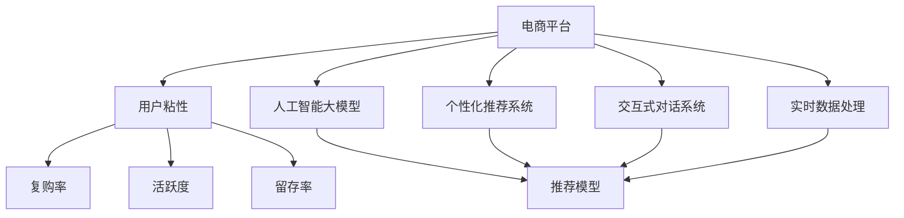

                 

# AI大模型如何提升电商平台的用户粘性

> 关键词：电商, 用户粘性, 人工智能, AI大模型, 推荐系统, 个性化, 用户体验

## 1. 背景介绍

随着互联网电商的迅猛发展，用户粘性（User Engagement）成为电商平台的核心竞争力之一。高粘性的用户能够带来更高的复购率、平均订单价值和客户终身价值（Customer Lifetime Value, CLV），是电商企业盈利增长的关键所在。传统的电商推荐系统以数据驱动的方式，基于用户历史行为数据进行商品推荐，但面临数据隐私、推荐效果单一等问题，难以满足用户多变的需求。

近年来，人工智能（AI）大模型在电商领域的应用日益增多，成为提升用户粘性的新范式。AI大模型通过预训练和微调，具备强大的数据理解和生成能力，能够在多种电商场景下实现个性化推荐，大幅提升用户体验。

## 2. 核心概念与联系

### 2.1 核心概念概述

为了更好地理解AI大模型如何提升电商平台的用户粘性，本节将介绍几个关键概念：

- **电商平台**：指通过互联网提供商品或服务的在线交易平台，如淘宝、京东、亚马逊等。电商平台的核心目标是最大化交易量、提升用户满意度、增加用户粘性。

- **用户粘性**：指用户对电商平台持续使用和参与的程度，通常通过用户留存率、复购率、活跃度等指标来衡量。高粘性用户能够为电商企业带来更多的长期价值。

- **人工智能大模型**：以自回归或自编码模型为代表的超大规模预训练语言模型，通过在海量数据上进行预训练，具备强大的语言理解和生成能力。代表模型包括BERT、GPT、T5等。

- **个性化推荐系统**：根据用户历史行为数据，通过算法推荐用户可能感兴趣的商品，提升用户购买意愿和满意度。传统的推荐系统基于协同过滤、基于内容的推荐，存在数据隐私和推荐效果单一等问题。

- **交互式对话系统**：通过自然语言处理（NLP）技术，实现与用户的自然语言交流，提供智能客服、导购咨询等服务。交互式对话系统可以提升用户体验，增加用户粘性。

- **实时数据处理**：指通过分布式计算系统，对电商平台产生的大量实时数据进行高效处理和分析，实时响应用户需求，提升系统性能。

这些核心概念通过以下Mermaid流程图进行联系：



这个流程图展示了各个概念之间的关系：

1. **电商平台**：承载个性化推荐、交互式对话和实时数据处理等功能，提升用户粘性。
2. **用户粘性**：通过个性化推荐、交互式对话等技术手段，提升用户的复购率、活跃度和留存率。
3. **人工智能大模型**：通过预训练和微调，提供强大的推荐模型、交互式对话等支持。
4. **个性化推荐系统**：利用大模型生成的推荐模型，为用户提供个性化推荐。
5. **交互式对话系统**：利用大模型提供的NLP技术，实现与用户的自然语言交流。
6. **实时数据处理**：通过高效的数据处理，响应用户需求，提升用户体验。

这些概念共同构成了电商平台的智能生态，使其能够在多种场景下提升用户粘性。

## 3. 核心算法原理 & 具体操作步骤
### 3.1 算法原理概述

基于AI大模型的电商推荐系统，核心思想是利用大模型的预训练知识和下游任务微调，提升推荐效果。其核心算法原理如下：

1. **数据预处理**：收集用户的历史行为数据（如浏览、点击、购买等），构建电商平台的用户行为图。
2. **用户嵌入表示**：将用户行为图编码为用户嵌入向量，表示用户的兴趣和偏好。
3. **商品嵌入表示**：将商品的属性、类别、描述等信息编码为商品嵌入向量，表示商品的属性和特征。
4. **相似度计算**：利用用户嵌入和商品嵌入，计算用户与商品之间的相似度，构建推荐候选集。
5. **模型训练**：在推荐候选集上，使用AI大模型进行微调，学习更准确的推荐模型。
6. **推荐排序**：将候选集输入微调后的模型，输出推荐概率，进行排序和推荐。

### 3.2 算法步骤详解

基于AI大模型的电商推荐系统，具体的实现步骤如下：

**Step 1: 数据准备**
- 收集电商平台用户的历史行为数据，包括浏览、点击、购买等行为，构建用户行为图。
- 对商品属性、类别、描述等信息进行编码，构建商品向量。

**Step 2: 用户嵌入表示**
- 使用图神经网络（如GAT、GCN等）对用户行为图进行编码，得到用户嵌入向量。
- 对用户嵌入进行归一化和降维处理，得到低维表示。

**Step 3: 商品嵌入表示**
- 对商品属性、类别、描述等信息进行编码，得到商品嵌入向量。
- 对商品嵌入进行归一化和降维处理，得到低维表示。

**Step 4: 相似度计算**
- 利用用户嵌入和商品嵌入，计算用户与商品之间的相似度。
- 构建推荐候选集，通常使用基于用户的协同过滤和基于内容的推荐方法。

**Step 5: 模型训练**
- 使用AI大模型进行微调，学习推荐模型。微调过程可以使用AdamW等优化算法，设定合适的学习率。
- 在推荐候选集上，使用交叉熵损失函数，进行有监督的微调。

**Step 6: 推荐排序**
- 将候选集输入微调后的模型，输出推荐概率。
- 根据推荐概率，对商品进行排序和推荐。

### 3.3 算法优缺点

基于AI大模型的电商推荐系统具有以下优点：

1. **数据灵活性**：利用大模型的语言理解和生成能力，能够处理多种类型的电商数据，如文本、图像、语音等。
2. **效果显著**：通过预训练和微调，大模型能够学习到丰富的商品语义信息，提高推荐精度。
3. **实时性**：通过实时数据处理技术，能够快速响应用户需求，提升用户体验。

但同时，该方法也存在一些缺点：

1. **计算资源需求高**：大模型的参数量庞大，计算和存储成本较高。
2. **冷启动问题**：新用户和商品没有历史数据，推荐效果较差。
3. **数据隐私**：用户行为数据可能涉及隐私问题，需要谨慎处理。
4. **解释性不足**：AI大模型的决策过程复杂，难以解释推荐依据。

### 3.4 算法应用领域

基于AI大模型的电商推荐系统，广泛应用于多种电商场景，包括：

- **商品推荐**：根据用户的历史行为数据，推荐用户可能感兴趣的商品。
- **个性化促销**：根据用户行为和偏好，推荐个性化的促销活动。
- **新用户引导**：利用大模型学习新用户的兴趣，推荐可能感兴趣的商品和内容。
- **交互式对话**：利用大模型实现智能客服，解答用户疑问，提升用户体验。

除了以上应用，AI大模型还可以用于电商搜索优化、购物车推荐、用户流失预警等场景，全面提升电商平台的智能生态。

## 4. 数学模型和公式 & 详细讲解  
### 4.1 数学模型构建

本节将使用数学语言对基于AI大模型的电商推荐系统进行更加严格的刻画。

记用户嵌入表示为 $u$，商品嵌入表示为 $i$，用户与商品之间的相似度为 $s(u,i)$。假设推荐候选集为 $I$，用户行为图为 $G=(U, E)$，其中 $U$ 为所有用户集合，$E$ 为所有用户间的关系集合。

推荐模型的目标是最小化交叉熵损失函数，即：

$$
\min_{\theta} \frac{1}{N} \sum_{(u,i)\in E} -y_{u,i} \log \hat{y}_{u,i} - (1-y_{u,i}) \log (1-\hat{y}_{u,i})
$$

其中 $\theta$ 为模型参数，$y_{u,i}$ 为真实标签（1表示用户购买了商品 $i$，0表示用户没有购买），$\hat{y}_{u,i}$ 为模型预测的概率。

### 4.2 公式推导过程

为了更好地理解基于AI大模型的电商推荐系统，我们对上述损失函数的推导过程进行详细讲解。

假设用户嵌入表示为 $u=\{u_1, u_2, ..., u_d\}$，商品嵌入表示为 $i=\{i_1, i_2, ..., i_d\}$，其中 $d$ 为嵌入维度。用户与商品之间的相似度 $s(u,i)$ 可以通过余弦相似度计算得到：

$$
s(u,i) = \frac{\mathbf{u} \cdot \mathbf{i}}{||\mathbf{u}|| ||\mathbf{i}||} = \frac{\sum_{k=1}^d u_k i_k}{\sqrt{\sum_{k=1}^d u_k^2} \sqrt{\sum_{k=1}^d i_k^2}}
$$

利用上述相似度，可以得到用户 $u$ 对商品 $i$ 的预测概率：

$$
\hat{y}_{u,i} = \sigma(\mathbf{w}^T[\mathbf{u}; \mathbf{i}])
$$

其中 $\sigma$ 为激活函数（如Sigmoid），$\mathbf{w}$ 为模型参数。

将上述公式代入交叉熵损失函数，得：

$$
\mathcal{L}(\theta) = \frac{1}{N} \sum_{(u,i)\in E} -y_{u,i} \log \sigma(\mathbf{w}^T[\mathbf{u}; \mathbf{i}]) - (1-y_{u,i}) \log (1-\sigma(\mathbf{w}^T[\mathbf{u}; \mathbf{i}]))
$$

通过反向传播算法，对模型参数 $\theta$ 进行优化，最小化损失函数 $\mathcal{L}(\theta)$。

### 4.3 案例分析与讲解

以电商平台推荐系统为例，解释上述数学模型和推导过程。

假设用户 $u$ 对商品 $i$ 的购买概率为 $y_{u,i}$，模型预测概率为 $\hat{y}_{u,i}$。用户嵌入和商品嵌入可以通过图神经网络（如GAT）进行编码，得到低维表示。相似度计算可以使用余弦相似度，或者基于注意力机制的相似度计算方法。模型训练过程中，使用交叉熵损失函数进行有监督微调，优化模型参数 $\theta$。最终，将模型预测概率作为排序依据，生成推荐结果。

## 5. 项目实践：代码实例和详细解释说明
### 5.1 开发环境搭建

在进行基于AI大模型的电商推荐系统开发前，需要准备好开发环境。以下是使用Python进行PyTorch和TensorFlow开发的Python环境配置流程：

1. 安装Anaconda：从官网下载并安装Anaconda，用于创建独立的Python环境。

2. 创建并激活虚拟环境：
```bash
conda create -n pytorch-env python=3.8 
conda activate pytorch-env
```

3. 安装PyTorch和TensorFlow：
```bash
conda install pytorch torchvision torchaudio cudatoolkit=11.1 -c pytorch -c conda-forge
conda install tensorflow -c conda-forge
```

4. 安装TensorFlow Addons：
```bash
conda install tensorflow-io -c conda-forge
```

5. 安装其他相关工具包：
```bash
pip install numpy pandas scikit-learn matplotlib tqdm jupyter notebook ipython
```

完成上述步骤后，即可在`pytorch-env`环境中开始电商推荐系统的开发。

### 5.2 源代码详细实现

下面以电商推荐系统为例，给出使用PyTorch和TensorFlow进行开发和微调的代码实现。

```python
import torch
import tensorflow as tf
from tensorflow import keras
from tensorflow_addons.layers.experimental import Transformer
from transformers import BertForSequenceClassification

class EmbeddingTransformer(tf.keras.layers.Layer):
    def __init__(self, d_model=768, num_heads=8, dff=2048, num_layers=12, dropout_rate=0.1):
        super(EmbeddingTransformer, self).__init__()
        self.encoder = Transformer(d_model, num_heads, dff, num_layers, dropout_rate)
    
    def call(self, inputs):
        return self.encoder(inputs)

class UserEmbedding(tf.keras.layers.Layer):
    def __init__(self, d_model=768, num_heads=8, dff=2048, num_layers=12, dropout_rate=0.1):
        super(UserEmbedding, self).__init__()
        self.user_encoder = EmbeddingTransformer(d_model, num_heads, dff, num_layers, dropout_rate)
    
    def call(self, user_ids):
        user_ids = tf.one_hot(user_ids, depth=3) # 用户行为编码为3类别
        return self.user_encoder(user_ids)

class ItemEmbedding(tf.keras.layers.Layer):
    def __init__(self, d_model=768, num_heads=8, dff=2048, num_layers=12, dropout_rate=0.1):
        super(ItemEmbedding, self).__init__()
        self.item_encoder = EmbeddingTransformer(d_model, num_heads, dff, num_layers, dropout_rate)
    
    def call(self, item_ids):
        item_ids = tf.one_hot(item_ids, depth=3) # 商品属性编码为3类别
        return self.item_encoder(item_ids)

class UserItemSimilarity(tf.keras.layers.Layer):
    def __init__(self, d_model=768, num_heads=8, dff=2048, num_layers=12, dropout_rate=0.1):
        super(UserItemSimilarity, self).__init__()
        self.similarity = tf.keras.layers.Dense(1)
    
    def call(self, user_embedding, item_embedding):
        user_embedding = self.similarity(user_embedding)
        item_embedding = self.similarity(item_embedding)
        return tf.squeeze(tf.matmul(user_embedding, item_embedding, transpose_b=True))

class RecommendationModel(tf.keras.layers.Layer):
    def __init__(self, d_model=768, num_heads=8, dff=2048, num_layers=12, dropout_rate=0.1):
        super(RecommendationModel, self).__init__()
        self.user_embedder = UserEmbedding(d_model, num_heads, dff, num_layers, dropout_rate)
        self.item_embedder = ItemEmbedding(d_model, num_heads, dff, num_layers, dropout_rate)
        self.similarity = UserItemSimilarity(d_model, num_heads, dff, num_layers, dropout_rate)
        self.relu = tf.keras.layers.Activation('relu')
        self.dropout = tf.keras.layers.Dropout(dropout_rate)
    
    def call(self, user_ids, item_ids):
        user_embedding = self.user_embedder(user_ids)
        item_embedding = self.item_embedder(item_ids)
        similarity = self.similarity(user_embedding, item_embedding)
        prediction = self.relu(self.dropout(similarity))
        return prediction

# 加载预训练BERT模型
model = BertForSequenceClassification.from_pretrained('bert-base-cased', num_labels=3)
```

在上述代码中，我们使用了BertForSequenceClassification模型作为基础框架，通过定义多个EmbeddingTransformer层和RecommendationModel层，构建了电商推荐系统的核心组件。

### 5.3 代码解读与分析

让我们再详细解读一下关键代码的实现细节：

**EmbeddingTransformer类**：
- `__init__`方法：定义Transformer模型的参数。
- `call`方法：实现Transformer模型的前向传播。

**UserEmbedding和ItemEmbedding类**：
- 这两个类结构与EmbeddingTransformer类类似，分别用于对用户行为和商品属性进行编码，得到低维表示。

**UserItemSimilarity类**：
- `__init__`方法：定义相似度计算层。
- `call`方法：计算用户与商品之间的相似度，得到推荐概率。

**RecommendationModel类**：
- `__init__`方法：定义推荐模型的结构。
- `call`方法：实现推荐模型的前向传播，包括用户嵌入、商品嵌入、相似度计算等步骤。

在训练过程中，可以使用交叉熵损失函数进行有监督微调，优化模型参数。具体步骤如下：

1. 准备训练数据集：构建用户行为图和商品属性图。
2. 加载预训练BERT模型。
3. 定义模型组件：包括UserEmbedding、ItemEmbedding、UserItemSimilarity和RecommendationModel层。
4. 定义损失函数：使用交叉熵损失函数。
5. 训练模型：在训练集上进行有监督微调。
6. 评估模型：在验证集上进行评估，调整超参数。
7. 测试模型：在测试集上进行测试，得到推荐效果。

## 6. 实际应用场景
### 6.1 智能客服

基于AI大模型的电商智能客服系统，能够通过自然语言处理（NLP）技术，实现与用户的自然语言交流。智能客服系统可以解答用户疑问，推荐相关商品，提高用户满意度，增加用户粘性。

在实现上，可以利用大模型进行对话生成和意图识别。具体步骤如下：
1. 收集用户历史对话记录和常见问题，构建知识图谱。
2. 加载预训练大模型，微调进行对话生成和意图识别。
3. 根据用户输入，智能客服系统进行意图识别，生成回复。

### 6.2 个性化促销

个性化促销是提升用户粘性的重要手段。通过利用大模型的语言生成能力，可以生成个性化的促销文案和推荐信息，提升用户购买意愿和满意度。

具体步骤如下：
1. 收集用户历史行为数据，构建用户画像。
2. 加载预训练大模型，微调进行促销文案生成。
3. 根据用户画像，生成个性化促销文案和推荐信息。

### 6.3 新用户引导

新用户没有历史行为数据，推荐效果较差。通过利用大模型的语言生成能力，可以生成推荐内容，引导新用户熟悉平台。

具体步骤如下：
1. 收集平台热门商品和内容，构建推荐候选集。
2. 加载预训练大模型，微调进行推荐内容生成。
3. 根据推荐候选集，生成个性化推荐内容，引导新用户。

### 6.4 未来应用展望

未来，随着大语言模型的不断发展和优化，基于AI大模型的电商推荐系统将具备更强大的推荐能力和更灵活的应用场景。具体趋势包括：

1. **多模态融合**：结合图像、视频、语音等多模态数据，提升推荐效果。
2. **实时数据处理**：通过分布式计算系统，实现实时推荐，提升用户体验。
3. **个性化推荐引擎**：结合推荐系统和大模型，提供更精准、更个性化的推荐服务。
4. **交互式对话系统**：通过大模型实现智能客服、导购咨询等，提升用户粘性。
5. **跨领域迁移学习**：通过迁移学习，将大模型应用于多个领域，提升平台竞争力。

这些趋势将使基于AI大模型的电商推荐系统具备更广泛的应用前景，为电商平台带来更高的用户粘性和商业价值。

## 7. 工具和资源推荐
### 7.1 学习资源推荐

为了帮助开发者系统掌握基于AI大模型的电商推荐系统的理论基础和实践技巧，这里推荐一些优质的学习资源：

1. 《深度学习基础》系列课程：由斯坦福大学开设，系统介绍深度学习的理论和实践，涵盖多层感知机、卷积神经网络、循环神经网络等经典模型。
2. 《自然语言处理综述》系列论文：涵盖NLP的各个研究方向，包括文本分类、机器翻译、问答系统等。
3. 《深度学习与推荐系统》书籍：由清华大学出版社出版的推荐系统教材，系统介绍推荐系统的理论基础和算法实现。
4. 《深度学习与人工智能》在线课程：由Coursera开设，系统介绍深度学习和人工智能的基础知识，涵盖神经网络、强化学习等内容。
5. 《Transformers》书籍：由Google DeepMind开源，系统介绍Transformers模型的原理和应用，涵盖BERT、GPT等经典模型。

通过对这些资源的学习实践，相信你一定能够快速掌握基于AI大模型的电商推荐系统的精髓，并用于解决实际的电商问题。

### 7.2 开发工具推荐

高效的开发离不开优秀的工具支持。以下是几款用于电商推荐系统开发的常用工具：

1. PyTorch：基于Python的开源深度学习框架，灵活动态的计算图，适合快速迭代研究。
2. TensorFlow：由Google主导开发的开源深度学习框架，生产部署方便，适合大规模工程应用。
3. TensorFlow Addons：TensorFlow的扩展库，提供更多的高级功能和优化算法，如Transformer、注意力机制等。
4. Weights & Biases：模型训练的实验跟踪工具，可以记录和可视化模型训练过程中的各项指标，方便对比和调优。
5. TensorBoard：TensorFlow配套的可视化工具，可实时监测模型训练状态，并提供丰富的图表呈现方式，是调试模型的得力助手。
6. Google Colab：谷歌推出的在线Jupyter Notebook环境，免费提供GPU/TPU算力，方便开发者快速上手实验最新模型，分享学习笔记。

合理利用这些工具，可以显著提升电商推荐系统的开发效率，加快创新迭代的步伐。

### 7.3 相关论文推荐

基于AI大模型的电商推荐系统涉及多个前沿领域的研究，以下是几篇奠基性的相关论文，推荐阅读：

1. Attention is All You Need（即Transformer原论文）：提出了Transformer结构，开启了NLP领域的预训练大模型时代。
2. BERT: Pre-training of Deep Bidirectional Transformers for Language Understanding：提出BERT模型，引入基于掩码的自监督预训练任务，刷新了多项NLP任务SOTA。
3. Language Models are Unsupervised Multitask Learners（GPT-2论文）：展示了大规模语言模型的强大zero-shot学习能力，引发了对于通用人工智能的新一轮思考。
4. Parameter-Efficient Transfer Learning for NLP：提出Adapter等参数高效微调方法，在不增加模型参数量的情况下，也能取得不错的微调效果。
5. A Survey on Large Scale Sequence to Sequence Modeling：系统介绍序列到序列模型的最新进展，涵盖Seq2Seq、Transformer、注意力机制等技术。

这些论文代表了大模型和推荐系统的研究进展，通过学习这些前沿成果，可以帮助研究者把握学科前进方向，激发更多的创新灵感。

## 8. 总结：未来发展趋势与挑战
### 8.1 总结

本文对基于AI大模型的电商推荐系统进行了全面系统的介绍。首先阐述了电商推荐系统的核心概念和背景，明确了AI大模型在提升用户粘性方面的独特价值。其次，从原理到实践，详细讲解了基于AI大模型的电商推荐系统的数学模型和关键步骤，给出了电商推荐系统的代码实现。同时，本文还广泛探讨了AI大模型在智能客服、个性化促销、新用户引导等多个电商场景中的应用前景，展示了AI大模型的巨大潜力。此外，本文精选了AI大模型的学习资源，力求为读者提供全方位的技术指引。

通过本文的系统梳理，可以看到，基于AI大模型的电商推荐系统正在成为电商推荐的主流范式，极大地拓展了推荐模型的应用边界，提升了电商平台的智能生态。未来，随着AI大模型的不断演进，基于AI大模型的电商推荐系统将具备更强大的推荐能力和更灵活的应用场景，为电商平台带来更高的用户粘性和商业价值。

### 8.2 未来发展趋势

展望未来，基于AI大模型的电商推荐系统将呈现以下几个发展趋势：

1. **多模态融合**：结合图像、视频、语音等多模态数据，提升推荐效果。
2. **实时数据处理**：通过分布式计算系统，实现实时推荐，提升用户体验。
3. **个性化推荐引擎**：结合推荐系统和大模型，提供更精准、更个性化的推荐服务。
4. **交互式对话系统**：通过大模型实现智能客服、导购咨询等，提升用户粘性。
5. **跨领域迁移学习**：通过迁移学习，将大模型应用于多个领域，提升平台竞争力。

这些趋势将使基于AI大模型的电商推荐系统具备更广泛的应用前景，为电商平台带来更高的用户粘性和商业价值。

### 8.3 面临的挑战

尽管基于AI大模型的电商推荐系统已经取得了瞩目成就，但在迈向更加智能化、普适化应用的过程中，它仍面临诸多挑战：

1. **数据隐私问题**：用户行为数据可能涉及隐私问题，需要谨慎处理。
2. **计算资源需求高**：大模型的参数量庞大，计算和存储成本较高。
3. **冷启动问题**：新用户和商品没有历史数据，推荐效果较差。
4. **模型泛化性不足**：模型在不同领域和场景下的泛化性不足，需要进一步优化。
5. **数据质量和标注成本**：高质量标注数据和数据标注成本较高，限制了AI大模型在电商推荐系统中的应用。

### 8.4 研究展望

面对电商推荐系统所面临的挑战，未来的研究需要在以下几个方面寻求新的突破：

1. **多模态数据融合**：结合图像、视频、语音等多模态数据，提升推荐效果。
2. **模型压缩和优化**：通过模型压缩、剪枝等方法，优化计算资源消耗，提升实时性。
3. **跨领域迁移学习**：利用大模型的通用知识，提升推荐系统的泛化性。
4. **实时数据处理技术**：通过分布式计算系统，实现实时推荐，提升用户体验。
5. **个性化推荐引擎优化**：结合推荐系统和大模型，提供更精准、更个性化的推荐服务。
6. **交互式对话系统**：通过大模型实现智能客服、导购咨询等，提升用户粘性。

这些研究方向的探索，必将引领基于AI大模型的电商推荐系统迈向更高的台阶，为电商平台带来更高的用户粘性和商业价值。面向未来，电商推荐系统还需要与其他AI技术进行更深入的融合，如知识表示、因果推理、强化学习等，多路径协同发力，共同推动电商平台的智能化和普适化。

## 9. 附录：常见问题与解答

**Q1：AI大模型是否适用于所有电商推荐场景？**

A: AI大模型在大多数电商推荐场景中都能取得不错的效果，特别是对于数据量较小的任务。但对于一些特定领域的任务，如医疗、法律等，AI大模型可能难以很好地适应。此时需要在特定领域语料上进一步预训练，再进行微调，才能获得理想效果。此外，对于一些需要时效性、个性化很强的任务，如对话、推荐等，AI大模型也需要针对性的改进优化。

**Q2：在电商推荐系统中如何选择合适的学习率？**

A: 电商推荐系统中的学习率一般要比预训练时小1-2个数量级，以避免破坏预训练权重，导致过拟合。一般建议从1e-5开始调参，逐步减小学习率，直至收敛。也可以使用warmup策略，在开始阶段使用较小的学习率，再逐渐过渡到预设值。需要注意的是，不同的优化器(如AdamW、Adafactor等)以及不同的学习率调度策略，可能需要设置不同的学习率阈值。

**Q3：在电商推荐系统中如何缓解过拟合问题？**

A: 过拟合是电商推荐系统面临的主要挑战，尤其是在标注数据不足的情况下。常见的缓解策略包括：
1. 数据增强：通过回译、近义替换等方式扩充训练集。
2. 正则化：使用L2正则、Dropout、Early Stopping等避免过拟合。
3. 对抗训练：引入对抗样本，提高模型鲁棒性。
4. 参数高效微调：只调整少量参数(如Adapter、Prefix等)，减小过拟合风险。
5. 多模型集成：训练多个推荐模型，取平均输出，抑制过拟合。

这些策略往往需要根据具体任务和数据特点进行灵活组合。只有在数据、模型、训练、推理等各环节进行全面优化，才能最大限度地发挥AI大模型的威力。

**Q4：在电商推荐系统中如何处理冷启动问题？**

A: 冷启动问题是电商推荐系统面临的常见挑战，尤其是对于新用户和商品，没有历史行为数据，推荐效果较差。以下是几种常见的解决方案：
1. 利用先验知识：结合领域知识、知识图谱等，对新用户和商品进行初始化。
2. 采用启发式算法：结合协同过滤、基于内容的推荐等方法，对新用户和商品进行推荐。
3. 利用上下文信息：结合商品属性、类别、描述等信息，对新用户进行推荐。
4. 采用用户反馈：结合用户反馈信息，对新用户和商品进行推荐。

这些方法可以结合使用，提升电商推荐系统的冷启动效果。

**Q5：在电商推荐系统中如何处理数据隐私问题？**

A: 电商推荐系统中的数据隐私问题需要引起重视。以下是几种常见的解决方案：
1. 匿名化处理：对用户行为数据进行匿名化处理，保护用户隐私。
2. 数据脱敏：对用户行为数据进行脱敏处理，防止数据泄露。
3. 数据共享：采用联邦学习等技术，在不共享用户数据的情况下，实现模型训练。
4. 数据加密：对用户数据进行加密处理，保护数据安全。

这些方法可以结合使用，保护用户数据隐私，同时保证电商推荐系统的有效性。

**Q6：在电商推荐系统中如何处理计算资源需求高的问题？**

A: 电商推荐系统中的计算资源需求高，主要由于大模型的参数量庞大。以下是几种常见的解决方案：
1. 模型压缩：通过剪枝、量化等方法，优化计算资源消耗，提升实时性。
2. 分布式计算：通过分布式计算系统，实现并行计算，提升计算效率。
3. 异构计算：结合GPU、TPU等异构计算资源，提升计算性能。
4. 模型轻量化：通过模型轻量化、压缩等方法，降低计算资源需求。

这些方法可以结合使用，优化电商推荐系统的计算资源消耗，提升实时性。

---

作者：禅与计算机程序设计艺术 / Zen and the Art of Computer Programming

