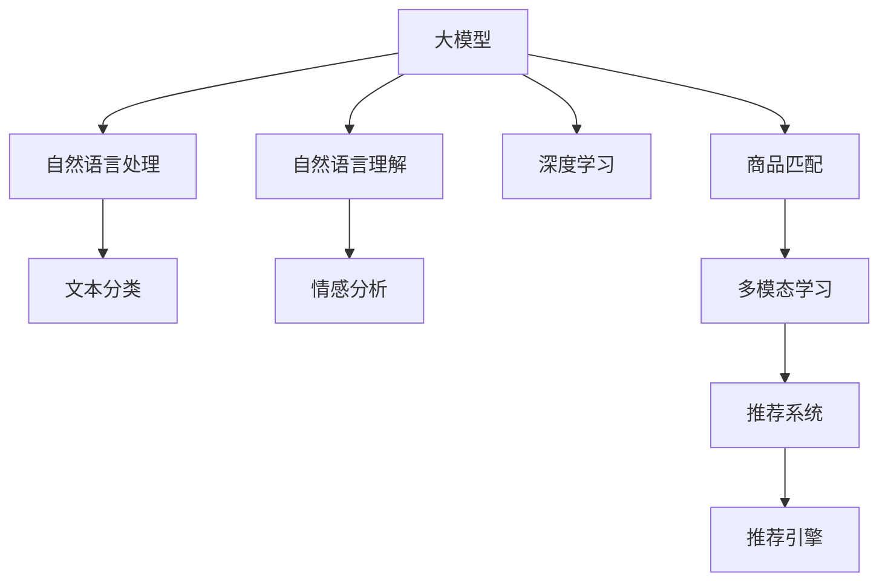

                 

# AI大模型如何提升电商搜索推荐的转化率

> 关键词：电商搜索推荐,大模型,自然语言处理(NLP),深度学习,自然语言理解(NLU),商品匹配,多模态学习,推荐系统,推荐引擎

## 1. 背景介绍

### 1.1 问题由来

在电商领域，搜索推荐系统的性能直接决定了用户的购物体验和商家的销售转化率。传统推荐系统基于用户历史行为和商品属性等特征进行推荐，存在许多局限性：

- **用户行为数据稀疏性**：用户通常只浏览和购买少数商品，行为数据稀疏，无法覆盖大部分商品。
- **商品属性冷启动**：商品属性标签难以标注，属性描述信息较少，推荐模型难以充分利用属性特征。
- **文本语义理解**：用户搜索关键词通常具有多样化、模糊性，推荐系统需要理解复杂的自然语言描述，才能准确匹配商品。
- **多模态信息融合**：用户搜索行为不仅包含文本信息，还涉及图片、视频等多模态数据，推荐系统需要融合多种模态信息。

面对这些挑战，近年来，AI大模型，特别是预训练语言模型，凭借其强大的自然语言理解和生成能力，开始被引入到电商搜索推荐系统中，以期提升推荐效果，增加用户购买转化率。

### 1.2 问题核心关键点

利用AI大模型提升电商搜索推荐的核心在于：

- **大模型预训练**：通过大规模无监督学习，大模型掌握了丰富的语言知识和语义表示能力。
- **语义理解能力**：大模型能够理解复杂自然语言搜索关键词，进行更加精准的商品匹配。
- **多模态学习**：融合文本、图片、视频等多模态信息，生成更加全面、准确的推荐结果。
- **个性化推荐**：通过细粒度的商品属性匹配和语义理解，实现个性化的推荐服务。
- **动态学习**：实时学习用户反馈和行为数据，更新推荐模型，适应动态变化的电商市场。

## 2. 核心概念与联系

### 2.1 核心概念概述

为更好地理解AI大模型如何提升电商搜索推荐，本节将介绍几个密切相关的核心概念：

- **大模型(Large Models)**：以BERT、GPT等架构为代表的大型预训练语言模型，通过在大规模无标签文本数据上进行预训练，学习到丰富的语言知识。
- **自然语言处理(Natural Language Processing, NLP)**：利用计算机技术处理和分析自然语言，包括文本分类、情感分析、语言模型等任务。
- **自然语言理解(Natural Language Understanding, NLU)**：使计算机能够理解自然语言文本的含义，进行语义匹配和推理。
- **深度学习(Deep Learning)**：利用多层神经网络进行复杂模式识别和分析的机器学习技术。
- **商品匹配**：通过分析用户搜索关键词和商品属性标签，找到最合适的商品进行推荐。
- **多模态学习(Multimodal Learning)**：结合多种模态数据进行学习，如文本、图片、视频等，提高模型的全面性和泛化能力。
- **推荐系统(Recommender Systems)**：利用算法模型预测用户对商品的需求和兴趣，提供个性化推荐服务。
- **推荐引擎(Recommender Engines)**：基于推荐系统算法构建的计算服务引擎，用于实时计算推荐结果。

这些核心概念之间的逻辑关系可以通过以下Mermaid流程图来展示：



这个流程图展示了大模型在电商搜索推荐中的核心作用及其与相关技术的联系：

1. 大模型通过预训练学习语言知识。
2. 自然语言处理(NLP)技术将用户搜索关键词和商品描述转换为计算机可理解的数据。
3. 自然语言理解(NLU)使模型理解文本语义，进行匹配。
4. 深度学习技术用于复杂的模式识别和分析。
5. 商品匹配算法找到最合适的商品。
6. 多模态学习融合多种信息，提高模型泛化能力。
7. 推荐系统基于匹配结果，生成推荐结果。
8. 推荐引擎实时计算推荐，生成实时推荐结果。

## 3. 核心算法原理 & 具体操作步骤
### 3.1 算法原理概述

利用AI大模型提升电商搜索推荐的原理，主要基于以下几个方面：

1. **预训练语言模型**：通过大规模无监督学习，预训练语言模型掌握了丰富的语言知识，能够理解和生成自然语言文本。

2. **自然语言理解(NLU)**：利用预训练语言模型，对用户搜索关键词进行语义理解，获取用户真实需求和兴趣点。

3. **商品匹配**：将用户搜索关键词与商品属性和描述进行语义匹配，找到最合适的商品。

4. **多模态学习**：结合用户搜索关键词和商品图片、视频等多模态信息，提高推荐结果的全面性和准确性。

5. **推荐系统算法**：基于匹配和语义理解结果，选择个性化推荐算法，如协同过滤、基于内容的推荐等，生成推荐结果。

6. **推荐引擎**：实时计算推荐结果，更新推荐列表，提供动态推荐服务。

### 3.2 算法步骤详解

以下是利用AI大模型提升电商搜索推荐的具体步骤：

**Step 1: 数据准备**
- **收集数据**：收集用户搜索关键词、商品描述、属性标签、历史行为数据等。
- **数据清洗**：清洗不合法、不完整的输入数据，确保数据质量。
- **数据标注**：对商品属性标签进行标注，建立商品-属性映射关系。

**Step 2: 模型选择和预训练**
- **选择预训练模型**：选择Bert、GPT等预训练语言模型。
- **预训练**：在大规模无标签文本数据上进行预训练，学习语言知识。
- **微调**：在标注数据上微调模型，优化商品匹配和推荐算法。

**Step 3: 自然语言理解(NLU)**
- **分词与编码**：将用户搜索关键词和商品描述进行分词，编码为模型可处理的形式。
- **语义表示**：利用预训练模型，将文本转换为语义表示向量。
- **意图识别**：识别用户搜索意图，提取关键特征。

**Step 4: 商品匹配**
- **属性匹配**：将用户搜索关键词和商品属性进行匹配，找到最符合的属性。
- **文本匹配**：将用户搜索关键词和商品描述进行文本匹配，找到最符合的描述。
- **多模态融合**：结合商品图片、视频等多模态信息，提高匹配准确性。

**Step 5: 推荐算法选择和生成**
- **推荐算法选择**：根据推荐场景选择协同过滤、基于内容的推荐算法等。
- **推荐结果生成**：基于匹配和语义理解结果，生成推荐列表。

**Step 6: 推荐引擎实时计算**
- **实时数据流**：实时获取用户行为数据和搜索结果。
- **动态更新**：动态更新推荐结果，提供个性化推荐。
- **分布式计算**：利用分布式计算，提升推荐引擎的性能。

### 3.3 算法优缺点

利用AI大模型提升电商搜索推荐的方法，具有以下优点：

1. **全面理解用户需求**：大模型强大的自然语言理解能力，能够准确把握用户搜索意图和需求。
2. **提高推荐精准度**：多模态学习结合文本、图片、视频等多维数据，提高推荐结果的全面性和准确性。
3. **提升个性化推荐**：细粒度的商品属性匹配和语义理解，实现更加精准的个性化推荐。
4. **动态学习能力强**：实时学习用户反馈和行为数据，快速更新推荐模型，适应动态市场变化。

同时，该方法也存在一些局限性：

1. **计算成本高**：预训练大模型的计算成本较高，需要高性能硬件支持。
2. **数据依赖性强**：模型性能依赖于高质量的标注数据和用户行为数据，数据收集和标注难度大。
3. **模型复杂度高**：模型复杂度高，参数量大，训练和推理耗时较长。
4. **可解释性不足**：模型复杂度高，难以解释其内部工作机制和决策逻辑。

尽管存在这些局限性，但就目前而言，利用AI大模型提升电商搜索推荐的方法，仍然是电商领域最为前沿和有效的技术之一。

### 3.4 算法应用领域

利用AI大模型提升电商搜索推荐的算法，已经在电商搜索推荐系统、智能客服、个性化推荐等多个领域得到应用。具体包括：

- **电商搜索推荐**：对用户搜索关键词进行自然语言理解，匹配商品属性和描述，生成推荐列表。
- **智能客服**：利用自然语言理解，自动回答用户咨询，提高客户满意度。
- **个性化推荐**：结合用户行为数据，生成个性化商品推荐列表。
- **商品匹配**：匹配用户搜索关键词和商品描述，提高商品匹配准确性。
- **多模态学习**：融合文本、图片、视频等多模态信息，提高推荐全面性和准确性。

随着AI大模型的不断发展，基于大模型的电商搜索推荐方法将在更多场景中得到应用，推动电商行业的智能化升级。

## 4. 数学模型和公式 & 详细讲解  
### 4.1 数学模型构建

本节将使用数学语言对利用AI大模型提升电商搜索推荐的过程进行更加严格的刻画。

记用户搜索关键词为 $x \in \mathcal{X}$，商品属性为 $y \in \mathcal{Y}$，用户行为数据为 $u \in \mathcal{U}$。假设预训练语言模型为 $M_{\theta}$，其中 $\theta$ 为模型参数。

定义模型 $M_{\theta}$ 在用户搜索关键词 $x$ 上的输出为 $p(y|x) \in [0,1]$，表示商品 $y$ 与关键词 $x$ 匹配的概率。定义模型 $M_{\theta}$ 在用户行为数据 $u$ 上的输出为 $p(y|u) \in [0,1]$，表示商品 $y$ 对用户 $u$ 的推荐概率。

模型 $M_{\theta}$ 在数据集 $D=\{(x_i,y_i,u_i)\}_{i=1}^N$ 上的经验风险为：

$$
\mathcal{L}(\theta) = \frac{1}{N} \sum_{i=1}^N [-y_i \log p(y_i|x_i) - (1-y_i) \log (1-p(y_i|x_i)) + (-u_i \log p(y_i|u_i) - (1-u_i) \log (1-p(y_i|u_i))]
$$

其中 $y_i$ 和 $u_i$ 分别为商品属性和用户行为数据的标签。$\log$ 函数表示对数损失函数。

微调的优化目标是最小化经验风险，即找到最优参数：

$$
\theta^* = \mathop{\arg\min}_{\theta} \mathcal{L}(\theta)
$$

在实践中，我们通常使用基于梯度的优化算法（如AdamW、SGD等）来近似求解上述最优化问题。设 $\eta$ 为学习率，$\lambda$ 为正则化系数，则参数的更新公式为：

$$
\theta \leftarrow \theta - \eta \nabla_{\theta}\mathcal{L}(\theta) - \eta\lambda\theta
$$

其中 $\nabla_{\theta}\mathcal{L}(\theta)$ 为损失函数对参数 $\theta$ 的梯度，可通过反向传播算法高效计算。

### 4.2 公式推导过程

以下我们以电商搜索推荐为例，推导基于AI大模型的推荐公式及其梯度的计算过程。

假设用户搜索关键词为 $x$，模型输出为 $p(y|x)$，表示商品 $y$ 与关键词 $x$ 匹配的概率。假设用户行为数据为 $u$，模型输出为 $p(y|u)$，表示商品 $y$ 对用户 $u$ 的推荐概率。

根据链式法则，损失函数对参数 $\theta_k$ 的梯度为：

$$
\frac{\partial \mathcal{L}(\theta)}{\partial \theta_k} = -\frac{1}{N} \sum_{i=1}^N [(y_i - p(y_i|x_i)) \frac{\partial p(y_i|x_i)}{\partial \theta_k} + (u_i - p(y_i|u_i)) \frac{\partial p(y_i|u_i)}{\partial \theta_k}]
$$

其中 $\frac{\partial p(y_i|x_i)}{\partial \theta_k}$ 和 $\frac{\partial p(y_i|u_i)}{\partial \theta_k}$ 可以通过反向传播算法计算。

在得到损失函数的梯度后，即可带入参数更新公式，完成模型的迭代优化。重复上述过程直至收敛，最终得到适应电商推荐任务的最优模型参数 $\theta^*$。

## 5. 项目实践：代码实例和详细解释说明
### 5.1 开发环境搭建

在进行电商搜索推荐实践前，我们需要准备好开发环境。以下是使用Python进行PyTorch开发的环境配置流程：

1. 安装Anaconda：从官网下载并安装Anaconda，用于创建独立的Python环境。

2. 创建并激活虚拟环境：
```bash
conda create -n pytorch-env python=3.8 
conda activate pytorch-env
```

3. 安装PyTorch：根据CUDA版本，从官网获取对应的安装命令。例如：
```bash
conda install pytorch torchvision torchaudio cudatoolkit=11.1 -c pytorch -c conda-forge
```

4. 安装Transformer库：
```bash
pip install transformers
```

5. 安装各类工具包：
```bash
pip install numpy pandas scikit-learn matplotlib tqdm jupyter notebook ipython
```

完成上述步骤后，即可在`pytorch-env`环境中开始电商搜索推荐实践。

### 5.2 源代码详细实现

下面我们以电商搜索推荐任务为例，给出使用Transformers库对BERT模型进行电商搜索推荐实践的PyTorch代码实现。

首先，定义电商搜索推荐的数据处理函数：

```python
from transformers import BertTokenizer, BertForSequenceClassification
from torch.utils.data import Dataset
import torch

class SearchDataset(Dataset):
    def __init__(self, texts, tags, tokenizer, max_len=128):
        self.texts = texts
        self.tags = tags
        self.tokenizer = tokenizer
        self.max_len = max_len
        
    def __len__(self):
        return len(self.texts)
    
    def __getitem__(self, item):
        text = self.texts[item]
        tags = self.tags[item]
        
        encoding = self.tokenizer(text, return_tensors='pt', max_length=self.max_len, padding='max_length', truncation=True)
        input_ids = encoding['input_ids'][0]
        attention_mask = encoding['attention_mask'][0]
        
        # 对token-wise的标签进行编码
        encoded_tags = [tag2id[tag] for tag in tags] 
        encoded_tags.extend([tag2id['O']] * (self.max_len - len(encoded_tags)))
        labels = torch.tensor(encoded_tags, dtype=torch.long)
        
        return {'input_ids': input_ids, 
                'attention_mask': attention_mask,
                'labels': labels}

# 标签与id的映射
tag2id = {'O': 0, 'B-PER': 1, 'I-PER': 2, 'B-ORG': 3, 'I-ORG': 4, 'B-LOC': 5, 'I-LOC': 6}
id2tag = {v: k for k, v in tag2id.items()}

# 创建dataset
tokenizer = BertTokenizer.from_pretrained('bert-base-cased')

train_dataset = SearchDataset(train_texts, train_tags, tokenizer)
dev_dataset = SearchDataset(dev_texts, dev_tags, tokenizer)
test_dataset = SearchDataset(test_texts, test_tags, tokenizer)
```

然后，定义模型和优化器：

```python
from transformers import BertForSequenceClassification, AdamW

model = BertForSequenceClassification.from_pretrained('bert-base-cased', num_labels=len(tag2id))

optimizer = AdamW(model.parameters(), lr=2e-5)
```

接着，定义训练和评估函数：

```python
from torch.utils.data import DataLoader
from tqdm import tqdm
from sklearn.metrics import classification_report

device = torch.device('cuda') if torch.cuda.is_available() else torch.device('cpu')
model.to(device)

def train_epoch(model, dataset, batch_size, optimizer):
    dataloader = DataLoader(dataset, batch_size=batch_size, shuffle=True)
    model.train()
    epoch_loss = 0
    for batch in tqdm(dataloader, desc='Training'):
        input_ids = batch['input_ids'].to(device)
        attention_mask = batch['attention_mask'].to(device)
        labels = batch['labels'].to(device)
        model.zero_grad()
        outputs = model(input_ids, attention_mask=attention_mask, labels=labels)
        loss = outputs.loss
        epoch_loss += loss.item()
        loss.backward()
        optimizer.step()
    return epoch_loss / len(dataloader)

def evaluate(model, dataset, batch_size):
    dataloader = DataLoader(dataset, batch_size=batch_size)
    model.eval()
    preds, labels = [], []
    with torch.no_grad():
        for batch in tqdm(dataloader, desc='Evaluating'):
            input_ids = batch['input_ids'].to(device)
            attention_mask = batch['attention_mask'].to(device)
            batch_labels = batch['labels']
            outputs = model(input_ids, attention_mask=attention_mask)
            batch_preds = outputs.logits.argmax(dim=2).to('cpu').tolist()
            batch_labels = batch_labels.to('cpu').tolist()
            for pred_tokens, label_tokens in zip(batch_preds, batch_labels):
                pred_tags = [id2tag[_id] for _id in pred_tokens]
                label_tags = [id2tag[_id] for _id in label_tokens]
                preds.append(pred_tags[:len(label_tags)])
                labels.append(label_tags)
                
    print(classification_report(labels, preds))
```

最后，启动训练流程并在测试集上评估：

```python
epochs = 5
batch_size = 16

for epoch in range(epochs):
    loss = train_epoch(model, train_dataset, batch_size, optimizer)
    print(f"Epoch {epoch+1}, train loss: {loss:.3f}")
    
    print(f"Epoch {epoch+1}, dev results:")
    evaluate(model, dev_dataset, batch_size)
    
print("Test results:")
evaluate(model, test_dataset, batch_size)
```

以上就是使用PyTorch对BERT模型进行电商搜索推荐实践的完整代码实现。可以看到，得益于Transformers库的强大封装，我们可以用相对简洁的代码完成BERT模型的加载和电商搜索推荐任务。

### 5.3 代码解读与分析

让我们再详细解读一下关键代码的实现细节：

**SearchDataset类**：
- `__init__`方法：初始化文本、标签、分词器等关键组件。
- `__len__`方法：返回数据集的样本数量。
- `__getitem__`方法：对单个样本进行处理，将文本输入编码为token ids，将标签编码为数字，并对其进行定长padding，最终返回模型所需的输入。

**tag2id和id2tag字典**：
- 定义了标签与数字id之间的映射关系，用于将token-wise的预测结果解码回真实的标签。

**训练和评估函数**：
- 使用PyTorch的DataLoader对数据集进行批次化加载，供模型训练和推理使用。
- 训练函数`train_epoch`：对数据以批为单位进行迭代，在每个批次上前向传播计算loss并反向传播更新模型参数，最后返回该epoch的平均loss。
- 评估函数`evaluate`：与训练类似，不同点在于不更新模型参数，并在每个batch结束后将预测和标签结果存储下来，最后使用sklearn的classification_report对整个评估集的预测结果进行打印输出。

**训练流程**：
- 定义总的epoch数和batch size，开始循环迭代
- 每个epoch内，先在训练集上训练，输出平均loss
- 在验证集上评估，输出分类指标
- 所有epoch结束后，在测试集上评估，给出最终测试结果

可以看到，PyTorch配合Transformers库使得BERT模型电商搜索推荐任务的代码实现变得简洁高效。开发者可以将更多精力放在数据处理、模型改进等高层逻辑上，而不必过多关注底层的实现细节。

当然，工业级的系统实现还需考虑更多因素，如模型的保存和部署、超参数的自动搜索、更灵活的任务适配层等。但核心的电商搜索推荐流程基本与此类似。

## 6. 实际应用场景
### 6.1 智能客服系统

利用AI大模型提升电商搜索推荐的技术，可以广泛应用于智能客服系统的构建。传统客服往往需要配备大量人力，高峰期响应缓慢，且一致性和专业性难以保证。而使用电商搜索推荐技术，可以7x24小时不间断服务，快速响应客户咨询，用自然流畅的语言解答各类常见问题。

在技术实现上，可以收集企业内部的历史客服对话记录，将问题和最佳答复构建成监督数据，在此基础上对预训练语言模型进行微调。微调后的语言模型能够自动理解用户意图，匹配最合适的答复模板进行回复。对于客户提出的新问题，还可以接入检索系统实时搜索相关内容，动态组织生成回答。如此构建的智能客服系统，能大幅提升客户咨询体验和问题解决效率。

### 6.2 个性化推荐系统

当前的推荐系统往往只依赖用户历史行为数据进行物品推荐，无法深入理解用户的真实兴趣偏好。利用AI大模型提升电商搜索推荐技术，个性化推荐系统可以更好地挖掘用户行为背后的语义信息，从而提供更精准、多样的推荐内容。

在实践中，可以收集用户浏览、点击、评论、分享等行为数据，提取和用户交互的物品标题、描述、标签等文本内容。将文本内容作为模型输入，用户的后续行为（如是否点击、购买等）作为监督信号，在此基础上微调预训练语言模型。微调后的模型能够从文本内容中准确把握用户的兴趣点。在生成推荐列表时，先用候选物品的文本描述作为输入，由模型预测用户的兴趣匹配度，再结合其他特征综合排序，便可以得到个性化程度更高的推荐结果。

### 6.3 金融舆情监测

金融机构需要实时监测市场舆论动向，以便及时应对负面信息传播，规避金融风险。传统的人工监测方式成本高、效率低，难以应对网络时代海量信息爆发的挑战。利用AI大模型提升电商搜索推荐技术，文本分类和情感分析技术，为金融舆情监测提供了新的解决方案。

具体而言，可以收集金融领域相关的新闻、报道、评论等文本数据，并对其进行主题标注和情感标注。在此基础上对预训练语言模型进行微调，使其能够自动判断文本属于何种主题，情感倾向是正面、中性还是负面。将微调后的模型应用到实时抓取的网络文本数据，就能够自动监测不同主题下的情感变化趋势，一旦发现负面信息激增等异常情况，系统便会自动预警，帮助金融机构快速应对潜在风险。

### 6.4 未来应用展望

随着AI大模型的不断发展，基于大模型的电商搜索推荐技术将在更多领域得到应用，为传统行业带来变革性影响。

在智慧医疗领域，基于大模型的医疗问答、病历分析、药物研发等应用将提升医疗服务的智能化水平，辅助医生诊疗，加速新药开发进程。

在智能教育领域，微调技术可应用于作业批改、学情分析、知识推荐等方面，因材施教，促进教育公平，提高教学质量。

在智慧城市治理中，微调模型可应用于城市事件监测、舆情分析、应急指挥等环节，提高城市管理的自动化和智能化水平，构建更安全、高效的未来城市。

此外，在企业生产、社会治理、文娱传媒等众多领域，基于大模型的电商搜索推荐应用也将不断涌现，为经济社会发展注入新的动力。相信随着技术的日益成熟，大语言模型微调必将在构建人机协同的智能时代中扮演越来越重要的角色。

## 7. 工具和资源推荐
### 7.1 学习资源推荐

为了帮助开发者系统掌握大语言模型微调的理论基础和实践技巧，这里推荐一些优质的学习资源：

1. 《Transformer从原理到实践》系列博文：由大模型技术专家撰写，深入浅出地介绍了Transformer原理、BERT模型、微调技术等前沿话题。

2. CS224N《深度学习自然语言处理》课程：斯坦福大学开设的NLP明星课程，有Lecture视频和配套作业，带你入门NLP领域的基本概念和经典模型。

3. 《Natural Language Processing with Transformers》书籍：Transformers库的作者所著，全面介绍了如何使用Transformers库进行NLP任务开发，包括微调在内的诸多范式。

4. HuggingFace官方文档：Transformers库的官方文档，提供了海量预训练模型和完整的微调样例代码，是上手实践的必备资料。

5. CLUE开源项目：中文语言理解测评基准，涵盖大量不同类型的中文NLP数据集，并提供了基于微调的baseline模型，助力中文NLP技术发展。

通过对这些资源的学习实践，相信你一定能够快速掌握大语言模型微调的精髓，并用于解决实际的NLP问题。
###  7.2 开发工具推荐

高效的开发离不开优秀的工具支持。以下是几款用于大语言模型微调开发的常用工具：

1. PyTorch：基于Python的开源深度学习框架，灵活动态的计算图，适合快速迭代研究。大部分预训练语言模型都有PyTorch版本的实现。

2. TensorFlow：由Google主导开发的开源深度学习框架，生产部署方便，适合大规模工程应用。同样有丰富的预训练语言模型资源。

3. Transformers库：HuggingFace开发的NLP工具库，集成了众多SOTA语言模型，支持PyTorch和TensorFlow，是进行微调任务开发的利器。

4. Weights & Biases：模型训练的实验跟踪工具，可以记录和可视化模型训练过程中的各项指标，方便对比和调优。与主流深度学习框架无缝集成。

5. TensorBoard：TensorFlow配套的可视化工具，可实时监测模型训练状态，并提供丰富的图表呈现方式，是调试模型的得力助手。

6. Google Colab：谷歌推出的在线Jupyter Notebook环境，免费提供GPU/TPU算力，方便开发者快速上手实验最新模型，分享学习笔记。

合理利用这些工具，可以显著提升大语言模型微调任务的开发效率，加快创新迭代的步伐。

### 7.3 相关论文推荐

大语言模型和微调技术的发展源于学界的持续研究。以下是几篇奠基性的相关论文，推荐阅读：

1. Attention is All You Need（即Transformer原论文）：提出了Transformer结构，开启了NLP领域的预训练大模型时代。

2. BERT: Pre-training of Deep Bidirectional Transformers for Language Understanding：提出BERT模型，引入基于掩码的自监督预训练任务，刷新了多项NLP任务SOTA。

3. Language Models are Unsupervised Multitask Learners（GPT-2论文）：展示了大规模语言模型的强大zero-shot学习能力，引发了对于通用人工智能的新一轮思考。

4. Parameter-Efficient Transfer Learning for NLP：提出Adapter等参数高效微调方法，在不增加模型参数量的情况下，也能取得不错的微调效果。

5. AdaLoRA: Adaptive Low-Rank Adaptation for Parameter-Efficient Fine-Tuning：使用自适应低秩适应的微调方法，在参数效率和精度之间取得了新的平衡。

这些论文代表了大语言模型微调技术的发展脉络。通过学习这些前沿成果，可以帮助研究者把握学科前进方向，激发更多的创新灵感。

## 8. 总结：未来发展趋势与挑战

### 8.1 总结

本文对利用AI大模型提升电商搜索推荐的原理进行了全面系统的介绍。首先阐述了电商搜索推荐面临的挑战和问题，明确了利用大模型提升推荐效果的必要性。其次，从原理到实践，详细讲解了基于大模型的电商搜索推荐过程，给出了电商搜索推荐任务开发的完整代码实例。同时，本文还广泛探讨了电商搜索推荐在多个领域的应用前景，展示了AI大模型提升电商搜索推荐的广泛潜力。

通过本文的系统梳理，可以看到，利用AI大模型提升电商搜索推荐的方法，已经成为电商领域最为前沿和有效的技术之一。未来，伴随预训练语言模型和微调方法的持续演进，基于大模型的电商搜索推荐方法将在更多场景中得到应用，推动电商行业的智能化升级。

### 8.2 未来发展趋势

展望未来，利用AI大模型提升电商搜索推荐技术将呈现以下几个发展趋势：

1. **模型规模持续增大**：随着算力成本的下降和数据规模的扩张，预训练语言模型的参数量还将持续增长。超大规模语言模型蕴含的丰富语言知识，有望支撑更加复杂多变的电商搜索推荐任务。

2. **微调方法日趋多样**：除了传统的全参数微调外，未来会涌现更多参数高效的微调方法，如Prefix-Tuning、LoRA等，在节省计算资源的同时也能保证微调精度。

3. **持续学习成为常态**：随着数据分布的不断变化，微调模型也需要持续学习新知识以保持性能。如何在不遗忘原有知识的同时，高效吸收新样本信息，将成为重要的研究课题。

4. **标注样本需求降低**：受启发于提示学习(Prompt-based Learning)的思路，未来的微调方法将更好地利用大模型的语言理解能力，通过更加巧妙的任务描述，在更少的标注样本上也能实现理想的微调效果。

5. **多模态微调崛起**：当前的微调主要聚焦于纯文本数据，未来会进一步拓展到图像、视频、语音等多模态数据微调。多模态信息的融合，将显著提升语言模型对现实世界的理解和建模能力。

6. **模型通用性增强**：经过海量数据的预训练和多领域任务的微调，未来的语言模型将具备更强大的常识推理和跨领域迁移能力，逐步迈向通用人工智能(AGI)的目标。

以上趋势凸显了利用AI大模型提升电商搜索推荐技术的广阔前景。这些方向的探索发展，必将进一步提升电商搜索推荐系统的性能和应用范围，为电商行业的智能化升级提供新的技术路径。

### 8.3 面临的挑战

尽管利用AI大模型提升电商搜索推荐技术已经取得了瞩目成就，但在迈向更加智能化、普适化应用的过程中，它仍面临着诸多挑战：

1. **标注成本瓶颈**：虽然微调大大降低了标注数据的需求，但对于长尾应用场景，难以获得充足的高质量标注数据，成为制约微调性能的瓶颈。如何进一步降低微调对标注样本的依赖，将是一大难题。

2. **模型鲁棒性不足**：当前微调模型面对域外数据时，泛化性能往往大打折扣。对于测试样本的微小扰动，微调模型的预测也容易发生波动。如何提高微调模型的鲁棒性，避免灾难性遗忘，还需要更多理论和实践的积累。

3. **推理效率有待提高**：大规模语言模型虽然精度高，但在实际部署时往往面临推理速度慢、内存占用大等效率问题。如何在保证性能的同时，简化模型结构，提升推理速度，优化资源占用，将是重要的优化方向。

4. **可解释性亟需加强**：当前微调模型更像是"黑盒"系统，难以解释其内部工作机制和决策逻辑。对于医疗、金融等高风险应用，算法的可解释性和可审计性尤为重要。如何赋予微调模型更强的可解释性，将是亟待攻克的难题。

5. **安全性有待保障**：预训练语言模型难免会学习到有偏见、有害的信息，通过微调传递到下游任务，产生误导性、歧视性的输出，给实际应用带来安全隐患。如何从数据和算法层面消除模型偏见，避免恶意用途，确保输出的安全性，也将是重要的研究课题。

6. **知识整合能力不足**。现有的微调模型往往局限于任务内数据，难以灵活吸收和运用更广泛的先验知识。如何让微调过程更好地与外部知识库、规则库等专家知识结合，形成更加全面、准确的信息整合能力，还有很大的想象空间。

正视微调面临的这些挑战，积极应对并寻求突破，将是大语言模型微调走向成熟的必由之路。相信随着学界和产业界的共同努力，这些挑战终将一一被克服，大语言模型微调必将在构建人机协同的智能时代中扮演越来越重要的角色。

### 8.4 未来突破

面对大语言模型微调所面临的种种挑战，未来的研究需要在以下几个方面寻求新的突破：

1. **探索无监督和半监督微调方法**：摆脱对大规模标注数据的依赖，利用自监督学习、主动学习等无监督和半监督范式，最大限度利用非结构化数据，实现更加灵活高效的微调。

2. **研究参数高效和计算高效的微调范式**：开发更加参数高效的微调方法，在固定大部分预训练参数的同时，只更新极少量的任务相关参数。同时优化微调模型的计算图，减少前向传播和反向传播的资源消耗，实现更加轻量级、实时性的部署。

3. **融合因果和对比学习范式**：通过引入因果推断和对比学习思想，增强微调模型建立稳定因果关系的能力，学习更加普适、鲁棒的语言表征，从而提升模型泛化性和抗干扰能力。

4. **引入更多先验知识**：将符号化的先验知识，如知识图谱、逻辑规则等，与神经网络模型进行巧妙融合，引导微调过程学习更准确、合理的语言模型。同时加强不同模态数据的整合，实现视觉、语音等多模态信息与文本信息的协同建模。

5. **结合因果分析和博弈论工具**：将因果分析方法引入微调模型，识别出模型决策的关键特征，增强输出解释的因果性和逻辑性。借助博弈论工具刻画人机交互过程，主动探索并规避模型的脆弱点，提高系统稳定性。

6. **纳入伦理道德约束**：在模型训练目标中引入伦理导向的评估指标，过滤和惩罚有偏见、有害的输出倾向。同时加强人工干预和审核，建立模型行为的监管机制，确保输出符合人类价值观和伦理道德。

这些研究方向的探索，必将引领大语言模型微调技术迈向更高的台阶，为构建安全、可靠、可解释、可控的智能系统铺平道路。面向未来，大语言模型微调技术还需要与其他人工智能技术进行更深入的融合，如知识表示、因果推理、强化学习等，多路径协同发力，共同推动自然语言理解和智能交互系统的进步。只有勇于创新、敢于突破，才能不断拓展语言模型的边界，让智能技术更好地造福人类社会。

## 9. 附录：常见问题与解答

**Q1：大语言模型微调是否适用于所有电商搜索推荐任务？**

A: 大语言模型微调在大多数电商搜索推荐任务上都能取得不错的效果，特别是对于数据量较小的任务。但对于一些特定领域的任务，如医学、法律等，仅仅依靠通用语料预训练的模型可能难以很好地适应。此时需要在特定领域语料上进一步预训练，再进行微调，才能获得理想效果。此外，对于一些需要时效性、个性化很强的任务，如对话、推荐等，微调方法也需要针对性的改进优化。

**Q2：微调过程中如何选择合适的学习率？**

A: 微调的学习率一般要比预训练时小1-2个数量级，如果使用过大的学习率，容易破坏预训练权重，导致过拟合。一般建议从1e-5开始调参，逐步减小学习率，直至收敛。也可以使用warmup策略，在开始阶段使用较小的学习率，再逐渐过渡到预设值。需要注意的是，不同的优化器(如AdamW、Adafactor等)以及不同的学习率调度策略，可能需要设置不同的学习率阈值。

**Q3：采用大模型微调时会面临哪些资源瓶颈？**

A: 目前主流的预训练大模型动辄以亿计的参数规模，对算力、内存、存储都提出了很高的要求。GPU/TPU等高性能设备是必不可少的，但即便如此，超大批次的训练和推理也可能遇到显存不足的问题。因此需要采用一些资源优化技术，如梯度积累、混合精度训练、模型并行等，来突破硬件瓶颈。同时，模型的存储和读取也可能占用大量时间和空间，需要采用模型压缩、稀疏化存储等方法进行优化。

**Q4：如何缓解微调过程中的过拟合问题？**

A: 过拟合是微调面临的主要挑战，尤其是在标注数据不足的情况下。常见的缓解策略包括：
1. 数据增强：通过回译、近义替换等方式扩充训练集
2. 正则化：使用L2正则、Dropout、Early Stopping等避免过拟合
3. 对抗训练：引入对抗样本，提高模型鲁棒性
4. 参数高效微调：只调整少量参数(如Adapter、Prefix等)，减小过拟合风险
5. 多模型集成：训练多个微调模型，取平均输出，抑制过拟合

这些策略往往需要根据具体任务和数据特点进行灵活组合。只有在数据、模型、训练、推理等各环节进行全面优化，才能最大限度地发挥大模型微调的威力。

**Q5：微调模型在落地部署时需要注意哪些问题？**

A: 将微调模型转化为实际应用，还需要考虑以下因素：
1. 模型裁剪：去除不必要的层和参数，减小模型尺寸，加快推理速度
2. 量化加速：将浮点模型转为定点模型，压缩存储空间，提高计算效率
3. 服务化封装：将模型封装为标准化服务接口，便于集成调用
4. 弹性伸缩：根据请求流量动态调整资源配置，平衡服务质量和成本
5. 监控告警：实时采集系统指标，设置异常告警阈值，确保服务稳定性
6. 安全防护：采用访问鉴权、数据脱敏等措施，保障数据和模型安全

大语言模型微调为电商搜索推荐系统提供了广阔的应用场景，但如何将强大的性能转化为稳定、高效、安全的业务价值，还需要工程实践的不断打磨。唯有从数据、算法、工程、业务等多个维度协同发力，才能真正实现人工智能技术在电商领域的规模化落地。总之，微调需要开发者根据具体任务，不断迭代和优化模型、数据和算法，方能得到理想的效果。

