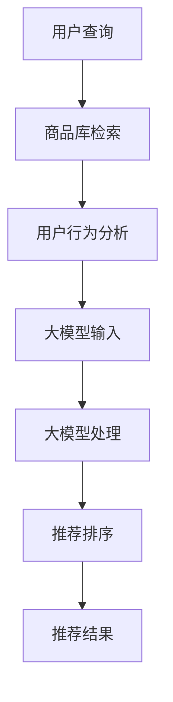

                 

# AI大模型赋能电商搜索推荐的业务创新流程优化项目实施方案设计与应用

## 1. 背景介绍

### 1.1 问题由来
在现代电商行业中，搜索推荐系统是消费者获取商品信息、完成购物的重要途径。然而，传统的搜索推荐算法普遍面临计算复杂度高、实时响应慢、个性化程度低等难题。随着AI大模型技术的发展，电商企业希望借助大模型赋能搜索推荐系统，进一步提升个性化程度，优化用户体验，开拓新的业务增长点。

### 1.2 问题核心关键点
本文聚焦于AI大模型如何应用于电商搜索推荐系统，旨在通过大模型赋能，优化搜索推荐流程，提升个性化推荐效果，为电商企业带来创新与商业价值。

### 1.3 问题研究意义
基于大模型的搜索推荐系统，可以大幅提升个性化推荐效果，降低运营成本，提升用户体验，帮助电商企业更好地理解用户需求，优化库存管理，提高转化率和销售额。本项目的研究意义在于：

- **个性化提升**：通过大模型学习用户行为和商品属性，实现更精准的个性化推荐。
- **效率提升**：利用大模型的泛化能力，减少特征工程和模型调参的复杂度，缩短开发周期。
- **成本优化**：利用大模型的通用性，减少对标注数据的需求，降低人工成本。
- **业务创新**：通过大模型实现的新算法和新功能，推动电商搜索推荐系统向更高层次发展，为电商企业提供新的价值增长点。

## 2. 核心概念与联系

### 2.1 核心概念概述

为更好地理解大模型在电商搜索推荐系统中的应用，本节将介绍几个关键概念：

- **AI大模型**：以Transformer结构为代表的深度学习模型，通过大规模数据预训练，学习到丰富的语义和统计知识，可用于多种自然语言处理任务。
- **搜索推荐系统**：通过分析用户行为数据和商品属性，为用户推荐感兴趣的物品，提升用户体验和销售转化率。
- **个性化推荐**：根据用户历史行为和实时数据，动态调整推荐算法，满足用户个性化需求。
- **实时响应**：系统能够快速处理用户请求，实现实时推荐。
- **多模态融合**：将文本、图片、视频等多种数据源融合，提升推荐精度。

### 2.2 核心概念原理和架构的 Mermaid 流程图(Mermaid 流程节点中不要有括号、逗号等特殊字符)



该流程图展示了基于大模型的电商搜索推荐系统的主要流程：

1. **用户查询**：用户输入搜索关键词。
2. **商品库检索**：系统检索商品库中与查询相关的商品。
3. **用户行为分析**：分析用户历史行为，提取用户兴趣特征。
4. **大模型输入**：将用户查询和用户行为特征输入大模型。
5. **大模型处理**：大模型处理输入，提取语义和统计信息。
6. **推荐排序**：结合大模型输出和商品属性特征，进行推荐排序。
7. **推荐结果**：返回给用户。

## 3. 核心算法原理 & 具体操作步骤

### 3.1 算法原理概述

基于大模型的电商搜索推荐系统，利用大模型处理和分析用户查询和行为数据，通过多模态融合和个性化推荐算法，为用户提供最符合其兴趣的推荐结果。该系统主要包括以下几个关键算法：

- **文本表示学习**：通过大模型学习用户查询和商品描述的语义表示。
- **用户行为分析**：通过大模型分析用户行为数据，提取用户兴趣特征。
- **多模态融合**：将文本、图片、视频等多种数据源融合，提升推荐精度。
- **个性化推荐**：根据用户历史行为和实时数据，动态调整推荐算法，满足用户个性化需求。

### 3.2 算法步骤详解

#### 3.2.1 文本表示学习

文本表示学习是大模型在电商搜索推荐系统中的应用基础。通过大模型学习用户查询和商品描述的语义表示，系统可以更准确地理解用户需求和商品属性。

具体步骤如下：

1. **数据准备**：收集用户查询和商品描述文本，并进行预处理，包括去除停用词、分词、归一化等。
2. **大模型预训练**：使用大规模无标签文本数据，对大模型进行预训练，使其学习到丰富的语言知识。
3. **编码输入**：将用户查询和商品描述文本输入大模型，得到语义表示。

#### 3.2.2 用户行为分析

用户行为分析是通过大模型分析用户历史行为数据，提取用户兴趣特征，用于个性化推荐。

具体步骤如下：

1. **行为数据收集**：收集用户的历史行为数据，如浏览、点击、购买、评价等。
2. **特征提取**：使用大模型对行为数据进行特征提取，得到用户兴趣特征。
3. **特征融合**：将用户兴趣特征与文本表示融合，形成多模态输入。

#### 3.2.3 多模态融合

多模态融合是将文本、图片、视频等多种数据源融合，提升推荐精度。

具体步骤如下：

1. **多模态数据收集**：收集用户查询、商品图片、视频等数据。
2. **特征提取**：对每种模态数据进行特征提取，得到多模态特征。
3. **融合算法**：使用融合算法将多模态特征融合，得到综合表示。

#### 3.2.4 个性化推荐

个性化推荐是根据用户历史行为和实时数据，动态调整推荐算法，满足用户个性化需求。

具体步骤如下：

1. **评分计算**：计算用户对每个商品的评分，结合多模态表示和商品属性特征。
2. **排序算法**：使用排序算法对评分进行排序，选择最符合用户兴趣的商品。
3. **推荐输出**：返回推荐结果给用户。

### 3.3 算法优缺点

基于大模型的电商搜索推荐系统具有以下优点：

1. **高效性**：利用大模型的泛化能力，减少特征工程和模型调参的复杂度，缩短开发周期。
2. **准确性**：通过多模态融合和个性化推荐算法，提升推荐精度。
3. **可扩展性**：大模型具有通用性，可以应用于不同领域和任务。

但该系统也存在以下局限性：

1. **计算资源需求高**：大模型的计算需求较高，对硬件要求较高。
2. **数据隐私问题**：收集用户行为数据可能涉及隐私问题，需要采取隐私保护措施。
3. **部署复杂**：大模型的部署和维护较为复杂，需要专业的运维团队。

### 3.4 算法应用领域

基于大模型的电商搜索推荐系统，可以应用于多个电商领域，包括：

- **商品推荐**：根据用户查询和历史行为，推荐相关商品。
- **品牌推荐**：根据用户偏好，推荐相关品牌。
- **跨品类推荐**：根据用户行为，推荐跨品类相关商品。
- **新商品推荐**：根据用户行为，推荐新品。
- **个性化广告推荐**：根据用户行为，推荐个性化广告。

## 4. 数学模型和公式 & 详细讲解 & 举例说明

### 4.1 数学模型构建

本节将使用数学语言对基于大模型的电商搜索推荐系统进行更加严格的刻画。

假设用户查询为 $q$，商品描述为 $d$，用户行为数据为 $b$，大模型输出为 $H$，用户兴趣特征为 $u$，商品属性特征为 $a$，推荐排序函数为 $F$。则电商搜索推荐系统的目标函数为：

$$
\min_{q,d,b,H,u,a} \left\Vert q - F(d,b,H,u,a) \right\Vert^2
$$

其中 $\left\Vert \cdot \right\Vert$ 表示向量范数，$F$ 表示推荐排序函数，用户查询 $q$ 和商品描述 $d$ 通过大模型处理后得到 $H$，用户行为数据 $b$ 通过大模型提取特征后得到 $u$，商品属性特征为 $a$。

### 4.2 公式推导过程

#### 4.2.1 文本表示学习

假设用户查询为 $q$，商品描述为 $d$，大模型的文本表示为 $H_{text}$，则文本表示学习的过程为：

$$
H_{text} = f_{text}(q, d)
$$

其中 $f_{text}$ 表示文本表示函数，可以是预训练模型（如BERT、GPT），也可以是定制的编码器。

#### 4.2.2 用户行为分析

假设用户行为数据为 $b$，用户兴趣特征为 $u$，则用户行为分析的过程为：

$$
u = f_{behavior}(b)
$$

其中 $f_{behavior}$ 表示行为特征提取函数，可以是大模型，也可以是简单的特征工程方法。

#### 4.2.3 多模态融合

假设用户查询 $q$ 通过大模型处理得到 $H_{text}$，商品图片 $I$ 通过图像识别模型提取特征得到 $H_{img}$，商品视频 $V$ 通过视频分析模型提取特征得到 $H_{vid}$，则多模态融合的过程为：

$$
H_{multi} = f_{fusion}(H_{text}, H_{img}, H_{vid})
$$

其中 $f_{fusion}$ 表示多模态融合函数，可以是简单的特征拼接，也可以是复杂的融合算法。

#### 4.2.4 个性化推荐

假设商品属性特征为 $a$，用户兴趣特征为 $u$，则个性化推荐的过程为：

$$
F_{rec} = f_{rec}(u, a, q, d)
$$

其中 $f_{rec}$ 表示个性化推荐函数，可以是基于协同过滤的算法，也可以是基于神经网络的推荐模型。

### 4.3 案例分析与讲解

假设一个电商网站需要对用户进行个性化商品推荐，具体流程如下：

1. **数据准备**：收集用户查询 $q$、商品描述 $d$、用户行为数据 $b$、商品属性 $a$ 等数据。
2. **文本表示学习**：使用BERT模型对用户查询 $q$ 和商品描述 $d$ 进行编码，得到 $H_{text}$。
3. **用户行为分析**：使用大模型对用户行为数据 $b$ 进行特征提取，得到 $u$。
4. **多模态融合**：对商品图片 $I$ 和视频 $V$ 进行特征提取，得到 $H_{img}$ 和 $H_{vid}$，与 $H_{text}$ 和 $u$ 进行融合，得到 $H_{multi}$。
5. **个性化推荐**：使用基于神经网络的推荐模型 $F_{rec}$ 对 $H_{multi}$ 和 $a$ 进行评分，得到排序结果 $F_{rec}$，推荐给用户。

## 5. 项目实践：代码实例和详细解释说明

### 5.1 开发环境搭建

在进行电商搜索推荐系统的开发前，我们需要准备好开发环境。以下是使用Python进行PyTorch开发的环境配置流程：

1. 安装Anaconda：从官网下载并安装Anaconda，用于创建独立的Python环境。

2. 创建并激活虚拟环境：
```bash
conda create -n ecomm-dev python=3.8 
conda activate ecomm-dev
```

3. 安装PyTorch：根据CUDA版本，从官网获取对应的安装命令。例如：
```bash
conda install pytorch torchvision torchaudio cudatoolkit=11.1 -c pytorch -c conda-forge
```

4. 安装Transformers库：
```bash
pip install transformers
```

5. 安装各类工具包：
```bash
pip install numpy pandas scikit-learn matplotlib tqdm jupyter notebook ipython
```

完成上述步骤后，即可在`ecomm-dev`环境中开始电商搜索推荐系统的开发。

### 5.2 源代码详细实现

下面我们以电商搜索推荐系统为例，给出使用Transformers库对BERT模型进行电商搜索推荐任务的PyTorch代码实现。

首先，定义电商搜索推荐系统的数据处理函数：

```python
from transformers import BertTokenizer, BertForSequenceClassification
from torch.utils.data import Dataset
import torch

class EcommDataset(Dataset):
    def __init__(self, texts, labels, tokenizer, max_len=128):
        self.texts = texts
        self.labels = labels
        self.tokenizer = tokenizer
        self.max_len = max_len
        
    def __len__(self):
        return len(self.texts)
    
    def __getitem__(self, item):
        text = self.texts[item]
        label = self.labels[item]
        
        encoding = self.tokenizer(text, return_tensors='pt', max_length=self.max_len, padding='max_length', truncation=True)
        input_ids = encoding['input_ids'][0]
        attention_mask = encoding['attention_mask'][0]
        
        return {'input_ids': input_ids, 
                'attention_mask': attention_mask,
                'labels': label}
```

然后，定义模型和优化器：

```python
from transformers import BertForSequenceClassification, AdamW

model = BertForSequenceClassification.from_pretrained('bert-base-cased', num_labels=2)

optimizer = AdamW(model.parameters(), lr=2e-5)
```

接着，定义训练和评估函数：

```python
from torch.utils.data import DataLoader
from tqdm import tqdm

device = torch.device('cuda') if torch.cuda.is_available() else torch.device('cpu')
model.to(device)

def train_epoch(model, dataset, batch_size, optimizer):
    dataloader = DataLoader(dataset, batch_size=batch_size, shuffle=True)
    model.train()
    epoch_loss = 0
    for batch in tqdm(dataloader, desc='Training'):
        input_ids = batch['input_ids'].to(device)
        attention_mask = batch['attention_mask'].to(device)
        labels = batch['labels'].to(device)
        model.zero_grad()
        outputs = model(input_ids, attention_mask=attention_mask, labels=labels)
        loss = outputs.loss
        epoch_loss += loss.item()
        loss.backward()
        optimizer.step()
    return epoch_loss / len(dataloader)

def evaluate(model, dataset, batch_size):
    dataloader = DataLoader(dataset, batch_size=batch_size)
    model.eval()
    preds, labels = [], []
    with torch.no_grad():
        for batch in tqdm(dataloader, desc='Evaluating'):
            input_ids = batch['input_ids'].to(device)
            attention_mask = batch['attention_mask'].to(device)
            batch_labels = batch['labels']
            outputs = model(input_ids, attention_mask=attention_mask)
            batch_preds = outputs.logits.argmax(dim=2).to('cpu').tolist()
            batch_labels = batch_labels.to('cpu').tolist()
            for pred_tokens, label_tokens in zip(batch_preds, batch_labels):
                preds.append(pred_tokens[:len(label_tokens)])
                labels.append(label_tokens)
                
    print(classification_report(labels, preds))
```

最后，启动训练流程并在测试集上评估：

```python
epochs = 5
batch_size = 16

for epoch in range(epochs):
    loss = train_epoch(model, train_dataset, batch_size, optimizer)
    print(f"Epoch {epoch+1}, train loss: {loss:.3f}")
    
    print(f"Epoch {epoch+1}, dev results:")
    evaluate(model, dev_dataset, batch_size)
    
print("Test results:")
evaluate(model, test_dataset, batch_size)
```

以上就是使用PyTorch对BERT进行电商搜索推荐任务的微调代码实现。可以看到，得益于Transformers库的强大封装，我们可以用相对简洁的代码完成BERT模型的加载和微调。

### 5.3 代码解读与分析

让我们再详细解读一下关键代码的实现细节：

**EcommDataset类**：
- `__init__`方法：初始化文本、标签、分词器等关键组件。
- `__len__`方法：返回数据集的样本数量。
- `__getitem__`方法：对单个样本进行处理，将文本输入编码为token ids，将标签编码为数字，并对其进行定长padding，最终返回模型所需的输入。

**模型和优化器定义**：
- 使用`BertForSequenceClassification`加载预训练模型，并设置输出标签数为2（二分类任务）。
- 使用`AdamW`优化器，学习率为2e-5。

**训练和评估函数**：
- 使用PyTorch的DataLoader对数据集进行批次化加载，供模型训练和推理使用。
- 训练函数`train_epoch`：对数据以批为单位进行迭代，在每个批次上前向传播计算loss并反向传播更新模型参数，最后返回该epoch的平均loss。
- 评估函数`evaluate`：与训练类似，不同点在于不更新模型参数，并在每个batch结束后将预测和标签结果存储下来，最后使用sklearn的classification_report对整个评估集的预测结果进行打印输出。

**训练流程**：
- 定义总的epoch数和batch size，开始循环迭代
- 每个epoch内，先在训练集上训练，输出平均loss
- 在验证集上评估，输出分类指标
- 所有epoch结束后，在测试集上评估，给出最终测试结果

可以看到，PyTorch配合Transformers库使得BERT微调的代码实现变得简洁高效。开发者可以将更多精力放在数据处理、模型改进等高层逻辑上，而不必过多关注底层的实现细节。

当然，工业级的系统实现还需考虑更多因素，如模型的保存和部署、超参数的自动搜索、更灵活的任务适配层等。但核心的微调范式基本与此类似。

## 6. 实际应用场景

### 6.1 智能客服系统

基于大语言模型的电商搜索推荐系统，可以广泛应用于智能客服系统的构建。传统客服往往需要配备大量人力，高峰期响应缓慢，且一致性和专业性难以保证。而使用微调后的搜索推荐系统，可以7x24小时不间断服务，快速响应客户咨询，用自然流畅的语言解答各类常见问题。

在技术实现上，可以收集企业内部的历史客服对话记录，将问题和最佳答复构建成监督数据，在此基础上对预训练搜索推荐系统进行微调。微调后的搜索推荐系统能够自动理解用户意图，匹配最合适的答复，形成智能客服系统，大幅提升客户咨询体验和问题解决效率。

### 6.2 个性化推荐系统

电商搜索推荐系统可以进一步应用于个性化推荐系统，帮助用户发现感兴趣的商品。通过分析用户的历史浏览、点击、购买等行为数据，生成个性化推荐列表，提升用户的购物体验和满意度。

具体而言，搜索推荐系统可以接收用户输入的查询关键词，同时分析用户的行为数据，提取用户兴趣特征，结合商品属性特征，使用推荐算法计算评分，生成个性化推荐列表，推荐给用户。

### 6.3 实时搜索推荐

电商搜索推荐系统可以实现实时搜索推荐，即在用户输入查询后，立即返回相关的推荐结果。这要求系统能够快速处理和分析用户查询和行为数据，生成实时推荐结果。

实时搜索推荐需要系统具备高效的计算能力和良好的数据处理能力。通过优化算法和数据结构，结合大模型的泛化能力，系统可以在短时间内完成推荐计算，满足用户实时需求。

## 7. 工具和资源推荐

### 7.1 学习资源推荐

为了帮助开发者系统掌握大模型在电商搜索推荐系统中的应用，这里推荐一些优质的学习资源：

1. 《深度学习入门》系列书籍：介绍深度学习基础知识和常用模型，适合初学者入门。
2. 《Transformer: A Survey》论文：系统介绍Transformer模型的结构和应用，适合深入理解大模型原理。
3. 《电商数据分析与推荐系统》课程：系统讲解电商数据分析和推荐系统，结合实际案例讲解算法原理和实现细节。
4. HuggingFace官方文档：详细介绍了各种大模型和微调工具的使用方法，适合实战训练。

通过这些资源的学习实践，相信你一定能够快速掌握大模型在电商搜索推荐系统中的应用，并用于解决实际的业务问题。

### 7.2 开发工具推荐

高效的开发离不开优秀的工具支持。以下是几款用于电商搜索推荐系统开发的常用工具：

1. PyTorch：基于Python的开源深度学习框架，灵活动态的计算图，适合快速迭代研究。
2. TensorFlow：由Google主导开发的开源深度学习框架，生产部署方便，适合大规模工程应用。
3. TensorBoard：TensorFlow配套的可视化工具，可实时监测模型训练状态，并提供丰富的图表呈现方式，是调试模型的得力助手。
4. Weights & Biases：模型训练的实验跟踪工具，可以记录和可视化模型训练过程中的各项指标，方便对比和调优。
5. Jupyter Notebook：交互式的Python编程环境，方便实时调试和展示代码实现。

合理利用这些工具，可以显著提升电商搜索推荐系统的开发效率，加快创新迭代的步伐。

### 7.3 相关论文推荐

大模型和电商搜索推荐技术的发展源于学界的持续研究。以下是几篇奠基性的相关论文，推荐阅读：

1. Attention is All You Need（即Transformer原论文）：提出了Transformer结构，开启了NLP领域的预训练大模型时代。
2. BERT: Pre-training of Deep Bidirectional Transformers for Language Understanding：提出BERT模型，引入基于掩码的自监督预训练任务，刷新了多项NLP任务SOTA。
3. Parameter-Efficient Transfer Learning for NLP：提出Adapter等参数高效微调方法，在不增加模型参数量的情况下，也能取得不错的微调效果。
4. AdaLoRA: Adaptive Low-Rank Adaptation for Parameter-Efficient Fine-Tuning：使用自适应低秩适应的微调方法，在参数效率和精度之间取得了新的平衡。
5. Few-Shot Text Classification with BERT：提出基于BERT的零样本和少样本学习算法，展示了大模型在自然语言处理任务上的强大能力。

这些论文代表了大模型在电商搜索推荐系统中的发展和应用脉络。通过学习这些前沿成果，可以帮助研究者把握学科前进方向，激发更多的创新灵感。

## 8. 总结：未来发展趋势与挑战

### 8.1 总结

本文对基于大模型的电商搜索推荐系统进行了全面系统的介绍。首先阐述了大语言模型和微调技术的研究背景和意义，明确了微调在拓展预训练模型应用、提升个性化推荐效果方面的独特价值。其次，从原理到实践，详细讲解了微调在电商搜索推荐系统中的应用，给出了微调任务开发的完整代码实例。同时，本文还广泛探讨了微调方法在智能客服、个性化推荐、实时搜索推荐等多个电商场景的应用前景，展示了微调范式的巨大潜力。此外，本文精选了微调技术的各类学习资源，力求为读者提供全方位的技术指引。

通过本文的系统梳理，可以看到，基于大模型的电商搜索推荐系统正在成为电商领域的重要范式，极大地提升了个性化推荐效果，降低了运营成本，提升了用户体验，为电商企业带来了创新与商业价值。

### 8.2 未来发展趋势

展望未来，电商搜索推荐系统的发展趋势主要包括以下几个方面：

1. **模型规模持续增大**：随着算力成本的下降和数据规模的扩张，预训练语言模型的参数量还将持续增长。超大规模语言模型蕴含的丰富语言知识，有望支撑更加复杂多变的推荐任务。
2. **推荐精度持续提升**：通过多模态融合和个性化推荐算法，推荐精度将进一步提升，推荐结果更加贴近用户需求。
3. **实时性进一步增强**：结合大模型的泛化能力和计算优化技术，实现更快的推荐计算和更短的响应时间。
4. **推荐场景进一步扩展**：结合推荐场景，进一步优化搜索推荐算法，提升用户体验和满意度。
5. **隐私保护进一步加强**：结合隐私保护技术，如差分隐私、联邦学习等，提升用户隐私保护能力，增强用户信任。

### 8.3 面临的挑战

尽管基于大模型的电商搜索推荐系统已经取得了瞩目成就，但在迈向更加智能化、普适化应用的过程中，它仍面临诸多挑战：

1. **计算资源瓶颈**：大模型的计算需求较高，对硬件要求较高，需要在保证性能的同时，优化计算资源的使用。
2. **数据隐私问题**：收集用户行为数据可能涉及隐私问题，需要采取隐私保护措施，确保用户数据安全。
3. **部署复杂性**：大模型的部署和维护较为复杂，需要专业的运维团队，确保系统稳定运行。
4. **模型可解释性**：大模型在电商搜索推荐系统中的应用，需要具备一定的可解释性，帮助用户理解推荐结果的依据。
5. **业务适配性**：电商搜索推荐系统需要具备良好的业务适配性，能够与电商平台的业务流程无缝集成。

### 8.4 研究展望

面对电商搜索推荐系统所面临的挑战，未来的研究需要在以下几个方面寻求新的突破：

1. **优化计算资源使用**：开发更加高效的计算优化技术，如梯度积累、混合精度训练、模型并行等，优化模型性能，降低计算资源消耗。
2. **提升隐私保护能力**：结合差分隐私、联邦学习等隐私保护技术，提升用户数据的安全性和隐私保护能力。
3. **增强模型可解释性**：结合因果推断和可视化技术，提升推荐系统的可解释性，帮助用户理解推荐结果的依据。
4. **优化业务适配性**：结合电商平台的业务流程，优化搜索推荐算法，提升用户体验和满意度。

这些研究方向将推动电商搜索推荐系统向更加智能化、普适化发展，为用户提供更优质的购物体验。

## 9. 附录：常见问题与解答

**Q1：电商搜索推荐系统是否适用于所有电商领域？**

A: 电商搜索推荐系统适用于大多数电商领域，特别是对于用户行为数据较为丰富、商品多样性较高的平台。但一些特殊领域，如闪购、秒杀等场景，需要根据实际情况进行调整和优化。

**Q2：如何提升电商搜索推荐系统的个性化推荐效果？**

A: 提升个性化推荐效果需要从多个方面入手，包括：
1. 收集更多用户行为数据，丰富用户画像。
2. 使用多模态融合技术，提升推荐精度。
3. 结合用户兴趣标签和商品属性特征，进行更精准的推荐计算。
4. 使用深度学习算法，如神经网络、协同过滤等，提升推荐模型的性能。

**Q3：电商搜索推荐系统如何处理长尾商品？**

A: 电商搜索推荐系统可以通过以下方法处理长尾商品：
1. 收集更多的用户行为数据，丰富长尾商品的用户画像。
2. 使用推荐算法，如基于内容的推荐、协同过滤等，提升长尾商品的曝光率和转化率。
3. 结合用户兴趣标签和商品属性特征，进行更精准的推荐计算，提高长尾商品的推荐效果。

**Q4：电商搜索推荐系统如何实现实时搜索推荐？**

A: 实现实时搜索推荐需要以下措施：
1. 使用分布式计算技术，提升推荐计算速度。
2. 优化推荐算法，减少计算复杂度，提升实时响应能力。
3. 使用缓存技术，减少重复计算，提升系统效率。

这些措施可以帮助电商搜索推荐系统实现实时搜索推荐，提升用户体验和满意度。

---

作者：禅与计算机程序设计艺术 / Zen and the Art of Computer Programming

