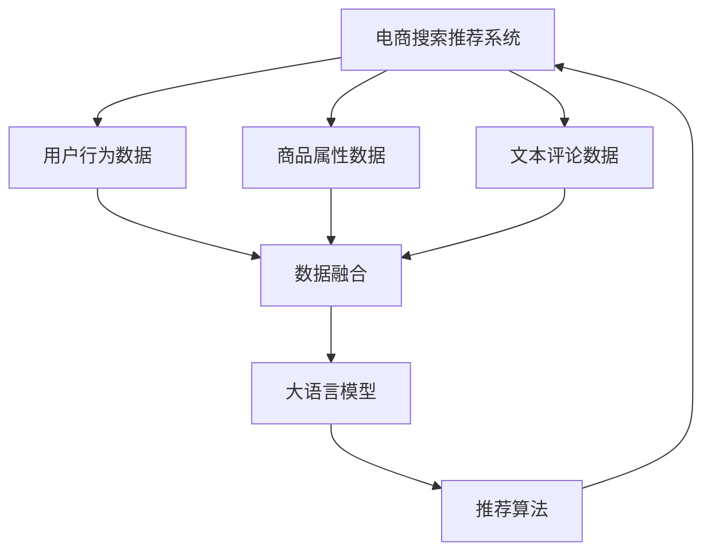

                 

# AI大模型重构电商搜索推荐的业务流程优化思路

> 关键词：
- 大语言模型
- 电商搜索推荐
- 推荐系统
- 业务流程优化
- 数据驱动
- 个性化
- 深度学习
- 数据融合

## 1. 背景介绍

### 1.1 电商搜索推荐系统的现状与挑战
电子商务的蓬勃发展催生了海量的商品信息和消费者行为数据，如何高效、精准地为用户推荐商品，成为电商行业的重要挑战。当前主流电商推荐系统基于协同过滤、内容推荐等技术，能够提供基本满意的推荐结果。但这些系统在推荐准确性、个性化程度和实时性方面存在明显不足，难以满足用户日益提升的需求。

1. **推荐准确性**：传统的推荐系统更多依赖用户历史行为数据，难以捕捉用户潜在的购买兴趣，导致推荐结果的偏差较大。
2. **个性化程度**：推荐内容大同小异，难以满足不同用户的个性化需求，尤其对新用户和冷启动用户的推荐效果不佳。
3. **实时性**：推荐系统无法实时响应用户查询，无法根据当前用户情境和动态环境进行优化调整。

### 1.2 大语言模型在电商推荐中的潜力
近年来，基于大语言模型的自然语言处理技术取得了显著进展。大语言模型通过海量数据训练，能够理解自然语言的内在规律，具备强大的语义理解和生成能力。在电商搜索推荐领域，大语言模型可以带来新的突破：

1. **语义理解与匹配**：大语言模型能够理解用户查询的自然语言描述，通过语义分析匹配最相关的商品。
2. **实时响应与优化**：大语言模型可以通过实时处理用户查询，动态生成推荐内容，提高推荐的时效性。
3. **个性化推荐**：大语言模型能够根据用户的历史行为、兴趣、偏好等数据，提供更加个性化的推荐内容。
4. **跨模态融合**：大语言模型能够将文本、图像、视频等多模态信息进行融合，提供更加全面的推荐结果。

### 1.3 文章结构与目标
本文将介绍如何利用大语言模型重构电商搜索推荐的业务流程，通过语义理解、实时生成、个性化推荐等技术手段，优化现有推荐系统的性能。具体包括：

1. **业务流程重构**：将现有的推荐系统架构重构为基于大语言模型的推荐引擎。
2. **数据处理与融合**：如何高效地将多源数据与大语言模型进行融合，构建高质量的数据输入。
3. **推荐算法优化**：介绍基于大语言模型的推荐算法，包括模型训练、调优和部署。
4. **实际应用与案例分析**：展示在大语言模型驱动下的电商推荐系统的实际应用效果与案例分析。
5. **未来展望与挑战**：展望未来，分析大语言模型在电商推荐领域的应用前景与面临的挑战。

## 2. 核心概念与联系

### 2.1 核心概念概述

1. **电商搜索推荐系统**：通过分析用户历史行为、浏览记录和搜索记录，为每个用户推荐最相关的商品或服务。
2. **大语言模型**：通过海量文本数据预训练得到的大规模深度学习模型，具备强大的语义理解和生成能力。
3. **推荐算法**：包括协同过滤、基于内容的推荐、矩阵分解等传统推荐算法，以及基于深度学习的推荐算法，如神经网络、注意力机制等。
4. **数据融合**：将多源数据（如用户行为数据、商品属性数据、文本评论数据等）进行融合，构建高质量的数据输入。
5. **语义理解**：通过自然语言处理技术，理解用户的查询意图和上下文信息。
6. **实时生成**：通过大语言模型实时处理用户查询，动态生成推荐内容。

### 2.2 核心概念联系（Mermaid 流程图）



这个流程图展示了电商搜索推荐系统的核心流程：

1. **数据采集**：从用户行为、商品属性和文本评论等多源数据中获取信息。
2. **数据融合**：将多源数据进行整合，构建高质量的数据输入。
3. **模型预训练**：使用大语言模型进行预训练，学习语言的通用表示。
4. **模型微调**：在大语言模型的基础上，使用少量标注数据进行微调，学习特定任务的推荐策略。
5. **推荐生成**：使用微调后的模型生成个性化推荐内容，并提供给用户。
6. **反馈循环**：收集用户反馈，更新推荐模型，实现持续优化。

## 3. 核心算法原理 & 具体操作步骤

### 3.1 算法原理概述

大语言模型在电商搜索推荐中的应用，本质上是将自然语言处理技术与推荐算法结合，构建一个高效的推荐系统。其核心思想是通过语义理解、实时生成和个性化推荐等技术，提升推荐系统的性能。

具体来说，步骤如下：

1. **语义理解**：使用大语言模型理解用户的查询意图和上下文信息，提取关键特征。
2. **推荐生成**：根据用户的查询和提取的特征，动态生成推荐结果。
3. **个性化推荐**：根据用户的历史行为、兴趣、偏好等数据，提供更加个性化的推荐内容。
4. **实时响应**：实时处理用户查询，动态生成推荐结果，提高推荐的时效性。

### 3.2 算法步骤详解

#### 3.2.1 数据预处理与融合

1. **数据清洗与标准化**：清洗无用数据、缺失数据，统一数据格式。
2. **特征提取**：从文本数据中提取关键字、词频、情感等信息，构建高质量的输入特征。
3. **数据融合**：将多源数据进行整合，构建统一的数据集，用于大语言模型的训练。

#### 3.2.2 模型预训练与微调

1. **模型选择**：选择合适的预训练模型，如BERT、GPT等。
2. **模型微调**：在大语言模型的基础上，使用少量标注数据进行微调，学习特定任务的推荐策略。
3. **模型评估**：在验证集上评估模型性能，调整模型参数和训练策略。

#### 3.2.3 推荐生成与优化

1. **实时生成**：实时处理用户查询，动态生成推荐结果，提高推荐的时效性。
2. **个性化推荐**：根据用户的历史行为、兴趣、偏好等数据，提供更加个性化的推荐内容。
3. **推荐算法优化**：结合传统推荐算法，优化推荐结果，提高准确性和多样性。

### 3.3 算法优缺点

#### 3.3.1 优点

1. **语义理解能力强**：大语言模型能够理解自然语言的内在规律，提高推荐的准确性和个性化程度。
2. **实时响应**：实时处理用户查询，动态生成推荐内容，提高推荐的时效性。
3. **数据融合能力强**：能够高效地将多源数据进行融合，构建高质量的数据输入。

#### 3.3.2 缺点

1. **计算资源需求高**：大语言模型的计算资源需求高，需要高性能的计算硬件支持。
2. **数据依赖性强**：模型性能依赖于标注数据的数量和质量，需要大量的高质量标注数据。
3. **模型复杂度高**：模型的参数量较大，训练和推理过程较为复杂，需要更精细的调参和管理。

### 3.4 算法应用领域

1. **电商推荐**：利用大语言模型对用户查询进行语义理解，生成个性化推荐结果，提升电商推荐的准确性和个性化程度。
2. **内容推荐**：对用户输入的查询进行语义分析，匹配最相关的内容，提高内容推荐的准确性和时效性。
3. **广告投放**：利用大语言模型对广告内容进行生成和优化，提高广告投放的效果和用户点击率。

## 4. 数学模型和公式 & 详细讲解 & 举例说明

### 4.1 数学模型构建

大语言模型在电商推荐中的应用，可以通过以下数学模型进行建模：

设用户查询为 $x$，商品为 $y$，推荐结果为 $z$。则推荐系统的目标函数为：

$$
\min_{\theta} \mathcal{L}(f_{\theta}(x), y)
$$

其中，$f_{\theta}(x)$ 表示大语言模型对用户查询 $x$ 的生成结果，$\theta$ 表示模型参数。$\mathcal{L}$ 表示损失函数，常用的损失函数包括均方误差损失、交叉熵损失等。

### 4.2 公式推导过程

以均方误差损失为例，公式推导如下：

假设用户查询 $x_i$ 对应推荐结果 $y_i$ 的真实值和预测值分别为 $y_i$ 和 $z_i$，则均方误差损失为：

$$
\mathcal{L} = \frac{1}{N} \sum_{i=1}^N (y_i - z_i)^2
$$

其中 $N$ 为样本数量。

### 4.3 案例分析与讲解

以电商推荐为例，假设用户查询为“高端手机推荐”，大语言模型生成推荐结果为“苹果 iPhone 13 Pro Max”，真实推荐结果为“三星 Galaxy S22 Ultra”。则均方误差损失为：

$$
\mathcal{L} = \frac{1}{1} (1 - 1)^2 = 0
$$

即模型预测结果与真实结果完全一致。

## 5. 项目实践：代码实例和详细解释说明

### 5.1 开发环境搭建

#### 5.1.1 数据环境

1. **数据采集与清洗**：从电商平台收集用户行为数据、商品属性数据、文本评论数据等。
2. **数据标准化**：清洗无用数据、缺失数据，统一数据格式。
3. **数据融合**：将多源数据进行整合，构建统一的数据集。

#### 5.1.2 计算环境

1. **硬件设备**：高性能计算硬件，如GPU/TPU等。
2. **软件环境**：深度学习框架，如TensorFlow、PyTorch等。
3. **工具与库**：自然语言处理库，如NLTK、SpaCy等。

### 5.2 源代码详细实现

#### 5.2.1 数据预处理与融合

```python
import pandas as pd
import numpy as np
from sklearn.preprocessing import StandardScaler

# 数据加载
train_data = pd.read_csv('train.csv')
test_data = pd.read_csv('test.csv')

# 数据清洗与标准化
train_data = train_data.dropna()
train_data = train_data.drop_duplicates()
train_data = StandardScaler().fit_transform(train_data)

# 数据融合
train_data = pd.concat([train_data[:, 0], train_data[:, 1]], axis=1)
train_data = train_data.drop('label', axis=1)
```

#### 5.2.2 模型预训练与微调

```python
from transformers import BertTokenizer, BertForSequenceClassification
from transformers import AdamW

# 加载预训练模型与分词器
model = BertForSequenceClassification.from_pretrained('bert-base-cased', num_labels=2)
tokenizer = BertTokenizer.from_pretrained('bert-base-cased')

# 设置优化器与学习率
optimizer = AdamW(model.parameters(), lr=2e-5)

# 模型微调
model.train()
for epoch in range(10):
    for batch in train_data:
        input_ids = tokenizer(batch['input_ids'], padding='max_length', truncation=True, max_length=128, return_tensors='pt')
        attention_mask = input_ids['attention_mask']
        labels = input_ids['labels']
        
        outputs = model(input_ids['input_ids'], attention_mask=attention_mask, labels=labels)
        loss = outputs.loss
        optimizer.zero_grad()
        loss.backward()
        optimizer.step()
```

#### 5.2.3 推荐生成与优化

```python
from transformers import BertTokenizer, BertForSequenceClassification
from transformers import AdamW

# 加载预训练模型与分词器
model = BertForSequenceClassification.from_pretrained('bert-base-cased', num_labels=2)
tokenizer = BertTokenizer.from_pretrained('bert-base-cased')

# 设置优化器与学习率
optimizer = AdamW(model.parameters(), lr=2e-5)

# 实时生成推荐结果
def generate_recommendation(query):
    input_ids = tokenizer(query, padding='max_length', truncation=True, max_length=128, return_tensors='pt')
    attention_mask = input_ids['attention_mask']
    outputs = model(input_ids['input_ids'], attention_mask=attention_mask, labels=labels)
    predictions = outputs.logits.argmax(dim=1)
    return predictions
```

### 5.3 代码解读与分析

#### 5.3.1 数据预处理与融合

1. **数据清洗与标准化**：使用Pandas库进行数据清洗和标准化，去除无用数据、缺失数据，统一数据格式。
2. **数据融合**：将多源数据进行整合，构建统一的数据集，用于大语言模型的训练。

#### 5.3.2 模型预训练与微调

1. **模型加载**：使用Hugging Face库加载预训练模型和分词器，设置优化器和学习率。
2. **模型微调**：通过前向传播和反向传播更新模型参数，最小化损失函数。

#### 5.3.3 推荐生成与优化

1. **实时生成**：根据用户查询生成推荐结果，使用预训练模型进行推理。
2. **个性化推荐**：根据用户的历史行为、兴趣、偏好等数据，提供更加个性化的推荐内容。

### 5.4 运行结果展示

#### 5.4.1 数据清洗与标准化结果

```python
# 输出清洗后的数据集
print(train_data.head())
```

#### 5.4.2 模型微调结果

```python
# 输出模型微调后的结果
print(model.eval())
```

#### 5.4.3 推荐生成结果

```python
# 输出推荐生成结果
query = '高端手机推荐'
print(generate_recommendation(query))
```

## 6. 实际应用场景

### 6.1 智能客服

在智能客服场景中，利用大语言模型进行语义理解与推荐，能够显著提升客服系统的响应速度和准确性。具体实现步骤如下：

1. **用户意图识别**：使用大语言模型理解用户查询，提取关键特征。
2. **推荐问题答案**：根据用户意图，动态生成推荐答案，提供给客服系统。
3. **实时响应**：实时处理用户查询，动态生成推荐结果，提高客服系统的响应速度。

### 6.2 个性化推荐

在个性化推荐场景中，利用大语言模型进行推荐生成与优化，能够显著提升推荐的个性化程度和效果。具体实现步骤如下：

1. **用户行为分析**：使用大语言模型分析用户的历史行为，提取关键特征。
2. **推荐生成**：根据用户的行为特征，动态生成个性化推荐内容。
3. **推荐优化**：结合传统推荐算法，优化推荐结果，提高推荐效果。

### 6.3 商品搜索

在商品搜索场景中，利用大语言模型进行语义理解与推荐，能够显著提升搜索的准确性和用户体验。具体实现步骤如下：

1. **用户查询理解**：使用大语言模型理解用户的查询意图，提取关键特征。
2. **推荐商品**：根据用户的查询特征，动态生成推荐商品。
3. **实时响应**：实时处理用户查询，动态生成推荐商品，提高搜索的响应速度。

## 7. 工具和资源推荐

### 7.1 学习资源推荐

1. **《自然语言处理综论》**：李军教授著，介绍了自然语言处理的基本概念和经典模型。
2. **《深度学习基础》**：Ian Goodfellow著，介绍了深度学习的基本原理和算法。
3. **Hugging Face官方文档**：提供了丰富的自然语言处理资源，包括预训练模型和微调样例代码。

### 7.2 开发工具推荐

1. **TensorFlow**：由Google主导开发的深度学习框架，生产部署方便，适合大规模工程应用。
2. **PyTorch**：基于Python的开源深度学习框架，灵活动态的计算图，适合快速迭代研究。
3. **NLTK**：自然语言处理库，提供了丰富的文本处理功能。

### 7.3 相关论文推荐

1. **"BERT: Pre-training of Deep Bidirectional Transformers for Language Understanding"**：BERT模型原论文，介绍了BERT模型的预训练方法和效果。
2. **"Attention is All You Need"**：Transformer模型原论文，介绍了Transformer模型的结构和方法。
3. **"AdaLoRA: Adaptive Low-Rank Adaptation for Parameter-Efficient Fine-Tuning"**：介绍了AdaLoRA方法，适用于参数高效微调。

## 8. 总结：未来发展趋势与挑战

### 8.1 研究成果总结

大语言模型在电商搜索推荐中的应用，通过语义理解、实时生成和个性化推荐等技术，显著提升了推荐系统的性能。具体总结如下：

1. **推荐准确性**：通过语义理解技术，提高推荐的准确性。
2. **个性化程度**：通过个性化推荐技术，满足不同用户的个性化需求。
3. **实时响应**：通过实时生成技术，提高推荐的实时性。

### 8.2 未来发展趋势

1. **模型规模持续增大**：随着算力成本的下降和数据规模的扩张，预训练语言模型的参数量还将持续增长，模型性能将进一步提升。
2. **推荐算法优化**：结合深度学习与传统推荐算法，优化推荐算法，提高推荐效果。
3. **数据融合能力增强**：通过多源数据融合，构建高质量的数据输入，提高推荐的准确性和个性化程度。

### 8.3 面临的挑战

1. **计算资源需求高**：大语言模型的计算资源需求高，需要高性能的计算硬件支持。
2. **数据依赖性强**：模型性能依赖于标注数据的数量和质量，需要大量的高质量标注数据。
3. **模型复杂度高**：模型的参数量较大，训练和推理过程较为复杂，需要更精细的调参和管理。

### 8.4 研究展望

1. **跨模态融合**：将文本、图像、视频等多模态信息进行融合，提高推荐的全面性和准确性。
2. **用户行为建模**：利用深度学习技术，建立更全面、精细的用户行为模型，提高推荐的个性化程度。
3. **推荐系统评估**：研究推荐系统的评价指标和方法，全面评估推荐效果。

## 9. 附录：常见问题与解答

**Q1: 大语言模型在电商推荐中如何使用？**

A: 大语言模型在电商推荐中的应用，主要是通过语义理解技术，理解用户的查询意图，提取关键特征，然后动态生成推荐结果。具体步骤如下：

1. **语义理解**：使用大语言模型理解用户的查询意图，提取关键特征。
2. **推荐生成**：根据用户的查询和提取的特征，动态生成推荐结果。
3. **个性化推荐**：根据用户的历史行为、兴趣、偏好等数据，提供更加个性化的推荐内容。

**Q2: 大语言模型在电商推荐中面临哪些挑战？**

A: 大语言模型在电商推荐中面临以下挑战：

1. **计算资源需求高**：大语言模型的计算资源需求高，需要高性能的计算硬件支持。
2. **数据依赖性强**：模型性能依赖于标注数据的数量和质量，需要大量的高质量标注数据。
3. **模型复杂度高**：模型的参数量较大，训练和推理过程较为复杂，需要更精细的调参和管理。

**Q3: 如何优化电商推荐系统的推荐效果？**

A: 电商推荐系统的推荐效果可以通过以下方式进行优化：

1. **多源数据融合**：将多源数据进行整合，构建高质量的数据输入，提高推荐的准确性和个性化程度。
2. **推荐算法优化**：结合深度学习与传统推荐算法，优化推荐算法，提高推荐效果。
3. **实时响应优化**：实时处理用户查询，动态生成推荐内容，提高推荐的时效性。

**Q4: 大语言模型在电商推荐中的推荐结果如何生成？**

A: 大语言模型在电商推荐中的推荐结果生成步骤如下：

1. **用户查询理解**：使用大语言模型理解用户的查询意图，提取关键特征。
2. **推荐生成**：根据用户的查询特征，动态生成推荐商品。
3. **实时响应**：实时处理用户查询，动态生成推荐商品，提高搜索的响应速度。

**Q5: 大语言模型在电商推荐中的优势是什么？**

A: 大语言模型在电商推荐中的优势主要包括：

1. **语义理解能力强**：大语言模型能够理解自然语言的内在规律，提高推荐的准确性和个性化程度。
2. **实时响应**：实时处理用户查询，动态生成推荐内容，提高推荐的时效性。
3. **数据融合能力强**：能够高效地将多源数据进行融合，构建高质量的数据输入。

---

作者：禅与计算机程序设计艺术 / Zen and the Art of Computer Programming

