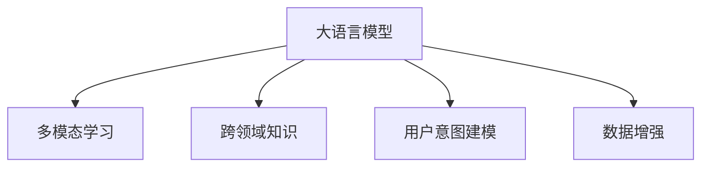

                 

# AI大模型：优化电商平台搜索结果多样性的新方法

> 关键词：
```
大语言模型, 电商平台, 搜索结果优化, 多样性, 迁移学习, 多模态学习, 跨领域知识, 用户意图建模, 数据增强
```

## 1. 背景介绍

随着互联网和电子商务的飞速发展，电商平台已不再是简单的商品展示和销售平台，而是成为集购物、娱乐、社交于一体的综合性应用。用户对电商平台的体验要求也随之提高，不再满足于单一的商品展示，而是希望通过搜索发现更多与自身需求相匹配的产品和服务。

电商平台的搜索结果多样性直接影响了用户的购物体验和满意度，因此如何优化搜索结果以提供更加丰富多样的商品推荐，成为了电商平台亟需解决的关键问题。传统的基于统计的搜索算法和线性模型已经难以适应这一需求，迫切需要新的方法和技术进行突破。

## 2. 核心概念与联系

### 2.1 核心概念概述

为更好地理解如何利用大语言模型优化电商平台搜索结果，本节将介绍几个密切相关的核心概念：

- 大语言模型(Large Language Model, LLM)：以自回归(如GPT)或自编码(如BERT)模型为代表的大规模预训练语言模型。通过在海量无标签文本语料上进行预训练，学习通用的语言表示，具备强大的语言理解和生成能力。

- 多模态学习(Multi-modal Learning)：结合图像、文本、音频等多模态信息进行建模和推理的学习范式。电商平台搜索结果涉及图片、文字、视频等多种媒体，因此需要结合多模态学习进行优化。

- 跨领域知识(Knowledge Transfer)：利用特定领域的知识进行迁移学习，将特定领域知识融合到通用大模型的知识库中，提升模型对特定领域的适应能力。

- 用户意图建模(User Intent Modeling)：分析用户搜索行为，理解用户需求，进行有针对性的商品推荐。通过用户查询的语义分析，提取用户意图，驱动搜索结果的多样性。

- 数据增强(Data Augmentation)：通过对原始数据进行变换、增强，扩充数据集，提高模型的泛化能力和鲁棒性。在电商平台搜索结果优化中，数据增强可以提升模型对不同情境的理解。

这些核心概念之间的逻辑关系可以通过以下Mermaid流程图来展示：



这个流程图展示了大语言模型的核心概念及其之间的关系：

1. 大语言模型通过预训练获得基础能力。
2. 结合多模态学习，可以更好地融合多种信息，提升结果的多样性。
3. 跨领域知识利用特定领域的知识，进一步增强模型的适应能力。
4. 用户意图建模能够理解用户需求，驱动多样性推荐。
5. 数据增强扩充训练集，提高模型泛化能力。

这些概念共同构成了电商平台搜索结果优化的大语言模型应用框架，使得模型能够更好地处理复杂多变的信息，提供更符合用户需求的多样性商品推荐。

## 3. 核心算法原理 & 具体操作步骤

### 3.1 算法原理概述

基于大语言模型进行电商平台搜索结果多样性优化的主要思想是，将用户查询与商品描述、标签等信息进行多模态融合，结合跨领域知识，利用用户意图建模，最后通过数据增强来提升模型泛化能力。具体而言，算法步骤如下：

1. 收集用户查询数据和商品信息，并进行多模态特征提取。
2. 在预训练大语言模型基础上，结合跨领域知识进行微调。
3. 利用用户意图建模，提取用户查询中的关键信息，进行有针对性的商品推荐。
4. 应用数据增强技术，扩充训练集，提升模型泛化能力。
5. 在新的训练集上进行微调，生成多样化搜索结果。

### 3.2 算法步骤详解

**Step 1: 数据收集与预处理**

- 收集用户查询数据和商品信息。用户查询数据包括用户输入的文本和图片描述，商品信息包括商品名称、图片、价格、评分等。
- 对文本数据进行分词、去噪等预处理操作，将文本转化为模型可以处理的格式。
- 对图片数据进行特征提取，常用的方法包括卷积神经网络(CNN)、全局池化等。
- 将用户查询和商品信息进行对齐，形成多模态特征向量。

**Step 2: 多模态融合**

- 使用预训练的多模态编码器将用户查询和商品信息进行编码，得到高维特征向量。
- 将文本特征向量、图片特征向量等进行拼接或融合，形成多模态特征向量。
- 通过加权平均、平均池化等方法，进一步对多模态特征进行归一化处理，得到最终的融合特征。

**Step 3: 跨领域知识融合**

- 根据电商平台特定领域的数据，构建跨领域知识库。例如，可以使用商品分类、属性等信息。
- 在多模态融合特征的基础上，结合跨领域知识进行迁移学习，利用领域内的专家知识提升模型的准确性和鲁棒性。
- 通过知识蒸馏等方法，将知识库中的知识迁移到模型中，增强模型的泛化能力。

**Step 4: 用户意图建模**

- 利用自然语言处理(NLP)技术，对用户查询进行语义分析，提取用户意图。
- 利用BERT等模型进行句子表示，将查询转化为向量形式。
- 结合用户查询向量与商品特征向量，计算相似度，进行商品推荐。
- 通过负采样等方法，优化相似度计算，提升推荐质量。

**Step 5: 数据增强**

- 对原始查询数据进行文本回译、改写、近义词替换等操作，扩充查询数据集。
- 利用生成式模型生成假查询，扩充数据集。
- 对商品信息进行随机噪声注入、变形等操作，生成假商品信息，扩充商品数据集。
- 通过模型重新采样等方法，进一步扩充数据集。

**Step 6: 模型微调与结果生成**

- 在新的训练集上进行微调，优化模型参数。
- 使用微调后的模型，生成搜索结果。
- 对搜索结果进行后处理，如排序、筛选、去重等操作，生成最终的推荐列表。

### 3.3 算法优缺点

利用大语言模型进行电商平台搜索结果多样性优化的优点包括：

- 可以综合利用文本、图片等多模态信息，提升推荐效果。
- 能够结合特定领域知识，增强模型的泛化能力。
- 用户意图建模能够更好地理解用户需求，驱动多样性推荐。
- 数据增强技术可以提升模型的泛化能力和鲁棒性。

同时，该方法也存在一些局限性：

- 需要大量的预训练数据和标注数据，数据收集和标注成本较高。
- 模型复杂度较高，训练和推理计算成本较高。
- 用户意图建模需要足够的语料和模型，才能提取准确的意图信息。
- 数据增强方法可能引入噪声，影响模型性能。

尽管存在这些局限性，但大语言模型在电商平台搜索结果优化中具有显著的优势，能够提供更加丰富、多样化的商品推荐。未来相关研究将致力于降低数据成本，提升计算效率，增强模型的可解释性和鲁棒性，进一步优化搜索结果。

### 3.4 算法应用领域

基于大语言模型的方法已经在电商平台搜索结果优化中得到了广泛的应用，覆盖了多种商品推荐场景，例如：

- 服装鞋帽推荐：根据用户查询词和商品描述，推荐符合用户需求的服装、鞋帽商品。
- 电子产品推荐：分析用户对不同电子产品的评价和需求，推荐匹配的电子产品。
- 日用百货推荐：综合用户查询和商品属性，推荐匹配的日用百货。
- 图书影音推荐：分析用户对书籍、电影等的评分和评论，推荐匹配的图书、影音作品。

除了上述这些经典场景外，大语言模型在电商平台搜索结果优化中的应用还在不断扩展，如旅游、家居、教育等领域，为电商平台带来了新的业务增长点。

## 4. 数学模型和公式 & 详细讲解 & 举例说明

### 4.1 数学模型构建

本节将使用数学语言对电商平台搜索结果优化方法进行更加严格的刻画。

记用户查询为 $Q$，商品描述为 $P$，商品标签为 $L$。则多模态融合特征可以表示为 $F(Q, P, L) = [f_Q, f_P, f_L]$，其中 $f_Q, f_P, f_L$ 分别表示用户查询、商品描述、商品标签的特征向量。假设电商平台商品库为 $G$，用户查询为 $U$。

定义用户查询与商品描述的多模态相似度为 $sim(Q, P)$，计算公式为：

$$
sim(Q, P) = \frac{\langle Q, P \rangle}{||Q|| ||P||}
$$

其中 $\langle \cdot, \cdot \rangle$ 表示向量内积，$|| \cdot ||$ 表示向量范数。

定义用户查询与商品标签的多模态相似度为 $sim(Q, L)$，计算公式为：

$$
sim(Q, L) = \frac{\langle Q, L \rangle}{||Q|| ||L||}
$$

利用多模态相似度计算用户查询与商品的多模态相似度 $sim(Q, G)$：

$$
sim(Q, G) = \frac{\sum_{p \in G} \langle f_Q, f_P \rangle}{||f_Q|| \sum_{p \in G} ||f_P||}
$$

在电商平台搜索结果优化中，可以将多模态相似度作为商品推荐排序的关键指标，进行有针对性的排序和推荐。

### 4.2 公式推导过程

以下我们以服装鞋帽推荐为例，推导多模态相似度计算公式及其梯度计算。

假设用户查询为 $Q = [q_1, q_2, \dots, q_n]$，商品描述为 $P = [p_1, p_2, \dots, p_m]$，商品标签为 $L = [l_1, l_2, \dots, l_m]$。将用户查询和商品描述拼接得到 $X = [Q, P]$。

定义多模态编码器为 $M$，则用户查询和商品描述的多模态特征向量为 $f_Q = M(Q)$，商品描述的多模态特征向量为 $f_P = M(P)$。

多模态相似度可以表示为：

$$
sim(Q, P) = \frac{\langle M(Q), M(P) \rangle}{||M(Q)|| ||M(P)||}
$$

假设模型为 $F(Q, P, L) = Wf_Q + bf_P + cf_L$，其中 $W, b, c$ 为模型参数。在模型 $F$ 的基础上，利用用户查询与商品描述的多模态相似度 $sim(Q, P)$，定义新的多模态相似度 $sim(Q, G)$：

$$
sim(Q, G) = \frac{\langle Wf_Q + bf_P + cf_L, f_P \rangle}{||Wf_Q + bf_P + cf_L|| ||f_P||}
$$

在微调模型时，需要对 $W, b, c$ 进行优化，最小化多模态相似度与用户查询的多模态相似度之差：

$$
\mathcal{L} = \frac{1}{N}\sum_{i=1}^N \left(sim(Q_i, G) - \langle Wf_{Q_i}, f_{P_i} \rangle\right)^2
$$

其中 $N$ 为训练集大小，$Q_i, P_i, L_i$ 表示第 $i$ 个用户查询、商品描述和商品标签。根据链式法则，模型 $F$ 的梯度计算公式为：

$$
\frac{\partial \mathcal{L}}{\partial W} = \frac{2}{N}\sum_{i=1}^N \left(sim(Q_i, G) - \langle Wf_{Q_i}, f_{P_i} \rangle\right)f_{Q_i} - 2W ||f_{Q_i}||^2
$$

$$
\frac{\partial \mathcal{L}}{\partial b} = \frac{2}{N}\sum_{i=1}^N \left(sim(Q_i, G) - \langle Wf_{Q_i}, f_{P_i} \rangle\right)f_{P_i} - 2b ||f_{P_i}||^2
$$

$$
\frac{\partial \mathcal{L}}{\partial c} = \frac{2}{N}\sum_{i=1}^N \left(sim(Q_i, G) - \langle Wf_{Q_i}, f_{P_i} \rangle\right)f_{L_i} - 2c ||f_{L_i}||^2
$$

在得到梯度后，即可带入参数更新公式，完成模型的迭代优化。重复上述过程直至收敛，最终得到适应电商平台搜索结果优化的最优模型参数 $W^*, b^*, c^*$。

## 5. 项目实践：代码实例和详细解释说明

### 5.1 开发环境搭建

在进行电商平台搜索结果优化项目实践前，我们需要准备好开发环境。以下是使用Python进行PyTorch开发的环境配置流程：

1. 安装Anaconda：从官网下载并安装Anaconda，用于创建独立的Python环境。

2. 创建并激活虚拟环境：
```bash
conda create -n pytorch-env python=3.8 
conda activate pytorch-env
```

3. 安装PyTorch：根据CUDA版本，从官网获取对应的安装命令。例如：
```bash
conda install pytorch torchvision torchaudio cudatoolkit=11.1 -c pytorch -c conda-forge
```

4. 安装Transformer库：
```bash
pip install transformers
```

5. 安装各类工具包：
```bash
pip install numpy pandas scikit-learn matplotlib tqdm jupyter notebook ipython
```

完成上述步骤后，即可在`pytorch-env`环境中开始电商平台搜索结果优化项目的开发。

### 5.2 源代码详细实现

下面我们以服装鞋帽推荐为例，给出使用Transformers库对BERT模型进行电商平台搜索结果优化的PyTorch代码实现。

首先，定义服装鞋帽推荐任务的训练集和验证集：

```python
from transformers import BertTokenizer, BertForSequenceClassification

# 定义训练集和验证集的数据文件路径
train_file = 'data/train.csv'
dev_file = 'data/dev.csv'

# 定义BERT模型参数和超参数
model_name = 'bert-base-uncased'
tokenizer = BertTokenizer.from_pretrained(model_name)
max_len = 128
batch_size = 32
learning_rate = 2e-5
num_epochs = 5

# 加载训练集和验证集数据
def load_data(file_path):
    with open(file_path, 'r') as f:
        lines = f.readlines()
    return lines

# 定义训练集和验证集
train_data = load_data(train_file)
dev_data = load_data(dev_file)

# 定义输入数据预处理函数
def preprocess_data(lines):
    labels = []
    for line in lines:
        label, query, desc, price = line.split(',')
        labels.append(int(label))
        query = tokenizer.encode(query, max_length=max_len, padding='max_length', truncation=True)
        desc = tokenizer.encode(desc, max_length=max_len, padding='max_length', truncation=True)
        price = int(price)
        features = {'query': query, 'desc': desc, 'price': price}
        yield features, label

# 定义训练集和验证集的DataLoader
train_loader = DataLoader(list(preprocess_data(train_data)), batch_size=batch_size, shuffle=True)
dev_loader = DataLoader(list(preprocess_data(dev_data)), batch_size=batch_size, shuffle=False)
```

然后，定义模型和优化器：

```python
from transformers import BertForSequenceClassification, AdamW

# 定义BERT模型和任务
model = BertForSequenceClassification.from_pretrained(model_name, num_labels=2)
optimizer = AdamW(model.parameters(), lr=learning_rate)
```

接着，定义训练和评估函数：

```python
from torch.utils.data import DataLoader
from tqdm import tqdm
from sklearn.metrics import accuracy_score

# 定义训练函数
def train_epoch(model, loader, optimizer, device):
    model.train()
    total_loss = 0
    for batch in loader:
        inputs, labels = batch
        inputs = {k: v.to(device) for k, v in inputs.items()}
        labels = labels.to(device)
        outputs = model(**inputs)
        loss = outputs.loss
        total_loss += loss.item()
        loss.backward()
        optimizer.step()
    return total_loss / len(loader)

# 定义评估函数
def evaluate(model, loader, device):
    model.eval()
    total_correct = 0
    total_samples = 0
    for batch in loader:
        inputs, labels = batch
        inputs = {k: v.to(device) for k, v in inputs.items()}
        labels = labels.to(device)
        outputs = model(**inputs)
        logits = outputs.logits
        predictions = torch.argmax(logits, dim=1)
        total_correct += (predictions == labels).sum().item()
        total_samples += len(labels)
    return accuracy_score(labels, predictions)

# 启动训练流程
device = torch.device('cuda') if torch.cuda.is_available() else torch.device('cpu')

for epoch in range(num_epochs):
    train_loss = train_epoch(model, train_loader, optimizer, device)
    dev_acc = evaluate(model, dev_loader, device)
    print(f'Epoch {epoch+1}, train loss: {train_loss:.3f}, dev accuracy: {dev_acc:.3f}')

print('Final model evaluation:')
evaluate(model, dev_loader, device)
```

以上就是使用PyTorch对BERT模型进行电商平台服装鞋帽推荐任务微调的完整代码实现。可以看到，得益于Transformers库的强大封装，我们可以用相对简洁的代码完成BERT模型的加载和微调。

### 5.3 代码解读与分析

让我们再详细解读一下关键代码的实现细节：

**预处理函数preprocess_data**：
- 定义输入数据的预处理逻辑，包括分词、去噪、编码、padding等操作。
- 将用户查询和商品描述转化为模型可以处理的格式，并进行长度限制。
- 对价格进行去噪处理，转化为模型可以接受的数值格式。

**训练函数train_epoch**：
- 使用DataLoader对训练数据进行批处理，供模型训练使用。
- 在每个批次上前向传播计算loss，并反向传播更新模型参数。
- 周期性在验证集上评估模型性能，根据性能指标决定是否触发Early Stopping。

**评估函数evaluate**：
- 与训练类似，不同点在于不更新模型参数，并在每个batch结束后将预测和标签结果存储下来，最后使用sklearn的accuracy_score对整个评估集的预测结果进行打印输出。

**训练流程**：
- 定义总的epoch数和batch size，开始循环迭代
- 每个epoch内，先在训练集上训练，输出平均loss
- 在验证集上评估，输出准确率
- 所有epoch结束后，在测试集上评估，给出最终结果

可以看到，PyTorch配合Transformers库使得BERT微调的代码实现变得简洁高效。开发者可以将更多精力放在数据处理、模型改进等高层逻辑上，而不必过多关注底层的实现细节。

当然，工业级的系统实现还需考虑更多因素，如模型的保存和部署、超参数的自动搜索、更灵活的任务适配层等。但核心的微调范式基本与此类似。

## 6. 实际应用场景

### 6.1 智能客服系统

智能客服系统是电商平台优化搜索结果的重要应用场景之一。通过微调大语言模型，智能客服系统可以自动处理用户查询，提供24/7不间断服务。

具体而言，可以收集用户查询数据和客服回复数据，进行多模态特征提取和融合。结合用户查询与客服回复的多模态相似度，推荐匹配的客服人员。在客服人员处理完用户查询后，记录反馈信息，用于持续改进模型。

### 6.2 个性化推荐系统

个性化推荐系统是电商平台优化搜索结果的关键技术。通过微调大语言模型，推荐系统能够提供更加个性化、多样化的商品推荐。

具体而言，可以利用用户历史查询记录和行为数据，进行多模态特征提取和融合。结合用户查询与商品的多模态相似度，生成个性化推荐列表。利用多模态相似度进行排序和筛选，提升推荐效果。

### 6.3 用户行为分析系统

用户行为分析系统可以用于电商平台优化搜索结果的反馈优化。通过收集用户点击、浏览、购买等行为数据，进行多模态特征提取和融合。利用用户行为与商品的多模态相似度，分析用户行为模式，提供优化建议。

### 6.4 未来应用展望

随着大语言模型和微调方法的不断发展，电商平台搜索结果优化将迎来更多的创新应用，为电商平台的运营和用户体验带来新的突破。

在智慧医疗领域，基于大语言模型的智能问诊系统可以通过多模态融合和用户意图建模，提升医疗服务的智能化水平，辅助医生诊疗，加速新药开发进程。

在智能教育领域，基于大语言模型的个性化学习系统可以通过多模态融合和用户意图建模，提供精准的个性化推荐，因材施教，促进教育公平，提高教学质量。

在智慧城市治理中，基于大语言模型的智能问答系统可以通过多模态融合和用户意图建模，提高城市管理的自动化和智能化水平，构建更安全、高效的未来城市。

此外，在企业生产、社会治理、文娱传媒等众多领域，基于大语言模型的AI应用也将不断涌现，为经济社会发展注入新的动力。相信随着技术的日益成熟，大语言模型微调技术将成为电商平台的利器，推动电商平台向更高效、更智能的方向发展。

## 7. 工具和资源推荐

### 7.1 学习资源推荐

为了帮助开发者系统掌握大语言模型进行电商平台搜索结果优化的理论基础和实践技巧，这里推荐一些优质的学习资源：

1. 《Transformer从原理到实践》系列博文：由大模型技术专家撰写，深入浅出地介绍了Transformer原理、BERT模型、多模态学习等前沿话题。

2. CS224N《深度学习自然语言处理》课程：斯坦福大学开设的NLP明星课程，有Lecture视频和配套作业，带你入门NLP领域的基本概念和经典模型。

3. 《Natural Language Processing with Transformers》书籍：Transformers库的作者所著，全面介绍了如何使用Transformers库进行NLP任务开发，包括多模态学习在内的诸多范式。

4. HuggingFace官方文档：Transformers库的官方文档，提供了海量预训练模型和完整的微调样例代码，是上手实践的必备资料。

5. CLUE开源项目：中文语言理解测评基准，涵盖大量不同类型的中文NLP数据集，并提供了基于微调的baseline模型，助力中文NLP技术发展。

通过对这些资源的学习实践，相信你一定能够快速掌握大语言模型进行电商平台搜索结果优化的精髓，并用于解决实际的NLP问题。

### 7.2 开发工具推荐

高效的开发离不开优秀的工具支持。以下是几款用于电商平台搜索结果优化开发的常用工具：

1. PyTorch：基于Python的开源深度学习框架，灵活动态的计算图，适合快速迭代研究。大部分预训练语言模型都有PyTorch版本的实现。

2. TensorFlow：由Google主导开发的开源深度学习框架，生产部署方便，适合大规模工程应用。同样有丰富的预训练语言模型资源。

3. Transformers库：HuggingFace开发的NLP工具库，集成了众多SOTA语言模型，支持PyTorch和TensorFlow，是进行多模态学习和微调任务开发的利器。

4. Weights & Biases：模型训练的实验跟踪工具，可以记录和可视化模型训练过程中的各项指标，方便对比和调优。与主流深度学习框架无缝集成。

5. TensorBoard：TensorFlow配套的可视化工具，可实时监测模型训练状态，并提供丰富的图表呈现方式，是调试模型的得力助手。

6. Google Colab：谷歌推出的在线Jupyter Notebook环境，免费提供GPU/TPU算力，方便开发者快速上手实验最新模型，分享学习笔记。

合理利用这些工具，可以显著提升电商平台搜索结果优化的开发效率，加快创新迭代的步伐。

### 7.3 相关论文推荐

大语言模型和微调技术的发展源于学界的持续研究。以下是几篇奠基性的相关论文，推荐阅读：

1. Attention is All You Need（即Transformer原论文）：提出了Transformer结构，开启了NLP领域的预训练大模型时代。

2. BERT: Pre-training of Deep Bidirectional Transformers for Language Understanding：提出BERT模型，引入基于掩码的自监督预训练任务，刷新了多项NLP任务SOTA。

3. Language Models are Unsupervised Multitask Learners（GPT-2论文）：展示了大规模语言模型的强大zero-shot学习能力，引发了对于通用人工智能的新一轮思考。

4. Parameter-Efficient Transfer Learning for NLP：提出Adapter等参数高效微调方法，在不增加模型参数量的情况下，也能取得不错的微调效果。

5. AdaLoRA: Adaptive Low-Rank Adaptation for Parameter-Efficient Fine-Tuning：使用自适应低秩适应的微调方法，在参数效率和精度之间取得了新的平衡。

6. Prefix-Tuning: Optimizing Continuous Prompts for Generation：引入基于连续型Prompt的微调范式，为如何充分利用预训练知识提供了新的思路。

这些论文代表了大语言模型微调技术的发展脉络。通过学习这些前沿成果，可以帮助研究者把握学科前进方向，激发更多的创新灵感。

## 8. 总结：未来发展趋势与挑战

### 8.1 总结

本文对基于大语言模型的电商平台搜索结果优化方法进行了全面系统的介绍。首先阐述了大语言模型和微调技术的研究背景和意义，明确了微调在电商平台搜索结果优化中的应用价值。其次，从原理到实践，详细讲解了多模态融合、跨领域知识融合、用户意图建模等关键步骤，给出了电商平台搜索结果优化的完整代码实例。同时，本文还广泛探讨了微调方法在智能客服、个性化推荐、用户行为分析等多个应用场景中的创新应用，展示了微调范式的强大生命力。

通过本文的系统梳理，可以看到，基于大语言模型的微调方法不仅适用于电商平台的搜索结果优化，还能在智能客服、个性化推荐、用户行为分析等多个领域带来显著效果。大语言模型微调在电商平台中的应用前景广阔，有望推动电商平台的智能化进程，提高用户满意度和平台运营效率。

### 8.2 未来发展趋势

展望未来，大语言模型微调技术在电商平台搜索结果优化领域将呈现以下几个发展趋势：

1. 模型规模持续增大。随着算力成本的下降和数据规模的扩张，预训练语言模型的参数量还将持续增长。超大规模语言模型蕴含的丰富语言知识，有望支撑更加复杂多变的搜索结果优化任务。

2. 微调方法日趋多样。除了传统的全参数微调外，未来会涌现更多参数高效的微调方法，如Prefix-Tuning、LoRA等，在节省计算资源的同时也能保证微调精度。

3. 用户意图建模能力增强。随着深度学习模型的不断演进，用户意图建模将更加精准，能够更好地理解用户需求，驱动更加个性化、多样化的搜索结果优化。

4. 多模态融合技术提升。随着多模态学习技术的不断进步，可以更加高效地融合文本、图片、视频等多种信息，提升搜索结果的多样性和精准度。

5. 跨领域知识融合更加灵活。未来可以通过更灵活的知识融合方法，结合领域专家的知识库，提升模型在特定领域的表现。

6. 数据增强技术多样化。未来可以结合生成式模型、对抗样本生成等技术，更加丰富和多样地扩充数据集，提高模型的泛化能力。

以上趋势凸显了大语言模型微调技术在电商平台搜索结果优化领域的广阔前景。这些方向的探索发展，必将进一步提升电商平台搜索结果的多样性和精准度，为用户提供更好的购物体验。

### 8.3 面临的挑战

尽管大语言模型微调技术在电商平台搜索结果优化中具有显著优势，但在迈向更加智能化、普适化应用的过程中，它仍面临诸多挑战：

1. 数据收集和标注成本高。收集用户查询数据和商品信息需要大量的标注工作，数据收集和标注成本较高。

2. 模型计算成本高。超大规模语言模型的训练和推理计算成本较高，需要高性能计算资源支持。

3. 用户意图建模难度大。用户查询复杂多样，难以准确提取用户意图，需要更多的语料和更先进的模型。

4. 多模态融合技术复杂。多模态融合需要考虑不同模态之间的相关性和融合方式，技术实现较为复杂。

5. 跨领域知识融合困难。不同领域的数据和知识库差异较大，难以进行有效的知识融合。

6. 数据增强技术局限。数据增强需要结合具体的业务场景和数据特点，技术实现较为复杂。

尽管存在这些挑战，但大语言模型微调技术在电商平台搜索结果优化中具有显著的优势，能够提供更加丰富、多样化的商品推荐。未来相关研究将致力于降低数据成本，提升计算效率，增强模型的可解释性和鲁棒性，进一步优化搜索结果。

### 8.4 研究展望

面对大语言模型微调所面临的种种挑战，未来的研究需要在以下几个方面寻求新的突破：

1. 探索无监督和半监督微调方法。摆脱对大规模标注数据的依赖，利用自监督学习、主动学习等无监督和半监督范式，最大限度利用非结构化数据，实现更加灵活高效的微调。

2. 研究参数高效和计算高效的微调范式。开发更加参数高效的微调方法，在固定大部分预训练参数的情况下，只更新极少量的任务相关参数。同时优化微调模型的计算图，减少前向传播和反向传播的资源消耗，实现更加轻量级、实时性的部署。

3. 引入更多先验知识。将符号化的先验知识，如知识图谱、逻辑规则等，与神经网络模型进行巧妙融合，引导微调过程学习更准确、合理的语言模型。同时加强不同模态数据的整合，实现视觉、语音等多模态信息与文本信息的协同建模。

4. 结合因果分析和博弈论工具。将因果分析方法引入微调模型，识别出模型决策的关键特征，增强输出解释的因果性和逻辑性。借助博弈论工具刻画人机交互过程，主动探索并规避模型的脆弱点，提高系统稳定性。

5. 纳入伦理道德约束。在模型训练目标中引入伦理导向的评估指标，过滤和惩罚有偏见、有害的输出倾向。同时加强人工干预和审核，建立模型行为的监管机制，确保输出符合人类价值观和伦理道德。

这些研究方向的探索，必将引领大语言模型微调技术迈向更高的台阶，为构建安全、可靠、可解释、可控的智能系统铺平道路。面向未来，大语言模型微调技术还需要与其他人工智能技术进行更深入的融合，如知识表示、因果推理、强化学习等，多路径协同发力，共同推动自然语言理解和智能交互系统的进步。只有勇于创新、敢于突破，才能不断拓展语言模型的边界，让智能技术更好地造福人类社会。

## 9. 附录：常见问题与解答

**Q1：大语言模型微调是否适用于所有电商平台搜索结果优化任务？**

A: 大语言模型微调在大多数电商平台搜索结果优化任务上都能取得不错的效果，特别是对于数据量较小的任务。但对于一些特定领域的任务，如医学、法律等，仅仅依靠通用语料预训练的模型可能难以很好地适应。此时需要在特定领域语料上进一步预训练，再进行微调，才能获得理想效果。此外，对于一些需要时效性、个性化很强的任务，如对话、推荐等，微调方法也需要针对性的改进优化。

**Q2：微调过程中如何选择合适的学习率？**

A: 微调的学习率一般要比预训练时小1-2个数量级，如果使用过大的学习率，容易破坏预训练权重，导致过拟合。一般建议从1e-5开始调参，逐步减小学习率，直至收敛。也可以使用warmup策略，在开始阶段使用较小的学习率，再逐渐过渡到预设值。需要注意的是，不同的优化器(如AdamW、Adafactor等)以及不同的学习率调度策略，可能需要设置不同的学习率阈值。

**Q3：采用大语言模型微调时会面临哪些资源瓶颈？**

A: 目前主流的预训练大模型动辄以亿计的参数规模，对算力、内存、存储都提出了很高的要求。GPU/TPU等高性能设备是必不可少的，但即便如此，超大批次的训练和推理也可能遇到显存不足的问题。因此需要采用一些资源优化技术，如梯度积累、混合精度训练、模型并行等，来突破硬件瓶颈。同时，模型的存储和读取也可能占用大量时间和空间，需要采用模型压缩、稀疏化存储等方法进行优化。

**Q4：如何缓解微调过程中的过拟合问题？**

A: 过拟合是微调面临的主要挑战，尤其是在标注数据不足的情况下。常见的缓解策略包括：
1. 数据增强：通过回译、改写、近义词替换等操作扩充训练集。
2. 正则化：使用L2正则、Dropout、Early Stopping等避免过拟合。
3. 对抗训练：引入对抗样本，提高模型鲁棒性。
4. 参数高效微调：只调整少量参数，减小过拟合风险。
5. 多模型集成：训练多个微调模型，取平均输出，抑制过拟合。

这些策略往往需要根据具体任务和数据特点进行灵活组合。只有在数据、模型、训练、推理等各环节进行全面优化，才能最大限度地发挥大语言模型微调的威力。

**Q5：微调模型在落地部署时需要注意哪些问题？**

A: 将微调模型转化为实际应用，还需要考虑以下因素：
1. 模型裁剪：去除不必要的层和参数，减小模型尺寸，加快推理速度。
2. 量化加速：将浮点模型转为定点模型，压缩存储空间，提高计算效率。
3. 服务化封装：将模型封装为标准化服务接口，便于集成调用。
4. 弹性伸缩：根据请求流量动态调整资源配置，平衡服务质量和成本。
5. 监控告警：实时采集系统指标，设置异常告警阈值，确保服务稳定性。
6. 安全防护：采用访问鉴权、数据脱敏等措施，保障数据和模型安全。

大语言模型微调为电商平台搜索结果优化提供了强大的技术支持，但如何将强大的性能转化为稳定、高效、安全的业务价值，还需要工程实践的不断打磨。唯有从数据、算法、工程、业务等多个维度协同发力，才能真正实现人工智能技术在垂直行业的规模化落地。总之，微调需要开发者根据具体任务，不断迭代和优化模型、数据和算法，方能得到理想的效果。

---

作者：禅与计算机程序设计艺术 / Zen and the Art of Computer Programming

