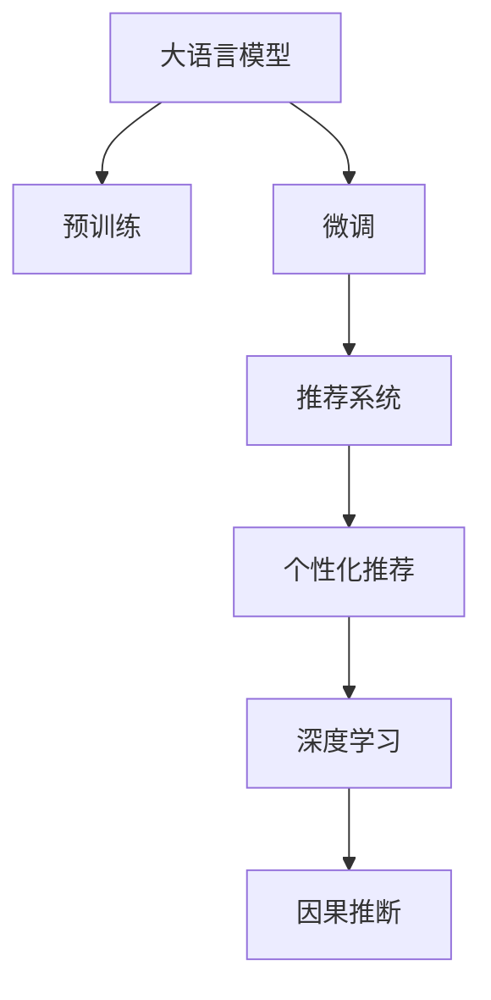

                 

## 1. 背景介绍

### 1.1 电商领域现状

近年来，电子商务行业蓬勃发展，各大电商平台通过提供海量商品和服务，成为人们日常生活不可或缺的一部分。但随着用户规模的急剧增长，电商平台面临的最大挑战之一是如何提升用户体验，满足用户多样化和个性化的需求。

传统的电商推荐系统基于静态特征（如购买历史、浏览记录等）进行推荐，难以捕捉到用户的动态变化和深层偏好。随着人工智能技术的成熟，大模型开始在电商领域得到应用，通过深度学习和大数据技术，从用户行为、产品属性、场景变化等多个维度，全面理解用户需求，提供更加个性化的购物体验。

### 1.2 大模型的发展

大模型，尤其是基于深度神经网络的语言模型，如BERT、GPT等，通过在大规模无标签文本语料上进行预训练，学习到丰富的语言知识和常识，具备强大的语言理解和生成能力。它们能够捕捉到自然语言中的复杂语义关系，广泛应用于NLP、语音识别、图像处理等领域。

在电商平台中，大模型可以通过对用户评论、搜索查询、浏览记录等文本数据进行建模，理解用户意图和情感，从而提供更加精准和个性化的推荐服务。同时，大模型也可以用于智能客服、订单管理、内容生成等电商应用场景，提升平台运营效率和用户满意度。

## 2. 核心概念与联系

### 2.1 核心概念概述

为更好地理解大模型在电商平台中的应用，本节将介绍几个密切相关的核心概念：

- **大语言模型(Large Language Model, LLM)**：以自回归(如GPT)或自编码(如BERT)模型为代表的大规模预训练语言模型。通过在大规模无标签文本语料上进行预训练，学习通用的语言表示，具备强大的语言理解和生成能力。

- **预训练(Pre-training)**：指在大规模无标签文本语料上，通过自监督学习任务训练通用语言模型的过程。常见的预训练任务包括言语建模、遮挡语言模型等。预训练使得模型学习到语言的通用表示。

- **微调(Fine-tuning)**：指在预训练模型的基础上，使用下游任务的少量标注数据，通过有监督学习优化模型在特定任务上的性能。通常只需要调整顶层分类器或解码器，并以较小的学习率更新全部或部分的模型参数。

- **迁移学习(Transfer Learning)**：指将一个领域学习到的知识，迁移应用到另一个不同但相关的领域的学习范式。大模型的预训练-微调过程即是一种典型的迁移学习方式。

- **推荐系统(Recommendation System)**：通过分析用户的历史行为数据，预测用户可能感兴趣的物品，并提供推荐服务。常见的推荐系统包括基于协同过滤、内容基推荐、深度学习推荐等。

- **个性化推荐**：根据用户的具体偏好，提供定制化的推荐服务。通过多维度数据（如浏览记录、评价信息、行为序列等），构建个性化的用户画像，实现更加精准的推荐。

- **深度学习(Deep Learning)**：使用多层神经网络进行模型训练，能够处理更加复杂的特征和学习任务。深度学习在电商平台推荐系统中的应用，可以提升模型的预测能力和泛化性能。

- **因果推断(Causal Inference)**：通过模型分析变量间的因果关系，用于理解和预测复杂系统的行为。在电商推荐系统中，可以用于评估推荐策略的效果，识别出对用户满意度和购买转化率有影响的关键因素。

这些核心概念之间的逻辑关系可以通过以下Mermaid流程图来展示：



这个流程图展示了大语言模型的核心概念及其之间的关系：

1. 大语言模型通过预训练获得基础能力。
2. 微调是对预训练模型进行任务特定的优化，使得模型能够更好地适应电商推荐等特定任务。
3. 推荐系统通过分析用户行为数据，构建个性化推荐服务。
4. 深度学习为推荐系统提供更强大的特征提取和模型训练能力。
5. 因果推断用于评估推荐策略的效果，提供决策支持。

这些概念共同构成了电商推荐系统的学习和应用框架，使得大语言模型在电商平台中能够发挥其强大的语言理解和生成能力。

## 3. 核心算法原理 & 具体操作步骤

### 3.1 算法原理概述

基于大语言模型的电商推荐系统，本质上是一种有监督的细粒度迁移学习过程。其核心思想是：将大语言模型视作一个强大的"特征提取器"，通过在电商推荐任务上对少量标注数据进行有监督微调，使得模型输出能够匹配推荐任务，从而获得针对特定任务优化的模型。

形式化地，假设预训练语言模型为 $M_{\theta}$，其中 $\theta$ 为预训练得到的模型参数。给定电商平台上的推荐任务 $T$ 的标注数据集 $D=\{(x_i, y_i)\}_{i=1}^N$，微调的目标是找到新的模型参数 $\hat{\theta}$，使得：

$$
\hat{\theta}=\mathop{\arg\min}_{\theta} \mathcal{L}(M_{\theta},D)
$$

其中 $\mathcal{L}$ 为针对任务 $T$ 设计的损失函数，用于衡量模型预测输出与真实标签之间的差异。常见的损失函数包括交叉熵损失、均方误差损失等。

通过梯度下降等优化算法，微调过程不断更新模型参数 $\theta$，最小化损失函数 $\mathcal{L}$，使得模型输出逼近真实标签。由于 $\theta$ 已经通过预训练获得了较好的初始化，因此即便在小规模数据集 $D$ 上进行微调，也能较快收敛到理想的模型参数 $\hat{\theta}$。

### 3.2 算法步骤详解

基于大语言模型的电商推荐系统，一般包括以下几个关键步骤：

**Step 1: 准备预训练模型和数据集**
- 选择合适的预训练语言模型 $M_{\theta}$ 作为初始化参数，如 BERT、GPT等。
- 准备电商平台上的推荐任务 $T$ 的标注数据集 $D$，划分为训练集、验证集和测试集。一般要求标注数据与预训练数据的分布不要差异过大。

**Step 2: 添加推荐适配层**
- 根据任务类型，在预训练模型顶层设计合适的推荐输出层和损失函数。
- 对于推荐任务，通常在顶层添加softmax分类器输出概率分布，并以交叉熵损失函数进行训练。

**Step 3: 设置微调超参数**
- 选择合适的优化算法及其参数，如 AdamW、SGD 等，设置学习率、批大小、迭代轮数等。
- 设置正则化技术及强度，包括权重衰减、Dropout、Early Stopping等。
- 确定冻结预训练参数的策略，如仅微调顶层，或全部参数都参与微调。

**Step 4: 执行梯度训练**
- 将训练集数据分批次输入模型，前向传播计算损失函数。
- 反向传播计算参数梯度，根据设定的优化算法和学习率更新模型参数。
- 周期性在验证集上评估模型性能，根据性能指标决定是否触发 Early Stopping。
- 重复上述步骤直到满足预设的迭代轮数或 Early Stopping 条件。

**Step 5: 测试和部署**
- 在测试集上评估微调后模型 $M_{\hat{\theta}}$ 的性能，对比微调前后的精度提升。
- 使用微调后的模型对新样本进行推荐，集成到实际的应用系统中。
- 持续收集新的数据，定期重新微调模型，以适应数据分布的变化。

以上是基于大语言模型的电商推荐系统的一般流程。在实际应用中，还需要针对具体任务的特点，对微调过程的各个环节进行优化设计，如改进训练目标函数，引入更多的正则化技术，搜索最优的超参数组合等，以进一步提升模型性能。

### 3.3 算法优缺点

基于大语言模型的电商推荐系统具有以下优点：
1. 简单高效。只需准备少量标注数据，即可对预训练模型进行快速适配，获得较大的性能提升。
2. 通用适用。适用于各种电商推荐任务，包括商品推荐、促销活动、个性化广告等，设计简单的任务适配层即可实现微调。
3. 参数高效。利用参数高效微调技术，在固定大部分预训练权重不变的情况下，仍可取得不错的推荐效果。
4. 效果显著。在学术界和工业界的诸多任务上，基于微调的方法已经刷新了最先进的性能指标。

同时，该方法也存在一定的局限性：
1. 依赖标注数据。推荐系统的效果很大程度上取决于标注数据的质量和数量，获取高质量标注数据的成本较高。
2. 迁移能力有限。当目标任务与预训练数据的分布差异较大时，推荐系统的性能提升有限。
3. 负面效果传递。预训练模型的固有偏见、有害信息等，可能通过推荐系统传递到用户，造成负面影响。
4. 可解释性不足。推荐系统的决策过程通常缺乏可解释性，难以对其推理逻辑进行分析和调试。

尽管存在这些局限性，但就目前而言，基于大语言模型的推荐系统仍然是最主流范式。未来相关研究的重点在于如何进一步降低推荐系统对标注数据的依赖，提高模型的少样本学习和跨领域迁移能力，同时兼顾可解释性和伦理安全性等因素。

### 3.4 算法应用领域

基于大语言模型的推荐系统，已经在电商平台推荐、广告投放、个性化推荐等多个领域取得了优异的效果，成为电商平台推荐服务的重要手段。具体而言：

- **商品推荐**：通过分析用户历史行为数据，预测用户可能感兴趣的物品，并提供个性化推荐。
- **促销活动**：通过分析用户兴趣和行为数据，推荐适合用户的促销活动，提升用户转化率。
- **个性化广告**：通过分析用户属性和行为数据，推送个性化的广告内容，提高广告效果。
- **内容推荐**：通过分析用户对商品的评价和评论数据，推荐相关商品或相似商品，丰富用户购物体验。
- **智能客服**：通过分析用户查询数据，推荐最合适的解决方案，提升客户满意度。

除了上述这些经典任务外，大语言模型推荐系统也被创新性地应用到更多场景中，如个性化礼物推荐、节日促销推荐等，为电商平台的运营带来新的突破。随着预训练模型和推荐方法的不断进步，相信电商平台的推荐服务将更加智能化、精准化，带来更好的用户体验。

## 4. 数学模型和公式 & 详细讲解

### 4.1 数学模型构建

本节将使用数学语言对基于大语言模型的电商推荐过程进行更加严格的刻画。

记预训练语言模型为 $M_{\theta}$，其中 $\theta$ 为模型参数。假设电商平台上的推荐任务 $T$ 的训练集为 $D=\{(x_i, y_i)\}_{i=1}^N, x_i \in \mathcal{X}, y_i \in \{1,0\}$，其中 $1$ 表示推荐，$0$ 表示不推荐。

定义模型 $M_{\theta}$ 在数据样本 $(x,y)$ 上的损失函数为 $\ell(M_{\theta}(x),y)$，则在数据集 $D$ 上的经验风险为：

$$
\mathcal{L}(\theta) = \frac{1}{N} \sum_{i=1}^N \ell(M_{\theta}(x_i),y_i)
$$

其中 $\ell$ 为交叉熵损失函数，用于衡量模型预测输出与真实标签之间的差异。

微调的优化目标是最小化经验风险，即找到最优参数：

$$
\theta^* = \mathop{\arg\min}_{\theta} \mathcal{L}(\theta)
$$

在实践中，我们通常使用基于梯度的优化算法（如SGD、Adam等）来近似求解上述最优化问题。设 $\eta$ 为学习率，$\lambda$ 为正则化系数，则参数的更新公式为：

$$
\theta \leftarrow \theta - \eta \nabla_{\theta}\mathcal{L}(\theta) - \eta\lambda\theta
$$

其中 $\nabla_{\theta}\mathcal{L}(\theta)$ 为损失函数对参数 $\theta$ 的梯度，可通过反向传播算法高效计算。

### 4.2 公式推导过程

以下我们以二分类推荐任务为例，推导交叉熵损失函数及其梯度的计算公式。

假设模型 $M_{\theta}$ 在输入 $x$ 上的输出为 $\hat{y}=M_{\theta}(x) \in [0,1]$，表示商品被推荐的概率。真实标签 $y \in \{1,0\}$。则二分类交叉熵损失函数定义为：

$$
\ell(M_{\theta}(x),y) = -[y\log \hat{y} + (1-y)\log (1-\hat{y})]
$$

将其代入经验风险公式，得：

$$
\mathcal{L}(\theta) = -\frac{1}{N}\sum_{i=1}^N [y_i\log M_{\theta}(x_i)+(1-y_i)\log(1-M_{\theta}(x_i))]
$$

根据链式法则，损失函数对参数 $\theta_k$ 的梯度为：

$$
\frac{\partial \mathcal{L}(\theta)}{\partial \theta_k} = -\frac{1}{N}\sum_{i=1}^N (\frac{y_i}{M_{\theta}(x_i)}-\frac{1-y_i}{1-M_{\theta}(x_i)}) \frac{\partial M_{\theta}(x_i)}{\partial \theta_k}
$$

其中 $\frac{\partial M_{\theta}(x_i)}{\partial \theta_k}$ 可进一步递归展开，利用自动微分技术完成计算。

在得到损失函数的梯度后，即可带入参数更新公式，完成模型的迭代优化。重复上述过程直至收敛，最终得到适应电商平台推荐任务的最优模型参数 $\theta^*$。

## 5. 项目实践：代码实例和详细解释说明

### 5.1 开发环境搭建

在进行推荐系统实践前，我们需要准备好开发环境。以下是使用Python进行PyTorch开发的环境配置流程：

1. 安装Anaconda：从官网下载并安装Anaconda，用于创建独立的Python环境。

2. 创建并激活虚拟环境：
```bash
conda create -n pytorch-env python=3.8 
conda activate pytorch-env
```

3. 安装PyTorch：根据CUDA版本，从官网获取对应的安装命令。例如：
```bash
conda install pytorch torchvision torchaudio cudatoolkit=11.1 -c pytorch -c conda-forge
```

4. 安装Transformers库：
```bash
pip install transformers
```

5. 安装各类工具包：
```bash
pip install numpy pandas scikit-learn matplotlib tqdm jupyter notebook ipython
```

完成上述步骤后，即可在`pytorch-env`环境中开始推荐系统开发。

### 5.2 源代码详细实现

下面我们以商品推荐任务为例，给出使用Transformers库对BERT模型进行推荐系统微调的PyTorch代码实现。

首先，定义推荐任务的数据处理函数：

```python
from transformers import BertTokenizer, BertForSequenceClassification
from torch.utils.data import Dataset
import torch

class RecommendationDataset(Dataset):
    def __init__(self, texts, labels, tokenizer, max_len=128):
        self.texts = texts
        self.labels = labels
        self.tokenizer = tokenizer
        self.max_len = max_len
        
    def __len__(self):
        return len(self.texts)
    
    def __getitem__(self, item):
        text = self.texts[item]
        label = self.labels[item]
        
        encoding = self.tokenizer(text, return_tensors='pt', max_length=self.max_len, padding='max_length', truncation=True)
        input_ids = encoding['input_ids'][0]
        attention_mask = encoding['attention_mask'][0]
        
        # 将标签转换为[1,0]形式的输出
        encoded_labels = torch.tensor([1 if label == 'recommend' else 0], dtype=torch.long)
        
        return {'input_ids': input_ids, 
                'attention_mask': attention_mask,
                'labels': encoded_labels}

# 创建dataset
tokenizer = BertTokenizer.from_pretrained('bert-base-cased')

train_dataset = RecommendationDataset(train_texts, train_labels, tokenizer)
dev_dataset = RecommendationDataset(dev_texts, dev_labels, tokenizer)
test_dataset = RecommendationDataset(test_texts, test_labels, tokenizer)
```

然后，定义模型和优化器：

```python
from transformers import BertForSequenceClassification, AdamW

model = BertForSequenceClassification.from_pretrained('bert-base-cased', num_labels=2)

optimizer = AdamW(model.parameters(), lr=2e-5)
```

接着，定义训练和评估函数：

```python
from torch.utils.data import DataLoader
from tqdm import tqdm
from sklearn.metrics import classification_report

device = torch.device('cuda') if torch.cuda.is_available() else torch.device('cpu')
model.to(device)

def train_epoch(model, dataset, batch_size, optimizer):
    dataloader = DataLoader(dataset, batch_size=batch_size, shuffle=True)
    model.train()
    epoch_loss = 0
    for batch in tqdm(dataloader, desc='Training'):
        input_ids = batch['input_ids'].to(device)
        attention_mask = batch['attention_mask'].to(device)
        labels = batch['labels'].to(device)
        model.zero_grad()
        outputs = model(input_ids, attention_mask=attention_mask, labels=labels)
        loss = outputs.loss
        epoch_loss += loss.item()
        loss.backward()
        optimizer.step()
    return epoch_loss / len(dataloader)

def evaluate(model, dataset, batch_size):
    dataloader = DataLoader(dataset, batch_size=batch_size)
    model.eval()
    preds, labels = [], []
    with torch.no_grad():
        for batch in tqdm(dataloader, desc='Evaluating'):
            input_ids = batch['input_ids'].to(device)
            attention_mask = batch['attention_mask'].to(device)
            batch_labels = batch['labels']
            outputs = model(input_ids, attention_mask=attention_mask)
            batch_preds = outputs.logits.argmax(dim=2).to('cpu').tolist()
            batch_labels = batch_labels.to('cpu').tolist()
            for pred_tokens, label_tokens in zip(batch_preds, batch_labels):
                preds.append(pred_tokens[:len(label_tokens)])
                labels.append(label_tokens)
                
    print(classification_report(labels, preds))
```

最后，启动训练流程并在测试集上评估：

```python
epochs = 5
batch_size = 16

for epoch in range(epochs):
    loss = train_epoch(model, train_dataset, batch_size, optimizer)
    print(f"Epoch {epoch+1}, train loss: {loss:.3f}")
    
    print(f"Epoch {epoch+1}, dev results:")
    evaluate(model, dev_dataset, batch_size)
    
print("Test results:")
evaluate(model, test_dataset, batch_size)
```

以上就是使用PyTorch对BERT进行推荐系统微调的完整代码实现。可以看到，得益于Transformers库的强大封装，我们可以用相对简洁的代码完成BERT模型的加载和推荐系统微调。

### 5.3 代码解读与分析

让我们再详细解读一下关键代码的实现细节：

**RecommendationDataset类**：
- `__init__`方法：初始化文本、标签、分词器等关键组件。
- `__len__`方法：返回数据集的样本数量。
- `__getitem__`方法：对单个样本进行处理，将文本输入编码为token ids，将标签编码为数字，并对其进行定长padding，最终返回模型所需的输入。

**模型与优化器**：
- 使用`BertForSequenceClassification`类加载预训练的BERT模型，设置输出层大小为2（推荐与否），并设置标签数量为2。
- 使用AdamW优化器，设置学习率为2e-5。

**训练和评估函数**：
- 使用PyTorch的DataLoader对数据集进行批次化加载，供模型训练和推理使用。
- 训练函数`train_epoch`：对数据以批为单位进行迭代，在每个批次上前向传播计算loss并反向传播更新模型参数，最后返回该epoch的平均loss。
- 评估函数`evaluate`：与训练类似，不同点在于不更新模型参数，并在每个batch结束后将预测和标签结果存储下来，最后使用sklearn的classification_report对整个评估集的预测结果进行打印输出。

**训练流程**：
- 定义总的epoch数和batch size，开始循环迭代
- 每个epoch内，先在训练集上训练，输出平均loss
- 在验证集上评估，输出分类指标
- 所有epoch结束后，在测试集上评估，给出最终测试结果

可以看到，PyTorch配合Transformers库使得BERT推荐系统的代码实现变得简洁高效。开发者可以将更多精力放在数据处理、模型改进等高层逻辑上，而不必过多关注底层的实现细节。

当然，工业级的系统实现还需考虑更多因素，如模型的保存和部署、超参数的自动搜索、更灵活的任务适配层等。但核心的推荐范式基本与此类似。

## 6. 实际应用场景

### 6.1 智能客服系统

基于大语言模型的推荐技术，可以广泛应用于智能客服系统的构建。传统客服往往需要配备大量人力，高峰期响应缓慢，且一致性和专业性难以保证。而使用推荐系统，可以实时推荐最合适的解决方案，提升客服效率和用户满意度。

在技术实现上，可以收集客户的历史互动记录和反馈信息，通过分析用户的意图和需求，推荐最匹配的服务和回答。推荐系统可以根据用户的反馈不断优化推荐结果，提升智能客服系统的智能水平。

### 6.2 个性化商品推荐

电商平台的个性化商品推荐，是推荐系统的重要应用之一。通过分析用户的历史购买、浏览、评价等行为数据，推荐用户可能感兴趣的商品，提升用户体验和购买转化率。

具体而言，可以收集用户的点击、收藏、购买等行为数据，提取商品的属性信息、评价信息、相关商品信息等文本内容。将文本内容作为模型输入，用户的后续行为（如是否点击、购买等）作为监督信号，在此基础上微调预训练语言模型。微调后的模型能够从文本内容中准确把握用户的兴趣点。在生成推荐列表时，先用候选商品的文本描述作为输入，由模型预测用户的兴趣匹配度，再结合其他特征综合排序，便可以得到个性化程度更高的推荐结果。

### 6.3 智能广告推荐

电商平台的智能广告推荐，可以极大提升广告效果和广告主的ROI。通过分析用户属性和行为数据，推荐最符合用户兴趣和需求的广告，提高广告点击率和转化率。

具体实现上，可以收集用户的搜索记录、浏览历史、点击行为等数据，提取用户的兴趣标签和行为特征。通过将标签和特征作为模型输入，在预测用户对不同广告的兴趣时，结合广告的文本描述和属性信息，生成更精准的推荐结果。

### 6.4 未来应用展望

随着大语言模型和推荐系统的不断发展，基于推荐系统的方法将在更多领域得到应用，为传统行业带来变革性影响。

在智慧医疗领域，基于推荐系统的医疗问答、病历分析、药物推荐等应用将提升医疗服务的智能化水平，辅助医生诊疗，加速新药开发进程。

在智能教育领域，推荐系统可应用于作业批改、学情分析、知识推荐等方面，因材施教，促进教育公平，提高教学质量。

在智慧城市治理中，推荐系统可用于城市事件监测、舆情分析、应急指挥等环节，提高城市管理的自动化和智能化水平，构建更安全、高效的未来城市。

此外，在企业生产、社会治理、文娱传媒等众多领域，基于推荐系统的人工智能应用也将不断涌现，为经济社会发展注入新的动力。相信随着技术的日益成熟，推荐系统必将成为人工智能落地应用的重要范式，推动人工智能技术在更多垂直行业的规模化落地。

## 7. 工具和资源推荐

### 7.1 学习资源推荐

为了帮助开发者系统掌握推荐系统的理论基础和实践技巧，这里推荐一些优质的学习资源：

1. 《推荐系统实战》系列书籍：由一线大厂推荐系统专家撰写，深入浅出地介绍了推荐系统的工作原理和算法设计，从原理到实践，内容全面。

2. Kaggle推荐系统竞赛：参与Kaggle上的推荐系统竞赛，获取实战经验，提升算法优化能力。

3. Coursera《Recommender Systems Specialization》课程：由斯坦福大学教授授课，系统讲解了推荐系统的基础理论和实际应用，适合希望系统学习推荐系统的读者。

4. DeepLearning.AI《Recommender Systems》课程：由吴恩达和Andrew Ng主讲，深入讲解了推荐系统的多种算法，适合深度学习领域的学习者。

5. TensorFlow官方文档：推荐系统的官方文档，提供了丰富的推荐系统模型和代码样例，是学习推荐系统的必备资源。

通过对这些资源的学习实践，相信你一定能够快速掌握推荐系统的精髓，并用于解决实际的电商问题。

### 7.2 开发工具推荐

高效的开发离不开优秀的工具支持。以下是几款用于推荐系统开发的常用工具：

1. PyTorch：基于Python的开源深度学习框架，灵活动态的计算图，适合快速迭代研究。大部分推荐系统都有PyTorch版本的实现。

2. TensorFlow：由Google主导开发的开源深度学习框架，生产部署方便，适合大规模工程应用。同样有丰富的推荐系统资源。

3. TensorFlow推荐系统工具包：TensorFlow官方提供的推荐系统库，支持多种推荐算法，提供了丰富的API和工具，方便开发和部署。

4. Jupyter Notebook：免费的交互式编程环境，支持Python和多种数据科学库，适合开发和调试推荐系统算法。

5. Python：推荐系统的主流编程语言，语法简洁，拥有丰富的第三方库和社区支持。

合理利用这些工具，可以显著提升推荐系统开发的效率，加快创新迭代的步伐。

### 7.3 相关论文推荐

推荐系统的研究源于学界的持续研究。以下是几篇奠基性的相关论文，推荐阅读：

1.矩阵分解推荐算法（MF）：经典的基于矩阵分解的推荐系统，通过分解用户-物品评分矩阵，预测用户对未评分物品的评分。

2.协同过滤推荐算法（CF）：通过分析用户之间的相似性，推荐用户可能感兴趣的物品。CF算法包括基于用户的协同过滤和基于物品的协同过滤。

3.深度学习推荐系统（DL）：使用多层神经网络进行模型训练，能够处理更加复杂的特征和学习任务。深度学习在推荐系统中的应用，可以提升模型的预测能力和泛化性能。

4.基于序列数据的推荐系统：通过分析用户的行为序列，捕捉用户兴趣的变化趋势，实现更加精准的推荐。

5.推荐系统的多臂老虎机（MAB）：使用多臂老虎机算法优化推荐策略，最大化用户满意度。

6.基于知识图谱的推荐系统：通过将推荐系统与知识图谱结合，构建更加全面、准确的知识图谱推荐系统。

这些论文代表了大语言模型推荐系统的发展脉络。通过学习这些前沿成果，可以帮助研究者把握学科前进方向，激发更多的创新灵感。

## 8. 总结：未来发展趋势与挑战

### 8.1 总结

本文对基于大语言模型的电商推荐系统进行了全面系统的介绍。首先阐述了电商领域现状和推荐系统的重要意义，明确了大语言模型和推荐系统在提升用户体验、优化电商推荐等方面的独特价值。其次，从原理到实践，详细讲解了基于大语言模型的电商推荐系统的一般流程和具体实现方法，包括预训练、微调、训练、评估等各个环节。同时，本文还广泛探讨了推荐系统在智能客服、个性化商品推荐、智能广告推荐等电商应用场景中的应用前景，展示了推荐系统的广阔应用潜力。

通过本文的系统梳理，可以看到，基于大语言模型的推荐系统正在成为电商推荐服务的重要手段，极大地拓展了电商平台的推荐能力，提升了用户的购物体验和满意度。未来，伴随预训练语言模型和推荐方法的不断进步，相信电商平台推荐服务将更加智能化、精准化，带来更好的用户体验。

### 8.2 未来发展趋势

展望未来，大语言模型推荐系统将呈现以下几个发展趋势：

1. 模型规模持续增大。随着算力成本的下降和数据规模的扩张，预训练语言模型的参数量还将持续增长。超大规模语言模型蕴含的丰富语言知识，有望支撑更加复杂多变的电商推荐。

2. 推荐方法日趋多样。除了传统的全参数微调外，未来会涌现更多参数高效的推荐方法，如深度稀疏协同过滤、对抗推荐等，在节省计算资源的同时也能保证推荐精度。

3. 跨领域推荐成为常态。推荐系统不仅可以对同一类商品进行推荐，还可以跨领域进行推荐，如将电影推荐与图书推荐结合，提供更加多样化的推荐服务。

4. 实时推荐成为可能。通过引入实时数据流处理技术，推荐系统可以实现动态更新，及时响应用户需求变化，提供更加个性化的推荐服务。

5. 推荐系统与外部系统融合。推荐系统可以与其他系统进行融合，如与聊天机器人结合，提升智能客服的推荐能力，与广告系统结合，提高广告效果。

以上趋势凸显了大语言模型推荐系统的广阔前景。这些方向的探索发展，必将进一步提升电商平台的推荐服务，带来更好的用户体验。

### 8.3 面临的挑战

尽管大语言模型推荐系统已经取得了显著效果，但在迈向更加智能化、普适化应用的过程中，它仍面临着诸多挑战：

1. 推荐系统对标注数据的依赖。虽然推荐系统可以通过用户行为数据进行推荐，但对于冷启动用户和新型商品，仍需依靠少量标注数据进行优化。如何降低对标注数据的依赖，是推荐系统的重要研究方向。

2. 推荐系统的效果评估。推荐系统的效果评估通常基于离线指标（如精确率、召回率、F1分数等），但这些指标无法全面反映真实世界中的用户体验。如何设计更符合用户需求的效果评估指标，是推荐系统的核心问题之一。

3. 推荐系统的鲁棒性和泛化能力。推荐系统在面对数据噪声、用户行为异常等情况下，可能会产生波动。如何提升推荐系统的鲁棒性和泛化能力，是推荐系统的重要研究方向。

4. 推荐系统的可解释性。推荐系统的决策过程通常缺乏可解释性，难以对其推理逻辑进行分析和调试。如何赋予推荐系统更强的可解释性，是推荐系统的关键难题。

5. 推荐系统的安全性。推荐系统在推荐过程中可能推荐有害商品、低俗内容等，对用户造成不良影响。如何确保推荐系统的安全性，是推荐系统的核心问题之一。

6. 推荐系统的资源利用率。推荐系统在训练和推理过程中，可能需要大量的计算资源和时间。如何提升推荐系统的资源利用率，是推荐系统的重要研究方向。

尽管存在这些挑战，但就目前而言，基于大语言模型的推荐系统仍然是最主流范式。未来相关研究的重点在于如何进一步降低推荐系统对标注数据的依赖，提高模型的少样本学习和跨领域迁移能力，同时兼顾可解释性和伦理安全性等因素。

### 8.4 研究展望

面对推荐系统面临的种种挑战，未来的研究需要在以下几个方面寻求新的突破：

1. 探索无监督和半监督推荐方法。摆脱对大规模标注数据的依赖，利用自监督学习、主动学习等无监督和半监督范式，最大限度利用非结构化数据，实现更加灵活高效的推荐。

2. 研究参数高效和计算高效的推荐范式。开发更加参数高效的推荐方法，在固定大部分预训练参数的同时，只更新极少量的任务相关参数。同时优化推荐系统的计算图，减少前向传播和反向传播的资源消耗，实现更加轻量级、实时性的部署。

3. 引入更多先验知识。将符号化的先验知识，如知识图谱、逻辑规则等，与神经网络模型进行巧妙融合，引导推荐过程学习更准确、合理的语言模型。同时加强不同模态数据的整合，实现视觉、语音等多模态信息与文本信息的协同建模。

4. 结合因果分析和博弈论工具。将因果分析方法引入推荐系统，识别出推荐策略的效果，优化推荐模型。借助博弈论工具刻画人机交互过程，主动探索并规避推荐系统的脆弱点，提高系统稳定性。

5. 纳入伦理道德约束。在推荐系统设计目标中引入伦理导向的评估指标，过滤和惩罚有害推荐结果。同时加强人工干预和审核，建立推荐系统的监管机制，确保推荐结果符合人类价值观和伦理道德。

这些研究方向的探索，必将引领大语言模型推荐系统走向更高的台阶，为构建安全、可靠、可解释、可控的智能系统铺平道路。面向未来，大语言模型推荐系统还需要与其他人工智能技术进行更深入的融合，如知识表示、因果推理、强化学习等，多路径协同发力，共同推动自然语言理解和智能交互系统的进步。只有勇于创新、敢于突破，才能不断拓展语言模型的边界，让智能技术更好地造福人类社会。

## 9. 附录：常见问题与解答

**Q1：推荐系统如何处理冷启动用户？**

A: 冷启动用户指的是平台上的新用户，他们通常没有历史行为数据，难以直接进行推荐。推荐系统通常会采用以下几种策略处理冷启动用户：

1. 人口统计特征：收集用户的年龄、性别、地域等基本信息，结合推荐模型进行推荐。
2. 内容协同过滤：收集用户的兴趣爱好、品味等信息，通过相似用户推荐相关商品。
3. 协同过滤：分析其他用户的行为数据，推断冷启动用户可能感兴趣的商品。
4. 协同过滤与内容协同过滤结合：结合用户兴趣和相似用户的行为，进行更精准的推荐。

以上方法可以在一定程度上缓解冷启动用户的推荐问题，但冷启动用户的行为数据仍需逐步积累，才能实现更精准的推荐。

**Q2：推荐系统如何处理新商品？**

A: 新商品通常没有历史评分数据，无法直接进行推荐。推荐系统通常会采用以下几种策略处理新商品：

1. 用户协同过滤：分析用户的购买、浏览行为，推荐相似用户购买或浏览过的新商品。
2. 内容协同过滤：分析新商品的特征描述、属性信息等，通过相似商品推荐。
3. 混合推荐：结合协同过滤和内容协同过滤，进行更全面的推荐。
4. 动态更新：根据用户反馈和实时数据，动态更新新商品的推荐结果。

以上方法可以在一定程度上缓解新商品的推荐问题，但新商品的表现仍需逐步积累，才能实现更精准的推荐。

**Q3：推荐系统的评估指标有哪些？**

A: 推荐系统的评估指标通常包括：

1. 精确率（Precision）：推荐结果中实际相关的商品比例。
2. 召回率（Recall）：实际相关的商品被推荐出来的比例。
3. F1分数（F1 Score）：精确率和召回率的调和平均数。
4. 平均绝对误差（MAE）：推荐结果与实际评分之间的绝对误差。
5. 均方误差（MSE）：推荐结果与实际评分之间的均方误差。
6. 点击率（CTR）：用户点击推荐结果的概率。
7. 转换率（Conversion Rate）：用户实际购买推荐商品的比例。

这些指标可以综合评估推荐系统的性能，但需要根据具体应用场景进行选择和优化。

**Q4：推荐系统的推荐算法有哪些？**

A: 推荐系统的推荐算法通常包括：

1. 基于内容的推荐算法：通过分析商品的属性、描述等信息，推荐相似商品。
2. 协同过滤算法：通过分析用户行为，推断用户偏好，推荐相似商品。
3. 混合推荐算法：结合内容推荐和协同过滤，进行更全面的推荐。
4. 基于矩阵分解的推荐算法：通过分解用户-物品评分矩阵，推荐商品。
5. 深度学习推荐算法：使用多层神经网络进行模型训练，处理更加复杂的特征和学习任务。
6. 基于图嵌入的推荐算法：通过构建用户-商品图嵌入，进行推荐。

这些算法各有优缺点，需要根据具体应用场景进行选择和优化。

**Q5：推荐系统的资源优化有哪些方法？**

A: 推荐系统的资源优化通常包括：

1. 模型压缩：通过剪枝、量化等方法，减少模型参数和计算量。
2. 模型并行：通过分布式训练和推理，提高计算效率。
3. 数据分片：将数据分片存储和计算，减少内存占用。
4. 模型集成：通过模型融合和集成，提高推荐结果的鲁棒性和准确性。
5. 在线学习：通过在线更新模型，实现实时推荐。

这些方法可以在一定程度上提升推荐系统的资源利用率，但需要根据具体应用场景进行选择和优化。

---

作者：禅与计算机程序设计艺术 / Zen and the Art of Computer Programming

