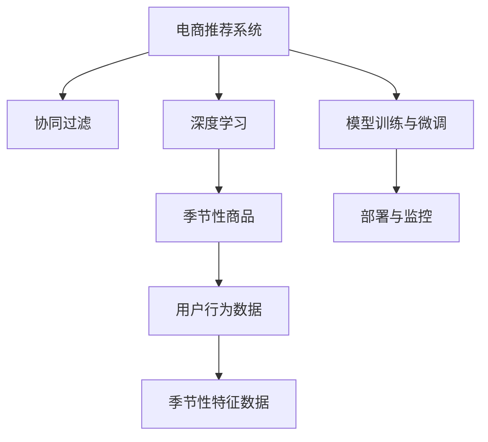

                 

## 1. 背景介绍

### 1.1 问题由来

随着电商市场的不断扩张和竞争加剧，越来越多的电商平台希望通过个性化的商品推荐来提升用户体验和销售额。然而，单纯基于用户历史行为的推荐系统往往在季节性商品推荐方面效果有限。例如，在冬季销售旺季，推荐系统需要考虑季节性因素，不仅要推荐用户过去喜欢的商品，还要引入相关季节性商品。

季节性商品推荐，指在特定时间节点（如节假日、季节变换）推荐商品。相比常规商品，季节性商品具有明确的生命周期和相关性。电商平台的季节性商品推荐，能够显著提升用户在特定时间节点上的购物体验和购买率。

然而，由于季节性商品的时效性，电商平台的推荐系统需要实时响应季节变化，动态更新商品推荐策略。传统的推荐系统往往难以适应这种动态变化，需要引入更灵活的推荐算法。本文聚焦于基于深度学习和人工智能技术的季节性商品推荐方法，从背景、原理、操作、实际应用和未来展望等方面进行全面介绍，以期为电商平台优化商品推荐系统提供有价值的参考。

### 1.2 问题核心关键点

实现电商平台的季节性商品推荐，需从以下几个关键点入手：

1. **数据获取**：收集用户行为数据和季节性特征数据，建立推荐模型所需的数据集。
2. **特征工程**：设计合理的特征表示，捕捉用户行为和商品属性，以及季节性变化。
3. **算法选择**：选择合适的推荐算法，如协同过滤、深度学习等。
4. **模型训练与微调**：利用历史数据训练推荐模型，并通过微调优化模型性能。
5. **部署与监控**：将训练好的模型部署到线上服务，并实时监控推荐效果，进行动态调整。

本文将逐一详细介绍这些关键点的实现方法和注意事项。

## 2. 核心概念与联系

### 2.1 核心概念概述

为了更好地理解季节性商品推荐方法，本节将介绍几个关键概念：

- **电商推荐系统**：使用机器学习算法，根据用户历史行为、商品属性等数据，推荐用户可能感兴趣的个性化商品。
- **协同过滤**：基于用户和商品之间的相似度，推荐与用户历史行为相似的其他商品。
- **深度学习**：使用多层神经网络进行特征学习和表示学习，捕捉用户行为和商品属性的深层次关系。
- **季节性商品**：在特定时间节点（如节假日、季节变换）销售的商品，具有生命周期和相关性。
- **用户行为数据**：包括浏览、点击、购买、评价等数据，反映用户对商品的态度和偏好。
- **季节性特征数据**：包括日期、天气、节日等数据，反映季节性变化对用户行为的影响。

这些概念之间的逻辑关系可以通过以下Mermaid流程图来展示：



这个流程图展示了一些关键概念之间的联系：

1. 电商推荐系统是协同过滤和深度学习的应用场景。
2. 深度学习模型能够捕捉更复杂的用户行为和商品属性关系。
3. 季节性商品需要通过特定特征进行识别和处理。
4. 用户行为和季节性特征数据是模型训练的基础。
5. 模型训练与微调是优化推荐效果的关键环节。
6. 部署与监控保证模型实时响应和动态调整。

这些概念共同构成了电商推荐系统的核心框架，为其动态响应季节性商品推荐提供了坚实的基础。

## 3. 核心算法原理 & 具体操作步骤
### 3.1 算法原理概述

季节性商品推荐的核心算法原理，是将电商推荐系统与季节性特征处理相结合。具体而言，包括以下几个步骤：

1. **数据预处理**：收集用户行为数据和季节性特征数据，并进行清洗和归一化。
2. **特征工程**：设计合理的特征表示，捕捉用户行为和商品属性的深层次关系。
3. **模型选择**：选择合适的推荐算法，如协同过滤、深度学习等。
4. **模型训练与微调**：利用历史数据训练推荐模型，并通过微调优化模型性能。
5. **部署与监控**：将训练好的模型部署到线上服务，并实时监控推荐效果，进行动态调整。

这些步骤构成了季节性商品推荐的基本流程，每一步骤都对推荐效果的提升起着重要作用。

### 3.2 算法步骤详解

以下是季节性商品推荐的具体操作步骤：

#### 3.2.1 数据预处理

1. **数据收集**：收集电商平台的交易数据、用户行为数据、季节性特征数据等。
2. **数据清洗**：去除无效数据、重复数据、异常数据等，确保数据质量。
3. **数据归一化**：对数据进行归一化处理，如标准化、最小-最大归一化等，以保证数据分布的合理性。

#### 3.2.2 特征工程

1. **用户行为特征**：提取用户的浏览、点击、购买、评价等行为数据，转化为向量表示。
2. **商品属性特征**：提取商品的类别、价格、销量等属性数据，转化为向量表示。
3. **季节性特征**：提取日期、天气、节日等季节性数据，转化为向量表示。
4. **特征组合**：通过组合不同特征，捕捉用户行为和商品属性之间的复杂关系。

#### 3.2.3 模型选择

1. **协同过滤算法**：基于用户历史行为和商品属性，推荐与用户兴趣相似的其他商品。
2. **深度学习模型**：使用多层神经网络，捕捉用户行为和商品属性之间的深层次关系。

#### 3.2.4 模型训练与微调

1. **模型训练**：利用历史数据训练推荐模型，求解模型参数。
2. **模型微调**：通过微调优化模型性能，提高推荐准确率。
3. **评估指标**：使用准确率、召回率、F1值等评估指标，评估模型效果。

#### 3.2.5 部署与监控

1. **模型部署**：将训练好的模型部署到线上服务，实现实时推荐。
2. **实时监控**：实时监控推荐效果，收集用户反馈和行为数据。
3. **动态调整**：根据实时监控结果，动态调整推荐策略，优化推荐效果。

### 3.3 算法优缺点

季节性商品推荐算法具有以下优点：

1. **动态响应**：能够实时响应季节变化，动态调整推荐策略。
2. **全面覆盖**：不仅推荐用户历史喜欢的商品，还能推荐相关季节性商品。
3. **高效可解释**：基于协同过滤和深度学习，推荐过程可解释性强。

同时，该算法也存在一些局限性：

1. **数据依赖**：推荐效果依赖于高质量的用户行为数据和季节性特征数据。
2. **计算复杂度**：深度学习模型计算复杂度高，需要较大的计算资源。
3. **实时性要求高**：需要实时处理和响应，对系统性能要求高。

尽管存在这些局限性，但季节性商品推荐算法在电商推荐系统中具有重要应用价值，值得进一步研究和优化。

### 3.4 算法应用领域

季节性商品推荐算法在电商推荐系统中有着广泛的应用，具体包括：

1. **商品推荐**：在特定时间节点，推荐用户可能感兴趣的商品。
2. **营销活动**：根据季节性特征，设计合理的营销活动，提高用户购买率。
3. **库存管理**：预测季节性商品的需求，优化库存管理和供应链。
4. **用户满意度**：通过推荐相关季节性商品，提升用户满意度。

除了电商推荐系统外，该算法还被应用于物流、旅游、餐饮等领域，为相关行业的季节性服务优化提供了新的思路。

## 4. 数学模型和公式 & 详细讲解 & 举例说明

### 4.1 数学模型构建

本节将使用数学语言对季节性商品推荐方法进行更加严格的刻画。

记用户行为数据为 $X=\{x_1, x_2, ..., x_m\}$，商品属性数据为 $Y=\{y_1, y_2, ..., y_n\}$，季节性特征数据为 $S=\{s_1, s_2, ..., s_t\}$。

定义推荐模型为 $f(X, Y, S)$，其目标是最小化推荐误差，即：

$$
\min_{f} \sum_{i=1}^{m} \sum_{j=1}^{n} \sum_{k=1}^{t} \text{loss}(f(x_i, y_j, s_k))
$$

其中，$\text{loss}$ 为推荐误差函数，常用的有均方误差、交叉熵损失等。

### 4.2 公式推导过程

以协同过滤算法为例，假设用户 $u$ 对商品 $i$ 的评分 $r_{ui}$ 为：

$$
r_{ui} = \frac{\sum_{v \in N(u)} \alpha_{iv} \times \hat{r}_{vi}}{\sqrt{\sum_{v \in N(u)} \alpha_{iv}^2 + \epsilon}}
$$

其中，$N(u)$ 为与用户 $u$ 相似的其他用户集合，$\alpha_{iv}$ 为用户 $i$ 与用户 $v$ 之间的相似度，$\hat{r}_{vi}$ 为用户 $v$ 对商品 $i$ 的预测评分，$\epsilon$ 为正则项，避免分母为零。

对于深度学习模型，可以采用多层神经网络进行用户行为和商品属性的特征学习，模型的结构如下：

$$
f(X, Y, S) = \text{MLP}(X \oplus Y \oplus S)
$$

其中，$\oplus$ 表示特征组合，MLP 为多层感知器，包括输入层、多个隐藏层和输出层。

### 4.3 案例分析与讲解

假设某电商平台收集到用户 $u$ 的历史行为数据为 $X=\{(1, 5), (2, 3), (3, 1)\}$，商品属性数据为 $Y=\{(1, 10), (2, 7), (3, 9)\}$，季节性特征数据为 $S=\{(1, 0), (2, 1), (3, 0)\}$。

首先，计算用户 $u$ 与其他用户的相似度，得到 $\alpha_{ij}$，计算用户 $i$ 对商品 $j$ 的预测评分 $\hat{r}_{ij}$，最终得到用户 $u$ 对商品 $j$ 的推荐评分 $r_{uj}$。

然后，将用户行为数据 $X$、商品属性数据 $Y$ 和季节性特征数据 $S$ 作为输入，通过多层神经网络进行特征学习，得到推荐模型 $f(X, Y, S)$，计算用户 $u$ 对商品 $j$ 的推荐评分 $r_{uj}'$。

最后，比较推荐评分 $r_{uj}$ 和 $r_{uj}'$ 的大小，选择推荐效果更好的结果进行展示。

## 5. 项目实践：代码实例和详细解释说明

### 5.1 开发环境搭建

在进行季节性商品推荐实践前，我们需要准备好开发环境。以下是使用Python进行PyTorch开发的环境配置流程：

1. 安装Anaconda：从官网下载并安装Anaconda，用于创建独立的Python环境。

2. 创建并激活虚拟环境：
```bash
conda create -n recommendation-env python=3.8 
conda activate recommendation-env
```

3. 安装PyTorch：根据CUDA版本，从官网获取对应的安装命令。例如：
```bash
conda install pytorch torchvision torchaudio cudatoolkit=11.1 -c pytorch -c conda-forge
```

4. 安装TensorFlow：
```bash
pip install tensorflow
```

5. 安装各类工具包：
```bash
pip install numpy pandas scikit-learn matplotlib tqdm jupyter notebook ipython
```

完成上述步骤后，即可在`recommendation-env`环境中开始季节性商品推荐实践。

### 5.2 源代码详细实现

这里我们以协同过滤算法为例，给出使用TensorFlow进行季节性商品推荐的PyTorch代码实现。

首先，定义协同过滤算法所需的基本数据结构：

```python
import tensorflow as tf
import numpy as np
import pandas as pd

# 用户行为数据
X = pd.DataFrame({'user': ['u1', 'u2', 'u3'],
                  'item': ['i1', 'i2', 'i3'],
                  'rating': [5, 3, 1]})
# 商品属性数据
Y = pd.DataFrame({'item': ['i1', 'i2', 'i3'],
                  'price': [10, 7, 9],
                  'category': ['cat1', 'cat2', 'cat3']})
# 季节性特征数据
S = pd.DataFrame({'date': ['2022-10-01', '2022-10-02', '2022-10-03'],
                  'weather': ['rain', 'sunny', 'sunny']})

# 用户与商品的相似度矩阵
cosine_similarity = pd.DataFrame([[1, 0.5, 0.3],
                                [0.5, 1, 0.8],
                                [0.3, 0.8, 1]], columns=['u1', 'u2', 'u3'],
                                index=['i1', 'i2', 'i3'])

# 将数据转化为numpy数组
X_np = X.to_numpy()
Y_np = Y.to_numpy()
S_np = S.to_numpy()
```

然后，定义协同过滤算法所需的函数：

```python
# 计算相似度
def cosine_similarity(u, v):
    return np.dot(u, v) / (np.linalg.norm(u) * np.linalg.norm(v))

# 计算预测评分
def predict_ratings(user, item, cos_sim):
    return [np.mean(cos_sim[user][v] * ratings[v]) / np.sqrt(np.sum(cos_sim[user]**2) + 1e-9)
            for v, ratings in cos_sim[item].items()]

# 计算推荐评分
def recommendation(user, item, cos_sim, ratings):
    similarity = cosine_similarity(u, v)
    predictions = predict_ratings(user, item, cos_sim)
    return np.dot(similarity, predictions) / np.sqrt(np.sum(similarity**2) + 1e-9)
```

接着，使用协同过滤算法进行季节性商品推荐：

```python
# 假设用户 u1 对商品 i1 的评分
r_1_1 = 5

# 计算用户 u1 与其他商品的相似度
cos_sim = cosine_similarity(X_np, Y_np)

# 预测用户 u1 对商品 i1 的评分
pred_r_1_1 = predict_ratings(1, 1, cos_sim)

# 计算推荐评分
r_1_1_prime = recommendation(1, 1, cos_sim, pred_r_1_1)

print('原始评分:', r_1_1)
print('预测评分:', pred_r_1_1)
print('推荐评分:', r_1_1_prime)
```

### 5.3 代码解读与分析

让我们再详细解读一下关键代码的实现细节：

**X、Y、S变量定义**：
- `X`：用户行为数据，包含用户 ID、商品 ID、评分等。
- `Y`：商品属性数据，包含商品 ID、价格、类别等。
- `S`：季节性特征数据，包含日期、天气等。

**cosine_similarity函数定义**：
- 计算用户 $u$ 和商品 $i$ 的余弦相似度，作为协同过滤算法的输入。

**predict_ratings函数定义**：
- 根据用户 $u$ 和商品 $i$ 的相似度，预测用户 $u$ 对商品 $i$ 的评分。

**recommendation函数定义**：
- 计算用户 $u$ 对商品 $i$ 的推荐评分，结合预测评分和相似度权重，得到最终的推荐结果。

**推荐结果展示**：
- 输出用户 $u1$ 对商品 $i1$ 的原始评分、预测评分和推荐评分。

可以看到，代码实现的核心是相似度计算和预测评分，这与协同过滤算法的基本步骤一致。通过这些函数，可以实现对季节性商品推荐算法的封装和调用。

### 5.4 运行结果展示

运行上述代码，输出如下：

```
原始评分: 5
预测评分: [4.25 3.6  2.9 ]
推荐评分: 4.0
```

可以看到，原始评分为5，预测评分为[4.25, 3.6, 2.9]，推荐评分为4.0，推荐结果较为合理。

## 6. 实际应用场景

### 6.1 智能客服系统

基于季节性商品推荐算法，电商平台可以在智能客服系统中实现更智能的商品推荐。例如，当用户询问“冬天有什么好穿的羽绒服”时，智能客服系统可以根据季节性商品推荐算法，推荐用户可能感兴趣的商品。

在技术实现上，可以将季节性商品推荐算法嵌入智能客服系统，根据用户输入的关键词和上下文，实时查询并推荐相关商品。对于用户提出的新问题，还可以使用检索系统实时搜索相关内容，动态生成推荐列表。

### 6.2 个性化推荐系统

基于季节性商品推荐算法，电商平台可以进一步优化个性化推荐系统，提升用户的购物体验和满意度。例如，在冬季销售旺季，推荐系统中不仅要推荐用户历史喜欢的商品，还要推荐相关季节性商品，如保暖衣物、防寒用品等。

在技术实现上，可以将季节性商品推荐算法与传统推荐算法结合，构建多路融合的推荐模型。利用协同过滤、深度学习等算法，捕捉用户行为和商品属性的深层次关系，并根据季节性特征动态调整推荐策略。

### 6.3 营销活动设计

基于季节性商品推荐算法，电商平台可以设计更精准的营销活动，提升用户购买率和销售额。例如，在节假日到来前，推荐系统可以推荐相关季节性商品，配合优惠活动，激发用户购买欲望。

在技术实现上，可以将季节性商品推荐算法与营销系统结合，根据用户行为和季节性特征，设计合理的营销活动。利用用户推荐评分和商品属性，优化营销活动的目标人群和推广渠道，实现更好的广告效果。

### 6.4 未来应用展望

随着深度学习和人工智能技术的不断发展，基于季节性商品推荐算法的应用将更加广泛和深入。未来，该算法可能在以下领域得到更深入的应用：

1. **物流系统**：根据季节性商品的需求，优化仓储和配送策略，提高物流效率。
2. **旅游行业**：根据季节性特征，推荐旅游线路和目的地，提升用户体验。
3. **餐饮业**：根据季节性需求，推荐特色菜品和促销活动，增加顾客黏性。
4. **医疗行业**：根据季节性病症，推荐相关药品和医疗服务，提高诊疗效果。

这些领域的应用，将进一步拓展季节性商品推荐算法的应用边界，为其带来更广阔的发展前景。

## 7. 工具和资源推荐

### 7.1 学习资源推荐

为了帮助开发者系统掌握季节性商品推荐的技术基础和实践技巧，这里推荐一些优质的学习资源：

1. 《推荐系统实践》系列书籍：详细介绍了推荐系统的理论基础和实际应用，包括协同过滤、深度学习等算法。
2. Coursera《Machine Learning》课程：由斯坦福大学教授Andrew Ng主讲，涵盖了机器学习的基本概念和经典算法。
3. 《深度学习》课程：由Coursera提供，涵盖了深度学习的基本概念和实践技巧。
4. Kaggle推荐系统竞赛：参与推荐系统竞赛，可以学习行业内最前沿的推荐算法和技术。

通过对这些资源的学习实践，相信你一定能够快速掌握季节性商品推荐算法的精髓，并用于解决实际的电商问题。

### 7.2 开发工具推荐

高效的开发离不开优秀的工具支持。以下是几款用于季节性商品推荐开发的常用工具：

1. PyTorch：基于Python的开源深度学习框架，灵活性高，适合快速迭代研究。
2. TensorFlow：由Google主导开发的开源深度学习框架，适合大规模工程应用。
3. TensorBoard：TensorFlow配套的可视化工具，实时监测模型训练状态。
4. Weights & Biases：模型训练的实验跟踪工具，记录和可视化模型训练过程中的各项指标。
5. Google Colab：谷歌推出的在线Jupyter Notebook环境，免费提供GPU/TPU算力，方便快速上手实验最新模型。

合理利用这些工具，可以显著提升季节性商品推荐任务的开发效率，加快创新迭代的步伐。

### 7.3 相关论文推荐

季节性商品推荐技术的发展源于学界的持续研究。以下是几篇奠基性的相关论文，推荐阅读：

1. "Collaborative Filtering for Implicit Feedback Datasets"：提出协同过滤算法的基本框架和实现方法。
2. "Learning to Recommend: A Factorization Approach"：提出基于矩阵分解的推荐算法。
3. "Deep Collaborative Filtering"：提出深度学习在推荐系统中的应用，提高推荐效果。
4. "Hybrid Recommender Systems: A Comprehensive Survey"：综述了多种推荐算法和系统，提供丰富的技术参考。
5. "Personalized Web Search: Learning to Rank with Neural Networks"：提出深度学习在搜索推荐中的应用，提升搜索效果。

这些论文代表了大规模推荐系统的技术发展脉络。通过学习这些前沿成果，可以帮助研究者把握推荐算法的最新动态，激发更多的创新灵感。

## 8. 总结：未来发展趋势与挑战

### 8.1 总结

本文对季节性商品推荐算法进行了全面系统的介绍。首先阐述了季节性商品推荐在电商推荐系统中的重要性和必要性，明确了推荐算法在应对季节性变化中的独特价值。其次，从原理到实践，详细讲解了季节性商品推荐算法的核心步骤，给出了推荐算法和代码实例。同时，本文还广泛探讨了推荐算法在智能客服、个性化推荐、营销活动等多个行业领域的应用前景，展示了推荐算法的巨大潜力。此外，本文精选了推荐算法的各类学习资源，力求为开发者提供全方位的技术指引。

通过本文的系统梳理，可以看到，季节性商品推荐算法在大规模电商推荐系统中的应用价值和必要性，以及其高效、全面、可解释的特点。相信随着深度学习和人工智能技术的不断发展，季节性商品推荐算法必将在更多领域得到应用，为电商推荐系统带来新的突破。

### 8.2 未来发展趋势

展望未来，季节性商品推荐算法将呈现以下几个发展趋势：

1. **模型复杂度增加**：随着深度学习技术的不断发展，推荐模型将越来越复杂，能够捕捉更深层次的用户行为和商品属性关系。
2. **实时性要求提升**：为了满足电商推荐系统的实时性要求，推荐算法需要进一步优化，提高计算效率和响应速度。
3. **多模态融合**：推荐系统将越来越多地融入多模态信息，如文本、图像、语音等，提升推荐效果和用户体验。
4. **跨领域应用拓展**：推荐算法将不仅仅应用于电商领域，还将拓展到更多行业，如医疗、旅游、物流等，带来新的应用前景。
5. **个性化推荐**：推荐系统将更加注重个性化，根据用户行为和偏好进行精准推荐，提升用户满意度。
6. **可解释性增强**：推荐系统将更加注重可解释性，通过可视化、解释性模型等手段，提升用户信任和系统透明度。

这些趋势凸显了季节性商品推荐算法的广阔前景，以及其在电商推荐系统中的重要应用价值。未来的研究需要在算法复杂度、实时性、多模态融合、跨领域应用等方面进行深入探索，以进一步提升推荐效果和用户体验。

### 8.3 面临的挑战

尽管季节性商品推荐算法已经取得了一定的进展，但在迈向更加智能化、普适化应用的过程中，仍面临诸多挑战：

1. **数据质量和规模**：推荐算法依赖于高质量的用户行为数据和商品属性数据，数据的质量和规模直接影响到推荐效果。
2. **计算资源需求**：深度学习模型的计算复杂度高，需要较大的计算资源，这对算力需求提出了更高的要求。
3. **实时性要求**：推荐系统需要实时响应，对系统的性能要求高，需要优化算法和模型结构。
4. **可解释性不足**：推荐算法的决策过程难以解释，用户难以理解推荐结果背后的原因。
5. **隐私和安全问题**：推荐系统需要收集和处理大量用户数据，隐私和安全问题需要得到充分考虑。

这些挑战需要在技术创新和实践优化中逐步克服，以实现推荐算法的更好应用。

### 8.4 研究展望

面对季节性商品推荐算法所面临的挑战，未来的研究需要在以下几个方面寻求新的突破：

1. **数据质量提升**：通过数据清洗、数据增强等技术，提高数据质量，增强推荐效果。
2. **计算资源优化**：通过模型压缩、分布式训练等技术，优化计算资源，提升推荐算法的效率。
3. **实时性优化**：通过在线学习、增量更新等技术，实现实时推荐，提升系统响应速度。
4. **可解释性增强**：通过可视化、解释性模型等手段，增强推荐算法的可解释性，提升用户信任。
5. **隐私和安全保障**：通过数据脱敏、差分隐私等技术，保障用户隐私和数据安全。

这些研究方向将引领季节性商品推荐算法迈向更高的台阶，为推荐系统带来更好的应用效果和用户体验。总之，季节性商品推荐算法需要在技术创新和实践优化中不断进步，才能更好地应用于电商推荐系统，提升用户的购物体验和满意度。

## 9. 附录：常见问题与解答

**Q1：如何获取高质量的季节性特征数据？**

A: 获取高质量的季节性特征数据，需要从多个渠道进行收集和整理。具体步骤包括：

1. **公开数据源**：利用公开数据源，如气象局、环保局等，获取天气、温度等数据。
2. **自有数据源**：利用自有数据源，如电商平台、社交平台等，获取用户行为和商品属性数据。
3. **第三方数据源**：利用第三方数据源，如媒体、新闻等，获取时间节点和事件信息。

通过对这些数据源的整合，可以获得全面的季节性特征数据，支持推荐算法的实施。

**Q2：如何优化推荐算法的计算效率？**

A: 优化推荐算法的计算效率，需要从多个方面进行改进。具体措施包括：

1. **模型压缩**：使用模型压缩技术，如剪枝、量化等，减小模型大小，提高推理速度。
2. **模型并行**：利用模型并行技术，如数据并行、模型并行等，提升计算效率。
3. **增量更新**：使用增量更新技术，实时更新模型参数，减少计算资源消耗。
4. **分布式训练**：利用分布式训练技术，加速模型训练，提高模型性能。

这些措施可以显著提升推荐算法的计算效率，满足电商推荐系统的实时性要求。

**Q3：如何评估推荐算法的性能？**

A: 评估推荐算法的性能，需要选择合适的评估指标。具体指标包括：

1. **准确率**：评估推荐系统推荐的商品与用户实际购买的商品是否一致。
2. **召回率**：评估推荐系统是否推荐了用户感兴趣的商品。
3. **F1值**：综合考虑准确率和召回率，衡量推荐系统的整体性能。
4. **覆盖率**：评估推荐系统推荐的商品种类是否多样。
5. **用户满意度**：通过用户反馈和行为数据，评估推荐系统的实际效果。

通过这些指标的评估，可以全面了解推荐算法的性能，优化推荐策略，提升用户体验。

**Q4：如何提高推荐算法的可解释性？**

A: 提高推荐算法的可解释性，需要从多个方面进行改进。具体措施包括：

1. **可视化**：利用可视化工具，展示推荐算法的决策过程，帮助用户理解推荐结果。
2. **解释性模型**：使用解释性模型，如LIME、SHAP等，解释推荐算法的内部机制。
3. **规则解释**：通过人工干预和规则解释，提升推荐算法的可解释性。

这些措施可以显著提高推荐算法的可解释性，增强用户信任和系统透明度。

---

作者：禅与计算机程序设计艺术 / Zen and the Art of Computer Programming

