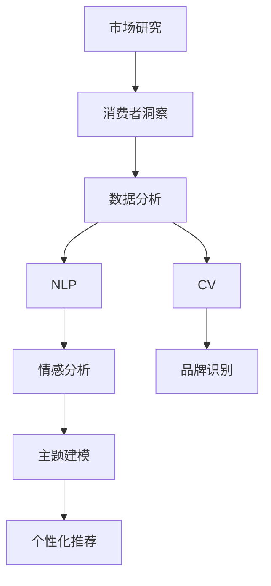

                 

# AI如何改变市场研究和消费者洞察

> 关键词：市场研究,消费者洞察,人工智能,数据分析,机器学习

## 1. 背景介绍

### 1.1 问题由来

市场研究和消费者洞察一直是企业了解市场动态、指导产品策略、优化营销效果的关键环节。传统上，市场研究依赖于问卷调查、访谈、焦点小组等手段，通过人工分析获取消费者的行为、态度、偏好等数据，进行市场细分和定位。然而，这些方法往往成本高、周期长、数据质量难以保证，且难以处理大规模、高维度的数据。

近年来，随着人工智能技术的飞速发展，尤其是深度学习、自然语言处理(NLP)、计算机视觉等技术的突破，AI在市场研究和消费者洞察领域的应用逐渐普及。AI技术不仅提高了数据处理的效率和精度，还提供了全新的分析视角和洞察能力，改变了传统市场研究的方法和工具。

### 1.2 问题核心关键点

AI改变市场研究和消费者洞察的核心在于其强大的数据处理能力和智能化分析能力。具体体现在以下几个方面：

- **大数据处理能力**：AI可以快速处理海量、高维度的数据，挖掘其中的隐含关系，提供更全面、深入的市场洞察。
- **智能化分析能力**：AI能够自动进行数据预处理、特征提取、建模分析等步骤，大大提升了分析的准确性和效率。
- **个性化推荐**：AI通过分析消费者行为和偏好，提供个性化的产品推荐和营销策略，提升用户体验和市场响应。
- **实时数据监测**：AI能够实时监测市场动态和消费者反馈，快速调整策略，提高市场竞争力。

通过这些优势，AI显著提高了市场研究和消费者洞察的效率和效果，为企业决策提供了更有力的支持。

## 2. 核心概念与联系

### 2.1 核心概念概述

为了更好地理解AI在市场研究和消费者洞察中的应用，本节将介绍几个关键概念：

- **市场研究**：通过调查、访谈等方式收集和分析市场数据，了解消费者行为、偏好、市场趋势等，为产品开发、市场定位、策略优化提供依据。
- **消费者洞察**：通过深入分析消费者数据，理解其需求、动机、情感等，指导产品设计和营销策略，提升品牌忠诚度和市场份额。
- **人工智能(AI)**：通过机器学习、深度学习等技术，赋予计算机自主学习和决策能力，解决复杂的数据分析和预测问题。
- **数据分析**：使用统计学、机器学习等方法，从数据中提取有用信息，揭示数据间的内在关系，进行预测和推断。
- **自然语言处理(NLP)**：使计算机能够理解、处理和生成人类语言，广泛应用于情感分析、主题建模等市场研究任务。
- **计算机视觉(CV)**：使计算机能够分析和理解图像和视频数据，广泛应用于产品推荐、品牌识别等消费者洞察任务。

这些概念之间的逻辑关系可以通过以下Mermaid流程图来展示：



这个流程图展示了几大核心概念之间的关系：

1. 市场研究是基础，通过数据分析挖掘消费者行为和市场趋势。
2. 数据分析使用机器学习和深度学习技术，处理高维数据。
3. NLP和CV技术分别用于分析文本和图像数据，提供进一步的洞察。
4. 情感分析、主题建模等任务通过NLP技术进行，辅助市场研究。
5. 品牌识别和个性化推荐则利用CV技术，提升消费者洞察的深度和广度。

这些概念共同构成了AI在市场研究和消费者洞察中的应用框架，使AI技术能够从数据中提取更丰富的信息，提升分析的智能化水平。

## 3. 核心算法原理 & 具体操作步骤
### 3.1 算法原理概述

AI在市场研究和消费者洞察中的应用，主要基于数据驱动和智能化分析两大核心原理。

- **数据驱动**：AI通过大量数据进行模型训练，学习数据间的隐含关系，进行预测和推断。
- **智能化分析**：AI利用机器学习算法进行数据处理和分析，自动发现数据中的模式和规律，提升分析的准确性和效率。

基于这两大原理，AI在市场研究和消费者洞察中的应用可以分为以下几个关键步骤：

1. **数据收集与预处理**：从各种渠道（如问卷调查、社交媒体、网站日志等）收集市场和消费者数据，并进行清洗、去重、归一化等预处理操作。
2. **特征提取**：使用NLP、CV等技术，从文本、图像数据中提取有用特征，如情感倾向、主题、品牌等。
3. **建模分析**：使用机器学习算法（如决策树、随机森林、深度学习等）进行建模分析，提取消费者的行为模式、偏好和动机。
4. **结果可视化**：将分析结果通过图表、报表等形式进行可视化，帮助决策者理解数据和洞察结果。

### 3.2 算法步骤详解

以下将详细介绍AI在市场研究和消费者洞察中的应用步骤：

**Step 1: 数据收集与预处理**

1. **数据来源**：选择合适的数据来源，包括问卷调查、社交媒体、网站日志、销售数据等。
2. **数据清洗**：对数据进行去重、填补缺失值、处理异常值等清洗操作，确保数据质量。
3. **数据归一化**：将不同格式和单位的数据归一化，使其具有可比性。

**Step 2: 特征提取**

1. **文本特征提取**：使用NLP技术，如TF-IDF、词嵌入等，将文本数据转化为高维特征向量。
2. **图像特征提取**：使用CV技术，如卷积神经网络(CNN)、特征图等，提取图像数据中的有用特征。
3. **综合特征表示**：将文本和图像特征进行综合，形成更全面的消费者洞察。

**Step 3: 建模分析**

1. **选择模型**：根据任务特点选择合适的机器学习模型，如K-means、LDA、SVM等。
2. **模型训练**：使用训练数据训练模型，并根据验证集性能进行调整。
3. **模型评估**：在测试集上评估模型性能，判断是否满足应用需求。

**Step 4: 结果可视化**

1. **数据可视化**：使用图表、热力图等形式，将分析结果直观展示。
2. **交互式分析**：开发交互式报表，允许用户对数据进行更深入的探索。
3. **数据报告**：编写详尽的数据报告，帮助决策者理解洞察结果，指导决策。

### 3.3 算法优缺点

AI在市场研究和消费者洞察中的应用具有以下优点：

- **高效性**：AI能够快速处理和分析大规模数据，提供实时分析能力。
- **全面性**：AI可以从多种数据源中提取信息，提供更全面、深入的市场和消费者洞察。
- **智能化**：AI能够自动进行数据处理和分析，提升分析的准确性和效率。

同时，AI也存在以下缺点：

- **数据质量依赖**：AI模型性能依赖于数据质量，低质量的数据可能导致误判。
- **模型复杂性**：复杂的AI模型可能难以解释，对数据科学家的要求较高。
- **成本高**：高质量AI模型的开发和部署成本较高，需要投入大量资源。

### 3.4 算法应用领域

AI在市场研究和消费者洞察中的应用领域非常广泛，涵盖以下几个关键领域：

- **市场细分**：通过分析消费者行为和偏好，进行市场细分，发现潜在的细分市场。
- **消费者画像**：基于消费者数据，构建详细的消费者画像，提供个性化的营销策略。
- **品牌管理**：利用NLP技术分析消费者对品牌的情感倾向，指导品牌策略调整。
- **产品推荐**：使用推荐系统算法，根据消费者历史行为进行个性化推荐，提升用户体验。
- **市场趋势分析**：利用时间序列分析等方法，预测市场趋势，指导企业决策。
- **竞争对手分析**：通过分析竞争对手的市场活动和消费者反馈，进行竞品分析。

这些应用领域展示了AI在市场研究和消费者洞察中的强大能力，为企业的市场决策提供了有力支持。

## 4. 数学模型和公式 & 详细讲解 & 举例说明

### 4.1 数学模型构建

本节将使用数学语言对AI在市场研究和消费者洞察中的应用进行严格刻画。

记市场研究数据集为 $D=\{(x_i,y_i)\}_{i=1}^N$，其中 $x_i$ 为市场特征向量， $y_i$ 为市场标签。目标是对市场趋势进行预测，模型 $M_{\theta}$ 的损失函数为：

$$
\mathcal{L}(\theta) = \frac{1}{N} \sum_{i=1}^N (y_i - M_{\theta}(x_i))^2
$$

其中，$M_{\theta}(x_i)$ 为模型对 $x_i$ 的预测，$\theta$ 为模型参数。

### 4.2 公式推导过程

以下将详细推导线性回归模型的损失函数及其梯度：

**线性回归模型**：
$$
M_{\theta}(x) = \theta_0 + \theta_1x_1 + \theta_2x_2 + \cdots + \theta_nx_n
$$

**损失函数**：
$$
\mathcal{L}(\theta) = \frac{1}{N} \sum_{i=1}^N (y_i - (\theta_0 + \theta_1x_{i1} + \theta_2x_{i2} + \cdots + \theta_nx_{in}))^2
$$

**梯度计算**：
$$
\frac{\partial \mathcal{L}(\theta)}{\partial \theta_j} = \frac{2}{N} \sum_{i=1}^N (y_i - M_{\theta}(x_i))x_{ij}
$$

### 4.3 案例分析与讲解

以下将以情感分析为例，展示AI在消费者洞察中的应用：

**案例背景**：一家电商公司希望了解用户对其产品的情感倾向，以便调整产品和营销策略。

**数据收集**：收集用户在电商网站上的评论数据，标注情感倾向为正面、负面或中性。

**特征提取**：使用NLP技术，提取评论中的情感词汇和短语，进行情感极性判断。

**建模分析**：使用情感分析模型，如情感词典、朴素贝叶斯等，预测用户情感倾向。

**结果分析**：对情感分析结果进行可视化展示，分析用户情感分布，指导产品改进和营销优化。

通过情感分析，电商公司可以深入了解用户的情感倾向，优化产品设计，提升用户满意度。

## 5. 项目实践：代码实例和详细解释说明
### 5.1 开发环境搭建

在进行AI应用开发前，我们需要准备好开发环境。以下是使用Python进行Keras开发的环境配置流程：

1. 安装Anaconda：从官网下载并安装Anaconda，用于创建独立的Python环境。

2. 创建并激活虚拟环境：
```bash
conda create -n keras-env python=3.8 
conda activate keras-env
```

3. 安装Keras：
```bash
pip install keras
```

4. 安装必要的库：
```bash
pip install numpy pandas scikit-learn matplotlib seaborn scikit-image
```

完成上述步骤后，即可在`keras-env`环境中开始AI应用的开发。

### 5.2 源代码详细实现

下面我们以情感分析为例，给出使用Keras库进行NLP任务开发的PyTorch代码实现。

首先，定义情感分析的数据处理函数：

```python
from keras.preprocessing.text import Tokenizer
from keras.preprocessing.sequence import pad_sequences
import numpy as np
import pandas as pd

def preprocess_text(texts, max_len=200):
    tokenizer = Tokenizer()
    tokenizer.fit_on_texts(texts)
    sequences = tokenizer.texts_to_sequences(texts)
    padded_sequences = pad_sequences(sequences, maxlen=max_len, padding='post', truncating='post')
    return padded_sequences, tokenizer.word_index
```

然后，定义模型和优化器：

```python
from keras.models import Sequential
from keras.layers import Embedding, LSTM, Dense
from keras.optimizers import Adam

vocab_size = 10000
embedding_dim = 128
lstm_units = 128

model = Sequential()
model.add(Embedding(vocab_size, embedding_dim, input_length=max_len))
model.add(LSTM(lstm_units))
model.add(Dense(1, activation='sigmoid'))
model.compile(loss='binary_crossentropy', optimizer=Adam(lr=0.001), metrics=['accuracy'])
```

接着，定义训练和评估函数：

```python
from keras.utils import to_categorical

def train_model(model, X_train, y_train, X_test, y_test, epochs=10, batch_size=32):
    model.fit(X_train, y_train, validation_data=(X_test, y_test), epochs=epochs, batch_size=batch_size)
    test_loss, test_accuracy = model.evaluate(X_test, y_test, verbose=0)
    print(f'Test accuracy: {test_accuracy:.4f}')

def evaluate_model(model, X_test, y_test):
    y_pred = model.predict(X_test)
    y_pred = (y_pred > 0.5).astype(int)
    return y_pred, y_test
```

最后，启动训练流程并在测试集上评估：

```python
# 加载数据
data = pd.read_csv('sentiment_data.csv')
texts = data['text'].tolist()
y = data['label'].tolist()

# 数据预处理
X_train, y_train = preprocess_text(texts[:800])
X_test, y_test = preprocess_text(texts[800:])

# 模型训练和评估
train_model(model, X_train, y_train, X_test, y_test)

# 测试结果
y_pred, y_test = evaluate_model(model, X_test, y_test)
```

以上就是使用Keras进行情感分析的完整代码实现。可以看到，Keras库提供了丰富的预训练模型和高效的数据处理工具，使得情感分析的代码实现变得简洁高效。

### 5.3 代码解读与分析

让我们再详细解读一下关键代码的实现细节：

**preprocess_text函数**：
- 定义了文本预处理函数，将文本转化为数值序列，并进行填充。
- 使用Tokenizer将文本分词，并转化为序列。
- 使用pad_sequences函数对序列进行填充，保证序列长度一致。
- 返回填充后的序列和词索引。

**模型定义**：
- 使用Sequential模型定义线性回归模型。
- 使用Embedding层将文本转化为向量。
- 使用LSTM层处理序列数据。
- 使用Dense层进行二分类输出。
- 编译模型，指定优化器和学习率。

**训练和评估函数**：
- 使用train_model函数进行模型训练，指定训练集、验证集、迭代次数和批大小。
- 使用evaluate_model函数评估模型性能，返回预测结果和真实标签。

**训练流程**：
- 加载数据集，将文本和标签分离。
- 对训练集和测试集进行预处理。
- 调用train_model函数进行模型训练。
- 调用evaluate_model函数评估模型性能。

可以看出，Keras提供了简单易用的API，大大降低了AI应用的开发门槛。通过合理的代码组织和函数复用，AI模型的开发可以变得高效、简洁。

## 6. 实际应用场景
### 6.1 电商推荐系统

电商推荐系统是AI在消费者洞察中的经典应用。通过分析消费者的浏览、购买历史，推荐系统可以提供个性化的产品推荐，提升用户体验和转化率。

**推荐模型**：
- **协同过滤**：基于用户和物品的评分矩阵，进行推荐。
- **内容过滤**：根据产品属性和用户偏好，进行推荐。
- **深度学习**：使用RNN、CNN等深度学习模型，提取用户行为和产品特征。

**推荐流程**：
- **用户画像**：分析用户历史行为，构建用户画像。
- **产品推荐**：根据用户画像和产品特征，使用推荐算法生成推荐结果。
- **效果评估**：评估推荐效果，优化推荐策略。

电商推荐系统已经成为电商平台的标配，通过AI技术，电商公司可以更好地了解用户需求，提升销售业绩。

### 6.2 市场趋势预测

市场趋势预测是AI在市场研究中的应用之一。通过分析历史数据，AI可以预测市场发展趋势，指导企业决策。

**预测模型**：
- **时间序列模型**：如ARIMA、LSTM等，用于预测时间序列数据。
- **回归模型**：如线性回归、随机森林等，用于预测数值型数据。

**预测流程**：
- **数据收集**：收集市场相关数据，如销售数据、价格数据、行业报告等。
- **数据预处理**：清洗、归一化、特征提取等。
- **模型训练**：选择合适的模型，进行训练。
- **效果评估**：评估模型预测效果，优化预测模型。

市场趋势预测可以帮助企业提前预判市场变化，制定更为合理的战略规划。

### 6.3 社交媒体情感分析

社交媒体情感分析是AI在消费者洞察中的另一重要应用。通过分析用户在社交媒体上的言论，了解消费者对品牌的情感倾向，指导品牌策略调整。

**情感分析模型**：
- **情感词典**：基于情感词典进行情感分类。
- **深度学习**：使用LSTM、BERT等模型进行情感分析。

**情感分析流程**：
- **数据收集**：收集社交媒体数据，如微博、Twitter等。
- **数据预处理**：清洗、去重、分词等。
- **模型训练**：选择合适的模型，进行训练。
- **效果评估**：评估模型情感分类效果，优化模型。

社交媒体情感分析可以帮助企业了解消费者对品牌的真实感受，优化品牌形象和营销策略。

### 6.4 未来应用展望

随着AI技术的不断进步，其在市场研究和消费者洞察中的应用前景将更加广阔。未来，AI将在以下几个方向继续深化应用：

- **多模态分析**：结合文本、图像、视频等多模态数据，进行更全面的消费者洞察。
- **实时分析**：实时处理和分析数据，提供动态的消费者洞察。
- **个性化推荐**：基于消费者的动态行为数据，进行实时推荐。
- **跨领域应用**：将AI技术应用于更多行业，如金融、医疗、教育等。
- **自动化流程**：自动化数据处理和分析流程，降低人工成本。

这些趋势展示了AI在市场研究和消费者洞察中的强大潜力，未来将为企业决策提供更为全面、深入的洞察支持。

## 7. 工具和资源推荐
### 7.1 学习资源推荐

为了帮助开发者系统掌握AI在市场研究和消费者洞察中的应用，这里推荐一些优质的学习资源：

1. **《深度学习》教材**：斯坦福大学Andrew Ng教授的深度学习课程，系统介绍了深度学习的基本概念和经典模型。
2. **Kaggle**：数据科学竞赛平台，提供大量开源数据集和竞赛，帮助你实践和学习AI技术。
3. **Coursera**：在线教育平台，提供大量与AI相关的课程，涵盖从入门到高级的内容。
4. **Keras官方文档**：Keras库的官方文档，提供详细的API文档和样例代码，帮助你快速上手。
5. **TensorFlow官方文档**：TensorFlow框架的官方文档，提供丰富的模型和工具库，支持深度学习和AI应用开发。

通过对这些资源的学习实践，相信你一定能够快速掌握AI在市场研究和消费者洞察中的应用，并用于解决实际的商业问题。

### 7.2 开发工具推荐

高效的开发离不开优秀的工具支持。以下是几款用于AI应用开发的常用工具：

1. **Jupyter Notebook**：开源的交互式笔记本环境，支持Python代码编写和结果展示。
2. **TensorBoard**：TensorFlow配套的可视化工具，实时监测模型训练状态，提供丰富的图表展示。
3. **Weka**：开源的机器学习工具，提供丰富的算法库和可视化界面，支持数据预处理和建模分析。
4. **PyTorch**：基于Python的深度学习框架，提供灵活的动态计算图和丰富的预训练模型。
5. **Hadoop**：大数据处理框架，支持大规模数据的存储和处理。

合理利用这些工具，可以显著提升AI应用的开发效率，加快创新迭代的步伐。

### 7.3 相关论文推荐

AI在市场研究和消费者洞察中的应用源于学界的持续研究。以下是几篇奠基性的相关论文，推荐阅读：

1. **《深度学习》教材**：深度学习领域的经典教材，系统介绍了深度学习的理论基础和应用。
2. **《情感分析：一种基于深度学习的方法》**：介绍使用深度学习模型进行情感分析的方法和技术。
3. **《协同过滤推荐系统》**：介绍协同过滤推荐系统的基本原理和算法。
4. **《实时市场趋势分析》**：介绍使用时间序列模型进行市场趋势预测的方法。
5. **《多模态情感分析》**：介绍使用多模态数据进行情感分析的方法。

这些论文代表了大规模数据处理和智能化分析的发展脉络。通过学习这些前沿成果，可以帮助研究者把握学科前进方向，激发更多的创新灵感。

## 8. 总结：未来发展趋势与挑战

### 8.1 总结

本文对AI在市场研究和消费者洞察中的应用进行了全面系统的介绍。首先阐述了AI在市场研究和消费者洞察中的应用背景和意义，明确了AI在数据处理和智能化分析方面的独特价值。其次，从原理到实践，详细讲解了AI在市场研究和消费者洞察中的应用步骤，给出了AI应用的完整代码实例。同时，本文还广泛探讨了AI在电商推荐、市场趋势预测、社交媒体情感分析等多个行业领域的应用前景，展示了AI技术的强大潜力。此外，本文精选了AI应用开发的各类学习资源，力求为读者提供全方位的技术指引。

通过本文的系统梳理，可以看到，AI在市场研究和消费者洞察中的应用正在成为行业的重要趋势，极大地提高了数据处理的效率和分析的智能化水平，为企业的决策提供了有力支持。未来，伴随AI技术的不断进步，其在市场研究和消费者洞察中的应用前景将更加广阔，为经济社会发展注入新的动力。

### 8.2 未来发展趋势

展望未来，AI在市场研究和消费者洞察中的应用将呈现以下几个发展趋势：

1. **智能化水平提升**：随着深度学习、强化学习等技术的不断进步，AI的智能化水平将进一步提升，提供更精准、个性化的市场和消费者洞察。
2. **多模态分析普及**：结合文本、图像、视频等多模态数据，进行更全面的消费者洞察。
3. **实时分析能力增强**：实时处理和分析数据，提供动态的市场和消费者洞察。
4. **跨领域应用拓展**：将AI技术应用于更多行业，如金融、医疗、教育等。
5. **自动化流程优化**：自动化数据处理和分析流程，降低人工成本。
6. **自适应学习**：AI模型能够自动学习和适应新的市场和消费者动态，提升市场响应速度。

这些趋势展示了AI在市场研究和消费者洞察中的强大潜力，未来将为企业的决策提供更为全面、深入的洞察支持。

### 8.3 面临的挑战

尽管AI在市场研究和消费者洞察中的应用已经取得了显著进展，但在迈向更加智能化、普适化应用的过程中，它仍面临着诸多挑战：

1. **数据质量问题**：数据质量是AI模型性能的基石，低质量的数据可能导致误判。需要采用数据清洗、特征提取等技术，提升数据质量。
2. **模型复杂性**：复杂的AI模型可能难以解释，对数据科学家的要求较高。需要开发更易解释、可理解的学习模型。
3. **计算资源需求**：高质量AI模型的开发和部署需要大量计算资源，硬件成本较高。需要探索资源优化技术，如模型裁剪、量化加速等。
4. **隐私保护**：消费者数据隐私保护是AI应用的重要挑战，需要在数据使用和处理过程中保护用户隐私。
5. **算法偏见**：AI模型可能学习到数据中的偏见，导致歧视性输出。需要开发公平、公正的算法，消除模型偏见。

正视这些挑战，积极应对并寻求突破，将是大规模数据处理和智能化分析走向成熟的必由之路。相信随着学界和产业界的共同努力，这些挑战终将一一被克服，AI在市场研究和消费者洞察中的应用前景将更加广阔。

### 8.4 研究展望

面对AI在市场研究和消费者洞察中所面临的种种挑战，未来的研究需要在以下几个方面寻求新的突破：

1. **数据预处理技术**：探索更高效的数据清洗、特征提取技术，提升数据质量。
2. **模型解释性**：开发更易解释、可理解的学习模型，增强AI模型的透明度。
3. **资源优化**：探索模型裁剪、量化加速等技术，优化计算资源需求。
4. **隐私保护**：开发数据隐私保护技术，确保用户数据安全。
5. **公平算法**：开发公平、公正的算法，消除模型偏见，提升模型性能。
6. **跨领域应用**：将AI技术应用于更多行业，推动AI技术在更广泛的领域落地。

这些研究方向的探索，将引领AI在市场研究和消费者洞察中走向更高的台阶，为构建智能化的决策支持系统铺平道路。面向未来，AI在市场研究和消费者洞察中的应用需要与其他技术协同发力，共同推动自然语言理解和智能交互系统的进步。只有勇于创新、敢于突破，才能不断拓展AI技术的边界，让智能技术更好地造福人类社会。

## 9. 附录：常见问题与解答

**Q1：AI在市场研究和消费者洞察中能否实现实时分析？**

A: 是的，AI可以实现实时分析。通过使用流处理框架，如Apache Kafka、Apache Flink等，可以实时处理和分析市场和消费者数据，提供动态的洞察结果。

**Q2：AI在市场研究和消费者洞察中面临的最大挑战是什么？**

A: AI在市场研究和消费者洞察中面临的最大挑战是数据质量和模型偏见问题。低质量的数据可能导致误判，复杂的模型可能难以解释，偏见模型则可能产生歧视性输出。需要通过数据清洗、特征提取、公平算法等技术，克服这些挑战。

**Q3：AI在市场研究和消费者洞察中的优势是什么？**

A: AI在市场研究和消费者洞察中的优势在于其强大的数据处理能力和智能化分析能力。AI能够快速处理和分析大规模数据，提供实时分析能力，挖掘数据中的隐含关系，提升分析的准确性和效率。

**Q4：AI在市场研究和消费者洞察中的应用场景有哪些？**

A: AI在市场研究和消费者洞察中的应用场景非常广泛，涵盖电商推荐、市场趋势预测、社交媒体情感分析等多个领域。通过AI技术，企业可以更好地了解市场动态和消费者需求，提升决策水平和市场竞争力。

**Q5：AI在市场研究和消费者洞察中的局限性是什么？**

A: AI在市场研究和消费者洞察中的局限性主要在于数据质量和模型偏见问题。低质量的数据可能导致误判，复杂的模型可能难以解释，偏见模型则可能产生歧视性输出。此外，AI模型的开发和部署成本较高，需要投入大量计算资源和人力资源。

总之，AI在市场研究和消费者洞察中的应用前景广阔，但也面临着数据质量、模型复杂性、计算资源需求等诸多挑战。只有在不断克服这些挑战的过程中，AI技术才能更好地服务于市场研究和消费者洞察，推动企业决策的科学化和智能化。

