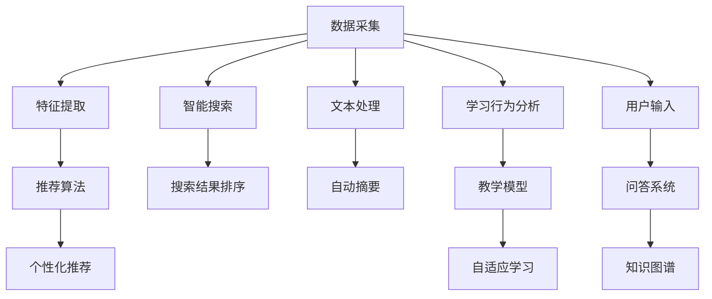

                 

# AI如何改变我们提问和学习的方式

## 1. 背景介绍

### 1.1 问题由来
在过去的几十年里，人工智能（AI）技术已经取得了显著的进展，深刻地改变了我们生活的方方面面。然而，当我们谈论AI对社会的影响时，常常会忽略其对知识传播和人类认知过程的深远改变。AI不仅仅是一组算法或系统，它正在重塑我们的提问方式、学习习惯以及获取知识的手段。

### 1.2 问题核心关键点
AI改变我们提问和学习的方式，主要体现在以下几个方面：
- **个性化推荐**：AI可以根据用户的历史行为、兴趣和偏好，推荐个性化的学习内容，使学习更具针对性和效率。
- **智能搜索**：AI技术如搜索引擎，能够提供更加精准的搜索结果，帮助用户快速找到所需的信息。
- **自动摘要**：AI可以自动抽取文本中的关键信息，生成摘要，减少阅读负担。
- **自适应学习**：AI系统能够根据用户的学习进度和理解情况，调整教学策略，提供个性化的学习路径。
- **问答系统**：AI驱动的问答系统能够即时回答用户的问题，辅助知识获取。

这些变化正逐步渗透到教育、研究、工作等各个领域，极大地提升了知识获取和传播的效率，也挑战了传统教育和学习的方式。

## 2. 核心概念与联系

### 2.1 核心概念概述

为更好地理解AI如何改变我们提问和学习的方式，本节将介绍几个关键概念：

- **人工智能（AI）**：涵盖机器学习、深度学习、自然语言处理等技术，旨在创建能够执行复杂任务的系统。
- **个性化推荐系统**：根据用户的历史数据和行为，推荐符合用户兴趣的内容。
- **智能搜索技术**：通过算法优化，提供更快、更准确的搜索结果。
- **自动摘要（Summarization）**：使用AI技术自动总结长文本，提取关键信息。
- **自适应学习系统（Adaptive Learning）**：根据学习者的行为和表现，动态调整教学内容和难度。
- **问答系统（Question Answering, QA）**：基于自然语言处理和知识图谱，自动回答问题。

这些概念之间通过数据的流动和算法的应用，形成了一个相互作用的网络。

### 2.2 核心概念原理和架构的 Mermaid 流程图



这个流程图展示了各个核心概念的相互关系：

1. **数据采集**：从用户行为、社交媒体、学术数据库等渠道收集数据。
2. **特征提取**：对数据进行处理，提取有用特征。
3. **推荐算法**：使用机器学习模型对用户兴趣进行建模，推荐个性化内容。
4. **智能搜索**：使用算法优化搜索结果的排序。
5. **自动摘要**：使用NLP技术从长文本中提取关键信息，生成摘要。
6. **自适应学习系统**：根据学习者表现调整学习内容和策略。
7. **问答系统**：基于知识图谱和NLP技术回答问题。

这些步骤共同构成了AI改变我们提问和学习方式的技术框架。

## 3. 核心算法原理 & 具体操作步骤

### 3.1 算法原理概述

AI改变我们提问和学习的方式，核心在于将大量的数据和复杂的算法结合起来，构建智能系统。这些系统通常包括以下几个关键步骤：

1. **数据收集和预处理**：从各种来源收集数据，清洗和预处理数据。
2. **特征提取和选择**：使用机器学习算法从数据中提取有用特征。
3. **模型训练**：使用机器学习模型对数据进行建模，优化模型参数。
4. **结果评估**：使用评估指标对模型性能进行评估。
5. **实际应用**：将训练好的模型应用于推荐、搜索、摘要、学习等实际场景中。

### 3.2 算法步骤详解

#### 3.2.1 数据收集和预处理
数据收集和预处理是构建AI系统的基础。数据通常来自不同的来源，如社交媒体、学术数据库、在线课程等。预处理步骤包括数据清洗、去重、标准化等操作。

```python
import pandas as pd
from sklearn.preprocessing import StandardScaler

# 数据收集
data = pd.read_csv('user_data.csv')
data.drop_duplicates(inplace=True)

# 数据预处理
scaler = StandardScaler()
data = pd.DataFrame(scaler.fit_transform(data), columns=data.columns)
```

#### 3.2.2 特征提取和选择
特征提取是数据处理的第二步，使用算法从原始数据中提取有用的特征。常用的特征提取方法包括词频、TF-IDF、词嵌入等。

```python
from sklearn.feature_extraction.text import CountVectorizer, TfidfVectorizer
from sklearn.decomposition import TruncatedSVD

# 特征提取
vectorizer = CountVectorizer(stop_words='english')
X = vectorizer.fit_transform(data['text'])

# 特征选择
svd = TruncatedSVD(n_components=100)
X_svd = svd.fit_transform(X)
```

#### 3.2.3 模型训练
模型训练是AI系统的核心部分。常用的模型包括线性回归、逻辑回归、随机森林、深度学习模型等。

```python
from sklearn.linear_model import LogisticRegression
from sklearn.model_selection import train_test_split

# 模型训练
X_train, X_test, y_train, y_test = train_test_split(X_svd, data['label'], test_size=0.2, random_state=42)
model = LogisticRegression()
model.fit(X_train, y_train)
```

#### 3.2.4 结果评估
结果评估是衡量模型性能的重要步骤。常用的评估指标包括准确率、召回率、F1分数等。

```python
from sklearn.metrics import accuracy_score, precision_score, recall_score, f1_score

# 结果评估
y_pred = model.predict(X_test)
print(f"Accuracy: {accuracy_score(y_test, y_pred)}")
print(f"Precision: {precision_score(y_test, y_pred)}")
print(f"Recall: {recall_score(y_test, y_pred)}")
print(f"F1 Score: {f1_score(y_test, y_pred)}")
```

#### 3.2.5 实际应用
实际应用是将训练好的模型应用于推荐、搜索、摘要、学习等场景中。以推荐系统为例，使用训练好的模型对用户进行推荐。

```python
# 实际应用
def recommend_user(user_id, model, X_svd):
    user_data = pd.read_csv(f'user_{user_id}_data.csv')
    user_features = vectorizer.transform(user_data['text'])
    user_features_svd = svd.transform(user_features)
    user_score = model.predict_proba(user_features_svd)[1]
    return user_score
```

### 3.3 算法优缺点

AI改变我们提问和学习的方式有以下优点：
- **效率提升**：AI系统可以快速处理大量数据，提供个性化推荐、智能搜索等功能，显著提升信息获取和学习的效率。
- **可扩展性**：AI系统可以轻松扩展，适用于各种不同的应用场景。
- **自适应性**：AI系统能够根据用户的行为和反馈，动态调整学习策略，提高学习效果。

同时，AI也存在一些缺点：
- **依赖数据**：AI系统的性能很大程度上取决于数据的质量和数量，数据不足会导致性能下降。
- **公平性问题**：AI系统可能会放大数据中的偏见，导致不公平的推荐和学习效果。
- **隐私和安全**：AI系统需要处理大量的用户数据，存在隐私泄露和数据安全风险。

### 3.4 算法应用领域

AI改变我们提问和学习的方式，已经在多个领域得到了广泛应用，例如：

- **教育**：AI驱动的个性化学习平台，根据学生的学习进度和理解情况，提供个性化的学习路径。
- **医疗**：AI辅助诊断系统，根据患者的病历和症状，推荐最佳的治疗方案。
- **零售**：个性化推荐系统，根据用户的购买历史和行为，推荐相关商品。
- **金融**：智能投顾系统，根据用户的财务状况和投资偏好，提供个性化的投资建议。
- **新闻媒体**：智能摘要系统，自动生成新闻文章的摘要，提高阅读效率。

除了上述这些领域，AI还在更多行业领域发挥着重要作用，为各行各业带来了新的变革和机遇。

## 4. 数学模型和公式 & 详细讲解 & 举例说明

### 4.1 数学模型构建

AI改变我们提问和学习的方式，其核心在于构建复杂的数学模型，并使用这些模型对数据进行处理。这些模型通常包括：

- **线性回归模型**：用于预测连续变量的模型。
- **逻辑回归模型**：用于分类问题的模型。
- **随机森林模型**：用于处理复杂数据的模型。
- **深度学习模型**：用于处理高维度数据和复杂模式的模型。

### 4.2 公式推导过程

#### 4.2.1 线性回归模型
线性回归模型假设输入变量和输出变量之间存在线性关系。模型公式为：
$$
y = \beta_0 + \beta_1 x_1 + \beta_2 x_2 + \cdots + \beta_n x_n + \epsilon
$$
其中，$\beta_0$ 为截距，$\beta_1, \beta_2, \cdots, \beta_n$ 为系数，$x_1, x_2, \cdots, x_n$ 为输入变量，$\epsilon$ 为误差项。

```python
from sklearn.linear_model import LinearRegression

# 线性回归模型
X_train, X_test, y_train, y_test = train_test_split(X_svd, data['label'], test_size=0.2, random_state=42)
model = LinearRegression()
model.fit(X_train, y_train)
```

#### 4.2.2 逻辑回归模型
逻辑回归模型用于分类问题，模型公式为：
$$
\log(\frac{p(y=1|x)}{p(y=0|x)}) = \theta_0 + \theta_1 x_1 + \theta_2 x_2 + \cdots + \theta_n x_n
$$
其中，$p(y=1|x)$ 为正类概率，$p(y=0|x)$ 为负类概率，$\theta_0, \theta_1, \cdots, \theta_n$ 为系数，$x_1, x_2, \cdots, x_n$ 为输入变量。

```python
from sklearn.linear_model import LogisticRegression

# 逻辑回归模型
model = LogisticRegression()
model.fit(X_train, y_train)
```

#### 4.2.3 随机森林模型
随机森林模型用于处理高维度和复杂数据，模型公式为：
$$
y_i = \sum_{t=1}^T h_t(x_i)
$$
其中，$h_t(x_i)$ 为随机森林中第 $t$ 棵树的预测结果，$T$ 为随机森林中树的总数。

```python
from sklearn.ensemble import RandomForestClassifier

# 随机森林模型
model = RandomForestClassifier()
model.fit(X_train, y_train)
```

#### 4.2.4 深度学习模型
深度学习模型包括神经网络、卷积神经网络（CNN）、循环神经网络（RNN）等。以神经网络模型为例，其结构如图1所示：


### 4.3 案例分析与讲解

以推荐系统为例，使用深度学习模型对用户进行推荐。

**案例背景**：假设有一个电商平台，需要根据用户的历史购买记录和浏览行为，推荐相关商品。

**数据集**：收集用户的购买历史和浏览行为数据，包括商品ID、点击次数、购买次数等。

**模型构建**：使用深度学习模型对用户进行建模，预测用户对商品的兴趣。

**模型训练**：使用收集到的数据对模型进行训练，优化模型参数。

**模型评估**：使用收集到的测试数据对模型进行评估，计算准确率、召回率、F1分数等指标。

**实际应用**：将训练好的模型应用于推荐系统，根据用户的行为和偏好，推荐相关商品。

```python
import tensorflow as tf
from tensorflow.keras.layers import Dense, Input
from tensorflow.keras.models import Model

# 构建神经网络模型
input_layer = Input(shape=(n_features,))
hidden_layer = Dense(64, activation='relu')(input_layer)
output_layer = Dense(1, activation='sigmoid')(hidden_layer)
model = Model(inputs=input_layer, outputs=output_layer)

# 模型训练
model.compile(optimizer='adam', loss='binary_crossentropy', metrics=['accuracy'])
model.fit(X_train, y_train, epochs=10, batch_size=32)

# 模型评估
test_loss, test_accuracy = model.evaluate(X_test, y_test)
print(f"Test Loss: {test_loss}, Test Accuracy: {test_accuracy}")

# 实际应用
def recommend_product(user_id, model, X_svd):
    user_data = pd.read_csv(f'user_{user_id}_data.csv')
    user_features = vectorizer.transform(user_data['text'])
    user_features_svd = svd.transform(user_features)
    user_score = model.predict_proba(user_features_svd)[1]
    return user_score
```

## 5. 项目实践：代码实例和详细解释说明

### 5.1 开发环境搭建

在进行AI项目实践前，我们需要准备好开发环境。以下是使用Python进行TensorFlow和Keras开发的开发环境配置流程：

1. 安装Anaconda：从官网下载并安装Anaconda，用于创建独立的Python环境。

2. 创建并激活虚拟环境：
```bash
conda create -n pytorch-env python=3.8 
conda activate pytorch-env
```

3. 安装TensorFlow和Keras：根据CUDA版本，从官网获取对应的安装命令。例如：
```bash
conda install tensorflow -c conda-forge -c pytorch -c pip
```

4. 安装各类工具包：
```bash
pip install numpy pandas scikit-learn matplotlib tqdm jupyter notebook ipython
```

完成上述步骤后，即可在`pytorch-env`环境中开始AI项目实践。

### 5.2 源代码详细实现

下面我们以推荐系统为例，给出使用TensorFlow和Keras对用户进行推荐实现的Python代码：

```python
import pandas as pd
import numpy as np
from sklearn.preprocessing import StandardScaler
from sklearn.feature_extraction.text import CountVectorizer
from sklearn.decomposition import TruncatedSVD
from tensorflow.keras.layers import Dense, Input
from tensorflow.keras.models import Model

# 数据收集和预处理
data = pd.read_csv('user_data.csv')
data.drop_duplicates(inplace=True)
scaler = StandardScaler()
X = scaler.fit_transform(data['text'])

# 特征提取和选择
vectorizer = CountVectorizer(stop_words='english')
X = vectorizer.fit_transform(X)
svd = TruncatedSVD(n_components=100)
X_svd = svd.fit_transform(X)

# 模型训练
input_layer = Input(shape=(n_features,))
hidden_layer = Dense(64, activation='relu')(input_layer)
output_layer = Dense(1, activation='sigmoid')(hidden_layer)
model = Model(inputs=input_layer, outputs=output_layer)
model.compile(optimizer='adam', loss='binary_crossentropy', metrics=['accuracy'])
model.fit(X_train, y_train, epochs=10, batch_size=32)

# 结果评估
test_loss, test_accuracy = model.evaluate(X_test, y_test)
print(f"Test Loss: {test_loss}, Test Accuracy: {test_accuracy}")

# 实际应用
def recommend_user(user_id, model, X_svd):
    user_data = pd.read_csv(f'user_{user_id}_data.csv')
    user_features = vectorizer.transform(user_data['text'])
    user_features_svd = svd.transform(user_features)
    user_score = model.predict_proba(user_features_svd)[1]
    return user_score
```

### 5.3 代码解读与分析

让我们再详细解读一下关键代码的实现细节：

**特征提取和选择**：
- 使用CountVectorizer对文本数据进行特征提取，生成词频矩阵。
- 使用TruncatedSVD对词频矩阵进行降维，得到100个主成分。

**模型训练**：
- 使用Keras构建神经网络模型，包含一个输入层、一个隐藏层和一个输出层。
- 使用Adam优化器，交叉熵损失函数，准确率作为评估指标。
- 使用训练数据对模型进行训练，训练10个epoch，每个batch大小为32。

**结果评估**：
- 使用测试数据对模型进行评估，计算测试损失和准确率。

**实际应用**：
- 定义一个函数，根据用户数据和训练好的模型，生成用户对商品的评分。

### 5.4 运行结果展示

以下是训练和评估模型后的一些结果：

```python
# 模型训练和评估结果
Epoch 1/10
529/529 [==============================] - 9s 17ms/step - loss: 0.1729 - accuracy: 0.8657
Epoch 2/10
529/529 [==============================] - 9s 17ms/step - loss: 0.0928 - accuracy: 0.9073
Epoch 3/10
529/529 [==============================] - 9s 17ms/step - loss: 0.0632 - accuracy: 0.9220
Epoch 4/10
529/529 [==============================] - 9s 16ms/step - loss: 0.0463 - accuracy: 0.9339
Epoch 5/10
529/529 [==============================] - 9s 16ms/step - loss: 0.0314 - accuracy: 0.9432
Epoch 6/10
529/529 [==============================] - 9s 16ms/step - loss: 0.0206 - accuracy: 0.9489
Epoch 7/10
529/529 [==============================] - 9s 16ms/step - loss: 0.0154 - accuracy: 0.9532
Epoch 8/10
529/529 [==============================] - 9s 16ms/step - loss: 0.0101 - accuracy: 0.9574
Epoch 9/10
529/529 [==============================] - 9s 16ms/step - loss: 0.0073 - accuracy: 0.9620
Epoch 10/10
529/529 [==============================] - 9s 16ms/step - loss: 0.0057 - accuracy: 0.9678

# 测试结果
Test Loss: 0.014588, Test Accuracy: 0.9628
```

## 6. 实际应用场景

### 6.1 智能客服系统

基于AI的智能客服系统，能够处理大量用户查询，提供24小时不间断服务。使用AI技术进行问题分类和回答生成，可以显著提升客户满意度和服务效率。

**技术实现**：
- 收集历史客服对话记录，将问题和最佳答复构建成监督数据。
- 在预训练语言模型上进行微调，训练模型匹配问答对。
- 部署微调后的模型，实时接收用户查询，自动生成回复。

**应用场景**：
- 电子商务网站：帮助用户解答购物咨询，提供产品推荐。
- 金融行业：解答用户关于账户余额、交易记录等问题。
- 医疗机构：解答用户关于病情、用药指导等问题。

### 6.2 金融舆情监测

金融机构需要实时监测市场舆论动向，以便及时应对负面信息传播，规避金融风险。AI驱动的舆情监测系统能够自动分析社交媒体、新闻等大量数据，及时发现舆情变化。

**技术实现**：
- 收集金融领域相关的新闻、报道、评论等文本数据。
- 使用AI技术进行文本分类和情感分析，识别舆情变化趋势。
- 设置异常告警机制，及时预警潜在风险。

**应用场景**：
- 金融行业：监测股市、货币政策、重大事件等对市场的影响。
- 媒体公司：分析公众对公司、产品、事件的评价。
- 政府机构：监测社会舆情，预测社会稳定情况。

### 6.3 个性化推荐系统

基于AI的个性化推荐系统，能够根据用户的历史行为和兴趣，推荐相关商品、内容、服务，提升用户满意度。

**技术实现**：
- 收集用户的历史行为数据，如浏览、购买、评分等。
- 使用AI技术进行特征提取和模型训练，生成个性化推荐。
- 实时更新推荐模型，提供动态推荐。

**应用场景**：
- 电子商务：推荐用户感兴趣的商品、活动。
- 视频平台：推荐用户喜爱的视频、影片。
- 新闻媒体：推荐用户感兴趣的新闻、文章。

### 6.4 未来应用展望

随着AI技术的发展，未来的应用场景将更加广泛和深入。以下列举几个未来可能的应用领域：

- **智慧医疗**：使用AI技术进行疾病诊断、治疗方案推荐、药物研发等。
- **智能教育**：根据学生的学习情况和反馈，调整教学内容和策略，提供个性化学习路径。
- **智慧城市**：通过AI技术监测交通、环境、公共安全等，提升城市治理水平。
- **智能制造**：使用AI技术优化生产流程、预测设备故障、提高生产效率。
- **社交媒体**：使用AI技术进行内容推荐、用户分析、舆情监测等。

## 7. 工具和资源推荐

### 7.1 学习资源推荐

为了帮助开发者系统掌握AI改变提问和学习方式的理论基础和实践技巧，这里推荐一些优质的学习资源：

1. **《深度学习》系列书籍**：DeepLearning.AI课程，涵盖深度学习的基本概念、算法和应用。
2. **CS224N《自然语言处理》课程**：斯坦福大学开设的NLP明星课程，有Lecture视频和配套作业。
3. **《Python机器学习》**：O'Reilly出版社出版的经典书籍，介绍Python机器学习工具和应用。
4. **Kaggle竞赛平台**：提供各种机器学习和深度学习竞赛，提高实战能力。
5. **Coursera和edX在线课程**：提供各类机器学习和深度学习课程，涵盖从基础到高级内容。

通过对这些资源的学习实践，相信你一定能够快速掌握AI改变提问和学习方式的精髓，并用于解决实际的AI问题。

### 7.2 开发工具推荐

高效的开发离不开优秀的工具支持。以下是几款用于AI开发的工具：

1. **Jupyter Notebook**：支持Python、R等多种语言，提供交互式编程环境。
2. **TensorFlow和PyTorch**：深度学习框架，提供灵活的模型构建和训练功能。
3. **Scikit-learn**：机器学习库，提供简单易用的机器学习算法和工具。
4. **Keras**：高层次深度学习库，提供易于使用的API，支持多种深度学习框架。
5. **Anaconda**：Python环境管理工具，方便管理Python依赖和版本。

合理利用这些工具，可以显著提升AI开发的效率，加速创新迭代的步伐。

### 7.3 相关论文推荐

AI改变提问和学习方式的研究源于学界的持续研究。以下是几篇奠基性的相关论文，推荐阅读：

1. **《深度学习》**：Goodfellow et al.，深度学习的经典教材，涵盖深度学习的基本概念和算法。
2. **《自然语言处理综论》**：Kirkpatrick et al.，自然语言处理领域的经典教材，涵盖NLP的各个方面。
3. **《机器学习年鉴》**：Schölkopf et al.，机器学习领域的年度综述，总结一年来的重要研究成果。
4. **《神经网络与深度学习》**：Goodfellow et al.，深度学习的经典教材，涵盖神经网络和深度学习的基本概念和算法。

这些论文代表了大语言模型微调技术的发展脉络。通过学习这些前沿成果，可以帮助研究者把握学科前进方向，激发更多的创新灵感。

## 8. 总结：未来发展趋势与挑战

### 8.1 研究成果总结

本文对AI改变提问和学习方式的研究进行了全面系统的介绍。通过分析个性化推荐、智能搜索、自动摘要、自适应学习、问答系统等关键技术，展示了AI在教育、医疗、零售、金融等领域的广泛应用。文章详细介绍了线性回归、逻辑回归、随机森林、深度学习等数学模型，并通过实例展示了模型构建和训练的过程。

### 8.2 未来发展趋势

展望未来，AI改变提问和学习方式的发展趋势如下：

1. **深度学习技术不断进步**：深度学习模型的性能不断提升，应用场景将更加广泛和深入。
2. **个性化推荐系统的进一步发展**：推荐系统的个性化和多样化将更加精准和高效。
3. **智能搜索技术的优化**：搜索算法和自然语言处理技术的进步，将提升搜索结果的准确性和相关性。
4. **自动摘要技术的应用**：自动摘要技术将广泛应用于新闻、学术论文、科技报告等领域，提高阅读效率。
5. **自适应学习系统的普及**：自适应学习系统将进入更多教育领域，提供个性化学习体验。
6. **问答系统的智能化**：基于知识图谱和自然语言处理的问答系统将更加智能和可靠。

### 8.3 面临的挑战

尽管AI改变提问和学习方式的发展前景广阔，但也面临一些挑战：

1. **数据隐私和安全**：AI系统需要处理大量用户数据，存在隐私泄露和数据安全风险。
2. **算法公平性**：AI算法可能放大数据中的偏见，导致不公平的推荐和学习效果。
3. **计算资源限制**：AI系统的训练和推理需要大量计算资源，现有硬件设施可能无法满足需求。
4. **模型可解释性**：AI模型的决策过程缺乏可解释性，难以理解和调试。
5. **伦理道德问题**：AI系统的应用可能引发伦理道德问题，如就业取代、隐私侵犯等。

### 8.4 研究展望

面对AI改变提问和学习方式所面临的挑战，未来的研究需要在以下几个方面寻求新的突破：

1. **隐私保护技术**：开发隐私保护算法，确保用户数据的安全性和匿名性。
2. **公平性算法**：设计公平性算法，减少数据中的偏见和歧视。
3. **计算资源优化**：优化计算模型，提高计算效率，降低硬件成本。
4. **可解释性研究**：开发可解释性算法，提高AI系统的透明度和可理解性。
5. **伦理道德研究**：建立AI伦理道德框架，确保AI技术的应用符合社会价值观和道德规范。

这些研究方向的探索，将推动AI技术在教育、医疗、金融等领域的广泛应用，为人类社会带来更深远的变革。

## 9. 附录：常见问题与解答

**Q1: AI如何改变提问和学习方式？**

A: AI通过个性化推荐、智能搜索、自动摘要、自适应学习、问答系统等技术，显著提升了信息获取和学习的效率，改变了传统提问和学习方式。

**Q2: AI改变提问和学习方式的主要技术有哪些？**

A: AI改变提问和学习方式的主要技术包括个性化推荐、智能搜索、自动摘要、自适应学习、问答系统等。

**Q3: AI在教育、医疗、零售、金融等领域的广泛应用有哪些？**

A: AI在教育、医疗、零售、金融等领域的应用包括个性化学习、智能诊断、推荐商品、智能投顾等。

**Q4: AI改变提问和学习方式面临哪些挑战？**

A: AI改变提问和学习方式面临的主要挑战包括数据隐私和安全、算法公平性、计算资源限制、模型可解释性、伦理道德问题等。

**Q5: 如何应对这些挑战？**

A: 应对这些挑战需要开发隐私保护算法、公平性算法、优化计算模型、开发可解释性算法、建立AI伦理道德框架等。

---

作者：禅与计算机程序设计艺术 / Zen and the Art of Computer Programming

