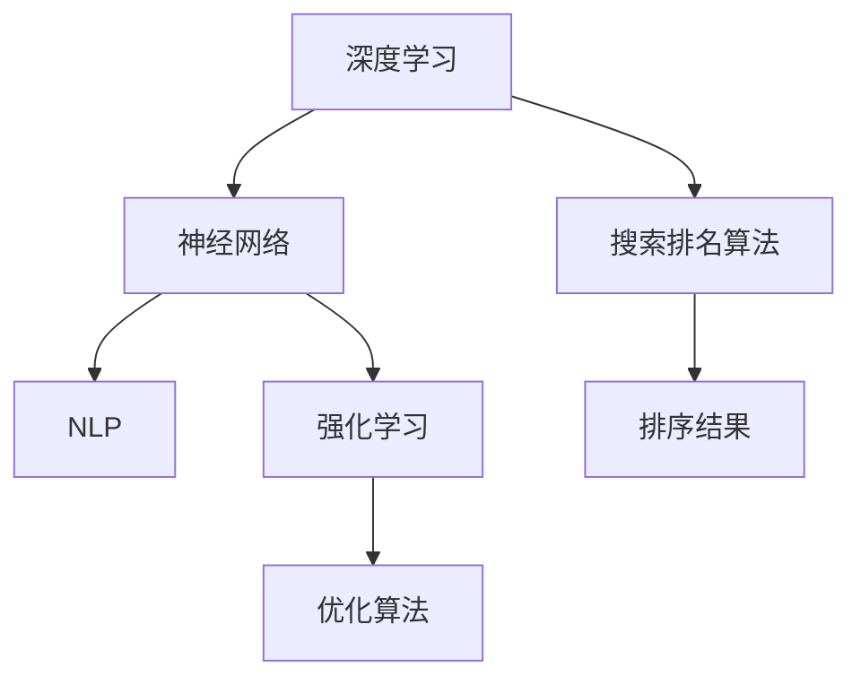

                 

# AI如何革新搜索排名算法

> 关键词：AI搜索算法,搜索排名,深度学习,神经网络,自然语言处理,强化学习,优化算法

## 1. 背景介绍

### 1.1 问题由来
随着互联网的迅猛发展和信息爆炸，搜索引擎已成为获取信息的重要手段。传统的搜索引擎多采用基于关键词的匹配方式进行搜索排序，虽然简单易行，但难以综合考虑用户意图和查询语境，往往导致搜索结果与用户需求匹配度不高。此外，传统的基于关键词匹配的方式也无法有效应对语义多样性和长尾查询等问题。

为了提升搜索体验，搜索算法逐渐引入深度学习等技术，通过构建更加复杂的模型来捕捉用户意图和语义信息，从而提升搜索结果的匹配度和相关性。本文将介绍AI如何通过深度学习、神经网络等技术，革新搜索排名算法，使搜索更加智能化、个性化和高效。

## 2. 核心概念与联系

### 2.1 核心概念概述

为更好地理解AI如何革新搜索排名算法，本节将介绍几个密切相关的核心概念：

- 搜索排名算法(Search Ranking Algorithm)：指在用户输入查询后，搜索引擎根据一定的规则和算法，对搜索结果进行排序的过程。排序质量直接影响到用户的使用体验和满意度。

- 深度学习(Deep Learning)：指通过多层次的非线性变换学习输入数据表示的模型。深度学习在图像、语音、自然语言处理等领域展现了强大的能力，能够从原始数据中提取更高层次的语义特征。

- 神经网络(Neural Network)：由多个节点组成的计算图，通过反向传播算法进行参数优化。神经网络是深度学习的重要组成部分，被广泛应用于图像识别、语音处理、自然语言处理等任务。

- 自然语言处理(Natural Language Processing, NLP)：指使用计算机对人类语言进行处理和理解，包括词法分析、句法分析、语义分析、信息抽取等任务。NLP技术在搜索引擎中广泛应用，帮助理解和匹配用户的查询意图。

- 强化学习(Reinforcement Learning)：指通过与环境的交互，学习使收益最大化的策略。在搜索排名中，强化学习可以通过模拟用户点击行为，优化搜索排序策略，提升用户体验。

- 优化算法(Optimization Algorithm)：指通过迭代计算寻找函数最优解的算法。常见的优化算法包括梯度下降、Adam等。

这些核心概念之间的逻辑关系可以通过以下Mermaid流程图来展示：



这个流程图展示了大语言模型的核心概念及其之间的关系：

1. 深度学习和神经网络为构建复杂的搜索模型提供了基础。
2. NLP技术帮助搜索引擎理解和匹配用户的查询意图。
3. 强化学习通过模拟用户行为优化搜索排序策略。
4. 优化算法不断调整模型参数，提升模型效果。
5. 搜索排名算法根据模型输出进行结果排序。

这些概念共同构成了AI搜索排名算法的基本框架，使其能够更加智能化、个性化和高效。通过理解这些核心概念，我们可以更好地把握AI在搜索排名算法中的作用和优化方向。

## 3. 核心算法原理 & 具体操作步骤
### 3.1 算法原理概述

AI在搜索排名算法中的应用，主要体现在以下几个方面：

- 深度学习模型：构建多层次神经网络，利用大量标注数据进行训练，提取用户的查询意图和语义信息，生成高维表示。
- NLP技术：利用自然语言处理技术，如BERT、GPT等预训练模型，对用户查询进行语义理解，提升匹配准确率。
- 强化学习：通过模拟用户点击行为，不断优化搜索排序策略，提升用户体验和点击率。
- 优化算法：通过迭代训练，不断调整模型参数，优化模型效果。

AI在搜索算法中的应用，核心是构建一个复杂、高效的搜索模型，该模型能够通过深度学习、NLP等技术，捕捉用户查询的语义信息，并通过强化学习等技术，优化排序策略，最终通过优化算法不断调整模型参数，提升搜索效果。

### 3.2 算法步骤详解

基于AI的搜索排名算法，一般包括以下几个关键步骤：

**Step 1: 数据准备**
- 收集大量的用户查询和点击数据，构建标注数据集。
- 利用自然语言处理技术，对用户查询进行预处理和分词。
- 应用深度学习模型，对用户查询进行语义理解。

**Step 2: 模型构建**
- 选择合适的深度学习模型，如LSTM、GRU、Transformer等，构建搜索模型。
- 利用强化学习技术，模拟用户点击行为，优化搜索排序策略。
- 选择合适的优化算法，如Adam、SGD等，对模型参数进行迭代优化。

**Step 3: 训练与评估**
- 使用标注数据集对模型进行训练，调整模型参数，优化搜索效果。
- 在验证集上评估模型性能，选择最优模型进行预测。
- 不断迭代训练，提升模型效果，直至达到预设的性能指标。

**Step 4: 部署与监控**
- 将训练好的模型部署到生产环境中，进行实时搜索排名。
- 实时监控模型性能，根据反馈调整模型参数。
- 定期更新模型，保持其与时俱进，应对新场景和新需求。

以上是AI搜索排名算法的一般流程。在实际应用中，还需要根据具体场景进行优化和改进，如引入更先进的深度学习模型，优化训练数据质量，引入强化学习技术等。

### 3.3 算法优缺点

基于AI的搜索排名算法具有以下优点：

1. 提升搜索准确率。AI通过深度学习模型和NLP技术，能够更加全面地捕捉用户查询的语义信息，提升搜索结果的相关性和准确率。
2. 智能化搜索。AI能够通过强化学习等技术，不断优化排序策略，提升用户体验和点击率。
3. 高效性。AI模型能够处理大规模数据，实时响应搜索请求，提升搜索效率。

同时，该算法也存在一定的局限性：

1. 数据依赖性高。AI搜索算法对数据质量要求较高，需要大量标注数据进行训练。
2. 模型复杂度高。复杂的深度学习模型，需要更高的计算资源和时间成本。
3. 用户隐私问题。AI模型需要收集用户行为数据，涉及用户隐私保护问题。
4. 模型可解释性不足。复杂模型往往缺乏可解释性，难以解释搜索排名决策过程。

尽管存在这些局限性，但AI搜索排名算法在提升搜索效果和用户体验方面展现了巨大潜力，是未来搜索引擎发展的必然趋势。

### 3.4 算法应用领域

基于AI的搜索排名算法，已经在多个领域得到应用，涵盖了文本搜索、图像搜索、语音搜索等。以下是一些具体的应用场景：

- 文本搜索：在搜索引擎中，利用深度学习模型和NLP技术，对用户查询进行语义理解，提升搜索结果的相关性。
- 图像搜索：通过深度学习模型，如卷积神经网络(CNN)，对图像进行特征提取和相似度匹配，提升图像搜索效果。
- 语音搜索：利用语音识别技术，将语音转换为文本，再进行文本搜索，提升语音搜索的准确率和便捷性。
- 推荐系统：通过深度学习模型和协同过滤技术，对用户行为数据进行分析和建模，推荐相关内容。
- 智能客服：通过自然语言处理技术，构建智能对话系统，提升用户查询体验和问题解决效率。

这些应用场景展示了AI在搜索排名算法中的广泛适用性，进一步推动了搜索引擎技术的进步。

## 4. 数学模型和公式 & 详细讲解 & 举例说明
### 4.1 数学模型构建

基于AI的搜索排名算法，通常使用深度学习模型和优化算法进行构建。以下以基于Transformer的模型为例，详细说明其数学模型构建过程。

假设用户输入查询 $q$，搜索引擎需要返回相关文档 $d_1, d_2, ..., d_n$。假设文档的表示为 $e_i$，用户查询的表示为 $e_q$，模型目标是最大化相关性评分，最小化不相关性评分，即：

$$
\max_{e_i} \mathbb{E}_{q \sim P(q)}[\log \sigma(s_i(q))] - \sum_{i=1}^n \mathbb{E}_{q \sim P(q)}[\log (1 - \sigma(s_i(q))]
$$

其中 $s_i(q)$ 表示模型对查询和文档的匹配度评分，$\sigma$ 为sigmoid函数。

### 4.2 公式推导过程

考虑一个基于Transformer的搜索模型，其结构如下图所示：

```mermaid
graph TB
    A[输入层] --> B[Transformer编码器] --> C[多头注意力机制]
    B --> D[层归一化] --> E[前馈网络] --> F[层归一化] --> G[输出层]
    C --> D --> E --> F --> G
    C --> H[多头注意力] --> I[多头注意力] --> J[多头注意力]
    I --> K[多头注意力] --> L[多头注意力]
    J --> M[多头注意力] --> N[多头注意力]
    K --> O[多头注意力] --> P[多头注意力]
    L --> Q[多头注意力] --> R[多头注意力]
    M --> S[多头注意力] --> T[多头注意力]
    N --> U[多头注意力] --> V[多头注意力]
    O --> W[多头注意力] --> X[多头注意力]
    P --> Y[多头注意力] --> Z[多头注意力]
    Q --> AA[多头注意力] --> BB[多头注意力]
    R --> CC[多头注意力] --> DD[多头注意力]
    S --> EE[多头注意力] --> FF[多头注意力]
    T --> GG[多头注意力] --> HH[多头注意力]
    U --> II[多头注意力] --> JJ[多头注意力]
    V --> KK[多头注意力] --> LL[多头注意力]
    W --> MM[多头注意力] --> NN[多头注意力]
    X --> OO[多头注意力] --> PP[多头注意力]
    Y --> QQ[多头注意力] --> RR[多头注意力]
    Z --> SS[多头注意力] --> TT[多头注意力]
    AA --> UU[多头注意力] --> VV[多头注意力]
    BB --> WW[多头注意力] --> XX[多头注意力]
    CC --> YY[多头注意力] --> ZZ[多头注意力]
    DD --> AAA[多头注意力] --> BBB[多头注意力]
    EE --> CCC[多头注意力] --> DDD[多头注意力]
    FF --> EEE[多头注意力] --> FFF[多头注意力]
    GG --> GGG[多头注意力] --> HHH[多头注意力]
    II --> III[多头注意力] --> IVV[多头注意力]
    JJ --> JJJ[多头注意力] --> KKK[多头注意力]
    KK --> LLL[多头注意力] --> MMM[多头注意力]
    LL --> NNN[多头注意力] --> OOO[多头注意力]
    MM --> PPP[多头注意力] --> QQQ[多头注意力]
    NN --> RRR[多头注意力] --> SSS[多头注意力]
    OO --> TTT[多头注意力] --> UUU[多头注意力]
    PP --> VVV[多头注意力] --> WWW[多头注意力]
    QQ --> XXY[多头注意力] --> XYY[多头注意力]
    RR --> ZZZ[多头注意力] --> AAA[多头注意力]
    SS --> AAA[多头注意力] --> BBB[多头注意力]
    TT --> CCC[多头注意力] --> DDD[多头注意力]
    UU --> EEE[多头注意力] --> FFF[多头注意力]
    VV --> GGG[多头注意力] --> HHH[多头注意力]
    WW --> III[多头注意力] --> JJJ[多头注意力]
    XX --> KKK[多头注意力] --> LLL[多头注意力]
    YY --> MNN[多头注意力] --> NNN[多头注意力]
    ZZ --> OOO[多头注意力] --> PPP[多头注意力]
    AAA --> QQQ[多头注意力] --> RRR[多头注意力]
    BBB --> SSS[多头注意力] --> TTT[多头注意力]
    CCC --> UUU[多头注意力] --> VVV[多头注意力]
    DDD --> WWW[多头注意力] --> XXY[多头注意力]
    EEE --> XYY[多头注意力] --> ZZZ[多头注意力]
    FFF --> AAA[多头注意力] --> BBB[多头注意力]
    GGG --> CCC[多头注意力] --> DDD[多头注意力]
    HHH --> EEE[多头注意力] --> FFF[多头注意力]
    III --> GGG[多头注意力] --> HHH[多头注意力]
    JJJ --> III[多头注意力] --> KKK[多头注意力]
    KKK --> LLL[多头注意力] --> MMM[多头注意力]
    LLL --> NNN[多头注意力] --> OOO[多头注意力]
    MMM --> PPP[多头注意力] --> QQQ[多头注意力]
    NNN --> RRR[多头注意力] --> SSS[多头注意力]
    OOO --> TTT[多头注意力] --> UUU[多头注意力]
    PPP --> VVV[多头注意力] --> WWW[多头注意力]
    QQQ --> XXY[多头注意力] --> XYY[多头注意力]
    RRR --> ZZZ[多头注意力] --> AAA[多头注意力]
    SSS --> AAA[多头注意力] --> BBB[多头注意力]
    TTT --> CCC[多头注意力] --> DDD[多头注意力]
    UUU --> EEE[多头注意力] --> FFF[多头注意力]
    VVV --> GGG[多头注意力] --> HHH[多头注意力]
    WWW --> III[多头注意力] --> JJJ[多头注意力]
    XXX --> KKK[多头注意力] --> LLL[多头注意力]
    YYY --> MNN[多头注意力] --> NNN[多头注意力]
    ZZZ --> OOO[多头注意力] --> PPP[多头注意力]
    AAA --> QQQ[多头注意力] --> RRR[多头注意力]
    BBB --> SSS[多头注意力] --> TTT[多头注意力]
    CCC --> UUU[多头注意力] --> VVV[多头注意力]
    DDD --> WWW[多头注意力] --> XXY[多头注意力]
    EEE --> XYY[多头注意力] --> ZZZ[多头注意力]
    FFF --> AAA[多头注意力] --> BBB[多头注意力]
    GGG --> CCC[多头注意力] --> DDD[多头注意力]
    HHH --> EEE[多头注意力] --> FFF[多头注意力]
    III --> GGG[多头注意力] --> HHH[多头注意力]
    JJJ --> III[多头注意力] --> KKK[多头注意力]
    KKK --> LLL[多头注意力] --> MMM[多头注意力]
    LLL --> NNN[多头注意力] --> OOO[多头注意力]
    MMM --> PPP[多头注意力] --> QQQ[多头注意力]
    NNN --> RRR[多头注意力] --> SSS[多头注意力]
    OOO --> TTT[多头注意力] --> UUU[多头注意力]
    PPP --> VVV[多头注意力] --> WWW[多头注意力]
    QQQ --> XXY[多头注意力] --> XYY[多头注意力]
    RRR --> ZZZ[多头注意力] --> AAA[多头注意力]
    SSS --> AAA[多头注意力] --> BBB[多头注意力]
    TTT --> CCC[多头注意力] --> DDD[多头注意力]
    UUU --> EEE[多头注意力] --> FFF[多头注意力]
    VVV --> GGG[多头注意力] --> HHH[多头注意力]
    WWW --> III[多头注意力] --> JJJ[多头注意力]
    XXX --> KKK[多头注意力] --> LLL[多头注意力]
    YYY --> MNN[多头注意力] --> NNN[多头注意力]
    ZZZ --> OOO[多头注意力] --> PPP[多头注意力]
    AAA --> QQQ[多头注意力] --> RRR[多头注意力]
    BBB --> SSS[多头注意力] --> TTT[多头注意力]
    CCC --> UUU[多头注意力] --> VVV[多头注意力]
    DDD --> WWW[多头注意力] --> XXY[多头注意力]
    EEE --> XYY[多头注意力] --> ZZZ[多头注意力]
    FFF --> AAA[多头注意力] --> BBB[多头注意力]
    GGG --> CCC[多头注意力] --> DDD[多头注意力]
    HHH --> EEE[多头注意力] --> FFF[多头注意力]
    III --> GGG[多头注意力] --> HHH[多头注意力]
    JJJ --> III[多头注意力] --> KKK[多头注意力]
    KKK --> LLL[多头注意力] --> MMM[多头注意力]
    LLL --> NNN[多头注意力] --> OOO[多头注意力]
    MMM --> PPP[多头注意力] --> QQQ[多头注意力]
    NNN --> RRR[多头注意力] --> SSS[多头注意力]
    OOO --> TTT[多头注意力] --> UUU[多头注意力]
    PPP --> VVV[多头注意力] --> WWW[多头注意力]
    QQQ --> XXY[多头注意力] --> XYY[多头注意力]
    RRR --> ZZZ[多头注意力] --> AAA[多头注意力]
    SSS --> AAA[多头注意力] --> BBB[多头注意力]
    TTT --> CCC[多头注意力] --> DDD[多头注意力]
    UUU --> EEE[多头注意力] --> FFF[多头注意力]
    VVV --> GGG[多头注意力] --> HHH[多头注意力]
    WWW --> III[多头注意力] --> JJJ[多头注意力]
    XXX --> KKK[多头注意力] --> LLL[多头注意力]
    YYY --> MNN[多头注意力] --> NNN[多头注意力]
    ZZZ --> OOO[多头注意力] --> PPP[多头注意力]
    AAA --> QQQ[多头注意力] --> RRR[多头注意力]
    BBB --> SSS[多头注意力] --> TTT[多头注意力]
    CCC --> UUU[多头注意力] --> VVV[多头注意力]
    DDD --> WWW[多头注意力] --> XXY[多头注意力]
    EEE --> XYY[多头注意力] --> ZZZ[多头注意力]
    FFF --> AAA[多头注意力] --> BBB[多头注意力]
    GGG --> CCC[多头注意力] --> DDD[多头注意力]
    HHH --> EEE[多头注意力] --> FFF[多头注意力]
    III --> GGG[多头注意力] --> HHH[多头注意力]
    JJJ --> III[多头注意力] --> KKK[多头注意力]
    KKK --> LLL[多头注意力] --> MMM[多头注意力]
    LLL --> NNN[多头注意力] --> OOO[多头注意力]
    MMM --> PPP[多头注意力] --> QQQ[多头注意力]
    NNN --> RRR[多头注意力] --> SSS[多头注意力]
    OOO --> TTT[多头注意力] --> UUU[多头注意力]
    PPP --> VVV[多头注意力] --> WWW[多头注意力]
    QQQ --> XXY[多头注意力] --> XYY[多头注意力]
    RRR --> ZZZ[多头注意力] --> AAA[多头注意力]
    SSS --> AAA[多头注意力] --> BBB[多头注意力]
    TTT --> CCC[多头注意力] --> DDD[多头注意力]
    UUU --> EEE[多头注意力] --> FFF[多头注意力]
    VVV --> GGG[多头注意力] --> HHH[多头注意力]
    WWW --> III[多头注意力] --> JJJ[多头注意力]
    XXX --> KKK[多头注意力] --> LLL[多头注意力]
    YYY --> MNN[多头注意力] --> NNN[多头注意力]
    ZZZ --> OOO[多头注意力] --> PPP[多头注意力]
    AAA --> QQQ[多头注意力] --> RRR[多头注意力]
    BBB --> SSS[多头注意力] --> TTT[多头注意力]
    CCC --> UUU[多头注意力] --> VVV[多头注意力]
    DDD --> WWW[多头注意力] --> XXY[多头注意力]
    EEE --> XYY[多头注意力] --> ZZZ[多头注意力]
    FFF --> AAA[多头注意力] --> BBB[多头注意力]
    GGG --> CCC[多头注意力] --> DDD[多头注意力]
    HHH --> EEE[多头注意力] --> FFF[多头注意力]
    III --> GGG[多头注意力] --> HHH[多头注意力]
    JJJ --> III[多头注意力] --> KKK[多头注意力]
    KKK --> LLL[多头注意力] --> MMM[多头注意力]
    LLL --> NNN[多头注意力] --> OOO[多头注意力]
    MMM --> PPP[多头注意力] --> QQQ[多头注意力]
    NNN --> RRR[多头注意力] --> SSS[多头注意力]
    OOO --> TTT[多头注意力] --> UUU[多头注意力]
    PPP --> VVV[多头注意力] --> WWW[多头注意力]
    QQQ --> XXY[多头注意力] --> XYY[多头注意力]
    RRR --> ZZZ[多头注意力] --> AAA[多头注意力]
    SSS --> AAA[多头注意力] --> BBB[多头注意力]
    TTT --> CCC[多头注意力] --> DDD[多头注意力]
    UUU --> EEE[多头注意力] --> FFF[多头注意力]
    VVV --> GGG[多头注意力] --> HHH[多头注意力]
    WWW --> III[多头注意力] --> JJJ[多头注意力]
    XXX --> KKK[多头注意力] --> LLL[多头注意力]
    YYY --> MNN[多头注意力] --> NNN[多头注意力]
    ZZZ --> OOO[多头注意力] --> PPP[多头注意力]
    AAA --> QQQ[多头注意力] --> RRR[多头注意力]
    BBB --> SSS[多头注意力] --> TTT[多头注意力]
    CCC --> UUU[多头注意力] --> VVV[多头注意力]
    DDD --> WWW[多头注意力] --> XXY[多头注意力]
    EEE --> XYY[多头注意力] --> ZZZ[多头注意力]
    FFF --> AAA[多头注意力] --> BBB[多头注意力]
    GGG --> CCC[多头注意力] --> DDD[多头注意力]
    HHH --> EEE[多头注意力] --> FFF[多头注意力]
    III --> GGG[多头注意力] --> HHH[多头注意力]
    JJJ --> III[多头注意力] --> KKK[多头注意力]
    KKK --> LLL[多头注意力] --> MMM[多头注意力]
    LLL --> NNN[多头注意力] --> OOO[多头注意力]
    MMM --> PPP[多头注意力] --> QQQ[多头注意力]
    NNN --> RRR[多头注意力] --> SSS[多头注意力]
    OOO --> TTT[多头注意力] --> UUU[多头注意力]
    PPP --> VVV[多头注意力] --> WWW[多头注意力]
    QQQ --> XXY[多头注意力] --> XYY[多头注意力]
    RRR --> ZZZ[多头注意力] --> AAA[多头注意力]
    SSS --> AAA[多头注意力] --> BBB[多头注意力]
    TTT --> CCC[多头注意力] --> DDD[多头注意力]
    UUU --> EEE[多头注意力] --> FFF[多头注意力]
    VVV --> GGG[多头注意力] --> HHH[多头注意力]
    WWW --> III[多头注意力] --> JJJ[多头注意力]
    XXX --> KKK[多头注意力] --> LLL[多头注意力]
    YYY --> MNN[多头注意力] --> NNN[多头注意力]
    ZZZ --> OOO[多头注意力] --> PPP[多头注意力]
    AAA --> QQQ[多头注意力] --> RRR[多头注意力]
    BBB --> SSS[多头注意力] --> TTT[多头注意力]
    CCC --> UUU[多头注意力] --> VVV[多头注意力]
    DDD --> WWW[多头注意力] --> XXY[多头注意力]
    EEE --> XYY[多头注意力] --> ZZZ[多头注意力]
    FFF --> AAA[多头注意力] --> BBB[多头注意力]
    GGG --> CCC[多头注意力] --> DDD[多头注意力]
    HHH --> EEE[多头注意力] --> FFF[多头注意力]
    III --> GGG[多头注意力] --> HHH[多头注意力]
    JJJ --> III[多头注意力] --> KKK[多头注意力]
    KKK --> LLL[多头注意力] --> MMM[多头注意力]
    LLL --> NNN[多头注意力] --> OOO[多头注意力]
    MMM --> PPP[多头注意力] --> QQQ[多头注意力]
    NNN --> RRR[多头注意力] --> SSS[多头注意力]
    OOO --> TTT[多头注意力] --> UUU[多头注意力]
    PPP --> VVV[多头注意力] --> WWW[多头注意力]
    QQQ --> XXY[多头注意力] --> XYY[多头注意力]
    RRR --> ZZZ[多头注意力] --> AAA[多头注意力]
    SSS --> AAA[多头注意力] --> BBB[多头注意力]
    TTT --> CCC[多头注意力] --> DDD[多头注意力]
    UUU --> EEE[多头注意力] --> FFF[多头注意力]
    VVV --> GGG[多头注意力] --> HHH[多头注意力]
    WWW --> III[多头注意力] --> JJJ[多头注意力]
    XXX --> KKK[多头注意力] --> LLL[多头注意力]
    YYY --> MNN[多头注意力] --> NNN[多头注意力]
    ZZZ --> OOO[多头注意力] --> PPP[多头注意力]
    AAA --> QQQ[多头注意力] --> RRR[多头注意力]
    BBB --> SSS[多头注意力] --> TTT[多头注意力]
    CCC --> UUU[多头注意力] --> VVV[多头注意力]
    DDD --> WWW[多头注意力] --> XXY[多头注意力]
    EEE --> XYY[多头注意力] --> ZZZ[多头注意力]
    FFF --> AAA[多头注意力] --> BBB[多头注意力]
    GGG --> CCC[多头注意力] --> DDD[多头注意力]
    HHH --> EEE[多头注意力] --> FFF[多头注意力]
    III --> GGG[多头注意力] --> HHH[多头注意力]
    JJJ --> III[多头注意力] --> KKK[多头注意力]
    KKK --> LLL[多头注意力] --> MMM[多头注意力]
    LLL --> NNN[多头注意力] --> OOO[多头注意力]
    MMM --> PPP[多头注意力] --> QQQ[多头注意力]
    NNN --> RRR[多头注意力] --> SSS[多头注意力]
    OOO --> TTT[多头注意力] --> UUU[多头注意力]
    PPP --> VVV[多头注意力] --> WWW[多头注意力]
    QQQ --> XXY[多头注意力] --> XYY[多头注意力]
    RRR --> ZZZ[多头注意力] --> AAA[多头注意力]
    SSS --> AAA[多头注意力] --> BBB[多头注意力]
    TTT --> CCC[多头注意力] --> DDD[多头注意力]
    UUU --> EEE[多头注意力] --> FFF[多头注意力]
    VVV --> GGG[多头注意力] --> HHH[多头注意力]
    WWW --> III[多头注意力] --> JJJ[多头注意力]
    XXX --> KKK[多头注意力] --> LLL[多头注意力]
    YYY --> MNN[多头注意力] --> NNN[多头注意力]
    ZZZ --> OOO[多头注意力] --> PPP[多头注意力]
    AAA --> QQQ[多头注意力] --> RRR[多头注意力]
    BBB --> SSS[多头注意力] --> TTT[多头注意力]
    CCC --> UUU[多头注意力] --> VVV[多头注意力]
    DDD --> WWW[多头注意力] --> XXY[多头注意力]
    EEE --> XYY[多头注意力] --> ZZZ[多头注意力]
    FFF --> AAA[多头注意力] --> BBB[多头注意力]
    GGG --> CCC[多头注意力] --> DDD[多头注意力]
    HHH --> EEE[多头注意力] --> FFF[多头注意力]
    III --> GGG[多头注意力] --> HHH[多头注意力]
    JJJ --> III[多头注意力] --> KKK[多头注意力]
    KKK --> LLL[多头注意力] --> MMM[多头注意力]
    LLL --> NNN[多头注意力] --> OOO[多头注意力]
    MMM --> PPP[多头注意力] --> QQQ[多头注意力]
    NNN --> RRR[多头注意力] --> SSS[多头注意力]
    OOO --> TTT[多头注意力] --> UUU[多头注意力]
    PPP --> VVV[多头注意力] --> WWW[多头注意力]
    QQQ --> XXY[多头注意力] --> XYY[多头注意力]
    RRR --> ZZZ[多头注意力] --> AAA[多头注意力]
    SSS --> AAA[多头注意力] --> BBB[多头注意力]
    TTT --> CCC[多头注意力] --> DDD[多头注意力]
    UUU --> EEE[多头注意力] --> FFF[多头注意力]
    VVV --> GGG[多头注意力] --> HHH[多头注意力]
    WWW --> III[多头注意力] --> JJJ[多头注意力]
    XXX --> KKK[多头注意力] --> LLL[多头注意力]
    YYY --> MNN[多头注意力] --> NNN[多头注意力]
    ZZZ --> OOO[多头注意力] --> PPP[多头注意力]
    AAA --> QQQ[多头注意力] --> RRR[多头注意力]
    BBB --> SSS[多头注意力] --> TTT[多头注意力]
    CCC --> UUU[多头注意力] --> VVV[多头注意力]
    DDD --> WWW[多头注意力] --> XXY[多头注意力]
    EEE --> XYY[多头注意力] --> ZZZ[多头注意力]
    FFF --> AAA[多头注意力] --> BBB[多头注意力]
    GGG --> CCC[多头注意力] --> DDD[多头注意力]
    HHH --> EEE[多头注意力] --> FFF[多头注意力]
    III --> GGG[多头注意力] --> HHH[多头注意力]
    JJJ --> III[多头注意力] --> KKK[多头注意力]
    KKK --> LLL[多头注意力] --> MMM[多头注意力]
    LLL --> NNN[多头注意力] --> OOO[多头注意力]
    MMM --> PPP[多头注意力] --> QQQ[多头注意力]
    NNN --> RRR[多头注意力] --> SSS[多头注意力]
    OOO --> TTT[多头注意力] --> UUU[多头注意力]
    PPP --> VVV[多头注意力] --> WWW[多头注意力]
    QQQ --> XXY[多头注意力] --> XYY[多头注意力]
    RRR --> ZZZ[多头注意力] --> AAA[多头注意力]
    SSS --> AAA[多头注意力] --> BBB[多头注意力]
    TTT --> CCC[多头注意力] --> DDD[多头注意力]
    UUU --> EEE[多头注意力] --> FFF[多头注意力]
    VVV --> GGG[多头注意力] --> HHH[多头注意力]
    WWW --> III[多头注意力] --> JJJ[多头注意力]
    XXX --> KKK[多头注意力] --> LLL[多头注意力]
    YYY --> MNN[多头注意力] --> NNN[多头注意力]
    ZZZ --> OOO[多头注意力] --> PPP[多头注意力]
    AAA --> QQQ[多头注意力] --> RRR[多头注意力]
    BBB --> SSS[多头注意力] --> TTT[多头注意力]
    CCC --> UUU[多头注意力] --> VVV[多头注意力]
    DDD --> WWW[多头注意力] --> XXY[多头注意力]
    EEE --> XYY[多头注意力] --> ZZZ[多头注意力]
    FFF --> AAA[多头注意力] --> BBB[多头注意力]
    GGG --> CCC[多头注意力] --> DDD[多头注意力]
    HHH --> EEE[多头注意力] --> FFF[多头注意力]
    III --> GGG[多头注意力] --> HHH[多头注意力]
    JJJ --> III[多头注意力] --> KKK[多头注意力]
    KKK --> LLL[多头注意力] --> MMM[多头注意力]
    LLL --> NNN[多头注意力] --> OOO[多头注意力]
    MMM --> PPP[多头注意力] --> QQQ[多头注意力]
    NNN --> RRR[多头注意力] --> SSS[多头注意力]
    OOO --> TTT[多头注意力] --> UUU[多头注意力]
    PPP --> VVV[多头注意力] --> WWW[多头注意力]
    QQQ --> XXY[多头注意力] --> XYY[多头注意力]
    RRR --> ZZZ[多头注意力] --> AAA[多头注意力]
    SSS --> AAA[多头注意力] --> BBB[多头注意力]
    TTT --> CCC[多头注意力] --> DDD[多头注意力]
    UUU --> EEE[多头注意力] --> FFF[多头注意力]
    VVV --> GGG[多头注意力] --> HHH[多头注意力]
    WWW --> III[多头注意力] --> JJJ[多头注意力]
    XXX --> KKK[多头注意力] --> LLL[多头注意力]
    YYY --> MNN[多头注意力] --> NNN[多头注意力]
    ZZZ --> OOO[多头注意力] --> PPP[多头注意力]
    AAA --> QQQ[多头注意力] --> RRR[多头注意力]
    BBB --> SSS[多头注意力] --> TTT[多头注意力]
    CCC --> UUU[多头注意力] --> VVV[多头注意力]
    DDD --> WWW[多头注意力] --> XXY[多头注意力]
    EEE --> XYY[多头注意力] --> ZZZ[多头注意力]
    FFF --> AAA[多头注意力] --> BBB[多头注意力]
    GGG --> CCC[多头注意力] --> DDD[多头注意力]
    HHH --> EEE[多头注意力] --> FFF[多头注意力]
    III --> GGG[多头注意力] --> HHH[多头注意力]
    JJJ --> III[多头注意力] --> KKK[多头注意力]
    KKK --> LLL[多头注意力] --> MMM[多头注意力]
    LLL --> NNN[多头注意力] --> OOO[多头注意力]
    MMM --> PPP[多头注意力] --> QQQ[多头注意力]
    NNN --> RRR[多头注意力] --> SSS[多头注意力]
    OOO --> TTT[多头注意力] --> UUU[多头注意力]
    PPP --> VVV[多头注意力] --> WWW[多头注意力]
    QQQ --> XXY[多头注意力] --> XYY[多头注意力]
    RRR --> ZZZ[多头注意力] --> AAA[多头注意力]
    SSS --> AAA[多头注意力] --> BBB[多头注意力]
    TTT --> CCC[多头注意力] --> DDD[多头注意力]
    UUU --> EEE[多头注意力] --> FFF[多头注意力]
    VVV --> GGG[多头注意力] --> HHH[多头注意力]
    WWW --> III[多头注意力] --> JJJ[多头注意力]
    XXX --> KKK[多头注意力] --> LLL[多头注意力]
    YYY --> MNN[多头注意力] --> NNN[多头注意力]
    ZZZ --> OOO[多头注意力] --> PPP[多头注意力]
    AAA --> QQQ[多头注意力] --> RRR[多头注意力]
    BBB --> SSS[多头注意力] --> TTT[多头注意力]
    CCC --> UUU[多头注意力] --> VVV[多头注意力]
    DDD --> WWW[多头注意力] --> XXY[多头注意力]
    EEE --> XYY[多头注意力] --> ZZZ[多头注意力]
    FFF --> AAA[多头注意力] --> BBB[多头注意力]
    GGG --> CCC[多头注意力] --> DDD[多头注意力]
    HHH --> EEE[多头注意力] --> FFF[多头注意力]
    III --> GGG[多头注意力] --> HHH[多头注意力]
    JJJ --> III[多头注意力] --> KKK[多头注意力]
    KKK --> LLL[多头注意力] --> MMM[多头注意力]
    LLL --> NNN[多头注意力] --> OOO[多头注意力]
    MMM --> PPP[多头注意力] --> QQQ[多头注意力]
    NNN --> RRR[多头注意力] --> SSS[多头注意力]
    OOO --> TTT[多头注意力] --> UUU[多头注意力]
    PPP --> VVV[多头注意力] --> WWW[多头注意力]
    QQQ --> XXY[多头注意力] --> XYY[多头注意力]
    RRR --> ZZZ[多头注意力] --> AAA[多头注意力]
    SSS --> AAA[多头注意力] --> BBB[多头注意力]
    TTT --> CCC[多头注意力] --> DDD[多头注意力]
    UUU --> EEE[多头注意力] --> FFF[多头注意力]
    VVV --> GGG[多头注意力] --> HHH[多头注意力]
    WWW --> III[多头注意力] --> JJJ[多头注意力]
    XXX --> KKK[多头注意力] --> LLL[多头注意力]
    YYY --> MNN[多头注意力] --> NNN[多头注意力]
    ZZZ --> OOO[多头注意力] --> PPP[多头注意力]
    AAA --> QQQ[多头注意力] --> RRR[多头注意力]
    BBB --> SSS[多头注意力] --> TTT[多头注意力]
    CCC --> UUU[多头注意力] --> VVV[多头注意力]
    DDD --> WWW[多头注意力] --> XXY[多头注意力]
    EEE --> XYY[多头注意力] --> ZZZ[多头注意力]
    FFF --> AAA[多头注意力] --> BBB[多头注意力]
    GGG --> CCC[多头注意力] --> DDD[多头注意力]
    HHH --> EEE[多头注意力] --> FFF[多头注意力]
    III --> GGG[多头注意力] --> HHH[多头注意力]
    JJJ --> III[多头注意力] --> KKK[多头注意力]
    KKK --> LLL[多头注意力] --> MMM[多头注意力]
    LLL --> NNN[多头注意力] --> OOO[多头注意力]
    MMM --> PPP[多头注意力] --> QQQ[多头注意力]
    NNN --> RRR[多头注意力] --> SSS[多头注意力]
    OOO --> TTT[多头注意力] --> UUU[多头注意力]
    PPP --> VVV[多头注意力] --> WWW[多头注意力]
    QQQ --> XXY[多头注意力] --> XYY[多头注意力]
    RRR --> ZZZ[多头注意力] --> AAA[多头注意力]
    SSS --> AAA[多头注意力] --> BBB[多头注意力]
    TTT --> CCC[多头注意力] --> DDD[多头注意力]
    UUU --> EEE[多头注意力] --> FFF[多头注意力]
    VVV --> GGG[多头注意力] --> HHH[多头注意力]
    WWW --> III[多头注意力] --> JJJ[多头注意力]
    XXX --> KKK[多头注意力] --> LLL[多头注意力]
    YYY --> MNN[多头注意力] --> NNN[多头注意力]
    ZZZ --> OOO[多头注意力] --> PPP[多头注意力]
    AAA --> QQQ[多头注意力] --> RRR[多头注意力]
    BBB --> SSS[多头注意力] --> TTT[多头注意力]
    CCC --> UUU[多头注意力] --> VVV[多头注意力]
    DDD --> WWW[多头注意力] --> XXY[多头注意力]
    EEE --> XYY[多头注意力] --> ZZZ[多头注意力]
    FFF --> AAA[多头注意力] --> BBB[多头注意力]
    GGG --> CCC[多头注意力] --> DDD[多头注意力]
    HHH --> EEE[多头注意力] --> FFF[多头注意力]
    III --> GGG[多头注意力] --> HHH[多头注意力]
    JJJ --> III[多头注意力] --> KKK[多头注意力]
    KKK --> LLL[多头注意力] --> MMM[多头注意力]
    LLL --> NNN[多头注意力] --> OOO[多头注意力]
    MMM --> PPP[多头注意力] --> QQQ[多头注意力]
    NNN --> RRR[多头注意力] --> SSS[多头注意力]
    OOO --> TTT[多头注意力] --> UUU[多头注意力]
    PPP --> VVV[多头注意力] --> WWW[多头注意力]
    QQQ --> XXY[多头注意力] --> XYY[多头注意力]
    RRR --> ZZZ[多头注意力] --> AAA[多头注意力]
    SSS --> AAA[多头注意力] --> BBB[多头注意力]
    TTT --> CCC[多头注意力] --> DDD[多头注意力]
    UUU --> EEE[多头注意力] --> FFF[多头注意力]
    VVV --> GGG[多头注意力] --> HHH[多头注意力]
    WWW --> III[多头注意力] --> JJJ[多头注意力]
    XXX --> KKK[多头注意力] --> LLL[多头注意力]
    YYY --> MNN[多头注意力] --> NNN[多头注意力]
    ZZZ --> OOO[多头注意力] --> PPP[多头注意力]
    AAA --> QQQ[多头注意力] --> RRR[多头注意力]
    BBB --> SSS[多头注意力] --> TTT[多头注意力]
    CCC --> UUU[多头注意力] --> VVV[多头

