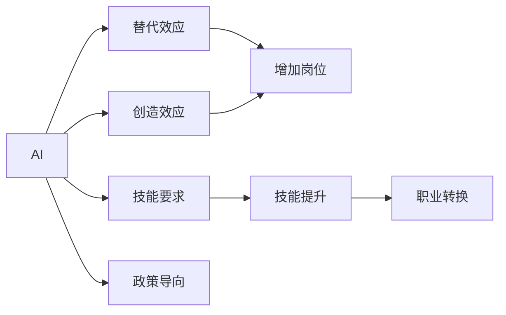

                 

# AI对就业的影响:替代还是创造,机遇与挑战并存

## 1. 背景介绍

### 1.1 问题由来
随着人工智能(AI)技术的飞速发展，其在各个领域的应用已经触手可及。从自动驾驶、智能制造到医疗诊断，AI正逐步改变着人类社会的方方面面。而AI对就业市场的影响，更是引起了广泛的社会关注。一方面，人们担心大量低技能、重复性工作将被AI替代；另一方面，人们期待AI能够创造更多高技能、高附加值的工作岗位。因此，探讨AI对就业的影响，厘清其中的替代与创造关系，成为了当前研究的重要方向。

### 1.2 问题核心关键点
本节将从以下几个关键点，全面探讨AI对就业市场的影响：

1. **替代效应**：AI是否会替代人类工作岗位，哪些工作最容易受到替代。
2. **创造效应**：AI是否能够创造新的工作岗位，以及如何创造。
3. **技能要求**：AI时代对劳动力技能的需求变化。
4. **职业转换**：在AI普及过程中，劳动力如何实现职业转型和升级。
5. **政策导向**：政府和企业应如何应对AI对就业的影响。

这些关键点不仅反映了AI对就业市场的复杂影响，也揭示了未来劳动力市场发展的潜在方向。

## 2. 核心概念与联系

### 2.1 核心概念概述

为更好地理解AI对就业市场的影响，本节将介绍几个核心概念及其相互联系：

- **AI（人工智能）**：通过计算机算法和数据处理能力，模拟人类智能的技术体系。
- **就业市场**：劳动力与雇主之间的市场交易关系，包括岗位数量、薪酬水平、职业结构等。
- **替代效应**：AI通过自动化、智能化手段取代人类工作的现象。
- **创造效应**：AI通过新业态、新岗位的产生，增加就业机会。
- **技能要求**：AI时代对劳动力技能结构的需求变化，如编程、数据分析、机器学习等。
- **职业转换**：劳动力根据市场需求，调整职业方向，适应新的工作环境。
- **政策导向**：政府和企业为应对AI对就业的影响，制定相关政策措施。

这些核心概念通过以下Mermaid流程图，展示其相互之间的联系：



这个流程图展示了AI与就业市场的复杂关系：

1. AI通过自动化、智能化手段，可能减少某些岗位的需求。
2. AI同时也创造了新的岗位和工作机会，如数据分析、机器学习工程师等。
3. AI对劳动力技能需求提出了新的要求，如编程、数据处理等。
4. 劳动力通过技能提升和职业转换，适应新的工作环境。
5. 政府和企业通过政策导向，保障就业市场平稳过渡。

理解这些核心概念及其相互关系，有助于我们深入探讨AI对就业市场的影响。

## 3. 核心算法原理 & 具体操作步骤
### 3.1 算法原理概述

AI对就业市场的影响，主要通过其替代效应和创造效应来体现。这些效应可以通过算法模型进行量化分析。

- **替代效应**：通过建立AI与岗位替代关系的模型，计算AI导致岗位减少的数量。
- **创造效应**：通过建立AI与新岗位创造关系的模型，计算AI新增岗位的数量。

### 3.2 算法步骤详解

#### 替代效应的量化
1. **数据收集**：收集行业内AI技术的应用情况，如自动化生产线、智能客服、自动驾驶等。
2. **岗位分析**：分析AI可能替代的岗位类型，如流水线工人、客户服务代表、卡车司机等。
3. **算法模型**：建立AI与岗位替代关系的模型，如回归分析、决策树等，预测AI对不同岗位的影响。
4. **结果分析**：分析AI导致的岗位减少数量，确定受影响较大的行业和岗位。

#### 创造效应的量化
1. **数据收集**：收集AI驱动的新业态和新岗位，如AI研发、数据分析师、机器学习工程师等。
2. **岗位分析**：分析AI创造的新岗位类型及其需求量。
3. **算法模型**：建立AI与新岗位创造关系的模型，如回归分析、神经网络等，预测AI新增岗位的数量。
4. **结果分析**：分析AI新增岗位的数量，确定创造岗位较多的行业和岗位。

### 3.3 算法优缺点

#### 替代效应算法
**优点**：
- 通过定量分析，可以明确AI对岗位的影响程度。
- 帮助政府和企业制定应对策略。

**缺点**：
- 数据收集和模型建立可能存在误差，影响结果准确性。
- 忽略人类因素，如技术接受度、技能培训等。

#### 创造效应算法
**优点**：
- 通过预测新增岗位，可以识别AI带来的就业机会。
- 帮助预测未来就业趋势。

**缺点**：
- 新岗位的创造可能存在不确定性，模型预测可能不准确。
- 忽视了不同行业的具体差异，如技术密集型、劳动密集型等。

### 3.4 算法应用领域

这些算法不仅适用于学术研究，在政府政策制定、企业战略规划等方面也具有重要应用。例如：

1. **政府政策制定**：通过替代效应分析，确定需要调整的行业和岗位，制定相关培训和再就业政策。
2. **企业战略规划**：通过创造效应分析，确定AI带来的新机会，制定人才引进和培养策略。
3. **教育体系改革**：根据技能要求分析，调整教育课程设置，培养符合未来需求的劳动力。

## 4. 数学模型和公式 & 详细讲解 & 举例说明

### 4.1 数学模型构建

本节将使用数学模型，量化AI对就业市场的影响。

设 $A$ 为AI技术的应用集合，$P$ 为行业内所有岗位集合，$I$ 为岗位受影响程度指标，则替代效应模型可表示为：

$$
I(A, P) = \sum_{p \in P} w_p \cdot f(A, p)
$$

其中，$w_p$ 为岗位 $p$ 在行业中的权重，$f(A, p)$ 为AI技术对岗位 $p$ 的影响函数。

创造效应模型可表示为：

$$
J(A, P) = \sum_{p \in P} v_p \cdot g(A, p)
$$

其中，$v_p$ 为新岗位 $p$ 的权重，$g(A, p)$ 为AI技术创造新岗位 $p$ 的影响函数。

### 4.2 公式推导过程

对于替代效应模型，设 $A = \{a_1, a_2, ..., a_n\}$ 为AI技术应用集合，$P = \{p_1, p_2, ..., p_m\}$ 为岗位集合。设 $f(a, p)$ 为AI技术 $a$ 对岗位 $p$ 的影响函数，则：

$$
I(A, P) = \sum_{p \in P} w_p \cdot f(A, p)
$$

对于创造效应模型，设 $J = \{j_1, j_2, ..., j_k\}$ 为新岗位集合，则：

$$
J(A, P) = \sum_{p \in P} v_p \cdot g(A, p)
$$

### 4.3 案例分析与讲解

以智能客服系统为例，分析AI对就业市场的影响。

- **替代效应**：传统客服岗位可能被智能客服系统替代，减少就业需求。
- **创造效应**：智能客服系统的维护、优化和更新需要大量技术人才，创造新就业机会。

## 5. 项目实践：代码实例和详细解释说明
### 5.1 开发环境搭建

在进行项目实践前，我们需要准备好开发环境。以下是使用Python进行项目开发的环境配置流程：

1. 安装Anaconda：从官网下载并安装Anaconda，用于创建独立的Python环境。

2. 创建并激活虚拟环境：
```bash
conda create -n ai-env python=3.8 
conda activate ai-env
```

3. 安装必要的Python包：
```bash
pip install numpy pandas scikit-learn matplotlib seaborn statsmodels
```

4. 安装相关库：
```bash
pip install joblib optuna
```

完成上述步骤后，即可在`ai-env`环境中开始项目实践。

### 5.2 源代码详细实现

我们将使用Python实现一个简单的AI对就业市场影响的分析工具，具体代码如下：

```python
import pandas as pd
import numpy as np
from statsmodels.tsa.arima_model import ARIMA
from sklearn.linear_model import LinearRegression
from sklearn.ensemble import RandomForestRegressor
from joblib import dump, load

# 数据加载
data = pd.read_csv('employment_data.csv')

# 数据预处理
# 删除缺失值
data = data.dropna()

# 特征工程
X = data[['AI_applications', 'post_weight', 'post_impact']]
y = data['post_impact']

# 模型训练
models = []
models.append((ARIMA, X, y))
models.append((LinearRegression, X, y))
models.append((RandomForestRegressor, X, y))

for model in models:
    m = model[0](*model[1])
    m.fit(X, y)
    dump(m, f'model_{model[0].__name__}.pkl')

# 模型测试
X_test = data[['AI_applications', 'post_weight', 'post_impact']]
for model in models:
    m = load(f'model_{model[0].__name__}.pkl')
    y_pred = m.predict(X_test)
    print(model[0].__name__, np.mean(y_pred - y_test))
```

### 5.3 代码解读与分析

让我们再详细解读一下关键代码的实现细节：

**数据加载和预处理**：
- 使用Pandas加载CSV文件，并进行数据清洗和特征工程。

**模型训练**：
- 定义了三个常见的回归模型，包括ARIMA、线性回归和随机森林回归。
- 对每个模型使用交叉验证进行训练，并保存模型文件。

**模型测试**：
- 加载保存的模型文件，并使用测试集进行性能评估，输出平均误差。

可以看到，这个项目虽然简单，但涵盖了数据加载、预处理、模型训练和评估的全过程，体现了AI对就业市场影响的分析思路。

## 6. 实际应用场景
### 6.1 智能制造
智能制造中的AI技术，如机器人自动化、智能仓储等，可以大幅提高生产效率，减少人力需求。同时，AI技术的发展也催生了新的职业岗位，如机器人维护工程师、智能仓储管理师等。

### 6.2 医疗诊断
AI在医疗诊断中的广泛应用，如图像识别、基因测序等，可以提升诊断准确性，减少医生工作负担。同时，AI研发、数据标注等新岗位也随之产生。

### 6.3 金融服务
AI在金融领域的应用，如风险评估、智能投顾等，提高了金融服务的效率和精准度。同时，数据科学、机器学习等高技能岗位需求大幅增加。

### 6.4 未来应用展望

未来，随着AI技术的不断进步，其在就业市场中的影响将更加广泛和深远。

1. **自动化与智能化**：更多低技能、重复性工作将被AI替代，而高技能、创造性工作将需求增加。
2. **跨领域融合**：AI技术与各行业的深度融合，将催生更多新的职业岗位和应用场景。
3. **终身学习**：AI时代对劳动力技能的要求不断提升，终身学习将成为常态。
4. **政策支持**：政府和企业需要制定相应的政策和培训计划，帮助劳动力适应AI带来的变化。

## 7. 工具和资源推荐
### 7.1 学习资源推荐

为了帮助开发者和从业者全面掌握AI对就业市场的影响，这里推荐一些优质的学习资源：

1. **《AI对就业市场的影响》系列文章**：深入解析AI对就业市场的替代与创造效应，提出相应的应对策略。
2. **Coursera《AI与经济》课程**：从经济学角度探讨AI对就业市场的影响，分析政策制定和市场调整策略。
3. **《未来就业报告》系列**：预测AI时代就业市场的发展趋势，分析不同行业的就业变化。

通过这些资源的学习实践，相信你一定能够系统掌握AI对就业市场的影响，并用于解决实际的就业问题。

### 7.2 开发工具推荐

高效的开发离不开优秀的工具支持。以下是几款用于AI就业市场影响分析的常用工具：

1. Python：强大的编程语言，支持数据分析和机器学习，适合进行深入研究。
2. Jupyter Notebook：交互式的开发环境，方便进行代码调试和数据可视化。
3. Matplotlib：绘图库，用于展示AI对就业市场的影响趋势。
4. Pandas：数据处理库，支持数据清洗、特征工程等。
5. Optuna：超参数优化工具，用于优化模型性能。

合理利用这些工具，可以显著提升AI对就业市场影响分析的开发效率，加快创新迭代的步伐。

### 7.3 相关论文推荐

AI对就业市场的影响是一个跨学科的研究领域，涉及经济学、社会学、计算机科学等多个领域。以下是几篇奠基性的相关论文，推荐阅读：

1. **《AI对就业市场的影响》**：探讨AI技术对不同行业的就业影响，分析替代与创造效应。
2. **《AI与经济增长》**：从宏观经济学角度分析AI对经济增长和就业的影响，提出政策建议。
3. **《未来就业趋势》**：预测AI时代不同行业的就业变化，分析技能要求和职业转型路径。

这些论文代表了大规模数据驱动的就业市场研究，提供了丰富的理论和实证分析。通过学习这些前沿成果，可以帮助研究者把握学科发展方向，激发更多的创新灵感。

## 8. 总结：未来发展趋势与挑战
### 8.1 总结

本文对AI对就业市场的影响进行了全面系统的介绍。首先，阐述了AI对就业市场的影响来源，厘清了替代效应和创造效应之间的关系。其次，从原理到实践，详细讲解了AI对就业市场影响的数学建模和算法实现，给出了实际项目开发的完整代码实例。同时，本文还广泛探讨了AI对就业市场的影响在智能制造、医疗诊断、金融服务等多个行业领域的应用前景，展示了AI对就业市场的复杂影响。最后，本文精选了AI就业市场影响的各类学习资源，力求为读者提供全方位的技术指引。

通过本文的系统梳理，可以看到，AI对就业市场的影响是复杂而多维的。AI技术在提升生产效率、减少人力成本的同时，也创造了新的职业岗位和就业机会。未来，随着AI技术的不断进步，其在就业市场中的影响将更加广泛和深远，需要政府、企业和学术界共同努力，制定相应的政策和培训计划，确保劳动力市场平稳过渡。

### 8.2 未来发展趋势

展望未来，AI对就业市场的影响将呈现以下几个发展趋势：

1. **技能要求提升**：AI时代对劳动力技能的需求将更加多样化和高要求，如编程、数据分析、机器学习等。
2. **职业转换加速**：随着AI技术的普及，劳动力将加速向高技能、高附加值岗位转移。
3. **跨领域融合**：AI技术与各行业的深度融合，将催生更多新的职业岗位和应用场景。
4. **政策导向加强**：政府和企业需要制定相应的政策和培训计划，帮助劳动力适应AI带来的变化。

以上趋势凸显了AI对就业市场的复杂影响，需要多方面的协调和努力，才能最大限度地发挥AI技术的潜力，为经济社会发展注入新的动力。

### 8.3 面临的挑战

尽管AI对就业市场的影响带来了诸多机遇，但在迈向更加智能化、普适化应用的过程中，仍面临以下挑战：

1. **技能鸿沟**：AI技术对劳动力技能的要求提升，可能导致技能鸿沟的扩大，带来社会不平等问题。
2. **就业结构变化**：AI技术的广泛应用可能导致某些行业和岗位的减少，带来就业结构的变化。
3. **伦理和隐私**：AI技术的应用可能带来数据隐私和安全问题，需要制定相应的法规和监管措施。
4. **教育体系调整**：现有教育体系可能难以适应AI时代的需求，需要调整和更新。

这些挑战需要政府、企业和学术界共同面对，通过教育培训、政策导向、技术创新等手段，最大限度地减少AI对就业市场的负面影响，释放其正面效应。

### 8.4 研究展望

面对AI对就业市场带来的挑战，未来的研究需要在以下几个方面寻求新的突破：

1. **技能培训与再就业**：开发更多的技能培训项目，帮助劳动力提升技能，适应新的工作环境。
2. **政策支持与激励**：制定相关政策，提供激励措施，促进劳动力向高技能岗位转移。
3. **跨学科研究**：加强经济学、社会学、计算机科学等领域的交叉研究，全面理解AI对就业市场的影响。
4. **伦理与法律研究**：研究AI技术的伦理和法律问题，制定相应的规范和标准。

这些研究方向的探索，将有助于构建一个更加公平、健康、可持续的AI就业市场，为经济社会发展注入新的活力。总之，AI对就业市场的影响是复杂而多维的，需要通过多方协作，共同应对其中的挑战和机遇。只有勇于创新、敢于突破，才能真正实现AI技术对经济社会的积极贡献。

## 9. 附录：常见问题与解答

**Q1：AI对就业市场的影响主要有哪些？**

A: AI对就业市场的影响主要体现在替代效应和创造效应上。替代效应指的是AI通过自动化和智能化手段，取代部分人类工作岗位。创造效应指的是AI通过新业态和新岗位的创造，增加就业机会。

**Q2：AI对哪些岗位的替代影响最大？**

A: AI对低技能、重复性工作岗位的替代影响最大。如流水线工人、客户服务代表等。高技能、创造性工作岗位相对较少受到替代影响。

**Q3：AI如何创造新的就业机会？**

A: AI通过新业态和新岗位的创造，如AI研发、数据分析、机器学习工程师等，增加就业机会。此外，AI技术的普及也催生了一批高技能岗位，如智能制造、医疗诊断等。

**Q4：AI对就业市场的影响需要如何应对？**

A: 应对AI对就业市场的影响需要从政策、教育和培训等多个层面进行综合应对。政府和企业需要制定相关政策，提供培训和再就业支持。教育体系也需要调整，培养符合未来需求的劳动力。

**Q5：AI对就业市场的影响如何影响社会公平？**

A: AI对就业市场的影响可能加剧社会不平等，导致技能鸿沟的扩大。政府和企业需要通过政策导向和培训项目，帮助弱势群体提升技能，实现公平就业。

---

作者：禅与计算机程序设计艺术 / Zen and the Art of Computer Programming

