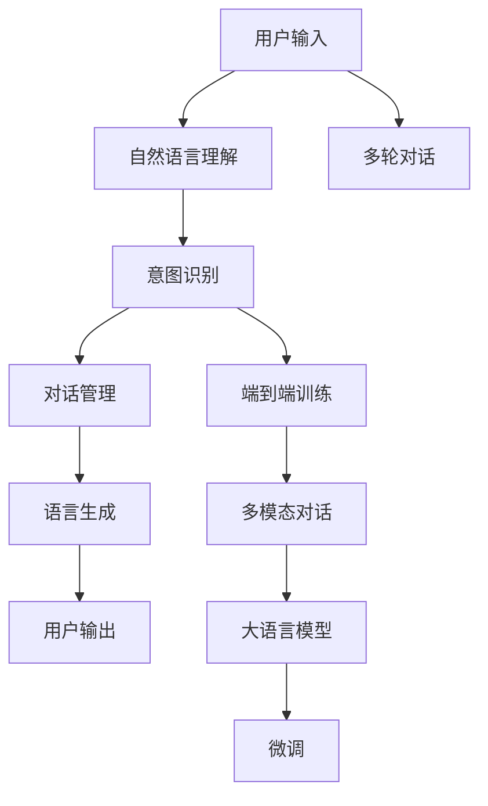

                 

# AI对话系统设计：从规则到开放域聊天

> 关键词：AI对话系统,开放域聊天,自然语言处理(NLP),对话管理,多轮对话,意图识别,端到端训练,多模态对话,大语言模型,微调

## 1. 背景介绍

随着人工智能技术的不断成熟，智能对话系统（Intelligent Dialogue System）成为越来越广泛应用场景中的一个亮点。从简单的客服机器人到复杂的AI助手，从简单的问答系统到多轮对话应用，智能对话系统在各行各业得到了广泛的应用。然而，传统的基于规则的对话系统在灵活性、自然度等方面存在一定局限性，而现代的基于深度学习的智能对话系统在处理开放域（Open-Domain）聊天等复杂任务上，尚有许多技术难题。本文旨在从人工智能的角度，探讨智能对话系统的设计与实现，并重点讨论开放域聊天任务中的关键问题，以期为未来的对话系统设计提供有价值的参考。

## 2. 核心概念与联系

### 2.1 核心概念概述

在深入讨论之前，我们需要理解一些核心概念：

- **AI对话系统**：通过人工智能技术实现的智能对话系统，可以与用户进行自然语言交流，提供个性化服务，处理复杂问题等。
- **开放域聊天**：指无需事先预定义的对话，用户可以自由提出各种问题，系统需要能够理解和回应。
- **自然语言处理(NLP)**：涉及语言模型、语言理解、语言生成等技术，是构建智能对话系统的基础。
- **对话管理**：决定系统如何响应用户输入，包括对话流管理、意图识别、上下文理解等。
- **多轮对话**：指对话系统需要处理多轮交互，而不仅仅是一轮回答。
- **意图识别**：识别用户输入中的意图，是对话管理的重要部分。
- **端到端训练**：直接从数据端到对话系统端进行训练，避免逐层分离带来的信息损失。
- **多模态对话**：利用文本、语音、图像等多模态信息进行对话，提升系统的理解能力。
- **大语言模型**：如GPT、BERT等，提供了强大的语言表示能力，是开放域聊天系统的基础。
- **微调**：在特定任务上，通过少量标注数据优化模型，提高模型性能。

这些核心概念相互关联，共同构成了智能对话系统的技术基础，下面我们将使用这些概念来探讨开放域聊天系统的设计和实现。

### 2.2 核心概念原理和架构的 Mermaid 流程图



该流程图展示了从用户输入到输出的一般对话系统处理流程。用户输入首先经过自然语言理解(B)，进行语言解析和转换。意图识别(C)确定用户意图，对话管理(D)根据上下文和用户意图生成响应，再经过语言生成(E)，最终输出给用户(F)。多轮对话(G)和端到端训练(H)进一步增强系统的灵活性和准确性，多模态对话(I)利用多种信息源提高理解能力，大语言模型(J)提供基础语言表示，微调(K)使模型更加适应特定任务。

## 3. 核心算法原理 & 具体操作步骤

### 3.1 算法原理概述

开放域聊天系统的核心算法基于自然语言处理技术，通过深度学习和机器学习实现。其主要包含以下几个步骤：

1. **数据预处理**：包括数据清洗、分词、标注等，为模型训练准备数据集。
2. **语言模型训练**：使用深度学习模型，如RNN、LSTM、Transformer等，对语言模型进行训练。
3. **对话管理训练**：包括意图识别和对话状态管理，使系统能够理解对话流和上下文。
4. **多模态信息融合**：利用语音、图像等多模态数据，增强系统的理解和生成能力。
5. **端到端训练**：将意图识别、对话管理、语言生成等环节进行端到端训练，提高整体性能。
6. **微调优化**：针对特定任务进行模型微调，提高模型性能。

### 3.2 算法步骤详解

下面以端到端训练为例，详细讲解算法步骤：

**Step 1: 数据准备与预处理**
- 收集对话数据，包括用户输入和系统输出。
- 对数据进行预处理，包括分词、去除停用词、标注意图等。

**Step 2: 模型选择与设计**
- 选择适当的深度学习模型，如BERT、GPT等。
- 设计对话管理模块，包括意图识别、对话状态管理等。

**Step 3: 模型训练**
- 定义损失函数，如交叉熵损失。
- 使用梯度下降等优化算法进行模型训练。
- 在验证集上评估模型性能，使用早停法防止过拟合。

**Step 4: 微调优化**
- 在少量标注数据上，通过微调优化模型，提高特定任务的性能。
- 选择合适的学习率，进行小批量更新。
- 使用正则化技术，如Dropout、L2正则化等。

**Step 5: 测试与部署**
- 在测试集上评估模型性能。
- 部署模型到生产环境，实时响应用户请求。

### 3.3 算法优缺点

**优点：**
1. 灵活性强：基于深度学习的模型能够处理复杂的自然语言。
2. 泛化能力强：训练过的模型能够适应各种自然语言场景。
3. 可扩展性高：模块化的设计便于后续扩展和优化。

**缺点：**
1. 训练时间长：深度学习模型需要大量数据和时间进行训练。
2. 数据依赖度高：模型效果依赖于数据的质量和数量。
3. 可解释性差：深度学习模型通常难以解释其内部决策过程。
4. 模型复杂度高：涉及多模块的组合，系统复杂度较高。

### 3.4 算法应用领域

开放域聊天系统广泛应用于以下几个领域：

1. **客户服务**：智能客服机器人，通过自然语言处理提供24小时不间断服务。
2. **健康医疗**：医疗咨询系统，帮助用户进行初步健康诊断。
3. **教育培训**：在线教育助手，提供个性化学习建议和解答。
4. **娱乐互动**：游戏聊天系统，增强游戏体验和互动性。
5. **智能家居**：智能音箱，通过语音交互控制家庭设备。

这些应用场景展示了开放域聊天系统的广泛应用和巨大潜力。

## 4. 数学模型和公式 & 详细讲解 & 举例说明

### 4.1 数学模型构建

在开放域聊天系统中，常用的数学模型包括语言模型、意图识别模型和对话管理模型。

- **语言模型**：常用的模型如BERT、GPT等，能够学习到丰富的语言表示。
- **意图识别模型**：常用的模型如CNN、RNN等，用于识别用户的意图。
- **对话管理模型**：常用的模型如LSTM、GRU等，用于管理对话流和上下文。

### 4.2 公式推导过程

以BERT模型为例，其语言模型的推导过程如下：

设训练集为 $D=\{(x_i,y_i)\}_{i=1}^N$，其中 $x_i$ 为输入序列，$y_i$ 为标签。目标是最小化经验损失：

$$
\mathcal{L} = \frac{1}{N} \sum_{i=1}^N \mathcal{L}_{CE}(y_i, \hat{y}_i)
$$

其中 $\mathcal{L}_{CE}$ 为交叉熵损失，$\hat{y}_i$ 为模型预测标签。

通过反向传播算法更新模型参数 $\theta$，最小化损失函数：

$$
\theta \leftarrow \theta - \eta \nabla_{\theta}\mathcal{L}
$$

其中 $\eta$ 为学习率。

### 4.3 案例分析与讲解

假设有一个意图识别模型，输入为 "I need a recommendation"，标签为 "recommend"。

- 使用BERT模型，将输入序列转换为向量表示。
- 通过全连接层进行意图分类。
- 计算交叉熵损失，更新模型参数。

## 5. 项目实践：代码实例和详细解释说明

### 5.1 开发环境搭建

**Step 1: 环境准备**
- 安装Python 3.7及以上版本。
- 安装TensorFlow、Keras等深度学习框架。
- 安装NLTK等自然语言处理库。

**Step 2: 数据准备**
- 收集对话数据集，包括用户输入和系统输出。
- 对数据进行预处理，包括分词、去除停用词、标注意图等。

**Step 3: 模型选择**
- 选择适当的深度学习模型，如BERT、GPT等。
- 设计意图识别模块，包括嵌入层、全连接层等。

### 5.2 源代码详细实现

**代码示例1: 意图识别模型**

```python
from keras.layers import Embedding, Dense, LSTM, Input
from keras.models import Model

def intent_model(input_size):
    input_layer = Input(shape=(input_size,))
    embedding_layer = Embedding(input_dim=1000, output_dim=128)(input_layer)
    lstm_layer = LSTM(128)(embedding_layer)
    dense_layer = Dense(128, activation='relu')(lstm_layer)
    output_layer = Dense(2, activation='softmax')(dense_layer)
    model = Model(inputs=input_layer, outputs=output_layer)
    model.compile(loss='categorical_crossentropy', optimizer='adam', metrics=['accuracy'])
    return model

# 创建意图识别模型
model = intent_model(1000)
```

**代码示例2: 对话管理模块**

```python
from keras.layers import LSTM, Dense
from keras.models import Model

class DialogueManager:
    def __init__(self, input_size):
        self.input_size = input_size
        self.lstm_layer = LSTM(128)
        self.dense_layer = Dense(64, activation='relu')
        self.output_layer = Dense(2, activation='softmax')
        self.model = Model(inputs=Input(shape=(None, input_size)), outputs=self.output_layer(self.dense_layer(self.lstm_layer(Input(shape=(None, input_size)))))
        self.model.compile(loss='categorical_crossentropy', optimizer='adam', metrics=['accuracy'])

    def predict(self, input_sequence):
        return self.model.predict(input_sequence)

# 创建对话管理模型
dialogue_manager = DialogueManager(1000)
```

### 5.3 代码解读与分析

- **意图识别模型**：使用LSTM层进行特征提取，通过全连接层进行意图分类。
- **对话管理模块**：使用LSTM层管理对话状态，通过全连接层进行意图分类。

**运行结果展示**

```python
# 训练意图识别模型
model.fit(X_train, y_train, epochs=10, batch_size=32, validation_data=(X_val, y_val))

# 训练对话管理模型
dialogue_manager.fit(X_train, y_train, epochs=10, batch_size=32, validation_data=(X_val, y_val))

# 预测新对话
input_sequence = sequence_to_vector(input_text)
output = dialogue_manager.predict(input_sequence)
```

## 6. 实际应用场景

### 6.1 客户服务

开放域聊天系统可以应用于智能客服系统，提供24小时不间断服务，快速响应用户咨询。系统可以集成自然语言理解和意图识别技术，理解用户需求，提供个性化回答。

**应用场景1: 在线客服**
- 收集客户咨询数据，用于训练意图识别和对话管理模型。
- 将训练好的模型集成到在线客服系统，自动回答常见问题，提高客户满意度。

**应用场景2: 语音客服**
- 结合语音识别技术，将用户语音转换为文本。
- 使用对话管理模块处理语音对话，自动生成应答。

### 6.2 健康医疗

在健康医疗领域，开放域聊天系统可以用于初步健康咨询和诊断。系统集成多模态对话和多轮对话技术，可以处理复杂健康问题。

**应用场景1: 健康咨询**
- 收集医疗咨询数据，用于训练意图识别和对话管理模型。
- 将训练好的模型集成到医疗咨询系统，自动回答健康问题，提供初步诊断建议。

**应用场景2: 诊断辅助**
- 将对话管理模块与诊断系统结合，根据用户健康信息，提供诊断建议。

### 6.3 教育培训

在教育培训领域，开放域聊天系统可以提供个性化学习建议和解答。系统集成自然语言理解和意图识别技术，可以理解学生需求，提供个性化指导。

**应用场景1: 在线辅导**
- 收集学生学习数据，用于训练意图识别和对话管理模型。
- 将训练好的模型集成到在线辅导系统，自动回答学生问题，提供学习建议。

**应用场景2: 智能题库**
- 结合自然语言理解和意图识别技术，自动回答学生问题，提供习题解答。

### 6.4 娱乐互动

开放域聊天系统可以应用于游戏聊天系统，增强游戏体验和互动性。系统集成多模态对话和自然语言理解技术，可以处理玩家互动，提供游戏指导。

**应用场景1: 游戏客服**
- 收集游戏对话数据，用于训练意图识别和对话管理模型。
- 将训练好的模型集成到游戏客服系统，自动回答玩家问题，提供游戏指导。

**应用场景2: 虚拟助手**
- 将对话管理模块与游戏场景结合，自动生成对话内容，增强游戏体验。

## 7. 工具和资源推荐

### 7.1 学习资源推荐

- **《深度学习自然语言处理》**：斯坦福大学课程，涵盖自然语言处理的基本概念和经典模型。
- **《Natural Language Processing with Transformers》**：Transformers库的作者所著，全面介绍了如何使用Transformers库进行NLP任务开发。
- **《Deep Learning for AI & Machine Learning Professionals》**：涵盖深度学习在人工智能和机器学习中的各种应用。
- **《CS224n: Deep Learning for Natural Language Processing》**：斯坦福大学课程，讲解深度学习在自然语言处理中的应用。

### 7.2 开发工具推荐

- **TensorFlow**：由Google主导开发的深度学习框架，生产部署方便，适合大规模工程应用。
- **Keras**：基于TensorFlow的高级深度学习框架，易于使用，适合快速迭代研究。
- **NLTK**：自然语言处理工具包，提供了丰富的NLP工具和资源。
- **PyTorch**：基于Python的开源深度学习框架，灵活动态，适合快速迭代研究。
- **Weights & Biases**：模型训练的实验跟踪工具，可以记录和可视化模型训练过程中的各项指标。
- **TensorBoard**：TensorFlow配套的可视化工具，可实时监测模型训练状态，并提供丰富的图表呈现方式。

### 7.3 相关论文推荐

- **《Attention is All You Need》**：提出Transformer结构，开启了NLP领域的预训练大模型时代。
- **《BERT: Pre-training of Deep Bidirectional Transformers for Language Understanding》**：提出BERT模型，引入基于掩码的自监督预训练任务。
- **《Parameter-Efficient Transfer Learning for NLP》**：提出Adapter等参数高效微调方法。
- **《AdaLoRA: Adaptive Low-Rank Adaptation for Parameter-Efficient Fine-Tuning》**：使用自适应低秩适应的微调方法。
- **《DialoGPT: Large-Scale Conversational Model Training》**：提出DialoGPT模型，进行开放域对话生成。

## 8. 总结：未来发展趋势与挑战

### 8.1 研究成果总结

开放域聊天系统作为人工智能领域的重要应用，其设计和实现涉及自然语言处理、机器学习等多个方向的技术。从传统的基于规则的系统，到现在的基于深度学习的系统，经历了多次迭代和优化。

### 8.2 未来发展趋势

未来，开放域聊天系统将呈现以下趋势：

1. **多模态对话**：结合语音、图像、视频等多种模态信息，提升系统的理解和生成能力。
2. **多轮对话**：处理多轮交互，提升系统的灵活性和自然度。
3. **知识图谱**：引入知识图谱技术，提升系统的知识表示和推理能力。
4. **语义理解**：提升系统的语义理解能力，处理复杂自然语言。
5. **端到端训练**：进行端到端训练，提高整体性能。
6. **迁移学习**：在特定领域进行迁移学习，提高模型泛化能力。
7. **个性化推荐**：结合个性化推荐技术，提供个性化服务。
8. **边缘计算**：在边缘设备上进行计算，提高系统响应速度。

### 8.3 面临的挑战

开放域聊天系统在发展过程中，也面临许多挑战：

1. **数据质量**：训练数据的质量直接影响模型的效果，获取高质量标注数据成本较高。
2. **模型复杂性**：模型的复杂度较高，训练和部署成本较高。
3. **模型鲁棒性**：模型对噪声和干扰的鲁棒性不足，容易受到输入数据的干扰。
4. **用户隐私**：系统需要保护用户隐私，避免泄露敏感信息。
5. **系统扩展性**：系统的扩展性和灵活性不足，难以应对复杂场景。
6. **系统可解释性**：系统的决策过程难以解释，用户难以理解和信任。
7. **伦理问题**：系统需要考虑伦理问题，避免歧视和偏见。

### 8.4 研究展望

为了应对这些挑战，未来的研究需要在以下几个方向进行突破：

1. **数据增强**：通过数据增强技术，提升数据质量，降低标注成本。
2. **模型压缩**：通过模型压缩技术，降低模型的复杂度和资源消耗。
3. **鲁棒性提升**：提升模型的鲁棒性，增强系统的稳定性和可靠性。
4. **隐私保护**：引入隐私保护技术，保护用户隐私，增强系统安全性。
5. **可解释性增强**：增强系统的可解释性，使用户能够理解和信任系统。
6. **伦理设计**：在系统的设计和应用过程中，考虑伦理问题，避免歧视和偏见。

## 9. 附录：常见问题与解答

### Q1: 开放域聊天系统的优势是什么？

A: 开放域聊天系统具有以下优势：

1. 灵活性强：能够处理各种自然语言输入。
2. 泛化能力强：训练过的模型能够适应各种自然语言场景。
3. 实时响应：能够实时响应用户输入，提升用户体验。
4. 个性化服务：能够提供个性化服务，增强用户满意度。
5. 多轮对话：能够处理多轮对话，提升系统灵活性。

### Q2: 开放域聊天系统的主要技术难点是什么？

A: 开放域聊天系统的主要技术难点包括：

1. 数据质量：训练数据的质量直接影响模型的效果，获取高质量标注数据成本较高。
2. 模型复杂性：模型的复杂度较高，训练和部署成本较高。
3. 模型鲁棒性：模型对噪声和干扰的鲁棒性不足，容易受到输入数据的干扰。
4. 系统可解释性：系统的决策过程难以解释，用户难以理解和信任。
5. 伦理问题：系统需要考虑伦理问题，避免歧视和偏见。

### Q3: 开放域聊天系统的应用场景有哪些？

A: 开放域聊天系统的应用场景包括：

1. 客户服务：智能客服系统，自动回答客户咨询，提高客户满意度。
2. 健康医疗：健康咨询系统，提供初步健康诊断，辅助医生诊断。
3. 教育培训：在线辅导系统，提供个性化学习建议和解答。
4. 娱乐互动：游戏聊天系统，增强游戏体验和互动性。

### Q4: 如何提高开放域聊天系统的性能？

A: 提高开放域聊天系统性能的方法包括：

1. 数据增强：通过数据增强技术，提升数据质量，降低标注成本。
2. 模型压缩：通过模型压缩技术，降低模型的复杂度和资源消耗。
3. 鲁棒性提升：提升模型的鲁棒性，增强系统的稳定性和可靠性。
4. 隐私保护：引入隐私保护技术，保护用户隐私，增强系统安全性。
5. 可解释性增强：增强系统的可解释性，使用户能够理解和信任系统。
6. 伦理设计：在系统的设计和应用过程中，考虑伦理问题，避免歧视和偏见。

### Q5: 开放域聊天系统的前景如何？

A: 开放域聊天系统的前景广阔，随着人工智能技术的不断发展，未来将会有更多的应用场景和创新方向。开放域聊天系统将会成为各行各业的重要工具，提升客户体验和服务效率，助力企业数字化转型。

---

作者：禅与计算机程序设计艺术 / Zen and the Art of Computer Programming

