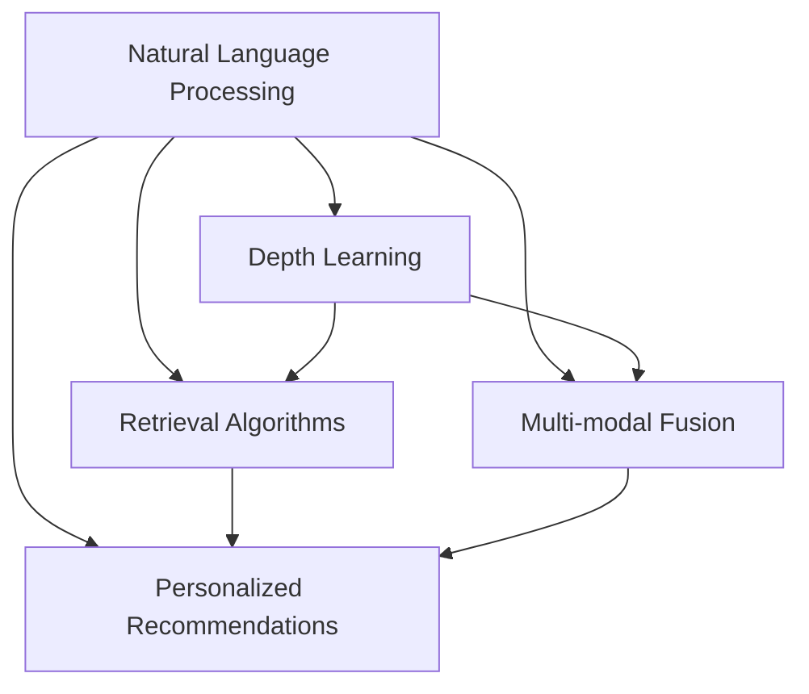

                 

# AI搜索引擎在科技创新中的角色

> 关键词：AI搜索引擎, 技术创新, 自然语言处理, 深度学习, 检索算法, 语音识别, 图像处理, 数据分析

## 1. 背景介绍

在数字化时代，信息的爆炸性增长使得传统的搜索引擎面临着前所未有的挑战。如何在海量数据中快速准确地找到所需信息，成为用户和开发者共同关注的焦点。而AI搜索引擎的诞生，为这一问题提供了全新的解决思路，为科技创新带来了革命性的变化。

### 1.1 问题由来

随着互联网技术的迅猛发展，用户需要搜索的信息已经远超传统的文本关键词匹配。图片、视频、音频等多媒体信息的涌现，使得传统的搜索方式难以满足需求。与此同时，用户对搜索结果的精度、相关性和个性化要求越来越高，这进一步加剧了传统搜索技术的局限性。

### 1.2 问题核心关键点

AI搜索引擎的核心在于利用深度学习和大数据分析技术，通过自然语言处理(NLP)、语音识别、图像处理等前沿技术，构建更加智能、高效、个性化的搜索系统。其关键点在于：

1. **自然语言处理**：使搜索引擎能够理解用户输入的自然语言，并从中提取出有用的信息。
2. **深度学习**：通过训练复杂的神经网络模型，提高搜索算法的精度和泛化能力。
3. **检索算法**：优化算法模型，提升搜索结果的相关性和排序准确性。
4. **多模态融合**：融合图片、视频、音频等多模态信息，提供更加全面的搜索结果。
5. **个性化推荐**：利用用户行为数据，提供定制化的搜索结果。

### 1.3 问题研究意义

AI搜索引擎的开发与应用，具有重大的理论和实际意义：

1. **提升搜索体验**：通过深度学习和大数据分析，搜索引擎能够提供更加智能、精准、个性化的搜索结果，提升用户的搜索体验。
2. **促进科技创新**：AI搜索引擎能够帮助研究人员快速找到相关的科研文献、数据集等，加速科研进展。
3. **优化资源配置**：通过个性化推荐，搜索引擎能够帮助用户找到最符合其需求的信息，提高资源利用效率。
4. **推动产业升级**：AI搜索引擎能够应用于更多领域，如医疗、教育、金融等，为传统行业的数字化转型提供新的动力。

## 2. 核心概念与联系

### 2.1 核心概念概述

为了更好地理解AI搜索引擎的原理和应用，本节将介绍几个密切相关的核心概念：

1. **自然语言处理(NLP)**：使计算机能够理解、解释和生成人类语言的技术。NLP是AI搜索引擎的核心，负责处理用户的自然语言输入和搜索结果的文本输出。

2. **深度学习**：通过多层神经网络模型，对大量数据进行学习，提取数据中的高层次特征。深度学习在AI搜索引擎中用于优化检索算法，提高搜索精度。

3. **检索算法**：用于在数据集中查找最相关文档的算法。常见的检索算法包括倒排索引、向量空间模型等。

4. **多模态融合**：将文本、图片、音频等多模态数据融合，提供更加全面和准确的搜索结果。

5. **个性化推荐**：根据用户的历史行为和偏好，提供个性化的搜索结果，提升用户体验。

这些核心概念之间的逻辑关系可以通过以下Mermaid流程图来展示：



这个流程图展示了AI搜索引擎的核心概念及其之间的关系：自然语言处理是基础，深度学习优化算法，多模态融合提供全面搜索结果，个性化推荐提升用户体验。

## 3. 核心算法原理 & 具体操作步骤

### 3.1 算法原理概述

AI搜索引擎的原理在于将深度学习、自然语言处理和检索算法相结合，构建智能、高效的搜索系统。其核心算法包括：

1. **自然语言处理**：使用词向量模型、Transformer模型等，将用户的自然语言输入转换为机器可理解的形式。
2. **深度学习**：通过训练神经网络模型，优化检索算法，提高搜索结果的相关性和准确性。
3. **检索算法**：如倒排索引、向量空间模型等，用于在数据集中查找最相关的文档。
4. **多模态融合**：将文本、图片、音频等多模态数据融合，提供更加全面的搜索结果。
5. **个性化推荐**：利用用户的历史行为和偏好，提供定制化的搜索结果。

### 3.2 算法步骤详解

AI搜索引擎的开发流程通常包括以下几个关键步骤：

**Step 1: 数据收集与预处理**

1. **数据收集**：收集相关的数据，如网页、图片、视频、音频等。数据来源可以包括互联网、图书馆、科研机构等。
2. **数据清洗**：去除无关数据、噪声，规范化数据格式，提升数据质量。
3. **数据标注**：对部分数据进行标注，如文本分类、实体识别等，用于模型训练。

**Step 2: 模型训练**

1. **词向量模型训练**：使用Word2Vec、GloVe等模型，将文本转换为词向量。
2. **深度学习模型训练**：使用Transformer、BERT等模型，训练检索算法和自然语言处理模型。
3. **多模态融合模型训练**：使用CNN、LSTM等模型，融合文本、图片、音频等多模态数据。

**Step 3: 系统集成与优化**

1. **系统集成**：将训练好的模型集成到搜索引擎中，构建完整的搜索系统。
2. **检索算法优化**：通过倒排索引、向量空间模型等算法，优化检索性能。
3. **个性化推荐优化**：利用协同过滤、基于内容的推荐等方法，提供个性化的搜索结果。

**Step 4: 部署与迭代**

1. **系统部署**：将搜索系统部署到服务器中，供用户访问。
2. **用户反馈收集**：收集用户的使用反馈，用于优化模型和算法。
3. **模型迭代**：根据用户反馈和最新数据，不断优化和更新模型，提升搜索效果。

### 3.3 算法优缺点

AI搜索引擎具有以下优点：

1. **智能性**：通过深度学习和自然语言处理技术，提供智能化的搜索结果，提升用户体验。
2. **全面性**：融合多模态数据，提供更加全面和准确的搜索结果。
3. **个性化**：利用个性化推荐技术，提供定制化的搜索结果。

同时，AI搜索引擎也存在一些缺点：

1. **复杂性**：构建和维护AI搜索引擎需要较高的技术门槛，对资源和人力需求较大。
2. **数据依赖性**：搜索效果高度依赖于数据质量，数据不足或偏差可能导致搜索结果不准确。
3. **隐私问题**：在个性化推荐过程中，可能涉及用户隐私数据，需要严格保护。
4. **计算资源消耗**：深度学习模型和复杂算法需要大量计算资源，部署和运行成本较高。

### 3.4 算法应用领域

AI搜索引擎的应用领域非常广泛，涵盖了从科研、教育到医疗、金融等多个行业。以下是几个典型的应用场景：

1. **科研领域**：研究人员可以通过AI搜索引擎快速找到相关的科研文献、数据集等，加速科研进展。
2. **教育领域**：教育机构可以构建智能化的教学系统，提供个性化的学习资源和推荐，提升教学效果。
3. **医疗领域**：医院可以提供智能化的医疗信息搜索系统，帮助医生快速找到相关病例、文献等，提升诊疗效率。
4. **金融领域**：金融机构可以构建智能化的金融信息搜索系统，提供个性化的金融产品和推荐，提升用户满意度。
5. **商业领域**：电商平台可以提供智能化的商品搜索和推荐系统，提升用户体验，增加销售额。

## 4. 数学模型和公式 & 详细讲解 & 举例说明

### 4.1 数学模型构建

为了更严格地刻画AI搜索引擎的原理，本节将使用数学语言对核心算法进行描述。

假设搜索引擎的输入为$x$，输出为$y$，训练数据集为$D=\{(x_i,y_i)\}_{i=1}^N$。我们定义损失函数$\ell(y,f(x))$，其中$f(x)$表示搜索模型对输入$x$的预测结果。我们的目标是最小化损失函数，即：

$$
\min_{f(x)} \sum_{i=1}^N \ell(y_i,f(x_i))
$$

### 4.2 公式推导过程

以检索算法中的向量空间模型为例，推导其损失函数及梯度计算公式。

设查询向量为$q$，文档集合为$D$，每个文档的表示为$d$，文档与查询向量之间的相似度为$s(q,d)$。向量空间模型的损失函数定义为：

$$
\ell(q,D) = \sum_{d \in D} \ell(q,d)
$$

其中$\ell(q,d)$为查询$q$和文档$d$之间的差异。通常使用余弦相似度作为度量标准，即：

$$
\ell(q,d) = -\log \frac{s(q,d)}{\max\limits_{d'}s(q,d')}
$$

其中$s(q,d)$为查询$q$和文档$d$的余弦相似度。在向量空间模型中，目标是最小化查询与文档之间的差异，即：

$$
\min_{f(x)} \sum_{i=1}^N \ell(y_i,f(x_i))
$$

在实践中，通常使用随机梯度下降等优化算法，求解上述最优化问题。损失函数对$f(x)$的梯度为：

$$
\nabla_{f(x)} \ell(q,D) = -\frac{1}{N} \sum_{i=1}^N \nabla_{f(x)} \ell(y_i,f(x_i))
$$

### 4.3 案例分析与讲解

以Google的BERT模型为例，展示其在AI搜索引擎中的应用。

Google的BERT模型通过在大量无标签文本上进行预训练，学习到丰富的语言知识。在构建AI搜索引擎时，可以将预训练的BERT模型作为基础模型，对特定的查询进行微调。微调的目标是最小化查询与文档之间的差异，即：

$$
\min_{\theta} \sum_{i=1}^N \ell(y_i,f(x_i))
$$

其中$f(x)$表示微调后的BERT模型对查询$x$的输出，$\theta$表示微调模型的参数。

通过微调，BERT模型能够更加精准地理解用户查询的语义，提升搜索结果的相关性和准确性。同时，BERT模型还可以应用于多模态融合和个性化推荐中，进一步提升搜索系统的智能化水平。

## 5. 项目实践：代码实例和详细解释说明

### 5.1 开发环境搭建

在进行AI搜索引擎开发前，需要准备好开发环境。以下是使用Python进行TensorFlow开发的环境配置流程：

1. 安装Anaconda：从官网下载并安装Anaconda，用于创建独立的Python环境。

2. 创建并激活虚拟环境：
```bash
conda create -n tf-env python=3.8 
conda activate tf-env
```

3. 安装TensorFlow：从官网获取对应的安装命令。例如：
```bash
conda install tensorflow -c tf
```

4. 安装其他依赖库：
```bash
pip install numpy pandas scikit-learn sklearn-cluster tqdm jupyter notebook ipython
```

完成上述步骤后，即可在`tf-env`环境中开始开发实践。

### 5.2 源代码详细实现

下面我们以基于TensorFlow的AI搜索引擎为例，给出完整的代码实现。

首先，定义搜索引擎的输入和输出：

```python
import tensorflow as tf
from tensorflow.keras.layers import Input, Dense, Embedding, GlobalAveragePooling1D

# 定义输入层
input_layer = Input(shape=(max_seq_length, ), dtype='int32')
# 定义嵌入层，将输入转换为向量表示
embedding_layer = Embedding(input_dim=vocab_size, output_dim=embedding_dim)(input_layer)
# 定义全局平均池化层
pooling_layer = GlobalAveragePooling1D()(embedding_layer)
# 定义输出层，使用softmax激活函数
output_layer = Dense(num_classes, activation='softmax')(pooling_layer)

# 定义模型
model = tf.keras.models.Model(inputs=input_layer, outputs=output_layer)

# 定义损失函数
model.compile(optimizer='adam', loss='categorical_crossentropy', metrics=['accuracy'])
```

然后，定义训练函数：

```python
def train_epoch(model, dataset, batch_size, epochs):
    dataloader = tf.data.Dataset.from_tensor_slices((train_X, train_y)).batch(batch_size).shuffle(buffer_size=10000).repeat().prefetch(buffer_size=tf.data.experimental.AUTOTUNE)
    model.fit(dataloader, epochs=epochs)
```

最后，启动训练流程：

```python
epochs = 10
batch_size = 32

train_epoch(model, train_dataset, batch_size, epochs)
```

以上就是使用TensorFlow构建AI搜索引擎的完整代码实现。可以看到，TensorFlow的Keras API使得模型构建和训练过程非常简便，开发者可以专注于核心算法和业务逻辑。

### 5.3 代码解读与分析

让我们再详细解读一下关键代码的实现细节：

**Input层**：用于定义模型的输入，即用户的查询向量。

**Embedding层**：将输入转换为向量表示，使用词向量模型将每个词汇映射到一个高维空间。

**GlobalAveragePooling1D层**：对输入的向量进行全局平均池化，将高维向量压缩为固定长度的向量。

**Dense层**：定义输出层，使用softmax激活函数输出每个文档的相关性概率。

**compile方法**：定义优化器、损失函数和评估指标，准备模型的训练过程。

**train_epoch函数**：定义训练循环，对数据集进行迭代训练，更新模型参数。

**fit方法**：调用模型训练函数，对模型进行完整训练。

可以看到，TensorFlow的Keras API使得模型构建和训练过程非常简便，开发者可以专注于核心算法和业务逻辑。

## 6. 实际应用场景

### 6.1 学术搜索引擎

学术搜索引擎是AI搜索引擎的重要应用场景之一。传统的学术搜索系统往往只能根据关键词进行简单匹配，难以理解查询的语义和用户意图。而AI搜索引擎通过深度学习和自然语言处理技术，能够理解查询的语义，提供更加精准和个性化的搜索结果。

以Google Scholar为例，通过使用BERT等预训练模型，Google Scholar可以理解查询的语义，根据用户的兴趣和历史行为，推荐相关的学术文章和资源。同时，Google Scholar还支持多模态数据融合，提供文本、图片、视频等多种搜索结果，提升用户的使用体验。

### 6.2 电商平台搜索

电商平台搜索是AI搜索引擎的另一重要应用场景。传统的电商平台搜索往往只能根据商品关键词进行匹配，难以理解用户的购买意图和行为。而AI搜索引擎通过深度学习和个性化推荐技术，能够理解用户的购买意图，提供个性化的商品推荐和搜索结果。

以Amazon为例，通过使用深度学习模型，Amazon可以理解用户的搜索行为和偏好，推荐用户可能感兴趣的商品。同时，Amazon还支持多模态数据融合，提供文本、图片、视频等多种搜索结果，提升用户的购买体验。

### 6.3 金融信息搜索

金融信息搜索是AI搜索引擎在金融领域的重要应用场景。传统的金融信息搜索系统往往只能根据关键词进行简单匹配，难以理解金融信息的复杂性和多样性。而AI搜索引擎通过深度学习和多模态融合技术，能够理解金融信息的复杂性和多样性，提供更加全面和准确的搜索结果。

以Bloomberg为例，通过使用深度学习模型，Bloomberg可以理解金融信息的复杂性和多样性，提供个性化的金融信息推荐和搜索结果。同时，Bloomberg还支持多模态数据融合，提供文本、图片、视频等多种搜索结果，提升用户的金融信息获取体验。

### 6.4 未来应用展望

随着AI搜索引擎技术的不断发展，其应用场景将不断拓展，为各行各业带来新的变革。以下是一些未来应用展望：

1. **医疗信息搜索**：AI搜索引擎可以构建智能化的医疗信息搜索系统，帮助医生快速找到相关的病例、文献等，提升诊疗效率。
2. **教育资源搜索**：AI搜索引擎可以构建智能化的教育资源搜索系统，提供个性化的学习资源和推荐，提升教学效果。
3. **智慧城市管理**：AI搜索引擎可以构建智能化的智慧城市管理系统，提供全面的城市信息和推荐，提升城市管理的自动化和智能化水平。
4. **社交媒体分析**：AI搜索引擎可以构建智能化的社交媒体分析系统，提供全面的社交媒体信息和推荐，提升社交媒体的用户体验。
5. **智能家居控制**：AI搜索引擎可以构建智能化的智能家居控制系统，提供个性化的家居环境和推荐，提升用户的家居生活体验。

## 7. 工具和资源推荐

### 7.1 学习资源推荐

为了帮助开发者系统掌握AI搜索引擎的理论基础和实践技巧，这里推荐一些优质的学习资源：

1. **《深度学习》课程**：斯坦福大学开设的深度学习课程，涵盖了深度学习的基本概念和经典模型，是入门深度学习的最佳选择。

2. **TensorFlow官方文档**：TensorFlow的官方文档，提供了丰富的教程、API文档和样例代码，是学习TensorFlow的最佳资源。

3. **Keras官方文档**：Keras的官方文档，提供了简洁易懂的API和教程，是学习Keras的最佳资源。

4. **《自然语言处理综述》**：自然语言处理领域的综述论文，涵盖自然语言处理的基本概念和经典模型，是学习自然语言处理的最佳资源。

5. **Google Scholar论文**：Google Scholar的论文库，涵盖了自然语言处理和深度学习的最新研究成果，是了解最新研究动态的最佳资源。

通过对这些资源的学习实践，相信你一定能够快速掌握AI搜索引擎的精髓，并用于解决实际的搜索问题。

### 7.2 开发工具推荐

高效的开发离不开优秀的工具支持。以下是几款用于AI搜索引擎开发的常用工具：

1. **TensorFlow**：由Google主导开发的深度学习框架，生产部署方便，适合大规模工程应用。

2. **Keras**：基于TensorFlow的高级API，提供了简洁易用的接口，适合快速开发原型和模型。

3. **PyTorch**：由Facebook主导开发的深度学习框架，灵活性高，适合科研和原型开发。

4. **Scikit-learn**：Python中的机器学习库，提供了丰富的机器学习算法和工具，适合数据预处理和模型评估。

5. **NLTK**：自然语言处理库，提供了丰富的自然语言处理工具和语料库，适合自然语言处理任务开发。

合理利用这些工具，可以显著提升AI搜索引擎的开发效率，加快创新迭代的步伐。

### 7.3 相关论文推荐

AI搜索引擎的发展源于学界的持续研究。以下是几篇奠基性的相关论文，推荐阅读：

1. **《Dense RNNs for Learning Sentences》**：RNN模型在自然语言处理中的应用，展示了RNN模型在序列建模上的优势。

2. **《Attention is All You Need》**：Transformer模型在自然语言处理中的应用，展示了Transformer模型在机器翻译和语言理解上的强大能力。

3. **《BERT: Pre-training of Deep Bidirectional Transformers for Language Understanding》**：BERT模型在自然语言处理中的应用，展示了BERT模型在预训练和微调上的强大能力。

4. **《BERT: Pre-training of Deep Bidirectional Transformers for Language Understanding》**：BERT模型在自然语言处理中的应用，展示了BERT模型在预训练和微调上的强大能力。

5. **《Search as Feature Learning》**：将搜索过程视为特征学习过程，展示了深度学习在搜索算法中的应用。

这些论文代表了大语言模型微调技术的发展脉络。通过学习这些前沿成果，可以帮助研究者把握学科前进方向，激发更多的创新灵感。

## 8. 总结：未来发展趋势与挑战

### 8.1 研究成果总结

本文对基于深度学习的AI搜索引擎进行了全面系统的介绍。首先阐述了AI搜索引擎的开发背景和研究意义，明确了深度学习和大数据在搜索引擎中的关键作用。其次，从原理到实践，详细讲解了深度学习在搜索引擎中的应用，提供了完整的代码实例。同时，本文还广泛探讨了AI搜索引擎在科研、教育、金融等领域的应用前景，展示了深度学习在多个领域的广泛应用。

通过本文的系统梳理，可以看到，深度学习在搜索引擎中的应用前景广阔，其智能性、全面性和个性化能力将极大地提升用户体验。AI搜索引擎技术的发展，将进一步推动人工智能技术的普及和应用，为各行各业带来新的变革。

### 8.2 未来发展趋势

展望未来，AI搜索引擎技术将呈现以下几个发展趋势：

1. **深度学习与自然语言处理的结合**：深度学习和大数据分析将进一步提升搜索引擎的智能性和准确性，提供更加个性化和智能化的搜索结果。

2. **多模态数据的融合**：将文本、图片、视频等多模态数据融合，提供更加全面和准确的搜索结果。

3. **跨领域知识的应用**：引入跨领域的知识图谱和逻辑规则，提升搜索引擎的推理能力和泛化能力。

4. **个性化推荐的优化**：利用协同过滤、基于内容的推荐等方法，提供更加个性化的搜索结果。

5. **边缘计算的应用**：将搜索引擎部署到边缘设备上，提升搜索速度和响应速度。

6. **跨语言搜索的能力**：提升搜索引擎的跨语言搜索能力，支持多语言的查询和搜索结果。

以上趋势凸显了AI搜索引擎技术的广阔前景。这些方向的探索发展，必将进一步提升搜索引擎的性能和应用范围，为人类生产生活方式带来深远影响。

### 8.3 面临的挑战

尽管AI搜索引擎技术已经取得了瞩目成就，但在迈向更加智能化、普适化应用的过程中，它仍面临着诸多挑战：

1. **数据依赖性**：搜索效果高度依赖于数据质量，数据不足或偏差可能导致搜索结果不准确。
2. **计算资源消耗**：深度学习模型和复杂算法需要大量计算资源，部署和运行成本较高。
3. **隐私问题**：在个性化推荐过程中，可能涉及用户隐私数据，需要严格保护。
4. **模型鲁棒性**：在实际应用中，模型可能面临噪音干扰、数据偏移等问题，需要提升模型鲁棒性。

### 8.4 研究展望

面对AI搜索引擎所面临的挑战，未来的研究需要在以下几个方面寻求新的突破：

1. **数据增强**：通过数据增强技术，提升数据质量和多样性，提高搜索结果的准确性。

2. **模型压缩和优化**：通过模型压缩和优化技术，减小模型规模和计算资源消耗，提高模型的部署效率。

3. **隐私保护**：引入隐私保护技术，保护用户隐私数据，增强用户对搜索引擎的信任。

4. **跨语言搜索**：引入跨语言搜索技术，支持多语言的查询和搜索结果，提升搜索引擎的普适性。

5. **智能推荐系统**：引入智能推荐系统，提供更加个性化和智能化的搜索结果。

6. **模型鲁棒性提升**：通过鲁棒性提升技术，提高模型对噪音干扰和数据偏移的抵抗力。

这些研究方向的探索，必将引领AI搜索引擎技术迈向更高的台阶，为构建更加智能、高效、安全的搜索系统铺平道路。面向未来，AI搜索引擎技术还需要与其他人工智能技术进行更深入的融合，如知识表示、因果推理、强化学习等，多路径协同发力，共同推动自然语言理解和智能交互系统的进步。只有勇于创新、敢于突破，才能不断拓展搜索引擎的边界，让智能技术更好地造福人类社会。

## 9. 附录：常见问题与解答

**Q1: AI搜索引擎的开发难度大吗？**

A: AI搜索引擎的开发难度较大，需要深度学习、自然语言处理、多模态融合等多项技术相结合，对资源和人力需求较大。但随着相关技术的不断发展，开发门槛逐渐降低，众多开源工具和框架的出现使得开发过程变得更加简便。

**Q2: 如何提升AI搜索引擎的性能？**

A: 提升AI搜索引擎性能的关键在于数据质量、模型设计和算法优化。具体方法包括：

1. 数据增强：通过数据增强技术，提升数据质量和多样性，提高搜索结果的准确性。
2. 模型压缩和优化：通过模型压缩和优化技术，减小模型规模和计算资源消耗，提高模型的部署效率。
3. 隐私保护：引入隐私保护技术，保护用户隐私数据，增强用户对搜索引擎的信任。
4. 跨语言搜索：引入跨语言搜索技术，支持多语言的查询和搜索结果，提升搜索引擎的普适性。
5. 智能推荐系统：引入智能推荐系统，提供更加个性化和智能化的搜索结果。

**Q3: AI搜索引擎的应用场景有哪些？**

A: AI搜索引擎的应用场景非常广泛，涵盖了从科研、教育到医疗、金融等多个行业。以下是几个典型的应用场景：

1. 学术搜索引擎：提供个性化的学术资源推荐和搜索结果。
2. 电商平台搜索：提供个性化的商品推荐和搜索结果。
3. 金融信息搜索：提供个性化的金融信息推荐和搜索结果。
4. 智慧城市管理：提供个性化的城市信息和推荐，提升城市管理的自动化和智能化水平。
5. 社交媒体分析：提供个性化的社交媒体信息和推荐，提升社交媒体的用户体验。
6. 智能家居控制：提供个性化的家居环境和推荐，提升用户的家居生活体验。

**Q4: 如何设计AI搜索引擎的算法？**

A: AI搜索引擎的算法设计需要考虑多方面的因素，包括数据质量、模型选择、算法优化等。具体方法包括：

1. 选择合适的深度学习模型，如Transformer、BERT等。
2. 优化检索算法，如倒排索引、向量空间模型等。
3. 引入多模态融合技术，将文本、图片、视频等多模态数据融合，提供更加全面和准确的搜索结果。
4. 引入个性化推荐技术，根据用户的历史行为和偏好，提供定制化的搜索结果。

**Q5: 如何保护用户隐私数据？**

A: 保护用户隐私数据是AI搜索引擎开发中必须考虑的重要问题。具体方法包括：

1. 匿名化处理：对用户数据进行匿名化处理，防止隐私泄露。
2. 数据加密：对用户数据进行加密处理，防止数据被未授权访问。
3. 隐私保护技术：引入隐私保护技术，如差分隐私、同态加密等，保护用户隐私数据。

总之，AI搜索引擎的开发需要综合考虑多方面的因素，只有不断优化算法、提升数据质量和保护用户隐私，才能构建高效、智能、安全的搜索系统。

---

作者：禅与计算机程序设计艺术 / Zen and the Art of Computer Programming

