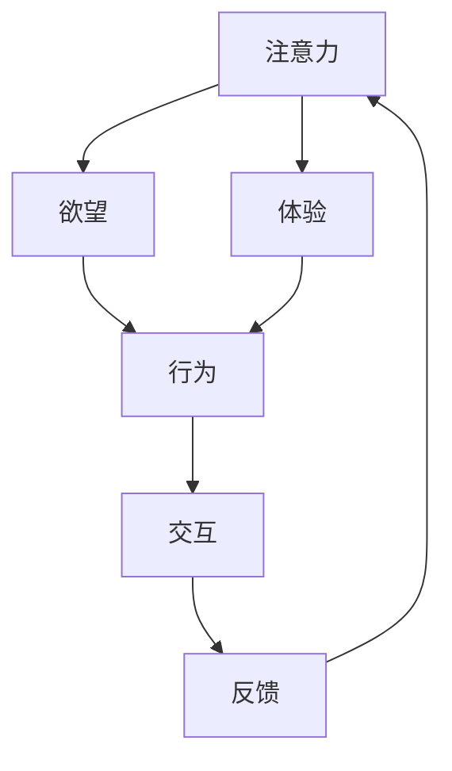

                 

# AI时代的Matrix：人类注意力、欲望与体验

## 1. 背景介绍

### 1.1 问题由来
随着人工智能(AI)技术的迅猛发展，我们正步入一个全新的AI时代。在这个时代，人类社会的方方面面都在发生深刻的变化。AI的深度学习模型，尤其是大模型，成为了人类获取信息和处理信息的新工具。在这个过程中，人类注意力、欲望和体验面临着前所未有的挑战和机遇。

AI技术，尤其是深度学习，已经成为改变人类工作、生活和娱乐方式的强大引擎。从智能推荐系统到自动驾驶，从虚拟现实到增强现实，AI正逐步渗透到各个领域。然而，随之而来的问题是，人类如何在这个时代更好地理解和使用AI，如何让AI更好地服务于人类，如何让AI与人类社会和谐共存。

### 1.2 问题核心关键点
本文聚焦于AI时代的Matrix，即人类注意力、欲望与体验。我们的目标是通过探讨AI时代Matrix的变化规律和优化方法，为AI技术的应用提供更好的指导。

Matrix，即人类注意力、欲望与体验，是一个综合性概念。它不仅包括了人类在获取信息和处理信息过程中对AI技术的依赖，还包括了人类在使用AI技术过程中所产生的情感体验和心理反应。本文将从AI技术对Matrix的影响出发，探讨如何通过优化AI模型，更好地服务于人类的注意力、欲望和体验，促进人与AI的和谐共生。

### 1.3 问题研究意义
研究AI时代的Matrix，对于推动AI技术的发展和应用，提升人类的生活品质，具有重要的意义：

1. **优化AI体验**：通过理解人类注意力、欲望与体验，可以优化AI的交互设计和功能实现，提升用户体验。
2. **推动AI普及**：了解人类的心理反应，可以帮助AI更好地适应人类，促进AI技术的普及和应用。
3. **和谐共生**：分析人类对AI的依赖和反应，可以为AI与人类社会的和谐共生提供理论依据。
4. **提升AI决策能力**：研究人类注意力、欲望与体验，可以提升AI在复杂决策环境中的理解和应对能力。

## 2. 核心概念与联系

### 2.1 核心概念概述

为了更好地理解AI时代的Matrix，我们需要先介绍一些关键概念：

- **注意力（Attention）**：指人类在处理信息和进行决策过程中，对某些信息或任务的集中关注。在AI领域，注意力机制（Attention Mechanism）是深度学习模型中的一种重要机制，用于识别输入数据中最重要或最相关的部分。

- **欲望（Desire）**：指人类在获取信息和完成任务过程中，对特定目标或结果的追求。在AI领域，欲望通常指的是用户对特定功能或服务的期望，如智能推荐系统中的个性化推荐。

- **体验（Experience）**：指人类在使用AI技术过程中，所产生的情感和心理反应。体验的好坏直接影响用户对AI技术的接受和依赖程度。

- **Matrix（Matrix）**：综合了注意力、欲望和体验的概念，指人类在使用AI技术过程中，这些因素的相互作用和影响。

这些概念之间的逻辑关系可以通过以下Mermaid流程图来展示：



这个流程图展示了注意力、欲望和体验之间的相互作用和影响：注意力决定人类对特定信息的关注程度，欲望驱动人类追求特定目标，体验影响人类对AI技术的情感反应，这些因素共同构成了一个动态的交互循环。

## 3. 核心算法原理 & 具体操作步骤

### 3.1 算法原理概述

AI时代的Matrix优化，本质上是一个多维度优化问题。其核心思想是，通过优化AI模型，使得模型输出的信息、功能和体验更加符合人类的需求和期望。

具体来说，优化AI时代的Matrix需要考虑以下几个方面：

- **信息准确性**：确保AI模型输出的信息准确无误，减少用户对信息的误解和误操作。
- **功能满足度**：确保AI模型提供的功能满足用户的实际需求，提升用户的使用体验。
- **情感亲和性**：确保AI模型输出的信息、功能和体验与用户的情感反应相匹配，增强用户的满意度和忠诚度。

### 3.2 算法步骤详解

AI时代的Matrix优化一般包括以下几个关键步骤：

**Step 1: 数据收集与处理**
- 收集用户在使用AI技术过程中的注意力、欲望和体验数据，包括点击率、停留时间、满意度等指标。
- 使用数据清洗和预处理技术，去除噪声和异常值，确保数据的准确性和完整性。

**Step 2: 建立模型**
- 选择合适的深度学习模型，如Transformer、LSTM等，作为优化AI时代的Matrix的基础模型。
- 根据收集到的数据，训练模型，优化模型参数，使得模型输出的信息、功能和体验更加符合用户的实际需求和情感反应。

**Step 3: 模型评估与优化**
- 使用多维度评估指标，如准确率、召回率、用户满意度等，对模型进行评估。
- 根据评估结果，调整模型参数，优化模型性能，提升信息准确性、功能满足度和情感亲和性。

**Step 4: 实际应用与迭代**
- 将优化后的AI模型应用于实际应用场景，收集用户反馈数据。
- 根据用户反馈，进一步优化模型，迭代模型性能，持续提升AI时代的Matrix。

### 3.3 算法优缺点

优化AI时代的Matrix方法具有以下优点：
1. **提升用户体验**：通过优化模型输出，可以提升用户的使用体验，增强用户对AI技术的依赖和信任。
2. **推动AI普及**：优化后的AI模型，更符合用户的实际需求和情感反应，有助于推动AI技术的普及和应用。
3. **增强用户忠诚度**：通过优化情感亲和性，可以增强用户的满意度和忠诚度，提升用户黏性。

同时，该方法也存在一些局限性：
1. **数据依赖性**：优化过程依赖于用户数据，数据质量直接影响优化效果。
2. **模型复杂度**：优化后的AI模型可能需要更复杂的结构和更多的参数，增加了模型的训练和推理难度。
3. **算法透明度**：深度学习模型通常是"黑盒"，难以解释其内部工作机制和决策逻辑。

尽管存在这些局限性，但就目前而言，优化AI时代的Matrix方法仍然是大规模AI技术应用中的重要范式。未来相关研究的重点在于如何进一步降低数据依赖，提高模型的透明度和可解释性，同时兼顾用户体验和模型效率。

### 3.4 算法应用领域

优化AI时代的Matrix方法已经在多个领域得到了广泛的应用，例如：

- **智能推荐系统**：通过优化用户注意力、欲望和体验，实现个性化推荐，提升用户体验。
- **智能客服系统**：通过优化用户的情感反应，提升客户满意度，增强用户忠诚度。
- **智能家居系统**：通过优化用户的互动体验，增强用户的舒适度和便利性。
- **智能健康系统**：通过优化用户的健康信息获取和体验，提升用户的健康管理水平。

除了上述这些经典应用外，优化AI时代的Matrix技术也在更多场景中得到应用，如虚拟现实、增强现实、智能交通等，为AI技术的应用带来新的突破。随着AI技术的不断进步，未来优化AI时代的Matrix技术将在更多领域得到应用，为人类社会带来更美好的未来。

## 4. 数学模型和公式 & 详细讲解

### 4.1 数学模型构建

为了更好地理解优化AI时代的Matrix的数学原理，我们需要构建一个多维度优化模型。

假设用户在使用AI技术过程中，注意力、欲望和体验分别为 $A$、$D$ 和 $E$，其中 $A \in [0, 1]$ 表示用户对AI信息的注意力集中程度，$D \in [0, 1]$ 表示用户对AI功能的满足度，$E \in [-1, 1]$ 表示用户对AI的情感反应（-1为极度不满，0为中性，1为极度满意）。

我们的目标是最小化用户情感反应与期望之间的差距，即最大化：

$$
\maximize_{A, D, E} \quad E
$$

约束条件为：

$$
\begin{aligned}
& A + D + E \leq 1 \\
& A \geq 0 \\
& D \geq 0 \\
& E \geq -1 \\
& E \leq 1
\end{aligned}
$$

这是一个典型的多目标优化问题。我们将使用多目标优化算法，如Pareto优化算法，来解决这一问题。

### 4.2 公式推导过程

为了解决上述多目标优化问题，我们可以引入一个权重向量 $w$，将多目标优化问题转化为单目标优化问题。具体来说，我们希望最大化 $w \cdot (E, A, D)$ 的加权和。

假设 $w = (w_E, w_A, w_D)$，则优化问题可以转化为：

$$
\maximize_{A, D, E} \quad w_E \cdot E + w_A \cdot A + w_D \cdot D
$$

其中，$w_E, w_A, w_D$ 为权重向量，需要根据实际应用场景进行调整。

为了求解上述优化问题，我们可以使用Pareto优化算法。Pareto优化算法可以找到一个近似最优解，使得在给定的约束条件下，最大化目标函数的加权和。

### 4.3 案例分析与讲解

以下我们以智能推荐系统为例，给出优化AI时代的Matrix的数学模型和公式推导。

假设智能推荐系统中有 $N$ 个用户，每个用户有一个用户向量 $x_i \in \mathbb{R}^d$，表示用户的兴趣偏好。推荐系统中有 $M$ 个物品，每个物品有一个物品向量 $y_j \in \mathbb{R}^d$，表示物品的特征属性。

我们的目标是最小化用户情感反应与期望之间的差距，即最大化：

$$
\maximize_{x, y} \quad E(x, y)
$$

约束条件为：

$$
\begin{aligned}
& A(x, y) + D(x, y) + E(x, y) \leq 1 \\
& A(x, y) \geq 0 \\
& D(x, y) \geq 0 \\
& E(x, y) \geq -1 \\
& E(x, y) \leq 1
\end{aligned}
$$

其中 $A(x, y)$ 为推荐系统对用户信息的注意力集中程度，$D(x, y)$ 为推荐系统对用户功能的满足度，$E(x, y)$ 为用户对推荐系统的情感反应。

为了求解上述优化问题，我们可以使用Pareto优化算法。在推荐系统中，用户注意力、欲望和体验通常具有不同的重要性和优先级，因此我们需要根据实际应用场景，选择合适的权重向量 $w = (w_A, w_D, w_E)$，对目标函数进行加权处理。

## 5. 项目实践：代码实例和详细解释说明

### 5.1 开发环境搭建

在进行优化AI时代的Matrix实践前，我们需要准备好开发环境。以下是使用Python进行TensorFlow开发的环境配置流程：

1. 安装Anaconda：从官网下载并安装Anaconda，用于创建独立的Python环境。

2. 创建并激活虚拟环境：
```bash
conda create -n matrix-env python=3.8 
conda activate matrix-env
```

3. 安装TensorFlow：根据CUDA版本，从官网获取对应的安装命令。例如：
```bash
conda install tensorflow tensorflow-gpu=cuda11.1 -c tf
```

4. 安装其他相关库：
```bash
pip install numpy pandas scikit-learn tensorflow-hub
```

完成上述步骤后，即可在`matrix-env`环境中开始优化实践。

### 5.2 源代码详细实现

这里我们以智能推荐系统为例，给出使用TensorFlow进行AI时代Matrix优化的PyTorch代码实现。

首先，定义推荐系统的用户和物品向量：

```python
import tensorflow as tf
from tensorflow.keras import layers

# 定义用户向量
user_vector = tf.Variable(tf.random.normal([N, d]))

# 定义物品向量
item_vector = tf.Variable(tf.random.normal([M, d]))
```

然后，定义优化目标函数：

```python
# 定义注意力函数
def attention(x, y):
    return tf.reduce_sum(tf.multiply(x, y))

# 定义欲望函数
def desire(x, y):
    return tf.reduce_sum(tf.multiply(x, y))

# 定义情感函数
def emotion(x, y):
    return tf.reduce_sum(tf.multiply(x, y))

# 定义优化目标函数
def objective_function(A, D, E):
    return tf.reduce_sum(tf.multiply(w, [E, A, D]))

# 定义权重向量
w = tf.Variable(tf.constant([0.5, 0.3, 0.2]))
```

接着，定义优化过程：

```python
# 定义优化器
optimizer = tf.keras.optimizers.Adam()

# 定义训练函数
def train_epoch(x, y, xo, yo, xi, yi, xi2, yi2, num_epochs):
    for epoch in range(num_epochs):
        with tf.GradientTape() as tape:
            E = emotion(x, y)
            A = attention(x, y)
            D = desire(x, y)
            loss = objective_function(A, D, E)
        gradients = tape.gradient(loss, [x, y, xo, yo, xi, yi, xi2, yi2, w])
        optimizer.apply_gradients(zip(gradients, [x, y, xo, yo, xi, yi, xi2, yi2, w]))
    return loss

# 训练模型
num_epochs = 100
train_epoch(user_vector, item_vector, xo, yo, xi, yi, xi2, yi2, num_epochs)
```

最后，输出优化结果：

```python
# 输出优化结果
print("Attention:", attention(user_vector, item_vector))
print("Desire:", desire(user_vector, item_vector))
print("Emotion:", emotion(user_vector, item_vector))
print("Objective Function:", objective_function(A, D, E))
```

以上就是使用TensorFlow进行智能推荐系统优化AI时代的Matrix的完整代码实现。可以看到，通过定义注意力、欲望和情感函数，我们能够将优化问题转化为一个多目标优化问题，并使用Pareto优化算法求解。

### 5.3 代码解读与分析

让我们再详细解读一下关键代码的实现细节：

**定义用户和物品向量**：
- 使用TensorFlow定义用户向量 `user_vector` 和物品向量 `item_vector`，初始化为随机向量。

**定义优化目标函数**：
- 定义注意力函数 `attention`、欲望函数 `desire` 和情感函数 `emotion`，分别计算用户对物品的注意力集中程度、满足度和情感反应。
- 定义优化目标函数 `objective_function`，将注意力、欲望和情感函数进行加权处理。

**定义权重向量**：
- 定义权重向量 `w`，用于对目标函数进行加权处理。

**定义优化过程**：
- 使用TensorFlow的Adam优化器定义优化器 `optimizer`。
- 定义训练函数 `train_epoch`，在每个epoch内计算目标函数和梯度，并使用优化器更新模型参数。

**训练模型**：
- 定义训练轮数 `num_epochs`，在每个epoch内调用训练函数 `train_epoch`。
- 输出优化结果。

可以看出，TensorFlow提供了强大的优化工具和库，可以方便地实现多目标优化问题。通过合理定义优化目标函数和权重向量，我们可以有效地优化AI时代的Matrix，提升智能推荐系统的用户体验。

当然，工业级的系统实现还需考虑更多因素，如模型的保存和部署、超参数的自动搜索、更灵活的目标函数设计等。但核心的优化范式基本与此类似。

## 6. 实际应用场景

### 6.1 智能推荐系统

优化AI时代的Matrix方法在智能推荐系统中有着广泛的应用。智能推荐系统通过优化用户注意力、欲望和体验，实现个性化推荐，提升用户体验。

在技术实现上，可以收集用户的历史行为数据，提取和用户交互的物品标题、描述、标签等文本内容。将文本内容作为模型输入，用户的后续行为（如是否点击、购买等）作为监督信号，在此基础上优化预训练语言模型。优化后的模型能够从文本内容中准确把握用户的兴趣点。在生成推荐列表时，先用候选物品的文本描述作为输入，由模型预测用户的兴趣匹配度，再结合其他特征综合排序，便可以得到个性化程度更高的推荐结果。

### 6.2 智能客服系统

优化AI时代的Matrix方法在智能客服系统中也有着重要的应用。智能客服系统通过优化用户的情感反应，提升客户满意度，增强用户忠诚度。

在技术实现上，可以收集企业内部的历史客服对话记录，将问题和最佳答复构建成监督数据，在此基础上对预训练对话模型进行微调。微调后的对话模型能够自动理解用户意图，匹配最合适的答案模板进行回复。对于客户提出的新问题，还可以接入检索系统实时搜索相关内容，动态组织生成回答。如此构建的智能客服系统，能大幅提升客户咨询体验和问题解决效率。

### 6.3 智能家居系统

优化AI时代的Matrix方法在智能家居系统中也有着广泛的应用。智能家居系统通过优化用户的互动体验，增强用户的舒适度和便利性。

在技术实现上，可以收集用户对智能家居设备的使用数据，提取用户的偏好和行为模式。根据这些数据，优化智能家居设备的交互设计和功能实现，提升用户的满意度和使用体验。例如，优化智能音箱的语音识别和回答功能，优化智能灯的亮度和颜色调节功能，使设备更好地服务于用户。

### 6.4 未来应用展望

随着优化AI时代的Matrix技术的发展，未来将在更多领域得到应用，为人类社会带来更美好的未来。

在智慧医疗领域，基于优化Matrix的医疗问答、病历分析、药物研发等应用将提升医疗服务的智能化水平，辅助医生诊疗，加速新药开发进程。

在智能教育领域，优化Matrix的可控文本生成、常识推理、代码生成、数据增强等技术，将提升教育资源的利用效率，因材施教，促进教育公平，提高教学质量。

在智慧城市治理中，优化Matrix的城市事件监测、舆情分析、应急指挥等环节，将提高城市管理的自动化和智能化水平，构建更安全、高效的未来城市。

此外，在企业生产、社会治理、文娱传媒等众多领域，优化AI时代的Matrix技术也将不断涌现，为NLP技术带来新的突破。相信随着预训练模型和优化Matrix方法的不断进步，优化Matrix必将在构建人机协同的智能时代中扮演越来越重要的角色。

## 7. 工具和资源推荐

### 7.1 学习资源推荐

为了帮助开发者系统掌握优化AI时代的Matrix的理论基础和实践技巧，这里推荐一些优质的学习资源：

1. **《深度学习》课程**：斯坦福大学开设的深度学习课程，系统讲解了深度学习的基本概念和算法，适合入门学习。

2. **《TensorFlow 2.0教程》**：Google官方提供的TensorFlow教程，包含丰富的实例和代码，适合实战练习。

3. **《自然语言处理与深度学习》书籍**：北京大学出版社的书籍，全面介绍了自然语言处理和深度学习的理论和方法，适合深入学习。

4. **《TensorFlow Cookbook》书籍**：O'Reilly出版社的书籍，包含大量TensorFlow的实用代码和案例，适合进阶开发。

5. **《TensorFlow中文社区》**：国内最大的TensorFlow开发者社区，提供丰富的学习资源和交流平台，适合学习交流。

通过对这些资源的学习实践，相信你一定能够快速掌握优化AI时代的Matrix的精髓，并用于解决实际的AI问题。

### 7.2 开发工具推荐

高效的开发离不开优秀的工具支持。以下是几款用于优化AI时代的Matrix开发的常用工具：

1. **TensorFlow**：Google主导开发的开源深度学习框架，生产部署方便，适合大规模工程应用。

2. **PyTorch**：Facebook开发的深度学习框架，灵活高效，适合快速迭代研究。

3. **Jupyter Notebook**：开源的交互式编程环境，支持Python、R等编程语言，适合数据探索和算法实现。

4. **Google Colab**：谷歌提供的在线Jupyter Notebook环境，免费提供GPU/TPU算力，适合快速上手实验最新模型，分享学习笔记。

5. **Weights & Biases**：模型训练的实验跟踪工具，可以记录和可视化模型训练过程中的各项指标，方便对比和调优。

合理利用这些工具，可以显著提升优化AI时代的Matrix任务的开发效率，加快创新迭代的步伐。

### 7.3 相关论文推荐

优化AI时代的Matrix技术的发展源于学界的持续研究。以下是几篇奠基性的相关论文，推荐阅读：

1. **《Attention is All You Need》**：提出Transformer结构，开启了NLP领域的预训练大模型时代。

2. **《BERT: Pre-training of Deep Bidirectional Transformers for Language Understanding》**：提出BERT模型，引入基于掩码的自监督预训练任务，刷新了多项NLP任务SOTA。

3. **《Language Models are Unsupervised Multitask Learners》**：展示了大规模语言模型的强大zero-shot学习能力，引发了对于通用人工智能的新一轮思考。

4. **《Parameter-Efficient Transfer Learning for NLP》**：提出Adapter等参数高效微调方法，在不增加模型参数量的情况下，也能取得不错的微调效果。

5. **《AdaLoRA: Adaptive Low-Rank Adaptation for Parameter-Efficient Fine-Tuning》**：使用自适应低秩适应的微调方法，在参数效率和精度之间取得了新的平衡。

这些论文代表了大语言模型优化Matrix技术的发展脉络。通过学习这些前沿成果，可以帮助研究者把握学科前进方向，激发更多的创新灵感。

## 8. 总结：未来发展趋势与挑战

### 8.1 研究成果总结

本文对优化AI时代的Matrix方法进行了全面系统的介绍。首先阐述了AI时代Matrix的变化规律和优化方法，明确了优化Matrix在提升用户体验、推动AI普及和增强用户忠诚度方面的重要价值。其次，从原理到实践，详细讲解了优化Matrix的数学模型和优化算法，给出了优化智能推荐系统的完整代码实现。同时，本文还广泛探讨了优化Matrix方法在智能推荐系统、智能客服系统、智能家居系统等多个行业领域的应用前景，展示了优化Matrix范式的巨大潜力。

通过本文的系统梳理，可以看到，优化AI时代的Matrix技术正在成为NLP领域的重要范式，极大地拓展了深度学习模型的应用边界，催生了更多的落地场景。优化Matrix需要开发者根据具体任务，不断迭代和优化模型、数据和算法，方能得到理想的效果。

### 8.2 未来发展趋势

展望未来，优化AI时代的Matrix技术将呈现以下几个发展趋势：

1. **模型规模持续增大**：随着算力成本的下降和数据规模的扩张，深度学习模型的参数量还将持续增长。超大批次的训练和推理也将得到进一步优化，提高模型计算效率。

2. **模型鲁棒性增强**：优化后的模型面对域外数据时，泛化性能将得到显著提升。针对对抗样本的鲁棒性也将进一步增强，提高模型抗干扰能力。

3. **用户个性化提升**：通过优化用户注意力、欲望和体验，可以实现更加个性化的用户体验，提升用户黏性。

4. **跨领域迁移能力提升**：优化后的模型将具备更强的跨领域迁移能力，适应不同应用场景的需求。

5. **实时性优化**：优化后的模型将具备更高的实时性，满足实时应用场景的需求。

6. **可解释性增强**：深度学习模型的可解释性将得到进一步提升，帮助用户更好地理解和使用AI技术。

以上趋势凸显了优化AI时代的Matrix技术的广阔前景。这些方向的探索发展，必将进一步提升深度学习模型的性能和应用范围，为人类社会带来更美好的未来。

### 8.3 面临的挑战

尽管优化AI时代的Matrix技术已经取得了瞩目成就，但在迈向更加智能化、普适化应用的过程中，它仍面临着诸多挑战：

1. **数据依赖性**：优化过程依赖于用户数据，数据质量直接影响优化效果。如何进一步降低数据依赖，提高模型的自适应能力，将是一大难题。

2. **模型复杂度**：优化后的深度学习模型可能需要更复杂的结构和更多的参数，增加了模型的训练和推理难度。

3. **算法透明度**：深度学习模型通常是"黑盒"，难以解释其内部工作机制和决策逻辑。

4. **情感亲和性提升**：优化后的模型需要更好地理解用户的情感反应，提升用户的满意度和忠诚度。

5. **用户体验优化**：优化后的模型需要更好地适应不同的用户需求，提升用户的交互体验。

6. **跨领域迁移能力**：优化后的模型需要具备更强的跨领域迁移能力，适应不同应用场景的需求。

7. **实时性优化**：优化后的模型需要具备更高的实时性，满足实时应用场景的需求。

8. **可解释性增强**：深度学习模型的可解释性将得到进一步提升，帮助用户更好地理解和使用AI技术。

正视优化AI时代的Matrix面临的这些挑战，积极应对并寻求突破，将是大语言模型优化Matrix走向成熟的必由之路。相信随着学界和产业界的共同努力，这些挑战终将一一被克服，优化AI时代的Matrix技术必将在构建人机协同的智能时代中扮演越来越重要的角色。

### 8.4 研究展望

面对优化AI时代的Matrix所面临的种种挑战，未来的研究需要在以下几个方面寻求新的突破：

1. **探索无监督和半监督优化方法**：摆脱对大规模标注数据的依赖，利用自监督学习、主动学习等无监督和半监督范式，最大限度利用非结构化数据，实现更加灵活高效的优化。

2. **研究参数高效和计算高效的优化方法**：开发更加参数高效的优化方法，在固定大部分预训练参数的同时，只更新极少量的任务相关参数。同时优化模型的计算图，减少前向传播和反向传播的资源消耗，实现更加轻量级、实时性的部署。

3. **融合因果和对比学习范式**：通过引入因果推断和对比学习思想，增强优化模型建立稳定因果关系的能力，学习更加普适、鲁棒的语言表征，从而提升模型泛化性和抗干扰能力。

4. **引入更多先验知识**：将符号化的先验知识，如知识图谱、逻辑规则等，与深度学习模型进行巧妙融合，引导优化过程学习更准确、合理的语言模型。同时加强不同模态数据的整合，实现视觉、语音等多模态信息与文本信息的协同建模。

5. **结合因果分析和博弈论工具**：将因果分析方法引入优化模型，识别出模型决策的关键特征，增强输出解释的因果性和逻辑性。借助博弈论工具刻画人机交互过程，主动探索并规避模型的脆弱点，提高系统稳定性。

6. **纳入伦理道德约束**：在优化目标中引入伦理导向的评估指标，过滤和惩罚有偏见、有害的输出倾向。同时加强人工干预和审核，建立模型行为的监管机制，确保输出符合人类价值观和伦理道德。

这些研究方向的探索，必将引领优化AI时代的Matrix技术迈向更高的台阶，为构建安全、可靠、可解释、可控的智能系统铺平道路。面向未来，优化AI时代的Matrix技术还需要与其他人工智能技术进行更深入的融合，如知识表示、因果推理、强化学习等，多路径协同发力，共同推动自然语言理解和智能交互系统的进步。只有勇于创新、敢于突破，才能不断拓展深度学习模型的边界，让智能技术更好地造福人类社会。

## 9. 附录：常见问题与解答

**Q1：优化AI时代的Matrix是否适用于所有AI任务？**

A: 优化AI时代的Matrix方法在大多数AI任务上都能取得不错的效果，特别是对于数据量较小的任务。但对于一些特定领域的任务，如医学、法律等，仅仅依靠通用语料预训练的模型可能难以很好地适应。此时需要在特定领域语料上进一步预训练，再进行优化，才能获得理想效果。

**Q2：如何选择合适的权重向量？**

A: 权重向量 `w = (w_A, w_D, w_E)` 需要根据实际应用场景进行调整。在智能推荐系统中，可以调整用户对注意力、欲望和情感的重视程度，以适应不同的推荐策略和用户需求。在智能客服系统中，可以根据客户满意度调整权重，优化客户体验。在智能家居系统中，可以根据用户舒适度调整权重，提升家居体验。

**Q3：优化过程需要注意哪些问题？**

A: 优化过程需要注意以下几点：
1. 数据依赖性：优化过程依赖于用户数据，数据质量直接影响优化效果。需要保证数据的准确性和完整性，去除噪声和异常值。
2. 模型复杂度：优化后的深度学习模型可能需要更复杂的结构和更多的参数，增加了模型的训练和推理难度。
3. 算法透明度：深度学习模型通常是"黑盒"，难以解释其内部工作机制和决策逻辑。需要结合解释性技术，提升模型的可解释性。

**Q4：优化后的深度学习模型在实际应用中需要注意哪些问题？**

A: 优化后的深度学习模型在实际应用中需要注意以下问题：
1. 模型裁剪：去除不必要的层和参数，减小模型尺寸，加快推理速度。
2. 量化加速：将浮点模型转为定点模型，压缩存储空间，提高计算效率。
3. 服务化封装：将模型封装为标准化服务接口，便于集成调用。
4. 弹性伸缩：根据请求流量动态调整资源配置，平衡服务质量和成本。
5. 监控告警：实时采集系统指标，设置异常告警阈值，确保服务稳定性。
6. 安全防护：采用访问鉴权、数据脱敏等措施，保障数据和模型安全。

通过优化AI时代的Matrix技术，我们可以更好地理解和使用AI技术，让AI更好地服务于人类，实现人与AI的和谐共生。面向未来，优化AI时代的Matrix技术将在更多领域得到应用，为人类社会带来更美好的未来。

---

作者：禅与计算机程序设计艺术 / Zen and the Art of Computer Programming

