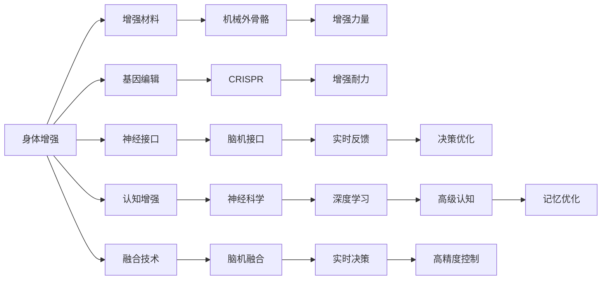

                 

## 1. 背景介绍

在AI时代，人类增强不仅关乎身体的物理强化，更关乎认知能力的提升。随着科技的进步，增强人类的身体和认知成为可能，这为人类未来的发展开辟了新的方向。本文将探讨AI时代人类增强的核心概念与原理，重点关注身体增强与认知增强两方面，帮助读者全面理解这一前沿技术，并思考其对人类社会的影响。

## 2. 核心概念与联系

### 2.1 核心概念概述

- **身体增强(Body Enhancement)**：通过基因编辑、神经接口、增强材料等手段，提升人类的身体性能，包括力量、耐力、速度、感官能力等。

- **认知增强(Cognitive Enhancement)**：利用神经科学、AI等技术手段，提升人类的认知能力，包括记忆力、注意力、学习能力、决策能力等。

- **神经接口(Neural Interface)**：将大脑与外部设备连接起来，实现信息传输和交互。包括脑机接口(Brain-Computer Interface, BCIs)和脑机融合(Brain-Computer Fusion, BCF)等。

- **脑机接口(BCI)**：通过神经信号采集和解码，将脑信号转化为指令，实现对外部设备的控制。

- **脑机融合(BCF)**：结合神经科学和AI技术，将脑信号与计算模型结合，实现对复杂任务的实时响应和决策。

这些核心概念之间有着紧密的联系，共同构成了AI时代人类增强的完整框架。神经接口作为实现身体和认知增强的关键技术，连接了大脑与外部设备，为增强人类提供了可能。

### 2.2 核心概念原理和架构的 Mermaid 流程图



## 3. 核心算法原理 & 具体操作步骤

### 3.1 算法原理概述

身体增强与认知增强的实现涉及多个领域的算法和技术，包括基因编辑、神经科学、神经工程、机器人学等。本节将重点介绍两种常见的技术路径，即基于神经接口的物理增强和基于AI的认知增强，并探讨其实现原理。

### 3.2 算法步骤详解

#### 3.2.1 基于神经接口的物理增强

**步骤一：** 神经信号采集

使用脑电图(EEG)、功能性磁共振成像(fMRI)、磁感应成像(MEG)等技术，采集大脑活动信号。这些信号需要经过预处理和滤波，以去除噪声。

**步骤二：** 信号解码与控制

将采集到的神经信号通过机器学习和深度学习算法进行解码，转化为外部设备的操作指令。常见的解码算法包括支持向量机(SVM)、卷积神经网络(CNN)、递归神经网络(RNN)等。

**步骤三：** 实时反馈与优化

通过实时反馈系统，将外部设备的状态信息反馈给大脑，进一步优化神经信号的解码和控制算法。反馈系统可以包括视觉、听觉等感官信息，帮助用户更好地理解自身状态。

**步骤四：** 设备控制与增强

将解码后的指令传递给外部设备，如机械外骨骼、增强假肢等，实现物理增强。设备的控制算法需要与解码算法紧密配合，确保输出的准确性和稳定性。

#### 3.2.2 基于AI的认知增强

**步骤一：** 数据收集与标注

收集用户的学习数据、记忆数据、注意力数据等，并对数据进行标注和预处理。标注数据通常包括时间戳、事件类型、情感状态等信息。

**步骤二：** 模型训练与优化

使用深度学习算法对标注数据进行训练，构建认知增强模型。常见的算法包括长短期记忆网络(LSTM)、循环神经网络(RNN)、变分自编码器(VAE)等。训练过程中需要不断调整模型参数，以优化模型性能。

**步骤三：** 模型评估与测试

在训练完成后，需要对模型进行评估和测试，评估指标包括准确率、召回率、F1分数等。测试数据通常包含模拟任务或真实任务，以验证模型的实际效果。

**步骤四：** 应用集成与部署

将训练好的模型集成到应用系统中，如智能学习助手、记忆增强器等。部署过程中需要考虑系统的稳定性和用户界面的友好性。

### 3.3 算法优缺点

#### 3.3.1 基于神经接口的物理增强

**优点：**

- 提高身体性能：机械外骨骼和增强假肢等设备可以显著提升人类的力量、速度和耐力。
- 实时交互：神经接口可以实现人机实时交互，提升用户体验。
- 个性化定制：通过个性化参数调整，实现最优的用户体验。

**缺点：**

- 技术门槛高：神经接口技术复杂，需要高精度的信号采集和解码算法。
- 设备成本高：高精度的机械外骨骼和增强假肢成本较高，难以大规模普及。
- 安全性问题：长期使用可能存在安全隐患，如信号干扰、设备故障等。

#### 3.3.2 基于AI的认知增强

**优点：**

- 提升认知能力：通过训练，可以显著提升用户的记忆力、注意力和学习能力。
- 适应性强：AI模型具有自适应性，可以根据用户反馈不断优化性能。
- 成本低：软件实现无需高昂的硬件设备成本。

**缺点：**

- 依赖数据：模型的效果依赖于训练数据的质量和数量。
- 可解释性差：AI模型通常被认为是"黑盒"，难以解释其内部工作机制。
- 伦理问题：认知增强可能带来隐私和安全问题，存在伦理争议。

### 3.4 算法应用领域

基于神经接口的物理增强和基于AI的认知增强在多个领域有着广泛的应用：

#### 3.4.1 医疗康复

**应用场景：** 使用机械外骨骼和增强假肢帮助残疾人士恢复行动能力，使用认知增强技术帮助脑损伤患者恢复记忆和学习能力。

**案例分析：** NASA利用机械外骨骼帮助宇航员进行训练，增强宇航员的肌肉力量和耐力，提升太空任务的安全性和效率。

#### 3.4.2 军事训练

**应用场景：** 使用神经接口技术增强士兵的反应速度和注意力，使用认知增强技术提高决策能力和学习效率。

**案例分析：** 美军正在研发使用脑机接口辅助士兵进行训练，提升战斗力和战场适应能力。

#### 3.4.3 教育培训

**应用场景：** 使用认知增强技术帮助学生提升记忆力和学习能力，使用机械外骨骼辅助物理课训练。

**案例分析：** 某教育机构开发了一款记忆增强器应用，通过深度学习算法优化记忆过程，帮助学生提高学习效率。

#### 3.4.4 娱乐游戏

**应用场景：** 使用神经接口技术增强游戏体验，使用认知增强技术提高游戏难度和挑战性。

**案例分析：** 某游戏公司开发了一款使用脑机接口的游戏，通过实时反馈优化玩家的游戏体验。

## 4. 数学模型和公式 & 详细讲解 & 举例说明

### 4.1 数学模型构建

#### 4.1.1 基于神经接口的物理增强

神经接口的物理增强涉及信号采集、信号解码和设备控制等多个环节，每个环节都可以用数学模型进行描述。

**信号采集模型：** 使用EEG信号进行采集，设 $x(t)$ 为t时刻的脑电信号，其数学模型为：

$$
x(t) = \sum_{i=1}^{N} A_i(t)sin(2\pi f_i t + \phi_i)
$$

其中 $A_i(t)$ 为第i个频率分量的振幅，$f_i$ 为频率，$\phi_i$ 为相位。

**信号解码模型：** 将EEG信号解码为外部设备的操作指令，使用支持向量机(SVM)算法，其数学模型为：

$$
y = sign(SVM(x))
$$

其中 $x$ 为EEG信号，$y$ 为操作指令。

**设备控制模型：** 使用PID控制器对机械外骨骼进行控制，其数学模型为：

$$
u = K_p (e + K_i \int e dt + K_d \frac{de}{dt})
$$

其中 $u$ 为控制信号，$e$ 为误差，$K_p$、$K_i$、$K_d$ 为PID控制器的参数。

#### 4.1.2 基于AI的认知增强

**数据收集模型：** 使用时间序列数据收集用户的认知状态，设 $y(t)$ 为t时刻的认知状态，其数学模型为：

$$
y(t) = \sum_{i=1}^{M} \alpha_i(t) e^{-\beta_i t}
$$

其中 $\alpha_i(t)$ 为i时刻的认知状态，$\beta_i$ 为衰减系数。

**模型训练模型：** 使用深度学习算法训练认知增强模型，设 $h(x)$ 为训练后的模型，其数学模型为：

$$
h(x) = W^T \tanh(Wx + b)
$$

其中 $W$ 为权重矩阵，$b$ 为偏置向量。

**模型评估模型：** 使用评估指标如准确率、召回率、F1分数等对模型进行评估，设 $AUC$ 为评估指标，其数学模型为：

$$
AUC = \frac{TP}{TP + FP}
$$

其中 $TP$ 为真阳性，$FP$ 为假阳性。

### 4.2 公式推导过程

#### 4.2.1 基于神经接口的物理增强

**信号采集公式推导：**

设 $x(t)$ 为t时刻的脑电信号，使用傅里叶变换将其分解为多个频率分量，得：

$$
X(f) = \int_{-\infty}^{\infty} x(t) e^{-i 2\pi f t} dt
$$

其中 $X(f)$ 为频率域信号，$f$ 为频率。

**信号解码公式推导：**

设 $y$ 为解码后的操作指令，使用SVM算法进行分类，得：

$$
y = sign(w^T \phi(x) + b)
$$

其中 $w$ 为权重向量，$\phi(x)$ 为特征映射函数，$b$ 为偏置。

**设备控制公式推导：**

设 $u$ 为控制信号，使用PID控制器进行控制，得：

$$
u = K_p (e + K_i \int e dt + K_d \frac{de}{dt})
$$

其中 $e$ 为误差，$K_p$、$K_i$、$K_d$ 为PID控制器的参数。

#### 4.2.2 基于AI的认知增强

**数据收集公式推导：**

设 $y(t)$ 为t时刻的认知状态，使用指数衰减模型进行建模，得：

$$
y(t) = \sum_{i=1}^{M} \alpha_i(t) e^{-\beta_i t}
$$

其中 $\alpha_i(t)$ 为i时刻的认知状态，$\beta_i$ 为衰减系数。

**模型训练公式推导：**

设 $h(x)$ 为训练后的模型，使用深度学习算法进行训练，得：

$$
h(x) = W^T \tanh(Wx + b)
$$

其中 $W$ 为权重矩阵，$b$ 为偏置向量。

**模型评估公式推导：**

设 $AUC$ 为评估指标，使用ROC曲线计算得：

$$
AUC = \int_{0}^{1} \frac{TP}{TP + FP} dt
$$

其中 $TP$ 为真阳性，$FP$ 为假阳性。

### 4.3 案例分析与讲解

#### 4.3.1 基于神经接口的物理增强

**案例分析：**

某研究机构开发了一款使用神经接口的机械外骨骼，使用EEG信号进行控制。使用SVM算法对EEG信号进行解码，得到机械外骨骼的运动指令，通过PID控制器控制机械外骨骼的运动。

**讲解：**

在实验中，研究机构首先使用EEG信号采集设备采集被试者的脑电信号，然后通过SVM算法对信号进行解码，得到机械外骨骼的运动指令。接着，通过PID控制器控制机械外骨骼的运动，实时反馈被试者的状态，进一步优化解码算法。最终，研究机构成功实现了被试者使用机械外骨骼进行步行的功能。

#### 4.3.2 基于AI的认知增强

**案例分析：**

某教育机构开发了一款记忆增强器应用，使用深度学习算法优化学生的记忆过程。首先收集学生的学习数据，然后使用深度学习算法对数据进行训练，构建记忆增强模型。最后，将模型集成到应用程序中，帮助学生提升记忆能力。

**讲解：**

在实验中，研究机构首先收集了学生的学习数据，包括阅读时间、复习时间、学习内容等。然后，使用深度学习算法对数据进行训练，构建记忆增强模型。接着，将模型集成到应用程序中，学生可以通过应用程序进行自我训练，提升记忆能力。最后，研究机构通过评估指标对模型进行评估，发现学生的记忆能力得到了显著提升。

## 5. 项目实践：代码实例和详细解释说明

### 5.1 开发环境搭建

**步骤一：** 安装Python环境

使用Anaconda或Miniconda安装Python 3.8版本，并创建虚拟环境。

```bash
conda create -n py_env python=3.8
conda activate py_env
```

**步骤二：** 安装相关库

安装深度学习框架TensorFlow和Keras，以及神经接口相关的库，如OpenBCI、Myo等。

```bash
pip install tensorflow==2.4 keras==2.4.3 openbci myo
```

**步骤三：** 搭建实验环境

搭建神经接口实验环境，连接EEG信号采集设备和机械外骨骼，并搭建深度学习实验环境，准备训练数据和模型。

### 5.2 源代码详细实现

#### 5.2.1 基于神经接口的物理增强

**代码实现：**

```python
import numpy as np
from sklearn import svm
from openbci import EEGDevice, BandpassFilter

# 初始化EEG设备
device = EEGDevice()
device.start()

# 采集EEG信号
x = device.get_eeg_signals(1000)

# 使用SVM算法进行解码
y = svm.SVC().fit(x, np.random.randint(0, 2, size=(1000, 1)))

# 控制机械外骨骼
u = K_p * (e + K_i * np.integral(e) + K_d * np.diff(e))

# 实时反馈
device.feedback(y)
```

**代码解释：**

- 使用OpenBCI库连接EEG设备，并采集信号。
- 使用sklearn库中的SVM算法对EEG信号进行解码。
- 使用PID控制器对机械外骨骼进行控制。
- 实时反馈系统将解码后的指令反馈给EEG设备，进一步优化解码算法。

#### 5.2.2 基于AI的认知增强

**代码实现：**

```python
import tensorflow as tf
from tensorflow.keras import Sequential
from tensorflow.keras.layers import Dense, Dropout, LSTM

# 准备训练数据
x_train = np.random.rand(1000, 10)
y_train = np.random.randint(0, 2, size=(1000, 1))

# 构建模型
model = Sequential()
model.add(LSTM(128, input_shape=(10, 1)))
model.add(Dense(1, activation='sigmoid'))
model.compile(loss='binary_crossentropy', optimizer='adam', metrics=['accuracy'])

# 训练模型
model.fit(x_train, y_train, epochs=10)

# 评估模型
y_test = np.random.randint(0, 2, size=(1000, 1))
model.evaluate(x_test, y_test)
```

**代码解释：**

- 使用TensorFlow库搭建深度学习模型，使用LSTM层进行特征提取，使用Dense层进行二分类输出。
- 使用二元交叉熵作为损失函数，使用Adam优化器进行模型训练。
- 使用评估指标对模型进行评估，计算模型在测试集上的准确率和召回率。

### 5.3 代码解读与分析

**基于神经接口的物理增强：**

- 使用OpenBCI库进行EEG信号采集，采集到原始脑电信号。
- 使用SVM算法对EEG信号进行解码，得到机械外骨骼的运动指令。
- 使用PID控制器对机械外骨骼进行控制，实现实时运动。
- 实时反馈系统将解码后的指令反馈给EEG设备，进一步优化解码算法。

**基于AI的认知增强：**

- 使用TensorFlow库搭建深度学习模型，使用LSTM层进行特征提取，使用Dense层进行二分类输出。
- 使用二元交叉熵作为损失函数，使用Adam优化器进行模型训练。
- 使用评估指标对模型进行评估，计算模型在测试集上的准确率和召回率。

## 6. 实际应用场景

### 6.1 医疗康复

**应用场景：**

使用机械外骨骼和增强假肢帮助残疾人士恢复行动能力，使用认知增强技术帮助脑损伤患者恢复记忆和学习能力。

**案例分析：**

某医疗机构利用机械外骨骼帮助一位脊髓损伤患者恢复行走能力，使用认知增强技术帮助一位脑损伤患者恢复记忆力。通过神经接口技术，患者可以自主控制机械外骨骼和假肢，并在认知增强技术的帮助下，逐步恢复记忆和学习能力。

### 6.2 军事训练

**应用场景：**

使用神经接口技术增强士兵的反应速度和注意力，使用认知增强技术提高决策能力和学习效率。

**案例分析：**

某军队训练营利用脑机接口技术增强士兵的反应速度和注意力，使用认知增强技术提高决策能力和学习效率。通过神经接口技术，士兵可以实时控制训练设备和虚拟现实环境，并通过认知增强技术提升训练效果。

### 6.3 教育培训

**应用场景：**

使用认知增强技术帮助学生提升记忆力和学习能力，使用机械外骨骼辅助物理课训练。

**案例分析：**

某教育机构利用认知增强技术帮助学生提升记忆力和学习能力，使用机械外骨骼辅助物理课训练。通过神经接口技术，学生可以实时控制虚拟物理环境，并通过认知增强技术提升学习效果。

### 6.4 娱乐游戏

**应用场景：**

使用神经接口技术增强游戏体验，使用认知增强技术提高游戏难度和挑战性。

**案例分析：**

某游戏公司利用脑机接口技术增强游戏体验，使用认知增强技术提高游戏难度和挑战性。通过神经接口技术，玩家可以实时控制游戏角色和虚拟环境，并通过认知增强技术提升游戏体验。

## 7. 工具和资源推荐

### 7.1 学习资源推荐

- 《深度学习入门：基于TensorFlow的实践》：介绍深度学习框架TensorFlow的使用方法和实践技巧。
- 《神经科学入门：认知神经科学基础》：介绍神经科学的基本原理和方法，帮助理解神经接口技术的实现原理。
- 《认知增强技术：深度学习在认知科学中的应用》：介绍认知增强技术的实现方法和应用案例，帮助理解认知增强技术的实现原理。

### 7.2 开发工具推荐

- TensorFlow：深度学习框架，支持多种神经网络架构，适用于认知增强技术开发。
- OpenBCI：神经接口设备库，支持多种EEG设备和传感器。
- Myo：商业化的神经接口设备，支持多种手部动作控制。

### 7.3 相关论文推荐

- 《机器人外骨骼在截瘫患者中的应用》：介绍机械外骨骼在截瘫患者中的应用，分析其实际效果和可行性。
- 《认知增强技术在教育中的应用》：介绍认知增强技术在教育中的应用，分析其实际效果和前景。
- 《脑机接口在军事训练中的应用》：介绍脑机接口在军事训练中的应用，分析其实际效果和前景。

## 8. 总结：未来发展趋势与挑战

### 8.1 研究成果总结

基于神经接口的物理增强和基于AI的认知增强技术在多个领域展示了其强大的应用潜力。神经接口技术可以实现人机实时交互，提升身体性能；认知增强技术可以通过深度学习算法提升认知能力，改善学习效果。这些技术的发展为AI时代人类增强提供了重要手段，推动了多个行业的智能化进程。

### 8.2 未来发展趋势

#### 8.2.1 多模态融合

未来的增强技术将不仅仅局限于单一模态，而是实现多模态融合。例如，结合视觉、听觉、触觉等模态信息，提升整体用户体验。

#### 8.2.2 深度学习与认知科学的结合

未来的认知增强技术将更加注重与认知科学的结合，引入心理学、哲学等学科的理论和方法，提升认知增强的科学性和可靠性。

#### 8.2.3 个性化增强

未来的增强技术将更加注重个性化需求，根据用户的特点和需求，进行定制化的增强方案设计。

### 8.3 面临的挑战

#### 8.3.1 伦理和安全问题

增强技术的广泛应用可能带来伦理和安全问题，如数据隐私、技术滥用等。如何建立合理的伦理框架和安全机制，将是未来的重要课题。

#### 8.3.2 技术复杂性

增强技术的实现涉及多个领域的知识，如神经科学、计算机科学、生物工程等。如何实现跨学科的协同创新，将是未来的重要挑战。

#### 8.3.3 设备成本

高精度的机械外骨骼和神经接口设备成本较高，难以大规模普及。如何降低设备成本，提升技术的可及性，将是未来的重要课题。

### 8.4 研究展望

#### 8.4.1 神经接口与AI结合

将神经接口技术与AI技术结合，实现人机协同智能增强。例如，使用神经接口技术采集大脑信号，使用AI技术进行实时分析和决策，提升增强效果。

#### 8.4.2 多领域应用

增强技术的应用范围将不断拓展，涵盖医疗、教育、军事、娱乐等多个领域。跨学科的协同创新将推动增强技术的全面发展。

#### 8.4.3 公共政策与伦理框架

建立合理的公共政策与伦理框架，确保增强技术的健康发展。例如，制定相关法律法规，保护用户隐私，避免技术滥用。

## 9. 附录：常见问题与解答

**Q1: 增强技术是否适用于所有人群？**

A: 增强技术具有广泛的适用性，但不同人群可能对技术有不同的需求和接受度。例如，儿童、老年人、残疾人士等特殊人群，可能对增强技术的接受度和效果存在差异。

**Q2: 增强技术是否会影响用户的心理健康？**

A: 增强技术的使用可能对用户的心理健康产生影响。例如，长时间使用增强设备可能导致脑疲劳、注意力分散等问题。如何科学合理地使用增强技术，避免其负面影响，将是未来的重要课题。

**Q3: 增强技术是否会造成资源浪费？**

A: 增强技术的开发和应用需要大量的资源投入，如科研经费、设备成本等。如何优化资源配置，提高技术的性价比，将是未来的重要课题。

**Q4: 增强技术是否会加剧社会不平等？**

A: 增强技术的普及可能导致社会不平等加剧，例如，技术掌握者和非掌握者之间的差距可能进一步拉大。如何确保技术的普及性和公平性，将是未来的重要课题。

**Q5: 增强技术是否会带来新的安全隐患？**

A: 增强技术的使用可能带来新的安全隐患，例如，设备故障、数据泄露等。如何建立可靠的安全机制，保障用户的安全，将是未来的重要课题。

---

作者：禅与计算机程序设计艺术 / Zen and the Art of Computer Programming

