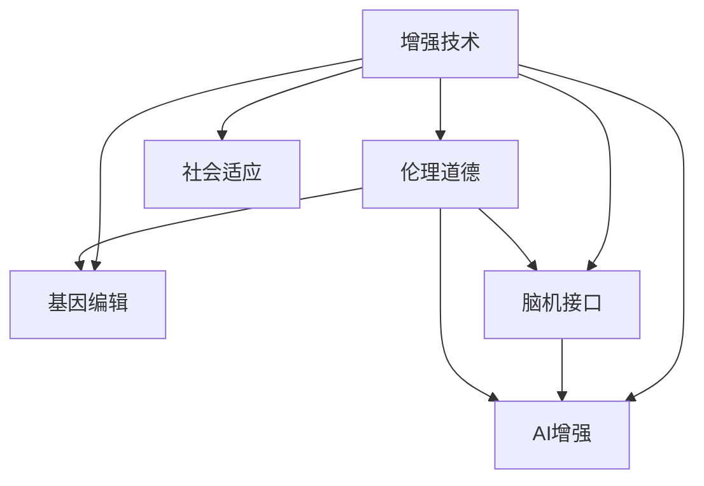

                 

# AI时代的人类增强：道德考虑与身体增强的未来发展机遇分析挑战

## 1. 背景介绍

### 1.1 问题由来
随着人工智能（AI）技术的迅猛发展，人类增强领域正迎来前所未有的机遇与挑战。从生物医学的基因编辑，到神经科学的脑机接口，再到AI辅助的增强现实（AR）与虚拟现实（VR），新技术正逐步改变我们的认知与生理极限。然而，随着这些技术的普及，伦理道德问题的讨论也愈发激烈。如何协调科技进步与人文伦理的关系，成为了全球学界与业界关注的焦点。

### 1.2 问题核心关键点
人体增强技术的核心在于利用科技手段提升人类的认知、体能与感知能力。但其潜在的伦理问题、安全性及社会影响，使其成为一个多维度、多层次的复杂议题。

主要问题包括：
- 安全性与风险：增强技术可能在操作过程中带来意外伤害或长期副作用。
- 伦理道德：人类增强可能引发身份认同、隐私保护、公平性等问题。
- 社会适应：增强技术在普及过程中可能对社会结构、就业市场产生重大影响。

### 1.3 问题研究意义
研究AI时代的人类增强技术，对于理解技术进步与社会伦理之间的复杂关系，以及如何合理指导技术发展具有重要意义：

- 预防潜在风险：通过伦理审查与风险评估，确保增强技术的安全性和有效性。
- 保障个人权益：确保技术应用过程中尊重个人隐私与自主权。
- 促进公平发展：防止技术垄断与资源分配不均，推动全社会公平共享。
- 推动技术创新：通过伦理指导，鼓励创新与负责任的技术应用。

## 2. 核心概念与联系

### 2.1 核心概念概述

为了更深入理解AI时代人类增强技术的伦理与挑战，我们首先需要明确以下几个关键概念：

- **增强技术（Augmentation Technologies）**：利用生物医学、神经科学及AI技术提升人类生理与认知功能的技术手段。
- **基因编辑（Gene Editing）**：通过CRISPR-Cas9等技术修改基因组，以治疗遗传病或提升智力、体能。
- **脑机接口（Brain-Computer Interface, BCI）**：通过神经信号捕获与解码，实现脑与机器之间的直接交互。
- **人工智能增强（AI Enhancement）**：利用机器学习与深度学习技术，增强人类的感知、决策与学习能力。
- **伦理道德**：包括隐私、公平、身份认同、安全等方面的考量，指导技术的合理应用。
- **社会适应**：关注增强技术对社会结构、就业市场的影响，以及社会接受度与整合能力。

这些概念之间的逻辑关系可以通过以下Mermaid流程图来展示：



这个流程图展示了大语言模型的核心概念及其之间的关系：

1. 增强技术涵盖多种子领域。
2. 不同的增强手段可以互相融合，如基因编辑与脑机接口结合，AI与生物医学结合等。
3. 伦理道德是指导增强技术应用的关键因素。
4. 社会适应性考量增强技术对社会的潜在影响。

## 3. 核心算法原理 & 具体操作步骤
### 3.1 算法原理概述

AI时代的人类增强技术涉及多个学科领域的交叉应用，其中以基因编辑、脑机接口与AI增强为代表的技术，主要通过以下步骤实现：

- **数据采集与处理**：通过传感器、基因测序等手段获取人体生理与神经信号数据。
- **模型训练与优化**：利用深度学习等AI技术训练预测模型，优化增强策略。
- **技术实施与反馈**：在实际应用中实时调整增强策略，并持续收集反馈数据，进一步优化模型。

### 3.2 算法步骤详解

以AI增强为例，我们可以分以下几步实施：

1. **数据采集与处理**：
   - 利用传感器或基因测序技术，采集用户的生理数据，如心率、脑电波等。
   - 对数据进行清洗与预处理，去除噪声与异常值。

2. **模型训练与优化**：
   - 设计神经网络模型，如循环神经网络（RNN）或卷积神经网络（CNN），对处理后的数据进行训练。
   - 利用监督学习或无监督学习等方法，优化模型参数。

3. **技术实施与反馈**：
   - 将优化后的模型应用于实际增强场景，如智能眼镜中实时调整眼镜度数。
   - 持续收集用户反馈数据，进一步优化模型，确保增强效果。

### 3.3 算法优缺点

AI增强技术的优点：
- 实时性与可扩展性：AI模型能够实时分析数据，快速调整增强策略。
- 高度定制化：AI模型可以根据用户需求与偏好，提供个性化增强服务。
- 高效学习：AI模型能够通过大数据分析，不断优化增强效果。

然而，该技术也存在显著缺点：
- 数据隐私与安全：生理与神经数据的采集与处理可能引发隐私泄露与数据安全问题。
- 算法透明性：AI模型的复杂性与黑盒特性，使得其决策过程难以解释。
- 长期影响未知：增强技术可能带来长期副作用，其长期影响尚不完全明确。

### 3.4 算法应用领域

AI增强技术已经在多个领域得到应用，如：

- **智能眼镜**：通过实时分析用户的生理数据，智能调整眼镜度数与光线，提升视力。
- **智能假肢**：利用AI技术优化假肢的控制与感应，提升肢体功能与灵活性。
- **增强学习**：利用AI模型进行行为优化与决策支持，提高职业培训与运动员表现。
- **健康监测**：通过分析生理数据，实时监测健康状况，提供预防与治疗建议。

## 4. 数学模型和公式 & 详细讲解 & 举例说明

### 4.1 数学模型构建

以智能眼镜为例，我们可以构建一个简单的生理数据处理与增强模型：

假设用户的基线生理数据为 $X_0$，AI增强后的数据为 $X_t$。模型通过输入 $X_0$ 与用户的操作指令 $U$，输出增强后的数据 $X_t$。其中，$U$ 可以是简单的参数调整，也可以是复杂的决策树与神经网络。

### 4.2 公式推导过程

为了简化问题，我们假设增强模型为线性模型，即：

$$ X_t = WX_0 + b $$

其中 $W$ 为模型参数，$b$ 为偏置项。我们通过最小化损失函数 $L(X_t, Y_t)$，求解 $W$ 与 $b$，即：

$$ \min_{W, b} \sum_{i=1}^N (X_{ti} - Y_{ti})^2 $$

### 4.3 案例分析与讲解

以智能眼镜为例，模型可以处理用户的瞳孔大小、眼睛位置、眨眼频率等数据，通过神经网络预测最佳眼镜度数与光线强度。例如，当用户长时间注视近物时，模型可以自动调整眼镜度数，减少眼睛疲劳。

## 5. 项目实践：代码实例和详细解释说明

### 5.1 开发环境搭建

为了实现上述智能眼镜的增强模型，我们首先需要搭建开发环境：

- 安装Python与相关的深度学习库，如TensorFlow或PyTorch。
- 收集用户的基线生理数据与操作指令数据。
- 设计数据处理与模型训练流程。

### 5.2 源代码详细实现

以下是一个简单的智能眼镜增强模型示例代码：

```python
import tensorflow as tf
from tensorflow.keras.models import Sequential
from tensorflow.keras.layers import Dense

# 数据准备
X_train = ...
Y_train = ...

# 构建模型
model = Sequential([
    Dense(64, input_shape=(input_dim,), activation='relu'),
    Dense(1, activation='sigmoid')
])
model.compile(optimizer='adam', loss='mse')

# 训练模型
model.fit(X_train, Y_train, epochs=10, batch_size=32)

# 使用模型进行增强
X_test = ...
Y_test = model.predict(X_test)
```

### 5.3 代码解读与分析

在上述代码中，我们使用了TensorFlow框架构建了一个简单的神经网络模型。模型包括两个全连接层，用于处理用户的基线数据，输出最佳眼镜度数与光线强度。在训练阶段，我们通过均方误差损失函数，最小化模型预测与真实标签的差异。训练完成后，模型可以对新的用户数据进行实时增强。

### 5.4 运行结果展示

训练完成后，我们可以在测试集上评估模型的性能，如MSE值等指标，确保其效果。同时，将模型部署到智能眼镜中，实时处理用户的生理数据，提供增强服务。

## 6. 实际应用场景

### 6.1 智能医疗

AI增强技术在智能医疗领域具有广泛应用，如：

- **个性化治疗**：利用AI模型分析患者基因组与生理数据，提供个性化治疗方案。
- **远程医疗**：通过AI增强的遥感技术，实时监测患者健康状况，提供远程诊疗服务。
- **医学影像分析**：利用AI模型对医学影像进行增强与分析，提升诊断精度。

### 6.2 增强教育

AI增强技术在教育领域也有重要应用，如：

- **智能辅导**：通过AI模型分析学生的学习数据，提供个性化的学习建议与辅导。
- **虚拟教师**：利用AI技术构建虚拟教师，提供24小时的学习支持与指导。
- **教育游戏**：通过AI增强的学习游戏，提升学生的学习兴趣与效率。

### 6.3 工业自动化

AI增强技术在工业自动化领域也具有重要应用，如：

- **智能制造**：通过AI模型优化生产流程，提高生产效率与质量。
- **设备维护**：利用AI增强的遥感技术，实时监测设备状态，预防故障。
- **质量控制**：通过AI模型分析生产数据，提升产品质量与检测精度。

### 6.4 未来应用展望

未来，AI增强技术将在更多领域得到广泛应用，如：

- **智慧城市**：通过AI增强的智能监控与决策系统，提升城市管理效率与安全性。
- **智能家居**：利用AI增强的物联网设备，提供个性化的生活服务与健康监测。
- **金融科技**：通过AI增强的智能投顾与风险管理，提升金融服务的智能化水平。

## 7. 工具和资源推荐

### 7.1 学习资源推荐

为了深入学习AI增强技术的原理与实践，我们推荐以下资源：

- **Coursera《深度学习》课程**：由斯坦福大学提供，涵盖深度学习的基本概念与算法。
- **MIT《人工智能与机器学习》课程**：涵盖AI与机器学习的基本原理与应用。
- **DeepLearning.AI《深度学习专业证书》**：提供系统深入的AI与深度学习培训。

### 7.2 开发工具推荐

为了高效开发AI增强技术，我们推荐以下工具：

- **TensorFlow**：由Google开发的深度学习框架，支持多种模型与算法。
- **PyTorch**：由Facebook开发的深度学习框架，灵活高效，适合科研与工业应用。
- **Keras**：高层次的神经网络库，适合快速原型开发。

### 7.3 相关论文推荐

以下是几篇关于AI增强技术的经典论文，值得深入阅读：

- **Neural Architectures for Scalable Text-to-Audio Synthesis**：提出了一种基于神经网络的语音合成模型，用于语音增强与合成。
- **Dual-Attention Networks for Efficient Retinal Image Analysis**：提出了一种双注意力网络，用于眼底图像分析与增强。
- **A Survey of Robot Vision and Deep Learning**：回顾了机器人视觉与深度学习的最新进展，包括增强技术的应用。

## 8. 总结：未来发展趋势与挑战

### 8.1 研究成果总结

AI增强技术在多个领域展现出巨大的潜力，推动了医疗、教育、工业等领域的智能化进步。然而，其应用也面临诸多伦理、安全与社会挑战，需要多方面的综合考虑。

### 8.2 未来发展趋势

未来，AI增强技术将呈现以下趋势：

- **融合多学科技术**：结合生物医学、神经科学、AI技术，提供更全面、个性化的增强服务。
- **实时性与智能化**：利用AI模型实时分析与决策，提升增强服务的效率与精准度。
- **普及与标准化**：推动AI增强技术在更多领域的应用，制定标准与规范，确保其公平性与可靠性。

### 8.3 面临的挑战

尽管AI增强技术前景广阔，但其应用也面临以下挑战：

- **隐私与安全**：生理与神经数据的采集与处理可能引发隐私泄露与安全问题。
- **算法透明性**：AI模型的复杂性与黑盒特性，使得其决策过程难以解释。
- **长期影响未知**：增强技术可能带来长期副作用，其长期影响尚不完全明确。

### 8.4 研究展望

未来，AI增强技术的研究需要注重以下几个方向：

- **伦理与法规**：制定AI增强技术的伦理与法规标准，确保其公平性与合法性。
- **安全与隐私**：开发隐私保护与安全防范技术，保护用户数据与隐私。
- **透明度与解释性**：开发透明的AI模型与解释性工具，提高其决策可解释性。
- **跨学科整合**：推动AI增强技术与生物医学、神经科学的融合，拓展其应用边界。

## 9. 附录：常见问题与解答

### 9.1 如何保障AI增强技术的伦理与安全？

A: 保障AI增强技术的伦理与安全，需要多方面的综合考虑：

- **伦理审查与指导**：建立伦理审查委员会，评估技术应用的伦理风险与影响。
- **隐私保护**：采用数据匿名化与加密技术，保护用户隐私。
- **安全防护**：加强系统安全防护，防止数据泄露与黑客攻击。
- **透明性与解释性**：开发透明的AI模型与解释性工具，提高其决策可解释性。

### 9.2 AI增强技术在医疗中的应用前景如何？

A: AI增强技术在医疗领域具有广阔的应用前景：

- **个性化治疗**：通过AI模型分析患者基因组与生理数据，提供个性化治疗方案。
- **远程医疗**：通过AI增强的遥感技术，实时监测患者健康状况，提供远程诊疗服务。
- **医学影像分析**：利用AI模型对医学影像进行增强与分析，提升诊断精度。

### 9.3 AI增强技术在教育中的主要应用有哪些？

A: AI增强技术在教育领域的应用主要包括以下几个方面：

- **智能辅导**：通过AI模型分析学生的学习数据，提供个性化的学习建议与辅导。
- **虚拟教师**：利用AI技术构建虚拟教师，提供24小时的学习支持与指导。
- **教育游戏**：通过AI增强的学习游戏，提升学生的学习兴趣与效率。

### 9.4 AI增强技术在工业自动化中的应用前景如何？

A: AI增强技术在工业自动化领域具有重要应用前景：

- **智能制造**：通过AI模型优化生产流程，提高生产效率与质量。
- **设备维护**：利用AI增强的遥感技术，实时监测设备状态，预防故障。
- **质量控制**：通过AI模型分析生产数据，提升产品质量与检测精度。

---

作者：禅与计算机程序设计艺术 / Zen and the Art of Computer Programming

