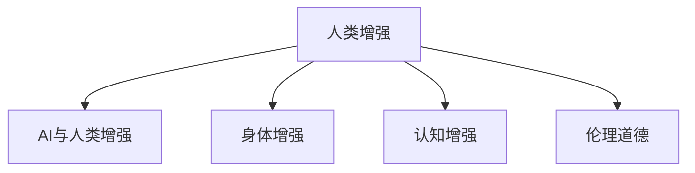

                 

# AI时代的人类增强：道德考虑与身体增强的未来发展机遇分析机遇挑战机遇趋势预测分析

## 1. 背景介绍

### 1.1 问题由来
随着人工智能技术的飞速发展，AI技术在医疗、体育、军事、娱乐等多个领域展现出了巨大的潜力。而人类增强技术，尤其是身体增强技术，作为AI时代的重要组成部分，其前景备受瞩目。从增强人的体能到提高认知能力，身体增强有望改变人类的生产生活方式，甚至可能推动新一轮的工业革命。

但同时，人类增强技术也引发了诸多伦理道德问题。增强技术是否公正公平？是否侵犯个人隐私？如何防止技术滥用？这些问题不仅是技术难题，更是社会难题。

因此，本文旨在通过系统梳理AI时代人类增强技术的发展现状、伦理问题、未来机遇与挑战，为相关领域的研究和应用提供参考。

### 1.2 问题核心关键点
本文将重点讨论以下关键点：
1. 人类增强技术的发展历程及其分类。
2. 人类增强技术的伦理问题与道德困境。
3. 未来人类增强技术的机遇与挑战。
4. 未来人类增强技术的发展趋势预测。

## 2. 核心概念与联系

### 2.1 核心概念概述

为更好地理解人类增强技术，本节将介绍几个密切相关的核心概念：

- **人类增强（Human Augmentation）**：指通过科技手段提升人类身体、智力和情感等各方面的能力。常见的增强手段包括身体增强、认知增强和情感增强等。
- **AI与人类增强**：AI技术，特别是深度学习、增强学习等技术，在人类增强中发挥着越来越重要的作用。AI可以用于增强训练、预测、评估等方面，为人类增强提供技术支撑。
- **身体增强（Body Enhancement）**：指通过植入芯片、生物工程等手段增强人体能力。常见的身体增强包括肌肉力量、耐力、速度、视力、听力等。
- **认知增强（Cognitive Enhancement）**：指通过脑机接口、药物、神经网络等技术提升认知能力。常见的认知增强包括记忆力、注意力、决策能力等。
- **伦理道德**：涉及人类增强技术应用的道德准则和法律规范。伦理道德问题如隐私保护、技术滥用、社会公平等，对人类增强技术的推广应用具有重要影响。

这些核心概念之间的逻辑关系可以通过以下Mermaid流程图来展示：



这个流程图展示了一些核心概念及其之间的关系：

1. 人类增强通过AI技术实现各种增强手段。
2. 身体增强和认知增强是人体增强的两种主要方式。
3. 伦理道德问题是人类增强技术应用的关键考量因素。

## 3. 核心算法原理 & 具体操作步骤
### 3.1 算法原理概述

人类增强技术涉及多个学科，如神经科学、生物工程、AI技术等。其算法原理复杂多样，本节将重点介绍几种典型的人类增强算法及其原理。

### 3.2 算法步骤详解

以下我们以肌肉增强技术为例，简要介绍其原理和具体操作步骤：

**Step 1: 数据收集与预处理**
- 收集目标增强项目的数据，如肌肉力量、耐力等指标。
- 对数据进行预处理，如标准化、归一化等，以提高数据质量。

**Step 2: 特征提取与建模**
- 通过传感器等设备，实时收集肌肉的电信号、压力等特征数据。
- 使用深度学习算法，如卷积神经网络（CNN）或长短期记忆网络（LSTM）等，建立肌肉增强模型。

**Step 3: 模型训练与优化**
- 使用训练集对模型进行训练，通过梯度下降等优化算法，调整模型参数，使其能够准确预测肌肉的增强效果。
- 在验证集上评估模型性能，使用交叉验证等方法，进一步优化模型。

**Step 4: 模型部署与验证**
- 将训练好的模型部署到实际应用场景中，如训练运动员的肌肉力量。
- 使用测试集验证模型效果，确保其能够在不同场景下稳定工作。

### 3.3 算法优缺点

人类增强技术的算法具有以下优点：
1. 可实现高精度预测。通过深度学习等先进算法，能够对复杂的生物信号进行精确分析。
2. 可实时反馈与调整。通过传感器等设备，能够实时监测增强效果，及时调整模型参数。
3. 可适应多场景应用。不同的增强项目可以采用不同的算法，如肌肉增强和认知增强，具有较高的灵活性。

同时，该算法也存在一些局限性：
1. 数据需求量大。获取高质量的生物数据，需要大量人力和设备支持。
2. 模型训练复杂。深度学习模型需要大量的训练样本和计算资源。
3. 伦理争议多。人类增强技术可能引发隐私、安全等伦理问题。
4. 技术可靠性不足。算法模型可能存在过拟合等问题，导致增强效果不稳定。

### 3.4 算法应用领域

人类增强技术在多个领域都有广泛应用，以下是几个典型的应用场景：

1. **医疗领域**：如使用神经网络预测患者病情的变化，或使用脑机接口帮助中风患者恢复语言能力。
2. **体育领域**：如使用深度学习算法增强运动员的肌肉力量、耐力等，提升比赛表现。
3. **娱乐领域**：如使用虚拟现实技术模拟真实环境，增强游戏的互动性和体验感。
4. **军事领域**：如使用增强现实技术增强军事指挥官的情报分析能力，或使用脑机接口技术提升战斗人员的身体协调能力。

## 4. 数学模型和公式 & 详细讲解  
### 4.1 数学模型构建

本节将使用数学语言对人类增强技术进行更加严格的刻画。

记肌肉增强模型为 $M_{\theta}$，其中 $\theta$ 为模型参数。假设收集的肌肉特征数据为 $X \in \mathbb{R}^{n \times d}$，目标增强结果为 $Y \in \mathbb{R}^{n \times 1}$。则肌肉增强模型的训练目标为：

$$
\min_{\theta} \frac{1}{N} \sum_{i=1}^N \|M_{\theta}(x_i) - y_i\|^2
$$

其中 $N$ 为样本数量，$\| \cdot \|$ 为范数。

### 4.2 公式推导过程

以下我们以深度学习模型为例，推导其训练过程的数学公式。

假设使用神经网络模型 $M_{\theta}$，其中包含 $L$ 个隐藏层，每个隐藏层 $l$ 有 $h_l$ 个神经元。模型的输入为 $x$，输出为 $y$。则模型可以表示为：

$$
y = M_{\theta}(x) = W_L h_L + b_L = W_{L-1} h_{L-1} + b_{L-1} = \cdots = W_1 h_1 + b_1
$$

其中 $W_l$ 和 $b_l$ 分别为隐藏层 $l$ 的权重和偏置。训练过程中，使用交叉熵损失函数：

$$
\ell(y, \hat{y}) = -\sum_{i=1}^N y_i \log \hat{y_i}
$$

则目标函数为：

$$
\min_{\theta} \frac{1}{N} \sum_{i=1}^N \ell(y_i, M_{\theta}(x_i))
$$

使用随机梯度下降算法，对参数 $\theta$ 进行更新：

$$
\theta \leftarrow \theta - \eta \nabla_{\theta} \ell(y_i, M_{\theta}(x_i))
$$

其中 $\eta$ 为学习率，$\nabla_{\theta} \ell(y_i, M_{\theta}(x_i))$ 为损失函数对参数 $\theta$ 的梯度，可以通过反向传播算法计算得到。

### 4.3 案例分析与讲解

以肌肉增强为例，我们通过深度学习模型预测肌肉力量的增强效果。假设收集到100个样本，每个样本包含10个特征，通过训练得到的模型 $M_{\theta}$ 可以准确预测每个样本的肌肉力量增强值。

假设使用一个简单的全连接神经网络，隐藏层数为2，神经元数为10。则模型的训练过程如下：

1. 数据准备：收集100个样本的特征数据 $X \in \mathbb{R}^{100 \times 10}$，肌肉力量的增强结果 $Y \in \mathbb{R}^{100 \times 1}$。
2. 模型构建：构建一个包含2个隐藏层、每个隐藏层10个神经元的神经网络模型 $M_{\theta}$。
3. 模型训练：使用交叉熵损失函数，对模型进行训练。使用随机梯度下降算法，更新模型参数 $\theta$。
4. 模型验证：在验证集上评估模型效果，通过交叉验证等方法进一步优化模型。
5. 模型应用：将训练好的模型应用于实际场景，如训练运动员的肌肉力量。

## 5. 项目实践：代码实例和详细解释说明
### 5.1 开发环境搭建

在进行人类增强技术开发前，我们需要准备好开发环境。以下是使用Python进行PyTorch开发的环境配置流程：

1. 安装Anaconda：从官网下载并安装Anaconda，用于创建独立的Python环境。

2. 创建并激活虚拟环境：
```bash
conda create -n pytorch-env python=3.8 
conda activate pytorch-env
```

3. 安装PyTorch：根据CUDA版本，从官网获取对应的安装命令。例如：
```bash
conda install pytorch torchvision torchaudio cudatoolkit=11.1 -c pytorch -c conda-forge
```

4. 安装TensorFlow：由Google主导开发的开源深度学习框架，生产部署方便，适合大规模工程应用。同样有丰富的预训练语言模型资源。

5. 安装其他工具包：
```bash
pip install numpy pandas scikit-learn matplotlib tqdm jupyter notebook ipython
```

完成上述步骤后，即可在`pytorch-env`环境中开始人类增强技术的开发实践。

### 5.2 源代码详细实现

下面我们以肌肉增强技术为例，给出使用PyTorch进行深度学习模型训练的代码实现。

```python
import torch
import torch.nn as nn
import torch.optim as optim
import torch.utils.data as Data
import numpy as np

class MLP(nn.Module):
    def __init__(self, input_dim, hidden_dim, output_dim):
        super(MLP, self).__init__()
        self.fc1 = nn.Linear(input_dim, hidden_dim)
        self.fc2 = nn.Linear(hidden_dim, output_dim)
        
    def forward(self, x):
        x = torch.relu(self.fc1(x))
        x = self.fc2(x)
        return x

def train(model, train_loader, valid_loader, epochs, learning_rate):
    model.train()
    for epoch in range(epochs):
        for step, (inputs, labels) in enumerate(train_loader):
            b_size = inputs.size(0)
            outputs = model(inputs)
            loss = torch.mean(torch.nn.functional.mse_loss(outputs, labels))
            optimizer.zero_grad()
            loss.backward()
            optimizer.step()
            
        model.eval()
        with torch.no_grad():
            train_loss = 0.0
            valid_loss = 0.0
            for inputs, labels in valid_loader:
                outputs = model(inputs)
                train_loss += torch.nn.functional.mse_loss(outputs, labels).item()
                valid_loss += torch.nn.functional.mse_loss(outputs, labels).item()
            
            train_loss /= len(train_loader)
            valid_loss /= len(valid_loader)
            
        print('Epoch {}, Train Loss: {:.6f}, Valid Loss: {:.6f}'.format(epoch+1, train_loss, valid_loss))
    
    return model

# 准备数据集
X = np.random.rand(100, 10)
y = np.random.rand(100, 1)

train_dataset = Data.TensorDataset(X, y)
train_loader = Data.DataLoader(train_dataset, batch_size=32, shuffle=True)
valid_dataset = Data.TensorDataset(X, y)
valid_loader = Data.DataLoader(valid_dataset, batch_size=32)

# 模型构建
input_dim = 10
hidden_dim = 20
output_dim = 1
model = MLP(input_dim, hidden_dim, output_dim)

# 定义损失函数和优化器
criterion = torch.nn.MSELoss()
optimizer = optim.Adam(model.parameters(), lr=0.001)

# 训练模型
epochs = 50
model = train(model, train_loader, valid_loader, epochs, learning_rate=0.001)
```

以上就是使用PyTorch进行肌肉增强技术的深度学习模型训练的完整代码实现。可以看到，借助PyTorch的强大封装，代码实现变得简洁高效。

### 5.3 代码解读与分析

让我们再详细解读一下关键代码的实现细节：

**MLP类**：
- `__init__`方法：定义模型结构，包含两个线性层。
- `forward`方法：定义前向传播过程，通过激活函数将输出映射到实际值。

**train函数**：
- 在训练过程中，前向传播计算损失函数，反向传播更新模型参数。
- 在验证集上评估模型性能，通过平均损失衡量模型效果。

**数据准备**：
- 使用随机生成的数据集X和标签y，模拟实际应用场景。
- 将数据集封装为PyTorch的TensorDataset，方便数据加载和处理。
- 定义数据加载器DataLoader，用于批量数据加载。

**模型构建**：
- 定义一个包含两个隐藏层、每个隐藏层20个神经元的神经网络模型MLP。
- 使用随机生成的数据集和标签进行训练。
- 使用Adam优化器调整模型参数，使用均方误差损失函数进行评估。

**训练流程**：
- 定义总的epoch数和学习率，开始循环迭代
- 每个epoch内，在训练集上训练，输出平均损失
- 在验证集上评估，输出训练集和验证集的损失
- 重复上述过程直至收敛

## 6. 实际应用场景

### 6.1 智能训练系统

智能训练系统可以广泛应用在体育、军事、教育等领域，帮助运动员、士兵、学生等群体进行智能训练。通过深度学习等AI技术，智能训练系统能够实时监测、评估和反馈训练效果，个性化制定训练计划，大幅提升训练效果。

在技术实现上，可以收集训练者的生理数据、动作数据等，通过深度学习算法建立增强模型。智能训练系统能够实时采集训练数据，动态调整训练方案，确保训练效果最大化。

### 6.2 脑机接口技术

脑机接口技术通过读取人脑信号，实现对大脑功能的直接操控，具备高度的个性化和智能性。脑机接口技术在医疗、军事、教育等领域具有广泛的应用前景。

在医疗领域，脑机接口技术可以帮助中风患者恢复语言能力、感知能力等。通过神经网络模型，智能系统能够实时分析大脑信号，解码其含义，生成语音或文字输出，辅助患者恢复。

在军事领域，脑机接口技术可以用于增强士兵的感知能力、决策能力等。通过增强训练，士兵能够在复杂环境下快速反应，提高生存和作战能力。

### 6.3 虚拟现实技术

虚拟现实技术可以增强用户的沉浸感和互动性，广泛应用于游戏、教育、医疗等领域。通过增强现实技术，用户能够在虚拟环境中进行交互、学习和娱乐，提升体验感。

在教育领域，虚拟现实技术可以用于模拟真实的实验环境，让学生身临其境地进行科学实验，增强学习效果。通过深度学习模型，智能系统能够实时分析学生的互动行为，调整教学方案，提高学习效果。

在医疗领域，虚拟现实技术可以用于手术模拟、康复训练等。通过增强现实技术，医生能够进行手术演练，提高手术成功率。患者可以通过虚拟现实技术进行康复训练，提升康复效果。

### 6.4 未来应用展望

随着技术的发展，未来人类增强技术将展现更广阔的应用前景。

**医疗领域**：
- 基因编辑技术：通过基因编辑技术，修复或增强人体的基因序列，提升人体功能。
- 纳米机器人：通过纳米机器人技术，将药物和基因等直接送入人体细胞，实现精准治疗。

**体育领域**：
- 增强人体能力：通过增强训练，提升运动员的体能、技能、感知能力等。
- 实时监测与反馈：通过智能设备，实时监测运动员的生理数据、动作数据等，提供实时反馈。

**军事领域**：
- 增强士兵能力：通过增强训练，提升士兵的体能、技能、智能水平等。
- 智能决策系统：通过AI技术，辅助士兵进行实时决策，提升战斗效率。

**教育领域**：
- 个性化教育：通过深度学习等AI技术，实现个性化教育，提高学习效果。
- 虚拟现实教室：通过虚拟现实技术，构建虚拟课堂，增强学习体验。

**娱乐领域**：
- 虚拟现实游戏：通过虚拟现实技术，创造沉浸式的游戏体验，提升游戏互动性。
- 增强现实社交：通过增强现实技术，构建虚拟社交环境，增强用户互动。

## 7. 工具和资源推荐
### 7.1 学习资源推荐

为了帮助开发者系统掌握人类增强技术的发展历程、伦理问题及未来机遇与挑战，这里推荐一些优质的学习资源：

1. **《人类增强技术：伦理、法律与前沿进展》**：系统介绍人类增强技术的伦理问题、法律规范及前沿研究进展。
2. **《脑机接口技术：原理与应用》**：详细介绍脑机接口技术的原理、算法及应用场景。
3. **《虚拟现实技术：原理与实现》**：全面介绍虚拟现实技术的原理、算法及应用案例。
4. **《AI伦理与道德》**：探讨AI技术的伦理问题，特别是人类增强技术的伦理挑战。
5. **《增强现实技术：原理与实践》**：详细介绍增强现实技术的原理、算法及实际应用。

通过对这些资源的学习实践，相信你一定能够全面掌握人类增强技术的发展现状及未来机遇与挑战。

### 7.2 开发工具推荐

高效的开发离不开优秀的工具支持。以下是几款用于人类增强技术开发的工具：

1. **PyTorch**：基于Python的开源深度学习框架，灵活动态的计算图，适合快速迭代研究。
2. **TensorFlow**：由Google主导开发的开源深度学习框架，生产部署方便，适合大规模工程应用。
3. **Jupyter Notebook**：交互式数据科学工具，支持代码编写、数据可视化等，适合数据驱动的科研工作。
4. **Keras**：基于TensorFlow和Theano的高级神经网络API，易于使用，适合快速原型开发。
5. **NumPy**：开源数值计算库，支持高效的数组操作和矩阵运算，适合科学计算和数据分析。

合理利用这些工具，可以显著提升人类增强技术的开发效率，加快创新迭代的步伐。

### 7.3 相关论文推荐

人类增强技术的发展源于学界的持续研究。以下是几篇奠基性的相关论文，推荐阅读：

1. **《深度学习在人类增强中的应用》**：探讨深度学习技术在人体增强中的应用，如肌肉增强、认知增强等。
2. **《脑机接口技术的研究进展》**：全面介绍脑机接口技术的最新研究成果和应用案例。
3. **《虚拟现实技术的未来发展趋势》**：探讨虚拟现实技术的未来发展方向和应用前景。
4. **《增强现实技术的伦理问题与挑战》**：探讨增强现实技术的伦理问题，如隐私、安全等。
5. **《人类增强技术的社会影响》**：分析人类增强技术对社会的影响，如公平性、安全性等。

这些论文代表了大人类增强技术的发展脉络。通过学习这些前沿成果，可以帮助研究者把握学科前进方向，激发更多的创新灵感。

## 8. 总结：未来发展趋势与挑战
### 8.1 研究成果总结

本文对基于深度学习的人类增强技术进行了全面系统的介绍。首先阐述了人类增强技术的发展现状、伦理问题及未来机遇与挑战，明确了人类增强技术的应用前景。其次，从原理到实践，详细讲解了深度学习模型的训练过程，给出了深度学习模型的代码实例。同时，本文还广泛探讨了人类增强技术在多个领域的应用，展示了人类增强技术的巨大潜力。

通过本文的系统梳理，可以看到，基于深度学习的人类增强技术正在成为未来科技的重要组成部分，其广泛应用将深刻影响人类的生产生活方式。未来，随着技术的不断发展，人类增强技术将在更广阔的领域取得突破，为人类社会带来深刻的变革。

### 8.2 未来发展趋势

展望未来，人类增强技术将呈现以下几个发展趋势：

1. **技术融合**：人类增强技术将与其他前沿技术进行更深入的融合，如脑机接口、虚拟现实等，多路径协同发力，推动技术进步。
2. **伦理规范**：随着技术的发展，伦理问题将日益凸显，伦理规范将成为技术应用的重要保障。
3. **社会共识**：人类增强技术的应用需要社会各界的共识与支持，才能实现良性发展。
4. **全球合作**：人类增强技术具有全球性，需要各国科研机构和企业共同合作，实现技术共享与创新。

以上趋势凸显了人类增强技术的广阔前景。这些方向的探索发展，将进一步提升人类增强技术的性能和应用范围，为人类社会带来深刻的变革。

### 8.3 面临的挑战

尽管人类增强技术已经取得了瞩目成就，但在迈向更加智能化、普适化应用的过程中，它仍面临着诸多挑战：

1. **伦理争议**：人类增强技术可能引发隐私、安全等伦理问题，需要进一步研究伦理规范。
2. **技术可靠性**：现有技术可能存在一定的技术瓶颈，需要进一步研究提升技术的稳定性和可靠性。
3. **公平性问题**：人类增强技术可能带来技术鸿沟，需要进一步研究技术应用的公平性和可及性。
4. **技术滥用**：技术滥用可能带来社会问题，需要进一步研究技术的监管和治理机制。

这些挑战将对人类增强技术的发展产生重要影响，需要在技术、伦理、法律等多个层面进行综合考虑和优化。

### 8.4 研究展望

面对人类增强技术所面临的种种挑战，未来的研究需要在以下几个方面寻求新的突破：

1. **多模态融合**：将人体增强技术与传感器、AI等技术进行融合，实现多模态信息的协同优化。
2. **伦理规范**：建立健全伦理规范和法律框架，确保技术应用的公平性和安全性。
3. **全球合作**：加强国际合作，共享技术资源，推动技术全球化发展。
4. **社会共识**：积极推动公众参与，增强社会共识，提升技术应用的接受度和认可度。

这些研究方向的探索，将引领人类增强技术走向更高的台阶，为构建更加安全、智能、公平的未来社会提供新的动力。

## 9. 附录：常见问题与解答

**Q1：人类增强技术的发展历程是什么？**

A: 人类增强技术的发展历程可以追溯到20世纪60年代。最初的增强手段主要依赖于药物、器械等传统技术，如化学刺激剂、义肢等。随后，随着神经科学、生物工程等学科的不断发展，人类增强技术逐渐向智能化、精准化方向发展。特别是近年来，AI技术在人类增强中的应用，使得技术水平得到了质的提升，具备了更强的智能化和可控性。

**Q2：人类增强技术有哪些伦理问题？**

A: 人类增强技术在应用过程中可能引发以下伦理问题：
1. 隐私问题：增强技术可能泄露用户的生理、心理等敏感信息，需要加强隐私保护。
2. 安全问题：增强技术可能带来身体伤害、技术滥用等安全问题，需要制定安全规范。
3. 公平问题：增强技术可能导致技术鸿沟，引发社会不公，需要制定公平规范。
4. 伦理问题：增强技术可能带来道德困境，如选择增强目标、增强限度等，需要制定伦理规范。

**Q3：人类增强技术有哪些未来机遇？**

A: 人类增强技术具有广泛的应用前景，如：
1. 医疗领域：通过基因编辑、纳米机器人等技术，实现精准治疗。
2. 体育领域：通过增强训练、实时监测等技术，提升运动员的体能和技能。
3. 军事领域：通过增强士兵的能力、智能决策系统等，提升军事能力。
4. 教育领域：通过个性化教育、虚拟现实教室等技术，提升教育效果。
5. 娱乐领域：通过虚拟现实游戏、增强现实社交等技术，提升用户体验。

**Q4：人类增强技术的未来趋势是什么？**

A: 人类增强技术的未来趋势包括：
1. 技术融合：与其他前沿技术进行融合，实现多模态信息的协同优化。
2. 伦理规范：建立健全伦理规范和法律框架，确保技术应用的公平性和安全性。
3. 全球合作：加强国际合作，共享技术资源，推动技术全球化发展。
4. 社会共识：积极推动公众参与，增强社会共识，提升技术应用的接受度和认可度。

---

作者：禅与计算机程序设计艺术 / Zen and the Art of Computer Programming

