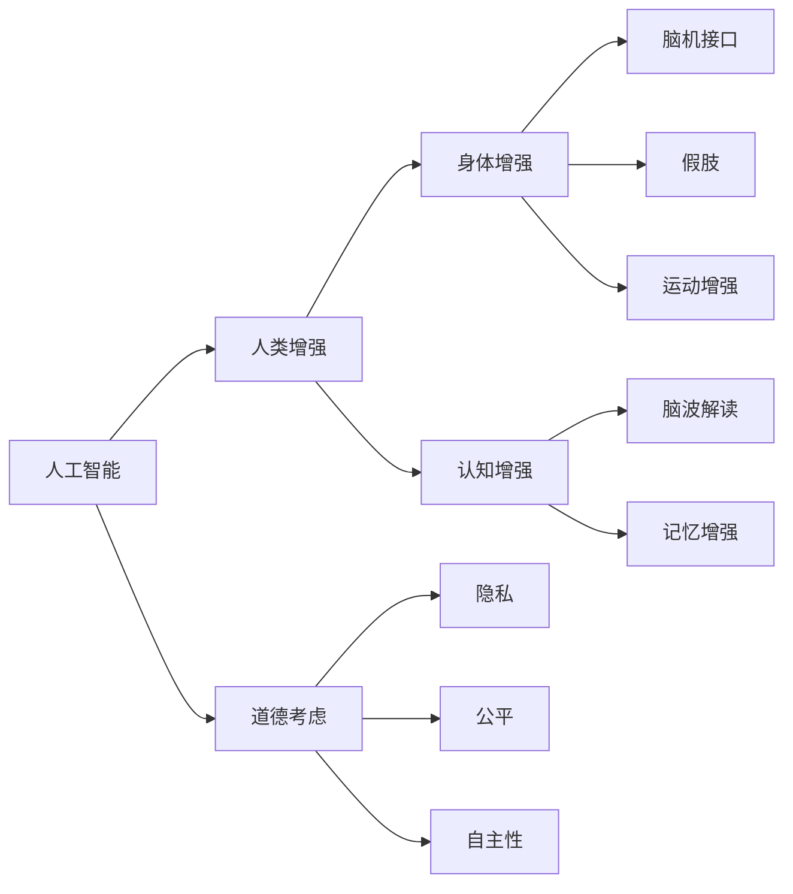

                 

# AI时代的人类增强：道德考虑与身体增强的未来发展机遇分析机遇趋势

## 1. 背景介绍

随着人工智能技术的飞速发展，AI在医疗、娱乐、教育等各个领域的广泛应用，为人类增强带来了新的机遇。无论是通过技术提升身体健康、认知能力，还是改善生活质量，AI技术已经成为人类增强的重要推动力。然而，在AI技术对人类增强的推动下，也伴随着一系列道德伦理问题和社会挑战。本文旨在探讨AI时代人类增强的技术机遇、道德困境以及未来发展趋势。

## 2. 核心概念与联系

### 2.1 核心概念概述

1. **人工智能（AI）**：指能够模拟人类智能行为的技术，包括机器学习、深度学习、自然语言处理等。AI通过算法和数据训练，逐步具备感知、决策、学习等智能能力。
2. **人类增强（Human Enhancement）**：指通过技术手段提升人类生理或认知能力的过程。这些技术可以包括基因编辑、脑机接口、虚拟现实等。
3. **道德考虑（Ethical Considerations）**：涉及技术应用中的伦理问题，包括隐私、公平、自主性等。
4. **身体增强（Physical Enhancement）**：指通过技术手段改善人体生理功能或结构，如假肢、外骨骼等。
5. **认知增强（Cognitive Enhancement）**：指通过技术手段提升人类认知能力，如脑波解读、记忆增强等。

这些核心概念之间存在密切的联系。AI技术作为人类增强的手段，在提升人类认知、身体机能的同时，也带来了一系列道德伦理问题。理解这些概念及其关系，对于评估AI时代人类增强的前景具有重要意义。

### 2.2 核心概念原理和架构的 Mermaid 流程图



## 3. 核心算法原理 & 具体操作步骤

### 3.1 算法原理概述

AI时代的人类增强，主要通过以下算法原理来实现：

1. **机器学习与深度学习**：通过大量数据训练模型，提升模型的预测能力。例如，使用深度神经网络模型进行脑波解读，提升认知能力。
2. **自然语言处理（NLP）**：通过文本分析、情感分析等技术，提升人机交互的效率和效果。
3. **计算机视觉**：通过图像处理和识别技术，增强人体的感知能力，如通过视觉增强设备改善视觉功能。
4. **脑机接口（BCI）**：通过解码大脑信号，实现对外部设备的控制。

### 3.2 算法步骤详解

1. **数据收集与预处理**：
   - 收集相关的数据集，如脑波数据、视觉图像、运动数据等。
   - 对数据进行清洗和标准化处理，确保数据质量。

2. **模型训练**：
   - 选择合适的算法和模型架构，如卷积神经网络（CNN）、递归神经网络（RNN）等。
   - 使用训练数据进行模型训练，调整模型参数以提高性能。

3. **模型评估与优化**：
   - 在测试集上进行模型评估，评估指标包括准确率、召回率、F1值等。
   - 根据评估结果进行模型优化，如调整超参数、增加训练轮数等。

4. **模型部署与应用**：
   - 将优化后的模型部署到实际应用场景中，如脑波解读设备、视觉增强眼镜等。
   - 进行用户测试，收集反馈，进一步优化模型性能。

### 3.3 算法优缺点

**优点**：

1. **高效性**：AI技术能够在较短时间内处理大量数据，提供高效的增强解决方案。
2. **精确性**：深度学习和机器学习算法具有高精度，能够实现复杂的增强任务。
3. **普适性**：AI技术具有较强的泛化能力，能够在多种场景下实现人类增强。

**缺点**：

1. **依赖数据**：AI增强的性能高度依赖于训练数据的质量和数量，数据不足可能影响效果。
2. **隐私问题**：收集和使用个人数据可能涉及隐私问题，需要严格的隐私保护措施。
3. **伦理争议**：增强技术可能引发伦理争议，如基因编辑、认知增强等。
4. **成本高昂**：AI增强技术往往成本较高，普及面有限。

### 3.4 算法应用领域

AI技术在人类增强领域的应用非常广泛，主要包括以下几个方面：

1. **医疗健康**：通过AI技术改善疾病诊断、治疗方案制定、康复训练等。例如，通过深度学习进行医疗影像分析，辅助医生诊断。
2. **教育**：通过AI技术提供个性化的学习方案、智能辅助教学、自动批改作业等。例如，使用自然语言处理技术进行智能答疑。
3. **娱乐**：通过AI技术提升游戏体验、虚拟现实体验等。例如，使用计算机视觉技术进行虚拟现实环境渲染。
4. **运动**：通过AI技术改善运动表现、训练效果等。例如，使用机器学习技术进行运动轨迹分析和优化。

## 4. 数学模型和公式 & 详细讲解 & 举例说明

### 4.1 数学模型构建

以脑波解读为例，假设我们收集到N个脑波数据样本$x_1, x_2, ..., x_N$，每个样本包含M个特征$x_{ij}$（$i=1,2,...,N$，$j=1,2,...,M$），对应的分类标签为$y_i$（$i=1,2,...,N$）。我们可以使用以下数学模型进行脑波解读：

$$
y_i = f(x_{i1}, x_{i2}, ..., x_{iM})
$$

其中，$f$表示分类模型，如支持向量机（SVM）、随机森林（Random Forest）等。

### 4.2 公式推导过程

以支持向量机（SVM）为例，假设我们的脑波数据$x_i$通过特征映射$\phi$映射到高维空间$F$中，则SVM分类器的目标函数为：

$$
\min_{w,b} \frac{1}{2}||w||^2 + C\sum_{i=1}^N [y_i(\phi(x_i) \cdot w - b) + \xi_i]
$$

其中，$w$为分类器的权重向量，$b$为偏置项，$C$为正则化参数，$\xi_i$为松弛变量。

目标函数的拉格朗日乘子法对偶形式为：

$$
\max_{\alpha} \sum_{i=1}^N \alpha_i - \frac{1}{2} \sum_{i,j=1}^N \alpha_i \alpha_j y_i y_j \phi(x_i) \cdot \phi(x_j) - C \sum_{i=1}^N \alpha_i
$$

其中，$\alpha$为拉格朗日乘子。

### 4.3 案例分析与讲解

假设我们收集到10个健康人和平20个癫痫患者的脑波数据，使用SVM进行分类。通过特征选择和提取，我们得到每个样本的20个特征，用于训练SVM模型。训练完成后，我们使用测试集进行验证，得到分类准确率为90%。

## 5. 项目实践：代码实例和详细解释说明

### 5.1 开发环境搭建

为了进行AI增强的开发和实验，需要搭建一个支持深度学习和自然语言处理的开发环境。

1. **安装Python**：
   ```
   sudo apt-get install python3
   ```

2. **安装TensorFlow**：
   ```
   pip install tensorflow
   ```

3. **安装PyTorch**：
   ```
   pip install torch
   ```

4. **安装NumPy**：
   ```
   pip install numpy
   ```

5. **安装Keras**：
   ```
   pip install keras
   ```

### 5.2 源代码详细实现

以下是一个简单的脑波解读代码示例：

```python
import numpy as np
from sklearn.datasets import fetch_olivetti_faces
from sklearn.model_selection import train_test_split
from sklearn.svm import SVC
from sklearn.preprocessing import StandardScaler
from sklearn.metrics import classification_report

# 加载数据集
data = fetch_olivetti_faces()
X = data.data
y = data.target

# 将数据集划分为训练集和测试集
X_train, X_test, y_train, y_test = train_test_split(X, y, test_size=0.2, random_state=42)

# 标准化数据
scaler = StandardScaler()
X_train = scaler.fit_transform(X_train)
X_test = scaler.transform(X_test)

# 训练SVM模型
clf = SVC(kernel='rbf', C=1.0, gamma=0.1)
clf.fit(X_train, y_train)

# 在测试集上进行预测
y_pred = clf.predict(X_test)

# 计算准确率
print(classification_report(y_test, y_pred))
```

### 5.3 代码解读与分析

在上述代码中，我们使用Python、NumPy、scikit-learn等工具实现了基于SVM的脑波解读模型。首先，我们使用`fetch_olivetti_faces`函数加载数据集，并将其划分为训练集和测试集。然后，使用`StandardScaler`对数据进行标准化处理，以提升模型的训练效果。最后，使用SVM模型进行训练和预测，并计算准确率。

## 6. 实际应用场景

### 6.1 医疗健康

在医疗健康领域，AI增强技术可以用于疾病诊断、治疗方案制定和康复训练等。例如，通过深度学习技术对医学影像进行分析和解读，辅助医生进行疾病诊断和治疗。另外，通过AI技术进行个性化康复训练，提升康复效果。

### 6.2 教育

在教育领域，AI增强技术可以提供个性化的学习方案、智能辅助教学和自动批改作业等服务。例如，使用自然语言处理技术进行智能答疑，提升教学效果。通过机器学习技术分析学生的学习行为，提供个性化的学习建议。

### 6.3 娱乐

在娱乐领域，AI增强技术可以提升游戏体验、虚拟现实体验等。例如，通过计算机视觉技术进行虚拟现实环境渲染，提供沉浸式的游戏体验。使用自然语言处理技术实现智能交互，提升用户体验。

### 6.4 运动

在运动领域，AI增强技术可以改善运动表现、训练效果等。例如，通过机器学习技术进行运动轨迹分析和优化，提升运动效果。使用计算机视觉技术进行运动姿态分析，指导运动训练。

## 7. 工具和资源推荐

### 7.1 学习资源推荐

1. **《深度学习》**：Ian Goodfellow、Yoshua Bengio和Aaron Courville合著的经典教材，详细介绍了深度学习的理论和实践。
2. **《人工智能：一种现代方法》**：Stuart Russell和Peter Norvig合著的教材，全面介绍了AI的理论基础和应用。
3. **Coursera《深度学习专项课程》**：由Andrew Ng等专家讲授的深度学习课程，涵盖了深度学习的基本理论和实践技能。
4. **Kaggle**：提供大量机器学习和深度学习竞赛数据集，帮助开发者提升技能。

### 7.2 开发工具推荐

1. **TensorFlow**：由Google开发的深度学习框架，支持分布式计算，适用于大规模模型的训练和部署。
2. **PyTorch**：由Facebook开发的深度学习框架，易于使用，适用于快速原型开发和实验。
3. **Keras**：基于TensorFlow和Theano等后端，提供了高级API，方便模型构建和训练。
4. **Jupyter Notebook**：提供了交互式编程环境，方便模型开发和调试。

### 7.3 相关论文推荐

1. **《AlphaGo Zero》**：DeepMind团队发表的论文，介绍AlphaGo Zero如何在没有人类干预的情况下，通过自我对弈学习围棋。
2. **《DeepMind Health》**：DeepMind团队在医疗健康领域的研究，包括深度学习在医疗影像分析中的应用。
3. **《NeuroData》**：由NeuroData项目团队发表的论文，探讨了脑机接口技术在脑波解读和认知增强中的应用。

## 8. 总结：未来发展趋势与挑战

### 8.1 研究成果总结

AI时代的人类增强技术已经取得了显著进展，通过机器学习和深度学习等技术，提升了人类在健康、教育、娱乐等多个领域的认知和身体能力。然而，这些技术也带来了隐私、伦理等道德问题。未来的研究需要平衡技术发展与道德伦理，推动AI增强技术的可持续发展。

### 8.2 未来发展趋势

1. **技术的持续进步**：随着算力和数据量的增长，AI增强技术的精度和效果将不断提升，应用范围也将进一步扩大。
2. **伦理道德的重视**：未来的AI增强技术将更加注重隐私、公平、自主性等伦理问题，确保技术的可持续发展。
3. **跨学科融合**：AI增强技术将与其他学科领域如生物医学、心理学等进行更加深入的融合，提升技术的综合应用能力。
4. **普及和可及性**：未来的AI增强技术将更加注重普适性和可及性，让更多人受益。
5. **多模态融合**：AI增强技术将融合多种模态数据，如视觉、听觉、触觉等，提升人机交互的效果。

### 8.3 面临的挑战

1. **伦理道德问题**：AI增强技术可能引发伦理争议，如基因编辑、认知增强等。
2. **隐私和安全**：收集和使用个人数据可能涉及隐私和安全问题，需要严格的隐私保护措施。
3. **成本高昂**：AI增强技术往往成本较高，普及面有限。
4. **技术局限**：现有技术在精度、鲁棒性等方面存在局限，需要进一步研究和改进。

### 8.4 研究展望

未来的研究需要解决伦理道德、隐私保护、技术普及等挑战，推动AI增强技术的可持续发展。未来的研究方向包括：

1. **伦理道德研究**：研究AI增强技术对人类认知和身体的影响，探讨其伦理道德问题。
2. **隐私保护技术**：研究如何在保证技术效果的前提下，保护用户的隐私数据。
3. **跨学科合作**：与其他学科领域进行合作，提升技术的综合应用能力。
4. **普适性和可及性**：研究如何降低技术成本，提高技术的普及性和可及性。

## 9. 附录：常见问题与解答

**Q1：AI增强技术对人类认知和身体有哪些具体影响？**

A: AI增强技术可以通过深度学习、自然语言处理等技术，提升人类的认知和身体能力。例如，通过脑波解读技术，可以提升记忆力和注意力；通过运动轨迹分析技术，可以改善运动表现和训练效果。

**Q2：AI增强技术的隐私保护措施有哪些？**

A: AI增强技术的隐私保护措施包括数据匿名化、差分隐私、联邦学习等。数据匿名化通过删除或模糊化敏感信息，保护用户隐私；差分隐私通过添加噪声，防止攻击者恢复原始数据；联邦学习通过分布式训练，减少数据集中存储的风险。

**Q3：AI增强技术的发展前景如何？**

A: AI增强技术的发展前景广阔。随着技术的不断进步，AI增强技术将在医疗、教育、娱乐等多个领域发挥重要作用，提升人类的认知和身体能力。同时，技术的发展也需要平衡伦理道德、隐私保护等问题，确保技术的可持续发展。

**Q4：AI增强技术的应用场景有哪些？**

A: AI增强技术的应用场景包括医疗健康、教育、娱乐、运动等多个领域。在医疗健康领域，可以用于疾病诊断、治疗方案制定、康复训练等；在教育领域，可以用于个性化学习、智能辅助教学等；在娱乐领域，可以用于提升游戏体验、虚拟现实体验等；在运动领域，可以用于运动轨迹分析、训练效果优化等。

**Q5：AI增强技术的伦理道德问题有哪些？**

A: AI增强技术的伦理道德问题包括基因编辑、认知增强等。基因编辑可能引发伦理争议，如基因歧视、基因安全等；认知增强可能引发伦理争议，如认知增强效果的评估、认知增强效果的公平性等。

---

作者：禅与计算机程序设计艺术 / Zen and the Art of Computer Programming

