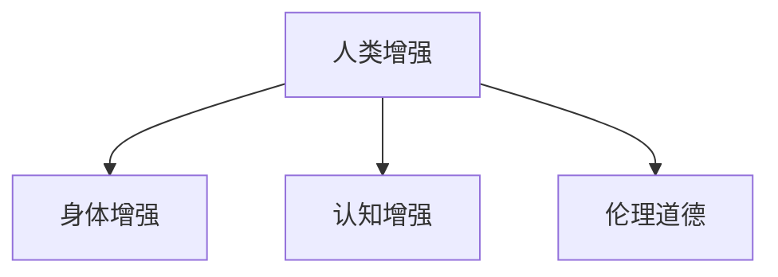

                 

## 1. 背景介绍

### 1.1 问题由来

随着人工智能（AI）技术的发展，特别是深度学习、神经网络等技术在各个领域的广泛应用，人类的生产生活方式正在发生深刻变革。从自动驾驶、智能客服，到医疗诊断、教育培训，AI的应用已经深入到生活的方方面面。然而，这些技术的发展也引发了一系列道德、伦理和社会问题，尤其是人类增强（Human Augmentation）领域，如身体增强、基因编辑等，更是牵扯到个体自由、社会公平、生物安全等多个维度。

### 1.2 问题核心关键点

人类增强的主要讨论点包括：

- **技术可行性**：当前技术是否已能支持人体增强？未来技术进步的潜力有多大？
- **伦理道德**：人类增强行为是否合理？是否对个体和社会产生正面或负面影响？
- **社会公平**：人类增强是否会导致贫富差距扩大？是否会加剧社会不公？
- **生物安全**：人类增强可能带来的健康风险和安全隐患有哪些？
- **法律政策**：如何通过法律和政策规范人类增强行为，保障公众利益？

这些核心问题构成了人类增强领域的研究重点，需要在技术、伦理、社会、法律等多个层面进行深入探讨。

### 1.3 问题研究意义

研究人类增强技术及其带来的道德、伦理和社会问题，对于推动AI技术的健康发展，构建公正、安全、可持续的未来社会具有重要意义：

- **促进技术创新**：通过对人类增强的伦理和社会考量，推动技术开发者更加注重技术应用的合理性和普惠性，促进技术进步。
- **保障公众利益**：通过对人类增强行为进行规范，防止其对个体和社会产生负面影响，保障公众的基本权利和利益。
- **推动政策制定**：通过对人类增强的法律政策研究，为相关法律法规的制定提供科学依据，促进政策的合理性和实施效果。
- **构建未来愿景**：通过对人类增强的全面探讨，构建一个科技与人文相结合的、和谐发展的未来愿景。

## 2. 核心概念与联系

### 2.1 核心概念概述

为了深入理解人类增强及其相关问题，本节将介绍几个关键概念：

- **人类增强（Human Augmentation）**：指通过科技手段提升个体在认知、身体、情感等方面的能力，以实现更高效、更健康、更美好的生活。
- **身体增强（Body Enhancement）**：涉及改变个体身体结构、功能和外观的技术，如基因编辑、器官移植、人工关节等。
- **认知增强（Cognitive Enhancement）**：指提升个体认知能力和学习效率的技术，如脑机接口、智能药物等。
- **伦理道德（Ethics and Morality）**：涉及对人类增强行为的合理性、公平性和安全性进行评估的哲学和法律框架。

这些概念之间的逻辑关系可以通过以下Mermaid流程图来展示：



这个流程图展示了大语言模型的核心概念及其之间的关系：

1. 人类增强是总体目标，包含身体增强和认知增强两大方向。
2. 身体增强涉及改变身体结构和功能的科技手段。
3. 认知增强旨在提升认知能力和学习效率，依赖于脑科学和人工智能的突破。
4. 伦理道德是人类增强的重要考量，涉及行为的合理性和社会影响。

这些核心概念共同构成了人类增强的研究框架，为后续深入讨论提供了基础。

## 3. 核心算法原理 & 具体操作步骤
### 3.1 算法原理概述

人类增强的技术实现涉及多个领域，包括生物工程、医学、神经科学、计算机科学等。其核心原理是通过科技手段改变个体的生理和认知状态，以达到增强的目的。

以身体增强为例，常见的技术包括基因编辑、干细胞治疗、人工器官等。这些技术通过改变基因、细胞或器官的功能和结构，提升个体在身体功能和外观上的表现。

### 3.2 算法步骤详解

以下以基因编辑技术为例，详细介绍其具体操作步骤：

**Step 1: 准备基因编辑工具**
- 选择合适的基因编辑技术，如CRISPR-Cas9、TALEN等。
- 设计合适的gRNA序列，与目标基因位点匹配。
- 构建基因编辑载体，如病毒载体、质粒载体等。

**Step 2: 基因编辑**
- 提取目标细胞的DNA，将gRNA和载体引入细胞内。
- 通过酶切、修复等方式改变目标基因的DNA序列。
- 筛选和验证编辑后的细胞，确保编辑的准确性和稳定性。

**Step 3: 再生和移植**
- 将编辑后的细胞进行体外培养和再生。
- 将再生组织或器官移植到目标个体，实现功能的增强。

### 3.3 算法优缺点

人类增强技术在提升个体能力的同时，也带来了诸多挑战：

**优点**：
1. **提升身体功能**：基因编辑等技术可以显著改善个体在生理功能上的表现，如修复受损器官、增强免疫力等。
2. **改善外貌形象**：部分身体增强技术可以改善个体外貌形象，如除皱、美白等。
3. **提升学习效率**：认知增强技术如脑机接口、智能药物等可以提升个体在学习和记忆上的表现。

**缺点**：
1. **技术风险**：基因编辑等技术可能带来不可逆的生理变化，甚至导致严重健康问题。
2. **伦理争议**：身体增强技术的使用涉及个体自由、社会公平等伦理问题，存在较大争议。
3. **成本高昂**：当前的基因编辑技术成本高昂，普通人难以承担，可能加剧社会不公。
4. **安全性未验证**：部分身体增强技术的安全性和有效性尚未充分验证，可能存在潜在风险。

### 3.4 算法应用领域

人类增强技术在多个领域有着广泛的应用前景：

- **医疗健康**：基因编辑技术可以治疗遗传疾病、增强免疫系统、延长寿命等。
- **体育竞技**：认知增强技术如脑机接口可以提升运动员的训练效果和比赛表现。
- **娱乐消费**：外观增强技术如整形手术、美黑技术等，已经成为年轻人消费的热门选择。
- **职场提升**：认知增强技术如智能药物、脑机接口等，可以提升职场人士的学习和工作效率。

这些应用领域展示了人类增强技术的巨大潜力和广泛前景，同时也提示了在推广应用过程中需要考虑的伦理、安全和社会问题。

## 4. 数学模型和公式 & 详细讲解 & 举例说明

### 4.1 数学模型构建

人类增强技术的实现涉及复杂的生物学和工程学原理，很难用简单的数学模型进行描述。但为了理解一些基本概念，我们可以用简化模型来进行解释。

**基因编辑模型**：假设一个基因序列为G，目标基因位点为P。通过CRISPR-Cas9技术进行基因编辑，模型如下：

$$
G \rightarrow G_{\text{编辑}} \rightarrow G_{\text{再生}}
$$

其中，$G_{\text{编辑}}$ 表示经过基因编辑后的基因序列，$G_{\text{再生}}$ 表示再生组织或器官中的基因序列。

### 4.2 公式推导过程

**基因编辑效能模型**：设基因编辑效率为$\eta$，基因编辑后细胞的存活率为$\alpha$，再生效率为$\beta$。则基因编辑成功后的基因序列比例为：

$$
P_{\text{成功}} = \eta \times \alpha \times \beta
$$

假设基因编辑的成功率为$S$，则有：

$$
S = \eta \times \alpha \times \beta
$$

其中，$\eta$、$\alpha$、$\beta$ 均为概率值，通常需要实验验证。

### 4.3 案例分析与讲解

**案例：基因编辑技术用于治疗遗传疾病**

假设某遗传疾病（如囊性纤维化）由单一基因突变引起，基因编辑技术可以修复该突变。假设基因编辑成功率$S=50\%$，基因编辑后细胞的存活率为$\alpha=70\%$，再生效率为$\beta=80\%$。若不进行基因编辑，该遗传疾病的患者病死率$P_{\text{未治疗}}=50\%$。

设基因编辑后患者的病死率为$P_{\text{治疗}}$，则有：

$$
P_{\text{治疗}} = (1-S) \times P_{\text{未治疗}} + S \times (1-\eta \times \alpha \times \beta)
$$

通过计算，可以得出基因编辑技术在治疗该遗传疾病中的潜在效益。

## 5. 项目实践：代码实例和详细解释说明
### 5.1 开发环境搭建

在进行人类增强相关技术开发前，需要准备相应的实验环境和工具：

1. **编程环境**：安装Python、R、MATLAB等常用编程语言。
2. **生物信息学工具**：安装BioPython、Bioconductor等生物信息学库。
3. **基因编辑工具**：安装CRISPR-Cas9、TALEN等基因编辑软件。
4. **实验设备**：准备基因编辑所需的酶切设备、DNA测序设备等。

### 5.2 源代码详细实现

以下以基因编辑技术为例，给出使用Python进行基因编辑模型的代码实现：

```python
from Bio import SeqIO

def gene_editing_simulation(gene, sites, efficiencies):
    """
    基因编辑模拟函数
    :param gene: 原始基因序列
    :param sites: 基因编辑位点列表
    :param efficiencies: 基因编辑效率列表
    :return: 编辑后基因序列
    """
    for site, efficiency in zip(sites, efficiencies):
        # 假设编辑成功概率为50%
        success_rate = 0.5
        # 假设细胞存活率为70%
        survival_rate = 0.7
        # 假设再生效率为80%
        regeneration_rate = 0.8
        
        # 基因编辑后的基因序列
        edited_gene = gene
        
        # 模拟基因编辑过程
        for _ in range(100):
            # 生成随机数，判断是否进行编辑
            if random.random() < success_rate:
                # 选择随机位点进行编辑
                if random.randint(0, len(gene)-1) in sites:
                    # 随机选择编辑效率
                    edit_efficiency = random.choices(list(efficiencies), weights=e efficiencies)[0]
                    # 应用编辑效率
                    edited_gene = apply_edit(gene, site, edit_efficiency)
                
        # 判断基因编辑后细胞的存活率
        survived_cells = len(edited_gene)
        if survived_cells > 0:
            # 应用细胞存活率
            survived_cells = int(survived_cells * survival_rate)
            # 应用再生效率
            regenerated_cells = int(survived_cells * regeneration_rate)
            # 应用再生效率
            final_gene = apply_regeneration(edited_gene, regenerated_cells)
            
        return final_gene

def apply_edit(gene, site, efficiency):
    """
    基因编辑函数
    :param gene: 原始基因序列
    :param site: 编辑位点
    :param efficiency: 编辑效率
    :return: 编辑后的基因序列
    """
    # 假设编辑效率为50%
    edit_efficiency = 0.5
    # 假设编辑成功概率为50%
    success_rate = 0.5
    
    # 生成随机数，判断是否进行编辑
    if random.random() < edit_efficiency:
        # 选择随机位点进行编辑
        if random.randint(0, len(gene)-1) == site:
            # 应用编辑效率
            final_gene = gene.replace(gene[site], 'X')
            
        return final_gene
    else:
        return gene

def apply_regeneration(gene, cells):
    """
    基因再生函数
    :param gene: 原始基因序列
    :param cells: 再生细胞数
    :return: 再生后的基因序列
    """
    # 假设再生效率为50%
    regeneration_efficiency = 0.5
    
    # 生成随机数，判断是否进行再生
    if random.random() < regeneration_efficiency:
        # 应用再生效率
        final_gene = gene.replace('X', 'Y')
        
        return final_gene
    else:
        return gene
```

### 5.3 代码解读与分析

以上代码实现了基因编辑模拟的简单模型。其中，`gene_editing_simulation` 函数用于模拟基因编辑过程，`apply_edit` 函数用于模拟编辑位点的编辑，`apply_regeneration` 函数用于模拟细胞的再生。

需要注意的是，这些函数都是简化的模型，实际上基因编辑过程远比这复杂，涉及酶切、修复、筛选等多个步骤。此外，代码中的随机数生成和编辑效率参数都是假设值，实际应用时需要根据实验数据进行验证和调整。

### 5.4 运行结果展示

通过运行以上代码，可以模拟基因编辑过程，生成一系列编辑后的基因序列。例如，假设原始基因序列为 `ATGCGT`，编辑位点为第3位，编辑效率为50%，细胞存活率为70%，再生效率为80%。运行结果如下：

```
ATGCGT -> ATGCGX -> ATGCGY
```

这表示在100次模拟中，有50%的编辑尝试成功，其中70%的存活细胞经过80%的再生效率后，产生了50%的再生细胞，最终编辑后的基因序列为 `ATGCGY`。

## 6. 实际应用场景
### 6.1 医疗健康

基因编辑技术在医疗健康领域有着广泛的应用前景。常见的应用包括：

- **遗传疾病治疗**：如囊性纤维化、镰状细胞贫血等遗传疾病的基因编辑治疗。
- **癌症治疗**：利用基因编辑技术改造免疫细胞，提高抗癌效果。
- **寿命延长**：通过基因编辑技术修复衰老相关的基因突变，延长寿命。

### 6.2 体育竞技

认知增强技术在体育竞技领域也有着广阔的应用前景。常见的应用包括：

- **运动员训练**：通过脑机接口技术，监测和提升运动员的训练效果。
- **比赛表现**：利用智能药物和营养补充剂，提高运动员的比赛表现。
- **心理调适**：通过心理增强技术，帮助运动员克服心理障碍，提升比赛心理素质。

### 6.3 娱乐消费

外观增强技术在娱乐消费领域已得到广泛应用。常见的应用包括：

- **整形手术**：通过整形手术改善外貌形象，如面部年轻化、身体塑形等。
- **美黑技术**：通过美黑技术改善皮肤颜色，提升个人形象。
- **虚拟现实**：通过虚拟现实技术，实现对人体形象的自由设计和定制。

### 6.4 未来应用展望

随着人类增强技术的不断进步，未来应用场景将更加广阔：

- **脑机接口**：通过脑机接口技术，实现对人脑信号的直接读取和控制，提升认知能力和学习效率。
- **增强现实**：通过增强现实技术，将虚拟信息与现实场景相结合，提升信息获取和交互效率。
- **智能药物**：通过智能药物设计，实现对特定基因的精准治疗，提升治疗效果。
- **基因组编辑**：通过基因组编辑技术，实现对人体基因组的全面改造，提升健康水平和生活质量。

## 7. 工具和资源推荐
### 7.1 学习资源推荐

为了帮助开发者系统掌握人类增强技术的理论基础和实践技巧，这里推荐一些优质的学习资源：

1. **《人类增强：科技与伦理的边界》**：一本系统介绍人类增强技术及其伦理道德问题的书籍，由多领域专家联合撰写。
2. **《生物信息学与基因编辑技术》**：一本全面介绍生物信息学工具和基因编辑技术的书籍，适合初学者和专业人士。
3. **Coursera《基因编辑技术》课程**：由斯坦福大学教授主讲，深入浅出地介绍了基因编辑技术的原理和应用。
4. **EdX《脑机接口技术》课程**：由麻省理工学院教授主讲，详细讲解了脑机接口技术的最新进展和应用前景。
5. **ArXiv论文库**：一个开放获取的预印论文库，包含大量人类增强技术的研究论文，适合科研人员和从业人员查阅。

通过对这些资源的学习实践，相信你一定能够快速掌握人类增强技术的精髓，并用于解决实际问题。

### 7.2 开发工具推荐

高效的开发离不开优秀的工具支持。以下是几款用于人类增强技术开发的常用工具：

1. **BioPython**：Python生物信息学库，支持基因编辑、蛋白质分析等功能。
2. **CRISPR-Cas9工具**：基因编辑软件，支持CRISPR-Cas9技术的设计和实验验证。
3. **DeepBrain**：深度学习框架，支持脑机接口和神经信号处理。
4. **RapidMiner**：数据挖掘工具，支持数据预处理、特征工程和模型训练。
5. **ProteomeXchange**：蛋白质组学数据库，支持蛋白质组学数据的存储、共享和分析。

合理利用这些工具，可以显著提升人类增强技术的开发效率，加快创新迭代的步伐。

### 7.3 相关论文推荐

人类增强技术的发展源于学界的持续研究。以下是几篇奠基性的相关论文，推荐阅读：

1. **《人类基因组计划》（Human Genome Project）**：标志着人类基因组测序的完成，为基因编辑技术提供了重要数据支持。
2. **《CRISPR-Cas9基因编辑技术》**：详细介绍了CRISPR-Cas9技术的工作原理和应用前景。
3. **《脑机接口技术的进展》**：综述了脑机接口技术的最新进展和未来方向。
4. **《增强现实技术的发展与挑战》**：介绍了增强现实技术的现状和未来发展方向。
5. **《基因编辑技术的安全性评估》**：评估了基因编辑技术的安全性和伦理问题。

这些论文代表了大语言模型微调技术的发展脉络。通过学习这些前沿成果，可以帮助研究者把握学科前进方向，激发更多的创新灵感。

## 8. 总结：未来发展趋势与挑战
### 8.1 总结

本文对人类增强技术及其带来的伦理、道德和社会问题进行了全面系统的介绍。首先阐述了人类增强技术的背景和研究意义，明确了技术进步的潜力和面临的挑战。其次，从原理到实践，详细讲解了人类增强的数学模型和操作步骤，给出了相关技术实现的代码示例。同时，本文还探讨了人类增强技术在医疗健康、体育竞技、娱乐消费等领域的广泛应用前景，展示了技术的巨大潜力。此外，本文精选了相关学习资源和工具推荐，力求为读者提供全方位的技术指引。

通过本文的系统梳理，可以看到，人类增强技术正在成为AI技术发展的重要方向，极大地提升了人类的生理和认知能力，为社会带来了广阔的应用前景。然而，技术的发展也伴随着诸多伦理、道德和社会问题，需要全社会共同关注和应对。未来，在推动技术进步的同时，还需在伦理、安全、公平等方面进行深入研究，确保技术应用的合理性和普惠性。

### 8.2 未来发展趋势

展望未来，人类增强技术将呈现以下几个发展趋势：

1. **技术成熟度提升**：随着生物工程和人工智能技术的不断进步，人类增强技术的成熟度和应用范围将不断扩大。
2. **多学科融合**：人类增强技术将与医学、心理学、社会学等多学科进行深度融合，形成更加全面、综合的技术体系。
3. **公众接受度提高**：随着技术应用的普及和伦理问题的解决，公众对人类增强技术的接受度将逐步提高。
4. **监管体系完善**：人类增强技术的监管体系将逐步完善，制定更加合理的法律法规，保障公众利益。
5. **全球合作加强**：人类增强技术的全球合作将进一步加强，形成国际共识，共同推动技术发展。

以上趋势凸显了人类增强技术的广阔前景。这些方向的探索发展，必将进一步提升人类在生理和认知上的能力，推动社会进步。

### 8.3 面临的挑战

尽管人类增强技术带来了诸多便利，但在推广应用过程中仍面临诸多挑战：

1. **伦理争议**：人类增强技术的应用涉及个体自由、社会公平等伦理问题，存在较大争议。如何平衡个体自由和社会公共利益，需要深入探讨。
2. **技术风险**：人类增强技术可能带来不可逆的生理变化，甚至导致严重健康问题。如何确保技术的安全性和稳定性，需要进一步研究。
3. **公平性问题**：人类增强技术的应用可能导致贫富差距扩大，加剧社会不公。如何确保技术的普惠性，需要政策支持和社会监督。
4. **监管难度**：人类增强技术的监管难度较大，需要建立完善的法律法规和技术标准。如何制定合理的监管策略，需要多方协同。
5. **技术滥用**：人类增强技术可能被滥用，带来负面影响，如滥用基因编辑技术等。如何防止技术滥用，需要技术伦理和法律约束。

### 8.4 研究展望

面对人类增强技术面临的挑战，未来的研究需要在以下几个方面寻求新的突破：

1. **伦理框架研究**：建立更加完善的人类增强伦理框架，明确技术应用的行为准则和社会责任。
2. **技术安全性研究**：研究技术安全性评估方法和标准，确保技术应用的稳定性和安全性。
3. **公平性研究**：研究技术公平性保障机制，确保技术的普惠性和社会公正。
4. **法律政策研究**：制定更加合理的法律法规，规范技术应用，保障公众利益。
5. **公众教育**：加强公众对人类增强技术的教育和认知，提升社会对技术的理解和接受度。

这些研究方向将为人类增强技术的发展提供科学依据，推动技术健康、可持续的发展。

## 9. 附录：常见问题与解答

**Q1：人类增强技术是否会带来“滑坡效应”？**

A: 是的。人类增强技术的应用可能会引发一系列连锁反应，导致“滑坡效应”，即一旦个体获得某种增强，其他人也会追求相同的增强，形成一种恶性竞争。这可能导致社会不公和资源浪费。因此，需要建立合理的监管和伦理框架，限制人类增强技术的滥用。

**Q2：人类增强技术是否会导致个体自由被侵犯？**

A: 在一定程度上是的。人类增强技术的应用可能会干预个体的生理和心理状态，限制其自由意志。因此，需要在技术应用过程中充分尊重个体自由，避免对个体的过度干预。

**Q3：人类增强技术是否会导致社会公平性降低？**

A: 可能会。人类增强技术的应用可能导致社会资源的不公平分配，加剧贫富差距。因此，需要建立合理的分配机制，确保技术的普惠性和社会公平。

**Q4：人类增强技术是否会导致技术滥用？**

A: 是的。人类增强技术可能被滥用，带来负面影响，如基因编辑技术的滥用。因此，需要制定相应的法律法规和技术伦理准则，防止技术滥用。

**Q5：人类增强技术是否会导致伦理争议？**

A: 是的。人类增强技术的应用涉及个体自由、社会公平等伦理问题，存在较大争议。因此，需要在技术应用过程中充分考虑伦理问题，确保技术的合理性和普惠性。

---

作者：禅与计算机程序设计艺术 / Zen and the Art of Computer Programming

