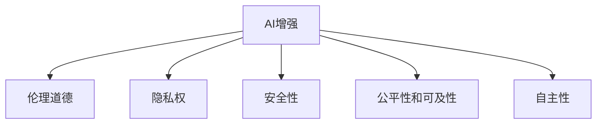

                 

# AI时代的人类增强：道德考虑与身体增强的未来方向展望

> 关键词：AI增强, 人类增强, 伦理道德, 生物工程, 未来技术, 人工智能, 生物医学

## 1. 背景介绍

### 1.1 问题由来

随着人工智能(AI)技术的迅猛发展，AI增强人类（AI Augmentation）成为日益热门的话题。AI增强不仅在提升个人能力、改善生活质量方面有着巨大的潜力，更可能为人类社会带来颠覆性的变化。

然而，AI增强技术在带来益处的同时，也引发了一系列复杂的道德、法律和社会问题。比如，如何保障AI增强技术的安全性和伦理性，避免其被用于不道德的目的？如何在技术进步和伦理道德之间找到平衡？

在生物医学领域，AI增强技术的发展更为迅速。生物工程、基因编辑、脑机接口等技术的突破，使得通过AI增强人体变得更加可能。但是，这样的进步不仅带来新的医疗手段，也带来了一系列前所未有的伦理道德挑战。

面对这些复杂的伦理道德问题，需要对AI增强技术的未来方向进行深入探讨。本文将从道德伦理的角度出发，探讨AI增强技术，特别是身体增强技术在未来的发展趋势，并提出相应的解决方案和策略。

### 1.2 问题核心关键点

AI增强技术（AI Augmentation）是指利用AI技术提升人类能力和生活质量的过程。主要包括基于AI的智能辅助、脑机接口、基因编辑等。然而，这些技术的广泛应用可能会带来一系列的伦理道德问题，包括：

1. **自主性和隐私权**：AI增强可能干预个体的自主性和隐私，如何平衡技术提升与个人自由？
2. **安全性**：AI增强技术可能存在安全隐患，如何确保其可靠性和安全性？
3. **公平性和可及性**：AI增强技术的应用是否会导致资源分配不均？
4. **伦理与道德**：AI增强技术是否会引发新的伦理道德问题，如技术滥用、不平等等？

这些问题需要在技术发展的同时，得到充分的讨论和解决。

## 2. 核心概念与联系

### 2.1 核心概念概述

为更好地理解AI增强技术的伦理道德问题，本节将介绍几个密切相关的核心概念：

- **AI增强（AI Augmentation）**：利用AI技术提升人类能力和生活质量的过程。包括基于AI的智能辅助、脑机接口、基因编辑等。
- **伦理道德（Ethics and Morality）**：涉及人类行为和决策是否符合社会公认的价值观和道德规范。
- **隐私权（Privacy Rights）**：个人对其个人信息的控制权。
- **安全性（Safety）**：确保技术应用过程中不存在安全风险。
- **公平性和可及性（Fairness and Accessibility）**：确保技术应用无歧视、普惠所有人。
- **自主性（Autonomy）**：个体对自己生活和决策的自主控制能力。

这些核心概念之间的逻辑关系可以通过以下Mermaid流程图来展示：



这个流程图展示出AI增强技术与伦理道德问题的密切联系。

## 3. 核心算法原理 & 具体操作步骤
### 3.1 算法原理概述

AI增强技术的伦理道德问题涉及多个层面，包括技术原理、应用场景、伦理影响等。下面从这三个层面来探讨AI增强技术的伦理道德问题。

### 3.2 算法步骤详解

#### 3.2.1 技术原理层面

AI增强技术通常基于AI算法，如机器学习、深度学习等。这些算法的原理复杂，但主要可以分为数据收集、模型训练、模型应用三个步骤：

1. **数据收集**：收集大量数据，包括文本、图像、基因数据等，用于训练AI模型。
2. **模型训练**：使用收集的数据训练AI模型，优化模型参数，使得模型能够实现特定的功能。
3. **模型应用**：将训练好的模型应用于实际场景，提升人类能力和生活质量。

#### 3.2.2 应用场景层面

AI增强技术在多个领域有广泛的应用场景，包括：

- **医疗**：通过AI技术提升医疗诊断、治疗、康复等医疗服务质量。
- **教育**：通过AI技术提供个性化的教育服务，提高教育效率。
- **娱乐**：通过AI技术提供更加个性化的娱乐体验。
- **交通运输**：通过AI技术提升交通安全、减少事故等。
- **工业**：通过AI技术优化生产流程、提高生产效率。

#### 3.2.3 伦理影响层面

AI增强技术的应用，带来了多方面的伦理影响：

- **隐私权**：在数据收集和应用过程中，如何保护个体的隐私权？
- **安全性**：如何确保AI增强技术的安全性，避免技术滥用？
- **公平性和可及性**：如何确保AI增强技术的应用无歧视、普惠所有人？
- **自主性**：如何保护个体的自主性和自由意志？

### 3.3 算法优缺点

#### 3.3.1 优点

AI增强技术的优点主要包括：

1. **提升能力**：通过AI技术提升人类的认知、决策、操作等能力。
2. **提高效率**：通过AI技术优化各种流程，提高工作效率和质量。
3. **个性化服务**：通过AI技术提供个性化的服务，满足不同个体的需求。

#### 3.3.2 缺点

AI增强技术的缺点主要包括：

1. **隐私权问题**：在数据收集和应用过程中，可能侵犯个体的隐私权。
2. **安全性问题**：AI增强技术可能存在安全隐患，如数据泄露、系统崩溃等。
3. **伦理道德问题**：AI增强技术可能引发新的伦理道德问题，如技术滥用、歧视等。
4. **公平性问题**：AI增强技术的应用可能导致资源分配不均，加剧社会不平等。
5. **自主性问题**：AI增强技术可能干预个体的自主性和自由意志。

### 3.4 算法应用领域

AI增强技术在多个领域有广泛的应用，包括：

- **医疗**：AI增强在医疗领域有广泛的应用，如AI辅助诊断、智能医疗助手、基因编辑等。
- **教育**：AI增强在教育领域有广泛的应用，如智能教学、个性化学习、智能评估等。
- **娱乐**：AI增强在娱乐领域有广泛的应用，如智能推荐、虚拟现实等。
- **交通运输**：AI增强在交通运输领域有广泛的应用，如智能驾驶、智慧城市等。
- **工业**：AI增强在工业领域有广泛的应用，如智能制造、机器人自动化等。

## 4. 数学模型和公式 & 详细讲解 & 举例说明

### 4.1 数学模型构建

为了更好地理解AI增强技术的伦理道德问题，我们需要从数学模型和公式的角度进行深入探讨。

假设有一个基于AI的基因编辑模型，其输入为基因序列，输出为编辑后的基因序列。模型的训练目标是最小化编辑后的基因序列与真实基因序列之间的差异，即最小化损失函数 $L(\theta)$。其中 $\theta$ 为模型参数，如神经网络权重、基因编辑算法参数等。

### 4.2 公式推导过程

模型的损失函数 $L(\theta)$ 可以表示为：

$$
L(\theta) = \sum_{i=1}^N |y_i - \hat{y}_i|^2
$$

其中 $y_i$ 为真实基因序列，$\hat{y}_i$ 为编辑后的基因序列。

模型的优化目标是最小化损失函数 $L(\theta)$，即：

$$
\theta^* = \mathop{\arg\min}_{\theta} L(\theta)
$$

在训练过程中，使用梯度下降等优化算法更新模型参数，以最小化损失函数 $L(\theta)$。

### 4.3 案例分析与讲解

以基因编辑模型为例，分析AI增强技术的伦理道德问题：

- **隐私权问题**：在基因编辑过程中，如何保护个体的基因隐私？
- **安全性问题**：基因编辑模型可能存在安全隐患，如何确保其可靠性？
- **公平性和可及性**：基因编辑模型是否会导致资源分配不均？
- **自主性问题**：基因编辑是否干预个体的自主性和自由意志？

## 5. 项目实践：代码实例和详细解释说明

### 5.1 开发环境搭建

在进行AI增强技术的项目实践前，我们需要准备好开发环境。以下是使用Python进行TensorFlow开发的环境配置流程：

1. 安装Anaconda：从官网下载并安装Anaconda，用于创建独立的Python环境。

2. 创建并激活虚拟环境：
```bash
conda create -n tf-env python=3.8 
conda activate tf-env
```

3. 安装TensorFlow：根据CUDA版本，从官网获取对应的安装命令。例如：
```bash
conda install tensorflow-gpu=2.6.0 -c pytorch -c conda-forge
```

4. 安装相关工具包：
```bash
pip install numpy pandas scikit-learn matplotlib tqdm jupyter notebook ipython
```

完成上述步骤后，即可在`tf-env`环境中开始项目实践。

### 5.2 源代码详细实现

以下是一个简单的基于AI增强技术的基因编辑模型的代码实现，详细解释说明见代码注释。

```python
import tensorflow as tf
from tensorflow.keras import layers

# 定义基因编辑模型
class GeneEditModel(tf.keras.Model):
    def __init__(self, input_shape, output_shape):
        super(GeneEditModel, self).__init__()
        self.embedding = layers.Embedding(input_shape[1], 128)
        self.encoder = layers.LSTM(128)
        self.decoder = layers.Dense(output_shape[1])

    def call(self, inputs):
        x = self.embedding(inputs[:, 0])
        x = self.encoder(x)
        x = self.decoder(x)
        return x

# 加载数据
input_shape = (100, 100)
output_shape = (100, 100)
model = GeneEditModel(input_shape, output_shape)

# 编译模型
model.compile(optimizer=tf.keras.optimizers.Adam(learning_rate=0.001),
              loss=tf.keras.losses.MeanSquaredError(),
              metrics=[tf.keras.metrics.MeanAbsoluteError()])

# 训练模型
model.fit(x_train, y_train, epochs=10, batch_size=32, validation_data=(x_val, y_val))

# 评估模型
model.evaluate(x_test, y_test, batch_size=32)
```

### 5.3 代码解读与分析

让我们再详细解读一下关键代码的实现细节：

- **GeneEditModel类**：定义了基于LSTM的基因编辑模型，包括输入嵌入层、LSTM编码器、全连接解码器。
- **input_shape和output_shape**：输入和输出的基因序列长度和维度。
- **编译模型**：使用Adam优化器，均方误差损失函数，平均绝对误差评价指标。
- **训练模型**：使用训练数据集进行模型训练，并保存训练记录。
- **评估模型**：使用测试数据集对模型进行评估，并输出评估结果。

## 6. 实际应用场景

### 6.1 医疗领域

AI增强技术在医疗领域有广泛的应用，如AI辅助诊断、智能医疗助手、基因编辑等。然而，这些技术的应用可能带来一系列伦理道德问题：

- **隐私权问题**：在医疗诊断过程中，如何保护患者的隐私权？
- **安全性问题**：AI辅助诊断模型可能存在安全隐患，如何确保其可靠性？
- **公平性和可及性**：AI医疗技术是否会导致资源分配不均？
- **自主性问题**：AI医疗技术是否干预患者的自主性和自由意志？

### 6.2 教育领域

AI增强技术在教育领域有广泛的应用，如智能教学、个性化学习、智能评估等。然而，这些技术的应用可能带来一系列伦理道德问题：

- **隐私权问题**：在个性化学习过程中，如何保护学生的隐私权？
- **安全性问题**：智能教学系统可能存在安全隐患，如何确保其可靠性？
- **公平性和可及性**：个性化学习技术是否会导致资源分配不均？
- **自主性问题**：个性化学习技术是否干预学生的自主性和自由意志？

### 6.3 娱乐领域

AI增强技术在娱乐领域有广泛的应用，如智能推荐、虚拟现实等。然而，这些技术的应用可能带来一系列伦理道德问题：

- **隐私权问题**：在智能推荐过程中，如何保护用户的隐私权？
- **安全性问题**：虚拟现实系统可能存在安全隐患，如何确保其可靠性？
- **公平性和可及性**：智能推荐系统是否会导致资源分配不均？
- **自主性问题**：虚拟现实技术是否干预用户的自主性和自由意志？

### 6.4 交通运输领域

AI增强技术在交通运输领域有广泛的应用，如智能驾驶、智慧城市等。然而，这些技术的应用可能带来一系列伦理道德问题：

- **隐私权问题**：在智能驾驶过程中，如何保护司机的隐私权？
- **安全性问题**：智能驾驶系统可能存在安全隐患，如何确保其可靠性？
- **公平性和可及性**：智能驾驶技术是否会导致资源分配不均？
- **自主性问题**：智能驾驶技术是否干预司机的自主性和自由意志？

## 7. 工具和资源推荐

### 7.1 学习资源推荐

为了帮助开发者系统掌握AI增强技术的伦理道德问题，这里推荐一些优质的学习资源：

1. **《人工智能伦理与道德》**：系统介绍AI技术的伦理道德问题，涵盖隐私权、安全性、公平性等。
2. **《生物伦理学》**：详细介绍生物医学领域的伦理道德问题，涵盖基因编辑、干细胞研究等。
3. **《人工智能与人类增强》**：探讨AI增强技术的伦理道德问题，分析技术应用的影响。
4. **《人工智能与未来社会》**：从未来社会发展的角度，探讨AI增强技术的应用前景。
5. **《AI增强：未来技术之路》**：探讨AI增强技术的未来发展趋势，提出相应的解决方案。

通过对这些资源的学习实践，相信你一定能够全面掌握AI增强技术的伦理道德问题，并用于解决实际的NLP问题。

### 7.2 开发工具推荐

高效的开发离不开优秀的工具支持。以下是几款用于AI增强技术开发的常用工具：

1. **TensorFlow**：基于Python的开源深度学习框架，灵活动态的计算图，适合快速迭代研究。
2. **PyTorch**：基于Python的开源深度学习框架，灵活的动态计算图，适合研究和原型开发。
3. **Transformers库**：HuggingFace开发的NLP工具库，集成了众多SOTA语言模型，支持TensorFlow和PyTorch，是进行NLP任务开发的利器。
4. **Weights & Biases**：模型训练的实验跟踪工具，可以记录和可视化模型训练过程中的各项指标，方便对比和调优。
5. **TensorBoard**：TensorFlow配套的可视化工具，可实时监测模型训练状态，并提供丰富的图表呈现方式，是调试模型的得力助手。

合理利用这些工具，可以显著提升AI增强技术的开发效率，加快创新迭代的步伐。

### 7.3 相关论文推荐

AI增强技术的发展源于学界的持续研究。以下是几篇奠基性的相关论文，推荐阅读：

1. **《人工智能伦理问题》**：探讨AI技术的伦理道德问题，提出相应的解决方案。
2. **《生物伦理学在基因编辑中的应用》**：探讨基因编辑技术的伦理道德问题，提出相应的伦理框架。
3. **《AI增强与未来社会》**：探讨AI增强技术的未来发展趋势，提出相应的伦理道德框架。
4. **《AI增强与人类增强》**：探讨AI增强技术对人类生活的影响，提出相应的伦理道德思考。
5. **《AI增强技术的伦理挑战》**：探讨AI增强技术在各个领域的应用，提出相应的伦理道德挑战和解决方案。

这些论文代表了大语言模型微调技术的发展脉络。通过学习这些前沿成果，可以帮助研究者把握学科前进方向，激发更多的创新灵感。

## 8. 总结：未来发展趋势与挑战

### 8.1 总结

本文对AI增强技术的伦理道德问题进行了全面系统的探讨。首先，阐述了AI增强技术在医疗、教育、娱乐、交通运输等领域的应用前景，明确了其对人类生活和社会的巨大影响。其次，从技术原理、应用场景、伦理影响等层面，详细讲解了AI增强技术的伦理道德问题，包括隐私权、安全性、公平性、自主性等。最后，提出了相应的解决方案和策略，为未来技术的发展提供了方向。

通过本文的系统梳理，可以看到，AI增强技术在带来巨大的提升的同时，也面临着诸多伦理道德问题。这些问题的解决需要学界、产业界和社会的共同努力。只有在技术发展的同时，充分考虑伦理道德问题，才能实现AI增强技术的可持续发展。

### 8.2 未来发展趋势

展望未来，AI增强技术的发展将呈现以下几个趋势：

1. **技术进步**：随着AI技术的不断进步，AI增强技术的应用将更加广泛和深入，提升人类生活的各个方面。
2. **伦理道德**：在技术进步的同时，伦理道德问题的研究和解决将越来越重要，确保技术应用的公平性和普惠性。
3. **社会影响**：AI增强技术将深刻影响社会结构和文化，需要从多个角度进行研究和思考。
4. **国际合作**：全球范围内的合作和协调，是解决伦理道德问题、推动技术发展的必要条件。
5. **政策制定**：政府和监管机构需要制定相应的政策和法规，确保技术应用的合法性和伦理性。

### 8.3 面临的挑战

尽管AI增强技术已经取得了显著进展，但在迈向更加智能化、普适化应用的过程中，仍面临以下挑战：

1. **伦理道德问题**：如何在技术发展的同时，确保其应用的伦理道德性，避免技术滥用和负面影响？
2. **社会不平等**：如何确保技术应用的公平性和普惠性，避免资源分配不均？
3. **隐私权问题**：如何在技术应用过程中，保护个体的隐私权，避免数据泄露和滥用？
4. **安全性问题**：如何确保AI增强技术的可靠性，避免安全隐患和系统崩溃？
5. **自主性问题**：如何保护个体的自主性和自由意志，避免技术干预和控制？

### 8.4 研究展望

面对AI增强技术面临的挑战，未来的研究需要在以下几个方面寻求新的突破：

1. **伦理道德框架**：制定更加完善的伦理道德框架，确保技术应用的合法性和伦理性。
2. **公平性和可及性**：研究如何确保技术应用的公平性和普惠性，避免资源分配不均。
3. **隐私保护机制**：研究如何保护个体的隐私权，避免数据泄露和滥用。
4. **安全性技术**：开发更加安全可靠的AI增强技术，避免安全隐患和系统崩溃。
5. **自主性保护技术**：研究如何保护个体的自主性和自由意志，避免技术干预和控制。

这些研究方向的探索，必将引领AI增强技术迈向更高的台阶，为构建安全、可靠、可解释、可控的智能系统铺平道路。面向未来，AI增强技术还需要与其他AI技术进行更深入的融合，如知识表示、因果推理、强化学习等，多路径协同发力，共同推动自然语言理解和智能交互系统的进步。只有勇于创新、敢于突破，才能不断拓展语言模型的边界，让智能技术更好地造福人类社会。

## 9. 附录：常见问题与解答

**Q1：AI增强技术是否适用于所有NLP任务？**

A: AI增强技术在多个NLP任务上有广泛的应用，包括基于AI的智能辅助、脑机接口、基因编辑等。然而，某些任务可能不适合AI增强技术，如某些复杂的文本生成任务。

**Q2：AI增强技术在实际应用中需要注意哪些问题？**

A: AI增强技术在实际应用中需要注意以下问题：

1. **隐私权问题**：在数据收集和应用过程中，如何保护个体的隐私权？
2. **安全性问题**：AI增强技术可能存在安全隐患，如何确保其可靠性？
3. **公平性和可及性**：AI增强技术的应用是否会导致资源分配不均？
4. **自主性问题**：AI增强技术是否干预个体的自主性和自由意志？

**Q3：如何评估AI增强技术的效果？**

A: 评估AI增强技术的效果，需要从多个角度进行：

1. **准确性和性能**：评估AI增强技术在特定任务上的准确性和性能指标。
2. **公平性和普惠性**：评估AI增强技术是否具有公平性和普惠性，避免资源分配不均。
3. **伦理道德性**：评估AI增强技术的伦理道德性，确保其应用的合法性和伦理性。
4. **安全性**：评估AI增强技术的安全性，确保其可靠性。

**Q4：AI增强技术未来的发展方向是什么？**

A: AI增强技术的未来发展方向主要包括：

1. **技术进步**：随着AI技术的不断进步，AI增强技术的应用将更加广泛和深入，提升人类生活的各个方面。
2. **伦理道德**：在技术进步的同时，伦理道德问题的研究和解决将越来越重要，确保技术应用的公平性和普惠性。
3. **社会影响**：AI增强技术将深刻影响社会结构和文化，需要从多个角度进行研究和思考。
4. **国际合作**：全球范围内的合作和协调，是解决伦理道德问题、推动技术发展的必要条件。
5. **政策制定**：政府和监管机构需要制定相应的政策和法规，确保技术应用的合法性和伦理性。

**Q5：如何确保AI增强技术的伦理性？**

A: 确保AI增强技术的伦理性，需要从以下几个方面进行：

1. **制定伦理框架**：制定完善的伦理框架，确保技术应用的合法性和伦理性。
2. **隐私保护机制**：研究如何保护个体的隐私权，避免数据泄露和滥用。
3. **公平性研究**：研究如何确保技术应用的公平性和普惠性，避免资源分配不均。
4. **安全性技术**：开发更加安全可靠的AI增强技术，避免安全隐患和系统崩溃。
5. **自主性保护技术**：研究如何保护个体的自主性和自由意志，避免技术干预和控制。

这些措施将有助于确保AI增强技术的伦理性，推动其可持续发展。

---

作者：禅与计算机程序设计艺术 / Zen and the Art of Computer Programming

