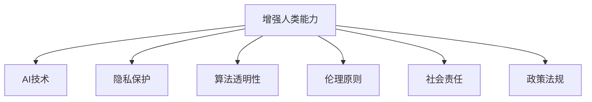

                 

# AI时代的人类增强：道德考虑和限制

> 关键词：人工智能,增强人类能力,道德困境,隐私保护,算法透明性,伦理原则,社会责任,政策法规

## 1. 背景介绍

### 1.1 问题由来
随着人工智能(AI)技术的飞速发展，尤其是深度学习和自然语言处理(NLP)技术的突破，人类得以在医疗、教育、商业等众多领域中大幅提升工作效率和生产力。然而，这种技术进步也带来了前所未有的道德和伦理挑战。如何确保AI技术在推动人类社会进步的同时，不侵害个人隐私、尊严和权利，成为了一个亟待解决的问题。

### 1.2 问题核心关键点
人类增强（Human Enhancement）是指通过技术手段改善或增强人类物理、认知和情感能力，使其能够更好地适应社会和环境的变化。AI技术在这一过程中扮演了重要角色，但同时也引发了诸多道德困境和限制。

- **隐私保护**：AI技术需要大量个人数据进行训练和优化，如何确保这些数据的安全和隐私成为一大难题。
- **算法透明性**：复杂的AI模型往往像“黑箱”一样难以解释，缺乏透明性的算法容易引发信任危机。
- **伦理原则**：在提升人类能力的同时，AI技术是否应该遵循特定的伦理原则，如不伤害原则、公平原则、自由选择原则等，仍存在较大争议。
- **社会责任**：AI技术的广泛应用可能加剧社会不平等，如何通过合理政策和规范，确保AI技术惠及全社会，是一个亟待解决的问题。
- **政策法规**：如何制定有效的政策法规，规范AI技术的开发和使用，避免其滥用和误用，需要社会各界共同努力。

这些关键点构成了AI时代人类增强的重要讨论焦点，本文将深入探讨这些议题，并给出相关的应对策略。

## 2. 核心概念与联系

### 2.1 核心概念概述

为更好地理解AI时代人类增强的道德困境和限制，本节将介绍几个密切相关的核心概念：

- **增强人类能力**：指通过技术手段提高人类的智力和体力，使其在各个领域表现更优。例如，脑机接口技术可增强大脑功能，基因编辑技术可修正基因缺陷，AI辅助的高级认知工具可提升问题解决和创新能力。
- **AI技术**：利用机器学习和深度学习技术，使计算机系统具有自主学习和决策能力，如图像识别、自然语言处理、推荐系统等。
- **隐私保护**：确保个人信息在收集、存储和处理过程中不被泄露，保障个人数据安全。
- **算法透明性**：要求AI算法逻辑和决策过程透明，可被理解和解释。
- **伦理原则**：指导AI技术设计和应用的基本准则，如尊重人权、确保公平、避免伤害等。
- **社会责任**：企业和社会组织在使用AI技术时，应考虑其对社会和环境的影响，确保技术应用符合公众利益。
- **政策法规**：政府制定的法律法规，规范AI技术的开发和使用，保护公众权益。

这些核心概念之间的逻辑关系可以通过以下Mermaid流程图来展示：



这个流程图展示了一个从增强人类能力出发，如何通过AI技术，同时涉及隐私保护、算法透明性、伦理原则、社会责任和政策法规等各个方面的复杂关系。

## 3. 核心算法原理 & 具体操作步骤
### 3.1 算法原理概述

在AI时代的人类增强中，算法原理和具体操作步骤是实现技术突破的关键。下面以AI在医疗领域的应用为例，详细阐述其核心算法和具体操作步骤。

**算法原理**：
1. **数据收集**：收集患者的医疗记录、影像数据、基因信息等数据。
2. **数据预处理**：清洗和标准化数据，确保数据质量。
3. **模型训练**：使用深度学习算法（如卷积神经网络CNN、递归神经网络RNN、Transformer等）对数据进行训练，生成预测模型。
4. **模型评估**：通过交叉验证等方法评估模型的性能。
5. **模型应用**：将训练好的模型应用到新的患者数据上，进行疾病预测、治疗方案推荐等。

**操作步骤**：
1. **环境搭建**：选择合适的编程语言（如Python）和深度学习框架（如TensorFlow、PyTorch），搭建开发环境。
2. **数据获取**：通过API、数据集下载等方式获取所需数据。
3. **模型选择**：选择适合问题的深度学习模型，并进行配置。
4. **数据加载**：使用Python的数据处理库（如Pandas）加载数据，并进行预处理。
5. **模型训练**：设置训练参数，使用GPU加速训练。
6. **模型评估**：使用测试集评估模型性能，调整超参数。
7. **模型应用**：将模型集成到实际应用系统中，进行实时预测。

### 3.2 算法步骤详解

以AI在医疗领域中的应用为例，具体阐述其算法步骤：

1. **数据收集**：
   - 通过电子病历系统、影像设备、基因测序设备等收集患者数据。
   - 数据包括文本记录、影像图片、基因序列等。

2. **数据预处理**：
   - 清洗数据，去除噪声和异常值。
   - 标准化数据格式，例如统一影像像素值范围。
   - 将文本数据进行分词、编码，影像数据进行预处理（如裁剪、缩放）。
   - 将基因数据进行解析和编码。

3. **模型训练**：
   - 选择适合问题的深度学习模型，例如CNN用于影像分类，RNN用于序列数据处理。
   - 定义损失函数，如交叉熵损失。
   - 设置超参数，如学习率、批大小、迭代次数等。
   - 使用GPU加速训练，优化模型参数。

4. **模型评估**：
   - 使用交叉验证方法评估模型性能。
   - 计算准确率、召回率、F1分数等指标。
   - 调整超参数，优化模型性能。

5. **模型应用**：
   - 将训练好的模型集成到实际应用系统（如医疗诊断系统）中。
   - 对新患者的医疗记录、影像数据、基因数据进行处理。
   - 使用训练好的模型进行疾病预测、治疗方案推荐等。

### 3.3 算法优缺点

**优点**：
1. **高效性**：AI技术可以快速处理和分析大量医疗数据，提升诊断和治疗效率。
2. **准确性**：AI算法在处理医疗数据时，能够提供高度准确的预测结果。
3. **可扩展性**：AI模型可以不断学习新数据，适应新的医疗需求。

**缺点**：
1. **数据依赖**：AI技术依赖高质量、大量的医疗数据，数据质量不佳时容易出现错误。
2. **隐私风险**：医疗数据涉及个人隐私，数据泄露可能带来严重后果。
3. **算法透明性不足**：复杂的AI模型难以解释，缺乏透明性。
4. **伦理问题**：AI技术可能带来对人类能力的提升，但也可能加剧社会不平等。

### 3.4 算法应用领域

AI技术在医疗领域的应用广泛，包括但不限于以下几个方面：

- **疾病诊断**：通过影像数据、基因数据进行疾病预测和诊断。
- **治疗方案推荐**：根据患者数据，生成个性化的治疗方案。
- **医疗影像分析**：使用AI进行医疗影像的自动标注和分析。
- **药物研发**：使用AI进行药物筛选和设计。
- **健康管理**：使用AI进行健康数据分析和预警。

这些应用领域展示了AI技术在提升人类医疗健康方面的巨大潜力，但也带来了诸多道德和伦理挑战。

## 4. 数学模型和公式 & 详细讲解  
### 4.1 数学模型构建

以下我们以疾病预测模型为例，给出其数学模型和公式构建过程。

**数据表示**：
- **输入数据**：$x_i \in \mathbb{R}^{n}$，表示患者第$i$个特征向量。
- **输出数据**：$y_i \in \{0,1\}$，表示患者是否患病。

**模型表示**：
- **假设模型**：$f(x; \theta) = \sigma(Wx + b)$，其中 $\sigma$ 为激活函数，$W$ 和 $b$ 为模型参数。
- **损失函数**：$L(y,f(x; \theta)) = -y\log f(x; \theta) + (1-y)\log(1-f(x; \theta))$，交叉熵损失函数。

**公式推导**：
- **梯度下降**：$\nabla_{\theta} L(y,f(x; \theta)) = -y(f(x; \theta) - 1) \nabla_{\theta} f(x; \theta) - (1-y)f(x; \theta) \nabla_{\theta} f(x; \theta)$。

### 4.2 公式推导过程

**损失函数**：
- 使用交叉熵损失函数，衡量模型输出和真实标签之间的差异。
- 对于二分类问题，模型输出为 $f(x; \theta) = \sigma(Wx + b)$，其中 $W$ 和 $b$ 为模型参数，$\sigma$ 为激活函数（如sigmoid）。

**梯度下降**：
- 在每次迭代中，计算损失函数对模型参数 $\theta$ 的梯度，并使用梯度下降算法更新参数。
- 更新公式为 $\theta \leftarrow \theta - \eta \nabla_{\theta} L(y,f(x; \theta))$，其中 $\eta$ 为学习率。

### 4.3 案例分析与讲解

以疾病预测为例，解释其在医疗中的应用。

**数据处理**：
- 收集患者数据，包括年龄、性别、基因信息、影像数据等。
- 对数据进行预处理，例如图像预处理、基因数据编码等。
- 将数据分成训练集和测试集，用于模型训练和评估。

**模型训练**：
- 使用神经网络模型进行训练，例如卷积神经网络（CNN）。
- 使用交叉熵损失函数，计算模型输出和真实标签之间的差异。
- 使用梯度下降算法，最小化损失函数，更新模型参数。

**模型评估**：
- 使用测试集评估模型性能，计算准确率、召回率、F1分数等指标。
- 调整超参数，优化模型性能。

**模型应用**：
- 将训练好的模型应用到新患者的数据上，进行疾病预测。
- 生成个性化治疗方案，提高医疗效果。

## 5. 项目实践：代码实例和详细解释说明
### 5.1 开发环境搭建

在进行AI技术应用的项目实践前，需要准备好开发环境。以下是使用Python进行深度学习开发的环境配置流程：

1. 安装Anaconda：从官网下载并安装Anaconda，用于创建独立的Python环境。

2. 创建并激活虚拟环境：
```bash
conda create -n ai-env python=3.8 
conda activate ai-env
```

3. 安装深度学习框架：
```bash
conda install pytorch torchvision torchaudio -c pytorch -c conda-forge
```

4. 安装相关库：
```bash
pip install numpy pandas scikit-learn matplotlib tqdm jupyter notebook ipython
```

完成上述步骤后，即可在`ai-env`环境中开始AI技术的应用实践。

### 5.2 源代码详细实现

下面我们以医疗影像分类为例，给出使用TensorFlow进行AI技术应用的PyTorch代码实现。

```python
import tensorflow as tf
from tensorflow.keras import layers

model = tf.keras.Sequential([
    layers.Conv2D(32, (3, 3), activation='relu', input_shape=(64, 64, 3)),
    layers.MaxPooling2D((2, 2)),
    layers.Conv2D(64, (3, 3), activation='relu'),
    layers.MaxPooling2D((2, 2)),
    layers.Flatten(),
    layers.Dense(64, activation='relu'),
    layers.Dense(1, activation='sigmoid')
])

model.compile(optimizer='adam', loss='binary_crossentropy', metrics=['accuracy'])

# 加载数据
train_data = tf.keras.preprocessing.image_dataset_from_directory(
    'dataset/train',
    image_size=(64, 64),
    batch_size=32,
    labels='inferred'
)

test_data = tf.keras.preprocessing.image_dataset_from_directory(
    'dataset/test',
    image_size=(64, 64),
    batch_size=32,
    labels='inferred'
)

# 训练模型
model.fit(
    train_data,
    epochs=10,
    validation_data=test_data
)
```

以上就是使用TensorFlow对医疗影像分类模型进行训练的完整代码实现。可以看到，TensorFlow提供了强大的工具支持，使模型训练和评估变得简洁高效。

### 5.3 代码解读与分析

让我们再详细解读一下关键代码的实现细节：

**Sequential模型**：
- 使用`tf.keras.Sequential`创建顺序模型，方便添加和堆叠层。
- 包括卷积层、池化层、全连接层等，用于处理图像数据。

**模型编译**：
- 使用`compile`方法设置优化器、损失函数和评估指标。
- 使用Adam优化器和交叉熵损失函数，优化模型参数。

**数据加载**：
- 使用`tf.keras.preprocessing.image_dataset_from_directory`方法加载数据，支持图像自动预处理和标注。
- 将数据集分为训练集和测试集，方便模型训练和评估。

**模型训练**：
- 使用`fit`方法进行模型训练，设置训练轮数和验证集。
- 自动保存模型，方便后续使用。

可以看到，TensorFlow提供了丰富的API支持，使深度学习模型的开发和训练变得简单高效。开发者可以专注于模型架构的设计和算法优化，而不必过多关注底层细节。

## 6. 实际应用场景
### 6.1 医疗诊断

在医疗领域，AI技术已经广泛应用于疾病诊断、影像分析、治疗方案推荐等环节。通过深度学习算法，AI技术能够快速准确地分析医疗影像和基因数据，辅助医生进行疾病诊断和治疗决策。

**具体应用**：
- **影像分类**：使用卷积神经网络对医疗影像进行分类，如CT影像的肿瘤识别、X光影像的骨折诊断等。
- **基因分析**：使用深度学习算法对基因序列进行分析，如癌症基因突变检测、遗传病诊断等。
- **治疗方案推荐**：根据患者数据，生成个性化的治疗方案，提高治疗效果。

**技术优势**：
- **高效性**：AI技术能够快速处理和分析大量医疗数据，提高诊断和治疗效率。
- **准确性**：深度学习算法在处理医疗数据时，能够提供高度准确的预测结果。
- **可扩展性**：AI模型可以不断学习新数据，适应新的医疗需求。

**伦理挑战**：
- **数据隐私**：医疗数据涉及个人隐私，数据泄露可能带来严重后果。
- **算法透明性**：复杂的AI模型难以解释，缺乏透明性。
- **伦理问题**：AI技术可能带来对人类能力的提升，但也可能加剧社会不平等。

### 6.2 教育培训

在教育领域，AI技术也展现出了巨大的潜力。通过深度学习算法，AI技术能够辅助教师进行个性化教学、自动化评估、智能推荐等，提升教学效果和学习体验。

**具体应用**：
- **智能评估**：使用AI技术进行学生作业和考试的自动化评估，提高评估效率和公平性。
- **个性化推荐**：根据学生的学习数据，推荐个性化的学习资源和课程。
- **智能辅导**：使用AI技术进行智能辅导，解答学生疑问，提供个性化辅导。

**技术优势**：
- **高效性**：AI技术能够快速处理和分析大量学生数据，提升评估和推荐效率。
- **个性化**：深度学习算法能够根据学生的学习数据，提供个性化的推荐和学习建议。
- **自动化**：AI技术能够自动化评估和辅导，减少教师工作负担。

**伦理挑战**：
- **数据隐私**：学生数据涉及个人隐私，数据泄露可能带来严重后果。
- **算法透明性**：AI模型难以解释，缺乏透明性。
- **公平性**：AI技术可能加剧教育不平等，需要确保公平性。

### 6.3 智能制造

在智能制造领域，AI技术能够提高生产效率、降低成本、提升产品质量。通过深度学习算法，AI技术能够自动化生产线、预测设备故障、优化生产计划等，实现智能制造。

**具体应用**：
- **设备预测维护**：使用AI技术进行设备故障预测，提前进行维护，减少停机时间。
- **生产计划优化**：使用AI技术进行生产计划优化，提高生产效率和资源利用率。
- **质量控制**：使用AI技术进行质量控制，提升产品质量和一致性。

**技术优势**：
- **高效性**：AI技术能够快速处理和分析大量生产数据，提高生产效率。
- **准确性**：深度学习算法在处理生产数据时，能够提供高度准确的预测结果。
- **自动化**：AI技术能够自动化生产计划和质量控制，减少人工干预。

**伦理挑战**：
- **数据隐私**：生产数据涉及企业机密，数据泄露可能带来严重后果。
- **算法透明性**：AI模型难以解释，缺乏透明性。
- **伦理问题**：AI技术可能带来对人类就业的冲击，需要合理调控。

## 7. 工具和资源推荐
### 7.1 学习资源推荐

为了帮助开发者系统掌握AI技术的应用和道德考虑，这里推荐一些优质的学习资源：

1. **《深度学习》（Goodfellow等）**：该书系统介绍了深度学习的理论基础和实践方法，是学习深度学习的经典教材。
2. **CS231n《深度学习计算机视觉》课程**：斯坦福大学开设的计算机视觉课程，涵盖了图像分类、物体检测、语义分割等计算机视觉任务。
3. **CS224n《深度学习自然语言处理》课程**：斯坦福大学开设的自然语言处理课程，涵盖NLP任务的深度学习方法。
4. **AI伦理课程**：各大大学和在线平台提供的AI伦理课程，如哈佛大学《AI伦理与社会影响》课程。
5. **OpenAI《人工智能与伦理》报告**：该报告详细讨论了AI技术的伦理问题，并提出了相关建议。

通过对这些资源的学习实践，相信你一定能够快速掌握AI技术的精髓，并理解其中的伦理挑战。

### 7.2 开发工具推荐

高效的开发离不开优秀的工具支持。以下是几款用于AI技术应用开发的常用工具：

1. **TensorFlow**：由Google主导开发的开源深度学习框架，支持GPU/TPU加速，生产部署方便。
2. **PyTorch**：由Facebook开发的深度学习框架，支持动态图，适合快速迭代研究。
3. **Jupyter Notebook**：开源的交互式笔记本环境，支持代码编写、数据可视化和协作共享。
4. **TensorBoard**：TensorFlow配套的可视化工具，实时监测模型训练状态，提供丰富的图表呈现方式。
5. **Weights & Biases**：模型训练的实验跟踪工具，记录和可视化模型训练过程中的各项指标，方便对比和调优。

合理利用这些工具，可以显著提升AI技术的应用开发效率，加快创新迭代的步伐。

### 7.3 相关论文推荐

AI技术的发展源于学界的持续研究。以下是几篇奠基性的相关论文，推荐阅读：

1. **《深度学习》（Goodfellow等）**：该书系统介绍了深度学习的理论基础和实践方法，是学习深度学习的经典教材。
2. **《大规模视觉识别》（Deng等）**：该论文提出了ImageNet数据集和深度学习分类算法，为计算机视觉领域奠定了基础。
3. **《自然语言处理综述》（Devlin等）**：该论文详细介绍了自然语言处理任务的深度学习算法和最新进展。
4. **《AI伦理与社会影响》（Mitchell等）**：该论文讨论了AI技术的伦理问题，提出了相关建议。

这些论文代表了大规模视觉识别和自然语言处理领域的进展，展示了AI技术在推动人类社会进步方面的巨大潜力。

## 8. 总结：未来发展趋势与挑战
### 8.1 总结

本文对AI技术在医疗、教育、智能制造等领域的应用进行了详细探讨，并阐述了其中的伦理挑战。通过分析AI技术的核心算法和操作步骤，展示了其在提升人类能力方面的巨大潜力，同时也指出了数据隐私、算法透明性和伦理问题等诸多挑战。

### 8.2 未来发展趋势

展望未来，AI技术的应用前景广阔，其发展趋势如下：

1. **智能化水平提升**：AI技术将进一步提升医疗、教育、智能制造等领域的智能化水平，提高生产效率和学习效果。
2. **自动化程度加深**：AI技术将更多地应用于自动化生产、智能评估等领域，减少人工干预。
3. **个性化推荐普及**：AI技术将实现更加个性化、精准的推荐，提升用户体验。
4. **跨领域融合发展**：AI技术将与其他新兴技术（如区块链、物联网等）深度融合，实现跨领域应用。
5. **伦理框架完善**：随着AI技术的广泛应用，相关伦理框架将逐步完善，确保技术应用符合公众利益。

以上趋势凸显了AI技术的广阔前景，其应用范围和影响将进一步扩大，为人类社会带来深刻变革。

### 8.3 面临的挑战

尽管AI技术在各个领域展现出巨大潜力，但在实际应用中仍面临诸多挑战：

1. **数据隐私保护**：大规模数据集收集和处理过程中，如何确保数据隐私和安全是一个难题。
2. **算法透明性不足**：复杂的AI模型难以解释，缺乏透明性，容易引发信任危机。
3. **伦理问题**：AI技术可能带来对人类能力的提升，但也可能加剧社会不平等，引发伦理争议。
4. **政策法规不完善**：当前缺乏完善的AI法律法规，无法有效规范AI技术的开发和使用。

这些挑战需要学界、产业界和社会各界的共同努力，制定合理的政策和规范，确保AI技术在推动人类社会进步的同时，不损害公众利益。

### 8.4 研究展望

面对AI技术面临的诸多挑战，未来的研究需要在以下几个方面寻求新的突破：

1. **隐私保护技术**：开发隐私保护技术，确保数据隐私和安全。
2. **算法透明性提升**：开发可解释性强的AI模型，提高算法透明性。
3. **伦理框架完善**：制定完善的伦理框架，指导AI技术的开发和应用。
4. **政策法规制定**：制定合理的AI法律法规，规范AI技术的开发和使用。

这些研究方向的探索，将有助于推动AI技术的健康发展，确保其应用符合公众利益。

## 9. 附录：常见问题与解答

**Q1：AI技术在医疗诊断中存在哪些伦理问题？**

A: AI技术在医疗诊断中面临的伦理问题主要包括：
1. **数据隐私**：医疗数据涉及个人隐私，数据泄露可能带来严重后果。
2. **算法透明性**：复杂的AI模型难以解释，缺乏透明性。
3. **伦理问题**：AI技术可能带来对人类能力的提升，但也可能加剧社会不平等。

**Q2：如何提升AI算法的透明性？**

A: 提升AI算法的透明性，可以通过以下方法：
1. **模型可视化**：使用可视化工具（如TensorBoard）展示模型结构，帮助理解模型工作机制。
2. **可解释性技术**：使用可解释性技术（如LIME、SHAP等），解释模型的决策过程。
3. **透明度报告**：定期发布算法透明度报告，公开算法细节和决策依据。

**Q3：AI技术在教育领域的应用前景如何？**

A: AI技术在教育领域的应用前景广阔，具体如下：
1. **智能评估**：使用AI技术进行学生作业和考试的自动化评估，提高评估效率和公平性。
2. **个性化推荐**：根据学生的学习数据，推荐个性化的学习资源和课程。
3. **智能辅导**：使用AI技术进行智能辅导，解答学生疑问，提供个性化辅导。

**Q4：AI技术在智能制造中的应用有哪些？**

A: AI技术在智能制造中的应用广泛，具体如下：
1. **设备预测维护**：使用AI技术进行设备故障预测，提前进行维护，减少停机时间。
2. **生产计划优化**：使用AI技术进行生产计划优化，提高生产效率和资源利用率。
3. **质量控制**：使用AI技术进行质量控制，提升产品质量和一致性。

**Q5：如何确保AI技术的伦理应用？**

A: 确保AI技术的伦理应用，可以通过以下方法：
1. **伦理审查**：在AI技术开发和应用过程中，进行伦理审查和评估。
2. **公众参与**：通过公众咨询和参与，确保技术应用符合公众利益。
3. **伦理框架**：制定完善的伦理框架，指导AI技术的开发和应用。

通过这些方法，可以确保AI技术在推动人类社会进步的同时，不损害公众利益，实现技术的伦理应用。

---

作者：禅与计算机程序设计艺术 / Zen and the Art of Computer Programming

