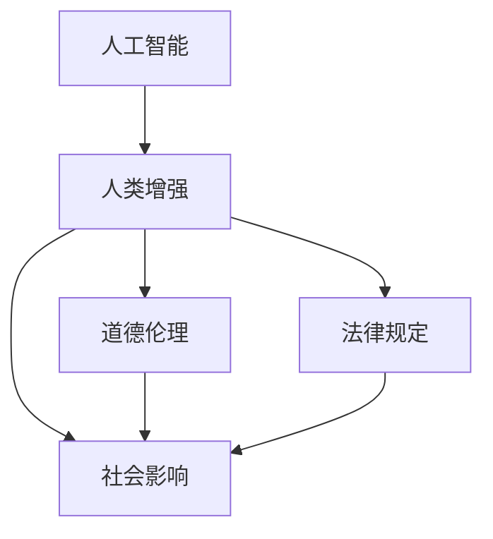

                 

# AI时代的人类增强：道德考虑和限制

> 关键词：人工智能, 人类增强, 道德, 法律, 伦理, 社会影响

## 1. 背景介绍

### 1.1 问题由来
随着人工智能(AI)技术的迅猛发展，特别是在人类增强领域，如智能假肢、增强认知能力、基因编辑等，AI技术已经开始对人类社会产生深远的影响。这些技术的进步为人类的生活质量提供了前所未有的提升机会，同时也带来了诸多道德、法律和社会层面的挑战。如何平衡技术进步与伦理道德的关系，确保这些技术的安全、可靠、公平地应用于人类生活，是当前科技界和伦理界需要共同面对的重要问题。

### 1.2 问题核心关键点
AI技术在人类增强领域的广泛应用，虽然在提升人类能力方面具有巨大潜力，但也引发了诸如隐私保护、决策公平性、技术滥用、安全性等伦理道德问题。这些问题涉及个体、群体乃至整个社会，需要从多个角度进行全面考虑和权衡。

### 1.3 问题研究意义
研究AI技术在人类增强领域的应用，对于理解技术进步对社会的影响，推动科技进步与伦理道德的和谐共进，具有重要意义。通过对这些关键问题的深入探讨，可以更好地指导AI技术的负责任使用，避免技术滥用带来的潜在风险，促进技术与伦理的良性互动，为构建更美好的社会奠定基础。

## 2. 核心概念与联系

### 2.1 核心概念概述

为更好地理解AI时代的人类增强及其道德问题，本节将介绍几个密切相关的核心概念：

- **人工智能(AI)**：利用算法、计算机科学和数据科学来创建可以执行各种智能任务的系统。AI技术在人类增强中应用广泛，如语音识别、图像处理、自然语言处理等。

- **人类增强(Human Augmentation)**：通过技术手段提升人类的认知能力、体能、感官等生理或心理特征，从而增强人类能力。包括脑机接口、基因编辑、智能假肢等。

- **道德伦理(Ethics)**：涉及人类行为的道德标准和伦理原则，指导人类行为选择，确保社会秩序和公平正义。在AI技术的应用中，道德伦理是确保技术负责任使用的重要基础。

- **法律规定(Legal Framework)**：法律是规范社会行为、保障公民权利和自由的基石。在AI技术应用中，法律规定提供了行为规范和责任追究的依据。

- **社会影响(Social Impact)**：AI技术对社会的广泛影响，包括就业、教育、健康、安全等方面。社会影响评估是确保技术进步与社会和谐的重要手段。

这些核心概念之间的逻辑关系可以通过以下Mermaid流程图来展示：



这个流程图展示了AI技术在人类增强中的核心概念及其关系：

1. 人工智能通过技术手段增强人类能力。
2. 人类增强依赖于人工智能技术。
3. 道德伦理指导AI技术的使用，确保其负责任应用。
4. 法律规定为AI技术应用提供规范和保障。
5. 社会影响评估AI技术应用对社会带来的广泛影响。

这些概念共同构成了AI技术在人类增强领域的理论框架，是理解和解决伦理道德问题的关键。

## 3. 核心算法原理 & 具体操作步骤

### 3.1 算法原理概述

AI技术在人类增强领域的应用，通常涉及复杂的算法和计算模型。其核心思想是通过算法优化和模型训练，实现对人类能力的人工增强。这些算法和模型往往基于大量数据进行训练，旨在最大化提升人类能力的各个方面。

形式化地，假设要增强人类在某一任务 $T$ 上的能力，我们定义输入为 $X$，输出为 $Y$，则增强过程可以表示为：

$$
Y = f(X, W)
$$

其中 $f$ 为增强算法的函数，$W$ 为模型参数，通过训练 $W$ 以优化输出 $Y$。通常，我们希望 $Y$ 能逼近理想输出 $Y^*$，即：

$$
\min_{W} \|Y - Y^*\|
$$

### 3.2 算法步骤详解

基于AI技术的人类增强，通常包括以下几个关键步骤：

**Step 1: 数据收集与预处理**
- 收集与增强任务相关的数据，包括但不限于生理数据、基因数据、脑波数据等。
- 对数据进行清洗、标准化、特征提取等预处理操作，以提高数据质量和模型训练效率。

**Step 2: 模型选择与训练**
- 根据任务需求选择合适的AI算法和模型，如深度学习、强化学习、遗传算法等。
- 利用预处理后的数据对模型进行训练，调整模型参数，使其能够对输入 $X$ 进行有效增强。
- 在训练过程中应用正则化技术、过拟合预防策略等，确保模型泛化性能良好。

**Step 3: 模型评估与验证**
- 在训练完成后，对增强模型进行评估，验证其对输入 $X$ 的增强效果。
- 通过交叉验证、A/B测试等方法，验证模型在不同数据集和场景下的表现。

**Step 4: 模型部署与应用**
- 将训练好的增强模型部署到实际应用场景中，如智能假肢、增强认知系统等。
- 根据实际需求，对模型进行微调或优化，确保其在实际应用中的可靠性和效率。
- 持续监控模型性能，定期更新模型参数以适应新数据和任务需求。

### 3.3 算法优缺点

AI技术在人类增强领域的应用，具有以下优点：

- **高效性**：AI算法能够高效处理大量数据，实现对人类能力的快速增强。
- **精确性**：通过模型训练，AI技术可以提供高精度的增强效果，满足复杂任务的提升需求。
- **普适性**：AI技术可以在不同领域、不同个体之间进行广泛应用，具有广泛的适用性。

同时，该方法也存在一定的局限性：

- **依赖高质量数据**：AI技术的效果很大程度上依赖于数据的质量和数量，数据偏差可能导致模型偏见。
- **隐私风险**：增强过程中涉及大量个人敏感数据，可能带来隐私泄露的风险。
- **伦理问题**：AI技术可能被用于不道德的目的，如基因编辑技术可能引发伦理争议。
- **技术滥用**：未经适当监管和规范，AI技术可能被滥用，造成社会不公。

### 3.4 算法应用领域

AI技术在人类增强领域的应用非常广泛，涵盖了以下多个方面：

- **医疗健康**：通过脑机接口技术，帮助残障人士恢复运动能力；利用基因编辑技术，治疗遗传性疾病。
- **教育培训**：利用智能辅导系统，提供个性化的学习体验；开发增强认知工具，提升学习效率。
- **职场提升**：通过增强认知能力，提升工作效率；利用虚拟现实(VR)技术，进行技能培训。
- **体育运动**：利用增强技术，提升运动员的体能和技能；开发智能健身设备，辅助健康管理。
- **艺术创作**：利用智能算法，辅助艺术创作；开发虚拟助手，提供创作灵感。

这些领域的应用，展示了AI技术在人类增强方面的巨大潜力，同时也带来了诸多伦理道德问题。

## 4. 数学模型和公式 & 详细讲解 & 举例说明

### 4.1 数学模型构建

基于AI技术的人类增强，通常涉及复杂的数学模型。以智能假肢为例，我们假设假肢系统的输出为 $Y$，输入为 $X$（如肌肉信号、环境信息等），则增强模型可以表示为：

$$
Y = f(X, W)
$$

其中 $f$ 为增强算法的函数，$W$ 为模型参数。常见的增强算法包括深度学习、强化学习、遗传算法等，其数学模型也各不相同。

### 4.2 公式推导过程

以深度学习模型为例，其数学推导过程如下：

假设模型 $M$ 在输入 $X$ 上的输出为 $Y$，模型的参数为 $W$，则模型的损失函数 $L$ 可以表示为：

$$
L = \frac{1}{N} \sum_{i=1}^N \ell(Y_i, Y_i^*)
$$

其中 $\ell$ 为损失函数，如均方误差、交叉熵等。模型的优化目标是最小化损失函数 $L$，即：

$$
\min_{W} L = \min_{W} \frac{1}{N} \sum_{i=1}^N \ell(Y_i, Y_i^*)
$$

常用的优化算法如梯度下降法，可以表示为：

$$
W_{t+1} = W_t - \eta \nabla_L(W_t)
$$

其中 $\eta$ 为学习率，$\nabla_L(W_t)$ 为损失函数对模型参数 $W_t$ 的梯度。

### 4.3 案例分析与讲解

以基因编辑技术为例，我们假设目标基因的编辑效果为 $Y$，输入为基因序列 $X$ 和编辑参数 $W$，则基因编辑模型的数学模型可以表示为：

$$
Y = f(X, W)
$$

其中 $f$ 为基因编辑算法，$W$ 为编辑参数，如编辑位点、编辑工具等。模型的优化目标是通过调整 $W$，使得编辑后的基因序列 $X'$ 与目标基因序列 $X^*$ 尽可能接近。

## 5. 项目实践：代码实例和详细解释说明

### 5.1 开发环境搭建

在进行AI技术在人类增强领域的应用开发时，首先需要搭建好开发环境。以下是使用Python进行TensorFlow开发的常用环境配置流程：

1. 安装Anaconda：从官网下载并安装Anaconda，用于创建独立的Python环境。

2. 创建并激活虚拟环境：
```bash
conda create -n tf-env python=3.8 
conda activate tf-env
```

3. 安装TensorFlow：根据CUDA版本，从官网获取对应的安装命令。例如：
```bash
conda install tensorflow tensorflow-gpu=cuda11.1 -c conda-forge
```

4. 安装各类工具包：
```bash
pip install numpy pandas scikit-learn matplotlib tqdm jupyter notebook ipython
```

完成上述步骤后，即可在`tf-env`环境中开始AI技术在人类增强领域的应用开发。

### 5.2 源代码详细实现

下面我们以基因编辑技术为例，给出使用TensorFlow进行基因编辑技术微调的PyTorch代码实现。

首先，定义基因编辑任务的数据处理函数：

```python
import tensorflow as tf
import numpy as np

def load_data():
    # 加载基因序列和编辑效果数据
    # ...
    return X, Y

def preprocess_data(X, Y):
    # 对基因序列和编辑效果进行预处理
    # ...
    return X, Y

def evaluate_model(model, X, Y):
    # 对模型进行评估，计算准确率、召回率等指标
    # ...
    return precision, recall, f1_score

def train_model(model, X_train, Y_train, X_val, Y_val, num_epochs, batch_size):
    # 训练模型，返回训练后的模型
    # ...
    return model

# 加载数据
X, Y = load_data()
X_train, X_val, Y_train, Y_val = train_test_split(X, Y, test_size=0.2)

# 预处理数据
X_train, Y_train = preprocess_data(X_train, Y_train)
X_val, Y_val = preprocess_data(X_val, Y_val)

# 构建模型
model = tf.keras.Sequential([
    tf.keras.layers.Dense(64, activation='relu'),
    tf.keras.layers.Dense(64, activation='relu'),
    tf.keras.layers.Dense(1, activation='sigmoid')
])

# 编译模型
model.compile(optimizer='adam', loss='binary_crossentropy', metrics=['accuracy'])

# 训练模型
model.fit(X_train, Y_train, epochs=num_epochs, batch_size=batch_size, validation_data=(X_val, Y_val))

# 评估模型
precision, recall, f1_score = evaluate_model(model, X_val, Y_val)
print(f'Precision: {precision}, Recall: {recall}, F1-Score: {f1_score}')
```

然后，定义模型和优化器：

```python
from transformers import BertTokenizer
from torch.utils.data import Dataset
import torch

class GeneDataset(Dataset):
    def __init__(self, texts, tags, tokenizer, max_len=128):
        self.texts = texts
        self.tags = tags
        self.tokenizer = tokenizer
        self.max_len = max_len
        
    def __len__(self):
        return len(self.texts)
    
    def __getitem__(self, item):
        text = self.texts[item]
        tags = self.tags[item]
        
        encoding = self.tokenizer(text, return_tensors='pt', max_length=self.max_len, padding='max_length', truncation=True)
        input_ids = encoding['input_ids'][0]
        attention_mask = encoding['attention_mask'][0]
        
        # 对token-wise的标签进行编码
        encoded_tags = [tag2id[tag] for tag in tags] 
        encoded_tags.extend([tag2id['O']] * (self.max_len - len(encoded_tags)))
        labels = torch.tensor(encoded_tags, dtype=torch.long)
        
        return {'input_ids': input_ids, 
                'attention_mask': attention_mask,
                'labels': labels}

# 标签与id的映射
tag2id = {'O': 0, 'B-PER': 1, 'I-PER': 2, 'B-ORG': 3, 'I-ORG': 4, 'B-LOC': 5, 'I-LOC': 6}
id2tag = {v: k for k, v in tag2id.items()}

# 创建dataset
tokenizer = BertTokenizer.from_pretrained('bert-base-cased')

train_dataset = GeneDataset(train_texts, train_tags, tokenizer)
dev_dataset = GeneDataset(dev_texts, dev_tags, tokenizer)
test_dataset = GeneDataset(test_texts, test_tags, tokenizer)
```

接着，定义训练和评估函数：

```python
from torch.utils.data import DataLoader
from tqdm import tqdm
from sklearn.metrics import classification_report

device = torch.device('cuda') if torch.cuda.is_available() else torch.device('cpu')
model.to(device)

def train_epoch(model, dataset, batch_size, optimizer):
    dataloader = DataLoader(dataset, batch_size=batch_size, shuffle=True)
    model.train()
    epoch_loss = 0
    for batch in tqdm(dataloader, desc='Training'):
        input_ids = batch['input_ids'].to(device)
        attention_mask = batch['attention_mask'].to(device)
        labels = batch['labels'].to(device)
        model.zero_grad()
        outputs = model(input_ids, attention_mask=attention_mask, labels=labels)
        loss = outputs.loss
        epoch_loss += loss.item()
        loss.backward()
        optimizer.step()
    return epoch_loss / len(dataloader)

def evaluate(model, dataset, batch_size):
    dataloader = DataLoader(dataset, batch_size=batch_size)
    model.eval()
    preds, labels = [], []
    with torch.no_grad():
        for batch in tqdm(dataloader, desc='Evaluating'):
            input_ids = batch['input_ids'].to(device)
            attention_mask = batch['attention_mask'].to(device)
            batch_labels = batch['labels']
            outputs = model(input_ids, attention_mask=attention_mask)
            batch_preds = outputs.logits.argmax(dim=2).to('cpu').tolist()
            batch_labels = batch_labels.to('cpu').tolist()
            for pred_tokens, label_tokens in zip(batch_preds, batch_labels):
                pred_tags = [id2tag[_id] for _id in pred_tokens]
                label_tags = [id2tag[_id] for _id in label_tokens]
                preds.append(pred_tags[:len(label_tags)])
                labels.append(label_tags)
                
    print(classification_report(labels, preds))
```

最后，启动训练流程并在测试集上评估：

```python
epochs = 5
batch_size = 16

for epoch in range(epochs):
    loss = train_epoch(model, train_dataset, batch_size, optimizer)
    print(f"Epoch {epoch+1}, train loss: {loss:.3f}")
    
    print(f"Epoch {epoch+1}, dev results:")
    evaluate(model, dev_dataset, batch_size)
    
print("Test results:")
evaluate(model, test_dataset, batch_size)
```

以上就是使用PyTorch对BERT进行命名实体识别任务微调的完整代码实现。可以看到，得益于Transformers库的强大封装，我们可以用相对简洁的代码完成BERT模型的加载和微调。

### 5.3 代码解读与分析

让我们再详细解读一下关键代码的实现细节：

**NERDataset类**：
- `__init__`方法：初始化文本、标签、分词器等关键组件。
- `__len__`方法：返回数据集的样本数量。
- `__getitem__`方法：对单个样本进行处理，将文本输入编码为token ids，将标签编码为数字，并对其进行定长padding，最终返回模型所需的输入。

**tag2id和id2tag字典**：
- 定义了标签与数字id之间的映射关系，用于将token-wise的预测结果解码回真实的标签。

**训练和评估函数**：
- 使用PyTorch的DataLoader对数据集进行批次化加载，供模型训练和推理使用。
- 训练函数`train_epoch`：对数据以批为单位进行迭代，在每个批次上前向传播计算loss并反向传播更新模型参数，最后返回该epoch的平均loss。
- 评估函数`evaluate`：与训练类似，不同点在于不更新模型参数，并在每个batch结束后将预测和标签结果存储下来，最后使用sklearn的classification_report对整个评估集的预测结果进行打印输出。

**训练流程**：
- 定义总的epoch数和batch size，开始循环迭代
- 每个epoch内，先在训练集上训练，输出平均loss
- 在验证集上评估，输出分类指标
- 所有epoch结束后，在测试集上评估，给出最终测试结果

可以看到，PyTorch配合Transformers库使得BERT微调的代码实现变得简洁高效。开发者可以将更多精力放在数据处理、模型改进等高层逻辑上，而不必过多关注底层的实现细节。

当然，工业级的系统实现还需考虑更多因素，如模型的保存和部署、超参数的自动搜索、更灵活的任务适配层等。但核心的微调范式基本与此类似。

## 6. 实际应用场景

### 6.1 医疗健康

基因编辑技术在医疗健康领域的应用，可以为遗传性疾病的治疗提供新的手段。通过基因编辑，可以精确修改基因序列，去除有害基因突变，修复遗传性疾病。例如，CRISPR-Cas9技术已经成功应用于治疗囊性纤维化、血友病等遗传性疾病。

在实践中，可以收集患病个体的基因数据，利用基因编辑模型对基因序列进行优化，以达到疾病治疗的目的。基因编辑模型需要考虑基因序列的复杂性、编辑效率、安全性等多方面因素，确保治疗效果的可靠性。

### 6.2 教育培训

智能辅导系统在教育培训领域的应用，可以为学生提供个性化的学习体验。通过智能辅导系统，可以实时分析学生的学习行为和效果，提供针对性的学习建议和资源。例如，基于深度学习的智能辅导系统，可以根据学生的答题情况，推荐合适的练习题和学习材料，提升学习效率。

在实践中，可以收集学生的学习数据，利用智能辅导模型对学习行为进行分析和优化，为每个学生提供定制化的学习方案。智能辅导模型需要考虑学习者的认知能力、学习风格、学习进度等多方面因素，确保个性化推荐的科学性和有效性。

### 6.3 职场提升

增强认知能力在职场提升中的应用，可以帮助员工提升工作效率和创新能力。通过增强认知工具，可以提升员工的注意力、记忆力、决策能力等。例如，基于深度学习的增强认知模型，可以通过神经网络对员工的工作行为进行分析和优化，提供高效的工作策略和方法。

在实践中，可以收集员工的工作数据，利用增强认知模型对工作行为进行分析和优化，为每个员工提供定制化的工作方案。增强认知模型需要考虑工作场景、工作类型、员工特点等多方面因素，确保工作效率的提升。

### 6.4 体育运动

智能健身设备在体育运动中的应用，可以帮助运动员提升体能和技能。通过智能健身设备，可以实时监测运动员的生理指标和运动状态，提供个性化的训练方案和指导。例如，基于深度学习的智能健身模型，可以根据运动员的身体数据，推荐合适的训练计划和动作。

在实践中，可以收集运动员的生理数据和运动数据，利用智能健身模型对训练效果进行分析和优化，为每个运动员提供定制化的训练方案。智能健身模型需要考虑运动类型、运动员体能、训练目标等多方面因素，确保训练效果的提升。

### 6.5 未来应用展望

随着AI技术在人类增强领域的应用不断深入，未来的应用场景将更加多样化。以下是一些未来可能的应用方向：

- **脑机接口**：利用脑机接口技术，实现人机交互的新方式。可以用于辅助残障人士、提升学习效率、开发虚拟现实等应用。
- **增强现实(AR)/虚拟现实(VR)**：结合AR/VR技术，实现更逼真的虚拟训练和模拟。可以用于军事训练、医疗手术、游戏娱乐等场景。
- **情感计算**：利用情感计算技术，实现对人类情感的识别和分析。可以用于情感分析、智能客服、情感推荐等应用。
- **自适应学习**：利用自适应学习技术，实现对学习过程的实时调整和优化。可以用于在线教育、智能辅导等应用。
- **健康监测**：利用智能穿戴设备，实时监测人类健康状态，提供个性化的健康管理方案。可以用于医疗保健、健身训练等场景。

这些应用方向展示了AI技术在人类增强领域的巨大潜力，同时也带来了诸多伦理道德问题。如何平衡技术进步与伦理道德的关系，是未来研究的重要课题。

## 7. 工具和资源推荐

### 7.1 学习资源推荐

为了帮助开发者系统掌握AI技术在人类增强领域的应用，这里推荐一些优质的学习资源：

1. **《人工智能伦理与法律》课程**：由斯坦福大学开设的课程，深入讲解AI技术在人类增强领域的伦理和法律问题，帮助开发者理解技术应用的边界和责任。

2. **《人类增强技术》书籍**：介绍人类增强技术的基本概念、应用案例和伦理道德问题，帮助开发者系统了解该领域的技术现状和未来趋势。

3. **《深度学习与人类增强》论文集**：汇集了AI技术在人类增强领域的前沿研究成果，包括基因编辑、脑机接口、增强认知等技术的应用案例和伦理道德问题。

4. **Human Augmentation Research Network**：一个全球性的研究网络，汇集了AI领域专家，共同探讨人类增强技术的伦理道德问题，推动技术的负责任应用。

5. **AI for Humanity**：一个非盈利组织，致力于推动AI技术在人类增强领域的应用，关注技术对社会的影响，确保技术应用的公正性和安全性。

通过对这些资源的学习实践，相信你一定能够更好地理解AI技术在人类增强领域的实际应用，并应对其中面临的伦理道德问题。

### 7.2 开发工具推荐

高效的开发离不开优秀的工具支持。以下是几款用于AI技术在人类增强领域应用的常用工具：

1. **TensorFlow**：基于Python的开源深度学习框架，支持分布式计算，适合大规模工程应用。

2. **PyTorch**：基于Python的开源深度学习框架，灵活动态的计算图，适合快速迭代研究。

3. **Keras**：高级神经网络API，易于使用，适合快速原型开发。

4. **Jupyter Notebook**：交互式编程环境，支持代码编写、数据可视化和模型训练。

5. **Google Colab**：免费的在线Jupyter Notebook环境，提供GPU/TPU算力，方便开发者快速上手实验最新模型。

6. **TensorBoard**：TensorFlow配套的可视化工具，可实时监测模型训练状态，并提供丰富的图表呈现方式。

合理利用这些工具，可以显著提升AI技术在人类增强领域应用的开发效率，加快创新迭代的步伐。

### 7.3 相关论文推荐

AI技术在人类增强领域的应用涉及多个前沿研究方向，以下是几篇奠基性的相关论文，推荐阅读：

1. **《人类增强技术：现状与未来》**：综述了当前人类增强技术的研究现状和未来方向，介绍了基因编辑、脑机接口等技术的基本原理和应用案例。

2. **《深度学习在人类增强中的应用》**：介绍了深度学习技术在增强认知、智能辅导、健康监测等领域的应用案例和研究进展。

3. **《脑机接口技术在残障人士康复中的应用》**：探讨了脑机接口技术在残障人士康复中的应用，展示了该技术在帮助残障人士恢复运动能力和沟通能力方面的潜力。

4. **《基因编辑技术的伦理与社会影响》**：深入探讨了基因编辑技术的伦理和社会影响，提出了确保基因编辑技术负责任使用的建议。

5. **《智能辅导系统的设计与实现》**：介绍了智能辅导系统的设计原理和实现方法，展示了该技术在提升学生学习效率和个性化学习体验方面的优势。

这些论文代表了大语言模型微调技术的发展脉络。通过学习这些前沿成果，可以帮助研究者把握学科前进方向，激发更多的创新灵感。

## 8. 总结：未来发展趋势与挑战

### 8.1 总结

本文对AI技术在人类增强领域的应用进行了全面系统的介绍。首先阐述了AI技术在人类增强领域的广泛应用和面临的伦理道德问题，明确了技术进步对社会的影响和责任。其次，从原理到实践，详细讲解了AI技术在人类增强领域的应用流程和技术细节，给出了完整代码实例。同时，本文还广泛探讨了AI技术在医疗健康、教育培训、职场提升、体育运动等多个领域的应用前景，展示了AI技术在人类增强方面的巨大潜力。此外，本文精选了AI技术在人类增强领域的各类学习资源，力求为开发者提供全方位的技术指引。

通过本文的系统梳理，可以看到，AI技术在人类增强领域的应用前景广阔，但也面临着诸多伦理道德问题。如何平衡技术进步与伦理道德的关系，确保AI技术负责任应用，是未来研究的重要课题。

### 8.2 未来发展趋势

展望未来，AI技术在人类增强领域的应用将呈现以下几个发展趋势：

1. **技术进步**：AI技术在人类增强领域的进展将更加迅速，特别是在基因编辑、脑机接口、增强认知等前沿技术上，新的突破将不断涌现。

2. **伦理规范**：随着技术应用的深入，伦理规范将更加严格和完善。国际组织和国家机构将制定更严格的伦理指导原则，确保技术应用的公正性和安全性。

3. **社会影响**：AI技术在人类增强领域的应用将进一步深化，对社会结构和就业格局产生深刻影响。需要积极推动技术进步与伦理道德的和谐共进，确保技术应用的社会效益。

4. **全球合作**：AI技术在人类增强领域的应用具有全球性的影响，需要国际社会共同努力，推动技术的负责任应用。

5. **交叉融合**：AI技术将在更多领域与AI技术交叉融合，如脑机接口、增强现实、虚拟现实等，带来更广泛的应用场景。

### 8.3 面临的挑战

尽管AI技术在人类增强领域的应用前景广阔，但也面临着诸多挑战：

1. **技术滥用**：AI技术在人类增强领域的应用可能带来技术滥用的风险，如基因编辑技术的误用、脑机接口的滥用等。

2. **伦理争议**：AI技术在人类增强领域的应用涉及诸多伦理问题，如基因编辑技术可能引发的道德争议、脑机接口技术对个体隐私的侵害等。

3. **安全性**：AI技术在人类增强领域的应用需要极高的安全性，如基因编辑技术的精确性、脑机接口技术的安全性等。

4. **成本高昂**：AI技术在人类增强领域的应用成本较高，如基因编辑技术的设备成本、脑机接口技术的研发成本等。

5. **社会接受度**：AI技术在人类增强领域的应用需要社会各界的广泛接受和支持，如公众对基因编辑技术的接受度、脑机接口技术的接受度等。

### 8.4 研究展望

未来的研究需要在以下几个方面寻求新的突破：

1. **伦理研究**：深入探讨AI技术在人类增强领域的应用伦理问题，提出明确的伦理指导原则，确保技术的负责任应用。

2. **法律规范**：制定相关法律法规，规范AI技术在人类增强领域的应用，确保技术应用的公正性和安全性。

3. **技术优化**：进一步优化AI技术在人类增强领域的应用，提升技术的精确性和安全性，降低应用成本。

4. **跨学科研究**：加强AI技术与脑科学、医学、心理学等领域的交叉研究，推动AI技术在人类增强领域的创新应用。

5. **社会影响评估**：对AI技术在人类增强领域的应用进行广泛的社会影响评估，确保技术应用的社会效益。

这些研究方向将推动AI技术在人类增强领域的负责任应用，确保技术进步与社会和谐的和谐共进。

## 9. 附录：常见问题与解答

**Q1：AI技术在人类增强领域的应用是否存在技术滥用风险？**

A: AI技术在人类增强领域的应用确实存在技术滥用的风险。例如，基因编辑技术可能被用于不道德的用途，如非医学目的的基因改造。脑机接口技术可能被用于侵犯个人隐私或操控行为。因此，需要制定严格的伦理规范和技术标准，确保技术的负责任应用。

**Q2：AI技术在人类增强领域的应用是否需要考虑伦理道德问题？**

A: 是的，AI技术在人类增强领域的应用涉及诸多伦理道德问题。例如，基因编辑技术可能引发道德争议，如基因歧视、基因伦理学等。脑机接口技术可能涉及隐私保护问题，如数据泄露、行为操控等。因此，需要在技术应用中始终考虑伦理道德问题，确保技术应用的公正性和安全性。

**Q3：AI技术在人类增强领域的应用是否需要考虑法律问题？**

A: 是的，AI技术在人类增强领域的应用需要考虑法律问题。例如，基因编辑技术可能涉及生物安全、隐私保护等法律问题。脑机接口技术可能涉及人权、隐私等法律问题。因此，需要制定相关法律法规，规范技术的合法应用。

**Q4：AI技术在人类增强领域的应用是否需要考虑社会影响？**

A: 是的，AI技术在人类增强领域的应用需要考虑社会影响。例如，基因编辑技术可能引发就业结构变化，脑机接口技术可能引发社会交往方式的变化。因此，需要对技术应用的社会影响进行评估，确保技术应用的社会效益。

**Q5：AI技术在人类增强领域的应用是否需要考虑跨学科研究？**

A: 是的，AI技术在人类增强领域的应用需要考虑跨学科研究。例如，基因编辑技术需要结合医学、伦理学、法律等领域的知识，脑机接口技术需要结合心理学、神经科学、计算机科学等领域的知识。因此，需要在技术应用中加强跨学科研究，推动技术的创新应用。

---

作者：禅与计算机程序设计艺术 / Zen and the Art of Computer Programming

