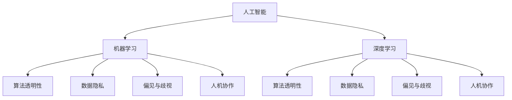

                 

# AI时代的人类计算：道德考虑

## 1. 背景介绍

随着人工智能(AI)技术的飞速发展，人类计算范式正逐渐从以人为主导的计算模式，向由机器主导的智能计算模式转变。AI不仅改变了我们处理信息、解决问题的方式，也在深刻地重塑着社会结构、伦理观念和文化生态。在这个背景下，如何确保AI技术应用的伦理性和道德性，成为全球范围内亟需关注和讨论的话题。

### 1.1 问题由来

AI技术的应用已经渗透到医疗、教育、金融、交通等多个领域，极大提升了社会生产力和生活便利性。但与此同时，AI技术的潜在不公平性、歧视性、透明性等问题也逐渐显现。例如，人脸识别技术的误识别问题、自动化决策系统的偏颇性、智能推荐系统中的信息茧房等，都引发了广泛的社会关切。因此，探讨AI时代的人类计算，必须将道德伦理考量纳入核心议题。

### 1.2 问题核心关键点

AI时代人类计算的道德考虑，主要包括以下几个关键点：

1. **算法透明性**：AI系统作为“黑盒”运行，决策过程缺乏透明性，容易导致信任危机。
2. **数据隐私**：AI系统大量依赖数据，数据收集、存储和使用过程中可能侵犯用户隐私。
3. **偏见与歧视**：AI算法可能无意中放大现实中的偏见，导致系统决策的不公平。
4. **责任归属**：AI系统的错误决策可能导致严重后果，如何界定责任成为一大难题。
5. **人机协作**：AI系统在辅助人类决策时，如何确保其输出符合人类价值观和伦理道德。

本文旨在通过系统的阐述这些核心关键点，探讨如何在AI技术推广应用的过程中，兼顾技术的进步与伦理道德的考量。

## 2. 核心概念与联系

### 2.1 核心概念概述

为更好地理解AI时代人类计算的道德考虑，本节将介绍几个密切相关的核心概念：

- **人工智能(AI)**：指通过计算机程序实现模仿人类智能的科学和技术，包括机器学习、自然语言处理、计算机视觉等子领域。
- **机器学习(ML)**：指通过数据驱动的学习方式，让机器自动识别数据规律，从而实现预测、分类、聚类等任务。
- **深度学习(Deep Learning)**：机器学习的一种高级形式，通过多层神经网络模拟人类大脑神经元，提取高层次特征。
- **伦理道德(Ethics and Morality)**：涉及如何判断善恶、公正、责任等原则，在技术应用中确保人类福祉。
- **数据隐私(P Privacy)**：指个人数据的收集、存储和使用过程中，对数据所有者权利的尊重和保护。
- **算法透明性(Transparency)**：指算法决策过程的公开和可解释性，让用户理解系统的运行机制。
- **偏见与歧视(Bias and Discrimination)**：指算法在数据训练或模型设计中，反映或放大了现实中的不公平现象。
- **人机协作(Human-Machine Collaboration)**：指AI系统在辅助人类决策时，如何保持与人类价值观的一致性。

这些核心概念之间的逻辑关系可以通过以下Mermaid流程图来展示：



这个流程图展示了几大核心概念之间的关联：

1. 人工智能包含了机器学习和深度学习，是AI技术的基础。
2. 机器学习和深度学习分别涉及到算法透明性、数据隐私、偏见与歧视和人机协作等伦理道德问题。
3. 这些伦理道德问题不仅影响到技术本身的适用性和安全性，还关系到技术推广的社会影响和公共利益。

## 3. 核心算法原理 & 具体操作步骤

### 3.1 算法原理概述

AI时代的道德考虑，主要通过以下几个步骤进行：

1. **伦理原则确定**：在技术设计初期，明确伦理原则和道德标准，指导技术开发和应用。
2. **数据采集与处理**：遵循数据隐私原则，确保数据收集和处理过程透明、合规。
3. **模型训练与优化**：采用算法透明性原则，使模型训练过程可解释，避免模型偏见。
4. **结果评估与反馈**：定期评估AI系统性能，收集用户反馈，调整优化算法和策略。
5. **社会影响分析**：在技术推广前，进行社会影响评估，预测潜在风险，制定应对措施。

### 3.2 算法步骤详解

下面将详细介绍这五个步骤的实现过程：

**Step 1: 伦理原则确定**
- 组建伦理委员会，涵盖专家、用户、监管机构等利益相关方。
- 制定明确的伦理守则和道德规范，如隐私保护、数据安全、算法透明性等。
- 在技术开发初期，参照伦理原则进行需求分析和系统设计。

**Step 2: 数据采集与处理**
- 采用匿名化、去标识化等手段，保护用户隐私。
- 明确数据收集目的和范围，获得用户知情同意。
- 实施数据存储和传输的安全协议，防止数据泄露。

**Step 3: 模型训练与优化**
- 采用可解释性强的算法，如决策树、规则引擎等，避免“黑盒”系统。
- 在模型训练过程中，进行偏见检测和纠正，确保模型公平。
- 使用对抗样本训练，提升模型鲁棒性。

**Step 4: 结果评估与反馈**
- 定期进行模型评估，使用指标如准确率、召回率、F1值等。
- 收集用户反馈，进行用户调研和问卷调查，了解模型应用效果。
- 根据评估结果和反馈，调整优化模型和算法。

**Step 5: 社会影响分析**
- 在技术推广前，进行社会影响评估，预测可能带来的正面和负面影响。
- 与利益相关方进行沟通，制定应对措施，减少技术应用中的道德风险。
- 设立伦理审查机制，持续监控技术应用中的道德问题。

### 3.3 算法优缺点

AI时代的道德考虑，具有以下优点：

1. **预防道德风险**：在技术开发和应用过程中，提前进行伦理道德考量，可以预防潜在的道德风险和伦理问题。
2. **增强社会信任**：通过透明和公平的技术应用，增强公众对AI技术的信任感。
3. **提升技术效果**：合理的伦理道德考量，有助于提升AI系统的性能和可靠性。

同时，也存在一些局限：

1. **实施成本高**：伦理道德考量需要在技术开发和应用的全流程中实施，增加了时间和资金投入。
2. **道德标准差异**：不同国家和地区对于道德标准的要求不同，增加了国际合作和应用推广的复杂性。
3. **技术创新受限**：过度的伦理约束可能限制技术创新的自由度和灵活性。

### 3.4 算法应用领域

AI时代的道德考虑，适用于几乎所有AI技术应用领域，包括但不限于：

- **医疗诊断**：AI辅助医疗决策，需要确保诊断结果透明、公平，避免误诊。
- **金融风控**：AI在风险评估和信用评分中，需要遵循数据隐私和公平性原则。
- **自动驾驶**：AI在交通系统中，需要确保安全性、透明性和可解释性。
- **智能推荐**：AI在个性化推荐中，需要防止信息茧房，保护用户隐私。
- **教育评估**：AI在学生评估和教学辅助中，需要尊重隐私和公平。

这些领域都面临复杂的伦理道德问题，需要在技术设计、开发和应用中加以考虑，确保AI技术的健康发展。

## 4. 数学模型和公式 & 详细讲解 & 举例说明

### 4.1 数学模型构建

在AI时代的人类计算中，常用的数学模型包括：

- **决策树**：一种树形结构的分类算法，可提供决策过程的可视化解释。
- **规则引擎**：基于规则的推理系统，通过明确的条件和结论，实现决策过程的可解释性。
- **对抗训练**：通过引入对抗样本，提升模型鲁棒性，防止模型过拟合和偏见。
- **数据隐私保护**：采用差分隐私和匿名化技术，保护用户数据隐私。

### 4.2 公式推导过程

以决策树模型为例，其核心公式包括：

- **信息熵**：用于衡量数据集的不确定性，公式如下：

$$
H(S) = -\sum_{x \in S} p(x) \log p(x)
$$

其中 $S$ 为数据集，$p(x)$ 为样本 $x$ 在 $S$ 中的概率。

- **信息增益**：用于衡量某个属性对数据集分类的信息贡献度，公式如下：

$$
IG(S,A) = H(S) - \sum_{x \in A} \frac{|S_x|}{|S|} H(S_x)
$$

其中 $A$ 为属性，$S_x$ 为属性 $A$ 取值为 $x$ 的数据子集。

- **决策树构建**：通过信息增益准则，递归地选择最优属性，构建决策树，公式如下：

$$
T = \arg\min_{A} IG(S,A)
$$

其中 $T$ 为决策树，$S$ 为数据集，$A$ 为候选属性集。

### 4.3 案例分析与讲解

**案例：医疗影像分类**

假设某医院希望使用AI进行医疗影像分类，需考虑伦理道德问题如下：

1. **数据隐私**：需确保患者影像数据匿名化，仅使用非识别信息进行训练。
2. **算法透明性**：需使用决策树等可解释性强的算法，使医生和患者理解分类过程。
3. **偏见与歧视**：需对模型进行偏见检测，避免因少数族裔患者数据不足导致的分类偏差。
4. **人机协作**：需将AI辅助诊断结果与医生判断相结合，确保人机协作过程中符合医疗伦理。

## 5. 项目实践：代码实例和详细解释说明

### 5.1 开发环境搭建

在进行AI伦理道德考量的项目实践前，我们需要准备好开发环境。以下是使用Python进行PyTorch开发的环境配置流程：

1. 安装Anaconda：从官网下载并安装Anaconda，用于创建独立的Python环境。

2. 创建并激活虚拟环境：
```bash
conda create -n ai-ethics-env python=3.8 
conda activate ai-ethics-env
```

3. 安装PyTorch：根据CUDA版本，从官网获取对应的安装命令。例如：
```bash
conda install pytorch torchvision torchaudio cudatoolkit=11.1 -c pytorch -c conda-forge
```

4. 安装相关库：
```bash
pip install pandas scikit-learn numpy matplotlib
```

完成上述步骤后，即可在`ai-ethics-env`环境中开始项目实践。

### 5.2 源代码详细实现

这里我们以医疗影像分类项目为例，给出使用PyTorch进行数据隐私保护和决策树训练的代码实现。

```python
import torch
from torch.utils.data import Dataset
from sklearn.model_selection import train_test_split
from sklearn.ensemble import DecisionTreeClassifier
from sklearn.metrics import accuracy_score

class MedicalImagesDataset(Dataset):
    def __init__(self, X, y):
        self.X = X
        self.y = y

    def __len__(self):
        return len(self.X)

    def __getitem__(self, idx):
        return self.X[idx], self.y[idx]

def train_decision_tree(X_train, y_train, X_test, y_test):
    # 数据隐私保护：差分隐私
    delta = 0.1
    k = 1
    epsilon = 1.0
    l = len(X_train)
    n = len(X_train)
    q = (4 * k * l * epsilon) / (delta * n)
    Q = np.random.randn(l)
    X_train = X_train + Q * epsilon / (2 * q**0.5)
    
    # 决策树训练
    clf = DecisionTreeClassifier()
    clf.fit(X_train, y_train)
    y_pred = clf.predict(X_test)
    accuracy = accuracy_score(y_test, y_pred)
    return accuracy

# 模拟数据生成
X = np.random.rand(1000, 2)
y = np.random.randint(0, 2, size=1000)

# 数据划分
X_train, X_test, y_train, y_test = train_test_split(X, y, test_size=0.2)

# 训练决策树模型
accuracy = train_decision_tree(X_train, y_train, X_test, y_test)
print(f"Decision Tree Accuracy: {accuracy:.2f}")
```

### 5.3 代码解读与分析

让我们再详细解读一下关键代码的实现细节：

**MedicalImagesDataset类**：
- `__init__`方法：初始化训练集和测试集的数据。
- `__len__`方法：返回数据集的长度。
- `__getitem__`方法：对单个样本进行处理，返回数据和标签。

**决策树训练函数**：
- 数据隐私保护：使用差分隐私技术，向训练集数据中引入噪声，防止数据泄露。
- 决策树训练：使用Scikit-Learn库的`DecisionTreeClassifier`进行模型训练，并计算测试集上的准确率。

**模拟数据生成**：
- 生成随机二维数据，作为医疗影像特征，标签为0或1。

**数据划分**：
- 使用`train_test_split`函数将数据集划分为训练集和测试集。

**训练决策树模型**：
- 调用`train_decision_tree`函数，训练决策树模型，并输出测试集上的准确率。

## 6. 实际应用场景

### 6.1 智能医疗

在智能医疗领域，AI伦理道德考量的应用场景包括：

1. **医学影像分类**：AI辅助医生对医疗影像进行分类，需要确保算法透明和数据隐私。
2. **个性化治疗推荐**：基于患者历史数据和基因信息，AI推荐个性化治疗方案，需遵循数据隐私原则。
3. **医疗知识库构建**：AI构建医学知识库，需确保知识准确性和道德中立性。

**案例：个性化治疗推荐**

假设某医院希望使用AI进行个性化治疗推荐，需考虑伦理道德问题如下：

1. **数据隐私**：需确保患者基因信息和医疗记录匿名化，仅使用非识别信息进行训练。
2. **算法透明性**：需使用可解释性强的算法，使医生理解推荐过程。
3. **偏见与歧视**：需对模型进行偏见检测，避免因少数族裔患者数据不足导致的推荐偏差。
4. **人机协作**：需将AI推荐结果与医生判断相结合，确保人机协作过程中符合医疗伦理。

### 6.2 金融风控

在金融风控领域，AI伦理道德考量的应用场景包括：

1. **信用评分**：AI根据用户历史数据预测信用评分，需遵循数据隐私和公平性原则。
2. **欺诈检测**：AI检测金融交易中的异常行为，需确保算法透明和可解释性。
3. **风险评估**：AI评估贷款申请风险，需遵循数据隐私和公平性原则。

**案例：信用评分**

假设某金融机构希望使用AI进行信用评分，需考虑伦理道德问题如下：

1. **数据隐私**：需确保用户历史数据匿名化，仅使用非识别信息进行训练。
2. **算法透明性**：需使用可解释性强的算法，使用户理解评分过程。
3. **偏见与歧视**：需对模型进行偏见检测，避免因少数族裔用户数据不足导致的评分偏差。
4. **人机协作**：需将AI评分结果与人工审核相结合，确保决策透明和公正。

### 6.3 智能推荐

在智能推荐领域，AI伦理道德考量的应用场景包括：

1. **个性化推荐**：AI根据用户历史行为推荐商品或内容，需防止信息茧房和数据隐私侵犯。
2. **广告定向**：AI定向投放广告，需遵循用户隐私和公平性原则。
3. **内容审核**：AI审核用户生成内容，需确保算法透明和数据隐私。

**案例：个性化推荐**

假设某电商网站希望使用AI进行个性化推荐，需考虑伦理道德问题如下：

1. **数据隐私**：需确保用户历史行为数据匿名化，仅使用非识别信息进行训练。
2. **算法透明性**：需使用可解释性强的算法，使用户理解推荐过程。
3. **偏见与歧视**：需对模型进行偏见检测，避免因少数用户数据不足导致的推荐偏差。
4. **人机协作**：需将AI推荐结果与人工干预相结合，确保推荐公平和透明。

### 6.4 未来应用展望

随着AI技术的不断进步，伦理道德考量的应用将更加广泛和深入。以下是几个未来应用展望：

1. **社会治理**：AI在公共安全、环境保护、灾害预警等领域的应用，需确保算法透明和数据隐私。
2. **教育评估**：AI在学生评估和教育辅助中的应用，需确保算法透明和数据隐私。
3. **智能交通**：AI在智能交通管理和自动驾驶中的应用，需确保安全性和透明性。

## 7. 工具和资源推荐

### 7.1 学习资源推荐

为了帮助开发者系统掌握AI伦理道德考量的理论和实践，这里推荐一些优质的学习资源：

1. **《人工智能伦理》**：这本书系统地介绍了AI伦理的理论基础和应用实践，适合各类技术从业人员阅读。
2. **《数据隐私保护》**：该书深入探讨了数据隐私保护的技术和法律问题，是数据工程师的必备读物。
3. **《算法透明性》**：该书介绍了算法透明性的理论和方法，对开发者和研究员都有很大参考价值。
4. **《道德与AI》**：这篇文章详细讨论了AI技术中的伦理道德问题，并提出了应对策略。

通过这些资源的学习实践，相信你一定能够系统地掌握AI伦理道德考量的精髓，并在实践中避免潜在的道德风险。

### 7.2 开发工具推荐

高效的开发离不开优秀的工具支持。以下是几款用于AI伦理道德考量的开发工具：

1. **PyTorch**：基于Python的开源深度学习框架，灵活的动态计算图设计，适用于快速迭代研究。
2. **TensorFlow**：由Google主导开发的开源深度学习框架，生产部署方便，适用于大规模工程应用。
3. **Scikit-Learn**：Python科学计算库，包含丰富的机器学习算法和工具，适用于数据科学家。
4. **Jupyter Notebook**：开源的交互式计算环境，支持多语言编程和数据可视化，适用于数据科学家和AI开发者。

合理利用这些工具，可以显著提升AI伦理道德考量的开发效率，加快创新迭代的步伐。

### 7.3 相关论文推荐

AI伦理道德考量的发展源于学界的持续研究。以下是几篇奠基性的相关论文，推荐阅读：

1. **《机器学习中的公平性问题》**：这篇论文探讨了机器学习中的公平性问题，提出了多种解决策略。
2. **《数据隐私保护技术综述》**：这篇论文综述了数据隐私保护的技术和方法，为数据科学家提供了参考。
3. **《算法透明性理论研究》**：这篇论文介绍了算法透明性的理论基础，对开发者和研究员都有很大参考价值。
4. **《人机协作中的伦理问题》**：这篇论文探讨了人机协作中的伦理问题，提出了相应的解决方案。

这些论文代表了大数据伦理道德考量的发展脉络。通过学习这些前沿成果，可以帮助研究者把握学科前进方向，激发更多的创新灵感。

## 8. 总结：未来发展趋势与挑战

### 8.1 总结

本文对AI时代的人类计算的道德考虑进行了全面系统的介绍。首先阐述了AI技术在多个领域的应用，以及随之而来的伦理道德问题。接着，从伦理原则确定、数据隐私保护、算法透明性、偏见与歧视和人机协作等几个关键点，探讨了如何在AI技术推广应用的过程中，兼顾技术的进步与伦理道德的考量。最后，讨论了未来AI伦理道德考量的发展趋势和面临的挑战，强调了技术创新与伦理道德的平衡。

通过本文的系统梳理，可以看到，AI时代的人类计算在带来巨大技术进步的同时，也面临严峻的伦理道德挑战。如何在技术推广和应用中，实现技术与伦理的和谐共生，将是未来AI技术发展的关键。

### 8.2 未来发展趋势

展望未来，AI伦理道德考量的发展趋势将呈现以下几个方向：

1. **跨领域伦理标准**：制定统一的跨领域伦理标准，确保不同行业和应用场景中AI技术的伦理合规。
2. **智能系统审查机制**：建立智能系统的伦理审查机制，确保AI系统在部署和使用中的伦理合规。
3. **公众参与决策**：将公众参与决策纳入AI伦理考量的流程，确保AI技术的社会影响透明和公正。
4. **数据透明与可解释性**：提升AI系统的数据透明与可解释性，增强用户信任和接受度。
5. **动态伦理评估**：建立动态伦理评估机制，持续监控AI系统的伦理表现，及时调整优化策略。

这些趋势表明，未来的AI伦理道德考量将更加系统和规范，助力AI技术在社会中健康发展。

### 8.3 面临的挑战

尽管AI伦理道德考量已经取得一定进展，但在迈向更加智能化、普适化应用的过程中，仍面临诸多挑战：

1. **跨文化伦理差异**：不同文化背景和社会价值观对伦理道德的认识不同，增加了AI伦理标准的制定和推广难度。
2. **技术复杂性**：AI技术的复杂性和多变性，使得伦理道德考量的实施和验证更具挑战性。
3. **数据稀缺**：某些领域的AI应用，特别是隐私保护和公平性研究，需要大量高质量数据，但数据收集和标注成本高。
4. **模型解释性**：许多AI模型，特别是深度学习模型，具有“黑盒”特性，难以解释其内部工作机制。
5. **伦理冲突**：在AI技术应用过程中，可能会出现伦理冲突，如隐私保护和公平性之间的平衡。

这些挑战需要在未来的研究中逐步解决，确保AI技术在推广和应用中的伦理合规。

### 8.4 研究展望

面对AI伦理道德考量所面临的挑战，未来的研究需要在以下几个方面寻求新的突破：

1. **跨领域伦理标准化**：制定跨领域的伦理标准和指南，为不同行业的AI应用提供参考。
2. **伦理考量的自动化工具**：开发自动化工具，用于检测和修复AI模型中的伦理漏洞。
3. **数据透明与可解释性技术**：研究提升AI模型透明性和可解释性的技术，如模型压缩、可解释性模型等。
4. **公平性与隐私保护融合**：研究公平性保护与隐私保护的融合方法，提升数据处理和模型训练的公平性和隐私性。
5. **人机协作伦理模型**：构建人机协作中的伦理模型，确保AI系统输出符合人类价值观和伦理道德。

这些研究方向的探索，必将引领AI伦理道德考量的技术进步，为构建安全、可靠、可解释、可控的智能系统铺平道路。面向未来，AI伦理道德考量还需要与其他AI技术进行更深入的融合，如知识表示、因果推理、强化学习等，多路径协同发力，共同推动AI技术的健康发展。只有勇于创新、敢于突破，才能不断拓展AI伦理道德考量的边界，让人工智能技术更好地造福人类社会。

## 9. 附录：常见问题与解答

**Q1: 如何确保AI系统的算法透明性和可解释性？**

A: 确保AI系统的算法透明性和可解释性，可以采用以下方法：

1. **模型可视化工具**：使用可视化工具，如TorchViz、TensorBoard等，展示模型结构、参数和计算图，帮助开发者和用户理解模型运行机制。
2. **模型压缩技术**：通过剪枝、量化等技术，简化模型结构，提高模型的透明性和可解释性。
3. **可解释性模型**：采用可解释性模型，如线性模型、决策树、规则引擎等，提供模型决策过程的可视化解释。
4. **模型公平性检测**：通过公平性检测工具，如AuditAI、BiasEx等，检测模型中的偏见和歧视，提升模型透明性。

**Q2: 如何确保AI系统在数据隐私保护中的合法合规？**

A: 确保AI系统在数据隐私保护中的合法合规，可以采用以下方法：

1. **数据匿名化**：使用数据匿名化技术，如差分隐私、假名化、去标识化等，保护用户隐私。
2. **数据加密**：对数据进行加密存储和传输，防止数据泄露。
3. **合规审查**：制定数据隐私保护政策和合规审查机制，确保数据处理过程合法合规。
4. **用户知情同意**：明确告知用户数据收集和使用目的，获得用户知情同意。

**Q3: 如何应对AI系统中的偏见与歧视问题？**

A: 应对AI系统中的偏见与歧视问题，可以采用以下方法：

1. **数据多样性**：收集多样化的数据，确保数据集的多样性和代表性，减少模型偏见。
2. **偏见检测工具**：使用偏见检测工具，如BiasDetector、Fairness360等，检测模型中的偏见和歧视。
3. **模型公平性优化**：使用公平性优化方法，如重新采样、代价敏感学习等，提升模型公平性。
4. **透明性增强**：通过透明性增强，如模型可视化、决策路径分析等，提高模型公平性和可解释性。

**Q4: 如何在AI系统的开发和应用中，兼顾技术进步与伦理道德考量？**

A: 在AI系统的开发和应用中，兼顾技术进步与伦理道德考量，可以采用以下方法：

1. **伦理委员会**：组建伦理委员会，涵盖专家、用户、监管机构等利益相关方，制定明确的伦理守则和道德规范。
2. **伦理审查机制**：在技术开发和应用中，设立伦理审查机制，定期评估AI系统的伦理表现，确保其合法合规。
3. **伦理教育培训**：对开发者、用户和监管机构进行伦理教育培训，提升其伦理意识和道德素质。
4. **用户参与决策**：将公众参与决策纳入AI系统的开发和应用流程，确保AI技术的社会影响透明和公正。

**Q5: 如何在AI系统的部署和应用中，确保数据隐私和公平性？**

A: 在AI系统的部署和应用中，确保数据隐私和公平性，可以采用以下方法：

1. **数据最小化原则**：收集和处理数据时，遵循数据最小化原则，仅收集必要数据，保护用户隐私。
2. **隐私保护技术**：采用隐私保护技术，如差分隐私、假名化、去标识化等，确保数据隐私。
3. **公平性检测**：使用公平性检测工具，检测模型中的偏见和歧视，确保模型公平性。
4. **模型透明性**：通过透明性增强，如模型可视化、决策路径分析等，提高模型公平性和可解释性。

**Q6: 如何在AI系统的开发和应用中，兼顾技术与伦理道德的平衡？**

A: 在AI系统的开发和应用中，兼顾技术与伦理道德的平衡，可以采用以下方法：

1. **伦理原则明确**：在技术设计初期，明确伦理原则和道德标准，指导技术开发和应用。
2. **数据隐私保护**：遵循数据隐私保护原则，确保数据收集、存储和使用过程中，对数据所有者权利的尊重和保护。
3. **算法透明性**：使用可解释性强的算法，如决策树、规则引擎等，提供模型决策过程的可视化解释。
4. **偏见与歧视检测**：通过偏见检测和公平性优化，提升模型公平性和可解释性。
5. **用户参与决策**：将公众参与决策纳入AI系统的开发和应用流程，确保AI技术的社会影响透明和公正。

通过这些方法和策略，可以在AI系统的开发和应用中，确保技术与伦理道德的平衡，实现技术与伦理的和谐共生。

